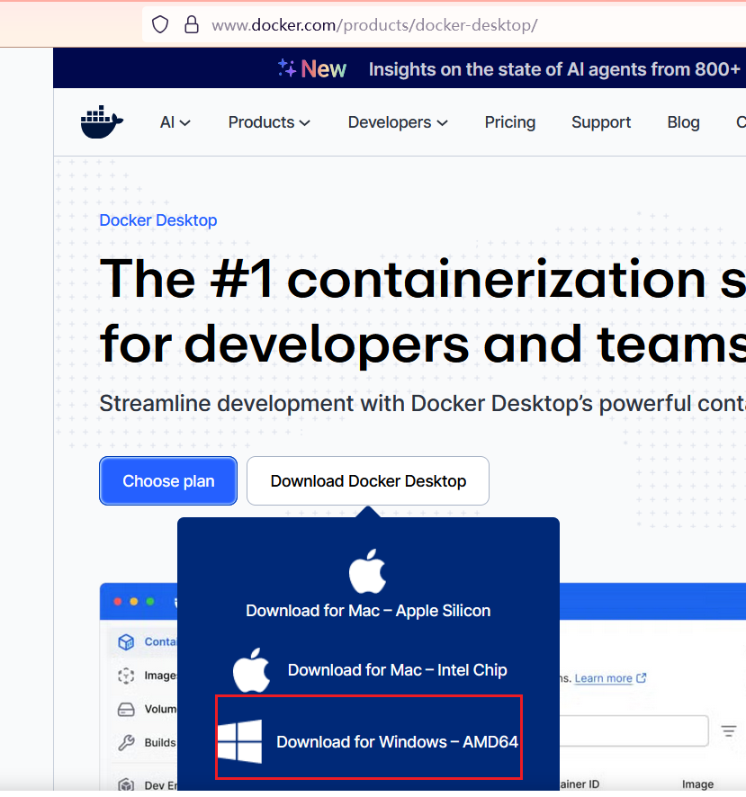

参考：https://www.runoob.com/docker/docker-desktop.html

## 安装 Docker Desktop

### 系统要求

- macOS（Apple Silicon / Intel）
- Windows 10 / 11（建议 WSL2）
- 至少 4GB 内存（推荐 8GB+）

下载 Docker Desktop 安装包，下载地址：https://www.docker.com/products/docker-desktop/

