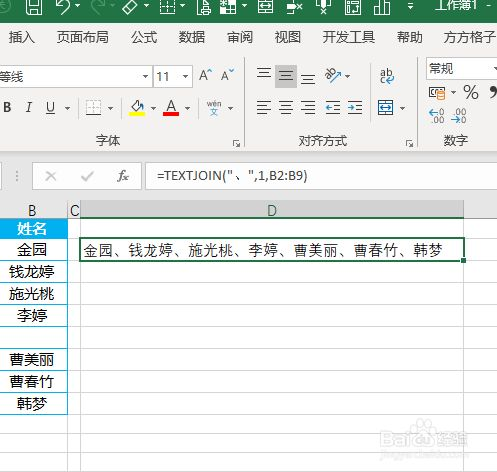
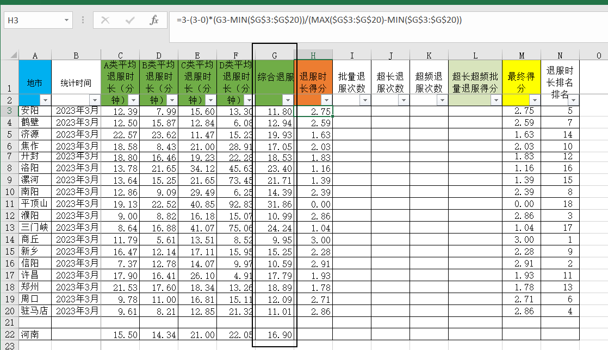
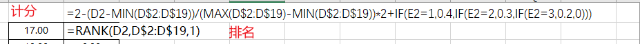

# excel笔记

## 一、常用函数

### 1、日期格式转化文本格式

​	=TEXT(单元格,"YYYYMMDD") 

​	举例：2022-2-1 转化后 20220201

### 2、连接文本

=TEXTJOIN(分隔符,TRUE,需要合并的字符串区域或列表，需要合并的字符串区域或列表，)

举例：

### 3、筛选特定行特定列的值

|         函数          |             意义             |
| :-------------------: | :--------------------------: |
|  ‘=INDEX(A1:C4,1,1)   | 填充A1:C4区域，1行1列内容）  |
| ‘=MATCH(A10,A1:A7,0） | 提取A1:A7区域，A10内容所在行 |
| ’=MATCH(A11,A1:E1,0)  | 提取A1:E1区域，A11内容所在列 |

### 4、快捷sheet翻页

Ctrl + PgUp / Ctrl + PgDn

### 5、根据指标线性排名

### 6、求和SUM应用

- SUM：SUM（数据1，数据2，数据3，...）

- SUMIF：SUMIF(条件区域，条件，求和区域）

- SUMIFS：SUMIFS(求和区域，条件区域1，条件1，条件区域2，条件2，.....)

## 7、计数COUNT应用

- COUNTIF：对满足多个条件的单元格计数
- COUNTIFS：COUNTIFS(条件区域1,条件1,[条件区域2,条件2],…)