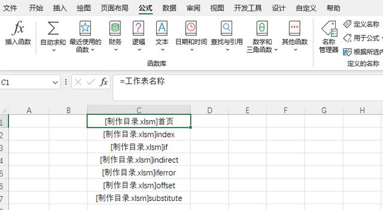

# excel笔记

## 一、常用函数

### 1、日期格式转化文本格式

​	=TEXT(单元格,"YYYYMMDD") 

​	举例：2022-2-1 转化后 20220201

### 2、连接文本

=TEXTJOIN(分隔符,TRUE,需要合并的字符串区域或列表，需要合并的字符串区域或列表，)

举例：

### 3、筛选特定行特定列的值

|         函数          |             意义             |
| :-------------------: | :--------------------------: |
|  ‘=INDEX(A1:C4,1,1)   | 填充A1:C4区域，1行1列内容）  |
| ‘=MATCH(A10,A1:A7,0） | 提取A1:A7区域，A10内容所在行 |
| ’=MATCH(A11,A1:E1,0)  | 提取A1:E1区域，A11内容所在列 |

### 4、快捷sheet翻页

Ctrl + PgUp / Ctrl + PgDn

### 5、根据指标线性排名

### 6、求和SUM应用

- SUM：SUM（数据1，数据2，数据3，...）

- SUMIF：SUMIF(条件区域，条件，求和区域）

- SUMIFS：SUMIFS(求和区域，条件区域1，条件1，条件区域2，条件2，.....)

### 7、计数COUNT应用

- COUNTIF：对满足多个条件的单元格计数
- COUNTIFS：COUNTIFS(条件区域1,条件1,[条件区域2,条件2],…)

### 8、制作带超链接的工作表目录

其实，右键点击EXCEL表格左下方区域就可以显示出工作表目录，双击工作表名称就可以跳转。制作工作表目录一是有时候的确需要书面目录或打印，二是纯粹对EXCEL的兴趣爱好。

**第一步，自定义名称**

点击工具栏公式→定义名称，在弹窗中的名称栏内输入“工作表名称”（自己随意定义），然后在引用位置输入：

=index(get.workbook(1),row(a1))

get.workbook(1)是宏表函数，在这里是返回工作簿中所有工作表的名称，使用INDEX函数按顺序逐个提取工作表名称。

在任意单元格内输入：=工作表名称，下拉，这样就做成了一个没有超链接的工作表目录，但这个目录前面是带有工作簿名称的。如下：

**第二步，制作超链接的工作表目录**

在首页工作表B2单元格（即目录所在位置）内输入：

=IFERROR(HYPERLINK(工作表名称&"!a1",MID(工作表名称,FIND("]",工作表名称)+1,50)),"")

下拉，带超链接的工作表目录就完成了：

式中，HYPERLINK 函数的第一个参数：工作表名称&"!a1"，表示链接到每个工作表的A1单元格；

使用mid和find函数将工作表名称中的工作簿名称去掉，即先找到工作表名称中“]”字符，然后提取之后的字符。