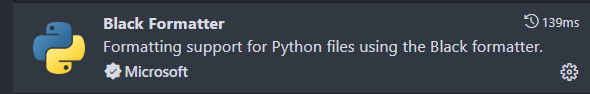
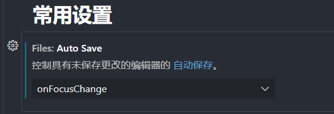
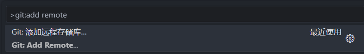

# 插件

## Error Lens插件

是一款把代码检查（错误、警告、语法问题）进行突出显示的一款插件


## Mypy Type Checker

静态类型检查工具


```
 // 配置
 "mypy-type-checker.importStrategy": "useBundled",
    "mypy-type-checker.args": [
        "--follow-imports=skip",
        "--ignore-missing-imports",
        "--show-column-numbers",
        "--allow-untyped-defs",
        "--allow-subclassing-any",
        "--allow-untyped-calls",
        "--no-warn-no-return"
    ],
```

```
在Python中，#typeQ:ignore是一种类型注释，用于告诉Mypy类型检查器忽略特定的代码行或代码块。
当你在代码中使用# type: ignore 时，Mypy将不会对该行或块进行类型检查。
```


## One Dark Pro

颜色主题插件


## Live Server

实时加载功能的小型服务器插件


## Chinese (Simplified) (简体中文) 

界面汉化插件


## vscode-icons

 设置文件图标主题


## autoDocstring

实现函数注释


## Todo Tree

 实现TODO 标签功能


## Markdown Preview Enhanced 

实现Markdown的一些功能


## indent-rainbow 

缩进渲染


```
// 取消插件indent-Rainbow缩进渲染报错
"indentRainbow.ignoreErrorLanguages": [
"python"
]
```

## Black Formatter

自动格式化 Python 代码，不好用



```
// 启用black格式化插件
"editor.defaultFormatter": "ms-python.black-formatter",

//  禁止单双引号替换 --skip-string-normalization
"black-formatter.args": ["--skip-string-normalization","--line-length","88"],
```

## isort

对py文件中的import排序


```
 # 配置为Black的规则
 "isort.args":["--profile", "black"],
```

## Pylint

Python代码静态分析工具。它能够检查代码质量、潜在错误、代码风格、复杂度等多个方面


```
"pylint.importStrategy": "useBundled",
"pylint.args": [
        "--disable=invalid-name,missing-module-docstring",
        "--disable=W0612,W0631,W0703,W0621,W0613,W0611,W1308,C0411,C0111,C0103,C0301,C0304,C0305,E1101,R0913,R0914,R0915,R0903" ,
    ]
```

## Pylance

Python 语言服务器，可以利用语言服务器协议与 VS Code 进行通信。


# 配置

2种方式：本项目设置、全局设置

## 保存自动格式化文件


## 代码缩进字符修改


## python 文件头模板

	// python 文件头模板
	"HEADER": {
		"prefix": "header",
		"body": [
			"#!/usr/bin/env python",
			"# -*- encoding: utf-8 -*-",
			"# @File    :   $TM_FILENAME",
			"# @Time    :   $CURRENT_YEAR/$CURRENT_MONTH/$CURRENT_DATE $CURRENT_HOUR:$CURRENT_MINUTE:$CURRENT_SECOND",
			"# @Author  :   978345836@qq.com",
			"# @Version :   1.0",
			"# @Describe:   None",
			"",
			"# here put the import lib",
			"$0"

## 自动保存



# 快捷操作：

```
Alt + ↑/↓  移动行
Ctrl + C 复制行
Ctrl + V 粘贴行
Ctrl + 单击 多光标选择
Ctrl + D 添加下一个匹配项
```


# 创建虚拟环境

## venv方式


# git 使用

### 配置git.exe

注：不能配置到项目目录下，配置在用户配置下


### 配置本地仓库


### 配置远程仓库




### 项目配置文件

`.gitignore`

忽略提交

```
# pycharm 自动生成的目录
.idea/

# python缓存文件
__pycache__/
*.py[cod]
*.$py.calss

# 配置文件
.vscode
.gitignore
# 数据文件
*.db

# Django stuff:
local_settings.py
*.sqlite3

# database migrations
**/migrations/*.py
!**/migrations/__init__.py

# 临时文件
1.*
*.xlsx
项目不相关文件，临时
```

