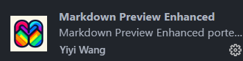

# 插件

## Error Lens插件

是一款把代码检查（错误、警告、语法问题）进行突出显示的一款插件


## One Dark Pro

颜色主题插件


## Live Server

实时加载功能的小型服务器插件


## Chinese (Simplified) (简体中文) 

界面汉化插件


## vscode-icons

 设置文件图标主题


## autoDocstring

实现函数注释


## Todo Tree

 实现TODO 标签功能


## Markdown Preview Enhanced 

实现Markdown的一些功能




## indent-rainbow 

缩进渲染


```
// 取消插件indent-Rainbow缩进渲染报错
"indentRainbow.ignoreErrorLanguages": [
"python"
]
```


# 配置

2种方式：本项目设置、全局设置

## 保存自动格式化文件


## 代码缩进字符修改


## python 文件头模板

	// python 文件头模板
	"HEADER": {
		"prefix": "header",
		"body": [
			"#!/usr/bin/env python",
			"# -*- encoding: utf-8 -*-",
			"# @File    :   $TM_FILENAME",
			"# @Time    :   $CURRENT_YEAR/$CURRENT_MONTH/$CURRENT_DATE $CURRENT_HOUR:$CURRENT_MINUTE:$CURRENT_SECOND",
			"# @Author  :   978345836@qq.com",
			"# @Version :   1.0",
			"# @Describe:   None",
			"",
			"# here put the import lib",
			"$0"


# 快捷操作：

```
Alt + ↑/↓  移动行
Ctrl + C 复制行
Ctrl + V 粘贴行
Ctrl + 单击 多光标选择
Ctrl + D 添加下一个匹配项
```


# 创建虚拟环境

## venv方式


