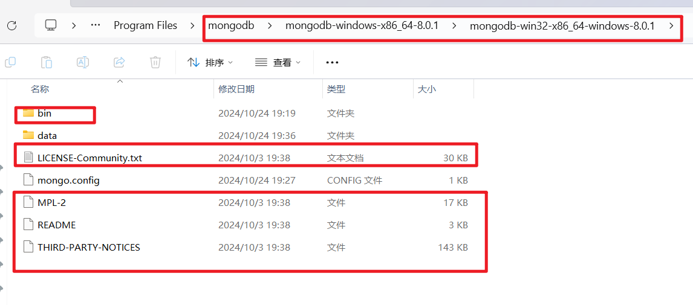
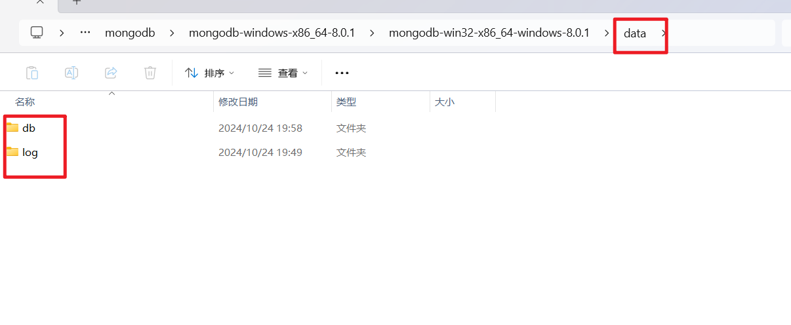
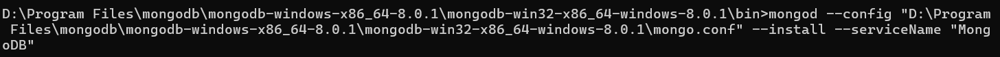
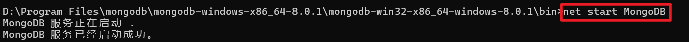

下载

https://www.mongodb.com/try/download/community

## 安装：

### 准备

任一磁盘创建空文件夹（不要使用中文路径），解压之后把文件夹内容剪切进去



手动创建 data 文件夹，db、log子文件夹



### 注册服务

cmd管理员进入到bin目录

```
mongod --config "D:\Program Files\mongodb\mongodb-windows-x86_64-8.0.1\mongodb-win32-x86_64-windows-8.0.1\mongo.conf" --install --serviceName "MongoDB"
```



### 启动服务

```
net start MongoDB
```



### 关闭服务

```
net stop MongoDB
```

### 卸载服务

```
mongod --remove --serviceName "MongoDB"
```

### 创建超级管理员

输入创建用户命令，返回1说明成功

```
#默认好像是当前数据库的权限，但是可以通过这个来指定数据库（没试过）
db.createUser({user:"admin",pwd:"123456",roles:[{role:"root",db:"admin"}]})
# 命令行登录
db.auth("admin","123456")
```

### 创建普通用户

用户admin1 在admin1库只有读权限， 在admin2库有读写权限

```
db.createUser({user:"admin1",pwd:"123456",roles:[{role:"read",db:"admin1"},{role:"readWrite",db:"admin2"}]})
```

### 删除用户

```
db.dropUser("admin1")
```

