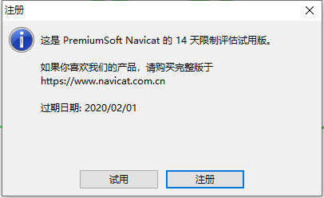

# 一、下载MyQSL

## 1.官网 https://dev.mysql.com


## 2.借助迅雷 下载

## 3.卸载MYSQL执行下面命令:DOS下

\>mysqld -remove mysql

## 4.注册服务，进入MySQL的bin目录

在命令行窗口输入：mysqld --install，回车，提示：Service successfully installed，说明注册服务成功。

```
# 注册服务，指明配置文件
mysqld --install MySQL --defaults-file="D:\Program Files\MySQL\my.ini"
```

my.ini

```
[client]
	# 设置mysql客户端默认字符集
	default-character-set=utf8mb4
[mysqld]
	# 解除group_conca长度限制
	group_concat_max_len=888888
	#设置3306端口
	port = 3306 
	# 设置mysql的安装目录
	basedir=D:\Program Files\mysql-8.0.25-winx64\mysql-8.0.25-winx64
	# 设置mysql数据库的数据的存放目录
	datadir=D:\Program Files\mysql-8.0.25-winx64\mysql-8.0.25-winx64\data
	# 允许最大连接数
	max_connections=200
	# 服务端使用的字符集默认为8比特编码的latin1字符集
	character-set-server=utf8mb4
	# 创建新表时将使用的默认存储引擎
	default-storage-engine=INNODB
	# BLOB配置
	max_allowed_packet=1G
	wait_timeout=2880000
	interactive_timeout = 2880000

```

服务启动失败解决办法：

regedit注册表

```
# 注册表配置
"D:\Program Files\MySQL\mysql-8.0.29-winx64\bin\mysqld" -- defaults-file="D:\Program Files\MySQL\my.ini" MySQL29
```


## 5、获取初始密码，以管理员的身份打开cmd命令窗口

使用mysqld --initialize --console命令，生成随机密码  qazwsx W;o1DHh*!wL,  29 oB/pCfK4E8q2

## 6、启动服务 **net start mysql**	net stop mysql(停止服务)  sc delete mysql删除服务

## 7、使用随机密码登录 ： mysql -u root -p  

## 8、修改登陆密码

ALTER USER USER() IDENTIFIED BY '新密码'；

## 9、退出MySQL

\q;

# 二、Navicat for MySQL 15获取注册激活码的教程

## 1.下载Navicat for MySQL 15

https://www.navicat.com.cn/download/navicat-for-mysql 

## 2.下载激活工具

https://pan.baidu.com/s/1QxxM72CC51lFuOld_GwQlA 提取码 j649

## 3.安装Mavicat，按步骤安装即可，安装完毕后先不要打开软件，断开网络连接，将激活工具复制到Navicat安装路径下，以管理员身份运行。

在弹出界面选择Navicat 15 Products选择MySQL，Languages选择Simplefied Chinese 点击Patch，如下：


## 4.打开Navicat，点击注册



## 5.返回到激活工具界面，点击Generate会自动填写注册码到软件输入框（如果自动填写的激活码不能激活，即激活码自动填写好显示“x”，说明版本不对，我将products项的“MySQL”改成默认的“Premium”，然后在获取激活码就可以了）


## 6.在点击激活按钮，点击手动激活

 

## 7.将请求码复制到激活工具的文本框中，点击Generate激活码会自动填写到Navicat激活码文本框中，点击激活即可。


**备注：二次安装激活失败，修改电脑系统时间，激活后重启电脑。**

 