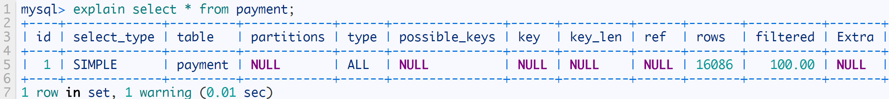

# 一、基础知识

[彭珂的课堂](https://haokan.baidu.com/author/1626161619554481)   https://haokan.baidu.com/author/1626161619554481

https://zhuanlan.zhihu.com/p/21677363

## 1.1 **MySQL 数据类型**

**数值类型**

| **类型**     | **大小**                                 | **范围（有符号）**                                           | **范围（无符号）**                                           | **用途**        |
| ------------ | ---------------------------------------- | ------------------------------------------------------------ | ------------------------------------------------------------ | --------------- |
| TINYINT      | 1 字节                                   | (-128，127)                                                  | (0，255)                                                     | 小整数值        |
| SMALLINT     | 2 字节                                   | (-32 768，32 767)                                            | (0，65 535)                                                  | 大整数值        |
| MEDIUMINT    | 3 字节                                   | (-8 388 608，8 388 607)                                      | (0，16 777 215)                                              | 大整数值        |
| INT或INTEGER | 4 字节                                   | (-2 147 483 648，2 147 483 647)                              | (0，4 294 967 295)                                           | 大整数值        |
| BIGINT       | 8 字节                                   | (-9,223,372,036,854,775,808，9 223 372 036 854 775 807)      | (0，18 446 744 073 709 551 615)                              | 极大整数值      |
| FLOAT        | 4 字节                                   | (-3.402 823 466 E+38，-1.175 494 351 E-38)，0，(1.175 494 351 E-38，3.402 823 466 351 E+38) | 0，(1.175 494 351 E-38，3.402 823 466 E+38)                  | 单精度 浮点数值 |
| DOUBLE       | 8 字节                                   | (-1.797 693 134 862 315 7 E+308，-2.225 073 858 507 201 4 E-308)，0，(2.225 073 858 507 201 4 E-308，1.797 693 134 862 315 7 E+308) | 0，(2.225 073 858 507 201 4 E-308，1.797 693 134 862 315 7 E+308) | 双精度 浮点数值 |
| DECIMAL      | 对DECIMAL(M,D) ，如果M>D，为M+2否则为D+2 | 依赖于M和D的值                                               | 依赖于M和D的值                                               | 小数值          |

 

**日期和时间类型**

TIMESTAMP类型有专有的自动更新特性。

| **类型**  | **大小**** ****(字节)** | **范围**                                                     | **格式**            | **用途**                 |
| --------- | ----------------------- | ------------------------------------------------------------ | ------------------- | ------------------------ |
| DATE      | 3                       | 1000-01-01/9999-12-31                                        | YYYY-MM-DD          | 日期值                   |
| TIME      | 3                       | '-838:59:59'/'838:59:59'                                     | HH:MM:SS            | 时间值或持续时间         |
| YEAR      | 1                       | 1901/2155                                                    | YYYY                | 年份值                   |
| DATETIME  | 8                       | 1000-01-01 00:00:00/9999-12-31 23:59:59                      | YYYY-MM-DD HH:MM:SS | 混合日期和时间值         |
| TIMESTAMP | 4                       | 1970-01-01 00:00:00/2038结束时间是第 **2147483647** 秒，北京时间 **2038-1-19 11:14:07**，格林尼治时间 2038年1月19日 凌晨 03:14:07 | YYYYMMDD HHMMSS     | 混合日期和时间值，时间戳 |

 

**字符串类型**

| **类型**   | **大小**            | **用途**                        |
| ---------- | ------------------- | ------------------------------- |
| CHAR       | 0-255字节           | 定长字符串                      |
| VARCHAR    | 0-65535 字节        | 变长字符串                      |
| TINYBLOB   | 0-255字节           | 不超过 255 个字符的二进制字符串 |
| TINYTEXT   | 0-255字节           | 短文本字符串                    |
| BLOB       | 0-65 535字节        | 二进制形式的长文本数据          |
| TEXT       | 0-65 535字节        | 长文本数据                      |
| MEDIUMBLOB | 0-16 777 215字节    | 二进制形式的中等长度文本数据    |
| MEDIUMTEXT | 0-16 777 215字节    | 中等长度文本数据                |
| LONGBLOB   | 0-4 294 967 295字节 | 二进制形式的极大文本数据        |
| LONGTEXT   | 0-4 294 967 295字节 | 极大文本数据                    |

------

### 1.2 BLOB介绍

### 1.2.1 MySQL的四种BLOB类型

  类型 大小(单位：字节)
　　1.TinyBlob 最大 255
　　2.Blob 最大 65K
　　3.MediumBlob 最大 16M
　　4.LongBlob 最大 4G
　　

### 1.2.2 配置修改

在BLOB中存储大型文件，MYSQL提供了很强的灵活性！允许的最大文件大小，可以在配置文件中设置。
1）Windows中在文件my.ini中配置(在系统盘)
[mysqld]
set-variable = max_allowed_packet=10M
2）linux通过etc/my.cnf
[mysqld]
max_allowed_packet = 10M

## 1.2 编码介绍:

1.2.1 GBK、UTF-8、UTF8MB4

```
GBK和UTF-8
GBK:
GBK是在国家标准GB2312基础上扩容后兼容GB2312的标准（好像还不是国家标准）。GBK编码专门用来解决中文编码的，是双字节的。不论中英文都是双字节的。
UTF－8
UTF－8 编码是用以解决国际上字符的一种多字节编码，它对英文使用8位（即一个字节），中文使用24位（三个字节）来编码。对于英文字符较多的论坛则用UTF－8 节省空间。另外，如果是外国人访问你的GBK网页，需要下载中文语言包支持。访问UTF-8编码的网页则不出现这问题。可以直接访问。
UTF8MB4
Emoji 表情（Emoji 是一种特殊的 Unicode 编码，常见于 ios 和 android 手机上），和很多不常用的汉字，以及任何新增的 Unicode 字符等等。
区别：
GBK包含全部中文字符；
UTF-8则包含全世界所有国家需要用到的字符；
UTF8MB4支持4字节，常见就是Emoji表情的存储；
```


# 二、数据库

        *CREATE DATABASE 数据库名 【创建数据库】
        *create database <数据库名> character set <字符集> COLLATE <排序规则>【创建数据库时指定数据库的字符集】
        *show databases 【查看存在的数据库】
        *drop database <数据库名> 【删除数据库】
        *USE 库名  【进入数据库】
        *show tables 【显示数据库所有数据表】
    	*Select Database() 【查看当前所在数据库 】

​    创建数据库示例：

```SQL
CREATE DATABASE `ss` CHARACTER SET 'utf8mb4' COLLATE 'utf8mb4_general_ci';
```


## 2.1 用户权限


## 2.2 用户权限配置


# 三、数据表

```
*DESC <表名> 【查看表结构】 http://c.biancheng.net/view/7199.html
```

## 3.1 表连接

INNER JOIN（内连接,或等值连接）：获取两个表中字段匹配关系的记录。同WHERE表关联

LEFT JOIN（左连接）：获取**左表**所有记录，即使**右表**没有对应匹配的记录。

RIGHT JOIN（右连接）： 与 LEFT JOIN 相反，用于获取右表所有记录，即使左表没有对应匹配的记录。

select * from 左表 as left_table left join 右表 as right_table on left_table.dept_id = right_table.id

WHERE表关联 select * from person as left_table,dept as right_table where left_table.dept_id = right_table.id;

## 3.2 查询

```sql
*数据表查询	SELECT 列名 FROM 表名 where 条件  LIMIT 返回记录数

--单表查询
#整表查询
SELECT * FROM 表名
#单列查询
SELECT 列名 FROM 表名
# 部分查询--使用WHERE限制查询行（列为空is NULL）
--多表查询
SELECT x.GCI,v.子网ID,u.行政区域,w.营业部,s.网元ID,s.基站编号 
FROM `5g工参信息现网x` as x  
INNER JOIN `子网idv` as v ON v.序号 =  x.子网 
INNER JOIN `行政区u` AS u ON u.序号 = x.行政区域
INNER JOIN `营业部w` AS w ON  w.序号 = x.营业部
INNER JOIN `网元信息s` AS s ON s.序号=x.gNBID
WHERE GCI = "4849669-0";

# 条件语句查询,当id 为1时,2倍value,当id为2时,3倍value,当为其它时,4倍value
select id,name,case id when 1 then value * 2
					   when 2 then value * 3
					   else value *4
					   end as "value_if"
from tble;
```

## 3.3 更新

```SQL
*更新数据 	UPDATE 表名 SET 更新列名=更新值

--单表更新
#更新单表单行单列值
UPDATE `小区信息t` as t set t.物理点= 3 WHERE t.序号=3;
#更新单个表单行两列值
UPDATE  `小区信息t` as t set t.物理点= 3 ,t.bbu= 3 WHERE t.序号=2;
#更新单个表两行单列值--需要借助辅助表多表更新
--多表更新
----2张表更新
#更新单列
UPDATE  `小区信息t` AS t
INNER JOIN `基站信息表j` AS j	on t.物理点 = j.基站名称
SET t.物理点=j.序号;
#更新 2列
UPDATE  `小区信息t` AS t
INNER JOIN `基站信息表j` AS j	on t.物理点 = j.基站名称
INNER JOIN `网元信息s` AS s	on t.BBU = s.网元名称
SET t.物理点=j.序号,t.BBU = s.序号;
#3张表更新3列
UPDATE dayworkplan as d 
INNER JOIN information_cell as c on d.站号小区标识=c.GCI
INNER JOIN information_gnb as g on c.`基站名称`=g.`序号`
set d.pci=c.pci,d.`经度`=g.`AAU经度`,d.`纬度`=g.`AAU纬度`
WHERE d.pci is null and d.`经度` is null
```

## 3.4 添加数据

两者的主要区别为：
 **select into from ： 要求目标表不存在**。

即，查询出来结果-->复制一张同结构的空表-->将数据拷贝进去。

**insert into select from** ： 要求目标表存在。

即，查询出数据-->将数据插入到目标表。

```SQL
#插入一行数据
 INSERT INTO  表名 ( 列名 ) VALUES(列对应的值)
#插入一列数据
INSERT INTO 临时表(id) SELECT i.gNBID FROM information_bbu as i WHERE i.`子网` is null
#建好的表中添加一列：
alter table TABLE_NAME add column NEW_COLUMN_NAME varchar(20) not null;
这条语句会向已有的表中加入新的一列，这一列在表的最后一列位置。如果我们希望添加在指定的一列，可以用：
alter table TABLE_NAME add column NEW_COLUMN_NAME varchar(20) not null after COLUMN_NAME;
注意，上面这个命令的意思是说添加新列到某一列后面。如果想添加到第一列的话，可以用：
alter table TABLE_NAME add column NEW_COLUMN_NAME varchar(20) not null first;
#多表插入数据
-- INSERT INTO  表名 ( 列名 ) VALUES(列对应的值)
INSERT INTo dayworkplan(基站类型,站号小区标识,站名,cellname) SELECT  CONCAT(b.制式,b.`站型`),b.`站号小区号`,b.`站名`,b.`小区名`   FROM basworkpro as b WHERE b.单验日期='未开始安排';
# 插入数据
replace into
```

### 3.4.1 复制表

```SQL
1、复制表结构及数据到新表
CREATE TABLE 新表 SELECT * FROM 旧表
新表中没有了旧表的primary key、Extra（auto_increment）等属性
2、只复制表结构到新表
CREATE TABLE 新表 SELECT * FROM 旧表 WHERE 1=2
或CREATE TABLE 新表 LIKE 旧表
3、复制旧表的数据到新表(假设两个表结构一样)
INSERT INTO 新表SELECT * FROM 旧表
4、复制旧表的数据到新表(假设两个表结构不一样)
INSERT INTO 新表(字段1,字段2,.......) SELECT 字段1,字段2,...... FROM 旧表
5、可以将表1结构复制到表2
SELECT * INTO 表2 FROM 表1 WHERE 1=2
6、可以将表1内容全部复制到表2
SELECT * INTO 表2 FROM 表1
7、 show create table 旧表;
这样会将旧表的创建命令列出。我们只需要将该命令拷贝出来，更改table的名字，就可以建立一个完全一样的表
8、mysqldump
用mysqldump将表dump出来，改名字后再导回去或者直接在命令行中运
9、复制旧数据库到新数据库（复制全部表结构并且复制全部表数据）
#mysql -u root -ppassword
>CREATE DATABASE new_db;
#mysqldump old_db -u root -ppassword--skip-extended-insert --add-drop-table | mysql new_db -u root -ppassword
10、表不在同一数据库中（如，db1 table1, db2 table2)
sql: insert into db1.table1 select * from db2.table2 (完全复制)
insert into db1.table1 select distinct * from db2.table2(不复制重复纪录）
insert into tdb1.able1 select top 5 * from db2.table2 (前五条纪录)
```

## 3.5 删除

```SQL
* 删除数据	DELETE FROM 表名 where 条件

DELETE FROM 表名【清空表】
truncate  table 表名【清空表】
DROP TABLE 表名  【删除数据表】

```

## 3.6 新建表

```SQL
*创建数据表 CREATE TABLE IF NOT EXISTS (相关设置)

CREATE TABLE IF NOT EXISTS 表名(
id INT UNSIGNED AUTO_INCREMENT(自增) COMMENT '主键id',
列名 字符类型(大小) 是否为空（NOT NULL) COMMENT (注释),
 address VARCHAR(40) NOT NULL COMMENT '住址',
create_date DATE COMMENT '创建时间',
 PRIMARY KEY ( id ) 定义列为主键
 )ENGINE(设置存储引擎）=InnoDB DEFAULT CHARSET(设置编码）=utf8mb4;
```

## 3.7 数据处理

### 3.7.1 数据统计

统计计数COUNT**、**平均值AVG**、**求和SUM**、**最大值MAX**、**最小值MIN

- 计数COUNT

​		计数  SELECT COUNT(*) FROM 表名 WHERE 条件 

```
#计算列为空个数
SELECT count(*) FROM information_bbu WHERE 子网 is NULL;
```

- 平均值AVG

​		平均值 SELECT AVG(列名) FROM 表名 WHERE 条件

### 3.7.2 去重复值 -DISTINCT函数

SELECT ==DISTINCT 列名== FROM 表名 WHERE address IS NOT NULL

### 3.7.3 字符拼接-CONCAT函数

SELECT ==CONCAT('姓名：',name,'的地址是江西')== AS '地址信息' FROM user WHERE address = '江西'

### 3.7.4 判断第一个表达式是否为 NULL-IFNULL

==IFNULL()== 函数用于判断第一个表达式是否为 NULL，如果为 NULL 则返回第二个参数的值，如果不为 NULL 则返回第一个参数的值

### 3.7.5 分组（透视）-GROUP BY

分组（透视）	SELECT 分组列 FROM 表名 GROUP BY 分组列;

### 3.7.6 字段排序 -ORDER By 

desc 降序

asc 升序，默认

```
ORDER BY  nr_zb.`日期` Asc
```

### 3.7.7 关联表删除特定行-DELETE

```
DELETE nr
FROM  `nr宏站单验跟踪表` as nr
INNER JOIN (SELECT bu.cellname FROM `0不符合单验明细` as bu WHERE bu.`基站名称` is null)  as q on q.cellname=nr.cellname
WHERE  nr.cellname = q.cellname
```

### 3.7.8 提取字符-SUBSTRING_INDEX

```
**SUBSTRING_INDEX(s, delimiter, number)**

**s 为需要分列的字段**

**delimiter 为分隔符**

**number则表示在取第几个分隔符旁边的字段**
```

### 3.7.9 根据指定字符分割成多条数据(一行变多行)

```SQL
select distinct  substring_index( substring_index( a.需要拆分的字段名, ',', b.help_topic_id + 1 ), ',',- 1 ) as name
from 表名 a
join mysql.help_topic b ON b.help_topic_id < ( length( a.需要拆分的字段名 ) - length( replace( a.需要拆分的字段名, ',', '' ) ) + 1 ) 
where a.tt_id =1

-- ( length( a.需要拆分的字段名 ) - length( replace( a.需要拆分的字段名, ',', '' ) ) + 1 ),计算需要分割次数
-- length( a.需要拆分的字段名 )，计算表格字节数
-- mysql.help_topic，mysql系统表（mysql 默认自增序列表），这里的作用借助此表id自增特性
-- substring_index() （mysql  拆分函数）
-- substring_index( a.需要拆分的字段名, ',', b.help_topic_id + 1 )，b.help_topic_id 变量
```

### 3.7.10 将多行数据合并成一行数据

一个字段可能对应多条数据，用mysql实现将多行数据合并成一行数据

例如：一个活动id（activeId）对应多个模块名（modelName）,按照一般的sql语句：

```
1 SELECT am.activeId,m.modelName 
2 FROM activemodel am 
3 JOIN  model m 
4 ON am.modelId = m.modelId 
5 ORDER BY am.activeId
```

查询出的列表为图1所示：


　　　　　　图1

修改过后的sql语句，查询后如图2所示：

```
1 SELECT am.activeId,GROUP_CONCAT(m.modelName SEPARATOR ',') modelName
2 FROM activemodel am 
3 JOIN model m 
4 ON am.modelId=m.modelId
5 WHERE m.valid=1
6 GROUP BY am.activeId
```

需注意：

1.GROUP_CONCAT（）中的值为你要合并的数据的字段名;

　SEPARATOR 函数是用来分隔这些要合并的数据的；

　' '中是你要用哪个符号来分隔；

2.必须要用GROUP BY 语句来进行分组管理，不然所有的数据都会被合并成一条记录，如图3


　　　　　　　　　　　　图2

 


### 3.7.11 MySQL 对查询的结果集添加自增序号

```
第一种：
select  (@i:=@i+1)  as i, emp.*  from emp,  (select @i:=0) as it 

第二种：
set @n = 0;
select  (@n := @n + 1) as usid ,id,company_id,department_code from sys_user ;
```

### 3.7.12 字符串截取

> MySQL 字符串截取函数：left(), right(), substring()，常用方法。

1. 左边字符串截取：left(str, length)

   ```
   left(字符串, 3)
   ```

2. 右边字符串截取：right(str, length)

   ```
   right(字符串, 3)
   ```

3. 字符串截取：substring(str, pos); substring(str, pos, len)

- 3.1 从字符串的第 4 个字符位置开始取，直到结束。

  ```
  substring(字符串, 4)
  ```

- 3.2 从字符串的第 4 个字符位置开始取，只取 2 个字符。

  ```
  substring(字符串, 4, 2)
  ```

- 3.3 从字符串的第 4 个字符位置（倒数）开始取，直到结束。

  ```
  substring(字符串, -4)
  ```

- 3.4 从字符串的第 4 个字符位置（倒数）开始取，只取 2 个字符。

  ```
  substring(字符串, -4, 2)
  ```

### 3.7.13 13.批量更新（查询）数据-CASE

CASE...WHEN语句的涵义与一般高级语言中的SWITCH...CASE语句类似，

如下所示，即：在`表名`表中，当字段`字段3`的值为'值X'时，修改`字段1`与`字段2`的值为'结果X'和'结果X'。

第一种方式

```
UPDATE `表名` SET
        `字段1` = CASE `字段3`
        WHEN '值1' THEN '结果1'
        WHEN '值2' THEN '结果2'
        WHEN '值3' THEN '结果3'
    END,
        `字段2` = CASE `字段3`
        WHEN '值1' THEN '结果4'
        WHEN '值2' THEN '结果5'
        WHEN '值3' THEN '结果6'
    END
WHERE `字段3` IN ('值1', '值2', '值3');
```

第二种方式

```
UPDATE `表名` SET
        `字段1` = CASE 
        WHEN `字段3` = '值1' THEN '结果1'
        WHEN `字段3` = '值2' THEN '结果2'
        WHEN `字段3` = '值3' THEN '结果3'
    END;
```

```
SELECT 字段2，字段3，
	`字段1` = CASE 
        WHEN `字段3` = '值1' THEN '结果1'
        WHEN `字段3` = '值2' THEN '结果2'
        WHEN `字段3` = '值3' THEN '结果3'
        ELSE '--'
    END
FROM `表名`;
```

案例：

```sql
SELECT `ta`.`账期月份`, `ta`.`运营商地市`,
	sum( `ta`.`产品服务费合计（出账费用）（不含税）` ) AS `塔类&非标出账`,
	sum( CASE `ta`.`业务属性` WHEN '塔' THEN ta`.`产品服务费合计（出账费用）（不含税）` END ) AS `塔类出账`,
	sum( CASE `ta`.`业务属性` WHEN '非标类' THEN `ta`.`产品服务费合计（出账费用）（不含税）` END )) AS `非标出账`,
	sum( `ta`.`油机发电服务费（包干）（出账费用）` ) AS `油机发电服务费（包干）`,
	sum( `ta`.`油机发电服务费（非包干）（出账费用）` ) AS `油机发电服务费（非包干）` 
FROM `铁塔费用_原始数据v1`  AS `ta` 
GROUP BY `ta`.`账期月份`, `ta`.`运营商地市` 					
```

### 3.7.14 自动获取日期

括号中为当天时间的前一天，如果统计前几天就将括号中的 '1' 改成相应的天数。如果要算月或年，直接将day改为month或year即可

```mysql
date_sub(curdate(),interval 1 day)
```

### 3.7.15 避免插入重复数据

参考：https://blog.csdn.net/m0_52217130/article/details/128724926

最常见的方式就是为字段设置主键或唯一索引，当插入重复数据时，抛出错误，程序终止，但这会给后续处理带来麻烦，因此需要对插入语句做特殊处理，尽量避开或忽略异常

#### insert ignore into

即插入数据时，如果数据存在，则忽略此次插入，前提条件是插入的数据字段设置了主键或唯一索引，测试SQL语句如下，当插入本条数据时，MySQL数据库会首先检索已有数据（也就是idx_username索引），如果存在，则忽略本次插入，如果不存在，则正常插入数据：


#### on duplicate key update

即插入数据时，如果数据存在，则执行更新操作，前提条件同上，也是插入的数据字段设置了主键或唯一索引，测试SQL语句如下，当插入本条记录时，MySQL数据库会首先检索已有数据（idx_username索引），如果存在，则执行update更新操作，如果不存在，则直接插入：


#### replace into

即插入数据时，如果数据存在，则删除再插入，前提条件同上，插入的数据字段需要设置主键或唯一索引，测试SQL语句如下，当插入本条记录时，MySQL数据库会首先检索已有数据（idx_username索引），如果存在，则先删除旧数据，然后再插入，如果不存在，则直接插入：


#### insert if not exists

即 `insert into … select … where not exist ...` ，这种方式适合于插入的数据字段没有设置主键或唯一索引，当插入一条数据时，首先判断MySQL数据库中是否存在这条数据，如果不存在，则正常插入，如果存在，则忽略：


### 3.7.16 数据的导入

#### **第一种情况：导入部分不包含中文字体**

```
load data infile "文件绝对路径" 	导入文件
into table "表名" 			   目标表
fields terminated by ',' 		每个具体字段内容之间是以逗号隔开的
optionally enclosed by '"' 		描述的是字段的括起字符，就是说字段中如果有引号，就当做是字段的一部分
escaped by '"'					描述的是转义字符。默认的是反斜杠
lines terminated by '\r\n'		对每行进行分割，这里要注意一个问题，如果csv文件是在windows下生成，那分割用 ‘rn’，linux下								  用 ‘n’
IGNORE 1 LINES					是忽略第一行，因为第一行往往是字段名
(Id,@dummy,DayOfWeek,PdDistrict,Address,X,Y); 括号中有个字段很特别 @dummy，它是说如果csv文件中有个字段我不想插进去，那													就把对应字段名变成@dummy。
想顺便插入导入时间，就在最后加上set update_time=current_timestamp；
```

#### **第二种情况：导入数据包含中文字体**

```
load data infile "文件绝对路径" into table "表名" 
character set gb2312 -- 设置编码格式 UTF8
fields terminated by ',' 
optionally enclosed by '"' 
escaped by '"'
lines terminated by '\r\n';
```

### 3.7.17 窗口函数

参考：https://www.sjkjc.com/mysql-ref/lag/

#### 分组排序-row_number() over (）

```
SELECT*,row_number() over ( PARTITION BY t.`站址所属地市` ORDER BY t.`产品服务费合计（出账费用）（不含税）` DESC ) AS rn 
	FROM
		`铁塔费用_原始数据v1` AS t 
	WHERE
		t.`账期月份` = "202212"

/*
row_number() OVER (PARTITION BY COL1 ORDER BY COL2 DESC) 
表示根据COL1分组，在分组内部根据 COL2排序，而此函数计算的值就表示每组内部排序后的顺序编号（组内连续的唯一的)
*/
```

案例：

```
SELECT *
FROM (
SELECT *,ROW_NUMBER() over (PARTITION BY  lte.`日期` ORDER BY lte.`分运营商上下行总流量MB` DESC ) AS row_num 
FROM `高校_天级小区级_lte_2023` AS lte ) as t
WHERE row_num <= 100
```

#### 分组指定行的值-LAG() OVER()

```python
LAG(expr[, offset[, default]])
OVER (
  [PARTITION BY partition_column_list]
  [ORDER BY order_column_list]
)
```

**参数**

- *`expr`* 必需的。它可以是一个列名或者表达式。
- *`offset`* 可选的。相对于当前行的偏移的行数。默认值为 1。
- *`default`* 可选的。它可以是一个列名或者表达式。
- *`partition_column_list`* 参与分区的列的列表。
- *`order_column_list`* 参与排序的列的列表。

**返回值**

返回来自当前行所在的分区内当前行之前的指定行之内的值。

案例：

```python
SELECT * 
, b.`电信用户流量/T` - LAG(b.`电信用户流量/T`,1) OVER() "电信用户流量增长/T"
,b.`电信VoNR话务量/Erl` - LAG(b.`电信VoNR话务量/Erl`,1) OVER() "电信VoNR话务量增长/Erl"
FROM 数据源 AS b
```


### 3.7.18 行列转置

```mysql
SELECT 
	SUM(CASE xs.`系数类型` WHEN '成本加成率' THEN xs.系数   END) AS '成本加成率',
	SUM(CASE xs.`系数类型` WHEN '折损率' THEN xs.系数	  END)  AS '折损率'	,	
	SUM(CASE xs.`系数类型` WHEN '存量折扣' THEN xs.系数	  END)  AS '存量折扣'	,	
	SUM(CASE xs.`系数类型` WHEN '续签优惠' THEN xs.系数	  END)  AS '续签优惠'	
FROM `铁塔费用_折扣系数表v1` AS xs
```

转置前：


转置后：


### 3.7.19 动态数据透视列创建数据透视表

<font color="red">**数据太大，容易报错**</font>【The table 'C:\WINDOWS\TEMP\#sql5878_a_10' is full】

ini文件配置：

```
# 临时表的内存缓存大小设置
tmp_table_size = 10G
max_heap_table_size = 10G
```

案例：

1、创建表

```
create table student(name varchar(20),subjectid int(10),marks int(10));
```

2、插入数据

```
insert into student values('Sam',1,70);
insert into student values('Sam',2,77);
insert into student values('Sam',3,71);
insert into student values('Sam',4,70);
insert into student values('Sam',1,99);
insert into student values('John',1,89);
insert into student values('John',2,87);
insert into student values('John',3,88);
insert into student values('John',4,89);
insert into student values('Martin',1,60);
insert into student values('Martin',2,47);
insert into student values('Martin',3,68);
insert into student values('Martin',4,39);
```

3、创建透视表

```
SET @sql = NULL;
SELECT
GROUP_CONCAT(DISTINCT 
				CONCAT(
 					' MAX(CASE WHEN subjectid = ', subjectid, ' THEN marks ELSE 0 END)
 				AS "', subjectid, '"')
			)
INTO @sql FROM student;
SET @sql = CONCAT('SELECT name, ', @sql, ' FROM student GROUP BY name');
PREPARE stmt FROM @sql;
EXECUTE stmt;
DEALLOCATE PREPARE stmt;
```

### 3.7.20 获取数据库字段

```
# 获取数据库字段
select COLUMN_NAME from information_schema.COLUMNS 
where table_name="5g小区共享统计查询_(xxxx)"
```


## 3.8 触发器

### 3.8.1 触发器语法

        触发器经常用于加强数据的完整性约束和业务规则等。 触发器创建语法四要素：
        1.监视地点(table)
        2.监视事件(insert/update/delete) 
        3.触发时间(after/before) 
        4.触发事件(insert/update/delete)
触发器的特性：

　　1、有begin end体，begin end;之间的语句可以写的简单或者复杂

　　2、什么条件会触发：I、D、U

　　3、什么时候触发：在增删改前或者后

　　4、触发频率：针对每一行执行

　　5、触发器定义在表上，附着在表上。

也就是由事件来触发某个操作，事件包括INSERT语句，UPDATE语句和DELETE语句；可以协助应用在数据库端确保数据的完整性。

```
delimiter 自定义结束符号
create trigger 触发器名字 触发时间 触发事件 on 表 for each row
begin
    -- 触发器内容主体，每行用分号结尾
end
自定义的结束符合

delimiter ;
```

### 3.8.2 Navicat中触发器实现

- 删除：

  OLD表示将要删掉的原数据,触发：after,before 都可用

  ```
  begin
      INSERT INTO student_copy1(`stu_id`, `stu_name`, `stu_gender`, `stu_age`) 
      VALUES (OLD.`stu_id`, OLD.`stu_name`, OLD.`stu_gender`, OLD.`stu_age`);
  end
  ```

- 插入

  new表示将要插入的数据,触发：after,before 都可用

  ```
  begin
      INSERT INTO student_copy1(`stu_id`, `stu_name`, `stu_gender`, `stu_age`) VALUES (new.`stu_id`, new.`stu_name`, new.`stu_gender`, new.`stu_age`);
  end
  ```

# 四、SQL中的流程控制

**流程控制的定义**

一般是指用来控制程序执行和流程分至点额命令，一般指的是逻辑计算部分的控制。

**流程控制种类**

常见的流程控制有以下8种

> BEGIN ... END：将多个T-SQL语句合为一个逻辑块
> WAITFOR：挂起语句的执行，直到指定的时间点或者指定的时间间隔
> GOTO：改变程序执行的流程，使程序跳转到标识符指定的程序行再继续往下执行
> WHILE：循环控制，当满足WHILE后面的条件后，就可以循环执行WHILE下面的语句
> IF ... ELSE：表示条件判断
> BREAK：程序完全跳出循环语句
> RETURN：使程序从一个查询、存储过程或批量处理中无条件返回，其后面的语句不再执行
> CONTINUE：命令继续返回执行

## 4.1 **BEGIN...END**

**语法**

> BEGIN 
>
> sql_statement... 
>
> END

**示例**

我们在数据库中打印出我们公众号的名称"SQL数据库开发"

```
DECLARE @A VARCHAR(20)
SET @A='SQL数据库开发'
BEGIN
SELECT @A
END
```

## 4.2 **IF [...ELSE]**

### 4.2.1 **IF语法**

> IF <条件表达式>
>
>  {命令行 | 程序块}

**IF示例**

如果某字符串的长度大于5，就打印该字符串

```
DECLARE @A VARCHAR(20)
SET @A='SQL数据库开发'
IF LEN(@A)>5
SELECT @A
```

### 4.2.2 **IF...ELSE语法**

> IF <条件表达式> 
>
> {命令行 | 程序块} 
>
> ELSE {命令行 | 程序块}

**IF...ELSE示例**

如果字符串的长度大于10，就打印该字符串，否则打印"字符串长度太短"

```
DECLARE @A VARCHAR(20)
SET @A='SQL数据库开发'
IF LEN(@A)>10
SELECT @A
ELSE
SELECT '字符串长度太短'
```

## 4.3 **WHILE**

**语法**

> WHILE <条件表达式>
>
>  {命令行 | 程序块} 
>
> CONTINUE 
>
> {命令行 | 程序块} 
>
> BREAK 
>
> {命令行 | 程序块}

**示例**

有1到10这样一组数字，从1按顺序开始，遇到偶数就跳过，遇到奇数就打印出来，当遇到9就结束打印。

```
DECLARE @i int;
SET @i = 0;
WHILE(@i < 10)
BEGIN
    SET @i = @i + 1;
    IF(@i % 2 = 0)
    BEGIN
        PRINT ('跳过偶数数' + CAST(@i AS varchar));
        CONTINUE;
    END
    ELSE IF (@i = 9)
    BEGIN
        PRINT ('到' + CAST(@i AS varchar) + '就结束打印');
        BREAK;
    END
    PRINT @i;
END
```

## 4.3 RETURN

**语法**

> RETURN [整数表达式]

**示例**

```
BEGIN
    PRINT(1);
    PRINT(2);
    RETURN ;
    PRINT(3); --在RETURN之后的代码不会被执行，因为会跳过当前批处理
    PRINT(4);
END
GO
BEGIN
    PRINT(5);
END
```

## 4.4 GOTO

注意：

- 语句标识符可以是数字或者字母的组合，但必须以":"结束。而在GOTO语句后的标识符不必带":"。
- GOTO语句和跳转标签可以在存储过程、批处理或语句块中的任何地方使用，但不能超出批处理的范围。

**语法**

> GOTO 标识符

**示例**

```
DECLARE @i INT;
SET @i = 1;
PRINT @i;
SET @i = 2;
PRINT @i;
GOTO ME;
SET @i = 3; --这行被跳过了
PRINT @i;

ME:PRINT('跳到我了?');
PRINT @i
```

## 4.5 **WAITFOR**

注意：

WAITFOR常用语某个特定的时间点或时间间隔自动执行某些任务。在WAITFOR语句中不能包含打开游标，定义视图这样的操作。在包含事务的语句中不要使用WAITFOR语句，因为WAITFOR语句在时间点或时间间隔执行期间将一直拥有对象的锁，当事务中包含WAITFOR语句，事务的其他语句又需要访问被锁住的数据对象事就容易发生死锁现象。

**指定时间点的语法**

> WAITFOR  TIME <具体时间>

**示例**

在'08:10:00'执行打印字符串"SQL数据库开发"

```
WAITFOR TIME '08:10:00'
PRINT 'SQL数据库开发'
```

如果你执行这句话，那如果在今天这个点之前，那么等到这个时候它就会打印字符串，如果在今天这个点之后，那你需要等到第二天的这个时间点才会打印。在未执行之前查询窗口是一直"正在执行查询..."状态


**指定等待时间间隔的语法**

> WAITFOR DELAY 'INTERVAR'

INTERVAR为时间间隔，指定执行WAITFOR 语句之前需要等待的时间，最多为24小时。

**示例**

```
WAITFOR DELAY '00:00:03'
PRINT 'SQL数据库开发'
```

在等到3秒钟后，会打印出字符串

# 五、**SQL 的书写规范**

## 5.1 表名

表名要有意义，且标准 SQL 中规定表名的第一个字符应该是字母。

## 5.2注释

有单行注释和多行注释，如下

```
-- 单行注释
-- 从SomeTable中查询col_1 
SELECT col_1
  FROM SomeTable;

/*
多行注释
从 SomeTable 中查询 col_1 
*/
SELECT col_1
  FROM SomeTable;
```

多行注释很多人不知道，这种写法不仅可以用来添加真正的注释，也可以用来注释代码，非常方便

## 5.3缩进

就像写 Java，Python 等编程语言一样 ，SQL 也应该有缩进，良好的缩进对提升代码的可读性帮助很大，以下分别是好的缩进与坏的缩进示例

```
-- 好的缩进
SELECT col_1, 
    col_2, 
    col_3,
    COUNT(*) 
  FROM tbl_A
 WHERE col_1 = 'a'
   AND col_2 = ( SELECT MAX(col_2)
                   FROM tbl_B
                  WHERE col_3 = 100 )
 GROUP BY col_1,
          col_2,
          col_3


-- 坏的示例
SELECT col1_1, col_2, col_3, COUNT(*)
FROM   tbl_A
WHERE  col1_1 = 'a'
AND    col1_2 = (
SELECT MAX(col_2)
FROM   tbl_B
WHERE  col_3 = 100
) GROUP BY col_1, col_2, col_3
```

## 5.4 空格

代码中应该适当留有一些空格，如果一点不留，代码都凑到一起， 逻辑单元不明确，阅读的人也会产生额外的压力，以下分别是是好的与坏的示例

```
-- 好的示例
SELECT col_1
  FROM tbl_A A, tbl_B B
 WHERE ( A.col_1 >= 100 OR A.col_2 IN ( 'a', 'b' ) )
   AND A.col_3 = B.col_3;

-- 坏的示例
SELECT col_1
  FROM tbl_A A,tbl_B B
 WHERE (A.col_1>=100 OR A.col_2 IN ('a','b'))
   AND A.col_3=B.col_3;
```

# 六、数据库开发规范

```
1、所有的数据库对象名称必须使用小写字母并用下划线分割（MySQL大小写敏感，名称要见名知意，最好不超过32字符）
2、禁止在数据中存储图片，文件二进制数据（使用文件服务器）
3、禁止在线上做数据库压力测试
4、禁止从开发环境，测试环境直接连生产环境数据库
5、限制每张表上的索引数量，建议单表索引不超过5个（索引会增加查询效率，但是会降低插入和更新的速度）
6、避免使用ENUM数据类型（修改ENUM值需要使用ALTER语句，ENUM类型的ORDER BY操作效率低，需要额外操作，禁止使用书值作为ENUM的枚举值
7、尽量把所有的字段定义为NOT NULL（索引NULL需要额外的空间来保存，所以需要暂用更多的内存，进行比较和计算要对NULL值做特别的处理）
8、使用timestamp或datetime类型来存储时间
9、同财务相关的金额数据，采用decimal类型（不丢失精度，禁止使用 float 和 double）
10、所有的数据库对象名称禁止使用MySQL保留关键字
11、临时库表必须以tmp为前缀并以日期为后缀（tmp_）
12、备份库和库必须以bak为前缀并以日期为后缀(bak_)
13、所有存储相同数据的列名和列类型必须一致。
14、数据库和表的字符集尽量统一使用utf8（字符集必须统一，避免由于字符集转换产生的乱码，汉字utf8下占3个字节）
15、所有表和字段都要添加注释COMMENT，从一开始就进行数据字典的维护
16、建议使用物理分表的方式管理大数据
17、尽量做到冷热数据分离，减小表的宽度（mysql限制最多存储4096列，行数没有限制，但是每一行的字节总数不能超过65535。列限制好处：减少磁盘io，保证热数据的内存缓存命中率，避免读入无用的冷数据）
18、禁止在表中建立预留字段（无法确认存储的数据类型，对预留字段类型进行修改，会对表进行锁定）
避免使用双%号和like，搜索严禁左模糊或者全模糊（如果需要请用搜索引擎来解决。索引文件具有 B-Tree 的最左前缀匹配特性，如果左边的值未确定，那么无法使用此索）
19、建议使用预编译语句进行数据库操作
20、禁止跨库查询（为数据迁移和分库分表留出余地，降低耦合度，降低风险）
21、禁止select * 查询（消耗更多的cpu和io及网络带宽资源，无法使用覆盖索引）
22、in 操作能避免则避免，若实在避免不了，需要仔细评估 in 后边的集合元素数量，控制在 1000 个之内
23、禁止使用order by rand（）进行随机排序
24、避免建立冗余索引和重复索引（冗余：index（a,b,c) index(a,b) index(a)）
25、禁止给表中的每一列都建立单独的索引
26、区分度最高的列放在联合索引的最左侧
27、尽量把字段长度小的列放在联合索引的最左侧
28、尽量避免使用外键（禁止使用物理外键，建议使用逻辑外键）
29、尽量使用 union all 代替 union
30、拆分复杂的大SQL为多个小SQL（ MySQL一个SQL只能使用一个CPU进行计算）
31、对于程序连接数据库账号，遵循权限最小原则
32超过三个表禁止 join。（需要 join 的字段，数据类型必须绝对一致；多表关联查询时，保证被关联的字段需要有索引。即使双表 join 也要注意表索引、SQL 性能。）
33、在varchar字段上建立索引时，必须指定索引长度，没必要对全字段建立索引，根据实际文本区分度决定索引长度即可。
34、SQL 性能优化的目标：至少要达到 range 级别，要求是 ref 级别，如果可以是 consts最好
35、使用 ISNULL()来判断是否为 NULL 值。
36、尽量不要使用物理删除（即直接删除，如果要删除的话提前做好备份），而是使用逻辑删除，使用字段delete_flag做逻辑删除，类型为tinyint，0表示未删除，1表示已删除
37、如果有 order by 的场景，请注意利用索引的有序性。order by 最后的字段是组合,索引的一部分，并且放在索引组合顺序的最后，避免出现 file_sort 的情况，影响查询性能。
38、索引命名要规范，主键索引名为 pk_ 字段名；唯一索引名为 uk _字段名 ；普通索引名则为 idx _字段名。
39、写完SQL先explain查看执行计划（SQL性能优化）
40、变更SQL操作先在测试环境执行，写明详细的操作步骤以及回滚方案，并在上生产前review。（SQL后悔药）
41、设计数据库表的时候，加上三个字段：主键，create_time,update_time。（SQL规范优雅）
42、写完SQL语句，检查where,order by,group by后面的列，多表关联的列是否已加索引，优先考虑组合索引。（SQL性能优化）
43、SQL命令行修改数据，养成begin + commit 事务的习惯(SQL后悔药)
```

## 6.1 建表规范

表规范

```
临时库表必须以tmp为前缀并以日期为后缀（tmp_）
备份库和库必须以bak为前缀并以日期为后缀(bak_)
```

字段规范

```
主键索引名为 pk_ 字段名；
唯一索引名为 uk _字段名 ；
普通索引名则为 idx _字段名；
```

必有字段

```
pk_id 				int	主键索引,自增
created_time		timestamp（CURRENT_TIMESTAMP）	创建日期，自动添加
updated_time		timestamp（CURRENT_TIMESTAMP）	更新日期，自动更新
delete_flag			tinyint	逻辑删除标识，0表示未删除，1表示已删除
```

操作习惯

```
避免使用ENUM数据类型
字段定义为NOT NULL
采用decimal类型（不丢失精度，禁止使用 float 和 double）

单表索引不超过5个
begin + commit 事务的习惯
尽量使用 union all 代替 union
写完SQL先explain查看执行计划（SQL性能优化）
使用 ISNULL()来判断是否为 NULL 值
```

## 6.2 建表、SQL、索引规范

来源：https://mp.weixin.qq.com/s/4n2WU3IMS3Qwu6_FLiLfIQ

### 一、建表规约

#### 【强制】（1） 存储引擎**必须**使用InnoDB

解读：`InnoDB`支持事物、行级锁、并发性能更好，`CPU`及内存缓存页优化使得资源利用率更高。

#### 【强制】（2）每张表**必须**设置一个主键`ID`，且这个主键`ID`使用自增主键（在满足需要的情况下尽量短），除非在分库分表环境下。

解读：由于`InnoDB`组织数据的方式决定了需要有一个主键，而且若是这个主键ID是单调递增的可以有效提高插入的性能，避免过多的页分裂、减少表碎片提高空间的使用率。而在分库分表环境下，则需要统一来分配各个表中的主键值，从而避免整个逻辑表中主键重复。

#### 【强制】（3）必须使用utf8mb4字符集

解读：在Mysql中的UTF-8**并非“真正的UTF-8”**，而`utf8mb4”`才是真正的`“UTF-8”`。

#### 【强制】（4） 数据库表、表字段必须加入中文注释

解读：大家都别懒

#### 【强制】（5） 库名、表名、字段名均小写，下划线风格，不超过32个字符，必须见名知意，禁止拼音英文混用。

解读：约定

#### 【强制】（6）单表列数目**必须**小于30，若超过则应该考虑将表拆分

解读：单表列数太多使得Mysql服务器处理InnoDB返回数据之间的映射成本太高

#### 【强制】（7）禁止使用外键，如果有外键完整性约束，需要应用程序控制

解读：外键会导致表与表之间耦合，`UPDATE`与`DELETE`操作都会涉及相关联的表，十分影响SQL的性能，甚至会造成死锁。

#### 【强制】（8）**必须**把字段定义为`NOT NULL`并且提供默认值

解读：

a、NULL的列使索引/索引统计/值比较都更加复杂，对MySQL来说更难优化 

b、NULL这种类型Msql内部需要进行特殊处理，增加数据库处理记录的复杂性；同等条件下，表中有较多空字段的时候，数据库的处理性能会降低很多 

 c、NULL值需要更多的存储空，无论是表还是索引中每行中的NULL的列都需要额外的空间来标识

#### 【强制】（9）禁用保留字，如`DESC、RANGE、MARCH`等，请参考`Mysql`官方保留字。

#### 【强制】（10）如果存储的字符串长度几乎相等，使用CHAR定长字符串类型。

解读：能够减少空间碎片，节省存储空间

#### 【建议】（11）在一些场景下，考虑使用TIMESTAMP代替DATETIME。

解读：

a、这两种类型的都能表达`"yyyy-MM-dd HH:mm:ss"`格式的时间，TIMESTAMP只需要占用4个字节的长度，可以存储的范围为`(1970-2038)`年，在各个时区，所展示的时间是不一样的；

b、而`DATETIME`类型占用8个字节，对时区不敏感，可以存储的范围为`(1001-9999)`年。

#### 【建议】（12）当心自动生成的`Schema`，**建议**所有的`Schema`手动编写。

解读：对于一些数据库客户端不要太过信任。

### 二、SQL规约

#### 【建议】 (1) 为了充分利用缓存，**不允许**使用自定义函数、存储函数、用户变量。

解读：如果查询中包含任何用户自定义函数、存储函数、用户变量、临时表、Mysql库中的系统表，其查询结果都不会被缓存。比如函数`NOW()`或者`CURRENT_DATE()`会因为不同的查询时间，返回不同的查询结果。

#### 【强制】（2）在查询中指定所需的列，而不是直接使用“ *”返回所有的列

解读：

a）读取不需要的列会增加`CPU、IO、NET`消耗 

b）不能有效的利用覆盖索引

#### 【强制】（3）不允许使用属性隐式转换

解读：假设我们在手机号列上添加了索引，然后执行下面的`SQL`会发生什么？`explain SELECT user_name FROM parent WHERE phone=13812345678;`很明显就是**索引不生效**，会全表扫描。

#### 【建议】（4）在WHERE条件的属性上使用函数或者表达式

解读：Mysql无法自动解析这种表达式，无法使用到索引。

#### 【强制】（5）禁止使用外键与级联，一切外键概念必须在应用层解决。

解读：外键与级联更新适用于单机低并发，不适合分布式、高并发集群;级联更新是强阻塞，存在数据库更新风暴的风险；外键影响数据库的插入速度。

#### 【建议】（6）应尽量避免在WHERE子句中使用or作为连接条件

解读：根据情况可以选择使用`UNION ALL`来代替`OR`

#### 【强制】（7）不允许使用%开头的模糊查询

解读：根据索引的最左前缀原理，%开头的模糊查询无法使用索引，可以使用ES来做检索。

### 三、索引规约

#### 【建议】（1）避免在更新比较频繁、区分度不高的列上单独建立索引

解读：区分度不高的列单独创建索引的优化效果很小，但是较为频繁的更新则会让索引的维护成本更高

#### 【强制】（2） JOIN的表不允许超过五个。需要JOIN的字段，数据类型必须绝对一致; 多表关联查询时，保证被关联的字段需要有索引。

解读：太多表的`JOIN`会让Mysql的优化器更难权衡出一个“最佳”的执行计划（可能性为表数量的阶乘），同时要注意关联字段的类型、长度、字符编码等等是否一致。

#### 【强制】（3）在一个联合索引中，若第一列索引区分度等于1，那么则不需要建立联合索引。

解读：索引通过第一列就能够完全定位的数据，所以联合索引的后边部分是不需要的。

#### 【强制】（4）建立联合索引时，必须将区分度更高的字段放在左边

解读：区分度更高的列放在左边，能够在一开始就有效的过滤掉无用数据。提高索引的效率，相应我们在`Mapper`中编写`SQL`的`WHERE`条件中有多个条件时，需要先看看当前表是否有现成的联合索引直接使用，注意各个条件的顺序尽量和索引的顺序一致。

#### 【建议】（5）利用覆盖索引来进行查询操作，避免回表

解读：覆盖查询即是查询只需要通过索引即可拿到所需DATA，而不再需要再次回表查询，所以效率相对很高。我们在使用`EXPLAIN`的结果，extra列会出现：`"using index"`。这里也要强调一下不要使用`“SELECT * ”`，否则几乎不可能使用到覆盖索引。

#### 【建议】（6）在较长VARCHAR字段,例如VARCHAR(100)上建立索引时，应指定索引长度，没必要对全字段建立索引，根据实际文本区分度决定索引长度即可。

解读：索引的长度与区分度是一对矛盾体，一般对字符串类型数据，若长度为20的索引，区分度会高达90%以上，则可以考虑创建长度例为20的索引，而非全字段索引。例如可以使用`SELECT COUNT(DISTINCT LEFT(lesson_code, 20)) / COUNT(*) FROM lesson;`来确定`lesson_code`字段字符长度为20时文本区分度。

#### 【建议】（7）如果有ORDER BY的场景，请注意利用索引的有序性。ORDER BY最后的字段是联合索引的一部分，并且放在索引组合顺序的最后，避免出现file_sort的情况，影响查询性能。

解读：

1、假设有查询条件为`WHERE a=? and b=? ORDER BY c；` 存在索引：`a_b_c`，则此时可以利用索引排序。

2、反例：在查询条件中包含了范围查询，那么索引有序性无法利用，如:`WHERE a>10 ORDER BY b;` 索引`a_b`无法排序。

#### 【建议】（8）在`where`中索引的列不能某个表达式的一部分，也不能是函数的参数。

解读：即是某列上已经添加了索引，但是若此列成为表达式的一部分、或者是函数的参数，Mysql无法将此列单独解析出来，索引也不会生效。

#### 【建议】 （9）我们在`where`条件中使用范围查询时，索引最多用于一个范围条件，超过一个则后边的不走索引。

解读：Mysql能够使用多个范围条件里边的最左边的第一个范围查询，但是后边的范围查询则无法使用。

#### 【建议】 （10）在多个表进行外连接时，表之间的关联字段类型必须完全一致

解读：当两个表进行Join时，字段类型若没有完全一致，则加索引也不会生效，这里的完全一致包括但不限于字段类型、字段长度、字符集、collection等等

### 参考

- 《High.Performance.MySQL.3rd.Edition》
- 《阿里巴巴java开发手册》

*来源：juejin.im/post/6871969929365553165*

## 6.3 使用 explain 查询 SQL 的执行计划

来源：https://my.oschina.net/ruoli/blog/1807394

### 1、什么是 MySQL 执行计划

要对执行计划有个比较好的理解，需要先对 MySQL 的基础结构及查询基本原理有简单的了解。

​    MySQL 本身的功能架构分为三个部分，分别是 应用层、逻辑层、物理层，不只是 MySQL ，其他大多数数据库产品都是按这种架构来进行划分的。

- 应用层，主要负责与客户端进行交互，建立链接，记住链接状态，返回数据，响应请求，这一层是和客户端打交道的。

- 逻辑层，主要负责查询处理、事务管理等其他数据库功能处理，以查询为例。

  >    首先接收到查询 SQL 之后，数据库会立即分配一个线程对其进行处理，第一步查询处理器会对 SQL 查询进行优化，优化后会生成执行计划，然后交由计划执行器来执行。
  >
  > ​    计划执行器需要访问更底层的事务管理器，存储管理器来操作数据，他们各自的分工各有不同，最终通过调用物理层的文件获取到查询结构信息，将最终结果响应给应用层。

- 物理层，实际物理磁盘上存储的文件，主要有分文数据文件，日志文件。

  >   通过上面的描述，生成执行计划是执行一条 SQL 必不可少的步骤，一条 SQL 性能的好坏，可以通过查看执行计划很直观的看出来，执行计划提供了各种查询类型与级别，方面我们进行查看以及为作为性能分析的依据。

### 2、如何分析执行计划

   MySQL 为我们提供了 explain 关键字来直观的查看一条 SQL 的执行计划。

   explain 显示了 MySQL 如何使用索引来处理 select 语句以及连接表，可以帮助选择更好的索引和写出更优化的查询语句。



 查询结构中有 12 列，理解每一列的含义，对理解执行计划至关重要，下面用一个表格的形式进行说明。

| 列名              | 说明                                                         |
| :---------------- | :----------------------------------------------------------- |
| **id**            | SELECT 识别符，这是 SELECT 的查询序列号。                    |
| **select_type**   | SELECT 类型，可以为以下任何一种: <br/> **SIMPLE**: 简单 SELECT (不使用 UNION 或子查询)  <br/> **PRIMARY**: 最外面的 SELECT    <br/>**UNION**:UNION 中的第二个或后面的 SELECT 语句     <br/> **DEPENDENT UNION**:UNION 中的第二个或后面的 SELECT 语句，取决于外面的查询      <br/>**UNION RESULT**:UNION 的结果      <br/>**SUBQUERY**: 子查询中的第一个 SELECT      <br/>**DEPENDENT SUBQUERY**: 子查询中的第一个 SELECT, 取决于外面的查询      <br/>**DERIVED**: 导出表的 SELECT (FROM 子句的子查询) |
| **table**         | 输出的行所引用的表                                           |
| **partitions**    | 如果查询是基于分区表的话，显示查询将访问的分区。             |
| **type**          | 联接类型。下面给出各种联接类型，按照从最佳类型到最坏类型进行排序:           <br/>**system**: 表仅有一行 (= 系统表)。这是 const 联接类型的一个特例。      <br/>**const**: 表最多有一个匹配行，它将在查询开始时被读取。因为仅有一行，在这行的列值可被优化器剩余部分认为是常数。const 表很快，因为它们只读取一次！      <br/>**eq_ref**: 对于每个来自于前面的表的行组合，从该表中读取一行。这可能是最好的联接类型，除了 const 类型。   <br/>**ref**: 对于每个来自于前面的表的行组合，所有有匹配索引值的行将从这张表中读取。      <br/>**ref_or_null**: 该联接类型如同 ref, 但是添加了 MySQL 可以专门搜索包含 NULL 值的行。     <br/> **index_merge**: 该联接类型表示使用了索引合并优化方法。      <br/>**unique_subquery**: 该类型替换了下面形式的 IN 子查询的 ref:  value IN (SELECT primary_key FROM single_table WHERE some_expr)  unique_subquery 是一个索引查找函数，可以完全替换子查询，效率更高。      <br/>**index_subquery**: 该联接类型类似于 unique_subquery。可以替换 IN 子查询，但只适合下列形式的子查询中的非唯一索引: value IN (SELECT key_column FROM single_table WHERE some_expr)      <br/>**range**: 只检索给定范围的行，使用一个索引来选择行。      <br/>**index**: 该联接类型与 ALL 相同，除了只有索引树被扫描。这通常比 ALL 快，因为索引文件通常比数据文件小。      <br/>**ALL**: 对于每个来自于先前的表的行组合，进行完整的表扫描，说明查询就需要优化了。      一般来说，得保证查询至少达到 range 级别，最好能达到 ref。 |
| **possible_keys** | 指出 MySQL 能使用哪个索引在该表中找到行                      |
| **key**           | 显示 MySQL 实际决定使用的键 (索引)。如果没有选择索引，键是 NULL。 |
| **key_len**       | 显示 MySQL 决定使用的键长度。如果键是 NULL, 则长度为 NULL。在不损失精确性的情况下，长度越短越好 |
| **ref**           | 显示使用哪个列或常数与 key 一起从表中选择行。                |
| **rows**          | 显示 MySQL 认为它执行查询时必须检查的行数。多行之间的数据相乘可以估算要处理的行数。 |
| **filtered**      | 显示了通过条件过滤出的行数的百分比估计值。                   |
| **Extra**         | 该列包含 MySQL 解决查询的详细信息           <br/>**Distinct**:MySQL 发现第 1 个匹配行后，停止为当前的行组合搜索更多的行。      <br/>**Select tables optimized away** MySQL 根本没有遍历表或索引就返回数据了，表示已经优化到不能再优化了      <br/>**Not exists**:MySQL 能够对查询进行 LEFT JOIN 优化，发现 1 个匹配 LEFT JOIN 标准的行后，不再为前面的的行组合在该表内检查更多的行。      <br/>**range checked for each record (index map: #)**:MySQL 没有发现好的可以使用的索引，但发现如果来自前面的表的列值已知，可能部分索引可以使用。      <br/>**Using filesort**:MySQL 需要额外的一次传递，以找出如何按排序顺序检索行，说明查询就需要优化了。      <br/>**Using index**: 从只使用索引树中的信息而不需要进一步搜索读取实际的行来检索表中的列信息。      <br/>**Using temporary**: 为了解决查询，MySQL 需要创建一个临时表来容纳结果，说明查询就需要优化了。      <br/>**Using where**:WHERE 子句用于限制哪一个行匹配下一个表或发送到客户。      <br/>**Using sort_union(...), Using union(...), Using intersect(...)**: 这些函数说明如何为 index_merge 联接类型合并索引扫描。      <br/>**Using index for group-by**: 类似于访问表的 Using index 方式，Using index for group-by 表示 MySQL 发现了一个索引，可以用来查 询 GROUP BY 或 DISTINCT 查询的所有列，而不要额外搜索硬盘访问实际的表。 |


# 七、日常笔记

## 1. id重新开始自增           

方法1：
truncate table 你的表名
//这样不但将数据全部删除，而且重新定位自增的字段

方法2：
delete from 你的表名
dbcc checkident(你的表名,reseed,0) 
//重新定位自增的字段，让它从1开始

## 2. UNION报错

原因：2个表排序规则不一致导致的

排序规则：

```
utf8mb4_general_ci 

utf8mb4_croatian_ci 
```

## 3. navicat mysql 默认添加更新行时当前日期

### 3.1 创建日期

不需要勾选 根据当前时间戳更新

### 3.2 更新日期

CURRENT_TIMESTAMP


## 4.跳过MySQL密码认证

```
跳过密码认证
1、停止MySQL服务  net stop MySQL
2、启动MySQL服务 mysqlld --skip-grant-tables(跳过密码认证表）  # skip-grant-tables=1[my.ini里面设置免密登录]
恢复密码认证
1、查找mysql进程  tasklist |findstr mysql
2、杀死MySQL进程  taskkill /F /PID 8920(进程ID)
3、正常启动MySQL服务 net start MySQL
```

## 5.修改group_concat的限制

==多行数据合并==会报这种错误

使用group_concat时，如果行数太多，可能会报错：row 20000 was cut by group_concat()

解决方法是修改mysql中的**group_concat_max_len，**此值大于你要分组的数量即可

**1.查看当前mysql group_concat_max_len**

```
mysql> show variables like '%group_concat%';
+----------------------+---------+
| Variable_name        | Value   |
+----------------------+---------+
| group_concat_max_len | 200 |
+----------------------+---------+
1 row in set (0.00 sec)
```

**2.修改group_concat_max_len**

a)如果不方便重启mysql，可以在mysql状态通过命令设置，如：

```
SET GLOBAL group_concat_max_len=2000000;
SET SESSION group_concat_max_len=2000000;
```

注：此种方式在mysql重启后会读取配置文件重新设置，会导致设置失效，所以建议依旧要修改配置文件

b)修改配置文件，**mysql 5.7版本的配置文件为：/etc/mysql/mysql.conf.d/mysqld.cnf**

在[mysqld]下新增配置：group_concat_max_len = 2000000

重启，通过方式1查看即可。

## 6.导出中文乱码

编码选择如下：


## 7.查询命令

### 7.1 查看mysql的运行时长

```ruby
show global status like 'uptime';
```

### 7.2 查看时间

```ruby
show global variables like '%timeout';
```

### 7.3 查看执行SQL插入、更新文件大小是否超过 max_allowed_packet 

该值设置过小将导致单个记录超过限制后写入数据库失败，且后续记录写入也将失败

```
show global variables like 'max_allowed_packet';
set global max_allowed_packet=1024*1024*28;

"D:\Program Files\mysql-8.0.25-winx64\mysql-8.0.25-winx64\bin\mysqld" -- deaults-file="D:\Program Files\mysql-8.0.25-winx64\my.ini" MySQL
# 指定文件
mysqld --defaults-file="D:\Program Files\mysql-8.0.25-winx64\my.ini"
```

### 7.4 查看当前数据库的默认编码：

```
show variables where Variable_name like 'collation%';
```

查看各表编码：

```
show create table ‘table_name’;
```


## 8. 本地文件导入

```
# 导入文件
local-infile=1

参考：3.7.16
```

## 9.修改视图【定义者】

来源：https://blog.csdn.net/qinghuidu/article/details/118992949

```mysql
SELECT CONCAT ("alter DEFINER=`wlanlink`@`%` SQL SECURITY DEFINER VIEW ",TABLE_SCHEMA,".",TABLE_NAME," as ",VIEW_DEFINITION,";") from information_schema.VIEWS where DEFINER = "gaoxiao_baozhang@%";
-- 其中gaoxiao_baozhang@%为原视图定义者，wlanlink@%为需要修改的新的视图定义者
```

## 10 binlog文件恢复数据

### 常用命令

```
是否启用binlog日志
show variables like 'log_bin';

查看详细的日志配置信息
show global variables like '%log%';

mysql数据存储目录
show variables like '%dir%';
```

### binlog配置项

```
[mysqld]
# 设置日志三种格式：STATEMENT、ROW、MIXED 。
binlog_format = mixed
# 设置日志路径，注意路经需要mysql用户有权限写
log-bin = /data/mysql/logs/mysql-bin.log
# 设置binlog清理时间
expire_logs_days = 7
# binlog每个日志文件大小
max_binlog_size = 100m
# binlog缓存大小
binlog_cache_size = 4m
# 最大binlog缓存大小
max_binlog_cache_size = 512m
```

### 查询binlog文件内容

```mysql
show binlog events in 'binlog.000555';
```

### 获取恢复数据节点


### 执行命令

方式一：

```cmd
D:\Program Files\mysql-8.0.25-winx64\mysql-8.0.25-winx64\bin> mysqlbinlog --start-position=892540935 --stop-position=892541930 "D:\Program Files\mysql-8.0.25-winx64\mysql-8.0.25-winx64\data\binlog.000584" | mysql -uroot -pqazwsx
```

方式二：

```cmd
D:\Program Files\mysql-8.0.25-winx64\mysql-8.0.25-winx64\bin>mysqlbinlog --start-position=892540935 --stop-position=892541930 --database=binlogtest "D:\Program Files\mysql-8.0.25-winx64\mysql-8.0.25-winx64\data\binlog.000584" | mysql -uroot -pqazwsx -v binlogtest
```

案例：

```sql
-- 创建数据库
CREATE DATABASE `binlogtest` CHARACTER SET 'utf8mb4' COLLATE 'utf8mb4_general_ci'
-- 创建数据表
CREATE TABLE test (
  id int NOT NULL AUTO_INCREMENT,
  name varchar(10) DEFAULT NULL,
  age int DEFAULT 0,
  PRIMARY KEY (id)
) ENGINE=InnoDB AUTO_INCREMENT=1 DEFAULT CHARSET=utf8;
-- 添加数据
insert into test values(2,'lisi',30);
insert into test values(3,'wangwu',40);
```

删除数据库

恢复数据

### **中文名字数据库，数据会恢复失败**

导出binlog文件内容，整理SQL语句，手动恢复

```cmd
D:\Program Files\mysql-8.0.25-winx64\mysql-8.0.25-winx64\bin> mysqlbinlog --start-position=4516 --stop-position=25417 "D:\Program Files\mysql-8.0.25-winx64\mysql-8.0.25-winx64\data\binlog.000555" -v --set-charset=utf8 >out.sql
```

- 参数 -v ：会将row格式内容解析为sql
- 参数--set-charset=utf8 ：解决中文乱码

