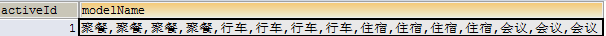

# 一、日常笔记

[toc]

## 1. id重新开始自增           

方法1：
truncate table 你的表名
//这样不但将数据全部删除，而且重新定位自增的字段

方法2：
delete from 你的表名
dbcc checkident(你的表名,reseed,0) 
//重新定位自增的字段，让它从1开始

## 2. UNION报错

utf8mb4_general_ci 使用 UNION 报错

utf8mb4_croatian_ci 无问题

## 3. navicat mysql 默认添加更新行时当前日期

CURRENT_TIMESTAMP


## 4.关联表删除特定行

```DELETE nr
DELETE nr
FROM  `nr宏站单验跟踪表` as nr
INNER JOIN (SELECT bu.cellname FROM `0不符合单验明细` as bu WHERE bu.`基站名称` is null)  as q on q.cellname=nr.cellname
WHERE  nr.cellname = q.cellname
```

## 5.跳过MySQL密码认证

```
跳过密码认证
1、停止MySQL服务  net stop MySQL
2、启动MySQL服务 mysqlld --skip-grant-tables(跳过密码认证表）
恢复密码认证
1、查找mysql进程  tasklist |findstr mysql
2、杀死MySQL进程  taskkill /F /PID 8920(进程ID)
3、正常启动MySQL服务 net start MySQL
```

## 6.提取字符

```
**SUBSTRING_INDEX(s, delimiter, number)**

**s 为需要分列的字段**

**delimiter 为分隔符**

**number则表示在取第几个分隔符旁边的字段**
```

## 7.MySQL 对查询的结果集添加自增序号

```
第一种：
select  (@i:=@i+1)  as i, emp.*  from emp,  (select @i:=0) as it 

第二种：
set @n = 0;
select  (@n := @n + 1) as usid ,id,company_id,department_code from sys_user ;
```

## 8.根据指定字符分割成多条数据(一行变多行)

```SQL
select distinct  substring_index( substring_index( a.需要拆分的字段名, ',', b.help_topic_id + 1 ), ',',- 1 ) as name
from 表名 a
join mysql.help_topic b ON b.help_topic_id < ( length( a.需要拆分的字段名 ) - length( replace( a.需要拆分的字段名, ',', '' ) ) + 1 ) 
where a.tt_id =1

-- ( length( a.需要拆分的字段名 ) - length( replace( a.需要拆分的字段名, ',', '' ) ) + 1 ),计算需要分割次数
-- length( a.需要拆分的字段名 )，计算表格字节数
-- mysql.help_topic，mysql系统表（mysql 默认自增序列表），这里的作用借助此表id自增特性
-- substring_index() （mysql  拆分函数）
-- substring_index( a.需要拆分的字段名, ',', b.help_topic_id + 1 )，b.help_topic_id 变量
```

## 9.将多行数据合并成一行数据

一个字段可能对应多条数据，用mysql实现将多行数据合并成一行数据

例如：一个活动id（activeId）对应多个模块名（modelName）,按照一般的sql语句：

```
1 SELECT am.activeId,m.modelName 
2 FROM activemodel am 
3 JOIN  model m 
4 ON am.modelId = m.modelId 
5 ORDER BY am.activeId
```

查询出的列表为图1所示：


　　　　　　图1

修改过后的sql语句，查询后如图2所示：

[](javascript:void(0);)

```
1 SELECT am.activeId,GROUP_CONCAT(m.modelName SEPARATOR ',') modelName
2 FROM activemodel am 
3 JOIN model m 
4 ON am.modelId=m.modelId
5 WHERE m.valid=1
6 GROUP BY am.activeId
```

[](javascript:void(0);)

需注意：

1.GROUP_CONCAT（）中的值为你要合并的数据的字段名;

　SEPARATOR 函数是用来分隔这些要合并的数据的；

　' '中是你要用哪个符号来分隔；

2.必须要用GROUP BY 语句来进行分组管理，不然所有的数据都会被合并成一条记录，如图3


　　　　　　　　　　　　图2

 



## 10.修改group_concat的限制

使用group_concat时，如果行数太多，可能会报错：row 20000 was cut by group_concat()

解决方法是修改mysql中的**group_concat_max_len，**此值大于你要分组的数量即可

**1.查看当前mysql group_concat_max_len**

[](javascript:void(0);)

```
mysql> show variables like '%group_concat%';
+----------------------+---------+
| Variable_name        | Value   |
+----------------------+---------+
| group_concat_max_len | 200 |
+----------------------+---------+
1 row in set (0.00 sec)
```

[](javascript:void(0);)

**2.修改group_concat_max_len**

a)如果不方便重启mysql，可以在mysql状态通过命令设置，如：

```
SET GLOBAL group_concat_max_len=2000000;
SET SESSION group_concat_max_len=2000000;
```

注：此种方式在mysql重启后会读取配置文件重新设置，会导致设置失效，所以建议依旧要修改配置文件

b)修改配置文件，**mysql 5.7版本的配置文件为：/etc/mysql/mysql.conf.d/mysqld.cnf**

在[mysqld]下新增配置：group_concat_max_len = 2000000

重启，通过方式1查看即可。

## 11.字符串截取

> MySQL 字符串截取函数：left(), right(), substring()，常用方法。

1. 左边字符串截取：left(str, length)

   ```
   left(字符串, 3)
   ```

2. 右边字符串截取：right(str, length)

   ```
   right(字符串, 3)
   ```

   

3. 字符串截取：substring(str, pos); substring(str, pos, len)

- 3.1 从字符串的第 4 个字符位置开始取，直到结束。

  ```
  substring(字符串, 4)
  ```

- 3.2 从字符串的第 4 个字符位置开始取，只取 2 个字符。

  ```
  substring(字符串, 4, 2)
  ```

- 3.3 从字符串的第 4 个字符位置（倒数）开始取，直到结束。

  ```
  substring(字符串, -4)
  ```

- 3.4 从字符串的第 4 个字符位置（倒数）开始取，只取 2 个字符。

  ```
  substring(字符串, -4, 2)
  ```

## 12.导出中文乱码

编码选择如下：


## 13.批量更新数据

CASE...WHEN语句的涵义与一般高级语言中的SWITCH...CASE语句类似，

如下所示，即：在`表名`表中，当字段`字段3`的值为'值X'时，修改`字段1`与`字段2`的值为'结果X'和'结果X'。

```
UPDATE `表名` SET
        `字段1` = CASE `字段3`
        WHEN '值1' THEN '结果1'
        WHEN '值2' THEN '结果2'
        WHEN '值3' THEN '结果3'
    END,
        `字段2` = CASE `字段3`
        WHEN '值1' THEN '结果4'
        WHEN '值2' THEN '结果5'
        WHEN '值3' THEN '结果6'
    END
WHERE `字段3` IN ('值1', '值2', '值3');
```

