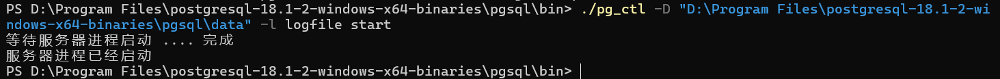
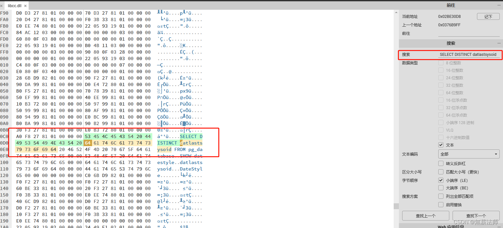
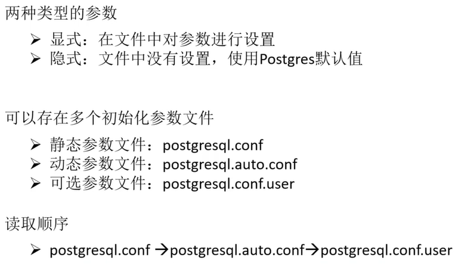
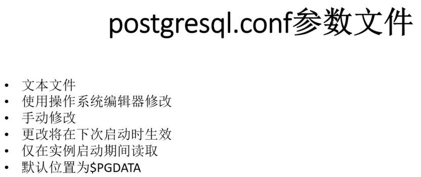
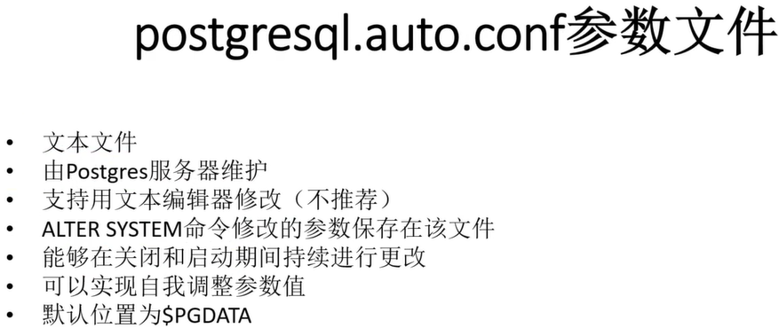
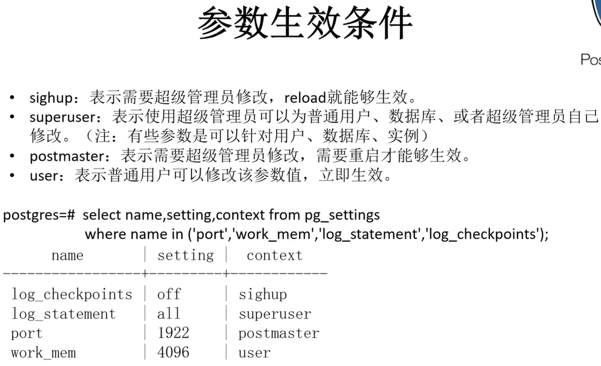
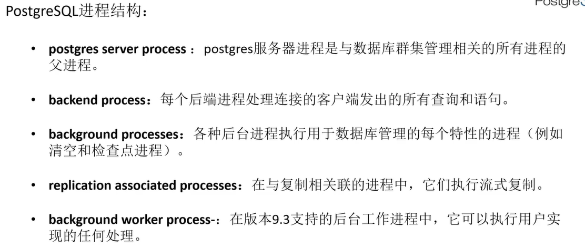
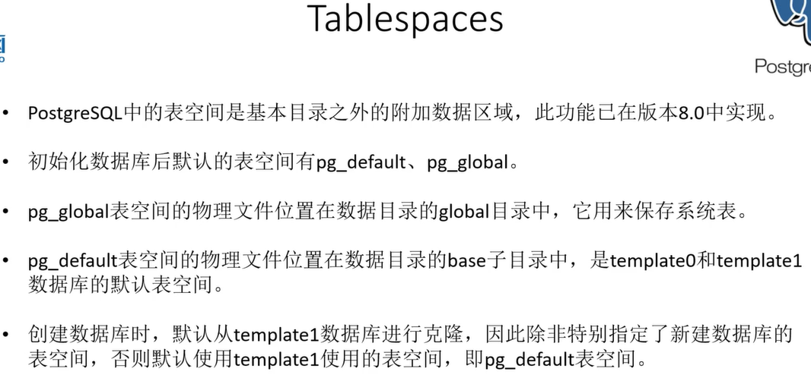

## 下载

免安装版：https://www.enterprisedb.com/download-postgresql-binaries

## 安装

1、先创建data文件夹

2、初始化数据库，并设置数据库密码

```
"D:\Program Files\postgresql-18.1-2-windows-x64-binaries\pgsql\bin\initdb.exe" -D "D:\Program Files\postgresql-18.1-2-windows-x64-binaries\pgsql\data" -E UTF-8 --locale=chs -U root -W

注意："D:pgsql\data"  为数据路径
```

3、注册服务

使用 Windows 服务管理器来注册 PostgreSQL 服务

```
"<bin目录>\pg_ctl.exe" register -N PostgreSQL -D "<data目录>" -U WT -S auto -w -e "<data目录>\pg_log\pgstartup.log" -l "<data目录>\pg_log\pgsvc.log"

-N（服务名称）
-D（数据目录）
-U 指定运行 PostgreSQL 服务的 Windows 用户账户 ,指定会因登录无法启用
-S 指定服务的启动类型。auto 表示该服务将被设置为“自动”启动
-w 表示 pg_ctl 命令会等待服务注册完成
 -e 和 -l 参数来记录服务启动日志和通用日志

# 删除可能存在的服务
 pg_ctl unregister -N postgresql
# 下面是WIN系统服务管理命令
启动服务 **net start mysql**	net stop mysql(停止服务)  sc delete mysql删除服务
```

4、win服务

```
启动服务 **net start mysql**	net stop mysql(停止服务)  sc delete mysql删除服务
```

需要在bin目录下运行以上2条命令

安装成功



5、进程启动停止：

```
# 未注册服务的启动命令，服务会自己中断 
pg_ctl start -w -D "<data目录>" 启动pgsql进程
pg_ctl stop -w -D "<data目录>" 停止pgsql进程
"<bin目录>\pg_ctl.exe" -D "<data目录>" -l logfile start

pg_ctl stop -m smart
# SIGTERM "Smart"模式等待所有客户端断开连接以及任何在线备份结束。如果该服务器是热备，一旦所有的客户端已经断开连接，恢复和流复制将被终止。
pg_ctl stop -m fast
# SIGINT "Fast"模式（默认）不会等待客户端断开连接并且将终止进行中的在线备份。所有活动事务都被回滚并且客户端被强制断开连接，然后服务器被关闭。
pg_ctl stop -m immediate
# SIGQUIT "Immediate"模式将立刻中止所有服务器进程，而不是做一次干净的关闭。这将导致下一次重启时进行一次崩溃恢复。
```

使用navicat报错： column "datlastsysoid" does not exist

解决方案： https://blog.csdn.net/2509_93971614/article/details/155134692

解决方法1：升级navicat

解决方法2：降级pgsql

解决方法3：**修改dll**  https://hexed.it/ 修改 安装目录下 libcc.dll文件

```
在文件中搜索“SELECT DISTINCT datlastsysoid”，并将其替换为“SELECT DISTINCT dattablespace”
```




查看特定端口

```
netstat -ano | findstr :8080
```

## 数据库特性


## 数据库基础知识

**初始化参数文件**











