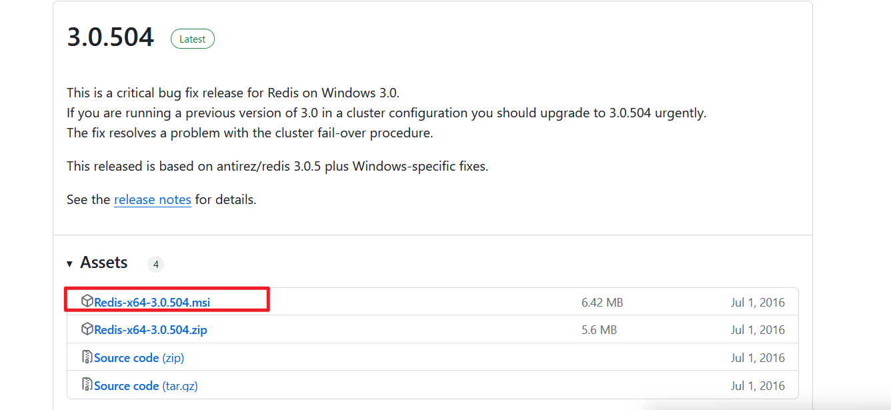
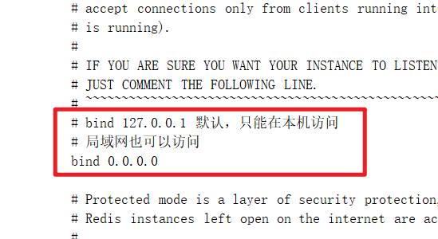
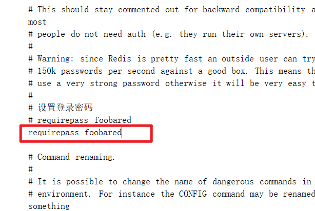
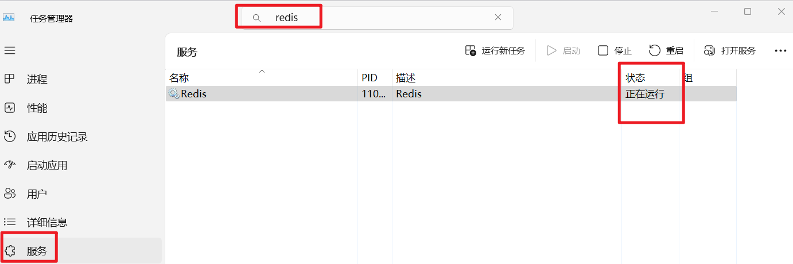
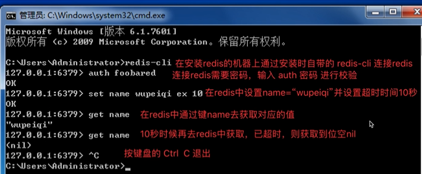
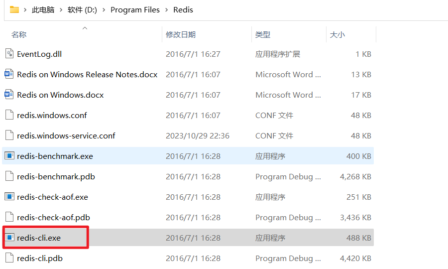

## redis基本操作

#### 下载redis

https://github.com/microsoftarchive/redis/releases

https://files.cnblogs.com/files/blogs/685292/Redis-x64-3.2.100.zip?t=1698590344&download=true

#### 安装redis

点击安装。

#### 修改配置

redis这个软件安装上之后，需要对他进行一些基本设置，以便于我们以后可以通过python代码来对redis中的数据进行操作

- 打开配置文件，redis安装的目录下的`redis.windows-service.conf`文件

  - 设置绑定IP，如果想要让局域网内其他主机访问自己的redis，需要设置`bind 0.0.0.0`

    

  - 设置redis密码，如果想需要提供密码再登录redis，需要设置`requirepass 密码`，默认不需要密码

    

    

#### 启动或关闭

#### 连接redis

redis-cli是redis自带的客户端工具。

方法一：输入 redis-cli就可以使用（前提要加入环境变量）：

方法二：双击运行

