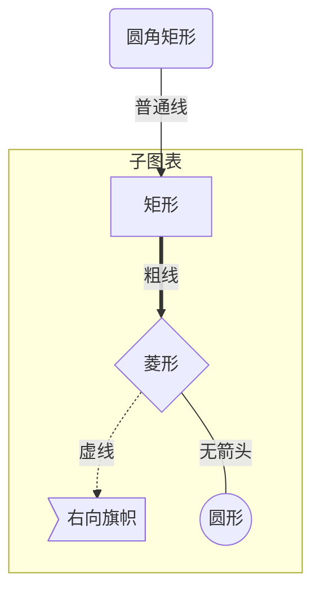
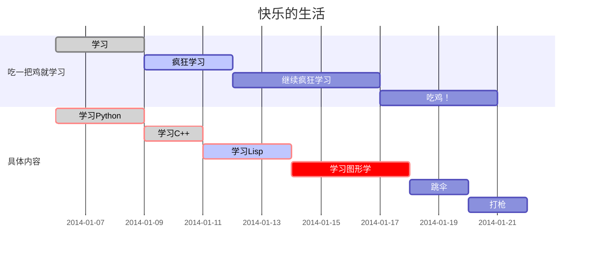

# 										Typora使用教程

笔记来源：https://www.runoob.com/markdown/md-link.html

##  一、标题 

### 1.1、使用 # 号标记

​		使用 # 号可表示 1-6 级标题，一级标题对应一个 # 号，二级标题对应两个 # 号，以此类推。

```
# 一级标题			Ctrl + 1
## 二级标题			Ctrl + 2
### 三级标题		Ctrl + 3
#### 四级标题		Ctrl + 4
##### 五级标题		Ctrl + 5
###### 六级标题		Ctrl + 6
```

### 1.2、目录

​	目录 (Table of Content) 可以通过在 markdown 文件的开头输入`[TOC]`的标记来实现

## 二、段落

### 2.1、字体

#### 2.1.1 字体类型

```
*斜体文本*			Ctrl + I
_斜体文本_
**粗体文本**		Ctrl + B
__粗体文本__
***粗斜体文本***
___粗斜体文本___
```

举例：

​	*斜体*  			**粗体**				***粗斜体***

#### 2.1.2 字体颜色

```html
<font color=red>颜色</font>
```

举例：

​	<font color=red>颜色</font>

#### 2.1.3 字体大小

```
<font size=6>颜色</font>
```

举例：

​	<font size=6>颜色</font>

### 2.2、分隔线

你可以在一行中用三个以上的星号、减号、底线来建立一个分隔线，行内不能有其他东西。你也可以在星号或是减号中间插入空格。下面每种写法都可以建立分隔线：

```
***
* * *
*****
- - -
----------
```

举例：

-----

### 2.3、删除线

如果段落上的文字要添加删除线，只需要在文字的两端加上两个波浪线 ~~ 即可，实例如下：

```
~~BAIDU.COM~~		Alt + Shift + 5
```

举例：

​	~~举例~~

### 2.4、下划线

下划线可以通过 HTML 的 标签来实现：

```
<u>带下划线文本</u>	Ctrl + U
```

举例：

​	<u>下划线</u>

### 2.5、脚注

脚注是对文本的补充说明。脚注的格式如下:

```
[^要注明的文本]
```

举例：

​	说明[^举例] 

[^举例]:bbbbbb

### 2.6、换行

文本换行可以使用 `<br />`、`<br/>`、`<br>`标记符号

举例：

​		前 瞻<br />价 值
​		前 瞻 <br/>价 值

​		前 瞻 ‘<br>价 值

### 2.7、复选框

```
- [x] 这 是 已 完 成 的 任 务
- [ ] 这 是 状 态 未 知 的 任 务
```

举例：

- [x] 这 是 已 完 成 的 任 务
- [ ] 这 是 状 态 未 知 的 任 务

### 2.8、emoji 表情符号

```
:+1: :sparkles: :camel: :tada:
:rocket: :metal: :heart_eyes: :sob:
可以通过下面这个网站来查看支持哪些 emoji表情：
emoji-cheat-sheet
```

举例：

:+1: :sparkles: :camel: :tada:

:rocket: :metal: :heart_eyes: :sob:

### 2.9、文本背景强调

用一对 == 将文字包 裹起来

举例：

​		==强调==


## 三、列表

### 3.1、无序列表

无序列表使用星号(*)、加号(+)或是减号(-)作为列表标记，这些标记后面要添加一个空格，然后再填写内容：

```
* 第一项
* 第二项
* 第三项

+ 第一项
+ 第二项
+ 第三项

- 第一项
- 第二项
- 第三项
```

举例：

* 第一项 

### 3.2、有序列表

有序列表使用数字并加上 . 号来表示，如：

```
1. 第一项
2. 第二项
3. 第三项
```

举例：

1. 第一项

### 3.3、列表嵌套

列表嵌套只需在子列表中的选项前面添加四个空格即可：

```
1. 第一项：
    - 第一项嵌套的第一个元素
    - 第一项嵌套的第二个元素
2. 第二项：
    - 第二项嵌套的第一个元素
    - 第二项嵌套的第二个元素
```

举例：

1. 第一项：

    - 第一项嵌套的第一个元素

    - 第一项嵌套的第二个元素

## 四、区块

### 4.1、区块引用

在段落开头使用 > 符号 ，然后后面紧跟一个**空格**符号：

```
> 区块引用
```

举例：

> 区块引用

### 4.2、区块嵌套

一个 > 符号是最外层，两个 > 符号是第一层嵌套，以此类推：

```
> 最外层
> > 第一层嵌套
> > > 第二层嵌套
```

举例：

> 最外层
> > 第一层嵌套
> >
> > > 第二层嵌套

### 4.3、区块中使用列表

```
> 区块中使用列表
> 1. 第一项
> 2. 第二项
> + 第一项
> + 第二项
> + 第三项
```

举例：

> 区块中使用列表
> 1. 第一项
> + 第一项

### 4.4、列表中使用区块

如果要在列表项目内放进区块，那么就需要在 > 前添加四个空格的缩进。

```
* 第一项
    > 菜鸟教程
    > 学的不仅是技术更是梦想
* 第二项
```

举例：

* 第一项

    > 菜鸟教程
    > 学的不仅是技术更是梦想

## 五、代码

### 5.1、代码片段

​		段落上的一个函数或片段的代码可以用反引号把它包起来（`）

```
`printf()` 函数
```

举例：

​	`printf()` 函数

### 5.2、代码区块

​	代码区块使用 ``` 回车，并指定一种语言（也可以不指定）

````
```javascript
$(document).ready(function () {
    alert('RUNOOB');
});
```
````

举例：

```python
代码区块
```

## 六、流程图


### 6.1、 Mermaid使用

#### 6.1.1 方向

```
graph 方向描述
	图标其它语句
```

方向描述

| 方向     | 用词 |
| -------- | ---- |
| 从上到下 | TB   |
| 从下到上 | BT   |
| 从右到左 | RL   |
| 从左到右 | LR   |

#### 6.1.2 节点定义

即流程图中每个文本块，包括开始、结束、处理、判断等。Mermaid 中每个节点都有一个 id，以及节点的文字

节点的文字包含标点符号，使用双引号，换行使用 `<br />`

| 说明           | 表述       |
| -------------- | ---------- |
| 矩形节点       | id[文字]   |
| 圆角矩形节点   | id(文字)   |
| 圆形节点       | id((文字)) |
| 右向旗帜状节点 | id>文字]   |
| 菱形节点       | id{文字}   |

#### 6.1.3 节点连间线

| 说明           | 表述     |
| -------------- | -------- |
| 添加尾部箭头   | >        |
| 不添加尾部箭头 | -        |
| 单线           | --       |
| 单线上加文字   | --文字-- |
| 粗线           | ==       |
| 粗线加文字     | ==文字== |
| 虚线           | -.-      |
| 虚线加文字     | -.文字.- |

#### 6.1.4 子图表

添加子图表

```
subgraph 子图表名称
	子图表中的描述语句···
end
```

对 fontawesome 的支持

使用 `fa: #图表名称#` 的语法添加 fontawesome

举例：



#### 6.1.5 gantt图




### 6.2、flow使用

#### 6.2.1 流程图元素：

- strat：开始框
- operation：处理框
- condition：判断框
- inputoutput：输入输出框
- end：结束框
- subroutine：子流程

各框通过“->”连接。

定义上述基本元素的语句是：

```dart
元素ID=>元素类型：展示文字

元素ID(方向）->元素ID
```

其中，方向有以下四种

```swift
(top)
(bottom)
(right)
(left)
```


举例1：

```flow
st=>start: 开始
op=>operation: 你的操作
cond=>condition: 是 / 否?
e=>end
st->op->cond
cond(yes)->e
cond(no)->op
```

举例2：

```flow
start1=>start: 初始设计
op1=>operation: P=0
op2=>operation: 结构分析与敏度分析
op3=>operation: 建立原问题（Primal Problem）
op4=>operation: 建立近似问题（Approximate Proble）
op5=>operation: 求解近似问题，得到$X^{P+1}$
cond1=>condition: 是否小于允许误差
op6=>operation: P=P+1
end=>end: 结束

start1->op1->op2->op3->op4->op5->cond1
cond1(no)->op6(top)->op2
cond1(yes)->end
```


## 七、链接

### 7.1、 链接使用方法：

```
[链接名称](链接地址)

或者

<链接地址>

或者

直接输入网址
```

举例：

​	这是一个链接 [菜鸟教程](https://www.runoob.com)

​	https://www.runoob.com

### 7.2、 高级链接

我们可以通过变量来设置一个链接，变量赋值在文档末尾进行：

```
这个链接用 1 作为网址变量 [Google][1]
这个链接用 runoob 作为网址变量 [Runoob][runoob]
然后在文档的结尾为变量赋值（网址）

  [1]: http://www.google.com/
  [runoob]: http://www.runoob.com/
```

举例：

​	这个链接用 1 作为网址变量 [Google][1]
​	这个链接用 runoob 作为网址变量 [Runoob][runoob]

[1]: http://www.google.com/
[runoob]: http://www.runoob.com/

## 八、图片

### 8.1、 基础用法

Markdown 图片语法格式如下：

```

 #鼠标放到图片上面可显示标题
```

举例：


### 8.2 、图片链接用法

```
这个链接用 1 作为网址变量 [RUNOOB][1].
然后在文档的结尾为变量赋值（网址）

[1]: http://static.runoob.com/images/runoob-logo.png
```

举例：

这个链接用 5 作为网址变量 [RUNOOB][5]
然后在文档的结尾为变量赋值（网址）

[5]: http://static.runoob.com/images/runoob-logo.png

### 8.3、img 标签指定图片高度与宽度属性

指定图片的高度与宽度使用普通的  标签

```

```

举例：

​	按照比例缩放：


指定固定尺寸


### 8.4、多张图片在一行

在一行中，可以放置 2 个或多个图片：

 

## 九、表格

### 9.1、表格语法

Markdown 制作表格使用 | 来分隔不同的单元格，使用 - 来分隔表头和其他行。

语法格式如下：

```
|  表头   | 表头  |
|  ----  | ----  |
| 单元格  | 单元格 |
| 单元格  | 单元格 |
```

举例：

| 表头   | 表头   |
| ------ | ------ |
| 单元格 | 单元格 |
| 单元格 | 单元格 |

### 9.2、对齐方式

**设置表格的对齐方式：**

- -: 设置内容和标题栏居右对齐。
- :- 设置内容和标题栏居左对齐。
- :-: 设置内容和标题栏居中对齐。

实例如下：

```
| 左对齐 | 右对齐 | 居中对齐 |
| :-----| ----: | :----: |
| 单元格 | 单元格 | 单元格 |
| 单元格 | 单元格 | 单元格 |
```

举例：

| 左对齐 | 右对齐 | 居中对齐 |
| :----- | -----: | :------: |
| 单元格 | 单元格 |  单元格  |
| 单元格 | 单元格 |  单元格  |

## 十、HTML语法

支持原生 HTML 语法

举例：

将图片尺寸缩小，并且居中显示

<div align="center">
    
</div>

### 10.1、邮箱

使用一对 <> 将你的邮箱括起来

举例：

​	<liyangbit@gmail.com>

### 10.2、强制分页

文本中需要分页的地方添入：

`<div STYLE = “page-break-after: always;”></div>`

在 Preview 窗口不能看到分页的效果，但是在 输出的 pdf文件中会完成分页

## 十一、数学公式

数学公式有两种，一种是用在正文中的，一种 是单独显示的。 

正文中的公式如下: `$ ... $ `

单独一行显示的时候使用如下命令：` $$...$$ `

其中，$ 符号中间包含的三个点表格的是 LaTex 的公式命令。

 举例： 

下 面 是 行 内 公 式 我 是 行 内 公 式 $\sqrt{x^2+y^2}$ 行 内 公 式 

下 面 是 单 独 一 行 显 示： 

$$f(x) = \sum_{i=0}^{N} \int_{a}^{ b} g(t,i) \text{d}t \tag{a}$$

