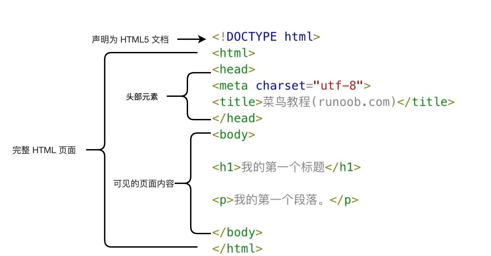

**HTML**

<hr></hr>

# 一、介绍：

超文本标记语言（英语：HyperText Markup Language，简称：HTML）是一种用于创建网页的标准标记语言。

> **注意：**对于中文网页需要使用 **<meta charset="utf-8">** 声明编码，否则会出现乱码。有些浏览器(如 360 浏览器)会设置 GBK 为默认编码，则你需要设置为 **<meta charset="gbk">。**

## 1、HTML文档的后缀名

- .html
- .htm

以上两种后缀名没有区别，都可以使用。

## 2、简介

HTML 是用来描述网页的一种语言。

- HTML 指的是超文本标记语言: **H**yper**T**ext **M**arkup **L**anguage
- HTML 不是一种编程语言，而是一种**标记**语言
- 标记语言是一套**标记标签** (markup tag)
- HTML 使用标记标签来**描述**网页
- HTML 文档包含了HTML **标签**及**文本**内容
- HTML文档也叫做 **web 页面**

## 3、HTML 标签

HTML 标记标签通常被称为 HTML 标签 (HTML tag)。

- HTML 标签是由*尖括号*包围的关键词，比如 <html>
- HTML 标签通常是*成对出现*的，比如 <b> 和 </b>
- 标签对中的第一个标签是*开始标签*，第二个标签是*结束标签*
- 开始和结束标签也被称为*开放标签*和*闭合标签*

## 4、HTML 元素

"HTML 标签" 和 "HTML 元素" 通常都是描述同样的意思.

但是严格来讲, 一个 HTML 元素包含了开始标签与结束标签，如下实例: 

HTML 元素:

```
<p>这是一个段落。</p>
```

## 5、Web 浏览器

Web浏览器（如谷歌浏览器，Internet Explorer，Firefox，Safari）是用于读取HTML文件，并将其作为网页显示。

浏览器并不是直接显示的HTML标签，但可以使用标签来决定如何展现HTML页面的内容给用户

## 6、HTML 网页结构

下面是一个可视化的HTML页面结构：

```html
<html>
    <head>
        <title>页面标题</title>
    </head>
    <body>
        <h1>这是一个标题</h1>
        <p>这是一个段落。</p>
        <p>这是另外一个段落。</p>
    </body>
</html>
```

```
只有 <body> 区域才会在浏览器中显示。
```

## 7、 <!DOCTYPE> 声明

<!DOCTYPE>声明有助于浏览器中正确显示网页。

网络上有很多不同的文件，如果能够正确声明HTML的版本，浏览器就能正确显示网页内容。

doctype 声明是不区分大小写的，以下方式均可：

```
<!DOCTYPE html>

<!DOCTYPE HTML>

<!doctype html>
```

## 8、通用声明

总是给您的 HTML 文档添加 <!DOCTYPE> 声明，确保浏览器能够预先知道文档类型。

HTML5

```
<!DOCTYPE html>
```

HTML 4.01

```
<!DOCTYPE HTML PUBLIC "-//W3C//DTD HTML 4.01 Transitional//EN"
 "http://www.w3.org/TR/html4/loose.dtd">
```

XHTML 1.0

```
<!DOCTYPE html PUBLIC "-//W3C//DTD XHTML 1.0 Transitional//EN"
 "http://www.w3.org/TR/xhtml1/DTD/xhtml1-transitional.dtd">
```

## 9、中文编码

目前在大部分浏览器中，直接输出中文会出现中文乱码的情况，这时候我们就需要在头部将字符声明为 UTF-8 或 GBK。

## 10、实例介绍

```
<!DOCTYPE html> 
<html> 
    <head> 
        <meta charset="utf-8"> 
        <title>菜鸟教程(runoob.com)</title> 
    </head> 
    <body>  
        <h1>我的第一个标题</h1> 
        <p>我的第一个段落。</p> 
    </body> 
</html>
```



- **<!DOCTYPE html>** 声明为 HTML5 文档
- **<html>** 元素是 HTML 页面的根元素
- **<head>** 元素包含了文档的元（meta）数据，如 <meta charset="utf-8"> 定义网页编码格式为 **utf-8**。
- **<title>** 元素描述了文档的标题
- **<body>** 元素包含了可见的页面内容
- **<h1>** 元素定义一个大标题
- **<p>** 元素定义一个段落

**注：**在浏览器的页面上使用键盘上的 F12 按键开启调试模式，就可以看到组成标签。

# 二、基础

## 1、HTML 标题

HTML 标题（Heading）是通过<h1> - <h6> 标签来定义的。

## 2、HTML 段落

HTML 段落是通过标签 <p> 来定义的。

## 3、HTML 链接

HTML 链接是通过标签 <a> 来定义的。

```
<a href="https://www.runoob.com">这是一个链接</a>

提示:在 href 属性中指定链接的地址。
```

## 4、HTML 图像

HTML 图像是通过标签  来定义的.

```

```

**注意：** 图像的名称和尺寸是以属性的形式提供的。

# 三、元素

HTML 文档由 HTML 元素定义。

| 开始标签                 | 元素内容       | 结束标签 |
| ------------------------ | -------------- | -------- |
| `<p>`                    | 这是一个段落   | </p>     |
| `<a href="default.htm">` | 这是一个链接   | </a>     |
| `<br>`                   | 换行           |          |
| `<html>`                 | 定义HTML文档   | </html>  |
| `<body>`                 | 定义文档的主体 | </body>  |
| `<h1>`                   | 定义水平线     | </h1>    |
| `<hr>`                   | 定义注释       | </hr>    |

开始标签常被称为**起始标签（opening tag）**，结束标签常称为**闭合标签（closing tag）**。

即使您==忘记使用结束标签==，大多数浏览器也会正确地显示 HTML,因为关闭标签是可选的,但==不要依赖==这种做法,忘记使用结束标签会产生不可预料的结果或错误。

HTML 标签对大小写不敏感：<P> 等同于 <p>。许多网站都使用大写的 HTML 标签。建议使用小写

HTML 元素语法

- HTML 元素以**开始标签**起始
- HTML 元素以**结束标签**终止
- **元素的内容**是开始标签与结束标签之间的内容
- 某些 HTML 元素具有**空内容（empty content）**,比如：<br>
- 空元素**在开始标签中进行关闭**（以开始标签的结束而结束）
- 大多数 HTML 元素可拥有**属性**

# 四、属性

属性和属性值，尽量小写

属性是 HTML 元素提供的附加信息。HTML 属性

- HTML 元素可以设置**属性**
- 属性可以在元素中添加**附加信息**
- 属性一般描述于**开始标签**
- 属性总是以名称/值对的形式出现，**比如：name="value"**。

常用属性

| 属性  | 描述                                                         |
| ----- | ------------------------------------------------------------ |
| class | 为html元素定义一个或多个类名（classname）(类名从样式文件引入)（引号里面可以填入多个class属性） |
| id    | 定义元素的唯一id（只能填写一个，多个无效）                   |
| style | 规定元素的行内样式（inline style）                           |
| title | 描述了元素的额外信息 (作为工具条使用)                        |

# 五、标题

在 HTML 文档中，标题很重要。

标题（Heading）是通过 <h1> - <h6> 标签进行定义的。

**注释:** 浏览器会自动地在标题的前后添加空行。

==标题很重要==

请确保将 HTML 标题 标签只用于标题。不要仅仅是为了生成**粗体**或**大号**的文本而使用标题。 

搜索引擎使用标题为您的网页的结构和内容编制索引。

因为用户可以通过标题来快速浏览您的网页，所以用标题来呈现文档结构是很重要的。

应该将 h1 用作主标题（最重要的），其后是 h2（次重要的），再其次是 h3，以此类推。

1到6号标题与1到6号字体逆序对应，比如1号字体对应6号标题，2号字体对应5号标题

# 六、注释

可以将注释插入 HTML 代码中，这样可以提高其可读性，使代码更易被人理解。浏览器会忽略注释，也不会显示它们。

注释写法如下:

```
<!-- 这是一个注释 -->
```

# 七、文本格式化

## HTML 文本格式化标签

| 标签     | 描述         |
| -------- | ------------ |
| <b>      | 定义粗体文本 |
| <em>     | 定义着重文字 |
| <i>      | 定义斜体字   |
| <small>  | 定义小号字   |
| <strong> | 定义加重语气 |
| <sub>    | 定义下标字   |
| <sup>    | 定义上标字   |
| <ins>    | 定义插入字   |
| <del>    | 定义删除字   |

## HTML "计算机输出" 标签

| 标签   | 描述               |
| ------ | ------------------ |
| <code> | 定义计算机代码     |
| <kbd>  | 定义键盘码         |
| <samp> | 定义计算机代码样本 |
| <var>  | 定义变量           |
| <pre>  | 定义预格式文本     |

```
<p>计算机输出</p>
<code>计算机输出</code>
<br />
<kbd>键盘输入</kbd>
<br />
<tt>打字机文本</tt>
<br />
<samp>计算机代码样本</samp>
<br />
<var>计算机变量</var>
<br />
<p>
<b>注释：</b>这些标签常用于显示计算机/编程代码。
</p>
```

<p>
<b>注释：</b>这些标签常用于显示计算机/编程代码。
</p>

## HTML 引文, 引用, 及标签定义

| 标签         | 描述               |
| ------------ | ------------------ |
| <abbr>       | 定义缩写           |
| <address>    | 定义地址           |
| <bdo>        | 定义文字方向       |
| <blockquote> | 定义长的引用       |
| <q>          | 定义短的引用语     |
| <cite>       | 定义引用、引证     |
| <dfn>        | 定义一个定义项目。 |

11