[TOC]

【web开发全家桶】https://www.bilibili.com/video/BV1rT4y1v7uQ?p=5&vd_source=d6c3edd9a4f6205095ccfba6b2a61eec

目的：开发一个平台（网站）

- 前端开发：HTML、CSS、JavaScript
- Web框架：接收请求并处理

- Mysql数据库：存储数据

快速上手：
	基于Flask Web框架快速搭建一个网站
深入学习：
	基于Django框架（主要）# 

# 一、前端

## 1 前端开发

注释

- HTML注释

  ```html
  <!-- 注释内容-->
  ```

- CSS注释

  ```css
  /* 注释内容*/
  ```

- JavaScript注释

  ```js
  // 注释内容
  
  /* 注释内容 */
  ```

### 1.1 快速开发网站（Flask）

- 规定有些文件必须放到指定文件夹
- 新创建一个页面
  - 函数
  - HTML文件

```markdown
pipenv install flask
```

```python
from flask import Flask

app = Flask(__name__)

# 创建了网址 /show/info 和函数index 的对应关系
# 以后用户在浏览器上访问 /show/info ,网站自动执行 index
@app.route("/show/info" , methods=["GET", "POST"])
def index():
    return "中国联通"

if __name__ == '__main__':
    app.run()
```

Flask框架为了方便写标签，支持将字符串写入文件中。

```python
from flask import Flask,render_template

app = Flask(__name__)

@app.route("/show/info")
def index():
    # Flask 内部会自动打开这个文件，并读取内容，将内容给用户返回
    # 默认：去当前项目目录的templates文件夹中找。
    return render_template("index.html")

if __name__ == '__main__':
    app.run(debug=True)
```

### 1.2 HTML标签

#### 1.2.1 编码

```html
<meta charset="UTF-8">
```

#### 1.2.2 网站主题

```html
<title>Title</title>
```

#### 1.2.3 标题

HTML 标题（Heading）是通过<h1> - <h6> 标签来定义的。

```html
    <h1 >一级标题</h1>
    <h2 >二级标题</h2>
    <h3 >三级标题</h3>
    <h4 >四级标题</h4>
    <h5 >五级标题</h5>
    <h6 >六级标题</h6>
```

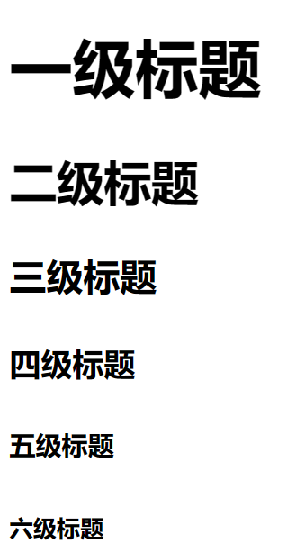

#### 1.2.4 div和span

```html
<div>内容</div>
<span>as</span>
```

- div,占一整行【块级标签】
- span,自己多大占多少【行内标签，内联标签】

#### 1.2.5 超链接

a【行内标签】

```html
<!-- 跳转到其他网站 -->
<a href="https://www.baidu.com">点击跳转</a>

<!-- 跳转到自己网站的其他网站 -->
<a href="/get/news">点击跳转到http://127.0.0.1:5000/get/news</a>
```

```html
<!-- 当前页面打开-->
<a href="https://image.baidu.com/search/index"">

<!-- 新的Tab页面打开-->
<a href="https://image.baidu.com/search/index" target="_blank">
```

#### 1.2.6 图片

img【行内标签】

- 本地图片

 	Flask框架要求图片放置在：static目录

```html

```

- 其它来源图片（可能无法正常显示，为防止盗用【已加密】）

```

```

设置图片高度和宽度

```

```

#### 1.2.7 列表

- 无序列表

```html
<ul>
    <li>中国移动</li>
    <li>中国联通</li>
    <li>中国电信</li>
    <li>中国广电</li>
</ul>
```

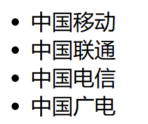

- 有序列表

```html
<ol>
    <li>中国移动</li>
    <li>中国联通</li>
    <li>中国电信</li>
    <li>中国广电</li>
</ol>
```


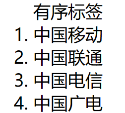

#### 1.2.8 表格

```html
<table  border="1">表格
    <thead>
        <tr> <th style="border: 1px solid gray">ID</th>	<th>姓名</th>	<th>年龄</th> </tr>
    </thead>
    <tbody>
        <tr> <td style="border: 1px solid gray">10</td> <td>张三</td> <td>10</td> </tr>
        <tr> <td>11</td> <td>李四</td> <td>10</td> </tr>
        <tr> <td>12</td> <td>王五</td> <td>10</td> </tr>
        <tr> <td>13</td> <td>王麻子</td> <td>10</td> </tr>
        <tr> <td>14</td> <td>张器</td> <td>10</td> </tr>
    </tbody>
</table>
```

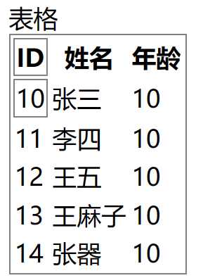

#### 1.2.9 input系列

```html
<!-- 文本输入-->
<input type="text"/>
<!--密码输入-->
<input type="password"/>
<!-- 文件选择-->
<input type="file"/>
<!-- 单选框-->
<input type="radio" name="n1"/>男
<input type="radio" name="n1"/>女
<!-- 复选框-->
<input type="checkbox" />乒乓球
<input type="checkbox"/>篮球
<--普通按钮-->
<input type="button" value="提交"/>
<--提交表单按钮,POST请求-->
<input type="submit" value="提交2"/>
```

#### 2.4.10 下拉框

```html
<!--单选下拉框-->
<select>
    <option>北京</option>
    <option>上海</option>
    <option>深圳</option>
</select>

<!--多选下拉框-->
<select multiple>
    <option>北京</option>
    <option>上海</option>
    <option>深圳</option>
</select>
```

#### 2.4.11 多行文本

```html
<!--默认3行-->
<textarea rows="3"></textarea>
```

#### 2.4.12 form表单和提交

- form标签
  - 提交方式(post/get)：`method="get" ` 
  - 提交地址：`action="xxx/xxx/xx/xx"`
  - 提交按钮：`<input type="submit" value="submit按钮">`

- 数据标签
  - 数据标签必须有`name`属性

- 后台数据获取
  - get方式：`request.args`
  - post方式：`request.form`
    - 单值获取：`request.form.get("username")`
    - 多值获取：`request.form.getlist("hobby")`

#### 案例：用户注册

```
<body>
<h1>用户注册</h1>
<!--<form method="get"  action="/do/reg">-->
<form method="post" action="/register">
    <div>
        用户名：<input type="text" name="username"/>
    </div>
    <div>
        密码：<input type="password" name="password"/>
    </div>
    <div>
        性别：
        <input type="radio" name="gender" value="1"/>男
        <input type="radio" name="gender" value="2"/>女
    </div>
    <div>
        爱好：
        <input type="checkbox" name="hobby" value="篮球"/>篮球
        <input type="checkbox" name="hobby" value="乒乓球"/>乒乓球
        <input type="checkbox" name="hobby" value="羽毛球"/>羽毛球
        <input type="checkbox" name="hobby" value="足球"/>足球
    </div>
    <div>
        城市：
        <select name="city">
            <option value="bj">北京</option>
            <option value="sh">上海</option>
            <option value="sz">深圳</option>
        </select>
    </div>
    <div>
        擅长领域：
        <select name="skill" multiple>
            <option value="游戏">游戏</option>
            <option value="睡觉">睡觉</option>
            <option value="刷抖音">刷抖音</option>
            <option value="吃饭">吃饭</option>
        </select>
    </div>
    <div>
        备注：<textarea name="more"></textarea>
    </div>
    <div>
        <input type="button" value="button按钮">
        <input type="submit" value="submit按钮">
    </div>
    <div>
        <span>选择文件框</span>
        <input name="file" type="file">
    </div>
</form>
</body>
```

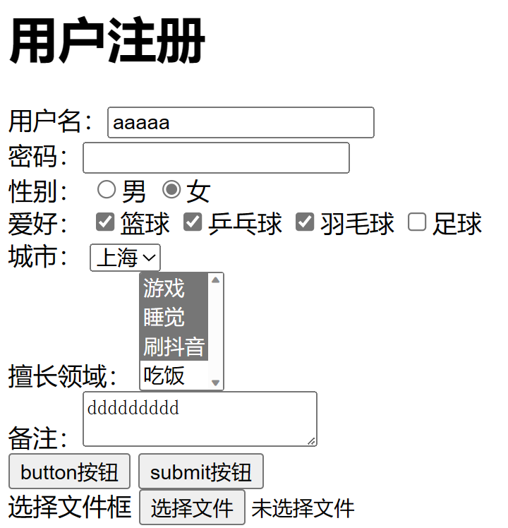

#### 案例：用户登录

```
<body>
<h1>用户登录</h1>
<form method="post" action="/login">
    用户名：<input type="text" name ="username"/>
    密码：<input type="password" name ="password"/>
    <input type="submit" value="登录"/>
</form>
</body>
```

### 1.3 CSS样式

#### 1.3.1 快速了解

```


<div style="color: red;">中国联通</div>
```

#### 1.3.2 CSS应用方式

- 在标签上

  ```
  
  
  <div style="color: red;">中国联通</div>
  ```

- 样式选择器（在head标签中写style标签）

  ```
  <style>
      .c1{
      	color: red;
      }
  </style>
      
  <h1 class="c1">用户登录</h1>
  ```

- CSS文件（写到文件中）

  ```
  <link rel="stylesheet" href="common.css"/>
  ```

#### 1.3.3 CSS选择器

- ID选择器

  ```html
  <!--ID选择器 -->
  #c2{
      height: 10px;
  }
  
  <div id="c2"></div>
  ```

- 类选择器

  ```html
  <!--类选择器 -->
  .c1{
  color: red;
  }
  <div class="c2"></div>
  ```

- 标签选择器

  ```html
  <!--标签选择器 -->
  div{
  color: green;
  }
  <div>xxxx</div>
  ```

- 属性选择器

  ```html
  input[type='text'] {
  	border: 1px solid red;
  }
  .v1[xx="456"]{
  	color: gold;
  }
  ```

  ```html
  <input type="text">
  <input type="password">
  
  <div class="v1" xx="123">e</div>
  <div class="v1" xx="456">d</div>
  <div class="v1" xx="789">f</div>
  ```

- 后代选择器

  ```html
  <!--每一代-->
  .yy li{
  	color: blue;
  }
  
  <!--第一代-->
  .yy > a{
  	color: blue;
  }
  ```

  ```html
  <div class="yy">
      <a>百度</a>
      <div>
          <a >谷歌</a>
      </div>
      <ul>
          <li>美国</li>
          <li>日报</li>
          <li>安国</li>
      </ul>
  </div>
  ```

  多个和覆盖:属性名相同后面覆盖前面，不同共同作用，不覆盖可添加`！important`

  ```html
  <!DOCTYPE html>
  <html lang="en">
  <head>
      <meta charset="UTF-8">
      <title>Title</title>
      <style>
          .c1 {
              color: red !important;
              border: 1px solid red;
          }
          .c2 {
              font-size: 28px;
              color: gold;
          }
      </style>
  </head>
  <body>
  <div class="c1 c2">中国联通</div>
  </body>
  </html>
  ```

#### 1.3.4 样式

##### 高度和宽度

注意事项

- 宽度支持百分比
- 行内标签：默认无效
- 块级标签：默认有效

```html
<style>
    .c1 {
        height: 300px;
        width: 500px;
    }
</style>
```

##### 块级和行内标签

- 块级

- 行内

- css样式：转换 `display:inline-block`

  块级、行内互相转换

  ```
  <div style="display:inline">中国</div>
  <span style="display: block">联通</span>
  ```

##### 字体和颜色

- 颜色
- 大小
- 加粗
- 字体

```html
<!DOCTYPE html>
<html lang="en">
<head>
    <meta charset="UTF-8">
    <title>Title</title>
    <style>
        .c1 {
            color: #00FF7F;
            font-size: 58px;
            font-weight: 600;
            font-family: emoji,楷体;
        }
    </style>
</head>
<body>
<div class="c1">中国联通</div>
<div>中国移动</div>
</body>
</html>
```

##### 文字对齐方式

```html
<!DOCTYPE html>
<html lang="en">
<head>
    <meta charset="UTF-8">
    <title>Title</title>
    <style>
        .c1 {
            height: 59px;
            width: 300px;
            border: 1px solid red;

            text-align: center; /* 水平方向居中 */
            line-height: 59px; /* 垂直方向居中 */
        }
    </style>

</head>
<body>
    <div class="c1">郭智</div>
</body>
</html>
```

##### 浮动

注意：浮动会使标签脱离文档流。

```html
<!DOCTYPE html>
<html lang="en">
<head>
    <meta charset="UTF-8">
    <title>Title</title>
    <style>
        .item {
            /*左边浮动*/
            float: left;
            /*宽度*/
            width: 200px;
            /*高度*/
            height: 170px;
            /*红色边框*/
            border: 1px solid red;
        }
    </style>
</head>
<body>
<div>
    <span>左边</span>
    <!--    右边浮动-->
    <span style="float:right">右边</span>
</div>
<!--添加蓝色底色-->
<div style="background-color: dodgerblue">
    <div class="item">一</div>
    <div class="item">二</div>
    <div class="item">三</div>
    <div class="item">四</div>
    <div class="item">五</div>
    <div class="item">六</div>
    <!-- 解除浮动脱离文档流-->
    <div style="clear: both"></div>
</div>
<div>您好</div>
</body>
</html>
```

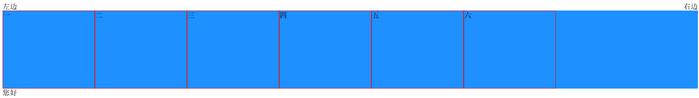

##### 内边距

内边距，标签内部距离

```html
<!DOCTYPE html>
<html lang="en">
<head>
    <meta charset="UTF-8">
    <title>Title</title>
    <style>
        .outer {
            border: 1px solid red;
            height: 200px;
            width: 200px;
            /*内边距：标签内部距离*/
            /*padding-top: 20px;*/
            /*padding-left: 20px;*/
            /*padding-right: 20px;*/
            /*padding-bottom: 20px;*/
            /*代表上下左右*/
            /*padding: 20px;*/
            /*分别代表 上 右 下 左（顺时针）*/
            padding: 20px 10px 5px 3px;
        }
    </style>
</head>
<body>
<div class="outer">
    <div style="background-color: gold">听妈妈的话</div>
    <div>小朋友是否下水</div>
</div>
</body>
</html>
```

##### 外边距

```html
<!DOCTYPE html>
<html lang="en">
<head>
    <meta charset="UTF-8">
    <title>Title</title>
</head>
<body>
<div style="height: 200px;background-color: dodgerblue;"></div>
<!--外边距：外部距离 margin-top: 20px-->
<div style="background-color: red;height: 100px;margin-top: 20px;"></div>
</body>
</html>
```

#### 1.3.5 CSS案例

##### 小米商城顶部

- body标签，默认有一个边距

  ```css
  /*去除边距*/
  body {
      /*外边距为0*/
      margin: 0;
  }
  ```

- 内容居中

  - 文本居中

    ```css
    <div style="
    /*外边距*/
    margin-top: 30px;
    /*标签宽度*/
    width:800px;
    /*文本居中*/
    text-align: center;
    /*添加红色边框*/
    border: 1px solid red
    ">文本居中</div>
    ```

    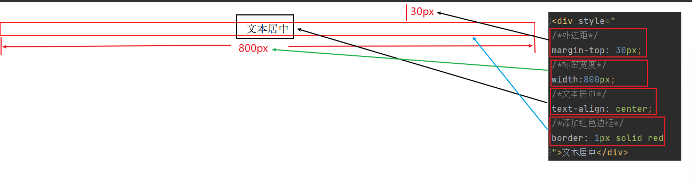

  - 区域局中

    自己有宽度，左右自动

    ```CSS
    .container {
        width: 980px;
        /*外边距：上下0 左右 自动*/
        margin: 0 auto;
    }
    ```

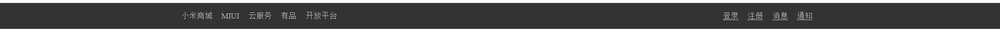

```html
<!DOCTYPE html>
<html lang="en">
<head>
    <meta charset="UTF-8">
    <title>小米商城 - Xiaomi 13、Redmi K60、MIX FOLD 2，小米电视官方网站</title>
    <style>
        body {
            /*外边距为0*/
            margin: 0;
        }

        .header {
            /*背景色：#333*/
            background-color: #333;
        }

        .container {
            width: 980px;
            /*外边距：上下0 左右 自动*/
            margin: 0 auto;
        }

        .header .menu {
            /*设置标签浮动*/
            float: left;
            /*标签颜色*/
            color: white;
        }

        .header .account {
            float: right;
            color: white;
        }

        .header a {
            color: #b0b0b0;
            /*标签高度*/
            line-height: 40px;
            display: inline-block;
            font-size: 12px;
            margin-right: 10px;
        }
    </style>
</head>
<body>

<div class="header">
    <div class="container">
        <div class="menu">
            <a>小米商城</a>
            <a>MIUI</a>
            <a>云服务</a>
            <a>有品</a>
            <a>开放平台</a>
        </div>
        <div class="account">
            <a href="">登录</a>
            <a href="">注册</a>
            <a href="">消息</a>
            <a href="">通知</a>
        </div>
        <!--解除浮动-->
        <div style="clear: both"></div>
    </div>
</div>
</body>
</html>
```

##### 小米商城二级菜单

```
a标签，默认有下划线
/*取消下划线*/
text-decoration: none;

鼠标放上面变格式
/*鼠标放到上面显示样式设置*/
 a:hover {
color: #ff6788;
}
```

1、 划分区域

2、搭建框架

3、设置样式

模板：

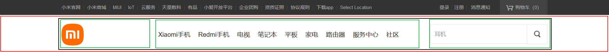

代码：

```html
<!DOCTYPE html>
<html lang="en">
<head>
    <meta charset="UTF-8">
    <title>Title</title>
    <style>
        body {
            margin: 0;
        }

        .sub-header {
            height: 100px;
            /*background-color: #b0b0b0;*/
        }

        .container {
            width: 1128px;
            margin: 0 auto;
            /*border: 1px solid red;*/
        }

        .sub-header .height {
            height: 100px
        }

        .sub-header .log {
            width: 234px;
            float: left;
            /*border: 1px solid red;*/
        }

        .sub-header .log a {
            margin-top: 22px;
            display: inline-block;
        }

        .sub-header .log a img {
            height: 56px;
            width: 56px;
        }

        .sub-header .menu-list {
            float: left;
            line-height: 100px;
            /*border: 1px solid red;*/
        }

        .sub-header .menu-list a {
            padding: 0 10px;
            display: inline-block;
            color: #333333;
            font-size: 16px;
            /*取消下划线*/
            text-decoration: none;
        }
        /*鼠标放到上面显示样式设置*/
        .sub-header .menu-list a:hover{
            color:#ff6788;
        }

        .sub-header .search {
            float: right;
            display: inline-block;
            line-height: 100px;
            /*border: 1px solid red;*/

        }
    </style>
</head>
<body>
<div class="sub-header">
    <div class="container">
        <div class="log height">
            <a href="https://www.mi.com">
                
            </a>
        </div>
        <div class="menu-list height">
            <a href="https://www.mi.com">Xiaomi手机</a>
            <a href="https://www.mi.com">Redmi手机</a>
            <a href="https://www.mi.com">电视</a>
            <a href="https://www.mi.com">笔记本</a>
            <a href="https://www.mi.com">平板</a>
            <a href="https://www.mi.com">家电</a>
            <a href="https://www.mi.com">路由器</a>
            <a href="https://www.mi.com">服务中心</a>
            <a href="https://www.mi.com">社区</a>
        </div>
        <div class="search height">搜索框暂时先不做</div>
        <div style="clear: both"></div>
    </div>
</div>

</body>
</html>
```

显示：


##### 小米商城推荐区域

透明度

```
/*透明度*/
opacity: 0.7;
```


模板：

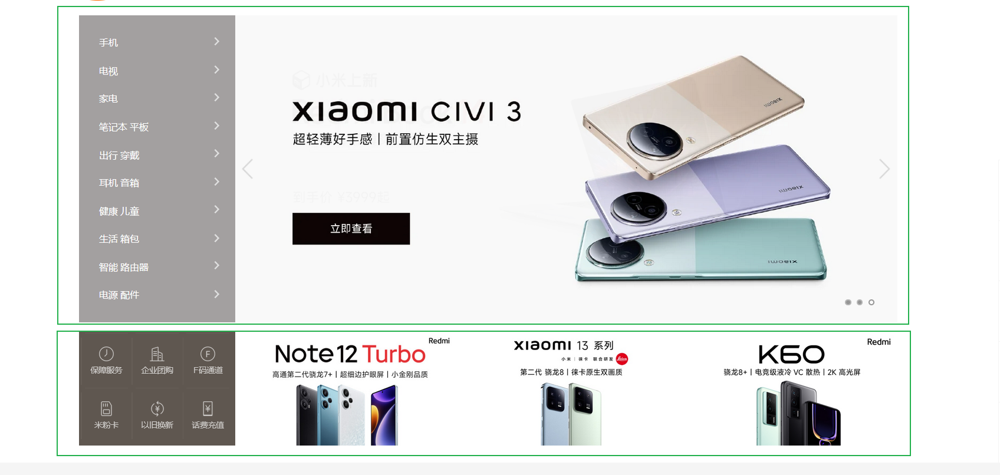

代码：

```HTML
<!DOCTYPE html>
<html lang="en">
<head>
    <meta charset="UTF-8">
    <title>小米商城 - Xiaomi 13、Redmi K60、MIX FOLD 2，小米电视官方网站</title>
    <style>
        body {
            /*外边距为0*/
            margin: 0;
        }

        img {
            width: 100%;
            height: 100%;
        }

        .left {
            float: left;
        }

        .header {
            /*背景色：#333*/
            background-color: #333;
        }

        .container {
            width: 1226px;
            /*外边距：上下0 左右 自动*/
            margin: 0 auto;
        }

        .header .menu {
            /*设置标签浮动*/
            float: left;
            /*标签颜色*/
            color: white;
        }

        .header .account {
            float: right;
            color: white;
        }

        .header a {
            color: #b0b0b0;
            /*标签高度*/
            line-height: 40px;
            /*转换 行、块*/
            display: inline-block;
            /*字体大小*/
            font-size: 12px;
            /*外边距*/
            margin-right: 10px;
            /*取消下划线*/
            text-decoration: none;

        }

        .header a:hover {
            color: white;
            /*取消下划线*/
            text-decoration: none;
        }

        .sub-header {
            height: 100px;
            /*background-color: #b0b0b0;*/
        }

        .sub-header .height {
            height: 100px
        }

        .sub-header .log {
            width: 234px;
            float: left;
            /*border: 1px solid red;*/
        }

        .sub-header .log a {
            margin-top: 22px;
            display: inline-block;
        }

        .sub-header .log a img {
            height: 56px;
            width: 56px;
        }

        .sub-header .menu-list {
            float: left;
            line-height: 100px;
            /*border: 1px solid red;*/
        }

        .sub-header .menu-list a {
            /*内边距,上下0 左右10px*/
            padding: 0 10px;
            display: inline-block;
            color: #333333;
            font-size: 16px;
            /*取消下划线*/
            text-decoration: none;
            /*border: 1px solid red;*/
        }

        /*鼠标放到上面显示样式设置*/
        .sub-header .menu-list a:hover {
            color: #ff6788;
        }

        .sub-header .search {
            float: right;
            display: inline-block;
            line-height: 100px;
            /*border: 1px solid red;*/

        }

        .slider .sd-img {
            /*width: 1226px;*/
            height: 460px;
        }

        .news {
            padding-top: 14px;
        }

        .news .channel {
            width: 228px;
            height: 164px;
            background-color: #5f5750;
            padding: 3px;
        }

        .news .channel .item {
            height: 86px;
            width: 76px;
            /*border: 1px solid royalblue;*/
            float: left;
            text-align: center;
        }

        .news .channel .item a {
            display: inline-block;
            font-size: 12px;
            padding-top: 18px;
            color: white;
            text-decoration: none;
            /*透明度*/
            opacity: 0.7;
        }

        .news .channel .item a:hover {
            opacity: 1;
        }

        .news .channel img {
            height: 24px;
            width: 24px;
            display: block;
            /*上0 左右自动 下4*/
            margin: 0 auto 4px;

        }

        .news .list-item {
            width: 316px;
            height: 170px;
        }

    </style>
</head>
<body>

<div class="header">
    <div class="container">
        <div class="menu">
            <a href="https://www.mi.com">小米商城</a>
            <a href="https://www.mi.com">MIUI</a>
            <a href="https://www.mi.com">云服务</a>
            <a href="https://www.mi.com">有品</a>
            <a href="https://www.mi.com">开放平台</a>
        </div>
        <div class="account">
            <a href="https://www.mi.com">登录</a>
            <a href="https://www.mi.com">注册</a>
            <a href="https://www.mi.com">消息</a>
            <a href="https://www.mi.com">通知</a>
        </div>
        <!--解除浮动-->
        <div style="clear: both"></div>
    </div>
</div>
<div class="sub-header">
    <div class="container">
        <div class="log height">
            <a href="https://www.mi.com">
                
            </a>
        </div>
        <div class="menu-list height">
            <a href="https://www.mi.com">Xiaomi手机</a>
            <a href="https://www.mi.com">Redmi手机</a>
            <a href="https://www.mi.com">电视</a>
            <a href="https://www.mi.com">笔记本</a>
            <a href="https://www.mi.com">平板</a>
            <a href="https://www.mi.com">家电</a>
            <a href="https://www.mi.com">路由器</a>
            <a href="https://www.mi.com">服务中心</a>
            <a href="https://www.mi.com">社区</a>
        </div>
        <div class="search height">搜索框暂时先不做</div>
        <div style="clear: both"></div>
    </div>
</div>
<div class="slider">
    <div class="container">
        <div class="sd-img">
            
        </div>
    </div>

</div>
<div class="news">
    <div class="container">
        <div class="channel left">
            <div class="item">
                <a href="https://www.mi.com">
                    
                    <span>保障服务</span>
                </a>
            </div>
            <div class="item">
                <a href="https://www.mi.com">
                    
                    <span>企业团购</span>
                </a>
            </div>
            <div class="item">
                <a href="https://www.mi.com">
                    
                    <span>F码通道</span>
                </a>
            </div>
            <div class="item">
                <a href="https://www.mi.com">
                    
                    <span>米粉卡</span>
                </a>
            </div>
            <div class="item">
                <a href="https://www.mi.com">
                    
                    <span>以旧换新</span>
                </a>
            </div>
            <div class="item">
                <a href="https://www.mi.com">
                    
                    <span>话费充值</span>
                </a>
            </div>
            <!--            <div class="clear:both"></div>-->
        </div>
        <div class="list-item left" style="margin-left: 14px">
            
        </div>
        <div class="list-item left" style="margin-left: 15px">
            
        </div>
        <div class="list-item left" style="margin-left: 15px">
            
        </div>
        <!--        <div class="clear: both"></div>-->
    </div>
</div>
</body>
</html>
```


显示：


#### 1.3.6 CSS知识点

##### hover(伪类)

```css
.download{
    /*隐藏*/
    display: none;
}

.app:hover .download{
    /*显示*/
    display: block;
}
```


```html
<!DOCTYPE html>
<html lang="en">
<head>
    <meta charset="UTF-8">
    <title>Title</title>
    <style>
        .c1 {
            color: red;
            font-size: 18px;
        }

        .c1:hover {
            color: green;
            font-size: 50px;
        }

        .c2 {
            height: 300px;
            width: 500px;
            border: 1px solid red;
        }

        .c2:hover {
            border: 5px solid green;
        }

        .download{
            /*隐藏*/
            display: none;
        }

        .app:hover .download{
            /*显示*/
            display: block;
        }
        .app:hover .title{
            color: red;
        }
    </style>
</head>
<body>
    <div class="c1">联通</div>
    <div class="c2">广西</div>
    
    <div class="app">
        <div class="title">下载AAP</div>
        <div class="download">
            
        </div>
    </div>
</body>
</html>
```

效果：

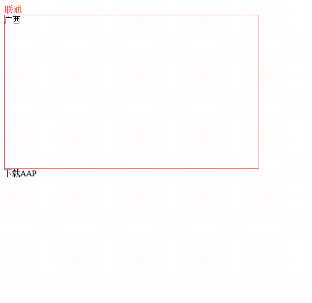

##### after(伪类)

```css
/*标签尾部添加东西*/
.c1:after {
    content: "大帅哥";
}
```

```html
<!DOCTYPE html>
<html lang="en">
<head>
    <meta charset="UTF-8">
    <title>Title</title>
    <style>

        /*标签尾部添加东西*/
        .c1:after {
            content: "大帅哥";
        }
        .clearfix{
            background-color: #ff6788;
        }
        .clearfix:after {
            /*标签后面填充字符为空*/
            content: "";
            /*div 变块级标签*/
            display: block;
            /*清除浮动*/
            clear: both;
        }
        .item{
            float: left;
            border: 1px solid red;
        }
    </style>
</head>
<body>
    <div class="c1">武阳郡</div>
    <div class="clearfix">
        <div class="item">1</div>
        <div class="item">2</div>
        <div class="item">3</div>
        <div class="clear:both"></div>
    </div>
</body>
</html>
```

效果：

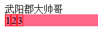

##### position（窗口位置）

- fixed 固定在窗口的某个位置

- > 设置相对位置 relative absolute

###### fixed

固定在窗口的某个位置

###### 案例：返回顶部

```html
<!DOCTYPE html>
<html lang="en">
<head>
    <meta charset="UTF-8">
    <title>Title</title>
  <style>
    .back{
      /*固定在窗口的某个位置*/
      position: fixed;

      width: 68px;
      height: 60px;
      border: 1px solid red;

      /*右边*/
      right: 0;
      /*底部*/
      bottom:0;
    }
  </style>
</head>
<body>
<!--高度1000px,底色灰色-->
<div style="height: 1000px;background-color: #b0b0b0"></div>
  <div class="back">返回顶部</div>
</body>
</html>
```

效果：

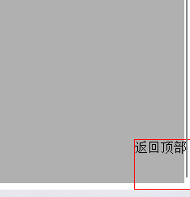

###### 案例：对话框

```html
<!DOCTYPE html>
<html lang="en">
<head>
    <meta charset="UTF-8">
    <title>Title</title>
    <style>
        .mask{
            background-color: black;
            position: fixed;
            left: 0;
            right: 0;
            top: 0;
            bottom: 0;
            opacity: 0.7;
            z-index: 999;
        }
        .dialog {
            /*固定在窗口的某个位置*/
            position: fixed;

            width: 280px;
            height: 200px;
            background-color: white;

            left: 0;
            right: 0;
            margin: 0 auto;

            top: 200px;
            /*谁的值大谁在上面*/
            z-index: 1000;
        }
    </style>
</head>
<body>


<!--高度1000px,底色灰色-->
<div style="height: 1000px;">gggggggg</div>
<div class="dialog">对话框</div>
<div class="mask"></div>


</body>
</html>
```

###### relative和absolute

设置相对位置

```html
<!DOCTYPE html>
<html lang="en">
<head>
    <meta charset="UTF-8">
    <title>Title</title>
    <style>
        .c1{
            height: 300px;
            width: 500px;
            border: 1px solid red;
            margin: 100px;

            position: relative;
        }

        .c1 .c2{
            height: 59px;
            width: 59px;
            background-color: #00FF7F;

            position: absolute;
            /*相对c1的位置*/
            right: 20px;
            bottom: 20px;
        }
    </style>
</head>
<body>
<div class="c1">
    <div class="c2"></div>
    <div class="c2"></div>
    <div class="c2"></div>
    <div class="c2"></div>
</div>
</body>
</html>
```

##### border（边框）

```css
/*线条宽度 实线 颜色*/
border: 1px solid red;

transparent 透明色
```

##### background-color（背景色）

```
background-color: #00FF7F;
```

参见上面案例

### 1.4 BootStrap 模板

#### 下载

官网：https://v3.bootcss.com/

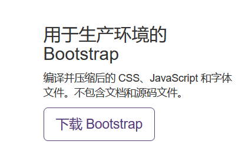

#### 依赖

依赖JavaScript的类库，jQuery。

- 下载jQuery，在页面上应用jQuery

  ```
  https://releases.jquery.com/jquer
  ```

- 在页面上应用BootStrap的JavaScript类库

  ```
  <script src="static/js/jquery-3.6.0.min.js"></script>
  <script src="static/plugins/bootstrap-3.4.1/js/bootstrap.min.js"></script>
  ```

  


#### 使用

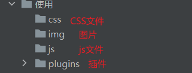

##### 1.4.1 CSS样式

###### 初识bootstrap

```html
<!DOCTYPE html>
<html lang="en">
<head>
    <meta charset="UTF-8">
    <title>Title</title>
    <!--  开发版本  -->
    <link rel="stylesheet" href="static/plugins/bootstrap-3.4.1/css/bootstrap.css">
    <!--  生产版本（开发版本压缩后的文件，占用空间小）  -->
<!--    <link rel="stylesheet" href="static/plugins/bootstrap-3.4.1/css/bootstrap.min.css">-->
</head>
<body>
    <input type="button" value="提交" />
    <input type="button" value="提交" class="btn btn-primary"/>
    <input type="button" value="提交" class="btn btn-success" />
    <input type="button" value="提交" class="btn btn-danger" />
    <input type="button" value="提交" class="btn btn-danger btn-xs" />
</body>
</html>
```

效果：

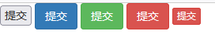

###### 导航条

可以对模板里面的样式重写

```CSS
<style>
    .navbar {
        border-radius: 0;
    }
</style>
```

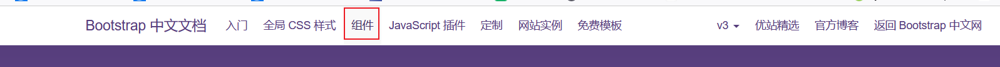

###### 栅格系统

把整体划分为12格

分类

- 响应式

  根据屏幕宽度，自动堆叠

  ```
  .col-sm-  	750px
  .col-md-    970px
  .col-lg-    1170px
  ```

  ```css
  <div class="col-lg-5" style="background-color: #00FF7F">5</div>
  <div class="col-lg-6" style="background-color: red">6</div>
  ```

- 非响应式

  总是水平排列
  
  ```html
  <!--    非响应式-->
  <div class="col-xs-4" style="background-color: #00FF7F">4</div>
  <div class="col-xs-5" style="background-color: red">4</div>
  ```
  
- 列偏移

  ```
  <div class="col-sm-offset-1 col-lg-5" style="background-color: #00FF7F">5</div>
  <div class="col-lg-6" style="background-color: red">6</div>
  ```


###### 案例：博客

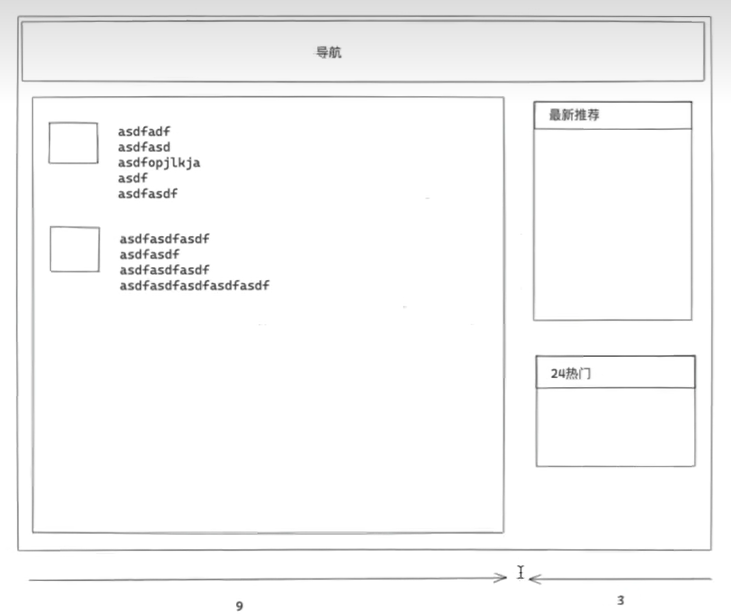

```html
<!DOCTYPE html>
<html lang="en">
<head>
    <meta charset="UTF-8">
    <title>Title</title>
    <!--  开发环境-->
    <link rel="stylesheet" href="static/plugins/bootstrap-3.4.1/css/bootstrap.css">
    <style>
        .navbar {
            border-radius: 0;
        }

        .navbar-default {
            background-color: #c1e2b3;
            border-color: #e7e7e7;
        }
    </style>
</head>
<body>
<div>
    <!--    导航条-->
    <nav class="navbar navbar-default">
        <div class="container-fluid">
            <!-- Brand and toggle get grouped for better mobile display -->
            <div class="navbar-header">
                <button type="button" class="navbar-toggle collapsed" data-toggle="collapse"
                        data-target="#bs-example-navbar-collapse-1" aria-expanded="false">
                    <span class="sr-only">Toggle navigation</span>
                    <span class="icon-bar"></span>
                    <span class="icon-bar"></span>
                    <span class="icon-bar"></span>
                </button>
                <a class="navbar-brand" href="#">博客</a>
            </div>

            <!-- Collect the nav links, forms, and other content for toggling -->
            <div class="collapse navbar-collapse" id="bs-example-navbar-collapse-1">
                <ul class="nav navbar-nav">
                    <li class="active"><a href="#">联通 <span class="sr-only">(current)</span></a></li>
                    <li><a href="#">广西</a></li>
                    <li class="dropdown">
                        <a href="#" class="dropdown-toggle" data-toggle="dropdown" role="button" aria-haspopup="true"
                           aria-expanded="false">Dropdown <span class="caret"></span></a>
                        <ul class="dropdown-menu">
                            <li><a href="#">Action</a></li>
                            <li><a href="#">Another action</a></li>
                            <li><a href="#">Something else here</a></li>
                            <li role="separator" class="divider"></li>
                            <li><a href="#">Separated link</a></li>
                            <li role="separator" class="divider"></li>
                            <li><a href="#">One more separated link</a></li>
                        </ul>
                    </li>
                </ul>
                <form class="navbar-form navbar-left">
                    <div class="form-group">
                        <input type="text" class="form-control" placeholder="Search">
                    </div>
                    <button type="submit" class="btn btn-default">搜索</button>
                </form>
                <ul class="nav navbar-nav navbar-right">
                    <li><a href="#">注册</a></li>
                    <li><a href="#">登录</a></li>
                    <li class="dropdown">
                        <a href="#" class="dropdown-toggle" data-toggle="dropdown" role="button" aria-haspopup="true"
                           aria-expanded="false">Dropdown <span class="caret"></span></a>
                        <ul class="dropdown-menu">
                            <li><a href="#">Action</a></li>
                            <li><a href="#">Another action</a></li>
                            <li><a href="#">Something else here</a></li>
                            <li role="separator" class="divider"></li>
                            <li><a href="#">Separated link</a></li>
                        </ul>
                    </li>
                </ul>
            </div><!-- /.navbar-collapse -->
        </div><!-- /.container-fluid -->
    </nav>

    <!-- 栅格   -->
    <div class="container-fluid clearfix">
        <div class="col-sm-9">
            <!--            媒体对象-->
            <div class="media">
                <div class="media-left">
                    <a href="#">
                        
                    </a>
                </div>
                <div class="media-body">
                    <h4 class="media-heading">Top aligned media</h4>
                    <p>Cras sit amet nibh libero, in gravida nulla. Nulla vel metus scelerisque ante sollicitudin
                        commodo. Cras purus odio, vestibulum in vulputate at, tempus viverra turpis. Fusce condimentum
                        nunc ac nisi vulputate fringilla. Donec lacinia congue felis in faucibus.</p>
                    <p>Donec sed odio dui. Nullam quis risus eget urna mollis ornare vel eu leo. Cum sociis natoque
                        penatibus et magnis dis parturient montes, nascetur ridiculus mus.</p>
                </div>
            </div>
            <div class="media">
                <div class="media-left">
                    <a href="#">
                        
                    </a>
                </div>
                <div class="media-body">
                    <h4 class="media-heading">Top aligned media</h4>
                    <p>Cras sit amet nibh libero, in gravida nulla. Nulla vel metus scelerisque ante sollicitudin
                        commodo. Cras purus odio, vestibulum in vulputate at, tempus viverra turpis. Fusce condimentum
                        nunc ac nisi vulputate fringilla. Donec lacinia congue felis in faucibus.</p>
                    <p>Donec sed odio dui. Nullam quis risus eget urna mollis ornare vel eu leo. Cum sociis natoque
                        penatibus et magnis dis parturient montes, nascetur ridiculus mus.</p>
                </div>
            </div>
            <div class="media">
                <div class="media-left">
                    <a href="#">
                        
                    </a>
                </div>
                <div class="media-body">
                    <h4 class="media-heading">Top aligned media</h4>
                    <p>Cras sit amet nibh libero, in gravida nulla. Nulla vel metus scelerisque ante sollicitudin
                        commodo. Cras purus odio, vestibulum in vulputate at, tempus viverra turpis. Fusce condimentum
                        nunc ac nisi vulputate fringilla. Donec lacinia congue felis in faucibus.</p>
                    <p>Donec sed odio dui. Nullam quis risus eget urna mollis ornare vel eu leo. Cum sociis natoque
                        penatibus et magnis dis parturient montes, nascetur ridiculus mus.</p>
                </div>
            </div>
            <!--            分页-->
            <ul class="pagination">
                <li class="disabled"><a href="#" aria-label="Previous"><span aria-hidden="true">«</span></a></li>
                <li class="active"><a href="#">1 <span class="sr-only">(current)</span></a></li>
                <li><a href="#">2</a></li>
                <li><a href="#">3</a></li>
                <li><a href="#">4</a></li>
                <li><a href="#">5</a></li>
                <li><a href="#" aria-label="Next"><span aria-hidden="true">»</span></a></li>
            </ul>

        </div>
        <div class="col-sm-3">
            <!--            面板-->
            <div class="panel panel-default">
                <div class="panel-heading">最新推荐</div>
                <div class="panel-body">
                    Panel content
                </div>
            </div>
            <div class="panel panel-primary">
                <div class="panel-heading">24小时热门</div>
                <div class="panel-body">
                    Panel content
                </div>
            </div>
        </div>
    </div>
</div>
</body>
</html>
```

效果图：

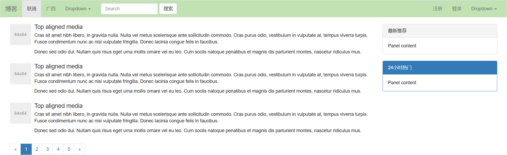

###### 案例：登录

```html
<!DOCTYPE html>
<html lang="en">
<head>
    <meta charset="UTF-8">
    <title>Title</title>
    <link rel="stylesheet" href="static/plugins/bootstrap-3.4.1/css/bootstrap.css">
    <style>
        .account{
            /*宽度*/
            width: 400px;
            /*height: 350px;*/
            /*框*/
            border: 1px solid #dddddd;
            /*圆角*/
            border-radius: 10px;
            /*阴影 水平方向 垂直方向 模糊距离 颜色*/
            box-shadow: 5px 5px 5px #aaaaaa;
            
            /*页面布局*/
            /*margin-left: auto;*/
            margin: 200px auto;
            /*内边距*/
            padding: 20px 40px;
        }

        .account h1{
            margin-top: 0;
            margin-bottom: 20px;
            /*字体居中*/
            text-align: center;
        }
    </style>
</head>
<body>
<div class="account">
    <h1>用户登录</h1>
    <form>
        <div class="form-group">
            <label for="exampleInputUsername">用户名或手机号</label>
            <input type="text" name="username" class="form-control" id="exampleInputUsername" placeholder="用户名或手机号">
        </div>
        <div class="form-group">
            <label for="exampleInputPassword">密码</label>
            <input type="password" name="password" class="form-control" id="exampleInputPassword" placeholder="密码">
        </div>
         <button type="submit" class="btn btn-primary">登  录</button>
    </form>
</div>
</body>
</html>
```

效果：

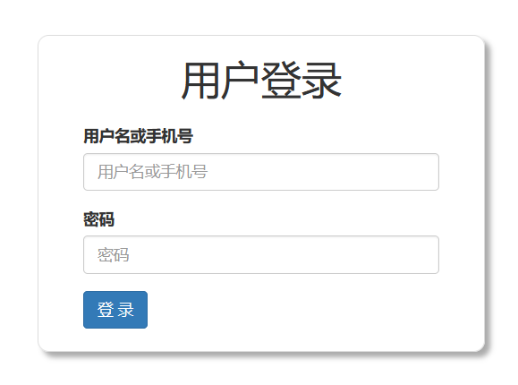

###### 案例：后台管理

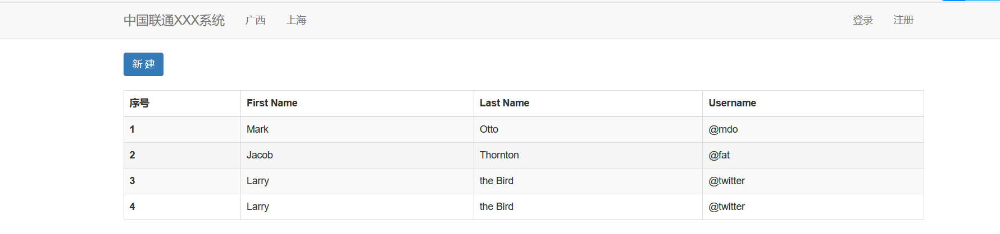

```html
<!DOCTYPE html>
<html lang="en">
<head>
    <meta charset="UTF-8">
    <title>Title</title>
    <link rel="stylesheet" href="static/plugins/bootstrap-3.4.1/css/bootstrap.css">
    <style>
        .navbar {
            border-radius: 0;
        }
    </style>
</head>
<body>
<div>
    <nav class="navbar navbar-default">
        <div class="container">
            <div class="navbar-header">
                <button type="button" class="navbar-toggle collapsed" data-toggle="collapse"
                        data-target="#bs-example-navbar-collapse-1" aria-expanded="false">
                    <span class="sr-only">Toggle navigation</span>
                    <span class="icon-bar"></span>
                    <span class="icon-bar"></span>
                    <span class="icon-bar"></span>
                </button>
                <a class="navbar-brand" href="#">中国联通XXX系统</a>
            </div>
            <div class="collapse navbar-collapse" id="bs-example-navbar-collapse-1">
                <ul class="nav navbar-nav">
                    <li><a href="#">广西</a></li>
                    <li><a href="#">上海</a></li>
                </ul>
                <ul class="nav navbar-nav navbar-right">
                    <li><a href="#">登录</a></li>
                    <li><a href="#">注册</a></li>
                </ul>
            </div>
        </div>
    </nav>

    <div class="container">
        <div>
            <button class="btn btn-primary">新 建</button>
        </div>
        <div style="margin-top: 20px">
            <table class="table table-bordered table-hover table-striped">
                <thead>
                <tr>
                    <th>序号</th>
                    <th>First Name</th>
                    <th>Last Name</th>
                    <th>Username</th>
                </tr>
                </thead>
                <tbody>
                <tr>
                    <th scope="row">1</th>
                    <td>Mark</td>
                    <td>Otto</td>
                    <td>@mdo</td>
                </tr>
                <tr>
                    <th scope="row">2</th>
                    <td>Jacob</td>
                    <td>Thornton</td>
                    <td>@fat</td>
                </tr>
                <tr>
                    <th scope="row">3</th>
                    <td>Larry</td>
                    <td>the Bird</td>
                    <td>@twitter</td>
                </tr>
                <tr>
                    <th scope="row">4</th>
                    <td>Larry</td>
                    <td>the Bird</td>
                    <td>@twitter</td>
                </tr>
                </tbody>
            </table>
        </div>
    </div>

</div>
</body>
</html>
```

###### 案例：后台管理+面板

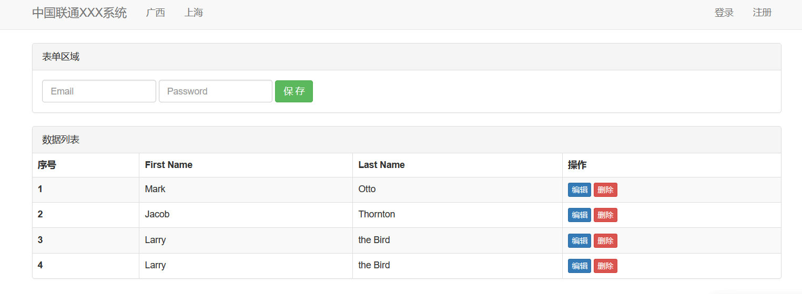

```html
<!DOCTYPE html>
<html lang="en">
<head>
    <meta charset="UTF-8">
    <title>Title</title>
    <link rel="stylesheet" href="static/plugins/bootstrap-3.4.1/css/bootstrap.css">
    <style>
        .navbar {
            border-radius: 0;
        }
    </style>
</head>
<body>
<div>
    <nav class="navbar navbar-default">
        <div class="container">
            <div class="navbar-header">
                <button type="button" class="navbar-toggle collapsed" data-toggle="collapse"
                        data-target="#bs-example-navbar-collapse-1" aria-expanded="false">
                    <span class="sr-only">Toggle navigation</span>
                    <span class="icon-bar"></span>
                    <span class="icon-bar"></span>
                    <span class="icon-bar"></span>
                </button>
                <a class="navbar-brand" href="#">中国联通XXX系统</a>
            </div>
            <div class="collapse navbar-collapse" id="bs-example-navbar-collapse-1">
                <ul class="nav navbar-nav">
                    <li><a href="#">广西</a></li>
                    <li><a href="#">上海</a></li>
                </ul>
                <ul class="nav navbar-nav navbar-right">
                    <li><a href="#">登录</a></li>
                    <li><a href="#">注册</a></li>
                </ul>
            </div>
        </div>
    </nav>


    <div class="container">
        <div class="panel panel-default">
            <div class="panel-heading">表单区域</div>
            <div class="panel-body">
                <form class="form-inline">
                    <div class="form-group">
                        <label class="sr-only" for="exampleInputEmail3">Email address</label>
                        <input type="email" class="form-control" id="exampleInputEmail3" placeholder="Email">
                    </div>
                    <div class="form-group">
                        <label class="sr-only" for="exampleInputPassword3">Password</label>
                        <input type="password" class="form-control" id="exampleInputPassword3" placeholder="Password">
                    </div>

                    <button type="submit" class="btn btn-success">保 存</button>
                </form>
            </div>
        </div>

        <div class="panel panel-default">
            <div class="panel-heading">数据列表</div>
            <!--
            <div class="panel-body">
                <p>...</p>
            </div>
`             -->
            <!-- Table -->
            <table class="table table-bordered table-hover table-striped">
                <thead>
                <tr>
                    <th>序号</th>
                    <th>First Name</th>
                    <th>Last Name</th>
                    <th>操作</th>
                </tr>
                </thead>
                <tbody>
                <tr>
                    <th scope="row">1</th>
                    <td>Mark</td>
                    <td>Otto</td>
                    <td>
                        <a href="" class="btn btn-primary  btn-xs">编辑</a>
                        <a href="" class="btn btn-danger  btn-xs">删除</a>
                    </td>
                </tr>
                <tr>
                    <th scope="row">2</th>
                    <td>Jacob</td>
                    <td>Thornton</td>
                    <td>
                        <a href="" class="btn btn-primary  btn-xs">编辑</a>
                        <a href="" class="btn btn-danger  btn-xs">删除</a>
                    </td>
                </tr>
                <tr>
                    <th scope="row">3</th>
                    <td>Larry</td>
                    <td>the Bird</td>
                    <td>
                        <a href="" class="btn btn-primary  btn-xs">编辑</a>
                        <a href="" class="btn btn-danger  btn-xs">删除</a>
                    </td>
                </tr>
                <tr>
                    <th scope="row">4</th>
                    <td>Larry</td>
                    <td>the Bird</td>
                    <td>
                        <a href="" class="btn btn-primary  btn-xs">编辑</a>
                        <a href="" class="btn btn-danger  btn-xs">删除</a>
                    </td>
                </tr>
                </tbody>
            </table>
        </div>
    </div>

</div>
</body>
</html>
```

###### 图标

图标类型较少，建议使用Font Awesome图标模板

## 1.5  Font Awesome（字体图标）模板

- 下载

  网址：https://fontawesome.dashgame.com/

- 引入

  ```css
  <link rel="stylesheet" href="static/plugins/font-awesome-4.7.0/css/font-awesome.css">
  ```

- 使用

  ```html
  <i class="fa fa-pencil-square" aria-hidden="true"></i>
  ```

  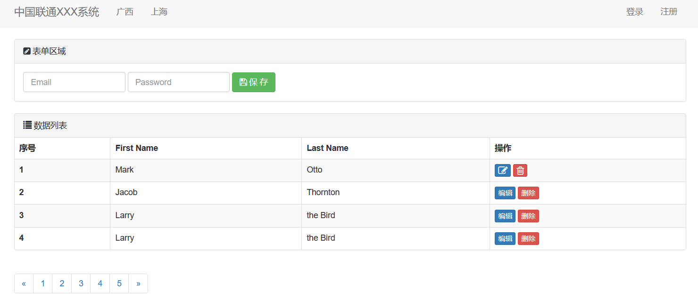

## 1.6 JavaScript

-  编程语言，浏览器是解释器
-  DOM和BOM（内置模块）
- 类库（第三方模块）
  - jQuery

```Html
<!DOCTYPE html>
<html lang="en">
<head>
    <meta charset="UTF-8">
    <title>Title</title>
    <style>
        .menus {
            width: 200px;
            border: 1px solid red
        }

        .menus .header {
            background-color: gold;
            padding: 20px 10px;
        }
    </style>
</head>
<body>
<div class="menus">
    <!--    绑定JS函数-->
    <div class="header" onclick="myFunc()">大标题</div>
    <div class="item">内容</div>
</div>
<!--JS函数-->
<script type="text/javascript">
    function myFunc() {
        alert("Hello Word")
    }
</script>
</body>
</html>
```

效果图：

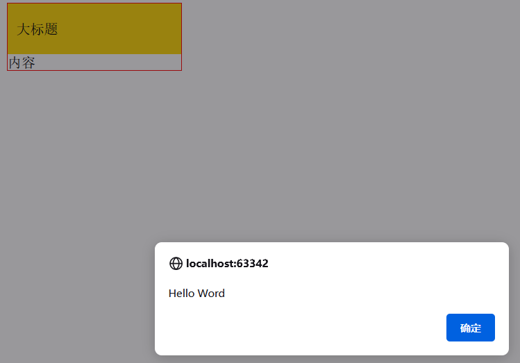

### 1.6.1 JavaScript代码位置

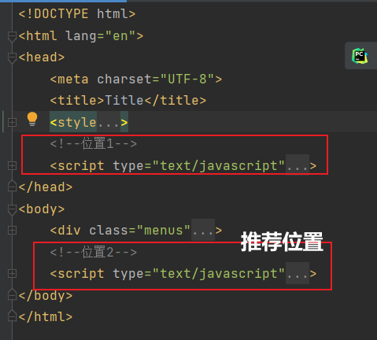

#### JS代码存在形式

- 当前HTML中

- JS文件中,导入使用

  ```html
  <script src="static/js/jquery-3.6.0.min.js"></script>
  <script src="static/plugins/bootstrap-3.4.1/js/bootstrap.min.js"></script>
  ```

### 1.6.2 变量

变量定义：

```javascript
var name = "高倩"
```

变量打印：

```javascript
<script type="text/javascript">
    // 定义变量
    var name = "高倩"
    // 打印变量
    console.log(name);
</script>
```

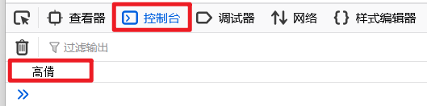

### 1.6.3 数据类型

#### 1、字符串

```javascript
// 声明
var name = "高倩"
var name = String("高倩")

// 常见功能
var v1 = name.length;  // 获取字符串长度
var v2 = name[0];  // 字符串索引，name.charAt(0)
var v3 = name.trim();  // 去除首尾空白
var v3 = name.substring(1, 2)  // 切片，前取后不取
```


##### 案例：跑马灯（字符串）

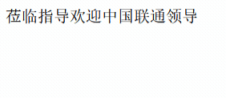

```html
<!DOCTYPE html>
<html lang="en">
<head>
    <meta charset="UTF-8">
    <title>跑马灯</title>
</head>
<body>
<span id="txt">欢迎中国联通领导莅临指导</span>
<script type="text/javascript">
    // 定义函数
    function show() {
        // 1.去HTML中找到某个标签并获取它的位置（DOM）
        var tag = document.getElementById("txt");
        var dataSting = tag.innerText;

        // 2.动态起来，把文本中的第一个字符放在字符串最后面
        var firstChar = dataSting[0]
        var otherString = dataSting.substring(1, dataSting.length)
        var newText = otherString + firstChar

        // 3.在HTML标签中更新内容
        tag.innerText = newText
    }

    // 定时器，定时执行函数1000ms
    setInterval(show, 1000)
</script>
</body>
</html>
```

#### 2、数组

```javascript
// 定义
var v1 = [11,22,33,44];
var v2 = Array([11,22,33,44])
```

```javascript
// 定义
var v1 = [11,22,33,44]
// 获取值
v1[1]
// 修改值
v1[0] = "高倩"
// 尾部追加
v1.push("联通")
// 头部追加
v1.unshift("电信")
// 指定位置追加,第二个参数固定为0
v1.splice(3, 0, "中国")
v1.pop()  // 尾部删除
v1.pop()  // 头部删除
v1.splice(3, 1)  // 索引为3的元素删除

// idx 是数组索引
for (var idx in v1) {
    data = v1[idx]
}
```

```javascript
for (var i= 0; i<v1.length; i++) {
    data = v1[i]
}
```

- for 循环开始时，初始化一个变量 i 为 0,然后在每次循环迭代之前检查条件 i < v1.length,即 i 是否小于数组 v1 的长度。如果条件为真，则执行循环体中的代码。
- 在循环体中，将数组 v1 中索引为 i 的元素赋值给变量 data。这里的 i 是循环变量，用于指定要访问数组元素的位置。

##### 案例：动态数据

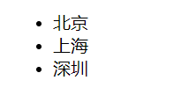

```html
<!DOCTYPE html>
<html lang="en">
<head>
    <meta charset="UTF-8">
    <title>跑马灯</title>
</head>
<body>
<ul id="city">
    <!--    <li>北京</li>-->
</ul>
<script type="text/javascript">
    var cityList = ["北京", "上海", "深圳"];
    for (var idx in cityList) {
        var text = cityList[idx]
        // 创建 li标签
        var tag = document.createElement("li");
        // 在li标签添加内容
        tag.innerText = text;
        // 添加到id=city 标签里面，DOM
        var parenTag = document.getElementById("city")
        parenTag.appendChild(tag)
    }
</script>
</body>
</html>
```

#### 3、对象（字典）

```javascript
// 定义字典
info = {
    "name": "高倩",
    "age": 18
}

info1 = {
    name: "高倩",
    age: 20
}
```

```javascript
// 读取字典
console.log(info.age)
console.log(info1["name"])

// 修改字典
info1["name"] = "郭子豪"
console.log(info1)

// 删除字典元素
delete info1["name"]
console.log(info1)

// 字典循环
for (var key in info){
    data = info[key]
    console.log(data)
}
```

##### 案例：动态表格

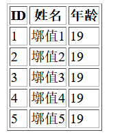

```html
<!DOCTYPE html>
<html lang="en">
<head>
    <meta charset="UTF-8">
    <title>动态数据</title>
</head>
<body>
<table border="1">
    <thead>
    <tr>
        <th>ID</th>
        <th>姓名</th>
        <th>年龄</th>
    </tr>
    </thead>
    <tbody id="body">

    </tbody>
</table>
<script type="text/javascript">
    var dataList = [
        {id: 1, name: "墎值1", age: 19},
        {id: 2, name: "墎值2", age: 19},
        {id: 3, name: "墎值3", age: 19},
        {id: 4, name: "墎值4", age: 19},
        {id: 5, name: "墎值5", age: 19}
    ];
    for (var idx in dataList) {
        var info = dataList[idx];
        var tr = document.createElement("tr");
        for (var key in info) {
            var text = info[key];
            // 创建 td标签
            var td = document.createElement('td');
            // 在td标签添加内容
            td.innerText = text;
            // td标签添加到tr标签里面
            tr.appendChild(td);
        }
        // 添加到id=body 标签里面，DOM
        var bodyTag = document.getElementById("body")
        bodyTag.appendChild(tr)
    }

</script>
</body>
</html>
```


# 二、Mysql

# 三、Django