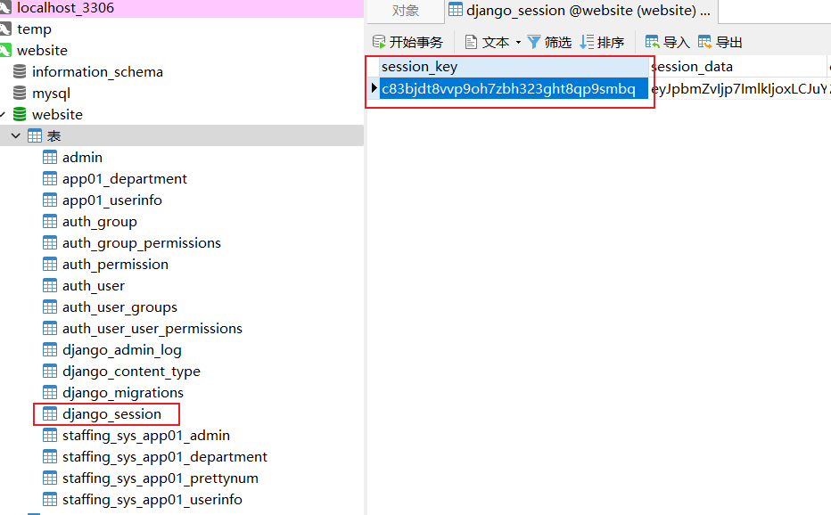
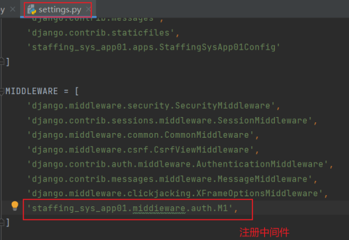

[TOC]

【web开发全家桶】https://www.bilibili.com/video/BV1rT4y1v7uQ?p=5&vd_source=d6c3edd9a4f6205095ccfba6b2a61eec

目的：开发一个平台（网站）

- 前端开发：HTML、CSS、JavaScript
- Web框架：接收请求并处理

- Mysql数据库：存储数据

快速上手：
	基于Flask Web框架快速搭建一个网站
深入学习：
	基于Django框架（主要）# 

# 一、前端

## 1 前端开发

注释

- HTML注释

  ```html
  <!-- 注释内容-->
  ```

- CSS注释

  ```css
  /* 注释内容*/
  ```

- JavaScript注释

  ```js
  // 注释内容
  
  /* 注释内容 */
  ```

### 1.1 快速开发网站（Flask）

- 规定有些文件必须放到指定文件夹
- 新创建一个页面
  - 函数
  - HTML文件

```markdown
pipenv install flask
```

```python
from flask import Flask

app = Flask(__name__)

# 创建了网址 /show/info 和函数index 的对应关系
# 以后用户在浏览器上访问 /show/info ,网站自动执行 index
@app.route("/show/info" , methods=["GET", "POST"])
def index():
    return "中国联通"

if __name__ == '__main__':
    app.run()
```

Flask框架为了方便写标签，支持将字符串写入文件中。

```python
from flask import Flask,render_template

app = Flask(__name__)

@app.route("/show/info")
def index():
    # Flask 内部会自动打开这个文件，并读取内容，将内容给用户返回
    # 默认：去当前项目目录的templates文件夹中找。
    return render_template("index.html")

if __name__ == '__main__':
    app.run(debug=True)
```

### 1.2 HTML标签

#### 1.2.1 编码

```html
<meta charset="UTF-8">
```

#### 1.2.2 网站主题

```html
<title>Title</title>
```

#### 1.2.3 标题

HTML 标题（Heading）是通过<h1> - <h6> 标签来定义的。

```html
    <h1 >一级标题</h1>
    <h2 >二级标题</h2>
    <h3 >三级标题</h3>
    <h4 >四级标题</h4>
    <h5 >五级标题</h5>
    <h6 >六级标题</h6>
```


#### 1.2.4 div和span

```html
<div>内容</div>
<span>as</span>
```

- div,占一整行【块级标签】
- span,自己多大占多少【行内标签，内联标签】

#### 1.2.5 超链接

a【行内标签】

```html
<!-- 跳转到其他网站 -->
<a href="https://www.baidu.com">点击跳转</a>

<!-- 跳转到自己网站的其他网站 -->
<a href="/get/news">点击跳转到http://127.0.0.1:5000/get/news</a>
```

```html
<!-- 当前页面打开-->
<a href="https://image.baidu.com/search/index"">

<!-- 新的Tab页面打开-->
<a href="https://image.baidu.com/search/index" target="_blank">
```

#### 1.2.6 图片

img【行内标签】

- 本地图片

 	Flask框架要求图片放置在：static目录

```html

```

- 其它来源图片（可能无法正常显示，为防止盗用【已加密】）

```

```

设置图片高度和宽度

```

```

#### 1.2.7 列表

- 无序列表

```html
<ul>
    <li>中国移动</li>
    <li>中国联通</li>
    <li>中国电信</li>
    <li>中国广电</li>
</ul>
```


- 有序列表

```html
<ol>
    <li>中国移动</li>
    <li>中国联通</li>
    <li>中国电信</li>
    <li>中国广电</li>
</ol>
```


#### 1.2.8 表格

```html
<table  border="1">表格
    <thead>
        <tr> <th style="border: 1px solid gray">ID</th>	<th>姓名</th>	<th>年龄</th> </tr>
    </thead>
    <tbody>
        <tr> <td style="border: 1px solid gray">10</td> <td>张三</td> <td>10</td> </tr>
        <tr> <td>11</td> <td>李四</td> <td>10</td> </tr>
        <tr> <td>12</td> <td>王五</td> <td>10</td> </tr>
        <tr> <td>13</td> <td>王麻子</td> <td>10</td> </tr>
        <tr> <td>14</td> <td>张器</td> <td>10</td> </tr>
    </tbody>
</table>
```


#### 1.2.9 input系列

```html
<!-- 文本输入-->
<input type="text"/>
<!--密码输入-->
<input type="password"/>
<!-- 文件选择-->
<input type="file"/>
<!-- 单选框-->
<input type="radio" name="n1"/>男
<input type="radio" name="n1"/>女
<!-- 复选框-->
<input type="checkbox" />乒乓球
<input type="checkbox"/>篮球
<--普通按钮-->
<input type="button" value="提交"/>
<--提交表单按钮,POST请求-->
<input type="submit" value="提交2"/>
```

#### 2.4.10 下拉框

```html
<!--单选下拉框-->
<select>
    <option>北京</option>
    <option>上海</option>
    <option>深圳</option>
</select>

<!--多选下拉框-->
<select multiple>
    <option>北京</option>
    <option>上海</option>
    <option>深圳</option>
</select>
```

#### 2.4.11 多行文本

```html
<!--默认3行-->
<textarea rows="3"></textarea>
```

#### 2.4.12 form表单和提交

- form标签
  - 提交方式(post/get)：`method="get" ` 
  - 提交地址：`action="xxx/xxx/xx/xx"`
  - 提交按钮：`<input type="submit" value="submit按钮">`

- 数据标签
  - 数据标签必须有`name`属性

- 后台数据获取
  - get方式：`request.args`
  - post方式：`request.form`
    - 单值获取：`request.form.get("username")`
    - 多值获取：`request.form.getlist("hobby")`

#### 案例：用户注册

```
<body>
<h1>用户注册</h1>
<!--<form method="get"  action="/do/reg">-->
<form method="post" action="/register">
    <div>
        用户名：<input type="text" name="username"/>
    </div>
    <div>
        密码：<input type="password" name="password"/>
    </div>
    <div>
        性别：
        <input type="radio" name="gender" value="1"/>男
        <input type="radio" name="gender" value="2"/>女
    </div>
    <div>
        爱好：
        <input type="checkbox" name="hobby" value="篮球"/>篮球
        <input type="checkbox" name="hobby" value="乒乓球"/>乒乓球
        <input type="checkbox" name="hobby" value="羽毛球"/>羽毛球
        <input type="checkbox" name="hobby" value="足球"/>足球
    </div>
    <div>
        城市：
        <select name="city">
            <option value="bj">北京</option>
            <option value="sh">上海</option>
            <option value="sz">深圳</option>
        </select>
    </div>
    <div>
        擅长领域：
        <select name="skill" multiple>
            <option value="游戏">游戏</option>
            <option value="睡觉">睡觉</option>
            <option value="刷抖音">刷抖音</option>
            <option value="吃饭">吃饭</option>
        </select>
    </div>
    <div>
        备注：<textarea name="more"></textarea>
    </div>
    <div>
        <input type="button" value="button按钮">
        <input type="submit" value="submit按钮">
    </div>
    <div>
        <span>选择文件框</span>
        <input name="file" type="file">
    </div>
</form>
</body>
```


#### 案例：用户登录

```
<body>
<h1>用户登录</h1>
<form method="post" action="/login">
    用户名：<input type="text" name ="username"/>
    密码：<input type="password" name ="password"/>
    <input type="submit" value="登录"/>
</form>
</body>
```

### 1.3 CSS样式

#### 1.3.1 快速了解

```


<div style="color: red;">中国联通</div>
```

#### 1.3.2 CSS应用方式

- 在标签上

  ```
  
  
  <div style="color: red;">中国联通</div>
  ```

- 样式选择器（在head标签中写style标签）

  ```
  <style>
      .c1{
      	color: red;
      }
  </style>
      
  <h1 class="c1">用户登录</h1>
  ```

- CSS文件（写到文件中）

  ```
  <link rel="stylesheet" href="common.css"/>
  ```

#### 1.3.3 CSS选择器

- ID选择器

  ```html
  <!--ID选择器 -->
  #c2{
      height: 10px;
  }
  
  <div id="c2"></div>
  ```

- 类选择器

  ```html
  <!--类选择器 -->
  .c1{
  color: red;
  }
  <div class="c2"></div>
  ```

- 标签选择器

  ```html
  <!--标签选择器 -->
  div{
  color: green;
  }
  <div>xxxx</div>
  ```

- 属性选择器

  ```html
  input[type='text'] {
  	border: 1px solid red;
  }
  .v1[xx="456"]{
  	color: gold;
  }
  ```

  ```html
  <input type="text">
  <input type="password">
  
  <div class="v1" xx="123">e</div>
  <div class="v1" xx="456">d</div>
  <div class="v1" xx="789">f</div>
  ```

- 后代选择器

  ```html
  <!--每一代-->
  .yy li{
  	color: blue;
  }
  
  <!--第一代-->
  .yy > a{
  	color: blue;
  }
  ```

  ```html
  <div class="yy">
      <a>百度</a>
      <div>
          <a >谷歌</a>
      </div>
      <ul>
          <li>美国</li>
          <li>日报</li>
          <li>安国</li>
      </ul>
  </div>
  ```

  多个和覆盖:属性名相同后面覆盖前面，不同共同作用，不覆盖可添加`！important`

  ```html
  <!DOCTYPE html>
  <html lang="en">
  <head>
      <meta charset="UTF-8">
      <title>Title</title>
      <style>
          .c1 {
              color: red !important;
              border: 1px solid red;
          }
          .c2 {
              font-size: 28px;
              color: gold;
          }
      </style>
  </head>
  <body>
  <div class="c1 c2">中国联通</div>
  </body>
  </html>
  ```

#### 1.3.4 样式

##### 高度和宽度

注意事项

- 宽度支持百分比
- 行内标签：默认无效
- 块级标签：默认有效

```html
<style>
    .c1 {
        height: 300px;
        width: 500px;
    }
</style>
```

##### 块级和行内标签

- 块级

- 行内

- css样式：转换 `display:inline-block`

  块级、行内互相转换

  ```
  <div style="display:inline">中国</div>
  <span style="display: block">联通</span>
  ```

##### 字体和颜色

- 颜色
- 大小
- 加粗
- 字体

```html
<!DOCTYPE html>
<html lang="en">
<head>
    <meta charset="UTF-8">
    <title>Title</title>
    <style>
        .c1 {
            color: #00FF7F;
            font-size: 58px;
            font-weight: 600;
            font-family: emoji,楷体;
        }
    </style>
</head>
<body>
<div class="c1">中国联通</div>
<div>中国移动</div>
</body>
</html>
```

##### 文字对齐方式

```html
<!DOCTYPE html>
<html lang="en">
<head>
    <meta charset="UTF-8">
    <title>Title</title>
    <style>
        .c1 {
            height: 59px;
            width: 300px;
            border: 1px solid red;

            text-align: center; /* 水平方向居中 */
            line-height: 59px; /* 垂直方向居中 */
        }
    </style>

</head>
<body>
    <div class="c1">郭智</div>
</body>
</html>
```

##### 浮动

注意：浮动会使标签脱离文档流。

```html
<!DOCTYPE html>
<html lang="en">
<head>
    <meta charset="UTF-8">
    <title>Title</title>
    <style>
        .item {
            /*左边浮动*/
            float: left;
            /*宽度*/
            width: 200px;
            /*高度*/
            height: 170px;
            /*红色边框*/
            border: 1px solid red;
        }
    </style>
</head>
<body>
<div>
    <span>左边</span>
    <!--    右边浮动-->
    <span style="float:right">右边</span>
</div>
<!--添加蓝色底色-->
<div style="background-color: dodgerblue">
    <div class="item">一</div>
    <div class="item">二</div>
    <div class="item">三</div>
    <div class="item">四</div>
    <div class="item">五</div>
    <div class="item">六</div>
    <!-- 解除浮动脱离文档流-->
    <div style="clear: both"></div>
</div>
<div>您好</div>
</body>
</html>
```


##### 内边距

内边距，标签内部距离

```html
<!DOCTYPE html>
<html lang="en">
<head>
    <meta charset="UTF-8">
    <title>Title</title>
    <style>
        .outer {
            border: 1px solid red;
            height: 200px;
            width: 200px;
            /*内边距：标签内部距离*/
            /*padding-top: 20px;*/
            /*padding-left: 20px;*/
            /*padding-right: 20px;*/
            /*padding-bottom: 20px;*/
            /*代表上下左右*/
            /*padding: 20px;*/
            /*分别代表 上 右 下 左（顺时针）*/
            padding: 20px 10px 5px 3px;
        }
    </style>
</head>
<body>
<div class="outer">
    <div style="background-color: gold">听妈妈的话</div>
    <div>小朋友是否下水</div>
</div>
</body>
</html>
```

##### 外边距

```html
<!DOCTYPE html>
<html lang="en">
<head>
    <meta charset="UTF-8">
    <title>Title</title>
</head>
<body>
<div style="height: 200px;background-color: dodgerblue;"></div>
<!--外边距：外部距离 margin-top: 20px-->
<div style="background-color: red;height: 100px;margin-top: 20px;"></div>
</body>
</html>
```

##### 禁止复制粘贴

在html中，可以利用touch-callout和user-select属性来属性禁止复制粘贴功能，只需要设置“user-select:none;-webkit-touch-callout:none;”样式即可

#### 1.3.5 CSS案例

##### 小米商城顶部

- body标签，默认有一个边距

  ```css
  /*去除边距*/
  body {
      /*外边距为0*/
      margin: 0;
  }
  ```

- 内容居中

  - 文本居中

    ```css
    <div style="
    /*外边距*/
    margin-top: 30px;
    /*标签宽度*/
    width:800px;
    /*文本居中*/
    text-align: center;
    /*添加红色边框*/
    border: 1px solid red
    ">文本居中</div>
    ```

    

  - 区域局中

    自己有宽度，左右自动

    ```CSS
    .container {
        width: 980px;
        /*外边距：上下0 左右 自动*/
        margin: 0 auto;
    }
    ```


```html
<!DOCTYPE html>
<html lang="en">
<head>
    <meta charset="UTF-8">
    <title>小米商城 - Xiaomi 13、Redmi K60、MIX FOLD 2，小米电视官方网站</title>
    <style>
        body {
            /*外边距为0*/
            margin: 0;
        }

        .header {
            /*背景色：#333*/
            background-color: #333;
        }

        .container {
            width: 980px;
            /*外边距：上下0 左右 自动*/
            margin: 0 auto;
        }

        .header .menu {
            /*设置标签浮动*/
            float: left;
            /*标签颜色*/
            color: white;
        }

        .header .account {
            float: right;
            color: white;
        }

        .header a {
            color: #b0b0b0;
            /*标签高度*/
            line-height: 40px;
            display: inline-block;
            font-size: 12px;
            margin-right: 10px;
        }
    </style>
</head>
<body>

<div class="header">
    <div class="container">
        <div class="menu">
            <a>小米商城</a>
            <a>MIUI</a>
            <a>云服务</a>
            <a>有品</a>
            <a>开放平台</a>
        </div>
        <div class="account">
            <a href="">登录</a>
            <a href="">注册</a>
            <a href="">消息</a>
            <a href="">通知</a>
        </div>
        <!--解除浮动-->
        <div style="clear: both"></div>
    </div>
</div>
</body>
</html>
```

##### 小米商城二级菜单

```
a标签，默认有下划线
/*取消下划线*/
text-decoration: none;

鼠标放上面变格式
/*鼠标放到上面显示样式设置*/
 a:hover {
color: #ff6788;
}
```

1、 划分区域

2、搭建框架

3、设置样式

模板：


代码：

```html
<!DOCTYPE html>
<html lang="en">
<head>
    <meta charset="UTF-8">
    <title>Title</title>
    <style>
        body {
            margin: 0;
        }

        .sub-header {
            height: 100px;
            /*background-color: #b0b0b0;*/
        }

        .container {
            width: 1128px;
            margin: 0 auto;
            /*border: 1px solid red;*/
        }

        .sub-header .height {
            height: 100px
        }

        .sub-header .log {
            width: 234px;
            float: left;
            /*border: 1px solid red;*/
        }

        .sub-header .log a {
            margin-top: 22px;
            display: inline-block;
        }

        .sub-header .log a img {
            height: 56px;
            width: 56px;
        }

        .sub-header .menu-list {
            float: left;
            line-height: 100px;
            /*border: 1px solid red;*/
        }

        .sub-header .menu-list a {
            padding: 0 10px;
            display: inline-block;
            color: #333333;
            font-size: 16px;
            /*取消下划线*/
            text-decoration: none;
        }
        /*鼠标放到上面显示样式设置*/
        .sub-header .menu-list a:hover{
            color:#ff6788;
        }

        .sub-header .search {
            float: right;
            display: inline-block;
            line-height: 100px;
            /*border: 1px solid red;*/

        }
    </style>
</head>
<body>
<div class="sub-header">
    <div class="container">
        <div class="log height">
            <a href="https://www.mi.com">
                
            </a>
        </div>
        <div class="menu-list height">
            <a href="https://www.mi.com">Xiaomi手机</a>
            <a href="https://www.mi.com">Redmi手机</a>
            <a href="https://www.mi.com">电视</a>
            <a href="https://www.mi.com">笔记本</a>
            <a href="https://www.mi.com">平板</a>
            <a href="https://www.mi.com">家电</a>
            <a href="https://www.mi.com">路由器</a>
            <a href="https://www.mi.com">服务中心</a>
            <a href="https://www.mi.com">社区</a>
        </div>
        <div class="search height">搜索框暂时先不做</div>
        <div style="clear: both"></div>
    </div>
</div>

</body>
</html>
```

显示：


##### 小米商城推荐区域

透明度

```
/*透明度*/
opacity: 0.7;
```


模板：


代码：

```HTML
<!DOCTYPE html>
<html lang="en">
<head>
    <meta charset="UTF-8">
    <title>小米商城 - Xiaomi 13、Redmi K60、MIX FOLD 2，小米电视官方网站</title>
    <style>
        body {
            /*外边距为0*/
            margin: 0;
        }

        img {
            width: 100%;
            height: 100%;
        }

        .left {
            float: left;
        }

        .header {
            /*背景色：#333*/
            background-color: #333;
        }

        .container {
            width: 1226px;
            /*外边距：上下0 左右 自动*/
            margin: 0 auto;
        }

        .header .menu {
            /*设置标签浮动*/
            float: left;
            /*标签颜色*/
            color: white;
        }

        .header .account {
            float: right;
            color: white;
        }

        .header a {
            color: #b0b0b0;
            /*标签高度*/
            line-height: 40px;
            /*转换 行、块*/
            display: inline-block;
            /*字体大小*/
            font-size: 12px;
            /*外边距*/
            margin-right: 10px;
            /*取消下划线*/
            text-decoration: none;

        }

        .header a:hover {
            color: white;
            /*取消下划线*/
            text-decoration: none;
        }

        .sub-header {
            height: 100px;
            /*background-color: #b0b0b0;*/
        }

        .sub-header .height {
            height: 100px
        }

        .sub-header .log {
            width: 234px;
            float: left;
            /*border: 1px solid red;*/
        }

        .sub-header .log a {
            margin-top: 22px;
            display: inline-block;
        }

        .sub-header .log a img {
            height: 56px;
            width: 56px;
        }

        .sub-header .menu-list {
            float: left;
            line-height: 100px;
            /*border: 1px solid red;*/
        }

        .sub-header .menu-list a {
            /*内边距,上下0 左右10px*/
            padding: 0 10px;
            display: inline-block;
            color: #333333;
            font-size: 16px;
            /*取消下划线*/
            text-decoration: none;
            /*border: 1px solid red;*/
        }

        /*鼠标放到上面显示样式设置*/
        .sub-header .menu-list a:hover {
            color: #ff6788;
        }

        .sub-header .search {
            float: right;
            display: inline-block;
            line-height: 100px;
            /*border: 1px solid red;*/

        }

        .slider .sd-img {
            /*width: 1226px;*/
            height: 460px;
        }

        .news {
            padding-top: 14px;
        }

        .news .channel {
            width: 228px;
            height: 164px;
            background-color: #5f5750;
            padding: 3px;
        }

        .news .channel .item {
            height: 86px;
            width: 76px;
            /*border: 1px solid royalblue;*/
            float: left;
            text-align: center;
        }

        .news .channel .item a {
            display: inline-block;
            font-size: 12px;
            padding-top: 18px;
            color: white;
            text-decoration: none;
            /*透明度*/
            opacity: 0.7;
        }

        .news .channel .item a:hover {
            opacity: 1;
        }

        .news .channel img {
            height: 24px;
            width: 24px;
            display: block;
            /*上0 左右自动 下4*/
            margin: 0 auto 4px;

        }

        .news .list-item {
            width: 316px;
            height: 170px;
        }

    </style>
</head>
<body>

<div class="header">
    <div class="container">
        <div class="menu">
            <a href="https://www.mi.com">小米商城</a>
            <a href="https://www.mi.com">MIUI</a>
            <a href="https://www.mi.com">云服务</a>
            <a href="https://www.mi.com">有品</a>
            <a href="https://www.mi.com">开放平台</a>
        </div>
        <div class="account">
            <a href="https://www.mi.com">登录</a>
            <a href="https://www.mi.com">注册</a>
            <a href="https://www.mi.com">消息</a>
            <a href="https://www.mi.com">通知</a>
        </div>
        <!--解除浮动-->
        <div style="clear: both"></div>
    </div>
</div>
<div class="sub-header">
    <div class="container">
        <div class="log height">
            <a href="https://www.mi.com">
                
            </a>
        </div>
        <div class="menu-list height">
            <a href="https://www.mi.com">Xiaomi手机</a>
            <a href="https://www.mi.com">Redmi手机</a>
            <a href="https://www.mi.com">电视</a>
            <a href="https://www.mi.com">笔记本</a>
            <a href="https://www.mi.com">平板</a>
            <a href="https://www.mi.com">家电</a>
            <a href="https://www.mi.com">路由器</a>
            <a href="https://www.mi.com">服务中心</a>
            <a href="https://www.mi.com">社区</a>
        </div>
        <div class="search height">搜索框暂时先不做</div>
        <div style="clear: both"></div>
    </div>
</div>
<div class="slider">
    <div class="container">
        <div class="sd-img">
            
        </div>
    </div>

</div>
<div class="news">
    <div class="container">
        <div class="channel left">
            <div class="item">
                <a href="https://www.mi.com">
                    
                    <span>保障服务</span>
                </a>
            </div>
            <div class="item">
                <a href="https://www.mi.com">
                    
                    <span>企业团购</span>
                </a>
            </div>
            <div class="item">
                <a href="https://www.mi.com">
                    
                    <span>F码通道</span>
                </a>
            </div>
            <div class="item">
                <a href="https://www.mi.com">
                    
                    <span>米粉卡</span>
                </a>
            </div>
            <div class="item">
                <a href="https://www.mi.com">
                    
                    <span>以旧换新</span>
                </a>
            </div>
            <div class="item">
                <a href="https://www.mi.com">
                    
                    <span>话费充值</span>
                </a>
            </div>
            <!--            <div class="clear:both"></div>-->
        </div>
        <div class="list-item left" style="margin-left: 14px">
            
        </div>
        <div class="list-item left" style="margin-left: 15px">
            
        </div>
        <div class="list-item left" style="margin-left: 15px">
            
        </div>
        <!--        <div class="clear: both"></div>-->
    </div>
</div>
</body>
</html>
```


显示：


#### 1.3.6 CSS知识点

##### hover(伪类)

```css
.download{
    /*隐藏*/
    display: none;
}

.app:hover .download{
    /*显示*/
    display: block;
}
```


```html
<!DOCTYPE html>
<html lang="en">
<head>
    <meta charset="UTF-8">
    <title>Title</title>
    <style>
        .c1 {
            color: red;
            font-size: 18px;
        }

        .c1:hover {
            color: green;
            font-size: 50px;
        }

        .c2 {
            height: 300px;
            width: 500px;
            border: 1px solid red;
        }

        .c2:hover {
            border: 5px solid green;
        }

        .download{
            /*隐藏*/
            display: none;
        }

        .app:hover .download{
            /*显示*/
            display: block;
        }
        .app:hover .title{
            color: red;
        }
    </style>
</head>
<body>
    <div class="c1">联通</div>
    <div class="c2">广西</div>
    
    <div class="app">
        <div class="title">下载AAP</div>
        <div class="download">
            
        </div>
    </div>
</body>
</html>
```

效果：


##### after(伪类)

```css
/*标签尾部添加东西*/
.c1:after {
    content: "大帅哥";
}
```

```html
<!DOCTYPE html>
<html lang="en">
<head>
    <meta charset="UTF-8">
    <title>Title</title>
    <style>

        /*标签尾部添加东西*/
        .c1:after {
            content: "大帅哥";
        }
        .clearfix{
            background-color: #ff6788;
        }
        .clearfix:after {
            /*标签后面填充字符为空*/
            content: "";
            /*div 变块级标签*/
            display: block;
            /*清除浮动*/
            clear: both;
        }
        .item{
            float: left;
            border: 1px solid red;
        }
    </style>
</head>
<body>
    <div class="c1">武阳郡</div>
    <div class="clearfix">
        <div class="item">1</div>
        <div class="item">2</div>
        <div class="item">3</div>
        <div class="clear:both"></div>
    </div>
</body>
</html>
```

效果：


##### position（窗口位置）

- fixed 固定在窗口的某个位置

- > 设置相对位置 relative absolute

###### fixed

固定在窗口的某个位置

###### 案例：返回顶部

```html
<!DOCTYPE html>
<html lang="en">
<head>
    <meta charset="UTF-8">
    <title>Title</title>
  <style>
    .back{
      /*固定在窗口的某个位置*/
      position: fixed;

      width: 68px;
      height: 60px;
      border: 1px solid red;

      /*右边*/
      right: 0;
      /*底部*/
      bottom:0;
    }
  </style>
</head>
<body>
<!--高度1000px,底色灰色-->
<div style="height: 1000px;background-color: #b0b0b0"></div>
  <div class="back">返回顶部</div>
</body>
</html>
```

效果：


###### 案例：对话框

```html
<!DOCTYPE html>
<html lang="en">
<head>
    <meta charset="UTF-8">
    <title>Title</title>
    <style>
        .mask{
            background-color: black;
            position: fixed;
            left: 0;
            right: 0;
            top: 0;
            bottom: 0;
            opacity: 0.7;
            z-index: 999;
        }
        .dialog {
            /*固定在窗口的某个位置*/
            position: fixed;

            width: 280px;
            height: 200px;
            background-color: white;

            left: 0;
            right: 0;
            margin: 0 auto;

            top: 200px;
            /*谁的值大谁在上面*/
            z-index: 1000;
        }
    </style>
</head>
<body>


<!--高度1000px,底色灰色-->
<div style="height: 1000px;">gggggggg</div>
<div class="dialog">对话框</div>
<div class="mask"></div>


</body>
</html>
```

###### relative和absolute

设置相对位置

```html
<!DOCTYPE html>
<html lang="en">
<head>
    <meta charset="UTF-8">
    <title>Title</title>
    <style>
        .c1{
            height: 300px;
            width: 500px;
            border: 1px solid red;
            margin: 100px;

            position: relative;
        }

        .c1 .c2{
            height: 59px;
            width: 59px;
            background-color: #00FF7F;

            position: absolute;
            /*相对c1的位置*/
            right: 20px;
            bottom: 20px;
        }
    </style>
</head>
<body>
<div class="c1">
    <div class="c2"></div>
    <div class="c2"></div>
    <div class="c2"></div>
    <div class="c2"></div>
</div>
</body>
</html>
```

##### border（边框）

```css
/*线条宽度 实线 颜色*/
border: 1px solid red;

transparent 透明色
```

##### background-color（背景色）

```
background-color: #00FF7F;
```

参见上面案例

### 1.4 BootStrap 模板

#### 下载

官网：https://v3.bootcss.com/


#### 依赖

依赖JavaScript的类库，jQuery。

- 下载jQuery，在页面上应用jQuery

  ```
  https://releases.jquery.com/jquer
  ```

- 在页面上应用BootStrap的JavaScript类库

  ```
  <script src="static/js/jquery-3.6.0.min.js"></script>
  <script src="static/plugins/bootstrap-3.4.1/js/bootstrap.min.js"></script>
  ```

  


#### 使用


##### 1.4.1 CSS样式

###### 初识bootstrap

```html
<!DOCTYPE html>
<html lang="en">
<head>
    <meta charset="UTF-8">
    <title>Title</title>
    <!--  开发版本  -->
    <link rel="stylesheet" href="static/plugins/bootstrap-3.4.1/css/bootstrap.css">
    <!--  生产版本（开发版本压缩后的文件，占用空间小）  -->
<!--    <link rel="stylesheet" href="static/plugins/bootstrap-3.4.1/css/bootstrap.min.css">-->
</head>
<body>
    <input type="button" value="提交" />
    <input type="button" value="提交" class="btn btn-primary"/>
    <input type="button" value="提交" class="btn btn-success" />
    <input type="button" value="提交" class="btn btn-danger" />
    <input type="button" value="提交" class="btn btn-danger btn-xs" />
</body>
</html>
```

效果：


###### 导航条

可以对模板里面的样式重写

```CSS
<style>
    .navbar {
        border-radius: 0;
    }
</style>
```


###### 栅格系统

把整体划分为12格

分类

- 响应式

  根据屏幕宽度，自动堆叠

  ```
  .col-sm-  	750px
  .col-md-    970px
  .col-lg-    1170px
  ```

  ```css
  <div class="col-lg-5" style="background-color: #00FF7F">5</div>
  <div class="col-lg-6" style="background-color: red">6</div>
  ```

- 非响应式

  总是水平排列
  
  ```html
  <!--    非响应式-->
  <div class="col-xs-4" style="background-color: #00FF7F">4</div>
  <div class="col-xs-5" style="background-color: red">4</div>
  ```
  
- 列偏移

  ```
  <div class="col-sm-offset-1 col-lg-5" style="background-color: #00FF7F">5</div>
  <div class="col-lg-6" style="background-color: red">6</div>
  ```


###### 案例：博客


```html
<!DOCTYPE html>
<html lang="en">
<head>
    <meta charset="UTF-8">
    <title>Title</title>
    <!--  开发环境-->
    <link rel="stylesheet" href="static/plugins/bootstrap-3.4.1/css/bootstrap.css">
    <style>
        .navbar {
            border-radius: 0;
        }

        .navbar-default {
            background-color: #c1e2b3;
            border-color: #e7e7e7;
        }
    </style>
</head>
<body>
<div>
    <!--    导航条-->
    <nav class="navbar navbar-default">
        <div class="container-fluid">
            <!-- Brand and toggle get grouped for better mobile display -->
            <div class="navbar-header">
                <button type="button" class="navbar-toggle collapsed" data-toggle="collapse"
                        data-target="#bs-example-navbar-collapse-1" aria-expanded="false">
                    <span class="sr-only">Toggle navigation</span>
                    <span class="icon-bar"></span>
                    <span class="icon-bar"></span>
                    <span class="icon-bar"></span>
                </button>
                <a class="navbar-brand" href="#">博客</a>
            </div>

            <!-- Collect the nav links, forms, and other content for toggling -->
            <div class="collapse navbar-collapse" id="bs-example-navbar-collapse-1">
                <ul class="nav navbar-nav">
                    <li class="active"><a href="#">联通 <span class="sr-only">(current)</span></a></li>
                    <li><a href="#">广西</a></li>
                    <li class="dropdown">
                        <a href="#" class="dropdown-toggle" data-toggle="dropdown" role="button" aria-haspopup="true"
                           aria-expanded="false">Dropdown <span class="caret"></span></a>
                        <ul class="dropdown-menu">
                            <li><a href="#">Action</a></li>
                            <li><a href="#">Another action</a></li>
                            <li><a href="#">Something else here</a></li>
                            <li role="separator" class="divider"></li>
                            <li><a href="#">Separated link</a></li>
                            <li role="separator" class="divider"></li>
                            <li><a href="#">One more separated link</a></li>
                        </ul>
                    </li>
                </ul>
                <form class="navbar-form navbar-left">
                    <div class="form-group">
                        <input type="text" class="form-control" placeholder="Search">
                    </div>
                    <button type="submit" class="btn btn-default">搜索</button>
                </form>
                <ul class="nav navbar-nav navbar-right">
                    <li><a href="#">注册</a></li>
                    <li><a href="#">登录</a></li>
                    <li class="dropdown">
                        <a href="#" class="dropdown-toggle" data-toggle="dropdown" role="button" aria-haspopup="true"
                           aria-expanded="false">Dropdown <span class="caret"></span></a>
                        <ul class="dropdown-menu">
                            <li><a href="#">Action</a></li>
                            <li><a href="#">Another action</a></li>
                            <li><a href="#">Something else here</a></li>
                            <li role="separator" class="divider"></li>
                            <li><a href="#">Separated link</a></li>
                        </ul>
                    </li>
                </ul>
            </div><!-- /.navbar-collapse -->
        </div><!-- /.container-fluid -->
    </nav>

    <!-- 栅格   -->
    <div class="container-fluid clearfix">
        <div class="col-sm-9">
            <!--            媒体对象-->
            <div class="media">
                <div class="media-left">
                    <a href="#">
                        
                    </a>
                </div>
                <div class="media-body">
                    <h4 class="media-heading">Top aligned media</h4>
                    <p>Cras sit amet nibh libero, in gravida nulla. Nulla vel metus scelerisque ante sollicitudin
                        commodo. Cras purus odio, vestibulum in vulputate at, tempus viverra turpis. Fusce condimentum
                        nunc ac nisi vulputate fringilla. Donec lacinia congue felis in faucibus.</p>
                    <p>Donec sed odio dui. Nullam quis risus eget urna mollis ornare vel eu leo. Cum sociis natoque
                        penatibus et magnis dis parturient montes, nascetur ridiculus mus.</p>
                </div>
            </div>
            <div class="media">
                <div class="media-left">
                    <a href="#">
                        
                    </a>
                </div>
                <div class="media-body">
                    <h4 class="media-heading">Top aligned media</h4>
                    <p>Cras sit amet nibh libero, in gravida nulla. Nulla vel metus scelerisque ante sollicitudin
                        commodo. Cras purus odio, vestibulum in vulputate at, tempus viverra turpis. Fusce condimentum
                        nunc ac nisi vulputate fringilla. Donec lacinia congue felis in faucibus.</p>
                    <p>Donec sed odio dui. Nullam quis risus eget urna mollis ornare vel eu leo. Cum sociis natoque
                        penatibus et magnis dis parturient montes, nascetur ridiculus mus.</p>
                </div>
            </div>
            <div class="media">
                <div class="media-left">
                    <a href="#">
                        
                    </a>
                </div>
                <div class="media-body">
                    <h4 class="media-heading">Top aligned media</h4>
                    <p>Cras sit amet nibh libero, in gravida nulla. Nulla vel metus scelerisque ante sollicitudin
                        commodo. Cras purus odio, vestibulum in vulputate at, tempus viverra turpis. Fusce condimentum
                        nunc ac nisi vulputate fringilla. Donec lacinia congue felis in faucibus.</p>
                    <p>Donec sed odio dui. Nullam quis risus eget urna mollis ornare vel eu leo. Cum sociis natoque
                        penatibus et magnis dis parturient montes, nascetur ridiculus mus.</p>
                </div>
            </div>
            <!--            分页-->
            <ul class="pagination">
                <li class="disabled"><a href="#" aria-label="Previous"><span aria-hidden="true">«</span></a></li>
                <li class="active"><a href="#">1 <span class="sr-only">(current)</span></a></li>
                <li><a href="#">2</a></li>
                <li><a href="#">3</a></li>
                <li><a href="#">4</a></li>
                <li><a href="#">5</a></li>
                <li><a href="#" aria-label="Next"><span aria-hidden="true">»</span></a></li>
            </ul>

        </div>
        <div class="col-sm-3">
            <!--            面板-->
            <div class="panel panel-default">
                <div class="panel-heading">最新推荐</div>
                <div class="panel-body">
                    Panel content
                </div>
            </div>
            <div class="panel panel-primary">
                <div class="panel-heading">24小时热门</div>
                <div class="panel-body">
                    Panel content
                </div>
            </div>
        </div>
    </div>
</div>
</body>
</html>
```

效果图：


###### 案例：登录

```html
<!DOCTYPE html>
<html lang="en">
<head>
    <meta charset="UTF-8">
    <title>Title</title>
    <link rel="stylesheet" href="static/plugins/bootstrap-3.4.1/css/bootstrap.css">
    <style>
        .account{
            /*宽度*/
            width: 400px;
            /*height: 350px;*/
            /*框*/
            border: 1px solid #dddddd;
            /*圆角*/
            border-radius: 10px;
            /*阴影 水平方向 垂直方向 模糊距离 颜色*/
            box-shadow: 5px 5px 5px #aaaaaa;
            
            /*页面布局*/
            /*margin-left: auto;*/
            margin: 200px auto;
            /*内边距*/
            padding: 20px 40px;
        }

        .account h1{
            margin-top: 0;
            margin-bottom: 20px;
            /*字体居中*/
            text-align: center;
        }
    </style>
</head>
<body>
<div class="account">
    <h1>用户登录</h1>
    <form>
        <div class="form-group">
            <label for="exampleInputUsername">用户名或手机号</label>
            <input type="text" name="username" class="form-control" id="exampleInputUsername" placeholder="用户名或手机号">
        </div>
        <div class="form-group">
            <label for="exampleInputPassword">密码</label>
            <input type="password" name="password" class="form-control" id="exampleInputPassword" placeholder="密码">
        </div>
         <button type="submit" class="btn btn-primary">登  录</button>
    </form>
</div>
</body>
</html>
```

效果：


###### 案例：后台管理


```html
<!DOCTYPE html>
<html lang="en">
<head>
    <meta charset="UTF-8">
    <title>Title</title>
    <link rel="stylesheet" href="static/plugins/bootstrap-3.4.1/css/bootstrap.css">
    <style>
        .navbar {
            border-radius: 0;
        }
    </style>
</head>
<body>
<div>
    <nav class="navbar navbar-default">
        <div class="container">
            <div class="navbar-header">
                <button type="button" class="navbar-toggle collapsed" data-toggle="collapse"
                        data-target="#bs-example-navbar-collapse-1" aria-expanded="false">
                    <span class="sr-only">Toggle navigation</span>
                    <span class="icon-bar"></span>
                    <span class="icon-bar"></span>
                    <span class="icon-bar"></span>
                </button>
                <a class="navbar-brand" href="#">中国联通XXX系统</a>
            </div>
            <div class="collapse navbar-collapse" id="bs-example-navbar-collapse-1">
                <ul class="nav navbar-nav">
                    <li><a href="#">广西</a></li>
                    <li><a href="#">上海</a></li>
                </ul>
                <ul class="nav navbar-nav navbar-right">
                    <li><a href="#">登录</a></li>
                    <li><a href="#">注册</a></li>
                </ul>
            </div>
        </div>
    </nav>

    <div class="container">
        <div>
            <button class="btn btn-primary">新 建</button>
        </div>
        <div style="margin-top: 20px">
            <table class="table table-bordered table-hover table-striped">
                <thead>
                <tr>
                    <th>序号</th>
                    <th>First Name</th>
                    <th>Last Name</th>
                    <th>Username</th>
                </tr>
                </thead>
                <tbody>
                <tr>
                    <th scope="row">1</th>
                    <td>Mark</td>
                    <td>Otto</td>
                    <td>@mdo</td>
                </tr>
                <tr>
                    <th scope="row">2</th>
                    <td>Jacob</td>
                    <td>Thornton</td>
                    <td>@fat</td>
                </tr>
                <tr>
                    <th scope="row">3</th>
                    <td>Larry</td>
                    <td>the Bird</td>
                    <td>@twitter</td>
                </tr>
                <tr>
                    <th scope="row">4</th>
                    <td>Larry</td>
                    <td>the Bird</td>
                    <td>@twitter</td>
                </tr>
                </tbody>
            </table>
        </div>
    </div>

</div>
</body>
</html>
```

###### 案例：后台管理+面板


```html
<!DOCTYPE html>
<html lang="en">
<head>
    <meta charset="UTF-8">
    <title>Title</title>
    <link rel="stylesheet" href="static/plugins/bootstrap-3.4.1/css/bootstrap.css">
    <style>
        .navbar {
            border-radius: 0;
        }
    </style>
</head>
<body>
<div>
    <nav class="navbar navbar-default">
        <div class="container">
            <div class="navbar-header">
                <button type="button" class="navbar-toggle collapsed" data-toggle="collapse"
                        data-target="#bs-example-navbar-collapse-1" aria-expanded="false">
                    <span class="sr-only">Toggle navigation</span>
                    <span class="icon-bar"></span>
                    <span class="icon-bar"></span>
                    <span class="icon-bar"></span>
                </button>
                <a class="navbar-brand" href="#">中国联通XXX系统</a>
            </div>
            <div class="collapse navbar-collapse" id="bs-example-navbar-collapse-1">
                <ul class="nav navbar-nav">
                    <li><a href="#">广西</a></li>
                    <li><a href="#">上海</a></li>
                </ul>
                <ul class="nav navbar-nav navbar-right">
                    <li><a href="#">登录</a></li>
                    <li><a href="#">注册</a></li>
                </ul>
            </div>
        </div>
    </nav>


    <div class="container">
        <div class="panel panel-default">
            <div class="panel-heading">表单区域</div>
            <div class="panel-body">
                <form class="form-inline">
                    <div class="form-group">
                        <label class="sr-only" for="exampleInputEmail3">Email address</label>
                        <input type="email" class="form-control" id="exampleInputEmail3" placeholder="Email">
                    </div>
                    <div class="form-group">
                        <label class="sr-only" for="exampleInputPassword3">Password</label>
                        <input type="password" class="form-control" id="exampleInputPassword3" placeholder="Password">
                    </div>

                    <button type="submit" class="btn btn-success">保 存</button>
                </form>
            </div>
        </div>

        <div class="panel panel-default">
            <div class="panel-heading">数据列表</div>
            <!--
            <div class="panel-body">
                <p>...</p>
            </div>
`             -->
            <!-- Table -->
            <table class="table table-bordered table-hover table-striped">
                <thead>
                <tr>
                    <th>序号</th>
                    <th>First Name</th>
                    <th>Last Name</th>
                    <th>操作</th>
                </tr>
                </thead>
                <tbody>
                <tr>
                    <th scope="row">1</th>
                    <td>Mark</td>
                    <td>Otto</td>
                    <td>
                        <a href="" class="btn btn-primary  btn-xs">编辑</a>
                        <a href="" class="btn btn-danger  btn-xs">删除</a>
                    </td>
                </tr>
                <tr>
                    <th scope="row">2</th>
                    <td>Jacob</td>
                    <td>Thornton</td>
                    <td>
                        <a href="" class="btn btn-primary  btn-xs">编辑</a>
                        <a href="" class="btn btn-danger  btn-xs">删除</a>
                    </td>
                </tr>
                <tr>
                    <th scope="row">3</th>
                    <td>Larry</td>
                    <td>the Bird</td>
                    <td>
                        <a href="" class="btn btn-primary  btn-xs">编辑</a>
                        <a href="" class="btn btn-danger  btn-xs">删除</a>
                    </td>
                </tr>
                <tr>
                    <th scope="row">4</th>
                    <td>Larry</td>
                    <td>the Bird</td>
                    <td>
                        <a href="" class="btn btn-primary  btn-xs">编辑</a>
                        <a href="" class="btn btn-danger  btn-xs">删除</a>
                    </td>
                </tr>
                </tbody>
            </table>
        </div>
    </div>

</div>
</body>
</html>
```

###### 图标

图标类型较少，建议使用Font Awesome图标模板

### 1.5  Font Awesome（字体图标）模板

- 下载

  网址：https://fontawesome.dashgame.com/

- 引入

  ```css
  <link rel="stylesheet" href="static/plugins/font-awesome-4.7.0/css/font-awesome.css">
  ```

- 使用

  ```html
  <i class="fa fa-pencil-square" aria-hidden="true"></i>
  ```

  

### 1.6 JavaScript

-  编程语言，浏览器是解释器
-  DOM和BOM（内置模块）
- 类库（第三方模块）
  - jQuery

```Html
<!DOCTYPE html>
<html lang="en">
<head>
    <meta charset="UTF-8">
    <title>Title</title>
    <style>
        .menus {
            width: 200px;
            border: 1px solid red
        }

        .menus .header {
            background-color: gold;
            padding: 20px 10px;
        }
    </style>
</head>
<body>
<div class="menus">
    <!--    绑定JS函数-->
    <div class="header" onclick="myFunc()">大标题</div>
    <div class="item">内容</div>
</div>
<!--JS函数-->
<script type="text/javascript">
    function myFunc() {
        alert("Hello Word")
    }
</script>
</body>
</html>
```

效果图：


#### 1.6.1 JavaScript代码位置


##### JS代码存在形式

- 当前HTML中

- JS文件中,导入使用

  ```html
  <script src="static/js/jquery-3.6.0.min.js"></script>
  <script src="static/plugins/bootstrap-3.4.1/js/bootstrap.min.js"></script>
  ```

#### 1.6.2 变量

变量定义：

```javascript
var name = "高倩"
```

变量打印：

```javascript
<script type="text/javascript">
    // 定义变量
    var name = "高倩"
    // 打印变量
    console.log(name);
</script>
```


#### 1.6.3 数据类型

##### 1、字符串

```javascript
// 声明
var name = "高倩"
var name = String("高倩")

// 常见功能
var v1 = name.length;  // 获取字符串长度
var v2 = name[0];  // 字符串索引，name.charAt(0)
var v3 = name.trim();  // 去除首尾空白
var v3 = name.substring(1, 2)  // 切片，前取后不取
```


###### 案例：跑马灯（字符串）


```html
<!DOCTYPE html>
<html lang="en">
<head>
    <meta charset="UTF-8">
    <title>跑马灯</title>
</head>
<body>
<span id="txt">欢迎中国联通领导莅临指导</span>
<script type="text/javascript">
    // 定义函数
    function show() {
        // 1.去HTML中找到某个标签并获取它的位置（DOM）
        var tag = document.getElementById("txt");
        var dataSting = tag.innerText;

        // 2.动态起来，把文本中的第一个字符放在字符串最后面
        var firstChar = dataSting[0]
        var otherString = dataSting.substring(1, dataSting.length)
        var newText = otherString + firstChar

        // 3.在HTML标签中更新内容
        tag.innerText = newText
    }

    // 定时器，定时执行函数1000ms
    setInterval(show, 1000)
</script>
</body>
</html>
```

##### 2、数组

```javascript
// 定义
var v1 = [11,22,33,44];
var v2 = Array([11,22,33,44])
```

```javascript
// 定义
var v1 = [11,22,33,44]
// 获取值
v1[1]
// 修改值
v1[0] = "高倩"
// 尾部追加
v1.push("联通")
// 头部追加
v1.unshift("电信")
// 指定位置追加,第二个参数固定为0
v1.splice(3, 0, "中国")
v1.pop()  // 尾部删除
v1.pop()  // 头部删除
v1.splice(3, 1)  // 索引为3的元素删除

// idx 是数组索引
for (var idx in v1) {
    data = v1[idx]
}
```

```javascript
for (var i= 0; i<v1.length; i++) {
    data = v1[i]
}
```

- for 循环开始时，初始化一个变量 i 为 0,然后在每次循环迭代之前检查条件 i < v1.length,即 i 是否小于数组 v1 的长度。如果条件为真，则执行循环体中的代码。
- 在循环体中，将数组 v1 中索引为 i 的元素赋值给变量 data。这里的 i 是循环变量，用于指定要访问数组元素的位置。

###### 案例：动态数据


```html
<!DOCTYPE html>
<html lang="en">
<head>
    <meta charset="UTF-8">
    <title>跑马灯</title>
</head>
<body>
<ul id="city">
    <!--    <li>北京</li>-->
</ul>
<script type="text/javascript">
    var cityList = ["北京", "上海", "深圳"];
    for (var idx in cityList) {
        var text = cityList[idx]
        // 创建 li标签
        var tag = document.createElement("li");
        // 在li标签添加内容
        tag.innerText = text;
        // 添加到id=city 标签里面，DOM
        var parenTag = document.getElementById("city")
        parenTag.appendChild(tag)
    }
</script>
</body>
</html>
```

##### 3、对象（字典）

```javascript
// 定义字典
info = {
    "name": "高倩",
    "age": 18
}

info1 = {
    name: "高倩",
    age: 20
}
```

```javascript
// 读取字典
console.log(info.age)
console.log(info1["name"])

// 修改字典
info1["name"] = "郭子豪"
console.log(info1)

// 删除字典元素
delete info1["name"]
console.log(info1)

// 字典循环
for (var key in info){
    data = info[key]
    console.log(data)
}
```

###### 案例：动态表格


```html
<!DOCTYPE html>
<html lang="en">
<head>
    <meta charset="UTF-8">
    <title>动态数据</title>
</head>
<body>
<table border="1">
    <thead>
    <tr>
        <th>ID</th>
        <th>姓名</th>
        <th>年龄</th>
    </tr>
    </thead>
    <tbody id="body">

    </tbody>
</table>
<script type="text/javascript">
    var dataList = [
        {id: 1, name: "墎值1", age: 19},
        {id: 2, name: "墎值2", age: 19},
        {id: 3, name: "墎值3", age: 19},
        {id: 4, name: "墎值4", age: 19},
        {id: 5, name: "墎值5", age: 19}
    ];
    for (var idx in dataList) {
        var info = dataList[idx];
        var tr = document.createElement("tr");
        for (var key in info) {
            var text = info[key];
            // 创建 td标签
            var td = document.createElement('td');
            // 在td标签添加内容
            td.innerText = text;
            // td标签添加到tr标签里面
            tr.appendChild(td);
        }
        // 添加到id=body 标签里面，DOM
        var bodyTag = document.getElementById("body")
        bodyTag.appendChild(tr)
    }

</script>
</body>
</html>
```

#### 1.6.4 条件语句

```javascript
//=======================
if	(条件) {
    
}
else{
    
}
//=======================
if	(条件) {
    
}
else if (条件) {
    
}
else{
    
}
```

#### 1.6.5 函数

```javascript
// 定义函数
function func(){
    .....
}
// 执行函数
func()
```

#### 1.6.6 jQuery模块

jQuery是一个JavaScript第三方模块(第三方类库)

- 基于jQuery，自己开发一个功能。
- 现成的工具依赖jQuery，例如: BootStrap动态效果。
- 在线参考手册：https://www.jq22.com/chm/jquery/remove.html

##### 下载

最新版本：https://jquery.com

历史版本：https://releases.jquery.com/jquer

##### 应用

```html
<!DOCTYPE html>
<html lang="en">
<head>
    <meta charset="UTF-8">
    <title>Title</title>

</head>
<body>
<h1 id="txt">中国联通</h1>
<script src="static/jquery-3.6.0.min.js"></script>
<script type="text/javascript">
    // 利用jQuery中的功能实现某些效果
    // 找到id=txt的标签，修改内容
    $("#txt").text("广西移动");
    // document.getElementById("txt").innerText="广西移动"

</script>

</body>
</html>
```

##### 直接寻找标签

- ID选择器`$("#id")`

- 样式选择器`$(".class")`

- 标签选择器`$("h1")`

- 层级选择器`$(".c1 .c2 a")`

  ```html
  <h1 class="c1">中国联通1</h1>
  <hl class="cl>
  	<div class="c2">
  	<span></span>
  	<a></a>
  </div>
  </h1>
  <h1 class="c2">中国联通3</h1>
  ```

- 多选择器`$(".c1, .c2, a")`
- 属性选择器`$("input[name='n1']")`

##### 间接寻找标签

- 找兄弟标签

  ```html
  <div>
      <div>北京</div>
      <div id='c1'>上海</div>
      <div>深圳</div>
      <div>广州</div>
  </div>
  ```

  ```javascript
  $("#c1").prev()  // 上一个
  $("#c1")
  $("#c1").next()  // 下一个
  $("#c1").next().next()  // 下一个下一个
  
  $("#c1").siblings()  // 所有兄弟
  ```

- 找父子

  ```html
  <div>
      <div>
          <div>北京</div>
          <div id='c1'>上海
              <ul>
                  <li>青浦区</li>
                  <li class="p">宝山区</li>
                  <li>浦东新区</li>
              </ul>
          </div>
          <div>深圳</div>
          <div>广州</div>
      </div>
      <div>
          <div>河南1</div>
          <div>河南2</div>
          <div>河南3</div>
          <div>河南4</div>
          <div>河南5</div>
      </div>
  </div>
  ```

  ```javascript
  $('#c1').parent()  // 父亲
  $('#c1').parent().parent()  // 父亲 父亲
    
  $('#c1').childrem()  // 所有儿子
  $('#c1').childrem(".p10")  // 所有儿子中寻找 class = p10
  
  $('#c1').find(".p10"")  // 所有子孙中寻找 class = p10
  $('#c1').find("div"")  // 所有子孙中寻找 div
  ```

##### 案例：菜单切换

```html
<!DOCTYPE html>
<html lang="en">
<head>
    <meta charset="UTF-8">
    <title>Title</title>
    <style>
        .menus {
            width: 200px;
            height: 800px;
            /*边框*/
            border: 2px dashed red;
        }

        .menus .header {
            background-color: gold;
            padding: 10px 5px;
            border-bottom: 3px dotted black;
            
            /*鼠标变小手*/
            cursor: pointer;
        }

        /*鼠标放到上面显示样式设置*/
        .header:hover {
            color: orchid;
            font-size: 50px;
        }

        .menus .content a {
            display: block;
            padding: 5px 5px;
            /*下划线 点线 灰色*/
            border-bottom: 3px dotted green;
        }

        .hide {
            /*隐藏*/
            display: none;
        }


    </style>
</head>
<body>
<div>
    <div class="menus">
        <div class="item">
            <!-- clickMe(this)  this代表本标签 -->
            <div class="header" onclick="clickMe(this)">上海</div>
            <div class="content">
                <a href="">宝山区</a>
                <a href="">青浦区</a>
                <a href="">浦东区</a>
                <a href="">普陀区</a>
            </div>
        </div>

        <div class="item">
            <div class="header" onclick="clickMe(this)">北京</div>
            <div class="content hide">
                <a href="">海淀区</a>
                <a href="">朝阳区</a>
                <a href="">大兴区</a>
                <a href="">昌平区</a>
            </div>
        </div>

        <div class="item">
            <div class="header" onclick="clickMe(this)">北京1</div>
            <div class="content hide">
                <a href="">海淀区</a>
                <a href="">朝阳区</a>
                <a href="">大兴区</a>
                <a href="">昌平区</a>
            </div>
        </div>

        <div class="item">
            <div class="header" onclick="clickMe(this)">北京2</div>
            <div class="content hide">
                <a href="">海淀区</a>
                <a href="">朝阳区</a>
                <a href="">大兴区</a>
                <a href="">昌平区</a>
            </div>
        </div>
    </div>
</div>

<script src="static/jquery-3.6.0.min.js"></script>
<script>
    function clickMe(self) {
        // $(self) 表示当前的标签
        $(self).next().removeClass("hide")
        $(self).parent().siblings().find(".content").addClass("hide")
    }
</script>
</body>
</html>
```

效果


##### 操作样式

- addClass 添加属性

  ```javascript
      // th标签添加属性
      $("th").addClass("text-center")
  ```

  

- removeClass 移除属性

- hasClass  检查属性是否存在

- 修改属性

  ```python
  $('a').attr('href', 'http://www.new-url.com');
  ```

  

##### 操作值

```html
<div id='c1'>内容</div>
```

```javascript
$("#c1").text()  // 获取文本内容
$("#c1").text("休息")  // 设置文本内容
```


```html
<input type='text' id='c2' />
```

```javascript
$('#c2').val()  // 获取用户输入值
$('#c2').val("哈哈哈")  // 设置值
```

##### 案例：动态创建数据

```html
<!DOCTYPE html>
<html lang="en">
<head>
    <meta charset="UTF-8">
    <title>Title</title>
</head>
<body>
<input type="text" id="txtUser" placeholder="用户名">
<input type="text" id="txtEmail" placeholder="邮箱">
<input type="button" value="提交" onclick="getInfo()"/>

<ul id="view">
</ul>
<script src="static/jquery-3.6.0.min.js"></script>
<script>
    function getInfo() {
        // 1.获取用户输入的用户名和密码
        var username = $("#txtUser").val();
        var email = $("#txtEmail").val();
        // 拼接内容
        var dataString = username + "-" +email

        // 2.创建li标签,在li标签内部写入内容 $("<li>")
        var newLI = $("<li>").text(dataString);

        // 3.把新创建的li标签添加到ul里面
        $("#view").append(newLI)
    }
</script>
</body>
</html>
```

##### 事件绑定

DOM方法

```html
<input type="button" value="提交" onclick="getInfo()"/>

<script>
    function getInfo() {

    }
</script>
```

jQuery方法

```html
<ul>
    <li>百度</li>
    <li>谷歌</li>
    <li>搜狗</li>
</ul>
<script>
    $("li").click(function(){
        // 点击li标签时，自动执行这个函数；
        // $(this) 当前点击的是那个标签。
    });
</script>
```

##### 案例：绑定事件

```html
<!DOCTYPE html>
<html lang="en">
<head>
    <meta charset="UTF-8">
    <title>Title</title>
</head>
<body>
<ul id="log">
    <li>百度</li>
    <li>谷歌</li>
    <li>搜狗</li>
</ul>

<ul id="remove">
    <li>百度</li>
    <li>谷歌</li>
    <li>搜狗</li>
</ul>
<script src="static/jquery-3.6.0.min.js"></script>
<script>
    // ==============点击标签打印标签===============
    $('#log').find("li").click(function () {
        // 点击li标签时，自动执行这个函数；
        // $(this) 当前点击的是那个标签。
        var text = $(this).text();
        // 打印
        console.log(text);
        // 弹窗
        alert(text)
    });

    // ==============点击标签删除标签===============
    $("#remove").find("li").click(function () {
        // 点击li标签时，自动执行这个函数；
        // $(this) 当前点击的是那个标签。
        $(this).remove();
    });
</script>
</body>
</html>
```

##### 删除标签

```html
<div id='c1'>内容</div>

$("#c1").remove();
```

案例：参见：绑定事件


> 当页面框架加载完成之后执行代码：
>
> ```
> $(function () {
>     // ==============点击标签删除标签===============
>     $("#remove").find("li").click(function () {
>     // 点击li标签时，自动执行这个函数；
>     // $(this) 当前点击的是那个标签。
>     $(this).remove();
> });
> ```

##### 案例：表格删除行

```html
<!DOCTYPE html>
<html lang="en">
<head>
    <meta charset="UTF-8">
    <title>Title</title>
    <style>
        th, td {
            border: 1px solid;

        }
        input{
            width: 50px;
            color: #ff2424;
            background-color:gold;
            /*border: 10px  red;*/
        }
    </style>
</head>
<body>
<table>
    <thead>
    <tr>
        <th>ID</th>
        <th style="width: 50px;">name</th>
        <th style="width: 50px;">操作</th>
    </tr>
    </thead>
    <tbody>
    <tr>
        <td>1</td>
        <td>吴佩其</td>
        <td>
            <input type="button" value="删除"/>
        </td>
    </tr>
    <tr>
        <td>2</td>
        <td>吴佩其</td>
        <td>
            <input type="button" value="删除"/>
        </td>

    </tr>
    <tr>
        <td>3</td>
        <td>吴佩其</td>
        <td>
            <input type="button" value="删除"/>
        </td>
    </tr>
    </tbody>
</table>
<script src="static/jquery-3.6.0.min.js"></script>
<script>
    // input 标签添加delete属性
    $("input").addClass("delete")
    // 删除表格行
    $(function () {
        $(".delete").click(function () {
            $(this).parent().parent().remove();
        })
    })
</script>

</body>
</html>
```

效果：


### 1.7 DOM

DOM模块可以对HTML页面种的标签进行操作。

```javascript
// 根据ID获取标签
var tag = docunebt.getElementById("xxx");

// 获取标签中的文本
tag.innerText

// 修改标签中的文本
tag.innerText = "哈哈哈哈";
```

```javascript
// 创建div标签 <div>哈哈哈哈</div>
var tag = document.createElement('div');
// 在div标签添加内容
td.innerText = "哈哈哈哈";
```

案例：参见1.6

#### 1.7. 1 事件绑定

```html
<!DOCTYPE html>
<html lang="en">
<head>
    <meta charset="UTF-8">
    <title>事件</title>
</head>
<body>
<input type="text" placeholder="请输入内容" id="txtUser">
<!--onclick 单击  ondblclick 双击-->
<input type="button" value="点击添加" onclick="addCityInfo()">
<ul id="city">

</ul>
<script type="text/javascript">
    function addCityInfo() {
        // 添加到id="city"标签
        var parentTag = document.getElementById("city")

        // 1.找到输入标签
        var txtTag = document.getElementById("txtUser");
        // 2.先获取输入框中用户输入的内容
        var newString = txtTag.value;

        // 判断用户输入是否为空
        if (newString.trimStart().length > 0) {
            // 3.创建li标签
            var newTag = document.createElement('li');
            newTag.innerText = newString;


            // 4.将输入框内容清空
            txtTag.value = "";

            // 添加li标签
            parentTag.appendChild(newTag);
        } else {
            // 将输入框内容清空
            txtTag.value = "";
            alert("输入不能为空")
        }

    }

</script>
</body>
</html>
```

DOM可以实现很多功能，但是比较繁琐，页面上的效果可以用jQuerry等类库或框架来实现

### 1.8 前端总结

- HTML

- CSS

- JavaScript、jQuery

- BootStrap(动态效果依赖 jQuery)


bootstrap-datepicker(日期选择器插件)下载源：

- github：https://github.com/uxsolutions/bootstrap-datepicker
- gitee:https://gitee.com/mirrors/bootstrap-datepicker/tree/master

#### 案例：添加数据页面

```html
<!DOCTYPE html>
<html lang="en">
<head>
    <meta charset="UTF-8">
    <title>Title</title>
    <!--引入css插件-->
    <link rel="stylesheet" href="static/plugins/bootstrap-3.4.1/css/bootstrap.css">
    <link rel="stylesheet" href="static/plugins/font-awesome-4.7.0/css/font-awesome.css">
    <link rel="stylesheet" href="static/plugins/bootstrap-datepicker/css/bootstrap-datepicker.css">
</head>
<body>
<div class="container">
    <form class="form-horizontal" style="margin-top: 20px;">
        <div class="row clearfix">
            <div class="col-xs-6">
                <div class="form-group">
                    <label class="col-sm-2 control-label">姓名</label>
                    <div class="col-sm-10">
                        <input type="text" class="form-control" placeholder="姓名">
                    </div>
                </div>
            </div>
            <div class="col-xs-6">
                <div class="form-group">
                    <label class="col-sm-2 control-label">年龄</label>
                    <div class="col-sm-10">
                        <input type="number" class="form-control" placeholder="年龄">
                    </div>
                </div>
            </div>
        </div>
        <div class="row clearfix">
            <div class="col-xs-6">
                <div class="form-group">
                    <label class="col-sm-2 control-label">薪资</label>
                    <div class="col-sm-10">
                        <input type="number" class="form-control" placeholder="薪资">
                    </div>
                </div>
            </div>
            <div class="col-xs-6">
                <div class="form-group">
                    <label class="col-sm-2 control-label">部门</label>
                    <div class="col-sm-10">
                        <select class="form-control">
                            <option>IT部门</option>
                            <option>销售部门</option>
                            <option>运营部</option>
                        </select>
                    </div>
                </div>
            </div>
        </div>
        <div class="row clearfix">
            <div class="col-xs-6">
                <div class="form-group">
                    <label class="col-sm-2 control-label">入职日期</label>
                    <div class="col-sm-10">
                        <input type="date" class="form-control" placeholder="入职日期">
                    </div>
                </div>
            </div>
            <div class="col-xs-6">
                <div class="form-group">
                    <label class="col-sm-2 control-label">离职日期</label>
                    <div class="col-sm-10">
                        <input type="text" id="dt" class="form-control" placeholder="离职日期">

                    </div>
                </div>
            </div>
        </div>
        <div class="row clearfix">
            <div class="col-xs-6">
                <div class="form-group">
                    <div class="col-sm-offset-2 col-sm-10">
                        <button type="submit" class="btn btn-primary">提 交</button>
                    </div>
                </div>
            </div>
        </div>
    </form>
</div>
<!--引入js模板-->
<script src="static/js/jquery-3.6.0.min.js"></script>
<script src="static/plugins/bootstrap-3.4.1/js/bootstrap.js"></script>
<script src="static/plugins/bootstrap-datepicker/js/bootstrap-datepicker.js"></script>
<!--引入汉化包-->
<script src="static/plugins/bootstrap-datepicker/locales/bootstrap-datepicker.zh-CN.min.js"></script>
<script>
    $(function () {
        $('#dt').datepicker({
            format: "yyyy-mm-dd",
            startDate: "1900-01-01",
            // 中文显示
            language: "zh-CN",
            autoclose: true,
            // 清楚按钮
            clearBtn: true
        })

    })
</script>
</body>
</html>
```

效果：


# 二、Mysql

Mysql安装及使用，参见：mysql教程

python操作Mysql，参见：python教程

## 案例：

mysql数据库表结构：

- admin

  ```mysql
  CREATE TABLE `website`.`website`  (
    `id` int NOT NULL AUTO_INCREMENT,
    `username` varchar(255) CHARACTER SET utf8mb4 COLLATE utf8mb4_general_ci NULL DEFAULT NULL,
    `password` varchar(255) CHARACTER SET utf8mb4 COLLATE utf8mb4_general_ci NULL DEFAULT NULL,
    `mobile` varchar(255) CHARACTER SET utf8mb4 COLLATE utf8mb4_general_ci NULL DEFAULT NULL,
    PRIMARY KEY (`id`) USING BTREE
  ) ENGINE = InnoDB CHARACTER SET = utf8mb4 COLLATE = utf8mb4_general_ci ROW_FORMAT = Dynamic;
  ```


### 1 新增用户

app.py

```python
"""
程序说明：
    功能：网站入口
模块说明：
    1、flask:WEB框架模块
        模块安装 pip install Flask
"""

# here put the import lib
from flask import Flask, render_template, request

app = Flask(__name__)

@app.route("/add/user", methods=["GET", "POST"])
def add_user():
    if request.method == "GET":
        return render_template("add_user.html")
	
    username = request.form.get("user")
    password = request.form.get("pwd")
    mobile = request.form.get("mobile")

    # 1.连接mysql
    import pymysql
    conn = pymysql.connect(host="127.0.0.1", port=3306, user="website", password="website123", charset='utf8',
                           db='website')
    cursor = conn.cursor(cursor=pymysql.cursors.DictCursor)
    # 2.执行SQL
    sql = "insert into admin(username,password,mobile) values (%s,%s,%s)"
    cursor.execute(sql, [username, password, mobile])
    conn.commit()
    # 3.关闭连接
    cursor.close()
    conn.close()
    return "添加成功"
if __name__ == '__main__':
    app.run(debug=True)

```

add_user.html

```html
<!DOCTYPE html>
<html lang="en">
<head>
    <meta charset="UTF-8">
    <title>Title</title>
</head>
<body>
<h1>添加用户</h1>
<form method="post" action="/add/user">
    <input type="text" name="user" placeholder="用户名">
    <input type="text" name="pwd" placeholder="密码">
    <input type="text" name="mobile" placeholder="手机号">
    <input type="submit" value="提 交">
</form>
</body>
</html>
```

效果：


### 2 查询所有用户

app.py

```python
#!/usr/bin/env python
# -*- coding: utf-8 -*-
# @File    : app.py
# @Time    : 2023/9/27 9:35
# @Author  : 978345836@qq.com
# @Software: win11 python3.9
# @Version : 1.0
# @Describe: 开发网站（python+mysql+flask)

"""
程序说明：
    功能：网站入口
模块说明：
    1、flask:WEB框架模块
        模块安装 pip install Flask
"""

# here put the import lib
from flask import Flask, render_template, request

app = Flask(__name__)


@app.route("/add/user", methods=["GET", "POST"])
def add_user():
    if request.method == "GET":
        return render_template("add_user.html")

    username = request.form.get("user")
    password = request.form.get("pwd")
    mobile = request.form.get("mobile")

    # 1.连接mysql
    import pymysql
    conn = pymysql.connect(host="127.0.0.1", port=3306, user="website", password="website123", charset='utf8',db='website')
    cursor = conn.cursor(cursor=pymysql.cursors.DictCursor)
    # 2.执行SQL
    sql = "insert into admin(username,password,mobile) values (%s,%s,%s)"
    cursor.execute(sql, [username, password, mobile])
    conn.commit()
    # 3.关闭连接
    cursor.close()
    conn.close()

    return "添加成功"
@app.route("/show/user")
def show_user():
    # ==========从数据库获取信息====================
    # 1.连接mysql
    import pymysql
    conn = pymysql.connect(host="127.0.0.1", port=3306, user="website", password="website123", charset='utf8',
                           db='website')
    cursor = conn.cursor(cursor=pymysql.cursors.DictCursor)
    # 2.执行SQL
    sql = "select * from admin"
    cursor.execute(sql)
    data_list = cursor.fetchall()
    # 3.关闭连接
    cursor.close()
    conn.close()

    # 1.找到html文件，读取所有内容
    # 2.找到内容中 ‘特殊占位符’，将数据替换
    # 3.将替换完成的字符串返回给用户的浏览器
    return render_template('show_user.html', data_list=data_list)


if __name__ == '__main__':
    app.run(debug=True)
```

show_user.html

```html
<!DOCTYPE html>
<html lang="en">
<head>
    <meta charset="UTF-8">
    <title>Title</title>
    <link rel="stylesheet" href="/static/plugins/bootstrap-3.4.1/css/bootstrap.css">
    <link rel="stylesheet" href="/static/plugins/font-awesome-4.7.0/css/font-awesome.css">


</head>
<body>
<div class="container">
    <h1>用户列表</h1>
    <table class="table table-bordered">
        <thead>
        <tr>
            <th>序号</th>
            <th>姓名</th>
            <th>密码</th>
            <th>手机号</th>
        </tr>
        </thead>
        <tbody>
        
        <tr>
            <td>{{item.id}}</td>
            <td>{{item.username}}</td>
            <td>{{item.password}}</td>
            <td>{{item.mobile}}</td>

        </tr>
        
        </tbody>
    </table>
</div>

<!--引入js模板-->
<script src="/static/js/jquery-3.6.0.min.js"></script>
<script src="/static/plugins/bootstrap-3.4.1/js/bootstrap.js"></script>

<script>
    // th标签添加属性
    $("th").addClass("text-center")
</script>

</body>
</html>
```

效果：


# 三、Django

## 1 安装django

```python
pip install django
```


## 2 创建项目

### 2.1 终端方式

- 打开终端

- 进入项目目录

- 执行命令

  ```
  "D:\ProgramData\virtual directory\python_learing-uJLLoHwc\Scripts\django-admin.exe" startproject 项目名称
  ```

举例：


### 2.2 Pycharm专业版

注意：删除settings.py中的DIR temolates删除。


默认项目的文件介绍：

```
mysite_01
    │  manage.py  【项目的管理，启动项目、创建app、数据管理】【不要动】
    │
    └─mysite_01
    		__init__.py
            settings.py  【项目配置文件】【****经常操作****】
            urls.py	 【URL和函数的对应关系】【****经常操作****】
            wsgi.py  【同步方式，接收网络请求】【不要动】
            asgi.py  【异步方式，接收网络请求】【不要动】           
```

## 3 创建app

```python
python manage.py startapp app01
```

app目录结构：

```
│
├─app01
│  │  admin.py 【固定，不用动】【django默认提供admin后台管理】
│  │  apps.py  【固定，不用动】 app启动类
│  │  models.py 【****重要****】对数据库操作
│  │  tests.py 【固定，不用动】单元测试
│  │  views.py 【****重要****】函数
│  │  __init__.py
│  │
│  └─migrations  【固定，不用动】数据库变更记录
          └─__init__.py

```

## 4 快速上手(mysite_01)

- app注册

  

- 编写URL和视图函数对应关系【urls.py】


- 编写视图函数

  

- 启动django项目

  - 命令行启动

    ```
    python manage.py runserver
    ```

    

  - Pycharm
  
    Django配置
    
    
    
    启动配置
    
    

​				


### 4.1 简单页面


### 4.2 templates 模板


### 4.3 静态文件

在开发过程中一般将：图片、CSS、JS 作为静态文件

#### 4.3.1 static目录

在app目录下创建static文件夹


#### 4.3.2 引用静态文件


## 5 模板语法

本质上：在HTML中写一些占位符，由数据对这些占位符替换和处理。

```html
<!DOCTYPE html>
<html lang="en">
<head>
    <meta charset="UTF-8">
    <title>Title</title>
</head>
<body>
<h1>模板语法学习</h1>
<!--字符语法-->
<div>{{ n1 }}</div>
<div>{{ n2 }}</div>
<!--列表语法-->

<!--列表索引-->
<div>{{ n2.0 }}</div>
<div>{{ n2.1 }}</div>
<div>{{ n2.2 }}</div>

<!--循环读取-->
<div>
    
    <span>{{ item }}</span>
    
</div>
<hr/>
{{ n3 }}

<!--字典索引-->
{{ n3.name }}
{{ n3.salary }}
{{ n3.role }}

<ul>
    <!--循环取键值-->
    
    <li>{{ item }}</li>
    
    <hr/>

    <!--循环取键值对-->
    
    <li>{{ k }} = {{ v }}</li>
    
    <hr/>

</ul>
<hr/>
{{ n4 }}

<!--列表套字典-->
{{ n4.1 }}
{{ n4.1.name }}


	<div>{{ item.name }} {{ item.salary }}</div>


<hr/>
<!--条件语句-->

	<h1>打打啊打打</h1>

	<h1>bibibibi</h1>

	<h1>八八八八八八八</h1>

<hr/>

</body>
</html>
```

## 案例：伪联通新闻中心(mysite_01)

### urls.py

```
urlpatterns = [
    #  联通新闻中心
    path('news/', views.news),
]

```

### views.py

```
def news(req):
    # 1.定义新闻（字典或列表） 或去数据库取
    # 或网络请求联通新闻
    # 向地址：http://www.chinaunicom.com.cn/api/article/NewsByIndex/2/2022/11/news
    # 第三方模块：requests
    import requests
    headers = {"User-Agent": "Mozilla/5.0 (Windows NT 10.0; Win64; x64; rv:109.0) Gecko/20100101 Firefox/114.0"}

    res = requests.get(
        url="http://www.chinaunicom.com.cn/api/article/NewsByIndex/3/2023/09/news", headers=headers)

    data_list = res.json()
    return render(req, 'news.html', {"news_list": data_list,"status_code":res.status_code})
```

### news.html

```html
<!DOCTYPE html>
<html lang="en">
<head>
    <meta charset="UTF-8">
    <title>Title</title>
</head>
<body>
<h1>联通新闻中心</h1>
<ul>
    <h2> 网页响应状态：{{ status_code }}</h2>
     
        <li>{{ item.news_title }} 时间：{{ item.post_time }}</li>
    
</ul>
</body>
</html>
```

### 效果：


## 6 请求和响应


## 案例：用户登录(mysite_01)

### urls.py

```
urlpatterns = [
    # 用户登录
    path('login/', views.login),
]
```

### views.py

初版

```
def login(request):
    if request.method == "GET":
        return render(request, "login.html")
    else:
        #  如果是POST请求，获用户提交的数据
        # print(request.POST)
        username = request.POST.get("user")
        password = request.POST.get("pwd")
        if username == "root" and password == "123":
            return redirect("https://www.baidu.com")
        else:
            return render(request, "login.html", {"error_msg": "用户名或密码错误"})
```

优化版

```
def login(request):
    if request.method == "GET":
        return render(request, "login.html")

    #  如果是POST请求，获用户提交的数据
    # print(request.POST)
    username = request.POST.get("user")
    password = request.POST.get("pwd")
    if username == "root" and password == "123":
        return redirect("https://www.baidu.com")

    return render(request, "login.html", {"error_msg": "用户名或密码错误"})
```

### login.html

```html
<!DOCTYPE html>
<html lang="en">
<head>
    <meta charset="UTF-8">
    <title>Title</title>
</head>
<body>
<h1>用户登录</h1>
<form method="post" action="/login/">
    
    

    <input type="text" name="user" placeholder="用户名"/>
    <input type="password" name="pwd" placeholder="密码"/>
    <input type="submit" value="提交"/>
    <span style="color: #ff2424">{{ error_msg }}</span>
</form>
</body>
</html>
```

## 7 数据库操作

- MySQL数据库 + pymysql

  ```
      # ==========从数据库获取信息====================
      # 1.连接mysql
      import pymysql
      conn = pymysql.connect(host="127.0.0.1", port=3306, user="website", password="website123", charset='utf8',db='website')
      cursor = conn.cursor(cursor=pymysql.cursors.DictCursor)
      # 2.执行SQL
      sql = "select * from admin"
      cursor.execute(sql)
      data_list = cursor.fetchall()
      # 3.关闭连接
      cursor.close()
      conn.close()
  ```

- Django开发操作数据库更简单，内部提供了 ORM 框架

  

### 7.1 安装第三方模块

```
pip install mysqlclient
```

注：django新版本对 pymysql 支持不好，内部有编码错误

### 7.2 ORM 

- 创建、修改、删除数据库中的表（不用写SQL语句）【无法创建数据库】
- 操作表中的数据。  

#### 1.自己创建数据库

- 启动MySQL服务

- 自带工具创建数据库

  [参考MYSQL教程](..\MySQL\MySQL知识整理.md)

#### 2.django连接数据库

在settings.py文件中进行配置和修改。

```python
# django默认自带
# DATABASES = {
#     'default': {
#         'ENGINE': 'django.db.backends.sqlite3',
#         'NAME': BASE_DIR / 'db.sqlite3',
#     }
# }

# MySQL数据库
DATABASES = {
    "default": {
        "ENGINE": "django.db.backends.mysql",
        "NAME": "website",  # 数据库名字
        "USER": "website",
        "PASSWORD": "website123",
        "HOST": "127.0.0.1",
        "PORT": "3306",
    }
}
```

#### 3.django操作表

- 创建表
- 删除表
- 修改表


创建表：在models.py文件中：

```python
class UserInfo(models.Model):
    """
    模块自动生成以下SQL语句：
    create table app01_userinfo(
    id bigint auto_increment primary key ,  # 自动添加
    name varchar(32),
    password varchar(64),
    age int
    )
    """
    name = models.CharField(max_length=32)
    password = models.CharField(max_length=64)
    age = models.IntegerField()
```

执行命令：

```
python manage.py makemigrations
python manage.py migrate
```

注意：app需要已注册

删除表：在models.py文件中删除表对应的模块

- django下删数据表后重建

  来源：http://runxinzhi.com/djlbolgs-p-12978459.html

  ```
  一、利用Model类来操作
  
  其实也很简单，在models.py中，把想删除的数据表对应的Model注释掉，然后执行
  
  python manage.py makemigrations
  python manage.py migrate
  
  就删除对应数据表了。
  
  然后写入新的Model，去掉注释，再次执行makemigrations和migrate就行了。
  
  二、sql删除数据表，fake迁移制造迁移记录，再真正迁移
  
  1、先到数据库把表删掉：
  
  drop table 数据表名称;
  
  2、注释django中对应的Model
  
  3、在终端执行以下命令：
  
  python manage.py makemigrations
  python manage.py migrate --fake
  
  fake就不是真正的迁移，只是制造当前状态的迁移记录。
  
  4、去掉注释重新迁移
  
  python manage.py makemigrations app名称
  python manage.py migrate
  ```

修改表：

- 新增列：必须要指定新增列对应的数据，有三种方法：

  - 1.手动输入一个值

  - 2.设置默认值

    ```
    (default=2)
    ```

  - 3.设置为空

    ```
    (null = True, blank = True)
    ```

#### 4.操作表数据

添加数据

```
表模块.objects.create(每列对应的值)
```

删除数据

```
表模块.objects.filter(筛选条件).delete()
表模块.objects.all().delete()
```

获取数据

```
data_list = 表模块.objects.all()  # QuerySet类型，是一个对象列表
for obj in data_list:
	obj.列名
	
# 获取第一条数据
表模块.objects.filter(筛选条件).first()
```

更新数据

```
表模块.objects.all().update(列名=值)
表模块.objects.filter(筛选条件).update(列名=值)
```

判断数据是否存在

```
# EXISTS 运算符用于判断查询子句是否有记录，如果有一条或多条记录存在返回 True，否则返回 False。
表模块.objects.filter(筛选条件).exists()
        
```

## 常用设置

### 1 汉化


## 案例：用户管理(mysite_01)

### 1. 展示用户列表

- url创建

  ```
  urlpatterns = [
      #  案例：用户管理
      path('info/list/', views.info_list),
  ]
  ```

- 定义函数

  - 获取用户信息

    ```python
    def info_list(request):
        # 1. 获取数据库中所有用户信息
        data_list = UserInfo.objects.all()
        return render(request, "info_list.html", {"data_list": data_list})
    ```

  - HTML渲染

    ```html
    <!DOCTYPE html>
    <html lang="en">
    <head>
        <meta charset="UTF-8">
        <title>Title</title>
    </head>
    <body>
    <h1>INFO列表</h1>
    <table border="1">
        <thead>
            <tr>
                <th>ID</th>
                <th>姓名</th>
                <th>密码</th>
                <th>年龄</th>
            </tr>
        </thead>
        <tbody>
        
            <tr>
                <td>{{ obj.id }}</td>
                <td>{{ obj.name }}</td>
                <td>{{ obj.password }}</td>
                <td>{{ obj.age }}</td>
            </tr>
        
        </tbody>
    </table>
    </body>
    </html>
    ```

### 2.添加用户

- url

  ```
  urlpatterns = [
      path('info/add/', views.info_add),
  ]
  ```

- 函数

  - GET,看到页面，输入内容
  - POST，提交 -> 写入到数据库

  ```
  # 添加用户
  def info_add(request):
      if request.method == "GET":
          return render(request, "info_add.html")
      #  如果是POST请求，获用户提交的数据
      # print(request.POST)
      user = request.POST.get("user")
      pwd = request.POST.get("pwd")
      age = request.POST.get("age")
  
      if user == "" or pwd == "" or age == "":
          return render(request, "info_add.html", {"error": "存在空值，请检查"})
      # 添加到数据库
      UserInfo.objects.create(name=user, password=pwd, age=age)
      # 自动跳转
      return redirect("/info/list/")
  ```

  HTML

  ```
  <!DOCTYPE html>
  <html lang="en">
  <head>
      <meta charset="UTF-8">
      <title>Title</title>
  </head>
  <body>
  <h1>添加用户</h1>
  <form method="post" action="/info/add/">
          
      <input type="text" name="user" placeholder="用户名"/>
      <input type="password" name="pwd" placeholder="密码"/>
      <input type="text" name="age" placeholder="年龄"/>
      <input type="submit" value="提交"/>
      <span style="color: #ff2424">{{ error }}</span>
  </form>
  </body>
  </html>
  ```

### 3.删除用户

- url

  ```
  urlpatterns = [
      path('info/delete/', views.info_delete),
  ]
  ```

- 函数

  ```
  def info_delete(request):
      nid = request.GET.get('nid')
      UserInfo.objects.filter(id=nid).delete()
      return redirect("/info/list/")
  ```

- HTML

  ```HTML
  <!DOCTYPE html>
  <html lang="en">
  <head>
      <meta charset="UTF-8">
      <title>Title</title>
  </head>
  <body>
  <h1>INFO列表</h1>
  <a href="/info/add/">添加用户</a>
  <table border="1">
      <thead>
      <tr>
          <th>ID</th>
          <th>姓名</th>
          <th>密码</th>
          <th>年龄</th>
          <th>操作</th>
      </tr>
      </thead>
      <tbody>
      
      <tr>
          <td>{{ obj.id }}</td>
          <td>{{ obj.name }}</td>
          <td>{{ obj.password }}</td>
          <td>{{ obj.age }}</td>
          <td>
              <a href="/info/delete/?nid={{ obj.id }}">删除</a>
          </td>
      </tr>
      
      </tbody>
  </table>
  </body>
  </html>
  ```

  效果：

  


## 总结案例：员工管理系统(StaffingSystem)

### 1、新建项目

cmd 命令创建：


### 2、创建app

```
python manage.py startapp staffing_sys_app01
```

注册app


### 3、设计表结构

```
from django.db import models

# Create your models here.
# 部门管理
class Department(models.Model):
    """部门表
    """
    # id = models.BigAutoField(verbose_name='ID', key=True)  #  自增主键ID，系统自动创建
    title = models.CharField(verbose_name='标题', max_length=32)


class UserInfo(models.Model):
    """员工表"""
    name = models.CharField(verbose_name="姓名", max_length=16)
    password = models.CharField(verbose_name="密码", max_length=64)
    age = models.IntegerField(verbose_name="年龄")
    account = models.DecimalField(verbose_name="账户余额", max_digits=10, decimal_places=2, default=0)
    create_time = models.DateTimeField(verbose_name="入职时间")

    # 无约束
    # depart_id = models.BigIntegerField(verbose_name="部门ID")

    # 1.有约束
    #   - to, 与那张表关联
    #   - to_field, 表中的那一列关联
    # 2.django自动
    #       - 写的depart
    #       - 生成数据列depart_id
    # 3.部门表被删除
    # 3.1 级联删除
    depart = models.ForeignKey(to="Department", to_field="id", on_delete=models.CASCADE)
    # 3.2 置空
    # depart = models.ForeignKey(to="Department", to_field="id", null=True,on_delete=models.SET_NULL)

    # 在django中做的约束
    gender_choices = (
        (1, "男"),
        (2, "女")
    )
    gender = models.SmallIntegerField(verbose_name="性别", choices=gender_choices)
```

#### 特殊值获取：

```slq
#  =================================特定值===========================
gender_choices = (
        (1, "男"),
        (2, "女")
    )
    gender = models.SmallIntegerField(verbose_name="性别", choices=gender_choices)
值获取：
	obj.get_gender_display
	
#  ===================================关联表=======================
# 根据id自动去关联的表中获取那一行数据depart对象
depart = models.ForeignKey(to="Department", to_field="id", on_delete=models.CASCADE)
值获取：
	obj.depart.title
	
#  =================================时间格式化===================
# python语法：
obj.create_time.strftime("%y-%m-%d")

# django语法：
obj.create_time|date:"Y-m-d"

```

#### 详解Django 中的blank=True 和 null=True

```
# 想要允许为空， null =True，blank = True
"""
详解Django 中的blank=True 和 null=True
来源：https://blog.csdn.net/folkboat/article/details/89189032
当存在两个参数时，总共会有四种设定组合
blank=True、null=True。统一的表明了该字段（列）是可以为空的。
blank=False、null=False。统一的表面了该字段（列）不可以为空。
blank=True、null=False。这个设定的意义在于，某些字段并不希望用户在表单中创建（如slug），而是通过在save方法中根据其他字段生成。
blank=False、null=True。这个设定不允许表单中该字段为空，但是允许在更新时或者通过shell等非表单方式插入数据该字段为空
"""
```

#### 判断数据是否存在

```python
    # # 验证：方式2（钩子方法）
    def clean_mobile(self):
        txt_mobile = self.cleaned_data["mobile"]
        exists = models.PrettyNum.objects.filter(mobile=txt_mobile).exists()
        if exists:
            raise ValidationError("手机号已存在")
        # # 验证通过,用户输入的值返回
        return txt_mobile
```

自己以外是否存在

```python
# self.instance.pk 当前编辑的哪一行的ID  exclude 排除xxx以外
exists = models.PrettyNum.objects.filter(mobile=txt_mobile).exclude(id=self.instance.pk).exists()
```

### 4、生成MySQL中生成表

- 工具连接MySQL生成数据库

  [参考MYSQL教程](..\MySQL\MySQL知识整理.md)

- 修改配置文件，连接MySQL

  settings.py

  ```
  # MySQL数据库
  DATABASES = {
      "default": {
          "ENGINE": "django.db.backends.mysql",
          "NAME": "website",  # 数据库名字
          "USER": "website",
          "PASSWORD": "website123",
          "HOST": "127.0.0.1",
          "PORT": "3306",
      }
  }
  ```

- djiango命令生成数据库表

  ```
  python manage.py makemigrations
  python manage.py migrate 
  ```

### 5、静态文件管理

static目录


### 6、部门管理

> 体验，最原始方法来做。
>
> Django中提供Form和ModelForm组件（方便）

#### 6.1 部门列表

展示设计：


效果展示：


### 7、 模板的继承

定义母版：

layout.html

```html
<!DOCTYPE html>
<html lang="en">
<head>
    <meta charset="UTF-8">
    <title>Title</title>
</head>
<body>
	<h1>标题<h1/>
    <div>
        
    </div>
    <h1>底部<h1/>
</body>
</html>
```

继承母版：

```html



    <h1>首页</h1>



    <h1>首页</h1>

```

### 8、用户管理

```sql
INSERT INTO `website`.`staffing_sys_app01_userinfo` (`name`, `password`, `age`, `account`, `create_time`, `gender`, `depart_id`) VALUES ('刘东', '123', 23, 100.68, '2023-09-06 17:35:05', 2, 1)
```


新建用户：

- 原始方式：不推荐（麻烦）

  ```
  - 用户提交数据没有校验
  - 错误，页面上应该有错误提示
  - 页面上，每有一个字段都要我们重新写一遍
  
  - 关联的数据，手动获取并展示循环展示在页面。
  ```

- Django组件
  - Form组件（小简便）
  - ModelForm组件（最简便）

#### 8.1 初始Form（非数据库操作）

##### 1、views.py

```python
class MyForm(Form):
    user = forms.CharField(widget=forms.Input)
	pwd = form.CharFiled(widget=forms.Input)
	email = form.CharFiled(widget=forms.Input)


def user_add(request):
    """添加用户(原始方式)"""
    if request.method == "GET":
        form = MyForm()
        return render(request, "user_add.html",{"form":form})
```

##### 2、user_add.html

简化版1：

```html
<form method="post">
    {{ form.user }}
    {{ form.pwd }}
    {{ form.email }}
    <!-- <input type="text" placeholder="姓名" name="user"/> -->
</form>
```

简化版2：

```html
<form method="post">
	
    	{{ field }}
	
    <!-- <input type="text" placeholder="姓名" name="user"/> -->
</form>
```

#### 8.2 ModelForm（针对数据库中的某个表）

##### 1、models.py

```python
class UserInfo(models.Model):
    """员工表"""
    name = models.CharField(verbose_name="姓名", max_length=16)
    password = models.CharField(verbose_name="密码", max_length=64)
    age = models.IntegerField(verbose_name="年龄")
    account = models.DecimalField(verbose_name="账户余额", max_digits=10, decimal_places=2, default=0)
    create_time = models.DateTimeField(verbose_name="入职时间")
    depart = models.ForeignKey(to="Department", to_field="id", on_delete=models.CASCADE)
    gender_choices = (
        (1, "男"),
        (2, "女")
    )
    gender = models.SmallIntegerField(verbose_name="性别", choices=gender_choices)

```

##### 2、views.py

```python
class MyForm(ModelForm):
    XX = forms.CharField(widget=forms .Input)
	class Meta:
        model = UserInfo
        fields = ["name","password","age",XX]


def user_add(request):
    """添加用户(原始方式)"""
    if request.method == "GET":
        form = MyForm()
        return render(request, "user_add.html",{"form":form})
```

##### 3、user_add.html

```html
<form method="post">
	
    	{{ field }}
	
    <!-- <input type="text" placeholder="姓名" name="user"/> -->
</form>
```

#### 8.3 编辑用户

- 点击编辑，跳转到编辑页面（将编辑行的ID携带过去）
- 编辑页面（默认数据，根据ID获取并设置到页面中）
- 提交
  - 错误提示
  - 数据校验
  - 在数据库更新

#### 8.3 删除用户

参见 案例源码

### 9、 靓号管理

#### 9.1 数据库表设计


根据表结构的需求，在models.py中创建类（由类生成数据库中的表）

```python
# 靓号表
class PrettyNum(models.Model):
    """靓号表"""
    mobile = models.CharField(verbose_name="手机号", max_length=11)  # 后期需要正则匹配及查找，建议字符串
    # 想要允许为空， null =True，blank = True
    """
    详解Django 中的blank=True 和 null=True
    来源：https://blog.csdn.net/folkboat/article/details/89189032
    当存在两个参数时，总共会有四种设定组合
    blank=True、null=True。统一的表明了该字段（列）是可以为空的。
    blank=False、null=False。统一的表面了该字段（列）不可以为空。
    blank=True、null=False。这个设定的意义在于，某些字段并不希望用户在表单中创建（如slug），而是通过在save方法中根据其他字段生成。
    blank=False、null=True。这个设定不允许表单中该字段为空，但是允许在更新时或者通过shell等非表单方式插入数据该字段为空
    """
    price = models.IntegerField(verbose_name="价格")
    level_choices = (
        (1, "1级"),
        (2, "2级"),
        (3, "3级"),
        (4, "4级"),
    )
    level = models.SmallIntegerField(verbose_name="级别", choices=level_choices, default=1)

    status_choices = (
        (1, "已占用"),
        (2, "未使用"),
    )
    status = models.SmallIntegerField(verbose_name="状态", choices=status_choices, default=2)

```

#### 9.2 靓号列表

- URL

- 函数

  - 获取所有靓号

  - 结合html+render将靓号罗列出来

    ```
    id 号码 价格 级别 状态
    ```

#### 9.3 新建靓号

- 列表点击跳转：/pretty/add/

- URL

- ModelForm类

  ```python
  from django import forms
  
  
  class PrettyModelForm(forms.ModelForm):
      ...
  ```

- 函数

  - 实例化的对象
  - 通过render将对象传入到HTML中
  - 模板的循环展示所有的字段

- 点击提交

  - 数据校验

    参考：(https://www.cnblogs.com/wupeiqi/articles/6144178.html)

    

  - 保存到数据库

  - 跳转回靓号列表

#### 9.4 编辑靓号

- 列表页面：/pretty/数字/edit/
- URL
- 函数
  - 根据ID获取当前编辑的对象
  - ModelForm配合，默认显示数据
  - 提交修改。 

#### 9.5 搜索手机号

```
q = models.PrettyNum.objects.filter(mobile="15688991110", id=2)

data_dict = {"mobile": "15688991110", "id": 2}
q1 = models.PrettyNum.objects.filter(**data_dict)
```

数字条件

```
q1 = models.PrettyNum.objects.filter(id=2)  # 等于12
q1 = models.PrettyNum.objects.filter(id__gt=2)  # 大于12
q1 = models.PrettyNum.objects.filter(id__gte=2)  # 大于等于12
q1 = models.PrettyNum.objects.filter(id__lt=2)  # 小于12
q1 = models.PrettyNum.objects.filter(id__lte=2)  # 小于等于12
```

字符串

```
q1 = models.PrettyNum.objects.filter(mobile="15688991110")  # 等于
q1 = models.PrettyNum.objects.filter(mobile__startswith="156")  # 开头
q1 = models.PrettyNum.objects.filter(mobile__endswith="156")  # 结尾
q1 = models.PrettyNum.objects.filter(mobile__contains="156")  # 包含
```

pretty_list.html

```html
<div style="float: right;width: 300px;">
                <form method="get">
                    <div class="input-group">
    <input type="text" name="q" class="form-control" placeholder="Search for..." value="{{ search_data }}">
                        <span class="input-group-btn">
                            <button class="btn btn-default" type="submit">
                                <span class="glyphicon glyphicon-search" aria-hidden="true"></span>
                            </button>
                        </span>
                    </div>
                </form>
            </div>
```

views.py

```python
def pretty_list(request):
    """靓号列表"""
    data_dict = {}
    search_data = request.GET.get("q", "")  # 没有q 默认为空
    if search_data:
        data_dict["mobile__contains"] = search_data
    # 排序order_by("-id")，降序-
    queryset = models.PrettyNum.objects.filter(**data_dict).order_by("-level")
    return render(request, "pretty_list.html", {"queryset": queryset, "search_data": search_data})
```

#### 9.6 分页

```python
# 数据库获取所有数据
queryset = models.PrettyNum.objects.all()
# 数据库获取id=1的前10条数据
queryset = models.PrettyNum.objects.filter(id=1)[0:10]

# 第1页
queryset = models.PrettyNum.objects.all()[0:10]

# 第2页
queryset = models.PrettyNum.objects.all()[10:20]

# 第3页
queryset = models.PrettyNum.objects.all()[20:30]
```


```python
# 数据总条数
models.PrettyNum.objectsall().count()

# id=1数据总条数
models.PrettyNum.objects.filter(id=1).count()
```

- 分页的逻辑和处理规则

  views.py

  ```python
      # 根据用户想要访问的页码，计算出起止位置
      page = int(request.GET.get('page', 1))
      page_size = 10
      star = (page - 1) * page_size
      end = page * page_size
      # ===========================================搜索功能=============================
      data_dict = {}
      # q 搜索框输入的值，获取搜索条件
      search_data = request.GET.get("q", "")  # 没有q 默认为空
      if search_data:
          data_dict["mobile__contains"] = search_data
      # ===============================分页规则================================================
      # 排序order_by("-id")，降序-
      queryset = models.PrettyNum.objects.filter(**data_dict).order_by("-level")[star:end]
  
      # 数据总条数
      total_count = models.PrettyNum.objects.filter(**data_dict).order_by("-level").count()
      # divmod 计算商和余数
      total_page_count, div = divmod(total_count, page_size)
      if div:
          total_page_count += 1
  
      # 计算出，显示当前页的前5页，后五页
      plus = 5
      if total_page_count <= 2 * plus + 1:
          # 数据库中的数据比较少，都没有达到11页
          start_page = 1
          end_page = total_page_count
      else:
          # 数据库中的数据比较多>11页
          # 当前页<5（小极值）
          if page <= plus:
              start_page = 1
              end_page = 2 * plus + 1
          else:
              # 当前页+5>总页数
              if (page + plus) > total_page_count:
                  start_page = total_page_count - 2 * plus
                  end_page = total_page_count
              else:
                  start_page = page - plus
                  end_page = page + plus
  #=================================分页HTML代码生成=======================================
      #  mark_safe解决页面不显示后台html代码问题
      from django.utils.safestring import mark_safe
      page_str_list = []
      
      # 首页
      page_str_list.append('<li> <a href="?page={}">首页</a></li>'.format(1))
      # 上一页
      if page > 1:
          prev = '<li> <a href="?page={}">上一页</a></li>'.format(page - 1)
      else:
          prev = '<li> <a href="?page={}">上一页</a></li>'.format(1)
  
      page_str_list.append(prev)
  
      for i in range(start_page, end_page + 1):
          if i == page:
              ele = '<li class="active"> <a href="?page={}">{}</a></li>'.format(i, i)
          else:
              ele = '<li> <a href="?page={}">{}</a></li>'.format(i, i)
          page_str_list.append(ele)
      # 下一页
      if page < total_page_count:
          prev = '<li> <a href="?page={}">下一页</a></li>'.format(page + 1)
      else:
          prev = '<li> <a href="?page={}">下一页</a></li>'.format(total_page_count)
      page_str_list.append(prev)
  
      # 尾页
      page_str_list.append('<li> <a href="?page={}">尾页</a></li>'.format(total_page_count))
  
      page_string = mark_safe("".join(page_str_list))
      
      # 跳转页面功能
      search_string = """
      <li>
          <form style="float: left;margin-left: -1px;" method="get">
              <div class="input-group" style="width: 200px">
                  <input name="page"
                         style="position: relative;float: left;display: inline-block;width: 88px;border-radius: 0;"
                         type="text" class="form-control" placeholder="页码"
                         value="{{ search_data }}">
                  <button style="border-radius: 0" class="btn btn-default" type="submit">
                      跳转
                  </button>
              </div>
          </form>
      </li>
      """
      page_str_list.append(search_string)
  #====================================================================
  
      return render(request, "pretty_list.html",
                    {"queryset": queryset, "search_data": search_data, "page_string": page_string})
  ```

  pretty_list.html

  ```html
  <ul class="pagination">
      {{ page_string }}
  </ul>
  ```

- 封装分页类

  pagination.py

  ```python
  #!/usr/bin/env python
  # -*- coding: utf-8 -*-
  # @File    : pagination.py
  # @Time    : 2023/10/15 11:15
  # @Author  : 978345836@qq.com
  # @Software: win11 python3.9
  # @Version : 1.0
  # @Describe: 自定义的分页组件
  
  """
  程序说明：
      功能：实现WEB数据分页显示
  使用方法如下：\n
  在视图函数中：
      def pretty_list(request):
  
          # 1.根据自己的情况去筛选自己的数据\n
          queryset = models.PrettyNum.objects.all()
  
          # 2.实例化分页对象\n
          page_object = Pagination(request, queryset)
  
          context = {
              "queryset": page_object.page_queryset,  # 分完页的数据\n
              "page_string": page_object.html()  # 生成页码\n
          }
  
          return render(request, "pretty_list.html", context)
  
  在HTML页码中：
      
          {{ obj.xx }}
      
  
      <ul class="pagination">
          {{ page_string }}
      </ul>
  """
  
  
  # here put the import lib
  
  class Pagination(object):
      def __init__(self, request, queryset, page_size=10, page_param="page", plus=5):
          """
          :param request: 请求的对象
          :param queryset: 符合条件的数据（根据这个数据给它进行分页处理）
          :param page_size:每页显示多少条数据
          :param page_param:在URL中传递的获取分页的参数，例如：/etty/list/?page=12
          :param plus:显示当前页的 前或后几页（页码）
          """
          # 根据用户想要访问的页码，计算出起止位置
          # 获取网页传递的页码值
          page = request.GET.get(page_param, "1")
          # isdecimal(),检查字符串是否只包含十进制字符
          if page.isdecimal():
              page = int(page)
          else:
              page = 1
          # 页码
          self.page = page
  
          # 页面显示条数
          self.page_size = page_size
  
          # 页面起始数据位置
          self.star = (page - 1) * page_size
          # 页面结束数据位置
          self.end = page * page_size
  
          # 当前页显示的数据
          self.page_queryset = queryset[self.star:self.end]
  
          # 获取总页码
          total_count = queryset.count()  # 数据总条数
          # divmod 计算商和余数
          total_page_count, div = divmod(total_count, page_size)
          if div:
              total_page_count += 1
          self.total_page_count = total_page_count  # 总页码
          # 显示页码数量，显示当前页的前plus页，后plus页
          self.plus = plus
  
      def html(self):
          # 计算出，显示当前页的前5页，后五页
          if self.total_page_count <= 2 * self.plus + 1:
              # 数据库中的数据比较少，都没有达到11页
              start_page = 1
              end_page = self.total_page_count
          else:
              # 数据库中的数据比较多>11页
              # 当前页<5（小极值）
              if self.page <= self.plus:
                  start_page = 1
                  end_page = 2 * self.plus + 1
              else:
                  # 当前页+5>总页数
                  if (self.page + self.plus) > self.total_page_count:
                      start_page = self.total_page_count - 2 * self.plus
                      end_page = self.total_page_count
                  else:
                      start_page = self.page - self.plus
                      end_page = self.page + self.plus
          #  mark_safe解决页面不显示后台html代码问题
          from django.utils.safestring import mark_safe
          page_str_list = []
  
          # 首页
          page_str_list.append('<li> <a href="?page={}">首页</a></li>'.format(1))
          # 上一页
          if self.page > 1:
              prev = '<li> <a href="?page={}">上一页</a></li>'.format(self.page - 1)
          else:
              prev = '<li> <a href="?page={}">上一页</a></li>'.format(1)
  
          page_str_list.append(prev)
  
          for i in range(start_page, end_page + 1):
              if i == self.page:
                  ele = '<li class="active"> <a href="?page={}">{}</a></li>'.format(i, i)
              else:
                  ele = '<li> <a href="?page={}">{}</a></li>'.format(i, i)
              page_str_list.append(ele)
          # 下一页
          if self.page < self.total_page_count:
              prev = '<li> <a href="?page={}">下一页</a></li>'.format(self.page + 1)
          else:
              prev = '<li> <a href="?page={}">下一页</a></li>'.format(self.total_page_count)
          page_str_list.append(prev)
  
          # 尾页
          page_str_list.append('<li> <a href="?page={}">尾页</a></li>'.format(self.total_page_count))
  
          # 跳转页面功能
          search_string = """
          <li>
              <form style="float: left;margin-left: -1px;" method="get">
                  <div class="input-group" style="width: 200px">
                      <input name="page"
                             style="position: relative;float: left;display: inline-block;width: 88px;border-radius: 0;"
                             type="text" class="form-control" placeholder="页码">
                      <button style="border-radius: 0" class="btn btn-default" type="submit">
                          跳转
                      </button>
                  </div>
              </form>
          </li>
          """
          page_str_list.append(search_string)
          page_string = mark_safe("".join(page_str_list))
  
          return page_string
  ```

- 小Bug，搜索+分页情况下

  ```
  分页时候，保留原来的搜索条件
  
  http://127.0.0.1:8000/pretty/list/?q=8
  http://127.0.0.1:8000/pretty/list/?page=15
  
  http://127.0.0.1:8000/pretty/list/?q=8&page=15
  ```

  优化后

  ```python
  #!/usr/bin/env python
  # -*- coding: utf-8 -*-
  # @File    : pagination.py
  # @Time    : 2023/10/15 11:15
  # @Author  : 978345836@qq.com
  # @Software: win11 python3.9
  # @Version : 1.0
  # @Describe: 自定义的分页组件
  
  """
  程序说明：
      功能：实现WEB数据分页显示
  使用方法如下：\n
  在视图函数中：
      def pretty_list(request):
  
          # 1.根据自己的情况去筛选自己的数据\n
          queryset = models.PrettyNum.objects.all()
  
          # 2.实例化分页对象\n
          page_object = Pagination(request, queryset)
  
          context = {
              "queryset": page_object.page_queryset,  # 分完页的数据\n
              "page_string": page_object.html()  # 生成页码\n
          }
  
          return render(request, "pretty_list.html", context)
  
  在HTML页码中：
      
          {{ obj.xx }}
      
  
      <ul class="pagination">
          {{ page_string }}
      </ul>
  """
  
  # here put the import lib
  
  #  mark_safe解决页面不显示后台html代码问题
  from django.utils.safestring import mark_safe
  
  
  class Pagination(object):
      def __init__(self, request, queryset, page_size=2, page_param="page", plus=5):
          """
          :param request: 请求的对象
          :param queryset: 符合条件的数据（根据这个数据给它进行分页处理）
          :param page_size:每页显示多少条数据
          :param page_param:在URL中传递的获取分页的参数，例如：/etty/list/?page=12
          :param plus:显示当前页的 前或后几页（页码）
          """
  
          # 复制 request.GET 对象，此对象可修改
          query_dict = request.GET.copy()  # 源码中属于深拷贝
          self.query_dict = query_dict
  
          self.page_param = page_param
  
          # 根据用户想要访问的页码，计算出起止位置
          # 获取网页传递的页码值
          page = request.GET.get(page_param, "1")
          # isdecimal(),检查字符串是否只包含十进制字符
          if page.isdecimal():
              page = int(page)
          else:
              page = 1
          # 页码
          self.page = page
  
          # 页面显示条数
          self.page_size = page_size
  
          # 页面起始数据位置
          self.star = (page - 1) * page_size
          # 页面结束数据位置
          self.end = page * page_size
  
          # 当前页显示的数据
          self.page_queryset = queryset[self.star:self.end]
  
          # 获取总页码
          total_count = queryset.count()  # 数据总条数
          # divmod 计算商和余数
          total_page_count, div = divmod(total_count, page_size)
          if div:
              total_page_count += 1
          self.total_page_count = total_page_count  # 总页码
          # 显示页码数量，显示当前页的前plus页，后plus页
          self.plus = plus
  
      def html(self):
          # 计算出，显示当前页的前5页，后五页
          if self.total_page_count <= 2 * self.plus + 1:
              # 数据库中的数据比较少，都没有达到11页
              start_page = 1
              end_page = self.total_page_count
          else:
              # 数据库中的数据比较多>11页
              # 当前页<5（小极值）
              if self.page <= self.plus:
                  start_page = 1
                  end_page = 2 * self.plus + 1
              else:
                  # 当前页+5>总页数
                  if (self.page + self.plus) > self.total_page_count:
                      start_page = self.total_page_count - 2 * self.plus
                      end_page = self.total_page_count
                  else:
                      start_page = self.page - self.plus
                      end_page = self.page + self.plus
  
          page_str_list = []
  
          # 首页
          self.query_dict.setlist(self.page_param, [1])  # 在原URL中添加页码参数 ，self.query_dict.urlencode()  page=6&q=8
          page_str_list.append('<li> <a href="?{}">首页</a></li>'.format(self.query_dict.urlencode()))
          # 上一页
          if self.page > 1:
              self.query_dict.setlist(self.page_param, [self.page - 1])  # 在原URL中添加页码参数
              prev = '<li> <a href="?{}">上一页</a></li>'.format(self.query_dict.urlencode())
          else:
              self.query_dict.setlist(self.page_param, [1])  # 在原URL中添加页码参数
              prev = '<li> <a href="?{}">上一页</a></li>'.format(self.query_dict.urlencode())
  
          page_str_list.append(prev)
  
          for i in range(start_page, end_page + 1):
              self.query_dict.setlist(self.page_param, [i])  # 在原URL中添加页码参数
              if i == self.page:
                  ele = '<li class="active"> <a href="?{}">{}</a></li>'.format(self.query_dict.urlencode(), i)
              else:
                  ele = '<li> <a href="?{}">{}</a></li>'.format(self.query_dict.urlencode(), i)
              page_str_list.append(ele)
  
          # 下一页
          if self.page < self.total_page_count:
              self.query_dict.setlist(self.page_param, [self.page + 1])  # 在原URL中添加页码参数
              prev = '<li> <a href="?{}">下一页</a></li>'.format(self.query_dict.urlencode())
          else:
              self.query_dict.setlist(self.page_param, [self.total_page_count])  # 在原URL中添加页码参数
              prev = '<li> <a href="?{}">下一页</a></li>'.format(self.query_dict.urlencode())
          page_str_list.append(prev)
  
          # 尾页
          self.query_dict.setlist(self.page_param, [self.total_page_count])  # 在原URL中添加页码参数
          page_str_list.append('<li> <a href="?{}">尾页</a></li>'.format(self.query_dict.urlencode()))
  
          # 跳转页面功能
          search_string = """
          <li>
              <form style="float: left;margin-left: -1px;" method="get">
                  <div class="input-group" style="width: 200px">
                      <input name="page"
                             style="position: relative;float: left;display: inline-block;width: 88px;border-radius: 0;"
                             type="text" class="form-control" placeholder="页码">
                      <button style="border-radius: 0" class="btn btn-default" type="submit">
                          跳转
                      </button>
                  </div>
              </form>
          </li>
          """
          page_str_list.append(search_string)
          page_string = mark_safe("".join(page_str_list))
  
          return page_string
  
  ```

### 10、 时间插件

```html
<!--引入css插件-->
<link rel="stylesheet" href="static/plugins/bootstrap-3.4.1/css/bootstrap.css">
<link rel="stylesheet" href="static/plugins/bootstrap-datepicker/css/bootstrap-datepicker.css">

<input type="text" id="dt" class="form-control" placeholder="离职日期">

<!--引入js模板-->
<script src="static/js/jquery-3.6.0.min.js"></script>
<script src="static/plugins/bootstrap-3.4.1/js/bootstrap.js"></script>
<script src="static/plugins/bootstrap-datepicker/js/bootstrap-datepicker.js"></script>
<!--引入汉化包-->
<script src="static/plugins/bootstrap-datepicker/locales/bootstrap-datepicker.zh-CN.min.js"></script>
<script>
    $(function () {
        $('#dt').datepicker({
            format: "yyyy-mm-dd",
            startDate: "1900-01-01",
            // 中文显示
            language: "zh-CN",
            autoclose: true,
            // 清楚按钮
            clearBtn: true
        })
    })
</script>
```

注意：Django 里面 规定标签name=id_字段名

### 11、 ModelForm和BootStrap

- ModelForm可以帮助我们生成HTML标签

  ```python
  class UserModelForm(forms.ModelForm):
      name = forms.CharField(min_length=3, label="姓名")
  
      class Meta:
          model = models.UserInfo
          fields = ["name", "password"]
  form = UserModelForm()
  ```

  ```python
  {{ form.name }}  普通input框
  {{ form.password }}  普通input框
  ```

- 定义插件

  ```python
  class UserModelForm(forms.ModelForm):
      name = forms.CharField(min_length=3, label="姓名")
  
      class Meta:
          model = models.UserInfo
          fields = ["name", "password", "age"]
          widgets = {
               "name": forms.TextInput(attrs={"class": "form-control"}),
               "password": forms.PasswordInputt(attrs={"class": "form-control"}),
              "age": forms.TextInput(attrs={"class": "form-control"}),
           }
  ```

  ```python
  class UserModelForm(forms.ModelForm):
      name = forms.CharField(
          min_length=3,
          label="姓名",
          widget=forms.TextInput(attrs={"class": "form-control"})
      )
  
      class Meta:
          model = models.UserInfo
          fields = ["name", "password", "age", "account", "create_time", "gender", "depart"]
  ```

- 重新定义init方法,批量设置

  ```python
  class UserModelForm(forms.ModelForm):
      class Meta:
          model = models.UserInfo
          fields = ["name", "password", "age", "account", "create_time", "gender", "depart"]
  
      def __init__(self, *args, **kwargs):
          super().__init__(*args, **kwargs)
  
          # 循环找到所有的插件，添加了 class= "form-control"
          for name, field in self.fields.items():
              field.widget.attrs = {
                  "class": "form-control", 
                   "placeholder": field.label
                 }
  ```

- 优化，字段中有属性，保留原来的属性，没有属性，才增加

  ```python
  class UserModelForm(forms.ModelForm):
      class Meta:
          model = models.UserInfo
          fields = ["name", "password", "age", "account", "create_time", "gender", "depart"]
  
      def __init__(self, *args, **kwargs):
          super().__init__(*args, **kwargs)
  		            
          # 循环找到所有的插件，添加了 class= "form-control"
          for name, field in self.fields.items():
              # 字段中有属性，保留原来的属性，没有属性，才增加
              if field.widget.attrs:
              	field.widget.attrs["class"]= "form-control",
              	field.widget.attrs["placeholder"]= field.label,
              else:    
                  field.widget.attrs = {
                      "class": "form-control", 
                       "placeholder": field.label
                     }
  ```

- 自定义类

  ```python
  #!/usr/bin/env python
  # -*- coding: utf-8 -*-
  # @File    : bootstrap.py
  # @Time    : 2023/10/15 16:10
  # @Author  : 978345836@qq.com
  # @Software: win11 python3.9
  # @Version : 1.0
  # @Describe: bootstrap样式组件
  
  """
  程序说明：
      功能：简化BootStrap样式使用
  使用方法：
  1.直接继承类【BootStrapModelForm】
  class UserModelForm(BootStrapModelForm):
      name = forms.CharField(
          min_length=3,
          label="姓名",
          widget=forms.TextInput(attrs={"class": "form-control"})
      )
  
      class Meta:
          model = models.UserInfo
          fields = ["name", "password", "age", "account", "create_time", "gender", "depart"]
  
  """
  
  # here put the import lib
  from django import forms
  
  
  class BootStrapModelForm(forms.ModelForm):
      def __init__(self, *args, **kwargs):
          super().__init__(*args, **kwargs)
          # 循环找到所有的插件，添加了 class= "form-control"
          for name, field in self.fields.items():
              # 字段中有属性，保留原来的属性，没有属性，才增加
              if field.widget.attrs:
                  field.widget.attrs["class"] = "form-control"
                  field.widget.attrs["placeholder"] = field.label
              else:
                  field.widget.attrs = {
                      "class": "form-control",
                      "placeholder": field.label
                  }
  ```

### 12、程序整理

#### 12.1 视图函数拆分

- 将views.py文件拆分 到views文件夹，删除views.py文件


- 修改urls.py文件


### 13、管理员操作

- MD5加密
- 新密码是否与以前密码一致校验

部分代码

```python
class AdminResetModelForm(BootStrapModelForm):
    confirm_password = forms.CharField(
        label="确认密码",
        widget=forms.PasswordInput(render_value=True)  # (render_value=True) 报错后密码是否清空
    )

    class Meta:
        model = models.Admin
        fields = ["password", "confirm_password"]
        widgets = {
            "password": forms.PasswordInput(render_value=True)  # (render_value=True) 报错后密码是否清空
        }

    # clean_xxxxx固定用法
    def clean_password(self):
        """
        :return: 返回MD5加密后的数据
        """
        pwd = self.cleaned_data.get("password")
        md5_pwd = md5(pwd)

        # 取数据校验当前密码和新密码是否一致，【id=self.instance.pk, password=md5_pwd】 筛选 ID及新密码是否存在
        exists = models.Admin.objects.filter(id=self.instance.pk, password=md5_pwd).exists()
        if exists:
            raise ValidationError("不能与以前密码相同")
        return md5_pwd

    def clean_confirm_password(self):
        pwd = self.cleaned_data.get("password")  # 加密后的数据
        confirm = md5(self.cleaned_data.get("confirm_password"))
        if pwd:
            # 验证两次密码是否一致
            if confirm != pwd:
                raise ValidationError("密码不一致")
            # 钩子函数，confirm_password字段数据库保存值
        return confirm
```

效果


### 14、用户登录

#### 14.1 cookie和session


登录成功后：

- cookie，随机字符串
- session，用户信息  

在其他需要登录才能访问的页面中，都需要加入：

```python
def index(request):
    info = request.session.get("info")
	if not info:
    	return redirect("/login/")
```


##### cookie生成

```python
# 用户名和密码正确
# 网站生成随机字符串，写到用户浏览器cookie中，再写入到session中
request.session["info"] = {'id': admin_object.id, "name": admin_object.username}
return redirect("/admin/list/")
```

网站：


数据库：



##### cookie验证：

```python
# 检查用户是否已经登录，已登录，继续，未登录，跳转回登录页面
# 用户发来请求，获取cookie随机字符串，拿着随机字符串看看session中有没有
# request.session["info"]  用户之前登录过，可以通过，用户没有登录过，报错
info = request.session.get("info")
if not info:
    return redirect("/login/")
```

#### 14.2 中间件


中间件的使用方法：

- 定义中间件

  

- 应用中间件

  


- 在中间件的process_request方法

  ```
  # 如果方法中没有返回值（返回None）,继续向后走
  # 如果有返回值 HttpResponse、render、redirect
  ```

#### 14.3 中间件实现登录校验

- 定义中间件auth.py

  ```python
  #!/usr/bin/env python
  # -*- coding: utf-8 -*-
  # @File    : auth.py
  # @Time    : 2023/10/16 21:04
  # @Author  : 978345836@qq.com
  # @Software: win11 python3.9
  # @Version : 1.0
  # @Describe: 中间件实现登录校验
  
  """
  程序说明：
      功能：中间件实现登录校验
  """
  
  # here put the import lib
  from django.utils.deprecation import MiddlewareMixin
  from django.shortcuts import HttpResponse, redirect
  
  
  class AuthMiddleware(MiddlewareMixin):
      """ 中间件 """
  
      def process_request(self, request):
          # 排除不需要登录就能访问的页面
          # request.path_info 获取当前用户请求的URL /login/
          if request.path_info == "/login/":
              return
  
          # 1.读取当前访问的用户的session信息，如果能读到，说明已登录成功过，就可以继续访问
          info_dict = request.session.get("info")
          if info_dict:
              return
  
          # 2.没有登录过，回到登录页面
  
          # 如果方法中没有返回值（返回None）,继续向后走
          # 如果有返回值 HttpResponse、render、redirect
          print("M1.process_request")
          return redirect("/login/")
  
      def process_response(self, request, response):
          print("M1.process_response")
          return response
  ```

- 注册中间件settings.py

  ```
  MIDDLEWARE = [
  'staffing_sys_app01.middieware.auth.AuthMiddleware',
  ]
  ```

#### 14.4 注销

```python
def logout(request):
    """ 注销 """
    request.session.clear()
    return redirect("/login/")
```

#### 14.5 当前用户


### 15 图片验证码


#### 15.1 生成图片

参考：(https://www.cnblogs.com/wupeiqi/articles/5812291.html)

```python
pip install pillow
```

```python
#!/usr/bin/env python
# -*- coding: utf-8 -*-
# @File    : test.py
# @Time    : 2023/10/3 17:32
# @Author  : 978345836@qq.com
# @Software: win11 python3.9
# @Version : 1.0
# @Describe: 图片验证码自动生成

"""
程序说明：
    功能：生成图片验证码
"""

# here put the import lib
import random
from PIL import Image, ImageDraw, ImageFont, ImageFilter


def check_code(width=120, height=30, char_length=5, font_file='Monaco.ttf', font_size=28):
    code = []
    img = Image.new(mode='RGB', size=(width, height), color=(255, 255, 255))
    draw = ImageDraw.Draw(img, mode='RGB')

    def rndChar():
        """
        生成随机字母
        :return:
        """
        return chr(random.randint(65, 90))

    def rndColor():
        """
        生成随机颜色
        :return:
        """
        return (random.randint(0, 255), random.randint(10, 255), random.randint(64, 255))

    # 写文字
    font = ImageFont.truetype(font_file, font_size)
    for i in range(char_length):
        char = rndChar()
        code.append(char)
        h = random.randint(0, 4)
        draw.text((i * width / char_length, h), char, font=font, fill=rndColor())

    # 写干扰点
    for i in range(40):
        draw.point([random.randint(0, width), random.randint(0, height)], fill=rndColor())

    # 写干扰圆圈
    for i in range(40):
        draw.point([random.randint(0, width), random.randint(0, height)], fill=rndColor())
        x = random.randint(0, width)
        y = random.randint(0, height)
        draw.arc((x, y, x + 4, y + 4), 0, 90, fill=rndColor())

    # 画干扰线
    for i in range(5):
        x1 = random.randint(0, width)
        y1 = random.randint(0, height)
        x2 = random.randint(0, width)
        y2 = random.randint(0, height)

        draw.line((x1, y1, x2, y2), fill=rndColor())

    img = img.filter(ImageFilter.EDGE_ENHANCE_MORE)
    return img, ''.join(code)


if __name__ == '__main__':
    # 1. 直接打开
    # img,code = check_code()
    # img.show()

    # 2. 写入文件
    img, code = check_code()
    print(code)
    with open('code.png', 'wb') as f:
        img.save(f, format='png')

    # 3. 写入内存(Python3)
    # from io import BytesIO
    # stream = BytesIO()
    # img.save(stream, 'png')
    # stream.getvalue()

    # 4. 写入内存（Python2）
    # import StringIO
    # stream = StringIO.StringIO()
    # img.save(stream, 'png')
    # stream.getvalue()
```

### 16、Ajax请求

浏览器向网站发送请求时：URL和表单的形式提交。

- GET
- POST

特点：页面刷新

除此之外，也可以基于Ajax向后台发送请求。

- 依赖jQuery

- 编写ajax代码

  ```javascript
  $.ajax({
      url:"发送的地址"，
      type:"post",
      # 参数
      data:{
          n1:123,
          n2:456
  	},
      # 返回值
      success:function(res){
      console.log(res);
  }
  })
  ```

#### 16.1 GET请求

```javascript
    $.ajax({
        url:'/task/ajax/',
        type:"get",
        data:{
            n1:123,
            n2:456
        },
        success:function(res){
            console.log(res)
        }
    })
```

```python
from django.shortcuts import render, HttpResponse
def task_ajax(request):
    print(request.GET)
    return HttpResponse("成功了")
```

#### 16.2 POST请求

```javascript
    $.ajax({
        url:'/task/ajax/',
        type:"post",
        data:{
            n1:123,
            n2:456
        },
        success:function(res){
            console.log(res)
        }
    })
```

```python
from django.shortcuts import render, HttpResponse
from django.views.decorators.csrf import csrf_exempt

@csrf_exempt  # 免除CSRF认证
def task_ajax(request):
    print(request.GET)
    print(request.POST)
    return HttpResponse("成功了")
```

#### 16.3 绑定事件

```html
        // 方法二：
        $(function () {
            // 页面框架加载完成之后代码自动执行
            bindBtnEvent();
        })

        function bindBtnEvent() {
            $("#btn1").click(function () {
                $.ajax({
                    url: '/task/ajax/',
                    type: "post",
                    data: {
                        n1: 123,
                        n2: 456
                    },
                    success: function (res) {
                        console.log(res)
                    }
                })
            })
        }
```

#### 16.4 ajax请求的返回值

一般都会返回JSON格式。

```python
from django.http import JsonResponse

@csrf_exempt  # 免除CSRF认证
def task_ajax(request):


    print(request.GET)
    print(request.POST)
    json_string = json.dumps(request.POST)
    return HttpResponse(json_string)
    # return JsonResponse(request.POST)
```

```
                $.ajax({
                    url: '/task/ajax/',
                    type: "post",
                    data: {
                        n1: 123,
                        n2: 456
                    },
                    // 字符串JSON序列化HttpResponse(json_string)
                    // JsonResponse(request.POST) 不需要
                    dataType: "JSON",
                    success: function (res) {
                        console.log(res.n1)
                    }
                })
            })
```

### 17 订单管理

#### 17.1 表结构


```python
# 订单表
class Order(models.Model):
    """ 订单表 """
    oid = models.CharField(verbose_name="订单号", max_length=64)
    title = models.CharField(verbose_name="名称", max_length=32)
    price = models.IntegerField(verbose_name="价格")

    status_choices = {
        (1, "待支付"),
        (2, "已支付"),
    }
    status = models.SmallIntegerField(verbose_name="状态", choices=status_choices, default=1)
    admin = models.ForeignKey(verbose_name="管理员", to="Admin", on_delete=models.CASCADE)
```

#### 17.2 ajax添加

新建按钮功能实现

```javascript
function bindBtnAddEvent() {
    $("#btnAdd").click(function () {
        // 将正在编辑的ID设置为空
        EDIT_ID = undefined;
        //给错误信息置空
        $(".error-msg").empty();
        // 清空对话框中的数据
        $("#formAdd")[0].reset();

        // 修改对话框的标题
        $("#myModalLabel").text("新建");
        // 点击新建按钮，显示对话框
        $('#myModal').modal("show");
    });
}
```

向后台发送添加数据

```javascript
function doAdd() {
    // 向后台发送数据（添加的Ajax请求）
    $.ajax({
        url: "/order/add/",
        type: "post",
        data: $("#formAdd").serialize(),
        success: function (res) {
            // console.log(res)
            if (res.status) {
                // alert("创建成功");
                // 清空表单,$("#formAdd")是jQuery对象->$("#formAdd")[0] DOM对象
                $("#formAdd")[0].reset();
                // 关闭对话框
                $('#myModal').modal("hide");
                // 刷新页面
                location.reload();
                // 用JS实现页面刷新
                // location.reload();
            } else {
                // $.each 循环
                $.each(res.error, function (name, errorList) {
                    // ModelForm 默认标签ID 为 id_字段名，添加错误信息
                    $("#id_" + name).next().text(errorList[0]);
                })
            }
        }
    })
}
```

#### 17.3 ajax数据提交

数据提交

```javascript
function bindBtnSaveEvent() {
    $("#btnSave").click(function () {
        // alert("保存"),
        //给错误信息置空
        $(".error-msg").empty();
        if (EDIT_ID) {
            // 编辑
            doEdit();
        } else {
            // 添加
            doAdd();
        }
    });
}
```

#### 17.4 ajax删除数据

```javascript
// 实现删除按钮功能
function bindBtnDeleteEvent() {
    $(".btn-delete").click(function () {
        // alert("点击了删除");
        // 显示删除对话框
        $("#deleteModal").modal("show");
        // 获取当前行的ID并赋值给全局变量
        DELETE_ID = $(this).attr("uid");
        // console.log(DELETE_ID)
    });
}

// 向后台发送删除数据
function bindBtnConfirmDeleteEvent() {
    $("#btnConfirmDelete").click(function () {
        // 点击确认按钮删除按钮，将全局变量中设置的那个要删除ID发送到后台
        $.ajax({
            // url: "/order/" + DELETE_ID + "/delete/",  ==> /order/123/delete/
            url: "/order/delete/",  //  ==> /order/delete/?uid=123
            type: "GET",
            data: {
                uid: DELETE_ID
            },
            dataType: "JSON",
            success: function (res) {
                if (res.status) {
                    // alert("删除成功")
                    // 方法一：
                    // 关闭对话框
                    // $('#deleteModal').modal("hide");

                    // 在页面上将当前一行数据删除
                    // $("tr[uid='" + DELETE_ID + "']").remove();
                    // 要删除的ID置空
                    //  DELETE_ID = 0;

                    // 方法二：
                    location.reload();

                } else {
                    // 删除失败
                    alert(res.error);
                }
            }
        })
    })
}
```

#### 17.5 ajax编辑数据

```javascript
// 向后台获取编辑数据
function bindBtnEditEvent() {
            $(".btn-edit").click(function () {
                //给错误信息置空
                $(".error-msg").empty();
                // 清空对话框中的数据
                $("#formAdd")[0].reset();
                var uid = $(this).attr("uid");
                EDIT_ID = uid;
                // alert("编辑")
                // 发送Ajax请求获取当前行的相关数据 /order/detail/?uid=123
                $.ajax({
                    url: "/order/detail/",
                    type: "get",
                    data: {
                        uid: uid
                    },
                    dataType: "JSON",
                    success: function (res) {
                        if (res.status) {
                            console.log(res)
                            // 在对话框中默认显示
                            // 将数据赋值到对应的标签
                            $.each(res.data, function (name, value) {
                                $("#id_" + name).val(value);
                            })
                            // 修改对话框的标题
                            $("#myModalLabel").text("编辑");
                            // 点击编辑，显示对话框
                            $("#myModal").modal("show");
                        } else {
                            alert(res.error);
                        }
                    }
                })

            })
        }

// 实现向后台发送编辑后数据
function doEdit() {
            // 向后台发送数据（编辑的Ajax请求）
            $.ajax({
                url: "/order/edit/" + "?uid=" + EDIT_ID,
                type: "post",
                data: $("#formAdd").serialize(),
                success: function (res) {
                    // console.log(res)
                    if (res.status) {
                        // 清空表单,$("#formAdd")是jQuery对象->$("#formAdd")[0] DOM对象
                        $("#formAdd")[0].reset();
                        // 关闭对话框
                        $('#myModal').modal("hide");
                        // 刷新页面
                        location.reload();
                        // 用JS实现页面刷新
                        // location.reload();
                    } else {
                        if (res.tips) {
                            alert(res.tips);
                        } else {
                            // $.each 循环
                            $.each(res.error, function (name, errorList) {
                                // ModelForm 默认标签ID 为 id_字段名，添加错误信息
                                $("#id_" + name).next().text(errorList[0]);
                            })
                        }
                    }
                }

            })
        }
```

### 18 数据统计-图表

- highchart，国外

  官网：https://www.hcharts.cn/demo/highcharts/bar-basic

  ```
   highcharts去掉右下角highchart.com和右上角的图标(三个小横杆)
   
  去除右下角highchart.com
   credits: {enabled:false}
  
  去除右上角图标
  exporting: {enabled:false}
  ```

- echarts，国内

  官网：https://echarts.apache.org/zh/index.html
  
  参考资料：https://echarts.apache.org/examples/zh/index.html#chart-type-line

### 19 文件上传

#### 19.1 基本操作

```html
<form method="post" enctype="multipart/form-data">
    
    <input type="text" name="username">
    <input type="file" name="avatar">
    <input type="submit" value="提交">
</form>
```

```python
# 'username': ['6666']
print(request.POST)  # 请求体中的数据
# 'avatar': [<InMemoryUploadedFile: Python程序开发的全流程.jpg (image/jpeg)>]
print(request.FILES)  # 请求体发过来的文件
```

```python
from django.shortcuts import render, HttpResponse


def upload_list(request):
    """ 文件上传 """
    if request.method == "GET":
        return render(request, "upload_list.html")

    # # 'username': ['6666']
    # print(request.POST)  # 请求体中的数据
    # # 'avatar': [<InMemoryUploadedFile: Python程序开发的全流程.jpg (image/jpeg)>]
    # print(request.FILES)  # 请求体发过来的文件

    file_object = request.FILES.get("avatar")
    print(file_object.name)
    # file_object.name 文件名字
    # file_object.chunks 文件数据块
    f = open(file_object.name, mode="wb")
    for chunk in file_object.chunks():
        f.write(chunk)
    f.close()

    return HttpResponse("....")
```

#### 案例：批量上传数据


```html
<form method="post" enctype="multipart/form-data" action="/depart/multi/" class="form-inline"
      style="width: 210px">
    
    <div class="form-group">
        <input type="file" name="exc" style="width: 150px">
    </div>
    <div class="form-group">
        <input type="submit" value="上传" class="btn btn-info">
    </div>
</form>
```

```python
def depart_multi(request):
    """ 批量上传（Excel文件）"""
    # 获取用户上传文件对象
    file_object = request.FILES.get("exc")
    # <class 'django.core.files.uploadedfile.TemporaryUploadedFile'>
    from django.core.files.uploadedfile import TemporaryUploadedFile

    import pandas as pd
    # 直接打开excel并读取内容
    df = pd.read_excel(file_object, sheet_name="Sheet1")

    for text in df['名称'].to_list():
        # EXISTS 运算符用于判断查询子句是否有记录，如果有一条或多条记录存在返回 True，否则返回 False。
        exists = models.Department.objects.filter(title=text).exists()
        if not exists:
            models.Department.objects.create(title=text)
    return redirect("/depart/list/")
```

#### 案例：混合数据（Form)

提交页面时：用户输入数据+文件（输入不能为空、报错）

- Form生成HTML标签：type=file
- 表单的验证
- form.cleaned_data 获取 数据 + 文件对象


注意：就目前而言，所有的静态文件都只能放在static目录。

- static 存放静态文件的路径，包括：CSS、JS、项目图片
- media 用户上传的数据目录

#### 19.2 启用media

##### 在urls.py中进行配置：

```python
from django.urls import path, re_path
from django.views.static import serve
from django.conf import settings

urlpatterns = [
    re_path(r"^media/(?P<path>.*)$", serve, {'document_root': settings.MEDIA_ROOT}, name='media'),
]
```

##### 在settings.py中进行配置：

```python
import os

MEDIA_ROOT = os.path.join(BASE_DIR, "media")
MEDIA_URL = "/media/"
```

在浏览器上访问地址：

http://127.0.0.1:8000/media/Python程序开发的全流程.jpg

#### 案例：混合数据（ModelForm）

##### models.py

```python
class City(models.Model):
    """ 城市 """
    name = models.CharField(verbose_name="姓名", max_length=32)
    count = models.IntegerField(verbose_name="人口")

    # 本质上数据也是CharField，自动保存数据
    img = models.FileField(verbose_name="Logo", max_length=128, upload_to="city/")
```

##### 定义ModelForm

```python
from staffing_sys_app01.utils.bootstrap import BootStrapModelForm

class UpModelForm(BootStrapModelForm):
    bootstrap_exclude_fields = ["img"]

    class Meta:
        model = models.City
        fields = "__all__"
```

##### 视图

```python
def upload_model_form(request):
    """ 上传文件和数据（ModelForm） """
    title = "ModelForm上传文件"
    if request.method == "GET":
        form = UpModelForm()
        return render(request, "upload_form.html", {"form": form, "title": title})
    form = UpModelForm(data=request.POST, files=request.FILES)
    if form.is_valid():
        # 对于文件：自动保存
        # 字段 + 上传路径 写入数据库
        form.save()
        return HttpResponse("成功")
    return render(request, "upload_form.html", {"form": form, "title": title})
```

##### 小结

- 自己手动去写

  ```python
  file_object = request.FILES.get("avatar")
  ...
  ```

- Form组件（表单验证）

  ```python
  form = UpForm(data=request.POST, files=request.FILES)
  if form.is_valid():
  	image_object = form.cleaned_data.get("img")
    
  具体文件操作还是手动做
  ```

- ModelForm(表单验证 + 自动保存数据库 + 自动保存文件)


## 专题： 纯净版项目+多app应用

### 1 纯净版项目（PureMsn）

- 创建Django项目内置很多组件，生成很多表

- 纯净版

  settings.py

  注释掉以下组件：

  ```python
  # APP
  INSTALLED_APPS = [
      # 'django.contrib.admin',  # 内置后台管理
      # 'django.contrib.auth',  # 用户和权限管理
      # 'django.contrib.contenttypes',  # 多表关联
      # 'django.contrib.messages',  # 消息闪现
  
  ]
  
  # 中间件
  MIDDLEWARE = [
      # 'django.contrib.auth.middleware.AuthenticationMiddleware',
      # 'django.contrib.messages.middleware.MessageMiddleware',
  ]
  ```

​		数据库表


### 2 多app应用(Apps_pro)

- 方式1：

  ```python
  crm项目
  	- app01
      - app02
      ...
      - crm
      - manage.py
  ```

- 方式2：(推荐)

  ```python
  crm项目
  	- apps
      	- app01
          - app02
          ...
      - crm
      - manage.py
  ```

  1、创建应用命令

  ```python
  python manage.py startapp app01 apps/app01
  ```

  2、修改配置文件

  - apps -> app01 -> apps.py 

    

  - settings.py注册app

    

## 案例：任务管理平台(web_saas)

saas平台

> bug&任务追踪平台

---

### 一、搭建项目环境

安装django模块

```python
python 3.9
pip install django==1.11.28
```

安装django项目

```python
"D:\ProgramData\virtual directory\web_saas-IpLZ7j8E\Scripts\django-admin.exe" startproject s25
```

创建app

```python
python manage.py startapp app01
```

### 二、本地配置

local_settings.py

#### 2.1 在settings中导入

```python
try:
    from .local_settings import *
except ImportError:
    pass
```

#### 2.2 创建自己本地 local_settings.py

```python
# 语言配置
LANGUAGE_CODE = 'zh-hans'
# 短信模板
SMS = 666
```

==切勿给他人。==

#### 2.3 git

git忽略文件.gitignore

```
# pycharm 自动生成的目录
.idea/

# python缓存文件
__pycache__/
*.py[cod]
*.$py.calss


# Django stuff:
local_settings.py
*.sqlite3

# database migrations
**/migrations/*.py
!**/migrations/__init__.py
```

### 三、腾信云短信

```
SDK AppID 	1400864874
App Key  	283d1c22c8cc54201c59a39713804b73
```

- 申请公众号【姓名+业务】

- 申请签名【姓名+业务+公众号】

  ```
  张晓强单验小组交流公众号
  ```

- 申请模板

  ```
  模板ID:1969179
  模板内容：验证码为：{1}，您正在登录，若非本人操作，请勿泄露。
  ```

**python发短信**

来源：https://www.cnblogs.com/liqiangwei/p/14412751.html

> 1、安装SDK

```python
pip install qcloudsms-py
```

> 2、基于SDK发送短信

```python
from qcloudsms_py import SmsMultiSender, SmsSingleSender
from qcloudsms_py.httpclient import HTTPError
def send_sms_single(phone_num, template_id, template_param_list):
    """
    单条发送短信
    :param phone_num: 手机号
    :param template_id: 腾讯云短信模板ID
    :param template_param_list: 短信模板所需参数列表，例如:【验证码：{1}，描述：{2}】，则传递参数 [888,666]按顺序去格式化模板
    :return:
    """
    appid = 112142311  # 自己应用ID
    appkey = "8cc5b87123y423423412387930004"  # 自己应用Key
    sms_sign = "Python之路"  # 自己腾讯云创建签名时填写的签名内容（使用公众号的话这个值一般是公众号全称或简称）
    sender = SmsSingleSender(appid, appkey)
    try:
        response = sender.send_with_param(86, phone_num, template_id, template_param_list, sign=sms_sign)
    except HTTPError as e:
        response = {'result': 1000, 'errmsg': "网络异常发送失败"}
    return response


def send_sms_multi(phone_num_list, template_id, param_list):
    """
    批量发送短信
    :param phone_num_list:手机号列表
    :param template_id:腾讯云短信模板ID
    :param param_list:短信模板所需参数列表，例如:【验证码：{1}，描述：{2}】，则传递参数 [888,666]按顺序去格式化模板
    :return:
    """
    appid = 112142311
    appkey = "8cc5b87123y423423412387930004"
    sms_sign = "Python之路"
    sender = SmsMultiSender(appid, appkey)
    try:
        response = sender.send_with_param(86, phone_num_list, template_id, param_list, sign=sms_sign)
    except HTTPError as e:
        response = {'result': 1000, 'errmsg': "网络异常发送失败"}
    return response
if __name__ == '__main__':
    result1 = send_sms_single("15131255089", 548760, [666, ])
    print(result1)
    result2 = send_sms_single( ["15131255089", "15131255089", "15131255089", ],548760, [999, ])
    print(result2)
```

> **关于频率限制**
>
> 腾讯云短信后台可以进行 短信频率 的限制。但是，由于我们是免费用户所以无法进行设置，只能使用默认的配置（30秒发1条/1小时发5条/1天发10条）。

案例：

```python
def send_sms(request):
    """ 发送短信 """
    code = random.randrange(1000, 9999)
    res = send_sms_single("1325393126", 1969179, [code, ])
    if res["result"] == 0:
        return HttpResponse("成功")
    else:
        return HttpResponse(res['errmsg'])
```

### 四、短信验证码功能实现

- 点击获取验证码
  - ​	获取手机号
  - 向后台发送ajax
    - 手机
    - tpl = register
  - 想手机发送验证码(ajax/sms/redis)
  - 验证码失效处理60s

### 五、redis基本操作

[下载安装](../Redis/Redis基本操作.md "下载安装指导")

[python操作redis](..\python\模块\数据库处理\redis模块\redis使用方法.md "操作方法")

django中使用redis:

- redis模块 + 连接池	不方便

- django-redis    方便使用

  - 安装：django-redis(内部依赖redis模块)

    ```python
    pip install django-redis
    ```

  -   settings.py中添加相关配置

    ```python
    CACHES = {
        "default": {
            "BACKEND": "django_redis.cache.RedisCache",
            "LOCATION": "redis://192.168.0.109:6379",  # 安装redis的主机 IP(不可以使用location) 和 端口
            "OPTIONS": {
                "CLIENT_CLASS": "django_redis.client.DefaultClient",
                "CONNECTION_POOL_KWARGS": {
                    "max_connections": 1000,
                    "encoding": "utf-8"
                },
                "PASSWORD": "foobared"  # redis密码
            }
        }
    }
    ```

  - 使用

    在django的视图中操作redis

    ```python
    def index(request):
        # 连接池中获取一个连接
        conn = get_redis_connection('default')
    
        conn.set('nickname', '999', ex=10)
        value = conn.get('nickname')
        print(value)
        return HttpResponse("OK")
    ```


### 六、实现注册

#### 6.1 展示注册页面

##### 6.1.1 创建web应用 & 注册app

##### 6.1.2 模板路径处理

- 按照app注册顺序，查找模板
- 多app情况下：templates/app01/模板文件

##### 6.1.3 母版准备

##### 6.1.4 URL准备

urls.py

```python
from django.conf.urls import url, include
from django.contrib import admin

urlpatterns = [
    url(r'^admin/', admin.site.urls),
    # include路由分发
    url(r'^app01/', include('app01.urls', namespace='app01')),
    url(r'^', include('web.urls')),
]
```

web/urls.py

```python
from django.conf.urls import url
from web.views import account

urlpatterns = [
    # name 参数方便反向解析
    url(r'^register/$', account.register, name="register"),
]
```

app01/urls.py

```python
from django.conf.urls import url
from app01 import views

urlpatterns = [
    url(r'^send/sms/', views.send_sms),
    url(r'^register/', views.register),
    url(r'^index/', views.index),
]
```

##### 6.1.5 注册页面显示

- 母版中导航
- 注册页面样式
- ModelForm放到指定目录forms

#### 6.2 点击获取验证码


##### 6.2.1 按钮绑定点击事件

##### 6.2.2 获取手机号

##### 6.2.3 发送ajax请求

##### 6.2.4 手机号校验

- 不能为空
- 格式正确
- 没有注册过

##### 6.2.5 验证通过

- 发送短信
- 将短信保存到redis中（60s）

##### 6.2.6 成功失败

- 失败，错误信息

  ```html
  $.each(res.error,function (key,value){
  	$("#id_" + key).next().text(value[0]);}
  ```

- 成功，倒计时

  - disabled属性

    ```
    $("#btnSms").prop("disabled",true)  # 添加disaled属性，不可操作
    $("#btnSms").prop("disabled",false)  # 移除disaled属性，可操作
    ```

  - 定时器

    ```倒计时python
    # 1000毫秒运行1次
    var obj = setInterval(function(){
        console.log(123);
    },1000)
    # 清除定时器
    clearInterval(obj);
    ```

    倒计时

    ```python
    var time = 60;
    var obj = setInterval(function(){
        time = time - 1;
        if(time < 1){
            clearInterval(obj);
        }
    },1000)
    ```

    注：刷新页面后倒计时消失，在腾讯云短信后台设置发送频率

#### 6.3 点击注册

##### 6.3.1 点击收集数据&ajax

不用form表单提交是因为如果提交失败，会刷新页面，倒计时失效。

```python
/*
点击提交（注册），不用form表单提交是因为如果提交失败，会刷新页面，倒计时失效。
*/
function bindClickSubmit() {
    $("#btnSubmit").click(function () {
        // 收集表单中的数据(找到每一个字段)
        //  $("#regForm").serialize()  // 所有字段数据 + csrf_token
        // 数据通过ajax发送到后台
        $.ajax({
            url: "",
            type: "POST",
            data: $("#regForm").serialize()  // 所有字段数据 + csrf_token
            dataType: "JSON"
            success: function (res) {
                console.log(res)
            }
        })
```

##### 6.3.2 数据校验(每个字段)

使用ModelForm钩子方法校验

##### 6.3.3写入数据库

##### 6.3.4 500BUG

前端


后台


验证失败，数据为空，数据库报错

解决办法：

验证码校验，加手机号判断


### 七、实现登录&注销

#### 7.1 短信登录

##### 7.1.1 展示页面

##### 7.1.2 点击发送短信

##### 7.1.3 点击登录

#### 7.2 用户名/密码登录

##### 7.2.1 图片验证码

```python
def image_code(request):
    """ 生成图片验证码 """
    from utils.image_code import check_code
    image_object, code = check_code()
    # 写入session,60s过期
    request.session["image_code"] = code
    request.session.set_expiry(60)  # 主动修改session过期时间
    # 3. 写入内存(Python3)
    from io import BytesIO
    stream = BytesIO()
    image_object.save(stream, 'png')

    return HttpResponse(stream.getvalue())
```

###### 点击更换图片

```PYTHON


$(function () {
    $("#imageCode").click(function () {
        var oldSrc = $(this).attr('src');
        $(this).attr('src', oldSrc + "?");
    })
})
```

效果：


##### 7.2.2 Session & Cookie

##### 7.2.3 页面显示

##### 7.2.4 登录

#### 7.3 注销

### 八、django离线脚本

```
离线：非django运行时
脚本：一个或几个py文件
```

离线脚本在用户表中插入数据

```python
import os
import sys

import django

base_dir = os.path.dirname(os.path.dirname(os.path.abspath(__file__)))
sys.path.append(base_dir)

os.environ.setdefault("DJANGO_SETTINGS_MODULE", "s25.settings")
django.setup()

from web import models
from utils.encrypt import md5

# 往数据库中添加数据
models.UserInfo.objects.create(username="衬衫", email="978345836@qq.com", mobile_phone="13253931262",
                               password=md5("12345678"))
```

### 九、业务构思

#### 9.1 价格策略

| 分类    | 标准       | 价格/年 | 创建项目个数 | 每项目成员 | 每个项目空间 | 单文件 | 创建时间 |
| ------- | ---------- | ------- | ------------ | ---------- | ------------ | ------ | -------- |
| 1免费版 | 个人免费版 | 0       | 3            | 2          | 20M          | 5M     |          |
| 2收费版 | VIP        | 199     | 20           | 100        | 50G          | 500M   |          |
| 3收费版 | SVIP       | 299     | 50           | 200        | 100G         | 1G     |          |
| 其他    |            |         |              |            |              |        |          |

注意：新用户注册有免费版的额度。

#### 9.2 用户

| 用户名 | 手机号 | 密码 |
| ------ | ------ | ---- |
| 1      |        |      |
| 2      |        |      |
| 3      |        |      |

#### 9.3 交易

| ID   | 状态          | 用户 | 价格 | 实际支付 | 开始      | 结束      | 数量（年） | 订单号 |
| ---- | ------------- | ---- | ---- | -------- | --------- | --------- | ---------- | ------ |
| 1    | 已支付        | 1    | 1    | 0        | 2020-3-18 | 9999-12-1 | 0          | UY12   |
| 2    | 已支付        | 2    | 1    | 0        | 2020-3-18 | 9999-12-1 | 0          | UY13   |
| 3    | 已支付        | 3    | 1    | 0        | 2020-3-18 | 9999-12-1 | 0          | UY14   |
| 4    | 已支付        | 2    | 2    | 199      | 2020-4-18 | 2021-4-18 | 1          | UY15   |
| 5    | 未支付/已支付 | 3    | 3    | 299*2    | 2020-5-18 | 2021-5-18 | 2          | UY16   |

#### 9.4 创建存储

基于腾讯对象存储COS存储数据

#### 9.5 项目

| ID   | 项目名称 | 描述 | 颜色   | 星标  | 参与人数 | 创建者 | 已使用空间 |
| ---- | -------- | ---- | ------ | ----- | -------- | ------ | ---------- |
| 1    | CRM      | ...  | #fffff | true  | 5        | 1      | 5M         |
| 2    | 路飞学成 | ...  | #uuuuu | false | 10       | 1      | 1G         |
| 3    | SAAS     | ...  | #ddddd | false | 2        | 3      | 10G        |

#### 9.6 项目参与者

| ID   | 项目 | 用户 | 星标  |
| ---- | ---- | ---- | ----- |
| 1    | 1    | 1    | true  |
| 2    | 1    | 2    | false |
| 3    |      |      |       |

### 十、表结构设计

```python
from django.db import models


# Create your models here.

# 员工表
class UserInfo(models.Model):
    """员工表"""
    # db_index=True创建索引
    username = models.CharField(verbose_name="用户名", max_length=32, db_index=True)
    email = models.EmailField(verbose_name="邮箱", max_length=32)
    mobile_phone = models.CharField(verbose_name="手机号", max_length=32)
    password = models.CharField(verbose_name="密码", max_length=32)


# 价格策略
class PricePolicy(models.Model):
    """ 价格策略 """
    category_choices = (
        (1, "免费版"),
        (2, "收费版"),
        (3, "其他"),
    )
    category = models.SmallIntegerField(verbose_name="收费类型", default=2, choices=category_choices)
    title = models.CharField(verbose_name="标题", max_length=32)
    price = models.PositiveIntegerField(verbose_name="价格")  # 正整数

    project_num = models.PositiveIntegerField(verbose_name="项目数")
    project_member = models.PositiveIntegerField(verbose_name="项目成员数")
    project_space = models.PositiveIntegerField(verbose_name="单项目空间")
    project_file_size = models.PositiveIntegerField(verbose_name="单文件大小（M）")

    create_datetime = models.DateTimeField(verbose_name="创建时间", auto_now_add=True)


# 交易记录
class Transaction(models.Model):
    """ 交易记录 """
    status_choice = (
        (1, "未支付"),
        (2, "已支付"),
    )
    status = models.SmallIntegerField(verbose_name="状态", choices=status_choice)
    order = models.CharField(verbose_name="订单号", max_length=64, unique=True)  # 唯一索引

    user = models.ForeignKey(verbose_name="用户", to='UserInfo')
    price_policy = models.ForeignKey(verbose_name="价格策略", to="PricePolicy")

    count = models.IntegerField(verbose_name="数量（年）", help_text="0表示无限期")
    price = models.IntegerField(verbose_name="实际支付价格")

    start_datetime = models.DateTimeField(verbose_name="开始时间", null=True, blank=True)
    end_datetime = models.DateTimeField(verbose_name="结束时间", null=True, blank=True)

    create_datetime = models.DateTimeField(verbose_name="创建时间", auto_now_add=True)


# 项目表
class Project(models.Model):
    """ 项目表 """
    COLOR_CHOICES = (
        (1, "#56b8ed"),
        (2, "#f28033"),
        (3, "#ebc656"),
        (4, "#a2d148"),
        (5, "#20BFA4"),
        (6, "#7461c2"),
        (7, "#20bfa3"),
    )
    name = models.CharField(verbose_name="项目名", max_length=32)
    color = models.SmallIntegerField(verbose_name="颜色", choices=COLOR_CHOICES, default=1)
    desc = models.CharField(verbose_name="项目描述", max_length=255, null=True, blank=True)
    use_space = models.IntegerField(verbose_name="项目已使用空间", default=0)
    star = models.BooleanField(verbose_name="星标", default=False)

    # bucket = models.CharField(verbose_name="腾讯对象存储区域", max_length=128)
    # region = models.CharField(verbose_name="腾讯对象存储桶区域", max_length=32)

    json_count = models.SmallIntegerField(verbose_name="参与人数", default=1)
    creator = models.ForeignKey(verbose_name="创建者", to="UserInfo")
    create_datetime = models.DateTimeField(verbose_name="创建时间", auto_now_add=True)


# 项目参与者
class ProjectUser(models.Model):
    """ 项目参与者 """
    # user = models.ForeignKey(verbose_name="参与者", to="UserInfo", related_name="projects")
    user = models.ForeignKey(verbose_name="参与者", to="UserInfo")
    project = models.ForeignKey(verbose_name="项目", to="Project")

    # invitee = models.ForeignKey(verbose_name="邀请者", to="UserInfo", related_name="invites", null=True, blank=True)
    star = models.BooleanField(verbose_name="星标", default=False)
    create_datetime = models.DateTimeField(verbose_name="加入时间", auto_now_add=True)

```

### 十一、用户注册修改

```python
        policy_object = models.PricePolicy.objects.filter(category=1, title="个人免费版").filter()
        # 创建交易记录
        models.Transaction.objects.create(
            status=2,  # 状态，2已支付
            order=str(uuid.uuid4()),  # 订单号，随机字符串
            user=instance,
            price_policy=policy_object,
            count=o,
            price=o,
            start_datetime=datetime.now(),

        )
```

### 十二、添加项目

#### 12.1 项目列表母版 + 样式

- 后台：登录成功之后才能访问
- 官网：都可以访问
- 通过 中间件+白名单 对后台管理权限 进行处理
- 当前的拥有的价格策略（额度）

#### 12.2 添加

#### 12.3 查看项目列表

#### 12.4 星标


## 案例：Django+vue.js前后端分离项目


# 学习路线


# 四、Flask

学习网站

1. https://www.yiibai.com/flask/flask_overview.html

## 1 简介

### 什么是Web框架？

Web应用程序框架或简单的Web框架表示一组库和模块，它们使Web应用程序开发人员能够编写应用程序，而不必担心如协议，线程管理等低层细节。

### 什么是Flask？

Flask是一个用Python编写的Web应用程序框架。 它由Armin Ronacher开发，他领导着一个名为Pocco的Python爱好者的国际组织。 Flask基于Werkzeug WSGI工具包和Jinja2模板引擎。 这两个都是Pocco项目。

### WSGI

Web服务器网关接口(WSGI)已被采纳为Python Web应用程序开发的标准。 WSGI是Web服务器和Web应用程序之间通用接口的规范。

### WERKZEUG

它是一个WSGI工具包，它实现了请求，响应对象和其他实用程序功能。 这可以在其上构建Web框架。 Flask框架使用Werkzeug作为其一个基础模块之一。

### Jinja2

jinja2是Python的流行模板引擎。 网页模板系统将模板与特定的数据源结合起来呈现动态网页。

Flask通常被称为**微框架**。 它旨在保持应用程序的核心简单且可扩展。 Flask没有用于数据库处理的内置抽象层，也没有形成验证支持。 相反，Flask支持扩展以将这些功能添加到应用程序中。

## 2 安装

pip install Flask

## 3 应用程序

要测试Flask安装是否成功，在编辑器中输入以下代码，并保存到文件:`Hello.py` 中。

```python
from flask import Flask
app = Flask(__name__)

@app.route('/')
def hello_world():
    return 'Hello World'

if __name__ == '__main__':
    app.run()
```

在项目中导入`Flask`模块是强制性的。 Flask类的一个对象是WSGI应用程序。

Flask构造函数将当前模块的名称(`__name__`)作为参数。

Flask类的`route()`函数是一个装饰器，它告诉应用程序哪个URL应该调用相关的函数。

```python
app.route(rule, options)
```

- *rule* 参数表示与该函数绑定的URL。
- *options* 是要转发给底层Rule对象的参数列表。

在上面的例子中，`'/'` URL与`hello_world()`方法绑定。 因此，在浏览器中打开Web服务器的主页时，将呈现此函数的输出。

最后，Flask类的`run()`方法在本地开发服务器上运行应用程序。

```python
app.run(host, port, debug, options)
```

上面方法中的所有参数都是可选的，作用如下表描述说明 

| 编号 |  参数   | 描述                                                         |
| :--: | :-----: | :----------------------------------------------------------- |
|  1   |  host   | 监听的主机名。默认为`127.0.0.1`(localhost)。 设置为`'0.0.0.0'`使服务器在外部可用 |
|  2   |  port   | 监听端口号，默认为:`5000`                                    |
|  3   |  debug  | 默认为:`false`。 如果设置为:`true`，则提供调试信息           |
|  4   | options | 被转发到底层的Werkzeug服务器。                               |

### 调试模式

Flask应用程序通过调用`run()`方法来启动。 但是，当应用程序正在开发中时，应该为代码中的每个更改手动重新启动它。 为了避免这种不便，可以启用调试支持。 如果代码改变，服务器将自动重新加载。 它还将提供一个有用的调试器来跟踪应用程序中的错误(如果有的话)。

在运行或将调试参数传递给`run()`方法之前，通过将应用程序对象的调试属性设置为`True`来启用调试模式。

```python
app.debug = True
app.run()
app.run(debug = True)
```

## 4 路由

现代Web框架使用路由技术来帮助用户记住应用程序URL。 无需从主页导航即可直接访问所需页面。

Flask中的`route()`装饰器用于将URL绑定到函数。 例如 -

```python
@app.route('/hello')
def hello_world():
    return 'hello world'
```

这里，URL `/hello`规则绑定到`hello_world()`函数。 因此，如果用户访问URL : `http://localhost:5000/hello` ，就会调用`hello_world()`函数，这个函数中的执行的结果输出将在浏览器中呈现。

应用程序对象的`add_url_rule()`函数也可用于将URL与函数绑定，如上例所示，使用`route()`。

```python
def hello_world():
    return 'hello world'

app.add_url_rule('/hello', 'hello', hello_world)
```

## 5 动态路由-变量规则

可以通过将可变部分添加到规则参数来动态构建URL。 这个变量部分被标记为`<variable-name>`。 它作为关键字参数传递给规则所关联的函数。

在以下示例中，`route()`装饰器的规则参数包含附加到URL `/hello`的`<name>`变量部分。 因此，如果在浏览器中输入URL: `http://localhost:5000/hello/YiibaiYiibai`，那么 ‘YiibaiYiibai’ 将作为参数提供给`hello()`函数。

参考如下代码 - 

```python
from flask import Flask
app = Flask(__name__)

@app.route('/hello/<name>')
def hello_name(name):
    return 'Hello %s!' % name

if __name__ == '__main__':
    app.run(debug = True)
```

将上面的脚本保存到文件:`hello.py`，并从Python shell运行它。


接下来，打开浏览器并输入URL => `http://localhost:5000/hello/YiibaiYiibai`。在浏览器中输出如下所示 -


除了默认的字符串变量部分之外，还可以使用以下转换器构造规则 -

| 编号 | 转换器 | 描述                            |
| ---- | ------ | ------------------------------- |
| 1    | int    | 接受整数                        |
| 2    | float  | 对于浮点值                      |
| 3    | path   | 接受用作目录分隔符的斜杠符(`/`) |

在下面的代码中，使用了所有这些构造函数。

```python
from flask import Flask
app = Flask(__name__)

@app.route('/blog/<int:postID>')
def show_blog(postID):
    return 'Blog Number %d' % postID

@app.route('/rev/<float:revNo>')
def revision(revNo):
    return 'Revision Number %f' % revNo

if __name__ == '__main__':
    app.run()
```

从Python Shell运行上述代码。 在浏览器中访问URL => `http:// localhost:5000/blog/11`。

给定的数字值作为:`show_blog()`函数的参数。 浏览器显示以下输出 -

```shell
Blog Number 11
```

在浏览器中输入此URL - `http://localhost:5000/rev/1.1`

`revision()`函数将浮点数作为参数。 以下结果出现在浏览器窗口中 -

```shell
Revision Number 1.100000
```

Flask的URL规则基于Werkzeug的路由模块。 这确保了形成的URL是唯一的，并且基于Apache制定的先例。

考虑以下脚本中定义的规则 -

```python
from flask import Flask
app = Flask(__name__)

@app.route('/flask')
def hello_flask():
    return 'Hello Flask'

@app.route('/python/')
def hello_python():
    return 'Hello Python'

if __name__ == '__main__':
    app.run()
```

两条规则看起来都很相似，但在第二条规则中，使用了尾部斜线(`/`)。 因此，它变成了一个规范的URL。 因此，使用`/python`或`/python/`返回相同的输出。 但是，在第一条规则的情况下， URL:`/flask/`会导致`404 Not Found`页面。

## 6 URL构建

`url_for()`函数对于动态构建特定函数的URL非常有用。 该函数接受函数的名称作为第一个参数，并接受一个或多个关键字参数，每个参数对应于URL的变量部分。

以下脚本演示了使用`url_for()`函数。

```python
from flask import Flask, redirect, url_for
app = Flask(__name__)

@app.route('/admin')
def hello_admin():
    return 'Hello Admin'

# endpoint 路由别名,默认为函数名，不能重名
@app.route('/guest/<guest>'，endpoint='hello_guest')
def hello_guest(guest):
    return 'Hello %s as Guest' % guest

@app.route('/user/<name>')
def user(name):
    if name =='admin':
        return redirect(url_for('hello_admin'))
    else:
        return redirect(url_for('hello_guest',guest = name))

if __name__ == '__main__':
    app.run(debug = True)
```

上面的脚本有一个函数用户(名称)，它接受来自URL的参数值。

`User()`函数检查收到的参数是否与’admin’匹配。 如果匹配，则使用`url_for()`将应用程序重定向到`hello_admin()`函数，否则将该接收的参数作为`guest`参数传递给`hello_guest()`函数。

保存上面的代码到一个文件:*hello.py*，并从Python shell运行。

打开浏览器并输入URL - `http://localhost:5000/user/admin`

浏览器中的应用程序响应输出结果是 -

```shell
Hello Admin
```

在浏览器中输入以下URL - `http://localhost:5000/user/mvl`

应用程序响应结果现在变为 -

```shell
Hello mvl as Guest
```

## 7 HTTP方法

Http协议是万维网数据通信的基础。 它协议定义了从指定URL中检索不同数据的方法。

下表概括了不同的http方法 -

| 编号 | 方法   | 描述                                                         |
| ---- | ------ | ------------------------------------------------------------ |
| 1    | GET    | 将数据以未加密的形式发送到服务器，这最常用的方法。           |
| 2    | HEAD   | 与GET相同，但没有响应主体                                    |
| 3    | POST   | 用于将HTML表单数据发送到服务器。通过POST方法接收的数据不会被服务器缓存。 |
| 4    | PUT    | 用上传的内容替换目标资源的所有当前表示。                     |
| 5    | DELETE | 删除由URL给出的所有目标资源的所有表示                        |

默认情况下，Flask路由响应GET请求。 但是，可以通过为`route()`装饰器提供方法参数来更改此首选项。

为了演示在URL路由中使用POST方法，首先创建一个HTML表单并使用POST方法将表单数据发送到URL。

将以下脚本保存到文件:`login.html`

```html
<html>
<head>
    <meta http-equiv="Content-Type" content="text/html; charset=utf-8"/>
    <title>Flask HTTP请求方法处理</title>
</head>
   <body>
      <form action = "http://localhost:5000/login" method = "post">
         <p>输入姓名:</p>
         <p><input type = "text" name = "name" value=""/></p>
         <p><input type = "submit" value = "提交" /></p>
      </form>

   </body>
</html>
```

现在在Python shell中输入以下脚本。

```python
from flask import Flask, redirect, url_for, request
app = Flask(__name__)

@app.route('/success/<name>')
def success(name):
    return 'welcome %s' % name

@app.route('/login',methods = ['POST', 'GET'])
def login():
    if request.method == 'POST':
        user = request.form['name']
        return redirect(url_for('success',name = user))
    else:
        user = request.args.get('name')
        return redirect(url_for('success',name = user))

if __name__ == '__main__':
    app.run(debug = True)
```

开发服务器开始运行后，在浏览器中打开`login.html`，在文本字段中输入名称(如:*maxsu* )并单击**提交**。


表单数据被提交到`<form>`标签的`action`属性指定的URL。

`http://localhost:5000/login`被映射到`login()`函数。 由于服务器已通过POST方法接收数据，因此从表单数据获得`'name'`参数的值，通过以下方式-

```python
user = request.form['name']
```

它作为可变部分传递给URL:`/success`。 浏览器在窗口中显示欢迎消息。


将`login.html`中的方法参数更改为`GET`并在浏览器中再次打开。 在服务器上收到的数据是通过GET方法。 `'name'`参数的值现在通过以下方式获得 -

```python
User = request.args.get('name')
```

这里，`args`是字典对象，它包含一系列表单参数及其对应值。 与之前一样，与`'name'`参数对应的值将传递到URL:`/success`。

## 8 模板

```python
app = Flask(__name__)

@app.route('/')
def index():
   return render_template(‘hello.html’)

if __name__ == '__main__':
   app.run(debug = True)
```

Flask将尝试在该脚本所在的同一文件夹中查找`templates`文件夹中的HTML文件。使用模板的应用程序目录结构如下所示 - 

```shell
app.py
hello.py
    templates
        hello.html
        register.html
        ....
```

术语“Web模板系统”是指设计一个HTML脚本，其中可以动态插入变量数据。 Web模板系统由模板引擎，某种数据源和模板处理器组成。

Flask使用jinga2模板引擎。 Web模板包含用于变量和表达式(这些情况下为Python表达式)的HTML语法散布占位符，这些变量和表达式在模板呈现时被替换为值。

以下代码在模板(*templates*)文件夹中保存为:*hello.html*。

```html
<html>
<head>
<meta http-equiv="Content-Type" content="text/html; charset=utf-8" />
<title>Flask HTTP请求方法处理</title>
</head>
   <body>

      <h1>Hello {{ name }}!</h1>

   </body>
</html>
```

接下来，将以下代码保存在*app.py*文件中，并从Python shell运行 - 

```python
from flask import Flask, render_template
app = Flask(__name__)

@app.route('/hello/<user>')
def hello_name(user):
    return render_template('hello.html', name = user)

if __name__ == '__main__':
    app.run(debug = True)
```

在开发服务器开始运行时，打开浏览器并输入URL为 - `http://localhost:5000/hello/maxsu`

URL的可变部分插入`{{name}}`占位符处。


Jinja2模板引擎使用以下分隔符来从HTML转义。

- `` 用于多行语句
- `{{ ... }}` 用于将表达式打印输出到模板
- `{# ... #}` 用于未包含在模板输出中的注释
- `# ... ##` 用于单行语句

在以下示例中，演示了在模板中使用条件语句。 `hello()`函数的URL规则接受整数参数。 它传递给`hello.html`模板。 在它里面，收到的数字(标记)的值被比较(大于或小于50)，因此在HTML执行了有条件渲染输出。

Python脚本如下 -

```python
from flask import Flask, render_template
app = Flask(__name__)

@app.route('/hello/<int:score>')
def hello_name(score):
    return render_template('hello.html', marks = score)

if __name__ == '__main__':
    app.run(debug = True)
```

模板文件:*hello.html* 的HTML模板脚本如下 -

```html
<html>
<head>
<meta http-equiv="Content-Type" content="text/html; charset=utf-8" />
<title>Flask模板示例</title>
</head>
   <body>

      
      <h1> 通过考试！</h1>
      
      <h1>未通过考试！</h1>
      

   </body>
</html>
```

请注意，条件语句`if-else`和`endif`包含在分隔符``中。

运行Python脚本并访问URL=> `http://localhost/hello/60` ，然后访问 `http://localhost/hello/59`，以有条件地查看HTML输出。

Python循环结构也可以在模板内部使用。 在以下脚本中，当在浏览器中打开URL => `http:// localhost:5000/result`时，`result()`函数将字典对象发送到模板文件:*results.html* 。

*result.html* 的模板部分采用for循环将字典对象`result{}`的键和值对呈现为HTML表格的单元格。

从Python shell运行以下代码。

```python
from flask import Flask, render_template
app = Flask(__name__)

@app.route('/result')
def result():
    dict = {'phy':59,'che':60,'maths':90}
    return render_template('result.html', result = dict)

if __name__ == '__main__':
    app.run(debug = True)
```

将以下HTML脚本保存为模板文件夹(*templates*)中的模板文件:*result.html* 。

```html
<html>
<head>
<meta http-equiv="Content-Type" content="text/html; charset=utf-8" />
<title>Flask模板示例</title>
</head>
   <body>
      <table border = 1>
         
            <tr>
               <th> {{ key }} </th>
               <td> {{ value }} </td>
            </tr>
         
      </table>
   </body>
</html>
```

在这里，与For循环相对应的Python语句包含在``中，而表达式键和值放在`{{}}`中。

开发开始运行后，在浏览器中打开`http://localhost:5000/result`以获得以下输出。


## 9 静态文件

Web应用程序通常需要一个静态文件，例如支持显示网页的JavaScript文件或CSS文件。 通常，可以通过配置Web服务器提供这些服务，但在开发过程中，这些文件将从包中的静态文件夹或模块旁边提供，它将在应用程序的`/static`上提供。

使用特殊的端点“静态”来为静态文件生成URL。

在以下示例中，`index.html`中的HTML按钮的`OnClick`事件调用`hello.js`中定义的javascript函数，该函数在Flask应用程序的URL => `/` 中呈现。

```python
from flask import Flask, render_template
app = Flask(__name__)

@app.route("/")
def index():
    return render_template("index.html")

if __name__ == '__main__':
    app.run(debug = True)
```

*index.html* 中的HTML脚本如下所示。

```html
<html>
   <head>
      <script type = "text/javascript" 
         src = "{{ url_for('static', filename = 'hello.js') }}" ></script>
   </head>
   <body>
      <input type = "button" onclick = "sayHello()" value = "Say Hello" />
   </body>
</html>
```

文件:*hello.js* 中定义包含 `sayHello()` 函数。

```js
function sayHello() {
   alert("Hello World")
}
```

## 10 请求对象

来自客户端网页的数据作为全局请求对象发送到服务器。要处理请求数据，请求对旬应该从Flask模块导入。

请求对象的重要属性如下所列 ：

- `form` - 它是包含表单参数及其值的键和值对的字典对象。
- `args` - 解析问号(`?`)后的URL部分查询字符串的内容。
- `cookies` - 保存Cookie名称和值的字典对象。
- `file` - 与上传文件有关的数据。
- `method` - 当前请求方法。

## 11 表单处理

我们已经看到，可以在URL规则中指定http方法。URL映射的函数接收到的表单数据可以以字典对象的形式收集，并将其转发给模板以在相应的网页上呈现它。

在以下示例中，URL => `/` 呈现具有表单的网页(*student.html*)。填充的数据会提交到触发`result()`函数的URL => `/result` 中。

`results()`函数收集字典对象中`request.form`中存在的表单数据，并将其发送给*result.html* 并显示出来。

该模板动态呈现表单数据的HTML表格。

下面给出的是Python的应用程序代码 -

```python
from flask import Flask, render_template, request
app = Flask(__name__)

@app.route('/')
def student():
    return render_template('student.html')

@app.route('/result',methods = ['POST', 'GET'])
def result():
    if request.method == 'POST':
        result = request.form
        return render_template("result.html",result = result)

if __name__ == '__main__':
    app.run(debug = True)
```

以下是 *student.html* 的HTML脚本的代码。

```html
<html>
<head>
<meta http-equiv="Content-Type" content="text/html; charset=utf-8" />
<title>Flask示例</title>
</head>
   <body>

      <form action = "http://localhost:5000/result" method = "POST">
         <p>姓名 <input type = "text" name = "Name" /></p>
         <p>物理分数: <input type = "text" name = "Physics" /></p>
         <p>化学分数: <input type = "text" name = "Chemistry" /></p>
         <p>数学分数: <input type ="text" name = "Mathematics" /></p>
         <p><input type = "submit" value = "提交" /></p>
      </form>
   </body>
</html>
```

模板代码(result.html)在下面给出 -

```html
<html>
<head>
<meta http-equiv="Content-Type" content="text/html; charset=utf-8" />
<title>Flask示例</title>
</head>
   <body>

      <table border = 1>
         
            <tr>
               <th> {{ key }} </th>
               <td> {{ value }} </td>
            </tr>
         
      </table>

   </body>
</html>
```

运行Python脚本，并在浏览器中输入URL => `http://localhost:5000/` 。结果如下所示 - 


当点击**提交**按钮时，表单数据以HTML表格的形式呈现在*result.html* 中，如下所示 - 


## 12 Cookies处理

Cookie以文本文件的形式存储在客户端计算机上。 其目的是记住和跟踪与客户使用有关的数据，以获得更好的访问体验和网站统计。

Request对象包含一个`cookie`的属性。 它是所有cookie变量及其对应值的字典对象，客户端已发送。 除此之外，cookie还会存储其到期时间，路径和站点的域名。

在Flask中，cookies设置在响应对象上。 使用`make_response()`函数从视图函数的返回值中获取响应对象。 之后，使用响应对象的`set_cookie()`函数来存储cookie。

重读cookie很容易。 可以使用`request.cookies`属性的`get()`方法来读取cookie。

在下面的Flask应用程序中，当访问URL => `/` 时，会打开一个简单的表单。

```python
@app.route('/')
def index():
    return render_template('index.html')
```

这个HTML页面包含一个文本输入，完整代码如下所示 - 

```html
<html>
<head>
<meta http-equiv="Content-Type" content="text/html; charset=utf-8" />
<title>Flask Cookies示例</title>
</head>
   <body>

      <form action = "/setcookie" method = "POST">
         <p><h3>Enter userID</h3></p>
         <p><input type = 'text' name = 'name'/></p>
         <p><input type = 'submit' value = '登录'/></p>
      </form>

   </body>
</html>
```

表单提交到URL => `/setcookie`。 关联的视图函数设置一个Cookie名称为:`userID`，并的另一个页面中呈现。

```python
@app.route('/setcookie', methods = ['POST', 'GET'])
def setcookie():
   if request.method == 'POST':
        user = request.form['name']

        resp = make_response(render_template('readcookie.html'))
        resp.set_cookie('userID', user)

        return resp
```

`readcookie.html` 包含超链接到另一个函数`getcookie()`的视图，该函数读回并在浏览器中显示cookie值。

```python
@app.route('/getcookie')
def getcookie():
    name = request.cookies.get('userID')
    return '<h1>welcome '+name+'</h1>'
```

完整的应用程序代码如下 - 

```python
from flask import Flask
from flask import render_template
from flask import request
from flask import make_response


app = Flask(__name__)

@app.route('/')
def index():
    return render_template('index.html')

@app.route('/setcookie', methods = ['POST', 'GET'])
def setcookie():
    if request.method == 'POST':
        user = request.form['name']

        resp = make_response(render_template('readcookie.html'))
        resp.set_cookie('userID', user)
        return resp

@app.route('/getcookie')
def getcookie():
    name = request.cookies.get('userID')
    print (name)
    return '<h1>welcome, '+name+'</h1>'

if __name__ == '__main__':
    app.run(debug = True)
```

运行该应用程序并访问URL => `http://localhost:5000/`

设置cookie的结果如下所示 -


重读cookie的输出如下所示 -


## 13 Sessions会话

与Cookie不同，会话数据存储在服务器上。 会话是客户端登录到服务器并注销的时间间隔。 需要在此会话中进行的数据存储在服务器上的临时目录中。

与每个客户端的会话分配一个会话ID。 会话数据存储在cookie顶部，服务器以加密方式签名。 对于这种加密，Flask应用程序需要一个定义`SECRET_KEY`。

会话对象也是一个包含会话变量和关联值的键值对的字典对象。

例如，要设置`'username'`会话变量，请使用语句 -

```python
Session['username'] = 'admin'
```

要删除会话变量，请使用`pop()`方法。

```python
session.pop('username', None)
```

以下代码是Flask中会话如何工作的简单演示。 URL => `'/'` 提示用户登录，因为会话变量`username`没有设置。

```python
@app.route('/')
def index():
   if 'username' in session:
      username = session['username']
         return 'Logged in as ' + username + '<br>' + \
         "<b><a href = '/logout'>click here to log out</a></b>"
   return "You are not logged in <br><a href = '/login'></b>" + \
      "click here to log in</b></a>"
```

当用户浏览到URL=>`'/login'`时，`login()`函数显示视图，因为它是通过GET方法调用的，所以打开一个登录表单。

表单填写后重新提交到URL=> `/login`，现在会话变量被设置。 应用程序被重定向到URL=> `/`。 这时找到会话变量:`username`。

```python
@app.route('/login', methods = ['GET', 'POST'])
def login():
   if request.method == 'POST':
      session['username'] = request.form['username']
      return redirect(url_for('index'))
   return '''
   <form action = "" method = "post">
      <p><input type = text name = "username"/></p>
      <p<<input type = submit value = Login/></p>
   </form>
   '''
```

该应用程序还包含一个`logout()`视图函数，它删除’username’会话变量的值。 再次 URL 跳转到 ‘/‘ 显示开始页面。

```python
@app.route('/logout')
def logout():
   # remove the username from the session if it is there
   session.pop('username', None)
   return redirect(url_for('index'))
```

运行应用程序并访问主页(确保设置应用程序的`secret_key`)。

```python
from flask import Flask, session, redirect, url_for, escape, request
app = Flask(__name__)
app.secret_key = 'any random string’
```

完整代码如下所示 - 

```python
from flask import Flask
from flask import render_template
from flask import request
from flask import make_response
from flask import Flask, session, redirect, url_for, escape, request


app = Flask(__name__)
app.secret_key = 'fkdjsafjdkfdlkjfadskjfadskljdsfklj'

@app.route('/')
def index():
    if 'username' in session:
        username = session['username']
        return '登录用户名是:' + username + '<br>' + \
                 "<b><a href = '/logout'>点击这里注销</a></b>"


    return "您暂未登录， <br><a href = '/login'></b>" + \
         "点击这里登录</b></a>"


@app.route('/login', methods = ['GET', 'POST'])
def login():
    if request.method == 'POST':
        session['username'] = request.form['username']
        return redirect(url_for('index'))

    return '''
   <form action = "" method = "post">
      <p><input type ="text" name ="username"/></p>
      <p><input type ="submit" value ="登录"/></p>
   </form>
   '''

@app.route('/logout')
def logout():
   # remove the username from the session if it is there
   session.pop('username', None)
   return redirect(url_for('index'))


if __name__ == '__main__':
    app.run(debug = True)
```

输出将显示如下。点击链接“**点击这里登录**”。


该链接将被引导至另一个界面。 输入’admin’。


屏幕会显示消息“**登录用户名是:admin**”。如下所示 -


## 14 重定向和错误

Flask类有重定向`redirect()`函数。调用时，它会返回一个响应对象，并将用户重定向到具有指定状态码的另一个目标位置。

`redirect()`函数的原型如下 -

```python
Flask.redirect(location, statuscode, response)
```

在上述函数中 -

- *location* 参数是响应应该被重定向的URL。
- *statuscode* 参数发送到浏览器的头标，默认为`302`。
- *response* 参数用于实例化响应。

以下状态代码是标准化的 -

- HTTP_300_MULTIPLE_CHOICES
- HTTP_301_MOVED_PERMANENTLY
- HTTP_302_FOUND
- HTTP_303_SEE_OTHER
- HTTP_304_NOT_MODIFIED
- HTTP_305_USE_PROXY
- HTTP_306_RESERVED
- HTTP_307_TEMPORARY_REDIRECT

默认状态码是`302`，这是表示’找到’页面。

在以下示例中，`redirect()`函数用于在登录尝试失败时再次显示登录页面。

```python
from flask import Flask, redirect, url_for, render_template, request
# Initialize the Flask application
app = Flask(__name__)

@app.route('/')
def index():
    return render_template('log_in.html')

@app.route('/login',methods = ['POST', 'GET'])
def login():
    if request.method == 'POST' and
        request.form['username'] == 'admin' :
        return redirect(url_for('success'))
    return redirect(url_for('index'))

@app.route('/success')
def success():
    return 'logged in successfully'

if __name__ == '__main__':
    app.run(debug = True)
```

Flask类具有带有错误代码的`abort()`函数。

```python
Flask.abort(code)
```

`code`参数使用以下值之一 -

- 400 - 对于错误的请求
- 401 - 用于未经身份验证
- 403 - 禁止
- 404 - 未找到
- 406 - 不可接受
- 415 - 用于不支持的媒体类型
- 429 - 请求过多

这里对上面的代码中的`login()`函数进行一些细微的修改。 如果要显示“Unauthourized”页面，而不是重新显示登录页面，请将其替换为中止(401)的调用。

```python
from flask import Flask, redirect, url_for, render_template, request, abort
app = Flask(__name__)

@app.route('/')
def index():
   return render_template('log_in.html')

@app.route('/login',methods = ['POST', 'GET'])
def login():
    if request.method == 'POST':
        if request.form['username'] == 'admin' :
            return redirect(url_for('success'))
        else:
            abort(401)
    else:
        return redirect(url_for('index'))

@app.route('/success')
def success():
    return 'logged in successfully'

if __name__ == '__main__':
    app.run(debug = True)
```

## 15 消息闪现

一个基于GUI好的应用程序需要向用户提供交互的反馈信息。 例如，桌面应用程序使用对话框或消息框，JavaScript使用`alert()`函数用于类似的目的。

在Flask Web应用程序中生成这样的信息消息很容易。 Flask框架的闪现系统使得可以在一个视图中创建一个消息并将其呈现在名为`next`的视图函数中。

Flask模块包含`flash()`方法。 它将消息传递给下一个请求，该请求通常是一个模板。

```python
flash(message, category)
```

在这里 - 

- *message* - 参数是要刷新的实际消息。
- *category* - 参数是可选的。 它可以是’错误’，’信息’或’警告’。

要从会话中删除消息，模板调用`get_flashed_messages()`函数。

```python
get_flashed_messages(with_categories, category_filter)
```

两个参数都是可选的。 如果收到的消息具有类别，则第一个参数是元组。 第二个参数对于仅显示特定消息很有用。

以下闪现模板中收到消息。

```html

   
      
         {{ message }}
      
   

```

现在我们来看一个简单的例子，演示Flask中的闪现机制。 在下面的代码中，URL => “/”显示了到登录页面的链接，没有指定要发送的消息。

```python
@app.route('/')
def index():
    return render_template('index.html')
```

该链接引导用户显示登录表单的URL => “/login”。 提交时，login()函数验证用户名和密码，并相应地闪现“成功”或“错误”变量消息。

```python
@app.route('/login', methods = ['GET', 'POST'])
def login():
    error = None

    if request.method == 'POST':
        if request.form['username'] != 'admin' or \
            request.form['password'] != 'admin':
            error = 'Invalid username or password. Please try again!'
        else:
            flash('You were successfully logged in')
            return redirect(url_for('index'))
    return render_template('login.html', error = error)
```

如有错误，登录模板将重新显示并显示错误消息。

模板文件:*login.html* 代码如下 - 

```html
<html>
<head>
<meta http-equiv="Content-Type" content="text/html; charset=utf-8" />
<title>Flask示例</title>
</head>
   <body>

     <h1>登录</h1>
      
      <p><strong>Error:</strong> {{ error }}
      
      <form action = "/login" method ="POST">
         <dl>
            <dt>用户名:</dt>
            <dd>
               <input type = text name = "username" 
                  value = "{{request.form.username }}">
            </dd>
            <dt>密码:</dt>
            <dd><input type ="password" name ="password"></dd>
         </dl>
         <p><input type = submit value ="登录"></p>
      </form>

   </body>
</html>
```

如果登录成功，则在索引模板上闪现成功消息。以下代码保存在文件(*index.html*) - 

```html
<html>
<head>
<meta http-equiv="Content-Type" content="text/html; charset=utf-8" />
<title>Flask消息闪现</title>
</head>
   <body>
         
          
            <ul class=flashes>
            
              <li>{{ message }}</li>
            
            </ul>
          
        

      <h1>Flask Message Flashing Example</h1>
      <p>您想要<a href = "{{ url_for('login') }}">
         <b>登录?</b></a></p>

   </body>
</html>
```

Flask消息闪现示例的完整代码如下所示 -

```python
from flask import Flask, flash, redirect, render_template, request, url_for
app = Flask(__name__)
app.secret_key = 'random string'

@app.route('/')
def index():
   return render_template('index.html')

@app.route('/login', methods = ['GET', 'POST'])
def login():
    error = None
    print(request.method)
    if request.method == 'POST':
        if request.form['username'] != 'admin' or \
            request.form['password'] != 'admin':
            error = 'Invalid username or password. Please try again!'
        else:
            #flash('您已成功登录')
            flash('You were successfully logged in')
            return redirect(url_for('index'))
    return render_template('login.html', error = error)

if __name__ == "__main__":
    app.run(debug = True)
```

执行上述代码后，您将看到如下所示的屏幕。


当点击链接时，将会跳转到登录页面。输入用户名和密码 -


点击**登录**按钮。 将显示一条消息“您已成功登录”。


## 16 文件上传

在Flask中处理文件上传非常简单。 它需要一个enctype属性设置为`'multipart/form-data'`的HTML表单，将该文提交到指定URL。 URL处理程序从`request.files[]`对象中提取文件并将其保存到所需的位置。

每个上传的文件首先保存在服务器上的临时位置，然后再保存到最终位置。 目标文件的名称可以是硬编码的，也可以从`request.files [file]`对象的`filename`属性中获取。 但是，建议使用`secure_filename()`函数获取它的安全版本。

可以在Flask对象的配置设置中定义默认上传文件夹的路径和上传文件的最大大小。

| 变量                           | 说明                                      |
| ------------------------------ | ----------------------------------------- |
| app.config[‘UPLOAD_FOLDER’]    | 定义上传文件夹的路径                      |
| app.config[‘MAX_CONTENT_PATH’] | 指定要上传的文件的最大大小 - 以字节为单位 |

以下代码具有URL: `/upload` 规则，该规则显示`templates`文件夹中的`upload.html`文件，以及调用`uploader()`函数处理上传过程的URL => `/upload-file`规则。

`upload.html`有一个文件选择器按钮和一个提交按钮。

```html
<html>
<head>
<meta http-equiv="Content-Type" content="text/html; charset=utf-8" />
<title>Flask示例</title>
</head>
   <body>

     <form action = "http://localhost:5000/upload" method = "POST" 
         enctype = "multipart/form-data">
         <input type = "file" name = "file" />
         <input type = "submit" value="提交"/>
      </form>

   </body>
</html>
```

将看到如下截图所示 -


选择文件后点击**提交**。 表单的post方法调用URL=> `/upload_file`。 底层函数`uploader()`执行保存文件操作。

以下是Flask应用程序的Python代码。

```python
from flask import Flask, render_template, request
from werkzeug import secure_filename
app = Flask(__name__)

@app.route('/upload', methods=['GET', 'POST'])
def upload_file():
    if request.method == 'POST':
        f = request.files['file']
        print(request.files)
        f.save(secure_filename(f.filename))
        return 'file uploaded successfully'
    else:
        return render_template('upload.html')


if __name__ == '__main__':
    app.run(debug = True)
```

运行程序后，执行上面代码，选择一个图片文件，然后点击上传，得到以下结果 -


## 17 扩展

Flask通常被称为微框架，因为核心功能包括基于Werkzeug的WSGI和路由以及基于Jinja2的模板引擎。 此外，Flask框架还支持cookie和会话以及Web助手，如JSON，静态文件等。显然，这对于开发完整的Web应用程序来说还不够。 这是为什么还要Flask扩展插件。 Flask扩展为Flask框架提供了可扩展性。

Flask有大量的扩展可用。 Flask扩展是一个Python模块，它为Flask应用程序添加了特定类型的支持。 Flask扩展注册表是一个可用扩展的目录。 所需的扩展名可以通过pip实用程序下载。

在本教程中，我们将讨论以下重要的Flask扩展 -

- **Flask Mail** − 为Flask应用程序提供SMTP接口
- **Flask WTF** − 添加了WTForms的渲染和验证
- **Flask SQLAlchemy** − 将SQLAlchemy支持添加到Flask应用程序中
- **Flask Sijax** − Sijax接口 - 使AJAX易于在Web应用程序中使用Python/jQuery库

每种类型的扩展通常提供有关其使用情况的大量文档。 由于扩展是一个Python模块，因此需要导入才能使用它。 Flask扩展名通常命名为`flask-foo`。导入语法如下，

```python
from flask_foo import [class, function]
```

对于低于`0.7`的Flask版本，还可以使用语法 -

```python
from flask.ext import foo
```

为此，需要激活兼容性模块。 它可以通过运行`flaskext_compat.py`来安装 - 

```python
import flaskext_compat
flaskext_compat.activate()
from flask.ext import foo
```

### 17.1 发送邮件

### 17.2 WTF

### 17.3 SQLite

### 17.4 QLAlchemy

### 17.5 Sijax

## 18 部署

开发服务器上的Flask应用程序只能在设置了开发环境的计算机上访问。 这是一种默认行为，因为在调试模式下，用户可以在计算机上执行任意代码。

如果禁用了调试，则通过将主机名设置为:`0.0.0.0`，可以使网络上的用户可以使用本地计算机上的开发服务器。

```python
app.run(host = ’0.0.0.0’)
Python
```

这样，您的操作系统会侦听所有公共IP，也就是说，所有请求都会被处理。

### 部署

要从开发环境切换到完整的生产环境，应用程序需要部署在真正的Web服务器上。 根据您的具体情况，可以使用不同的选项来部署Flask Web应用程序。

对于小型应用程序，可以考虑将其部署在以下任何托管平台上，所有这些平台都提供针对小型应用程序的免费计划。

- Heroku
- dotcloud
- webfaction

Flask应用程序可以部署在这些云平台上。 另外，可以在Google云平台上部署Flask应用程序。 Localtunnel服务允许您在本地主机上共享您的应用程序，而不会混淆DNS和防火墙设置。

如果您倾向于使用专用Web服务器来代替上述共享平台，则可以使用以下选项。

### mod_wsgi

`mod_wsgi`是一个Apache模块，它提供了一个用于在Apache服务器上托管基于Python的Web应用程序的WSGI兼容接口。

**安装mod_wsgi**

要从PyPi直接安装正式版本，可以运行 -

```python
pip install mod_wsgi
```

要验证安装是否成功，使用`start-server`命令运行`mod_wsgi-express`脚本 -

```shell
mod_wsgi-express start-server
```

它将在端口:8000上启动*Apache/mod_wsgi*。然后，可以通过将浏览器指向 -

```shell
http://localhost:8000/
```

**创建.wsgi文件**

应该有一个*yourapplication.wsgi* 文件。 该文件包含代码`mod_wsgi`，该代码在启动时执行以获取应用程序对象。 对于大多数应用程序，以下文件应该足够 -

```shell
from yourapplication import app as application
```

确保`yourapplication`和所有正在使用的库位于python加载路径上。

### **配置Apache**

需要告诉`mod_wsgi`，应用程序的位置。参考以下配置 - 

```shell
<VirtualHost *>
   ServerName example.com
   WSGIScriptAlias / C:\yourdir\yourapp.wsgi

   <Directory C:\yourdir>
      Order deny,allow
      Allow from all
   </Directory>

</VirtualHost>
```

### 独立的WSGI容器

有许多以Python编写的流行服务器，其中包含WSGI应用程序并提供HTTP服务。

- Gunicorn
- Tornado
- Gevent
- Twisted Web

### uwsgi部署

https://www.cnblogs.com/wangdianchao/p/16652799.html

必须用pip  安装，可以安装到虚拟环境下

先安装python3-pip【sudo apt install python3-pip】

再安装uwsgi【pip3 install uwsgi】

```
[uwsgi]
; 项目名
project=JiYuan_Web
; 启动路由
http-socket  = :5002
;socket=0.0.0.0:5002
# 项目目录
;chdir = /opt/flask_demo/
chdir = /home/wt/JiYuan_Web
# 虚拟环境目录
home = /home/wt/.local/share/virtualenvs/JiYuan_Web-CBPFAp9J
; 启动文件
wsgi-file=/home/wt/JiYuan_Web/manage.py
; 应用名 就是flask文件中的app
callable=app
; 启用process manager，管理worker进程，worker进程都是这个master进程的子进程
master=True
; 指定开启的工作进程数量（这里是开启2个工作进程）
processes=2
; 设置每个工作进程的线程数
threads=2
; 设置用于uwsgi包解析的内部缓存区大小为64k。默认是4k。
buffer-size = 32768
; 使进程在后台运行，并将日志打到指定的日志文件或者udp服务器
; daemonize = /opt/flask_demo/uwsgi/uwsgi.log
; daemonize = /home/wt/JiYuan_Web/uwsgi/uwsgi.log
; 设置最大日志文件大小
; log-maxsize = 5000000
; 指定pid文件的位置，记录主进程的pid号。
;pidfile=/opt/flask_demo/uwsgi/uwsgi.pid
pidfile=/home/wt/JiYuan_Web/uwsgi/uwsgi.pid
; 启动文件/uwsgi/uwsgi.pid
; 当服务器退出的时候自动删除unix socket文件和pid文件。
vacuum = true

; 格式化日志打印
logformat-strftime=true
log-date=%%Y-%%m-%%d %%H:%%M:%%S
log-format=[%(ftime)] pid: %(pid) %(addr) => host: %(host)%(uri)(%(method)) in %(secs)s %(status) total-size: %(size) bytes

```


```
启动uwsgi服务
uwsgi --ini uwsgi/uwsgi.ini
nohup uwsgi --ini uwsgi/uwsgi.ini 后台启动
重启uwsgi服务
uwsgi --reload uwsgi/uwsgi.pid
停止uwsgi服务
uwsgi --stop uwsgi/uwsgi.pid

kill -9 pid 关闭服务 
```

### Nginx配置

/etc/nginx/sites-availabel/default(Nginx配置)

https://www.bilibili.com/read/cv34765753/

```
# vim /etc/nginx/sites-available/JiYuanWeb
upstream JiYuanWeb { server 0.0.0.0:5002; }
server {
        listen 80;
        location /static { alias /home/wt/JiYuan_Web/static; }
        location / {
    		uwsgi_pass flask;
            include uwsgi_params;
        }
}

# 创建符号链接，将配置文件链接到Nginx的sites-enabled目录中
sudo ln -s /etc/nginx/sites-available/flask /etc/nginx/sites-enabled/
```

停止服务

```
service nginx stop
systemctl stop nginx
```

socket 验证失败。

## 19 FastCGI

FastCGI是Web服务器(如nginix，lighttpd和Cherokee)上Flask应用程序的另一个部署选项。

### 配置FastCGI

首先，需要创建FastCGI服务器文件，例如它的名称为:*yourapplication.fcgiC* 。

```python
from flup.server.fcgi import WSGIServer
from yourapplication import app

if __name__ == '__main__':
    WSGIServer(app).run()
```

nginx和较早版本的lighttpd需要明确传递一个套接字来与FastCGI服务器进行通信。需要将路径传递给WSGIServer的套接字。

```python
WSGIServer(application, bindAddress = '/path/to/fcgi.sock').run()
```

### 配置Apache

对于基本的Apache部署，*.fcgi* 文件将出现在您的应用程序URL中，例如`http://example.com/yourapplication.fcgi/hello/`。 有以下几种方法来配置应用程序，以便`yourapplication.fcgi`不会出现在URL中。

```shell
<VirtualHost *>
   ServerName example.com
   ScriptAlias / /path/to/yourapplication.fcgi/
</VirtualHost>
```

### 配置lighttpd

lighttpd的基本配置看起来像这样 -

```shell
fastcgi.server = ("/yourapplication.fcgi" => ((
   "socket" => "/tmp/yourapplication-fcgi.sock",
   "bin-path" => "/var/www/yourapplication/yourapplication.fcgi",
   "check-local" => "disable",
   "max-procs" => 1
)))

alias.url = (
   "/static/" => "/path/to/your/static"
)

url.rewrite-once = (
   "^(/static($|/.*))$" => "$1",
   "^(/.*)$" => "/yourapplication.fcgi$1"
)
```

请记住启用FastCGI，别名和重写模块。 该配置将应用程序绑定到`/yourapplication`。

## 


# 五、Flask+Vue

## Flask后台开发

## flask与django区别

django是个大而全的框架，flask是一个轻量级的框架

- django内部为我们提供了非常多的组件：orm/session/cookie/admin/form/modelform/路由/视图/模板/中间件/分页/auth/contenttype/缓存/信号/多数据库连接
- flask本身没有太多的功能：路由/视图/模板（jinja2）/session/中间件，第三方组件非常齐全。

注意：django的请求处理是逐一封装和传递；flask的请求是利用上下文管理来实现的。

## 1. flask快速使用

**flask模块安装**

```text
pip install flask
```

### 1.1 依赖wsgi Werkzeug

```text
from werkzeug.serving import run_simple


def func(environ, start_response):
    print("请求来了")
    pass


if __name__ == '__main__':
    run_simple("127.0.0.1", 5000, func)
```

```text
from werkzeug.serving import run_simple


class Flask(object):

    def __call__(self, environ, start_response):
        return "xx"


app = Flask()

if __name__ == '__main__':
    run_simple("127.0.0.1", 5000, app)
```

```text
from werkzeug.serving import run_simple


class Flask(object):

    def __call__(self, environ, start_response):
        return "xx"

    def run(self):
        run_simple("127.0.0.1", 5000, self)  # self 指的是app对象


app = Flask()

if __name__ == '__main__':
    app.run()
```

### 1.2 快速使用flask

```python
from flask import Flask

app = Flask(__name__)


@app.route("/index")
def index():
    return 'hello world'


if __name__ == '__main__':
    app.run()
```

**总结：**

- flask框架是基于werkzeug的wsgi实现，flask自己没有wsgi。
- 用户请求一旦到来，就会执行`app.__call__`方法。
- 写flask标准流程

### 1.3 用户登录示例

```text
from flask import Flask, render_template, jsonify, request, redirect

# template_folder参数可以设置模板目录，默认：templates
app = Flask(__name__, template_folder='templates')


# 默认只支持GET请求
@app.route('/login', methods=['GET', 'POST'])
def login():
    if request.method == 'GET':
        # return '登录'  # HttpResponse
        # return render_template('login.html')  # render
        # return jsonify({'code': 1000, 'data': [1, 2, 3]})  # JsonResponse
        return render_template('login.html')
    # request.form 获取POST请求的返回值
    user = request.form.get('user')
    pwd = request.form.get('pwd')
    if user == 'admin' and pwd == 'dsd':
        return redirect('/index')
    error = "用户名或密码错误"
    return render_template('login.html', error=error)


@app.route('/index')
def index():
    return "首页"


if __name__ == '__main__':
    app.run(debug=True)
```

### 1.4 用户编辑示例

```text
from flask import Flask, render_template, jsonify, request, redirect, url_for

# template_folder参数可以设置模板目录，默认：templates
app = Flask(__name__, template_folder='templates')

DATA_DICI = {
    1: {'name': '陈硕', 'age': 73},
    2: {'name': '王洋', 'age': 84},
}


# 默认只支持GET请求
@app.route('/login', methods=['GET', 'POST'])
def login():
    if request.method == 'GET':
        # return '登录'  # HttpResponse
        # return render_template('login.html')  # render
        # return jsonify({'code': 1000, 'data': [1, 2, 3]})  # JsonResponse
        return render_template('login.html')
    # request.form 获取POST请求的返回值
    user = request.form.get('user')
    pwd = request.form.get('pwd')
    if user == 'admin' and pwd == 'dsd':
        return redirect('/index')
    error = "用户名或密码错误"
    return render_template('login.html', error=error)


# endpoint 路由别名
@app.route('/index', endpoint='idx')
def index():
    # return "首页"
    data_dict = DATA_DICI
    return render_template('index.html', data_dict=data_dict)


@app.route('/edit', methods=['GET', 'POST'])
def edit():
    nid = request.args.get("nid")
    # print(nid)
    # return '修改'
    nid = int(nid)
    if request.method == 'GET':
        info = DATA_DICI[nid]
        return render_template('edit.html', info=info)

    user = request.form.get('user')
    age = request.form.get('age')
    DATA_DICI[nid]['name'] = user
    DATA_DICI[nid]['age'] = age
    return redirect(url_for('idx'))


# '/del/<nid>' 默认nid为字符串
@app.route('/del/<int:nid>')
def delete(nid):
    # print(nid)
    # return '删除'
    del DATA_DICI[nid]
    # return redirect('/index')
    return redirect(url_for('idx'))


if __name__ == '__main__':
    app.run(debug=True) 
```

### 总结

1、flask路由

```text
@app.route('/login', methods=['GET', 'POST'])
def login():
    pass
```

2、路由的参数

```text
# endpoint 路由别名,默认为函数名
@app.route('/index', endpoint='idx')
def index():
    pass

注意：endpoint不能重名
```

3、动态路由

```text
@app.route('/login')
def login():
    pass
    
@app.route('/index/<name>')
def login(name):
    pass
    
@app.route('/index/<int:nid>')
def login(nid):
    pass
```

4、获取提交的数据

```text
from flask import request

@app.route('/index')
def login():
    request.args  # GET形式传递的参数
    request.form  # POST形式提交的参数
```

5、返回数据

```text
@app.route('/index')
def login():
    return render_template("模板文件")
    return jsonify()
    return redirect('/index') # 或 return redirect(url_for('别名'))
    return '.....'
```

6、模板处理

```text
{{ x }}


    {{item}}

```

7、jinja2注释

```text
{#   #}
```

### 1.5 用户会话信息session

```text
from flask import Flask, render_template, jsonify, request, redirect, url_for, session

# template_folder参数可以设置模板目录，默认：templates
app = Flask(__name__, template_folder='templates')

# session flask放在用户浏览器中，django放在数据库中
# 使用session必须设置secret_key
app.secret_key = 'uoserrrhrhrjrjjjr'

@app.route('/login', methods=['GET', 'POST'])
def login():
    if user == 'admin' and pwd == 'dsd':
        # 设置session值
        session['xxx'] = 'admin'
    ......

@app.route('/index', endpoint='idx')
def index():
    # session登录认证
    username = session.get('xxx')
    if not username:
        return redirect(url_for('login'))
    ......
        
@app.route('/edit', methods=['GET', 'POST'])
def edit():
    # session登录认证
    username = session.get('xxx')
    if not username:
        return redirect(url_for('login'))
    ......

@app.route('/del/<int:nid>')
def delete(nid):
    # session登录认证
    username = session.get('xxx')
    if not username:
        return redirect(url_for('login'))
    ......

if __name__ == '__main__':
    app.run(debug=True)
```

**装饰器实现用户认证**

```text
from flask import Flask, render_template, jsonify, request, redirect, url_for, session
import functools

# template_folder参数可以设置模板目录，默认：templates
app = Flask(__name__, template_folder='templates')

# session 放在用户浏览器中
app.secret_key = 'uoserrrhrhrjrjjjr'

DATA_DICI = {
    1: {'name': '陈硕', 'age': 73},
    2: {'name': '王洋', 'age': 84},
}


def auth(func):
    """
    实现用户登录认证
    """

    @functools.wraps(func)
    def wrapper(*args, **kwargs):
        username = session.get('xxx')
        if not username:
            return redirect(url_for('login'))
        return func(*args, **kwargs)

    return wrapper


# 默认只支持GET请求
@app.route('/login', methods=['GET', 'POST'])
def login():
    if request.method == 'GET':
        return render_template('login.html')
    user = request.form.get('user')
    pwd = request.form.get('pwd')
    if user == 'admin' and pwd == 'dsd':
        session['xxx'] = 'admin'
        return redirect('/index')
    error = "用户名或密码错误"
    return render_template('login.html', error=error)


@app.route('/index', endpoint='idx')
@auth
def index():
    pass


@app.route('/edit', methods=['GET', 'POST'])
@auth
def edit():
    pass


@app.route('/del/<int:nid>')
@auth
def delete(nid):
    pass


if __name__ == '__main__':
    app.run(debug=True)

```

## 2. 蓝图(blue print)（标准目录结构）

### 按功能划分（小蓝图）

构建业务功能可拆分的目录结构。

```text
pro_excel
│  manage.py
├─config
│  settings.py
└─pro_excel
    │  __init__.py
    ├─static
    ├─templates
    │  ├─account
    │  │   login.html
    │  └─admin
    └─views
       account.py
       admin.py

注：适合中小型项目
```

manage.py

```text
from pro_excel import create_app

app = create_app()
if __name__ == '__main__':
    app.run(debug=True)
```

settings.py

```python
参见 5.配置文件
```

`__init__.py`

```text
from flask import Flask, render_template


def create_app():
    app = Flask(__name__)
    app.config.from_object('config.settings')
    app.secret_key = 'asadsdsddsdsdad'

    from .views.account import account
    from .views.admin import admin
    # ====================================蓝图注册========================
    # URL无前缀
    # app.register_blueprint(account)
    # app.register_blueprint(admin)
    # url_prefix URL前缀
    app.register_blueprint(account, url_prefix='/account')
    app.register_blueprint(admin, url_prefix='/admin')
    return app
```

account.py、admin.py

```python
from flask import Blueprint, render_template

account = Blueprint('account', __name__)

@account.route('/login')
def login():
    return render_template("account/login.html")

# strict_slashes 可以使结尾斜杠不严格
@account.route('/f2', strict_slashes=False)
def f2():
    return 'f2'

```

### 分结构划分（大蓝图）

```text
bigblue
│  manage.py
├─bigblue
│  │  __init__.py
│  ├─account
│  │  │  __init__.py
│  │  │  
│  │  ├─static
│  │  ├─templates
│  │  │      login.html
│  │  └─views
│  │        forget.py
│  │        user.py       
│  ├─admin
│  │  │  __init__.py
│  │  ├─static
│  │  ├─templates
│  │  └─views         
│  └─templates
│       login.html
│        公共templates      
└─config
     settings.py
```

manage.py

```text
from pro_excel import create_app

app = create_app()
if __name__ == '__main__':
    app.run(debug=True)
```

settings.py

```python
参见 5.配置文件
```

`__init__.py`

```python
from flask import Flask

def create_app():
    app = Flask(__name__)
    app.config.from_object('config.settings')
    app.secret_key = 'asadsdsddsdsdad'

    from .account import account
    from .admin import admin

    # 注册蓝图
    app.register_blueprint(account)
    app.register_blueprint(admin)
    return app
```

account/`__init__.py`

```python
from flask import Blueprint

account = Blueprint('account', __name__, template_folder='templates')

from .views import forget
```

## 3. 数据库连接池

### 安装模块

```
pip install dbutils
pip install pymysql
```

### 使用

参考：https://www.cnblogs.com/wupeiqi/articles/8184686.html

#### 数据库连接池

```
import pymysql
from dbutils.pooled_db import PooledDB

POOL = PooledDB(
    creator=pymysql,  # 使用连接数据库的模块
    maxconnections=6,  # 连接池允许的最大连接数，0和None 表示不限制连接数
    mincached=2,  # 初始化时，连接池中至少创建的连接数，0表示不创建
    blocking=True,  # 连接池中如果没有可用的连接后，是否阻塞等待，True，等待；False，不等待然后报错
    ping=0,  # ping MySQL服务器，检查是否可用。如：0、None 不检查;1、default 发请求时ping;2 创建created时ping；4 执行sql语句时ping；7 每个环节ping。
    host='127.0.0.1',
    port=3306,
    user='root',
    passwd='qazwsx',
    database='temp',
    charset='utf8mb4'
)

def task(num):
    # 去连接池中获取一个连接
    conn = POOL.connection()
    cursor = conn.cursor()
    cursor.execute("select sleep(3);")
    result = cursor.fetchall()
    cursor.close()
    # 将连接放回到连接池
    conn.close()
    print(num, '-------------->', result)


# 多线程验证连接数验证 （jupyter 无法执行多线程）
from threading import Thread

for i in range(57):
    t = Thread(target=task, args=(i,))
    t.start()
```

#### 基于函数实现sqlhelper

```python
import pymysql
from dbutils.pooled_db import PooledDB

POOL = PooledDB(
    creator=pymysql,  # 使用连接数据库的模块
    maxconnections=6,  # 连接池允许的最大连接数，0和None 表示不限制连接数
    mincached=2,  # 初始化时，连接池中至少创建的连接数，0表示不创建
    blocking=True,  # 连接池中如果没有可用的连接后，是否阻塞等待，True，等待；False，不等待然后报错
    ping=0,  # ping MySQL服务器，检查是否可用。如：0、None 不检查;1、default 发请求时ping;2 创建created时ping；4 执行sql语句时ping；7 每个环节ping。
    host='127.0.0.1',
    port=3306,
    user='root',
    passwd='qazwsx',
    database='temp',
    charset='utf8mb4'
)


def fetchall(sql, *args):
    """ 获取所有数据 """
    conn = POOL.connection()
    cursor = conn.cursor()
    cursor.execute(sql, args)
    result = cursor.fetchall()
    cursor.close()
    conn.close()
    return result


def fetchone(sql, *args):
    """ 获取单条数据 """
    conn = POOL.connection()
    cursor = conn.cursor()
    cursor.execute(sql, args)
    result = cursor.fetchone()
    cursor.close()
    conn.close()
    return result
```

#### 基于类实现sqlhelper

```python
import pymysql
from dbutils.pooled_db import PooledDB


class SqlHelper(object):
    def __init__(self):
        self.pool = PooledDB(
            creator=pymysql,  # 使用连接数据库的模块
            maxconnections=6,  # 连接池允许的最大连接数，0和None 表示不限制连接数
            mincached=2,  # 初始化时，连接池中至少创建的连接数，0表示不创建
            blocking=True,  # 连接池中如果没有可用的连接后，是否阻塞等待，True，等待；False，不等待然后报错
            ping=0,  # ping MySQL服务器，检查是否可用。如：0、None 不检查;1、default 发请求时ping;2 创建created时ping；4 执行sql语句时ping；7 每个环节ping。
            host='127.0.0.1',
            port=3306,
            user='root',
            passwd='qazwsx',
            database='temp',
            charset='utf8mb4'
        )

    def open(self):
        conn = self.pool.connection()
        cursor = conn.cursor()
        return conn, cursor

    def close(self, conn, cursor):
        cursor.close()
        conn.close()

    def fetchall(self, sql, *args):
        """ 获取所有数据 """
        conn, cursor = self.open()
        cursor.execute(sql, args)
        result = cursor.fetchall()
        self.close(conn, cursor)
        return result

    def fetchone(self, sql, *args):
        """ 获取单条数据 """
        conn, cursor = self.open()
        cursor.execute(sql, args)
        result = cursor.fetchone()
        self.close(conn, cursor)
        return result


# 实现单例模式
db = SqlHelper()
```

## 4. Flask对象

### 静态文件的处理


**推荐**

- 后台

```python
from flask import Flask, render_template

app = Flask(__name__,
            template_folder='templates',  # 模板
            static_folder='static',  # 静态文件目录别名
            static_url_path='/static'  # 静态文件路径
            )


@app.route('/index')
def index():
    return render_template('index.html')


if __name__ == '__main__':
    app.run(debug=True)
```

- 前端

```html
<!DOCTYPE html>
<html lang="en">
<head>
    <meta charset="UTF-8">
    <title>Title</title>
</head>
<body>
<h1>首页</h1>

<!-- 推荐 -->

</body>
</html>
```

## 5. 配置文件

### 5.1 在settings中导入

```python
try:
    from .local_settings import *
except ImportError:
    pass
```

### 5.2 git

git忽略文件.gitignore

```
# pycharm
.idea/

__pycache__/
*.py[cod]
*.$py.calss


# config:
local_config.ini
localsettings.py

# log文件
log/

# tests文件
tests/

# 数据库
*.sqlite3

```

### 5.3 flask配置文件

- 基于全局变量方式（Django的方式）

  localsettings.py
    ```text
    DB_HOST = '127.0.0.1'
  # MySQL数据库
  DATABASES = {
      "default": {
          "ENGINE": "django.db.backends.mysql",
          "NAME": "website",  # 数据库名字
          "USER": "website",
          "PASSWORD": "website123",
          "HOST": "127.0.0.1",
          "PORT": "3306",
      }
  }
    ```
  app.py
  ```text
  from flask import Flask
  app = Flask(__name__)
  # 加载配置文件:基于全局变量方式 app.config.from_object('config.settings')
  # 读取配置文件：app.config["XX"]
  app.config.from_object('config.settings')
  # print(app.config["DB_HOST"])
  print(app.config["DATABASES"])
  ```
- 基于类方式

  settings.py
  ```python
  class BaseSettings(object):
    """ 公共配置 """
    DB_HOST = 'localhost'
      
  class DevSettings(BaseSettings):
    """ 测试配置 """
    DB_HOST = 'localhost'
  
  class ProdSettings(BaseSettings):
     """ 正式配置 """
     DB_HOST = 'localhost'
  ```
  app.py
  
  ```python
  from flask import Flask
  app = Flask(__name__)
  # 加载配置文件:基于类的方式 app.config.from_object('config.settings.DevSettings')
  # 读取配置文件：app.config["XX"]
  app.config.from_object('config.settings.DevSettings')
  # app.config.from_object('config.settings.ProdSettings')
  
  print(app.config["DB_HOST"])
  ```

  

## 6.路由系统

参考：https://www.cnblogs.com/wupeiqi/articles/7552008.html

- 路由的两种写法:
   ```text
   # 方式一：
   @app.route('/hello')
   def hello_world():
       return 'hello world'
       
   # 方式二：
   def hello_world():
       return 'hello world'
   app.add_url_rule('/hello', 'hello', hello_world)
   ```
- 路由加载的源码流程
  ```
  - 将url和函数打包成为rule对象
  - 将rule对象添加到map对象中
  - app.url_map = map对象
  ```
- 动态路由
  ```text
  @app.route('/login')
  def login():
      pass
      
  @app.route('/index/<name>')
  def login(name):
      pass
      
  @app.route('/index/<int:nid>')
  def login(nid):
      pass
  ```
- 自定义正则路由
  ```text
  from flask import Flask, views, url_for
  from werkzeug.routing import BaseConverter
  
  app = Flask(__name__)
  
  
  class RegexConverter(BaseConverter):
      """
      自定义URL匹配正则表达式
      """
  
    def __init__(self, map, regex):
        super(RegexConverter, self).__init__(map)
        self.regex = regex
    
    # 添加到flask中
    app.url_map.converters['regex'] = RegexConverter
  
    @app.route('/index/<regex("\d+"):nid>')
    def index(nid):
        print(nid)
        return 'Index'
    
    
    if __name__ == '__main__':
        app.run()
  ```

## 7.视图

### 7.1 FBV

```text
 # 方式一：
   @app.route('/hello')
   def hello_world():
       return 'hello world'
       
   # 方式二：
   def hello_world():
       return 'hello world'
   app.add_url_rule('/hello', 'hello', hello_world)
   
```

### 7.2 CBV

```python
from flask import Flask, render_template, views

app = Flask(__name__)


class UserView(views.MethodView):
    # 不允许 post 访问
    methods = ['GET']

    def get(self, nid):
        return 'get'

    def post(self):
        return 'post'


app.add_url_rule('/user/int:nid', view_func=UserView.as_view('user'))  # UserView.as_view('user') 定义 endpoint

if __name__ == '__main__':
    app.run(debug=True)
```

## 8.模板

### 8.1 基本用法

flask比django更加接近python语法

- 母版继承

  layout.py
  ```html
  <!DOCTYPE html>
  <html lang="en">
  <head>
      <meta charset="UTF-8">
      <title>Title</title>
  </head>
  <body>
  <h1>头</h1>
   
  <h1>底</h1>
  </body>
  </html>
  ```
- 母版使用
  ```html
  
  
  
  
    <!- flask取数据 ->
    <h1>{{ nums[0] }}</h1>
    <!- 引入html文件 ->
    
    <!- 引用函数 ->
    {{f("张三")}}
  
  ```
- 视图
  ```text
  from flask import Flask, render_template
  
  app = Flask(__name__)
  
  def func(arg):
      return f'Hello World!' + arg
  
  
  @app.route('/md')
  def index():
      nums = [11, 222, 33]
      return render_template('md.html', nums=nums, f=func)
  
  if __name__ == '__main__':
      app.run(debug=True)
  ```

### 8.2 定义全局模板方法

  ```text
  from flask import Flask, render_template
  app = Flask(__name__)
  
  # html文件可以直接引用
  # {{ func("张三") }}
  @app.template_global()
  def func(arg):
      return 'hello world' + arg
  # html文件可以直接引用
  # {{ "张三"|x1("李四") }}
  @app.template_filter()
  def x1(arg,name):
      return 'hello world' + arg + name
  @app.route('/md/hg')
  def index():
      return render_template('md_hg.html')
  if __name__ == '__main__':
      app.run(debug=True)
  ```

<font color='red' >**注意：**</font> 在蓝图中注册时，应用范围只有本蓝图

## 9.特殊装饰器-类似于django中间件

类似于django中间件

```text
from flask import Flask, render_template

app = Flask(__name__)


@app.before_request
def f1():
    print(1)


@app.after_request
def f10(response):
    print(10)
    return response


@app.route('/index')
def index():
    print(index)
    return render_template('index.html')


if __name__ == '__main__':
    app.run(debug=True)
```

<font color='red' >**注意：**</font> before_request、after_request在蓝图中注册时，应用范围只有本蓝图

## 10.上下文管理

### 10.1 栈

用列表实现堆栈

```text
使用列表方法实现堆栈非常容易，最后插入的最先取出（“后进先出”）。把元素添加到堆栈的顶端，使用 append() 。
从堆栈顶部取出元素，使用 pop() ，不用指定索引。例如：
stack = [3, 4, 5]
==============插入===================
stack.append(6)
stack.append(7)
stack
++++++++++++++++++++++++++++++++++++
[3, 4, 5, 6, 7]
===============取出==================
stack.pop()
++++++++++++++++++++++++++++++++++++
7
===============显示==================
stack
++++++++++++++++++++++++++++++++++++
[3, 4, 5, 6]
```
### 10.2 面向对象
```python
class Foo(object):

    # 当尝试给对象的属性赋值时，会自动调用这个方法。
    def __setattr__(self, key, value):
        print(key, value)

    # 当尝试访问对象的不存在的属性时，会自动调用这个方法。
    def __getattr__(self, item):
        print(item)

    def __delattr__(self, item):
        print(item)


obj = Foo()
obj.x = 123
print(obj.x)
```
**attr的应用**
```python
class Local(object):
    def __init__(self):
        # self.storage = {}
        # 在对象中维护字典 storage
        object.__setattr__(self, "storage", {})

    # 当尝试给对象的属性赋值时，会自动调用这个方法。
    def __setattr__(self, key, value):
        self.storage[key] = value
        # super().__setattr__(key, value)

    # 当尝试访问对象的不存在的属性时，会自动调用这个方法。
    def __getattr__(self, item):
        return self.storage.get(item)


local = Local()
local.x1 = 123
print(local.x1)
```
### 10.3 线程唯一标识
```python
import threading
from threading import get_ident


def task(w):
    ident = get_ident()
    print(f"{w}=============={ident}")


for i in range(20):
    t = threading.Thread(target=task, args=(i,))
    t.start()
```
### 10.4 自定义threading.local
```python
import threading

"""
storage = {
    11111:{"x1":0},
    11112:{"x1":1},
    11113:{"x1":2},
    11114:{"x1":3},
    11115:{"x1":4},
}
"""


class Local(object):
    def __init__(self):
        object.__setattr__(self, "storage", {})

    def __setattr__(self, key, value):
        ident = threading.get_ident()
        if ident in self.storage:
            self.storage[ident][key] = value
        else:
            self.storage[ident] = {key: value}

    def __getattr__(self, item):
        ident = threading.get_ident()
        if ident not in self.storage:
            return
        return self.storage[ident].get(item, None)


local = Local()


def task(args):
    local.x1 = args
    print(local.x1)


for i in range(5):
    t = threading.Thread(target=task, args=(i,))
    t.start()
```
### 10.5 加强版threading.local
```python
import threading

"""
storage = {
    11111:{"x1":[]},
    11112:{"x1":[]},
    11113:{"x1":[]},
    11114:{"x1":[]},
    11115:{"x1":[]},
    11116:{"x1":[4]},
}
"""


class Local(object):
    def __init__(self):
        object.__setattr__(self, "storage", {})

    def __setattr__(self, key, value):
        ident = threading.get_ident()
        if ident in self.storage:
            self.storage[ident][key].append(value)
        else:
            self.storage[ident] = {key: [value, ]}

    def __getattr__(self, item):
        ident = threading.get_ident()
        if ident not in self.storage:
            return
        return self.storage[ident][item][-1]


local = Local()


def task(args):
    local.x1 = args
    print(local.x1)


for i in range(5):
    t = threading.Thread(target=task, args=(i,))
    t.start()
```
## 11.源码初识

### 11.1 项目启动阶段

- 实例化Flask对象

  ```python
  app = Flask(__name__)
  ```

  ```python
  1. 对app对象封装一些除初始化的值
  	app.static_url_path
      app.staic_folder
      app.template_folder
      app.view_functions = {}
  2. 添加静态文件的路由
  	self.add_url_rule(
      	self.static_url_path + "/<path:filename>",
      	endpoint="static",
      	host=static_host,
      	view_func=self.send_static_file,
      	)
  3. 实例化了url_map的对象，以后在map对象中放【/index/函数的对象映射】
  	class Flask(object):
          url_rule_class = Rule
          url_map_class = Map
          
          def __init__(self...):
              self.static_url_path
              self.static_folder
              self.template_folder
              self.view_functions = {}
              self.url_map = self.url_map_class()
  	app = Flask()
      app.view_functions
  app.url_rule_class
  ```

- 加载配置文件（给app的config进行赋值）

  ```python
  from flask import Flask
  
  app = Flask(__name__,static_url_path='/xx')
  
  app.config.from_object('xx.xx')
  ```

  ```
  1.读取配置文件中的所有键值对，并将键值对全部放到Config对象，（Config是一个字典）
  2.把包含所有配置文件的Config对象，赋值给 app.config
  ```

- 添加路由映射

  ```python
  from flask import Flask
  
  app = Flask(__name__,static_url_path='/xx')
  
  @app.route('/index')
  def index():
      return 'hello world'
  ```

  ```
  1. 将 url = /index 和 methods = [GET,POST] 和 endpoint = 'index' 封装到Rule对象
  
  2. 将Rule对象添加到 app.url_map中
  
  3. 把endpoint和函数的对应关系放到 app.view_functions中
  ```

- 截止目前

  ```python
  app.config
  app.url_map
  app.view_functions
  ```

- 运行flask

  ```
  app.run()
  ```

### 11.2 有用户到来

- 创建ctx=RequestContext对象，其内部封装了Request对象和session数据

- 创建app_ctx = AppContext对象，其内部封装了App和g

- 然后ctx.push触发将ctx和app_ctx分别通过自己的LocalStack对象将其放到Local中，Local的本质是以线程ID为key，以{“stack”:[]}为value的字典

  ```python
  {
      线程ID:{"stack":[ctx,]}
  }
  
  {
      线程ID:{"stack":[app_ctx,]}
  }
  ```

  注意：以后再想要获取request/session/app/g时，都需要去local中获取

- 执行所有的before_request函数
- 执行视图函数
- 执行所有after_request函数（session加密放到cookie中）
- 销毁ctx和app_ctx

### 11.3 使用：session、request、app、g

- 偏函数

  ```python
  import functools
  
  def func(a1,a2):
      print(a1,a2)
      
  new_func = functools.partial(func,123)
  new_func(2)
  ```

- 私有成员

  ```python
  class Foo:
      def __init__(self):
          self.name = 'alex'
          self.__age = 123
  obj = Foo()
  
  print(obj.name)
  print(obj._Foo__age)
  ```

- setattr
- setitem

```python
# session，request，current_app，g 全部都是LocalProxy对象。
session['x'] = 123       ctx.session['x'] = 123
request.method			 ctx.request.method
current_app.config       app_ctx.app.config
g.x1                     app_ctx.g.x1
```

## 12 flask信号之扩展

信号，是在flask框架中为我们预留的钩子，方便自定义操作

```
pip install blinker
```

根据flask项目的请求流程设置扩展点

#### 中间件（基本不用）

```python
from flask import Flask, render_template

app = Flask(__name__)


@app.route('/index')
def index():
    print("nnnnn")
    return render_template('index.html')


@app.route('/order')
def order():
     print("mmm")
    return render_template('order.html')


class MyMiddleware():
    def __init__(self, old_wsgi_app):
        self.wsgi_app = old_wsgi_app

    def __call__(self, *args, **kwargs):
        print(123)
        result = self.wsgi_app(*args, **kwargs)
        print(456)
        return result


app.wsgi_app = MyMiddleware(app.wsgi_app)
if __name__ == '__main__':
    app.run(debug=True)
    
-----------------------------------------
123
nnnnn
456
```

#### appcontext_pushed信号

当app_ctx被push到local栈中之后，会触发appcontext_pushed信号，之前注册在这个信号中的方法就会被执行

```python
from flask import Flask, render_template
from flask import signals

app = Flask(__name__)

@signals.appcontext_pushed.connect
def f1(arg):
    print('appcontext_pushed信号f1被触发', arg)


@signals.appcontext_pushed.connect
def f2(arg):
    print('appcontext_pushed信号f2被触发', arg)


@app.route('/index')
def index():
    print("nnnnn")
    return render_template('index.html')


@app.route('/order')
def order():
    print("mmm")
    return render_template('order.html')


if __name__ == '__main__':
    app.run(debug=True)    
--------------------------------
appcontext_pushed信号f1被触发 <Flask '01中间件'>
appcontext_pushed信号f2被触发 <Flask '01中间件'>
mmm
```

#### 执行before_first_request扩展，3.0已移除

#### request_started信号

```python
from flask import Flask, render_template
from flask import signals

app = Flask(__name__)


@signals.request_started.connect
def f4(arg):
    print('request_started信号被触发', arg)


@app.route('/index')
def index():
    print("nnnnn")
    return render_template('index.html')


@app.route('/order')
def order():
    print("mmm")
    return render_template('order.html')


if __name__ == '__main__':
    app.run(debug=True)
==========================================
request_started信号被触发 <Flask '01中间件'>
mmm
```

#### url_value_preprocessor 扩展

```python
from flask import Flask, render_template
from flask import signals

app = Flask(__name__)


@app.url_value_preprocessor
def f5(endpoint, args):
    print(endpoint, args)
    print('url_value_preprocessor')


@app.before_request
def f6():
    print('before_request')


@app.route('/index/<nid>')
def index(nid):
    print("index", nid)
    return render_template('index.html')


@app.route('/order')
def order():
    print("order")
    return render_template('order.html')


if __name__ == '__main__':
    app.run(debug=True)
    # app.__call__
    
-------------------
index {'nid': '45'}
url_value_preprocessor
before_request
index 45
```

#### before_request 扩展

```python
from flask import Flask, render_template
from flask import signals

app = Flask(__name__)

@app.before_request
def f6():
    print('before_request')


@app.route('/index/<nid>')
def index(nid):
    print("index", nid)
    return render_template('index.html')


@app.route('/order')
def order():
    print("order")
    return render_template('order.html')


if __name__ == '__main__':
    app.run(debug=True)
    # app.__call__
    
-------------------
before_request
index 45
```


#### before_render_template/template_rendered 信号

**视图函数** 

```python
from flask import Flask, render_template
from flask import signals

app = Flask(__name__)


@signals.before_render_template.connect
def f7(app, template, context):
    print(app, template, context)
    print("f7")


@signals.template_rendered.connect
def f8(app, template, context):
    print("f8")


@app.route('/index/<int:nid>')
def index(nid):
    print("index", nid)
    return render_template('index.html')


@app.route('/order')
def order():
    print("order")
    return render_template('order.html')


if __name__ == '__main__':
    app.run(debug=True)
    # app.__call__
------------------------
index 8
<Flask '01中间件'> 
<Template 'index.html'> 
{'g': <flask.g of '01中间件'>, 'request': <Request 'http://127.0.0.1:5000/index/8' [GET]>, 'session': <NullSession {}>}
f7
f8
```

#### after_request 扩展

```python
from flask import Flask, render_template, g
from flask import signals

app = Flask(__name__)


@app.after_request
def f9(response):
    print("f9")
    return response

@app.route('/index/<int:nid>')
def index(nid):
    print("index", nid)
    return render_template('index.html')


@app.route('/order')
def order():
    print("order")
    return render_template('order.html')


if __name__ == '__main__':
    app.run(debug=True)
    # app.__call__
-------------------
index 8
f9
```

#### request_finished 信号

```python
from flask import Flask, render_template, g
from flask import signals

app = Flask(__name__)

@signals.request_finished.connect
def f10(app, response):
    print("f10")


@app.route('/index/<int:nid>')
def index(nid):
    print("index", nid)
    return render_template('index.html')


@app.route('/order')
def order():
    print("order")
    return render_template('order.html')


if __name__ == '__main__':
    app.run(debug=True)
    # app.__call__
------------------
index 8
f10
```

#### got_request_exception 异常扩展

```python
from flask import Flask, render_template, g
from flask import signals

app = Flask(__name__)

@signals.got_request_exception.connect
def f11(app, exception):
    print("f11")

@app.route('/index/<int:nid>')
def index(nid):
    print("index", nid)
    return render_template('index.html')

@app.route('/order')
def order():
    print("order")
    return render_template('order.html')


if __name__ == '__main__':
    app.run(debug=True)
    # app.__call__
```

#### teardown_request 扩展（结束时永远执行）

```python
from flask import Flask, render_template, g
from flask import signals

app = Flask(__name__)


@app.teardown_request
def f12(exc):
    print("f12")


@app.route('/index/<int:nid>')
def index(nid):
    print("index", nid)
    return render_template('index.html')


@app.route('/order')
def order():
    print("order")
    return render_template('order.html')


if __name__ == '__main__':
    app.run(debug=True)
```

#### request_tearing_down 信号

```python
from flask import Flask, render_template, g
from flask import signals

app = Flask(__name__)

@signals.request_tearing_down.connect
def f13(app, exc):
    print("f13")

@app.route('/index/<int:nid>')
def index(nid):
    print("index", nid)
    return render_template('index.html')

@app.route('/order')
def order():
    print("order")
    return render_template('order.html')

if __name__ == '__main__':
    app.run(debug=True)
    # app.__call__
```

#### appcontext_popped 信号

```python
from flask import Flask, render_template, g
from flask import signals

app = Flask(__name__)


@signals.appcontext_popped.connect
def f14(app):
    print("f14")


@app.route('/index/<int:nid>')
def index(nid):
    print("index", nid)
    return render_template('index.html')


@app.route('/order')
def order():
    print("order")
    return render_template('order.html')


if __name__ == '__main__':
    app.run(debug=True)
    # app.__call__

```

**总结：**flask内部共用14+扩展点，其中有9个是信号

```python
template_rendered = _signals.signal("template-rendered")
before_render_template = _signals.signal("before-render-template")
request_started = _signals.signal("request-started")
request_finished = _signals.signal("request-finished")
request_tearing_down = _signals.signal("request-tearing-down")
got_request_exception = _signals.signal("got-request-exception")
appcontext_tearing_down = _signals.signal("appcontext-tearing-down")
appcontext_pushed = _signals.signal("appcontext-pushed")
appcontext_popped = _signals.signal("appcontext-popped")
# 消息闪现信号
message_flashed = _signals.signal("message-flashed")
```

## 13 flask API扩展-restful

**安装**

```
pip install Flask-RESTful
```

**最简单的使用**

```
from flask import Flask
from flask_restful import Api,Resource

app = Flask(__name__)
api = Api(app)

class HelloWorld(Resource):
    def get(self):
        return {'hello': 'world'}

api.add_resource(HelloWorld, '/')

if __name__ == '__main__':
    app.run(debug=True)
```

**RESTFUL API的要素**


**添加路由**

```
from flask import Flask, request
from flask_restful import Resource, Api

app = Flask(__name__)
api = Api(app)
todos = {
    "todo1": "Remember the milk"
}


class TodoSimple(Resource):
    def get(self, todo_id):
        print(todos)
        return {todo_id: todos[todo_id]}

    def put(self, todo_id):
        todos[todo_id] = request.form['data']
        return {todo_id: todos[todo_id]}


class Todo1(Resource):
    def get(self):
        ## Default to 200 OK
        return {'task': 'Hello world'}


class Todo2(Resource):
    def get(self):
        ## Set the response code to 201
        return {'task': 'Hello world'}, 201


class Todo3(Resource):
    def get(self):
        ## Set the response code to 201 and return custom headers
        return {'task': 'Hello world'}, 201, {'Etag': 'some-opaque-string'}


api.add_resource(TodoSimple, '/<string:todo_id>')
api.add_resource(Todo1, '/todo/1')
api.add_resource(Todo2, '/todo/2')
api.add_resource(Todo3, '/todo/3')
if __name__ == '__main__':
    app.run(debug=True)
```

**访问数据库**

```
sqlalchemy
flask-sqlalchemy
mysqlclient
```


#  常见问题

## 5.1 Django

### 1 CRSF验证失败


解决办法：


