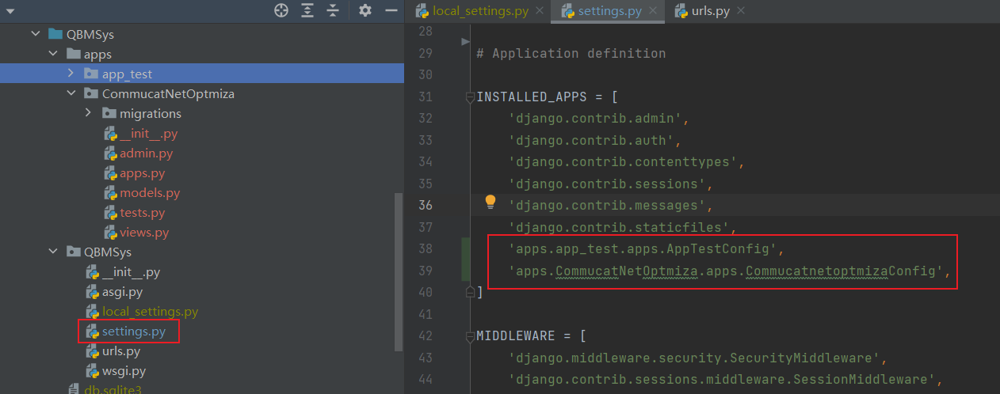
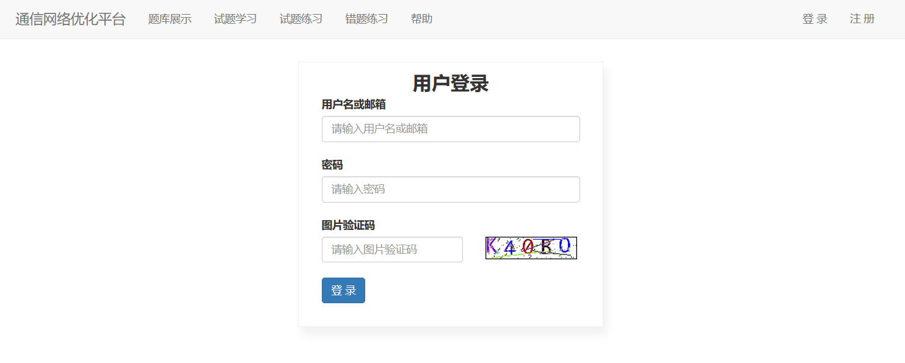

# 案例：题库管理系统(QBMSys)

英文名：question bank management syste

简称：QBMSys

---

## 开发环境：

- python版本：3.9.13

- django版本：4.2.7

## 创建项目(QBMSys)

必须在CDM窗口运行。

```
"D:\ProgramData\virtual directory\python_learing-uJLLoHwc\Scripts\django-admin.exe" startproject QBMSys
```

## 本地配置

- 创建自己本地 local_settings.py

  在settings.py文件最后导入

  ```python
  try:
      from .local_settings import *
  except ImportError:
      pass
  ```

  local_settings.py中设置

  ```python
  # 语言配置
  LANGUAGE_CODE = 'zh-hans'
  # 时区配置
  TIME_ZONE = 'Asia/Shanghai'  # 亚洲/上海
  ```

  备注：时区问题 可参考：https://blog.csdn.net/qq_41341757/article/details/109319850

  

- git忽略文件.gitignore配置

  ```
  # pycharm 自动生成的目录
  .idea/
  
  # python缓存文件
  __pycache__/
  *.py[cod]
  *.$py.calss
  
  
  # Django stuff:
  local_settings.py
  *.sqlite3
  
  # database migrations
  **/migrations/*.py
  !**/migrations/__init__.py
  ```

## 数据库

使用sqlite3本地数据库

## 创建app

采用多app模式。

- 通信网络优化

  - 英文名：CommunicationNetworkOptimization

  - 简称：CommucatNetOptmiza（app名字）

    ```
    python manage.py startapp CommucatNetOptmiza apps/CommucatNetOptmiza
    ```

- 测试app

  - 名字：app_test

    ```
    python manage.py startapp app_test apps/app_test
    ```

修改配置文件


## 注册app



## 多app模板路径处理

- 按照app注册顺序，查找模板
- 多app情况下：templates/app/模板文件


## 路由分发配置

参考：https://www.runoob.com/django/django-routers.html

urls.py

```python
from django.contrib import admin
from django.urls import path, include

urlpatterns = [
    path('admin/', admin.site.urls),
    # include路由分发
    path(r'app_test/', include(('apps.app_test.urls', 'apps.app_test'),
                               namespace='app_test')),
    path(r'CommucatNetOptmiza/', include(('apps.CommucatNetOptmiza.urls', 'apps.CommucatNetOptmiza'),
                                         namespace="CommucatNetOptmiza")),
]
```

apps/app_test/urls.py

```python
from django.urls import path

urlpatterns = [
]
```

apps/CommucatNetOptmiza/urls.py

```python
from django.urls import path

urlpatterns = [
        # name 参数方便反向解析
    path(r'register/', account.register, name="register"),
]
```

在html中反向解析：



```
url: "",
```

## 静态文件配置


## 启用media

##### 在urls.py中进行配置：

```python
from django.urls import path, re_path
from django.views.static import serve
from django.conf import settings

urlpatterns = [
    re_path(r"^media/(?P<path>.*)$", serve, {'document_root': settings.MEDIA_ROOT}, name='media'),
]
```

##### 在settings.py中进行配置：

```python
import os

MEDIA_ROOT = os.path.join(BASE_DIR, "media")
MEDIA_URL = "/media/"
```

在浏览器上访问地址：

http://127.0.0.1:8000/media/Python程序开发的全流程.jpg


## 系统构思

注册功能

登录功能

题库展示

题库导入

试题学习

试题练习

错题收集

错题练习

## 母版准备


## 注册功能

- URL准备

  ```python
  from django.urls import path
  from apps.CommucatNetOptmiza.views import account
  
  urlpatterns = [
      # name 参数方便反向解析
      path(r'register/', account.register, name="register"),
  ]
  ```

- 注册页面样式

  

  

- ModelForm
  - 字段校验：使用ModelForm钩子方法校验
  - 使用ajax提交数据
  - 保存数据库

## 登录功能

- URL准备

  ```
  path(r'login/', account.login, name="login"),
  ```

- 页面样式

  

- 用户名&密码登录

- 图片验证码

  ```python
  def image_code(request):
      """ 生成图片验证码 """
      from utils.image_code import check_code
      image_object, code = check_code()
      # 写入session,60s过期
      request.session["image_code"] = code
      request.session.set_expiry(60)  # 主动修改session过期时间
      # 3. 写入内存(Python3)
      from io import BytesIO
      stream = BytesIO()
      image_object.save(stream, 'png')
  
      return HttpResponse(stream.getvalue())
  ```

- 点击刷新图片

  ```python
  
  
  $(function () {
      $("#imageCode").click(function () {
          var oldSrc = $(this).attr('src');
          $(this).attr('src', oldSrc + "?");
      })
  })
  ```

- 登录

  通过中间件校验登录

## 注销功能

通过request.session.flush()实现

## 题库展示

- URL准备
- 数据表结构设计
- 页面样式