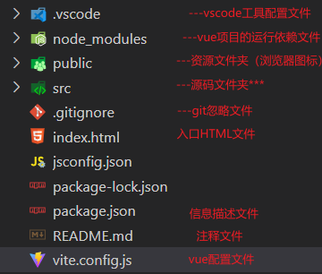
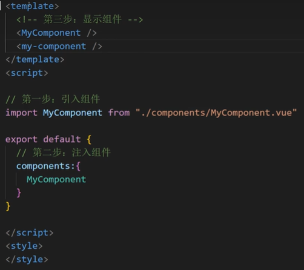
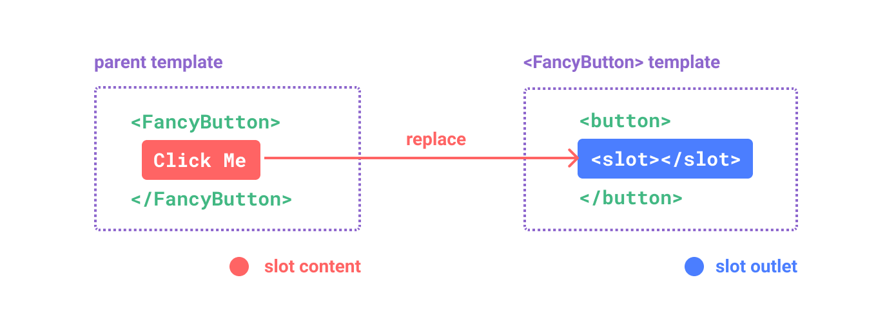
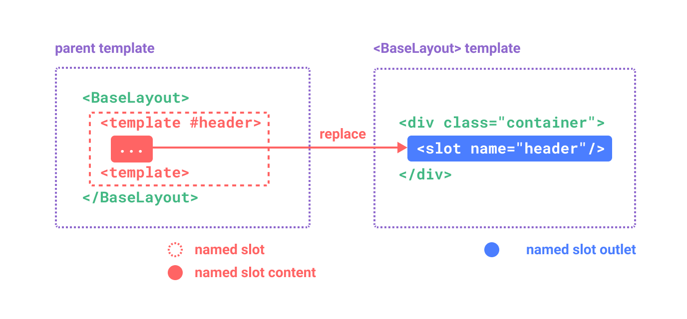
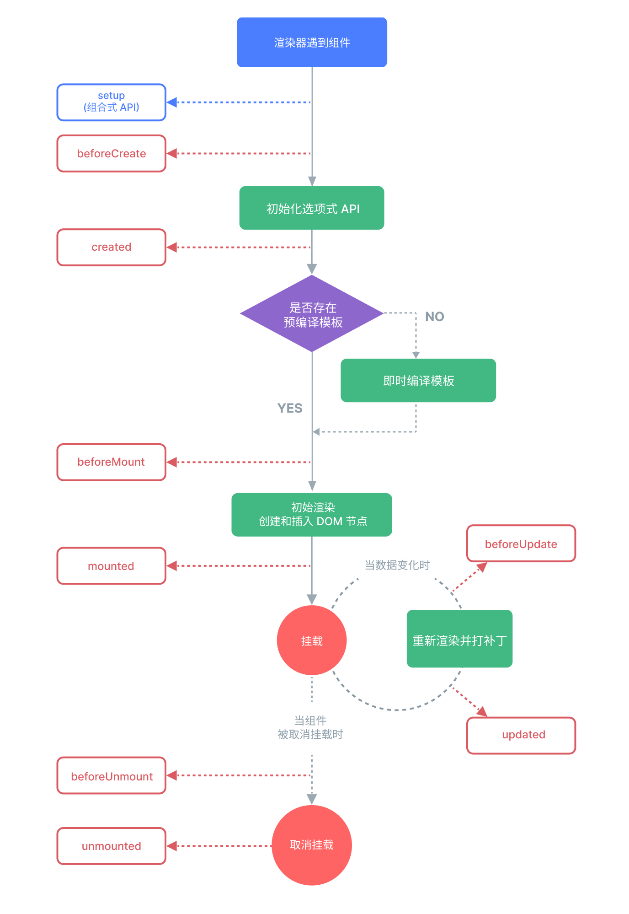

## VUE前端开发

关于vue.js的版本

- vue2，经典版，绝大多数企业项目都使用vue2版本开发
- vue3，新版本，未来趋势

## VUE3.0准备工作

安装 node.js  https://nodejs.org/en/download/prebuilt-installer

创建项目

- cmd 运行

  ```
  npm create vue@latest
  ```

  

- 安装依赖并启动服务器

  ```
  npm install
  npm run dev
  ```

- 推荐IDE和工具

  推荐的 IDE 配置是 [Visual Studio Code](https://code.visualstudio.com/) + [Vue - Official 扩展](https://marketplace.visualstudio.com/items?itemName=Vue.volar)

## VUE项目目录结构




## vue基础

想要使用vue.js开发，就必须学会vue.js中提供的指令。

### 文本插值

最基本的数据绑定形式是文本插值，它使用的是“Mustache”语法 (即双大括号)：

```html
<template>
<h3>模板语法</h3>
<p>{{ msg }}</p>
<p>{{ hello }}</p>

</template>

<script>
export default{
  data(){
    return{
      msg:"神奇的语法",
      hello:"hello word"
    }
  }
}
</script>
```

### 使用 JavaScript 表达式

每个绑定仅支持**单一表达式**，也就是一段能够被求值的 JavaScript 代码。一个简单的判断方法是是否可以合法地写在 `return` 后面。

```
<template>
<h3>模板语法</h3>
<h4>使用 JavaScript 表达式</h4>
<p>{{ number + 1 }}</p>
<p>{{ ok ? 'Yes':'No' }}</p>
<p>{{ message.split("").reverse().join("") }}</p>
</template>

<script>
export default{
  data(){
    return{
      number:10,
      ok:true,
      message:"大家好",
    }
  }
}
</script>
```

**无效**：

```
<!-- 这是一个语句，而非表达式 -->
{{ var a = 1 }}

<!-- 条件控制也不支持，请使用三元表达式 -->
{{ if (ok) { return message } }}
```

### v-html指令，原始 HTML

双大括号会将数据解释为纯文本，而不是 HTML。若想插入 HTML，你需要使用 `v-html` 指令

```
<template>
<h3>模板语法</h3>
<p v-html="rawHtml"></p>
</template>

<script>
export default{
  data(){
    return{
      rawHtml:"<a href='https://www.baidu.com'>百度一下</a>"
    }
  }
}
</script>
```

### v-bind指令，属性绑定

一般用于对标签中的属性进行操作

`v-bind` 指令指示 Vue 将元素的  属性 与组件的 值 属性保持一致。如果绑定的值是 `null` 或者 `undefined`，那么该 属性 将会从渲染的元素上移除。

```python
<template>
<h4>v-bind 指令</h4>
<div v-bind:class="cls">属性绑定</div>
<div :class="cls">简化属性绑定</div>
<div :id="id">同名属性绑定</div>
<div :id>简化同名属性绑定</div>
<div v-bind:id>简化同名属性绑定</div>

<h5>v-bind 指令:布尔值</h5>
<button :disabled="isButtonDisabled">Button</button>
<button :disabled="! isButtonDisabled">Button</button>

<h5>v-bind 指令:动态绑定多个值</h5>
<div v-bind="objectofAttrs">动态绑定多个值</div>

</template>

<script>
export default{
  data(){
    return{
      cls:"active",
      id:"appclass",
      isButtonDisabled:false,
      objectofAttrs:{
          id: 'container  re',
          class: 'wrapper'
      }
    }
  }
}
</script>
```

**v-bind注意：**

- 简写的格式：`:属性名=xx`，例如：

  ```
  <h1 v-bind:class="v1"></h1>
  <h1 :class="v1"></h1>
  
  ```

- v-bind属于单向绑定（JS修改->HTML修改）。

### v-model指令，表单输入绑定

一般用于在交互的表中使用，例如：input、select、textarea等。【双向绑定】

```html
<template>
    <hr>
    <h3>表单输入绑定</h3>
    <h4>输入框</h4>
    <form>
        <input type="text" v-model="message">
        <p>{{ message }}</p>
    </form>
    <h4>其他</h4>
    <div>
        <div>
            用户名：<input type="text" v-model="info.user">
        </div>
        <div>
            密码：<input type="password" v-model="info.pwd">
        </div>
        <div>
            性别：
            <input type="radio" v-model="info.sex" value="1">男
            <input type="radio" v-model="info.sex" value="2">女
        </div>
        <div>
            爱好：
            <input type="checkbox" v-model="info.hobby" value="11">篮球
            <input type="checkbox" v-model="info.hobby" value="22">足球
            <input type="checkbox" v-model="info.hobby" value="33">乒乓球
        </div>
        <div>
            城市：
            <select v-model="info.city">
                <option value="sh">上海</option>
                <option value="bj">北京</option>
                <option value="sz">深圳</option>
            </select>
        </div>
        <div>
            擅长领域：
            <select v-model="info.company" multiple>
                <option value="11">技术</option>
                <option value="22">销售</option>
                <option value="33">运营</option>
            </select>
        </div>
        <div>
            其他：<textarea v-model="info.more"></textarea>
        </div>
        <input type="button" value="注 册" v-on:click="clickMe">
    </div>

</template>

<script>
export default {
    data() {
        return {
            message: "",
            info: {
                user: "",
                pwd: "",
                sex: "2",
                hobby: ["22"],
                city: "sz",
                company: ["22", "33"],
                more: '...'
            },
        }
    },
    methods: {
        clickMe: function () {
            console.log(this.info);
        },
    }
}
</script>
```

#### 修饰符

##### `.lazy` 

默认情况下，`v-model` 会在每次 `input` 事件后更新数据 (IME 拼字阶段的状态例外)。你可以添加 `lazy` 修饰符来改为在每次 `change` 事件后更新数据(失去焦点时)：

```vue
<!-- 在 "change" 事件后同步更新而不是 "input" -->
<input v-model.lazy="msg" />
```

##### `.number`

如果你想让用户输入自动转换为数字，你可以在 `v-model` 后添加 `.number` 修饰符来管理输入：


##### `.trim`

如果你想要默认自动去除用户输入内容中两端的空格，你可以在 `v-model` 后添加 `.trim` 修饰符：


### v-for指令，列表渲染

用户数据进行循环并展示，我们可以使用 `v-for` 指令基于一个数组来渲染一个列表。`v-for` 指令的值需要使用 `item in items` 形式的特殊语法，其中 `items` 是源数据的数组，而 `item` 是迭代项的**别名**

```html
<template>
<hr>
<h3>列表渲染</h3>
<p v-for="item in names">{{ item }}</p>
<h4>复杂数据</h4>
<div v-for="item in result">
    <p>{{ item.id }}</p>
    <p>{{ item.title }}</p>
</div>

<h4>支持索引</h4>
<p v-for="(item,index) in names">{{index}} - {{item}}</p>

<h4>支持使用of代提in迭代</h4>
<p v-for="(item,index) of names">{{index}} - {{item}}</p>


<h4>遍历对象</h4>
<p v-for="user of usefInfo">{{user}}</p>

<p v-for="(value,key,index) of usefInfo">{{index}}-{{ key }}-{{ value }}</p>
<p v-for="(value,key) of usefInfo">{{ key }}-{{ value }}</p>
</template>

<script>
export default{
    data(){
        return{
            names:["百战程序员","尚学堂","IT"],
            result:[
                {
                    "id":0,
                    "title":"ceshi1",
                    "avator":"备注1"
                },
                {
                    "id":1,
                    "title":"ceshi2",
                    "avator":"备注2"
                },
                {
                    "id":2,
                    "title":"ceshi3",
                    "avator":"备注3"
                },
            ],
            usefInfo:{
                name:"nam",
                age:19,
            }
        }
    }
}
</script>
```

#### 通过 key 管理状态

Vue 默认按照“就地更新”的策略来更新通过 `v-for` 渲染的元素列表。当数据项的顺序改变时，Vue 不会随之移动 DOM 元素的顺序，而是就地更新每个元素，确保它们在原本指定的索引位置上渲染。

为了给 Vue 一个提示，以便它可以跟踪每个节点的标识，从而重用和重新排序现有的元素，你需要为每个元素对应的块提供一个唯一的 `key` 属性

```vue
<template>
<h4>Key属性添加到v-for中</h4>
<!-- 不建议用index,因为index在对象变化时，会发生变化 -->
<!-- 建议使用每条数据的唯一索引 -->
<P v-for="(item,index) of names" :key="index">{{ item }}</P>
<P v-for="item of result" :key="item.id">{{ item.title }}</P>
</template>

<script>
export default{
    data(){
        return{
            names:["百战程序员","尚学堂","IT"],
            result:[
                {
                    "id":0,
                    "title":"ceshi1",
                    "avator":"备注1"
                },
                {
                    "id":1,
                    "title":"ceshi2",
                    "avator":"备注2"
                },
                {
                    "id":2,
                    "title":"ceshi3",
                    "avator":"备注3"
                },
            ],
        }
    }
}
</script>
```

==注意==

`key` 在这里是一个通过 `v-bind` 绑定的特殊 attribute。

推荐在任何可行的时候为 `v-for` 提供一个 `key` attribute。

`key` 绑定的值期望是一个基础类型的值，例如字符串或 number 类型。不要用对象作为 `v-for` 的 key。

#### 数组变化侦测

##### 变更方法

Vue 能够侦听响应式数组的变更方法，并在它们被调用时触发相关的更新。这些变更方法包括：

- `push()`
- `pop()`
- `shift()`
- `unshift()`
- `splice()`
- `sort()`
- `reverse()`

```
<template>
<h4>数组变化侦听</h4>
<button @click="addListHandle">添加数据</button>
<ul>
    <li v-for="(item,index) of names" :key="index">{{ item }}</li>
</ul>
</template>

<script>
export default{
    data(){
        return{
            names:["百战程序员","尚学堂","IT"],
        }
    },
    methods:{
        addListHandle(){
            // 引起UI自动更新
            this.names.push("sakura")
            // 不会引起UI自动更新
            //this.names.concat(["sakura3"])
            //console.log(this.names.concat(["sakura3"]))
        }
    }
}
</script>
```

##### 替换一个数组

变更方法，顾名思义，就是会对调用它们的原数组进行变更。相对地，也有一些不可变 (immutable) 方法，例如 `filter()`，`concat()` 和 `slice()`，这些都不会更改原数组，而总是**返回一个新数组**。当遇到的是非变更方法时，我们需要将旧的数组替换为新的：

```
<template>
<h4>数组变化侦听</h4>
<button @click="addListHandle">添加数据</button>
<ul>
    <li v-for="(item,index) of names" :key="index">{{ item }}</li>
</ul>
</template>

<script>
export default{
    data(){
        return{
            names:["百战程序员","尚学堂","IT"],
        }
    },
    methods:{
        addListHandle(){
            // 引起UI自动更新
            // this.names.push("sakura")
            // 不会引起UI自动更新
            this.names.concat(["sakura3"])
            console.log(this.names.concat(["sakura3"]))
        }
    }
}
</script>
```

### v-on指令，监听事件

我们可以使用 `v-on` 指令 (简写为 `@`) 来监听 DOM 事件，并在事件触发时执行对应的 JavaScript。用法：`v-on:click="handler"` 或 `@click="handler"`。

事件处理器 (handler) 的值可以是：

1. **内联事件处理器**：事件被触发时执行的内联 JavaScript 语句 (与 `onclick` 类似)。
2. **方法事件处理器**：一个指向组件上定义的方法的属性名或是路径。

#### 内联事件处理器

内联事件处理器通常用于简单场景，例如：

```vue
<template>
    <hr>
<h3>事件监听</h3>
<h4>内联事件处理器</h4>
<button v-on:click="count++">Add</button>
<p>{{count}}</p>
</template>

<script>
export default {
    data(){
        return{
            count:0,
        }
    }
}
</script>
```

##### 事件参数

事件参数可以获取event对象和通过事件传递数据

```vue
<template>
    <hr>
    <h4>事件参数 event</h4>
    <button v-on:click="addCount">Add</button>
    <p>Count is: {{ count }}</p>

    <h4>事件参数 传递参数</h4>
    <p @click="getNameHandler(item)" v-for="(item,index) of names" :key="index">{{ item }}</p>

    <h4>事件参数 传递参数过程中获取 event</h4>
    <p @click="getNameHandler(item,$event)" v-for="(item,index) of names" :key="index">{{ item }}</p>

</template>

<script>
export default {
    data() {
        return {
            count: 0,
            names: ["iwen", "ime", "frank"]
        }
    },
    methods: {
        // 获取event对象
        addCount(e) {
            // Vue中的event对象，就是原生JS的Event对象
            e.target.innerHTML = "Add" + this.count
            this.count += 1
        },
        // 传递参数，传递参数过程中获取 event
        getNameHandler(name,e) {
            console.log(name);
            console.log(e);
        }
    }
}
</script>
```

#### 方法事件处理器

随着事件处理器的逻辑变得愈发复杂，内联代码方式变得不够灵活。因此 `v-on` 也可以接受一个方法名或对某个方法的调用。

```vue
<template>
<h4>方法事件处理器</h4>
<button @click="">Add</button>
<p>{{count}}</p>
</template>

<script>
export default {
    data(){
        return{
            count:0,
        }
    },
    // 所有的方法或者函数都放在这里
    methods:{
        addCount(){
            // 读取到data里面的数据的方案：this.count
            this.count+=1
        }
    }
}
</script>
```

#### 事件修饰符

在处理事件时调用 `event.preventDefault()` 或 `event.stopPropagation()` 是很常见的。尽管我们可以直接在方法内调用，但如果方法能更专注于数据逻辑而不用去处理 DOM 事件的细节会更好。

为解决这一问题，Vue 为 `v-on` 提供了**事件修饰符**。修饰符是用 `.` 表示的指令后缀，包含以下这些：

- `.stop`  阻止事件冒泡，子元素不触发父元素
- `.prevent`  阻止默认事件
- `.self`
- `.capture`
- `.once`  事件只会触发一次
- `.passive`
- `enter`  回车事件触发

```vue
<template>
    <h4>事件修饰符</h4>
    <!-- 点击默认跳转  -->
     <!-- .preven 相当于 e.preventDefault() -->
    <a @click.prevent="clickHandle" href="https://www.baidu.com">百度一下</a>

</template>

<script>
export default {
    data() {
        return {
        }
    },
    methods: {
        clickHandle(e){
            // 阻止默认事件
            // e.preventDefault();
            console.log("点击了");
        }
    }
}
</script>
```

### v-if指令，条件渲染

条件判断，`v-if` 指令会基于表达式值的真假来移除/插入该元素。

- v-if
- v-else
- v-else-if

```python
<template>
<hr>
<h4>条件渲染</h4>
<h5> v-if ...</h5>
<div v-if="flag">{{ flag}} 你能看见我</div>

<h5> v-if ... v-else ... </h5>
<div v-if="flag">{{ flag}} 你能看见我</div>
<div v-else>{{ flag}} v-else</div>

<h5> v-if ... v-else-if ... v-else ...</h5>
<div v-if="type==='A'">A</div>
<div v-else-if = "type==='B'">B</div>
<div v-else-if = "type==='C'">C</div>
<div v-else>Not A/B/C</div>

<h5> v-Show</h5>
<div v-show="flag">{{ flag}} 你能看见我</div>
</template>

<script>
export default {
    data(){
        return{
            flag:true,
            type:"A",
        }
    }
}
</script>
```

### v-show指令，条件渲染

根据条件显示和隐藏（标签都会渲染到页面）

```python
<!DOCTYPE html>
<html lang="en">
<head>
    <meta charset="UTF-8">
    <title>Title</title>
    <script src="vue.js"></script>
    <style>
        label {
            width: 60px;
            display: inline-block;
            text-align: right;
            margin-right: 8px;
        }
    </style>
</head>
<body>
<div id="app">
    <h1 v-show="v1">可可西里</h1>
    <h1 v-show="!v1">罗布泊</h1>

    <input type="button" value="密码登录" @click="isSms=false"/>
    <input type="button" value="短信登录" @click="isSms=true"/>

    <div v-show="isSms">
        <p>
            <label>手机号</label>
            <input type="text" placeholder="手机号"/>
        </p>
        <p>
            <label>验证码</label>
            <input type="text" placeholder="验证码"/>
        </p>
    </div>
    <div v-show="!isSms">
        <p>
            <label>用户名</label>
            <input type="text" placeholder="用户名">
        </p>
        <p>
            <label>密码</label>
            <input type="text" placeholder="密码">
        </p>
    </div>
</div>
<script>
    app = new Vue({
        el: "#app",
        data: {
            v1: false,
            isSms: false,
        }
    });
</script>
</body>
</html>
```

### 计算属性

模板中的表达式虽然方便，但也只能用来做简单的操作。如果在模板中写太多逻辑，会让模板变得臃肿，难以维护。

```
<template>
    <hr>
    <h3>计算属性</h3>
    <p>{{ itbaizhan.name }}</p>
    <h4>未使用计算属性</h4>
    <p>{{ itbaizhan.content.length > 0 ? "Yes" : "No" }}</p>
    <h4>使用计算属性</h4>
    <p>{{ itbaizhanContent }}</p>
    <h4>使用函数</h4>
    <p>{{ itbaizhanContents() }}</p>
</template>
<script>
export default {
    data() {
        return {
            itbaizhan: {
                name: "百战程序员",
                content: ["前端", "Java", "python"]
            }
        }
    },
    // 计算属性
    computed: {
        itbaizhanContent() {
            return this.itbaizhan.content.length > 0 ? "Yes" : "No"
        },
    },
    // 函数或者方法
    methods: {
        itbaizhanContents() {
            return this.itbaizhan.content.length > 0 ? "Yes" : "No"
        },
    }
}
</script>
```

**区别：**

- 计算属性：**计算属性值会基于其响应式依赖被缓存**。一个计算属性仅会在其响应式依赖更新时才重新计算。

- 方法：方法调用**总是**会在重渲染发生时再次执行函数。

### Class和style绑定

数据绑定的一个常见需求场景是操纵元素的 CSS class 列表和内联样式。因为 `class` 和 `style` 都是 attribute，我们可以和其他 attribute 一样使用 `v-bind` 将它们和动态的字符串绑定。但是，在处理比较复杂的绑定时，通过拼接生成字符串是麻烦且易出错的。因此，Vue 专门为 `class` 和 `style` 的 `v-bind` 用法提供了特殊的功能增强。除了字符串外，表达式的值也可以是对象或数组。

```vue
<template>
    <br>
    <h3>Class样式绑定</h3>
    <p :class="{ 'active': isActive, 'text-danger': hasError }">样式</p>
    <h4>多个对象绑定</h4>
    <p :class="classObject">多个对象绑定</p>
    <h4>绑定数组</h4>
    <p :class="[arrActive,arrHasError]">绑定数组</p>
    <p :class="[isActive ? 'active':'text-danger']">绑定数组 根据条件渲染</p>
    <h4>数组和对象嵌套</h4>
    <p :class="[{'active':isActive},arrHasError]">绑定数组 根据条件渲染</p>

</template>

<script>
export default {
    data() {
        return {
            isActive: true,
            hasError: true,
            classObject:{
                'active': true,
                'text-danger': true,
            },
            arrActive:"active",
            arrHasError: 'text-danger',
        }
    }
}
</script>

<style>
.active {
    font-size: 30px;
}

.text-danger {
    color: red;
}
</style>
```


```vue
<template>
    <hr>
    <h3>不推荐：Style绑定</h3>
    <h4>绑定样式</h4>
    <p :style="{ color: activeColor, fontSize: fontSize }">Style绑定</p>
    <h4>绑定对象</h4>
    <p :style="styleObject">Style绑定2</p>
    <h4>绑定数组</h4>
    <p :style="[styleObject]">Style绑定3</p>
</template>

<script>
export default {
    data() {
        return {
            activeColor: "green",
            fontSize: '30px',
            styleObject: {
                color: 'red',
                fontSize: '30px',
            }
        }
    }
}
</script>
```

### 侦听器

我们可以使用 `watch` 选项在每次响应式属性发生变化时触发一个函数。

```vue
<template>
    <hr>
    <h3>侦听器</h3>
    <!-- 响应式数据 -->
    <p>{{ message }}</p>
    <button @click="updateHandle">修改数据</button>

</template>

<script>
export default {
    data() {
        return {
            message: "Hello"
        }
    },
    methods: {
        updateHandle() {
            this.message = "World"
        }
    },
    watch:{
        // 与data里面的变量名保持一致
        // newValue 改变之后的数据
        // oldValue 改变之前的数据
        message(newValue,oldValue){
            console.log(newValue,oldValue);
        }
    }
}

</script>
```

### 模板引用-获取DOM操作

虽然 Vue 的声明性渲染模型为你抽象了大部分对 DOM 的直接操作，但在某些情况下，我们仍然需要直接访问底层 DOM 元素。要实现这一点，我们可以使用特殊的 `ref` attribute：

挂载结束后引用都会被暴露在 `this.$refs` 之上

```vue
<template>
    <hr>
    <h3>模板引用</h3>
    <div ref="container" class="container">{{ content }}</div>
    <input type="text" ref="username">
    <button @click="getElementHandle"> 获取元素 </button>

</template>

<script>
/**
 * 内容改变：{{ 模板语法 }}
 * 属性改变：v-bind:指令
 * 事件：v-on:click
 * 
 * 如果没有特别的需求，不要操作DOM
 */
export default {
    data() {
        return {
            content: "内容"
        }
    },
    methods: {
        getElementHandle() {
            // innerHTML：原生JS的属性
            this.$refs.container.innerHTML = "哈哈哈哈哈";
            console.log(this.$refs.username.value);
        }
    }
}

</script>
```

## vue 组件

组件最大的优势就是可复用性。

当使用构建步骤时，我们一般会将 Vue 组件定义在一个单独的 `.vue` 文件中，这被叫做单文件组件 (简称 SFC)：

**组件组成结构**

```vue
<template>
<div class="container">{{ message }}</div>
</template>
<script>
export default {
    data(){
        return{
            message:"组件基础组成"
        }
    }
}
</script>

<style>
.container{
    font-size: 30px;
    color: red;
}
</style>
```

**引入组件**

选项式



### 组件注册

一个 Vue 组件在使用前需要先被“注册”，这样 Vue 才能在渲染模板时找到其对应的实现。组件注册有两种方式：全局注册和局部注册

#### 全局注册

在main.js文件中注册

```vue
import { createApp } from 'vue'
import App from './App.vue'
import Header from "./pages/Header.vue"

const app = createApp(App)
// 在这中间写组件的注册

// 全局注册
app.component("Header",Header)

app.mount('#app')
```

#### 局部注册

全局注册虽然很方便，但有以下几个问题：

1. 全局注册，但并没有被使用的组件无法在生产打包时被自动移除 (也叫“tree-shaking”)。如果你全局注册了一个组件，即使它并没有被实际使用，它仍然会出现在打包后的 JS 文件中。
2. 全局注册在大型项目中使项目的依赖关系变得不那么明确。在父组件中使用子组件时，不太容易定位子组件的实现。和使用过多的全局变量一样，这可能会影响应用长期的可维护性。

相比之下，局部注册的组件需要在使用它的父组件中显式导入，并且只能在该父组件中使用。它的优点是使组件之间的依赖关系更加明确，并且对 tree-shaking 更加友好。

局部注册需要使用 `components` 选项：

```vue
<template>
    <div class="main">
        <h3>Main</h3>
        <Article />
        <Article />
    </div>
</template>
<script>
import Article from "./Article.vue"
export default {
    components: {
        Article
    }
}
</script>
<style scoped>
.main {
    float: left;
    width: 70%;
    height: 400px;
    border: 5px solid #999;
    box-sizing: border-box;
    /* border-top: 0px; */
}
</style>
```

### 组件传递数据__Props

**父传子**

组件与组件之间不是完全独立的，而是有交集的，那就是组件与组件之间是可以传递数据的，传递数据的解决方案就是 props。

**传递数据**

```vue
<template>
    <hr>
    <h3>Parent</h3>
    <Child title="Parent 数据" :model="message" :age="age" :names="names" :userInfo="userInfo" :bool="bool"
        :onEvent="dataFn" />
        <p>父元素：{{ function1 }}</p>
</template>
<script>
import Child from "./Child.vue"
export default {
    data() {
        return {
            // 字符串
            message: "Parent 数据!",
            // 数字类型
            age: 20,
            // 数组类型
            names: ["iwen", "imm", "flask"],
            // 对象类型
            userInfo: {
                name: "iwen",
                age: 20
            },
            // 布尔值类型
            bool: false,
            function1: "",
        }
    },
    components: {
        Child
    },
    methods: {
        // 间接实现了 子传父的操作
        dataFn(data) {
            console.log(data);
            this.function1 = data
        }
    }
}
</script>
```

**接收数据**

```vue
<template>
    <h3>Child</h3>
    <p>{{ title }}</p>
    <p>{{ model }}</p>
    <p>{{ age }}</p>
    <ul>
        <li v-for="(item, index) of names" :key="index">{{ item }}</li>
    </ul>
    <p>{{ userInfo.name }}</p>
    <p>{{ userInfo.age }}</p>
    <p v-if="bool">bool 为 {{ bool }}</p>
    <p v-else>bool 为 {{ bool }}</p>
    <p>{{ onEvent('传递数据') }}</p>
</template>
<script>
export default {
    data() {
        return {

        }
    },
    props: {
        title:String, 
        model:String, 
        age:Number, 
        names:Array, 
        userInfo:Object, 
        bool:Boolean,
        onEvent:Function
    }
}
</script>
```

> ==注意事项：==
>
> 所有的 props 都遵循着**单向绑定**原则，props 因父组件的更新而变化，自然地将新的状态向下流往子组件，而不会逆向传递。这避免了子组件意外修改父组件的状态的情况，不然应用的数据流将很容易变得混乱而难以理解。
>
> 另外，每次父组件更新后，所有的子组件中的 props 都会被更新到最新值，这意味着你**不应该**在子组件中去更改一个 prop。若你这么做了，Vue 会在控制台上向你抛出警告。

##### 传递不同的值类型

**任何**类型的值都可以作为 props 的值被传递。

- **String**
- **Number**

- **Array **
- **Object **
- **Boolean**
- **Function**

##### Prop 校验

Vue 组件可以更细致地声明对传入的 props 的校验要求。

- 类型校验
- 默认值
- 必选项

```vue
 props: {
        title: {
            type: [String, Number],
            // 必选项
            require:true
        },
        age: {
            type: Number,
            // 默认值,数字和字符串可以直接default,
            // 但是如果是数组和对象，必须通过工厂函数返回默认值
            default: 0
        },
        names:{
            type:Array,
            default(){
                return ["空"]
            }
        }
    }
```

### 组件事件_$emit

**子传父**

在组件的模板表达式中，可以直接使用 `$emit` 方法触发自定义事件

触发自定义事件的目的是组件之间传递数据

**父组件**

```vue
<template>
    <hr>
    <h3>组件事件</h3>
    <Child @someEvent="getHandle" />
    <p>父元素：{{ message }}</p>
</template>
<script>
import Child from "./Child.vue"
export default {
    data() {
        return {
            message: ""
        }
    },
    components: {
        Child
    },
    methods: {
        getHandle(data) {
            console.log("触发了", data)
            this.message = data
        }
    }
}
</script>
```

**子组件**

```vue
<template>
    <h3>Child</h3>
    <button @click="clickEventHandle">传递数据</button>
</template>
<script>
export default {
    data(){
        return{
            
        }
    },
    methods:{
        // 自定义事件
        clickEventHandle(){
            this.$emit("someEvent","Child数据")
        }
    }
}
</script>
```

### 组件 v-model

`v-model` 可以在组件上使用以实现双向绑定。

```vue
<template>
    <hr>
    <h3>Main</h3>
    <p>搜索数据：{{ search }}</p>
    <SearchComponent @searchEvent="getSearch" />
</template>
<script>
import SearchComponent from './SearchComponent.vue';
export default {
    data() {
        return {
            search: ""
        }
    },
    components: {
        SearchComponent
    },
    methods: {
        getSearch(data) {
            this.search = data;
        }
    }
}
</script>
```


```VUE
<template>
    搜素：<input type="text" v-model="search">
</template>
<script>
export default {
    data() {
        return {
            search: ""
        }
    },
    // 侦听器
    watch:{
        search(newValue,oldValue){
            this.$emit("searchEvent",newValue)
        }
    }
}
</script>
```


### 透传 Attributes

“透传 attribute”指的是传递给一个组件，却没有被该组件声明为 props或 emits的 attribute 或者 `v-on` 事件监听器。最常见的例子就是 `class`、`style` 和 `id`。

当一个组件以单个元素为根作渲染时，透传的 attribute 会自动被添加到根元素上

**基本不用**

### 插槽 Slots

组件能够接收任意类型的 JavaScript 值作为 props，但组件要如何接收模板内容呢？在某些场景中，我们可能想要为子组件传递一些模板片段，让子组件在它们的组件中渲染这些片段。

```vue
<template>
    <hr>
    <SlotsBase>
        <div>
            <h3>插槽标题</h3>
            <p>插槽内容</p>
        </div>
    </SlotsBase>
</template>
<script>
import SlotsBase from "./SlotsBase.vue"

export default {
    components: {
        SlotsBase
    }
}
</script>
```

`<slot>` 元素是一个**插槽出口** (slot outlet)，标示了父元素提供的**插槽内容** (slot content) 将在哪里被渲染。



```vue
<template>
<h3>插槽基础知识</h3>
<!-- 内容显示位置 -->
<slot></slot>
</template>
```

#### 渲染作用域

插槽内容可以访问到父组件的数据作用域，因为插槽内容本身是在父组件模板中定义的。

插槽内容**无法访问**子组件的数据。Vue 模板中的表达式只能访问其定义时所处的作用域，这和 JavaScript 的词法作用域规则是一致的。换言之：

> 父组件模板中的表达式只能访问父组件的作用域；子组件模板中的表达式只能访问子组件的作用域。

```vue
<template>
    <SlotsTow>
        <h5>{{ message }}</h5>
    </SlotsTow>
</template>
<script>
import SlotsTow from "./SlotsTow.vue"

export default {
    data() {
        return {
            message: "SlotsTow插槽内容"
        }
    },
    components: {
        SlotsTow
    }
}
</script>
```

#### 默认内容

在外部没有提供任何内容的情况下，可以为插槽指定默认内容。

```vue
<template>
<h4>Slots 渲染作用域</h4>
<slot>插槽默认值</slot>
</template>
```

#### 具名插槽

有时在一个组件中包含多个插槽出口是很有用的。

`<slot>` 元素可以有一个特殊的 attribute `name`，用来给各个插槽分配唯一的 ID，以确定每一处要渲染的内容

带 `name` 的插槽被称为具名插槽 (named slots)。没有提供 `name` 的 `<slot>` 出口会隐式地命名为“default”。

在父组件中使用 `<BaseLayout>` 时，我们需要一种方式将多个插槽内容传入到各自目标插槽的出口。此时就需要用到**具名插槽**了：

要为具名插槽传入内容，我们需要使用一个含 `v-slot` 指令的 `<template>` 元素，并将目标插槽的名字传给该指令

`v-slot` 有对应的简写 `#`，因此 `<template v-slot:header>` 可以简写为 `<template #header>`。其意思就是“将这部分模板片段传入子组件的 header 插槽中”。




```vue
<template>
    <!-- 具名插槽 -->
    <SlotsTow>
        <template v-slot:header>
            <p>具名插槽header</p>
        </template>
        <template #main>
            <p>具名插槽main</p>
        </template>
    </SlotsTow>
</template>
<script>
import SlotsTow from "./SlotsTow.vue"
export default {
    components: {
        SlotsTow
    }
}
</script>
```


```vue
<template>
<slot name="header">插槽默认值</slot>
<slot name="main">插槽默认值</slot>
</template>
```

#### 插槽中的数据传递

在某些场景下插槽的内容可能想要同时使用父组件域内和子组件域内的数据。要做到这一点，我们需要一种方法来让子组件在渲染时将一部分数据提供给插槽。

我们也确实有办法这么做！可以像对组件传递 props 那样，向一个插槽的出口上传递 attributes：

```vue
<template>
    <!-- 数据传递 -->
    <SlotsAttr v-slot="slotProps">
        <h3>{{ currentTest }}--{{ slotProps.msg }}</h3>
    </SlotsAttr>
    <SlotsAttr>
        <template #header="slotProps">
            <h3>{{ currentTest }}--{{ slotProps.msg }}--具名插槽传递数据</h3>
        </template>
    </SlotsAttr>
</template>
<script>
import SlotsAttr from "./SlotsAttr.vue"
export default {
    data() {
        return {
            currentTest: "数据传递-测试内容"
        }
    },
    components: {
        SlotsAttr,
    }
}
</script>
```

```vue
<template>
    <slot :msg="childMessage"> </slot>
	<slot name="header" :msg="childMessage"> </slot>
</template>
<script>
export default {
    data() {
        return {
            childMessage: "子组件数据"
        }
    }
}
</script>
```

### 组件生命周期

每个 Vue 组件实例在创建时都需要经历一系列的初始化步骤，比如设置好数据侦听，编译模板，挂载实例到 DOM，以及在数据改变时更新 DOM。在此过程中，它也会运行被称为生命周期钩子的函数，让开发者有机会在特定阶段运行自己的代码。




```vue
<template>
    <h3>组件的生命周期</h3>
    <p>{{ message }}</p>
    <button @click="updateHabdle">更新数据</button>
</template>
<script>
/**
 *  生命周期函数
 *      创建期：beforeCreate    created
 *      挂载期：beforeMounte    mounted
 *      更新期：beforeUpdate    updated
 *      销毁期：beforeUnmount   unmounted
 */

export default {
    data() {
        return {
            message: "更新之前",
        }
    },
    methods: {
        updateHabdle() {
            this.message = "更新之后"
        }
    },
    beforeCreate() {
        console.log("组件创建之前");
    },
    created() {
        console.log("组件创建之后");
    },
    beforeMount() {
        console.log("组件渲染之前");
    },
    mounted() {
        console.log("组件渲染之后");
    },
    beforeUpdate() {
        console.log("组件更新之前");
    },
    updated() {
        console.log("组件更新之后");
    },
    beforeUnmount() {
        console.log("组件销毁之前");
    },
    unmounted() {
        console.log("组件销毁之后");
    }
}
</script>
```

#### 生命周期应用

常用应用：

- 通过ref获取元素DOM结构
- 模拟网络请求渲染数据

##### 通过ref获取元素DOM结构

```vue
<template>
    <h3>组件生命周期函数应用</h3>
    <p ref="name">百战程序员</p>
</template>
<script>
export default{
    beforeMount(){
        console.log(this.$refs.name);  // undefined
    },
    mounted(){
        console.log(this.$refs.name);
    },
}
</script>
```

##### 模拟网络请求渲染数据


