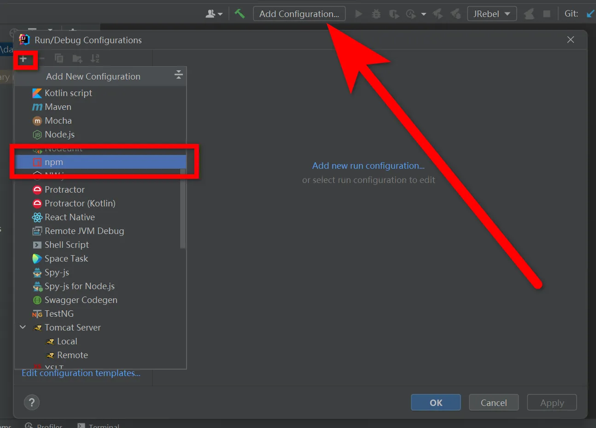
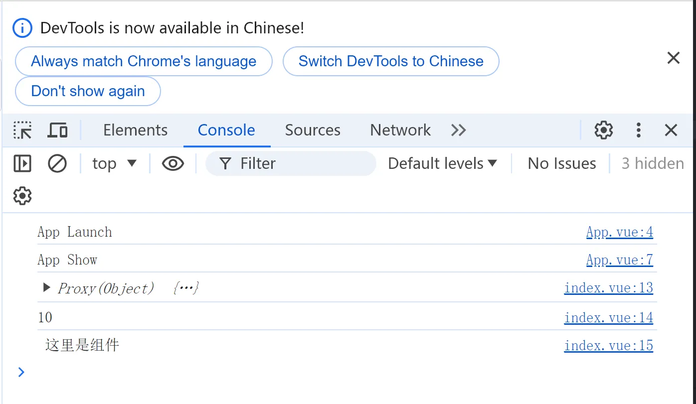

# 环境搭建

## dev-tools安装

https://chrome.zzzmh.cn/index

搜索vue即可，谷歌、edge都有

## Node环境安装

下载地址  https://nodejs.org/en/download/prebuilt-installer

```tex
测试安装环境
C:\Users\admin>node --version
v16.15.0
```


## vite创建项目

### 创建一个 Vue 应用

```
2种方式：
npm create vue@latest  推荐
npm init vite@latest
```


这一指令将会安装并执行 create-vue，它是 Vue 官方的项目脚手架工具。你将会看到一些诸如 TypeScript 和测试支持之类的可选功能提示：

```
cd <your-project-name>
npm install
npm run dev
```

你现在应该已经运行起来了你的第一个 Vue 项目！请注意，生成的项目中的示例组件使用的是组合式 API 和 <script setup>，而非选项式 API。

## VS Code

### vscode 新建vue模板

vue.code-snippets

```
"Print to console":{
    "prefix":"vue"
    "body": [
        "<template>\n",
        "</template>\n",
        "<script setup>\n",
        "</script>\n",
        "<style scoped>\n",
        "</style>",
        ],
    "description":"Log output to console"
}
```

新建vue文件之后，输入vue就会有提示

### vscode语法提示

安装Vetur

https://blog.csdn.net/qq_50564231/article/details/129102422

## idea中配置

### idea中不能使用npm命令的解决办法

File-> Settings -> Tools -> Terminal -> Shell path中内容由cmd.exe修改为C:\Windows\System32\cmd.exe全路径


### idea中配置vue启动




### idea中vue.js插件


## vue修改端口

vite.config.ts

```javascript
import { defineConfig } from 'vite'
import vue from '@vitejs/plugin-vue'

// https://vitejs.dev/config/
export default defineConfig({
  plugins: [vue()],
  server:{
    host:'0.0.0.0',
    port:8088,
    open:true //启动后打开浏览器
  }
})
```

## Vue3 项目打包

打包 Vue 项目使用以下命令：

```
npm run build
```

在项目根目录下生成dist文件夹


配置nginx转发到该目录即可访问

```
server {
  listen       7002;
  server_name  localhost;
  
  location / {
    root C:/sources/vue3/vue01/dist;
    index  index.html;
  }
}
```

## typescript忽略类型检查

### 单行忽略(添加到特定行的行前来忽略这一行的错误)

```
// @ts-ignore
```

### 跳过对某些文件的检查 (添加到该文件的首行才起作用)

```
// @ts-nocheck
```

### 对某些文件的检查

```
// @ts-check
```

## 配置"@"路径别名

### 安装依赖

```
npm i @types/node
```

### 修改vite.config.js

```javascript
import { defineConfig } from 'vite'
import { resolve } from 'path'

export default defineConfig {
    // ...
    resolve: {
        alias: {
            "@": resolve(__dirname, 'src'), // 路径别名
        },
        extensions: ['.js', '.json', '.ts'] // 使用路径别名时想要省略的后缀名，可以自己 增减
    }
    // ...
}
```

```javascript
// @ts-nocheck
import { defineConfig } from 'vite'
import vue from '@vitejs/plugin-vue'
import { resolve } from 'path'

// https://vitejs.dev/config/
export default defineConfig({
  plugins: [
    vue({
      reactivityTransform: true
    })
  ],
  resolve: {
    alias: {
      "@": resolve(__dirname, 'src'), // 路径别名
    },
    extensions: ['.js', '.json', '.ts'] // 使用路径别名时想要省略的后缀名，可以自己 增减
  }

})
```

### 修改tsconfig.json

```javascript
{
    "compilerOptions" : {
        // ...
        "baseUrl": ".", // 用于设置解析非相对模块名称的基本目录，相对模块不会受到baseUrl的影响
        "paths": { // 用于设置模块名到基于baseUrl的路径映射
            "@/*": ["src/*"]
        }
        // ...
    }
}

```

## vite忽略.vue扩展名

```javascript
// vite.config.js
import { defineConfig } from 'vite'
export default defineConfig({
    // ...其他配置项
    resolve: {
      // 忽略后缀名的配置选项, 添加 .vue 选项时要记得原本默认忽略的选项也要手动写入
      extensions: ['.mjs', '.js', '.ts', '.jsx', '.tsx', '.json', '.vue']
    }
  })


```


# Vue3 介绍

来源：https://www.yuque.com/chengxuyuanyideng/bu4rdb/eq7d76

视频：https://www.bilibili.com/video/BV1P4421D7Ap?p=12&vd_source=d6c3edd9a4f6205095ccfba6b2a61eec

时间：20240816

## MVVM

**MVVM是Model-View-ViewModel的简写**。它本质上就是MVC 的改进版。MVVM 就是将其中的View 的状态和行为抽象化，让我们将视图 UI 和业务逻辑分开。


- 模型

模型是指代表真实状态内容的领域模型（面向对象），或指代表内容的数据访问层（以数据为中心）。

- 视图

就像在MVC和MVP模式中一样，视图是用户在屏幕上看到的结构、布局和外观（UI）。

- 视图模型

视图模型是暴露公共属性和命令的视图的抽象。MVVM没有MVC模式的控制器，也没有MVP模式的presenter，有的是一个绑定器。在视图模型中，绑定器在视图和数据绑定器之间进行通信。

- 绑定器

声明性数据和命令绑定隐含在MVVM模式中。在Microsoft解决方案堆中，绑定器是一种名为[XAML](https://baike.baidu.com/item/XAML?fromModule=lemma_inlink)的[标记语言](https://baike.baidu.com/item/标记语言?fromModule=lemma_inlink)。绑定器使开发人员免于被迫编写样板式逻辑来同步视图模型和视图。在微软的堆之外实现时，声明性数据绑定技术的出现是实现该模式的一个关键因素。 [1] 


## 什么是 Vue？

Vue (发音为 /vjuː/，类似 **view**) 是一款用于构建用户界面的 JavaScript 框架。它基于标准 HTML、CSS 和 JavaScript 构建，并提供了一套声明式的、组件化的编程模型，帮助你高效地开发用户界面。无论是简单还是复杂的界面，Vue 都可以胜任。


官网地址：https://cn.vuejs.org/


## 渐进式框架

Vue 是一个框架，也是一个生态。其功能覆盖了大部分前端开发常见的需求。但 Web 世界是十分多样化的，不同的开发者在 Web 上构建的东西可能在形式和规模上会有很大的不同。考虑到这一点，Vue 的设计非常注重灵活性和“可以被逐步集成”这个特点。根据你的需求场景，你可以用不同的方式使用 Vue：

- 无需构建步骤，渐进式增强静态的 HTML
- 在任何页面中作为 Web Components 嵌入
- 单页应用 (SPA)
- 全栈 / 服务端渲染 (SSR)
- Jamstack / 静态站点生成 (SSG)
- 开发桌面端、移动端、WebGL，甚至是命令行终端中的界面

如果你是初学者，可能会觉得这些概念有些复杂。别担心！理解教程和指南的内容只需要具备基础的 HTML 和 JavaScript 知识。即使你不是这些方面的专家，也能够跟得上。

如果你是有经验的开发者，希望了解如何以最合适的方式在项目中引入 Vue，或者是对上述的这些概念感到好奇，我们在[使用 Vue 的多种方式](https://cn.vuejs.org/guide/extras/ways-of-using-vue.html)中讨论了有关它们的更多细节。

无论再怎么灵活，Vue 的核心知识在所有这些用例中都是通用的。即使你现在只是一个初学者，随着你的不断成长，到未来有能力实现更复杂的项目时，这一路上获得的知识依然会适用。如果你已经是一个老手，你可以根据实际场景来选择使用 Vue 的最佳方式，在各种场景下都可以保持同样的开发效率。这就是为什么我们将 Vue 称为“渐进式框架”：它是一个可以与你共同成长、适应你不同需求的框架。


# Vue3 响应式

## reactive声明响应式状态

我们可以使用 reactive() 函数创建一个响应式对象或数组：

```javascript
<script setup>
import { reactive } from 'vue'

const state = reactive({ count: 0 })
</script>
```

在组件模板中使用响应式状态。

```javascript
<template>
<div>{{ state.count }}</div>
</template>
```

自然，我们也可以在同一个作用域下定义一个更新响应式状态的函数：

```javascript
<script setup>
import { reactive } from 'vue'

const state = reactive({ count: 0 })

function increment() {
      state.count++
}

</script>
```

暴露的方法通常会被用作事件监听器：

```javascript
<button @click="increment">
  {{ state.count }}
</button>
```


### 深层响应性

在 Vue 中，状态都是默认深层响应式的。这意味着即使在更改深层次的对象或数组，你的改动也能被检测到。

```javascript
import { reactive } from 'vue'

const obj = reactive({
  nested: { count: 0 },
  arr: ['foo', 'bar']
})

function mutateDeeply() {
  // 以下都会按照期望工作
  obj.nested.count++
  obj.arr.push('baz')
}
```


### reactive() 的局限性

reactive() API 有两条限制：

1. 仅对对象类型有效（对象、数组和 Map、Set 这样的[集合类型](https://developer.mozilla.org/zh-CN/docs/Web/JavaScript/Reference/Global_Objects#使用键的集合对象)），而对 string、number 和 boolean 这样的 [原始类型](https://developer.mozilla.org/zh-CN/docs/Glossary/Primitive) 无效。
2. 因为 Vue 的响应式系统是通过属性访问进行追踪的，因此我们必须始终保持对该响应式对象的相同引用。这意味着我们不可以随意地“替换”一个响应式对象，因为这将导致对初始引用的响应性连接丢失：

```javascript
let state = reactive({ count: 0 })

// 上面的引用 ({ count: 0 }) 将不再被追踪（响应性连接已丢失！）
state = reactive({ count: 1 })
```

同时这也意味着当我们将响应式对象的属性赋值或解构至本地变量时，或是将该属性传入一个函数时，我们会失去响应性：

```javascript
const state = reactive({ count: 0 })

// n 是一个局部变量，同 state.count
// 失去响应性连接
let n = state.count
// 不影响原始的 state
n++

// count 也和 state.count 失去了响应性连接
let { count } = state
// 不会影响原始的 state
count++

// 该函数接收一个普通数字，并且
// 将无法跟踪 state.count 的变化
callSomeFunction(state.count)
```


## 用 ref() 定义响应式变量

reactive() 的种种限制归根结底是因为 JavaScript 没有可以作用于所有值类型的 “引用” 机制。为此，Vue 提供了一个 ref() 方法来允许我们创建可以使用任何值类型的响应式 **ref**：

```javascript
import { ref } from 'vue'

const count = ref(0)
```
ref() 将传入参数的值包装为一个带 .value 属性的 ref 对象：

```javascript
const count = ref(0)

console.log(count) // { value: 0 }
console.log(count.value) // 0

count.value++
console.log(count.value) // 1
```

和响应式对象的属性类似，ref 的 .value 属性也是响应式的。同时，当值为对象类型时，会用 reactive() 自动转换它的 .value。

一个包含对象类型值的 ref 可以响应式地替换整个对象：

```javascript
const objectRef = ref({ count: 0 })

// 这是响应式的替换
objectRef.value = { count: 1 }
```

ref 被传递给函数或是从一般对象上被解构时，不会丢失响应性：

```vue
const obj = {
  foo: ref(1),
  bar: ref(2)
}

// 该函数接收一个 ref
// 需要通过 .value 取值
// 但它会保持响应性
callSomeFunction(obj.foo)

// 仍然是响应式的
const { foo, bar } = obj
```

简言之，ref() 让我们能创造一种对任意值的 “引用”，并能够在不丢失响应性的前提下传递这些引用。


### ref 在模板中的解包

当 ref 在模板中作为顶层属性被访问时，它们会被自动“解包”，所以不需要使用 .value。下面是之前的计数器例子，用 ref() 代替：

```vue
<script setup>
import { ref } from 'vue'

const count = ref(0)

function increment() {
  count.value++
}
</script>

<template>
  <button @click="increment">
    {{ count }} <!-- 无需 .value -->
  </button>
</template>
```


# Vue3 ref获取元素节点

### 前言

虽然在 Vue 中不提倡我们直接操作 DOM，毕竟 Vue 的理念是以数据驱动视图。但是在实际情况中，我们有很多需求都是需要直接操作 DOM 节点的，这个时候 Vue 提供了一种方式让我们可以获取 DOM 节点：ref 属性。ref 属性是 Vue2 和 Vue3 中都有的，但是使用方式却不大一样，这也导致了很多从 Vue2 转到 Vue3 的小伙伴感到有些困惑。

### Vue3 中 ref 访问元素

Vue3 中通过 ref 访问元素节点与 Vue2 不太一样，在 Vue3 中我们是没有 this 的，所以当然也没有 this.$refs。想要获取 ref，我们只能通过声明变量的方式。

```vue
<template>
	<view>
		<button ref="hello" id="10">
			这里是组件
		</button>
	</view>
</template>

<script setup>
	import { onMounted, ref } from 'vue';
	const hello = ref(null)
	onMounted(()=>{
		console.log(hello.value) //通过.value可以查看target中的值
		console.log(hello.value.id) //获取属性值
		console.log(hello.value.$el.innerHTML) //获取内容值
	})
	
</script>

<style lang="scss" scoped>
	
</style>
```

输出结果：



注意：通过输出.value 来查看target中的值！可以获取组件元素的属性以及内部的html


上段代码中我们同样给 div 元素添加了 ref 属性，为了获取到这个元素，我们声明了一个与 ref 属性名称相同的变量 hello，然后我们通过 hello.value 的形式便获取到了该 div 元素。

# Vue3 语法

## Vue3 模板语法

Vue 使用了基于 HTML 的模板语法，允许开发者声明式地将 DOM 绑定至底层 Vue 实例的数据。

Vue 的核心是一个允许你采用简洁的模板语法来声明式的将数据渲染进 DOM 的系统。

结合响应系统，在应用状态改变时， Vue 能够智能地计算出重新渲染组件的最小代价并应用到 DOM 操作上。

### 插值

#### 文本

数据绑定最常见的形式就是使用 {{...}}（双大括号）的文本插值：

```vue
<script setup>
const message = $ref('Hello Vue!!')
</script>

<template>
{{ message }}
</template>
```

{{...}} 标签的内容将会被替代为对应组件实例中 message 属性的值，如果 message 属性的值发生了改变，{{...}} 标签内容也会更新。

如果不想改变标签的内容，可以通过使用 v-once 指令执行一次性地插值，当数据改变时，插值处的内容不会更新。

```javascript
<input type="text" v-model="message"/><br/>
<span v-once>这个将不会改变: {{ message }}</span>
```

#### Html

使用 v-html 指令用于输出 html 代码

双大括号会将数据解释为纯文本，而不是 HTML。若想插入 HTML，你需要使用 `v-html` 指令

```vue
<script setup>
const rawHtml = $ref('<span style="color: red">这里会显示红色！</span>')
</script>

<template>

<p>使用双大括号的文本插值: {{ rawHtml }}</p>
<p>使用 v-html 指令: <span v-html="rawHtml"></span></p>

</template>
```

#### 属性

HTML 属性中的值应使用 v-bind 指令。

```vue
<div v-bind:id="dynamicId"></div>
```

对于布尔属性，常规值为 true 或 false，如果属性值为 null 或 undefined，则该属性不会显示出来。

```
<button v-bind:disabled="isButtonDisabled">按钮</button>
```

以上代码中如果 isButtonDisabled 的值是 null 或 undefined，则 disabled 属性甚至不会被包含在渲染出来的 <button> 元素中。

以下实例判断 use 的值，如果为 true 使用 class1 类的样式，否则不使用该类：

```vue
<script setup>
const id = $ref('100')
const title = $ref('标题')

</script>

<template>

<span v-bind:id="id" :title="title">测试绑定标签属性</span>
<div v-bind:class="cls">属性绑定</div>
<div :class="cls">简化属性绑定</div>
<div :id="id">同名属性绑定</div>
<div :id>简化同名属性绑定</div>
<div v-bind:id>简化同名属性绑定</div>

<h5>v-bind 指令:布尔值</h5>
<button :disabled="isButtonDisabled">Button</button>
<button :disabled="! isButtonDisabled">Button</button>

<h5>v-bind 指令:动态绑定多个值</h5>
<div v-bind="objectofAttrs">动态绑定多个值</div>

</template>
```

**v-bind注意：**

- 简写的格式：`:属性名=xx`，例如：

  ```
  <h1 v-bind:class="v1"></h1>
  <h1 :class="v1"></h1>
  
  ```

- v-bind属于单向绑定（JS修改->HTML修改）。

#### 表达式

Vue 都提供了完全的 JavaScript 表达式支持。

每个绑定仅支持**单一表达式**，也就是一段能够被求值的 JavaScript 代码。一个简单的判断方法是是否可以合法地写在 `return` 后面。

```vue
<script setup>
      const ok =  $ref(true)
      const message = $ref('HelloVue!!')
      const id = $ref('1')
</script>

<template>

    {{5 + 5}}<br>
    {{ ok ? 'YES' : 'NO' }}<br>
    {{ message.split('').reverse().join('') }}
    <div v-bind:id="'list-' + id">欢迎学习VUE!</div>

</template>
```

表达式会在当前活动实例的数据作用域下作为 JavaScript 被解析。有个限制就是，每个绑定都只能包含单个表达式，所以下面的例子都不会生效:

```
<!--  这是语句，不是表达式：-->
{{ var a = 1 }}

<!-- 流控制也不会生效，请使用三元表达式 -->
{{ if (ok) { return message } }}
```

### 指令

指令是带有 v- 前缀的特殊属性。

#### v-if指令

条件渲染，v-if` 指令会基于表达式值的真假来移除/插入该元素。

指令用于在表达式的值改变时，将某些行为应用到 DOM 上。如下例子：

```vue
<script setup>
      const seen = $ref(true)
</script>

<template>

<p v-if="seen">现在你看到我了</p>

</template>
```

这里， v-if 指令将根据表达式 seen 的值( true 或 false )来决定是否插入 p 元素。

#### v-show

条件渲染，根据条件显示和隐藏（标签都会渲染到页面）

不满足的情况下使用的是display: none;便签还是存在的

```
<h4 v-show="age >= 18">成年</h4>
<h4 v-show="age < 18">未成年</h4>
```

#### v-for指令

另外还有其它很多指令，每个都有特殊的功能。例如，v-for 指令可以绑定数组的数据来渲染一个项目列表：

```
<script setup>
const sites = $ref([
        { text: 'C++' },
        { text: 'Java' },
        { text: 'PHP' }
      ])

</script>

<template>

<ol>
    <li v-for="(site,index) in sites" :key="index">
      {{ site.text }}
    </li>
  </ol>

</template>
```

用户数据进行循环并展示，我们可以使用 `v-for` 指令基于一个数组来渲染一个列表。`v-for` 指令的值需要使用 `item in items` 形式的特殊语法，其中 `items` 是源数据的数组，而 `item` 是迭代项的**别名**

##### 通过 key 管理状态

Vue 默认按照“就地更新”的策略来更新通过 `v-for` 渲染的元素列表。当数据项的顺序改变时，Vue 不会随之移动 DOM 元素的顺序，而是就地更新每个元素，确保它们在原本指定的索引位置上渲染。

为了给 Vue 一个提示，以便它可以跟踪每个节点的标识，从而重用和重新排序现有的元素，你需要为每个元素对应的块提供一个唯一的 `key` 属性

==注意==

`key` 在这里是一个通过 `v-bind` 绑定的特殊 attribute。

推荐在任何可行的时候为 `v-for` 提供一个 `key` attribute。

`key` 绑定的值期望是一个基础类型的值，例如字符串或 number 类型。不要用对象作为 `v-for` 的 key。

#### v-bind指令

参数在指令后以冒号指明。例如， v-bind 指令被用来响应地更新 HTML 属性：

```vue
<script setup>
const id = $ref(100)
const title = $ref('标题')

</script>

<template>

<span v-bind:id="id" :title="title">测试绑定标签属性</span>

</template>

```

#### v-on指令

另一个例子是 v-on 指令，它用于监听 DOM 事件：

```vue
<!-- 完整语法 -->
<a v-on:click="doSomething"> ... </a>

<!-- 缩写 -->
<a @click="doSomething"> ... </a>

```

在这里参数是监听的事件名。

#### 缩写

##### v-bind 缩写

Vue.js 为两个最为常用的指令提供了特别的缩写：

```vue
<!-- 完整语法 -->
<a v-bind:href="url"></a>
<!-- 缩写 -->
<a :href="url"></a>
```

##### v-on 缩写

```vue
<!-- 完整语法 -->
<a v-on:click="doSomething"></a>
<!-- 缩写 -->
<a @click="doSomething"></a>
```

### v-model

#### 双向绑定

在 input 输入框中我们可以使用 v-model 指令来实现双向数据绑定：

```vue
<script setup>
const message = $ref('HelloVue!')
</script>

<template>

<p>{{ message }}</p>
<input v-model="message">

</template>
```

v-model 指令用来在 input、select、textarea、checkbox、radio 等表单控件元素上创建双向数据绑定，根据表单上的值，自动更新绑定的元素的值。

#### select中使用

```vue
<script setup>
const selected = $ref('')
</script>

<template>

<select v-model="selected">
    <option disabled value="">请选择</option>
    <option>A</option>
    <option>B</option>
    <option>C</option>
  </select>
<span><br/>
  
Selected: {{ selected }}</span>

</template>
```

#### v-for使用

循环动态绑定select的option数据。选中数据的时候selected动态更新

```vue
<script setup>

const selected = $ref('A')

const options = $ref([
      { text: 'One', value: 'A' },
      { text: 'Two', value: 'B' },
      { text: 'Three', value: 'C' }
    ])

</script>

<template>

<select v-model="selected">
  <option v-for="option in options" v-bind:value="option.value">
    {{ option.text }}
  </option>
</select>
<span>Selected: {{ selected }}</span>

</template>
```

#### textarea中使用

```vue
<script setup>

const message = $ref('HelloVue!')

</script>

<template>

<textarea v-model="message" rows="10" cols="10"></textarea><br/>
    {{message}}
</template>
```

#### checkbox中使用

checkbox中选中自动将value值放到数组中

```vue
<script setup>

const courses = $ref([])

</script>

<template>

java:<input type="checkbox" value="java" v-model="courses" /><br/>
php:<input type="checkbox" value="php" v-model="courses" /><br/>
python:<input type="checkbox" value="python" v-model="courses" /><br/>
c++:<input type="checkbox" value="c++" v-model="courses" /><br/>
<ol>
    <li v-for="course in courses">{{course}}</li>
</ol>

</template>
```

#### checkbox全选、反选

更好用的参考计算属性中的案例

```vue
<template>
    <table border="1">
    <tr>
      <td>
        <input type="checkbox" v-on:click="selectAll" v-model="select">
      </td>
      <td>ID</td>
      <td>用户名</td>
      <td>密码</td>
    </tr>
    <tr v-for="user in users" :key="user.id">
      <td>
        <input type="checkbox" v-bind:value="user.id" v-model="ids" >
      </td>
      <td v-text="user.id"></td>
      <td v-text="user.userName"></td>
      <td v-text="user.password"></td>
    </tr>
  </table><br/>
  被选中的用户id:{{ids}}
</template>

<script setup>
import { ref } from 'vue';

let select = ref(false)

const users = ref([
  {id:1,userName:"张三",password:"123456"},
  {id:2,userName:"李四",password:"123456"},
  {id:3,userName:"王五",password:"123456"},
  {id:4,userName:"赵六",password:"123456"},
  {id:5,userName:"王二麻子",password:"123456"},
])

const ids = ref([])

function selectAll(){
    select.value = !select.value

  if(select.value){
    users.value.forEach(function(current, index){
      ids.value.push(current.id)
    })
  }else{
    ids.value.length=0
  }
  
}
</script>

<style scoped>

</style>
```

#### radio中使用

```vue
<script setup>

const sex = $ref('男')

</script>

<template>

男:<input type="radio" value="男" v-model="sex" /><br/>
女:<input type="radio" value="女" v-model="sex" /><br/>
{{sex}}

</template>
```

### 方法使用：获取登录账号密码

按钮的事件我们可以使用 v-on 监听事件，并对用户的输入进行响应

```vue
<script setup>

const userName = $ref('')
const password = $ref('')

function login(){
  console.log(userName)
  console.log(password)
}

</script>

<template>

<h3>登录、注册:拿到用户、密码 做ajax提交 true:跳转首页 失败:提示</h3>
userName:{{userName}}<br/>
password:{{password}}<br/>
用户名:<input type="text" v-model="userName"><br/>
密码:<input type="text" v-model="password"><br/>
<button v-on:click="login" >登录</button><br/>

</template>
```

#### 综合训练

```vue
<script setup>

const a = $ref(0)
const b = $ref(0)
const ret = $ref(0)

function add(){
    ret = parseInt(a) + parseInt(b)
}

</script>

<template>

a:<input type="text" v-model="a"><br/>
b:<input type="text" v-model="b"><br/>
<button v-on:click="add" >加</button><br/>
结果：{{ret}}

</template>
```

## Vue3 条件语句

### 条件判断

> v-if和v-else-if、v-else中间不能有其他标签被隔开！

#### v-if

条件判断使用 v-if 指令，指令的表达式返回 true 时才会显示：

```vue
<script setup>

const seen = $ref(true)

</script>

<template>

<p v-if="seen">现在你看到我了</p>

</template>

```

这里， v-if 指令将根据表达式 seen 的值( true 或 false )来决定是否插入 p 元素。

因为 v-if 是一个指令，所以必须将它添加到一个元素上。如果是多个元素，可以包裹在 <template> 元素上，并在上面使用 v-if。最终的渲染结果将不包含 <template> 元素。

```vue
<script setup>

const seen = $ref(true)

</script>

<template>

<template v-if="seen">
    <h1>网站</h1>
    <p>Google</p>
    <p>Java</p>
    <p>Taobao</p>
</template>

</template>
```

**template 元素上使用 v-if 指令 <font color='red'>template标签不会在页面上显示</font>**

在 <template> 元素上使用 v-if 指令：

```vue
<script setup>

const seen = $ref(true)

</script>

<template>

<template v-if="seen">
    <h1>网站</h1>
    <p>Google</p>
    <p>Java</p>
    <p>Taobao</p>
</template>

</template>
```

#### v-else

可以用 v-else 指令给 v-if 添加一个 "else" 块：

```vue
<script setup>

</script>

<template>

<div v-if="Math.random() > 0.5">
  随机数大于 0.5
</div>
<div v-else>
  随机数小于等于 0.5
</div>

</template>
```

#### v-else-if

v-else-if 即 v-if 的 else-if 块，可以链式的使用多次：

```vue
<script setup>
const type = $ref('C')
</script>

<template>

<div v-if="type === 'A'">
      A
</div>
<div v-else-if="type === 'B'">
  B
</div>
<div v-else-if="type === 'C'">
  C
</div>
<div v-else>
  Not A/B/C
</div>

</template>
```

>v-else 、v-else-if 必须跟在 v-if 或者 v-else-if之后。

```vue
<script setup>
const type = $ref('C')
</script>

<template>

<select v-model="type">
  <option typeof="A">A</option>
  <option typeof="B">B</option>
  <option typeof="C">C</option>
</select>
<template v-if="type === 'A'">
  <h1>Java</h1>
</template>
<template v-else-if="type === 'B'">
  <h1>PHP</h1>
</template>
<template v-else>
  <h1>C++</h1>
</template>

</template>
```

#### v-show

我们也可以使用 v-show 指令来根据条件展示元素：

```vue
<script setup>
const ok = $ref(true)
</script>

<template>

<h1 v-show="ok">Hello!</h1>

</template>
```

### v-if和v-show区别


v-if：控制元素不显示，并且标签也不存在

v-show是控制元素：display: none;(根据条件显示和隐藏（标签都会渲染到页面）)

## Vue3 循环语句

### 循环使用 v-for 指令

v-for 指令需要以 site in sites 形式的特殊语法， sites 是源数据数组并且 site 是数组元素迭代的别名。

v-for 可以绑定数据到数组来渲染一个列表：

```vue
<script setup>
const sites = $ref([
    { text: 'Google' },
    { text: 'Java' },
    { text: 'Taobao' }
  ])

</script>

<template>

    <ol>
        <li v-for="site in sites">
          {{ site.text }}
        </li>
    </ol>

</template>
```


```vue
<script setup>
const users = $ref([
  {userName:'张三',pwd:'123456',age:20},
  {userName:'李四',pwd:'123456',age:22},
  {userName:'王五',pwd:'123456',age:24},
  {userName:'赵六',pwd:'123456',age:26},
  {userName:'小明',pwd:'123456',age:28}
])

</script>

<template>

<span v-for="user in users" >
    用户名：{{user.userName}},密码：{{user.pwd}},年龄：{{user.age}}<br/>
</span>

</template>

```

v-for 还支持一个可选的第二个参数，参数值为当前项的索引：

index 为列表项的索引值：

```vue
<script setup>
const sites = $ref([
  { text: 'Google' },
  { text: 'Java' },
  { text: 'Taobao' }
])

</script>

<template>

<ol>
  <li v-for="(site, index) in sites">
    {{ index }} -{{ site.text }}
  </li>
</ol>

</template>

```

模板 <template> 中使用 v-for：

```vue
<script setup>
const sites = $ref([
    { text: 'Google' },
    { text: 'Java' },
    { text: 'Taobao' }
  ])

</script>

<template>
	<ul>
	  <template v-for="site in sites">
		<li>{{ site.text }}</li>
		<li>--------------</li>
	  </template>
	</ul>

</template>
```

v-for 迭代对象

```vue
<script setup>

const object = $ref({
    userName:'张三',
    age:20,
    sex:'男'
})

</script>

<template>

<span v-for="obj in object">
  {{obj}}<br/>
</span>

</template>

```

你也可以提供第二个的参数为键名：

```vue
<script setup>

const object = $ref({
    userName:'张三',
    age:20,
    sex:'男'
})

</script>

<template>

<span v-for="(obj,key) in object">
  {{key}}:{{obj}}<br/>
</span>

</template>

```

第三个参数为索引：

```vue
<script setup>

const object = $ref({
    userName:'张三',
    age:20,
    sex:'男'
})

</script>

<template>

<span v-for="(obj,key,index) in object">
  {{index}}:{{key}}:{{obj}}<br/>
</span>

</template>

```

### v-for 迭代整数

v-for 也可以循环整数

```vue
<script setup>

</script>

<template>

<ul>
  <li v-for="n in 10">
    {{ n }}
  </li>
</ul>

</template>

```

### v-for/v-if 联合使用

当它们同时存在于一个节点上时，v-if 比 v-for 的优先级更高。这意味着 v-if 的条件将无法访问到 v-for 作用域内定义的变量别名

```vue
<!--
 这会抛出一个错误，因为属性 todo 此时
 没有在该实例上定义
-->
<li v-for="todo in todos" v-if="!todo.isComplete">
  {{ todo.name }}
</li>
```

在外新包装一层 <template> 再在其上使用 v-for 可以解决这个问题 (这也更加明显易读)：

```vue
<template v-for="todo in todos">
  <li v-if="!todo.isComplete">
    {{ todo.name }}
  </li>
</template>
```

### 在组件上使用 v-for

如果你还没了解组件的内容，可以先跳过这部分。

在自定义组件上，你可以像在任何普通元素上一样使用 v-for：

```vue
<my-component v-for="item in items" :key="item.id"></my-component>
```

然而，任何数据都不会被自动传递到组件里，因为组件有自己独立的作用域。为了把迭代数据传递到组件里，我们要使用 props：

```vue
<my-component
  v-for="(item, index) in items"
  :item="item"
  :index="index"
  :key="item.id"
></my-component>
```

## Vue3 v-for的key

下面的例子，没有key和有key的情况下不一样：

1、没有key，选中前面的checkbox，进行删除，在数组上方加入数据，选中的是位置

2、有key，选中前面的checkbox，进行删除，在数组上方加入数据，选中的是元素

总结：无：key属性时，状态默认绑定的是位置；有：key属性时，状态根据key的属性值绑定到了相应的数组元素。

官网解释：当 Vue 正在更新使用 v-for 渲染的元素列表时，它默认使用“就地更新”的策略。如果数据项的顺序被改变，Vue 将不会移动 DOM 元素来匹配数据项的顺序，而是就地更新每个元素，并且确保它们在每个索引位置正确渲染。

[维护状态](https://v3.cn.vuejs.org/guide/list.html#维护状态)

```vue
<script setup>
  const users = $ref([
    {userName:'张三1',age:22,password:'123456'},
    {userName:'张三2',age:22,password:'123456'},
    {userName:'张三3',age:22,password:'123456'},
    {userName:'张三4',age:22,password:'123456'},
    {userName:'张三5',age:22,password:'123456'},
    {userName:'张三6',age:22,password:'123456'}
  ])

  function addUser(){
    //this.users.push({userName:'张三'+(this.users.length+1),age:22,password:'123456'}) //在数组头部添加一条数据
    users.unshift({userName:'张三'+(users.length+1),age:22,password:'123456'}) //在数组尾部添加一条数据
  }

  function del(e){
    users.splice(e,1) //splice:代表删除N条数据
  }
  //一个页面里面实际上没那么多业务的 放在一起都是OK的
</script>

<template>
  <h4>v-for循环 状态管理案例</h4>
  <h1> key:一般都是唯一值 一般都是需要加上key </h1>
  <span v-for="(user,index) in users" :key="user.userName">
    <input type="checkbox">{{user.userName}},{{index}},<button @click="del(index)" >delete</button><br/>
    </span>
  <br/>
  <button @click="addUser">新增user</button>

</template>

  <style>

</style>
```

## Vue3 template

### 说明

template不会显示在网页中：解决vue只能放在标签上的问题，当有一些业务需求不能放在标签上或者希望放在标签之外执行vue表达式的时候可以使用。

**<font color='red'>注意：不能直接单独使用</font>**

### 在if中使用template

```vue
<template v-if="1==1">
   <span>这里是span</span>
</template>
```

### 在v-for中使用template

```vue
<template v-for="n in 10">
  {{n}} <br/>
</template>
```

## Vue3 方法调用

### 方法使用

我们可以使用 v-on 指令来监听 DOM 事件，从而执行 JavaScript 代码。

v-on 指令可以缩写为 @ 符号。

#### 语法格式

```vue
v-on:click="methodName"
或
@click="methodName"
```

#### 方法调用

v-on

```vue
<script setup>

const counter = $ref(0)

</script>

<template>

<button @click="counter += 1">增加 1</button>
<p>这个按钮被点击了 {{ counter }} 次。</p>

</template>

```

通常情况下，我们需要使用一个方法来调用 JavaScript 方法。

v-on 可以接收一个定义的方法来调用

```vue
<script setup>

const name = $ref('Java')

function greet(event) {
    // `methods` 内部的 `this` 指向当前活动实例
    alert('Hello ' + name + '!')
    // `event` 是原生 DOM event
    if (event) {
    alert(event.target.tagName)
    }
}

</script>

<template>

<!-- `greet` 是在下面定义的方法名 -->
<button @click="greet">点我</button>

</template>

```

#### 方法传参

```vue
<script setup>

function say(message) {
    console.log(message)
}

</script>

<template>

<button @click="say('hi')">Say hi</button>
<button @click="say('what')">Say what</button>

</template>

```

## Vue3 计算属性

### 介绍

**<font color='red'>计算属性：用法上和方法一样，可以看做是方法的特殊用法。当数据变化的时候会被触发，如果不变化即使多次调用，也不会执行。但是方法就不一样了，每次调用都会执行一遍。</font>**

**<font color='red'>适用场景：适合做计算的场景，比如统计购物车的总价：当选择的商品数量变化，计算属性的方法被调用，自动计算总价。</font>**


计算属性是自动监听依赖值的变化，从而动态返回内容，监听是一个过程，在监听的值变化时，可以触发一个回调，并做一些事情。特点：

- 监测的是依赖值，依赖值不变的情况下其会直接读取缓存进行复用，变化的情况下才会重新计算
- 数据可以进行逻辑处理，减少模板中计算逻辑。
- 对计算属性中的数据进行监视


计算属性由两部分组成：get和set，分别用来获取计算属性和设置计算属性。默认只有get，如果需要set，要自己添加。另外set设置属性，并不是直接修改自身的值，而是修改它的依赖。

### 定义计算属性

vue3中计算属性需要导入:computed

```vue
<script setup>
import { reactive, computed } from 'vue'

const author = reactive({
  name: 'John Doe',
  books: [
    'Vue 2 - Advanced Guide',
    'Vue 3 - Basic Guide',
    'Vue 4 - The Mystery'
  ]
})

// 一个计算属性 ref
const publishedBooksMessage = computed(() => {
  return author.books.length > 0 ? 'Yes' : 'No'
})
</script>

<template>
  <p>Has published books:</p>
  <span>{{ publishedBooksMessage }}</span>
</template>

```

#### 使用方法做计算器相加

不使用计算属性

```vue
<script setup>
  const a = $ref(0)
  const b = $ref(0)
  const ret = $ref(0)

function add(){
  ret = parseInt(a) + parseInt(b)
}

</script>

<template>

第一个数:<input type="text" v-model="a"><br/>
第二个数:<input type="text" v-model="b"><br/>
<button v-on:click="add">计算结果</button>
两个数相加:{{ret}}

</template>

```

测试发现必须点击**<font color='red'>计算结果</font>**按钮才可以，比较麻烦，**<font color='red'>不能自动计算！</font>**

#### 使用计算属性做计算器相加

使用计算属性

```vue
<script setup>
import { computed  } from 'vue';

  const a = $ref(0)
  const b = $ref(0)

  const result = computed ( ()=>{
      return parseInt(a) + parseInt(b);
  } )

</script>

<template>

第一个数:<input type="text" v-model="a"><br/>
第二个数:<input type="text" v-model="b"><br/>
两个数相加:{{result}}

</template>
```

<font color='red'>**只要随便输入一个数据，就可以自动计算最终结果：说明计算属性中，有在监控data中的数据！！！**</font>

#### 当计算属性中的数据变化

当计算属性中的数据变化的时候，计算属性对应的方法会被调用

```vue
<script setup>
import { computed  } from 'vue';

const message = $ref('')

const reversedMessage = computed( ()=>{
  console.log('x') 
  return message.split('').reverse().join('')
})

</script>

<template>

<input type="text" v-model="message"/>
  {{reversedMessage}}<br/>
</template>

```

### computed vs methods

我们可以使用 methods 来替代 computed，效果上两个都是一样的，但是 computed 是基于它的依赖缓存，只有相关依赖发生改变时才会重新取值。而使用 methods ，在重新渲染的时候，函数总会重新调用执行。


#### 多次调用方法

```vue
<script setup>

function run(){
    console.log('每次调用都会执行该方法!!!'+new Date().getTime())
}

</script>

<template>
    
<!-- 每次点击都会触发方法执行 -->
<button @click="run">调用方法</button>

</template>

```


#### 多次调用计算属性

只有当data中的值变化，计算属性才会重新计算

```vue
<script setup>

import { computed } from 'vue';

const count = $ref(0)
const price = $ref(200)

const message = computed(()=>{
    console.log('计算属性多次被调用不会触发!!!')
    return '计算属性多次被调用不会触发!!!' //计算属性必须要有返回值
})

const total = computed(()=>{
    console.log('当计算属性中有data中的值变更,会被触发:相当于监控了data!!!')
    return count * price
})

</script>

<template>

<span v-text="message"></span><br/>
<span v-text="message"></span><br/>
<span v-text="message"></span><br/>
<span v-text="message"></span><br/>
购买数量:<input type="text" v-model="count"><br/>
总价:<span v-text="total"></span>
</template>
```

### computed setter

computed 属性默认只有 get ，大多数情况下get就可以满足需求，不过在需要时你也可以提供一个 set ：

```vue
<script setup>

import { computed } from 'vue';

const userName = $ref("李四")
//注意：这里不需要()=>了
const message = computed({
    get(){
        return userName
    },
    set(v){
        userName = v
    }
})

</script>

<template>

<!-- 计算属性message变化的时候 设置的值赋值给userName -->
<input type="text" v-model="message"><br/>
{{userName}}

</template>
```

### 计算属性案例：

#### 1、大小写转换

直接在HTML中使用toUpperCase()方法，这样使得代码太长，影响代码的逻辑；因此就引入了计算属性的应用

不使用计算属性

```vue
<script setup>

const msg = $ref('')

</script>

<template>

<input type="text" v-model="msg"><br/>
{{msg.toUpperCase()}}

</template>
```

使用计算属性

```vue
<script setup>
import { computed } from 'vue';

const msg = $ref('')

const msgUpper = computed(()=>{
    return msg.toUpperCase()
})

</script>

<template>

<input type="text" v-model="msg"><br/>
{{ msgUpper }}

</template>
```

### 综合练习1

计算属性是 Vue 组件的一个重要内容，它具有 分离逻辑、缓存值、双向绑定 等作用或功能。
计算属性有缓存机制，方法没有；

只要计算属性内相关依赖的值不发生改变，多次调用计算属性可以从缓存中获取值，不必重复计算；

方法每次调用都要重新执行一遍；

依赖值发生改变时都会发生调用；

```vue
<script setup>
import { computed } from 'vue';

const goods = $ref([
    {goodsName: '苹果手机',price:10,num:10},
    {goodsName: '华为手机',price:20,num:5}
])

const goodsName = $ref('')
const price = $ref('')
const num = $ref('')

const totalPrice = computed(()=>{
    let total = 0
    goods.forEach(function(item,index){
        total += item.price * item.num
    })
    return total
})

function totalPrice2(){
    let total = 0
    goods.forEach(function(item,index){
        total += item.price * item.num
    })
    return total
}

function add(){
    console.log(goodsName)
    goods.push({goodsName:goodsName,price:price,num:num})
}

</script>

<template>

商品名称:<input type="text" v-model="goodsName" /><br/>
商品价格:<input type="text" v-model="price" /><br/>
商品数量:<input type="text" v-model="num" /><br/>
<button @click="add">添加商品</button><br/>
<span v-for="good in goods">
    商品名称：{{good.goodsName}},商品价格：{{good.price}},商品数量：{{good.num}}<br/>
</span>
计算属性 总价：{{totalPrice}}<br/>
方法 总价：{{totalPrice2()}}<br/>

</template>
```

### 综合练习2

通过计算属性计算每个商品总价，以及所有商品的总价

```
https://lark-assets-prod-aliyun.oss-cn-hangzhou.aliyuncs.com/yuque/0/2022/zip/23145762/1669472192520-deada9b4-ca26-4568-9491-5bc17bdf2d14.zip?OSSAccessKeyId=LTAI4GKnqTWmz2X8mzA1Sjbv&Expires=1723802294&Signature=BZdc0SeMC75iO3rhGU1Px56ljCs%3D&response-content-disposition=attachment%3Bfilename*%3DUTF-8%27%27taobao-shopping-cart-case.zip
```

### 综合练习3 全选和反选

```vue
<script setup>
import { computed } from 'vue';

const data = $ref([
          {
            hobby:"篮球",
            check:false,
          },{
            hobby:"棒球",
            check:false

          },{
            hobby:"羽毛球",
            check:false
          },{
            hobby:"乒乓球",
            check:false
          }
        ])

const all = computed({
    get(){
        /* 获取选项框中的选择状态是false还是true */
        console.log('get')
        return data.every(item => item.check === true)
    },
    set(val){
        console.log('set')
        /*拿到全选框的选中状态(true/false)，从而影响小选框的选中状态*/
        data.forEach(item => item.check = val)
    }

})

function inverse(){
    //点击的时候让对象里的 check属性取反再赋予回去
    data.forEach(item  => item.check = !item.check)
}

</script>

<template>

<h3>爱好</h3>
  <!-- v-model 关联全选按钮的 选中 状态 -->
  全选<input type="checkbox"   v-model="all" />
  <!-- 给 反选 按钮绑定点击事件 -->
  反选<input type="checkbox"   @change="inverse">
  <ul>
    <li  v-for="(item,index) in data" :key="index">
      <input type="checkbox" v-model="item.check" />
      <!-- 让对象的 check属性，关联 选中 状态  获取hobby的值-->
      <span>{{item.hobby}}</span>
    </li>
    </ul>

</template>
```

## Vue3 侦听器

### watch侦听器

 Vue3 监听属性 watch，我们可以通过 watch 来响应数据的变化。

定义方式和计算属性类似

通过watch监听

```vue
<script setup>
import { watch,ref } from 'vue';

const userName = ref('') // 这里不能使用语法糖

watch(userName,(newValue,oldValue)=>{
    console.log('新的值：'+newValue+' 旧的值：'+oldValue)
})

</script>

<template>

<input v-model="userName" />
</template>
```

### 使用场景

侦听数据异常：

#### 1、输入数据判断 ——验证用户名是否可用

```vue
<script setup>
import { watch,ref } from 'vue';

const userName = ref('') // 这里不能使用语法糖
const ok = $ref(false)

watch(userName, (n,o)=>{
    if('admin' == n){
        ok = true
    }else{
        ok = false
    }
})

</script>

<template>

<input v-model="userName"><br/>
<span class="error" v-show="ok">{{userName}} 不能用！</span>

</template>

<style>
.error{
    color: red;
}
</style>

```

#### 2、判断用户名和密码两个值

```vue
<script setup>
import { ref, watch } from 'vue';

const userName = ref('')
const password = ref('')
const error = ref(false)

watch([userName,password],([newUserName,newPassword],[oldUserName,oldPassword])=>{
  console.log('用户名新的的值:'+newUserName + ' 用户名原来的值:'+oldUserName)
  console.log('密码新的值:'+newPassword + ' 密码原来的值:' + oldPassword)
  if(newUserName === 'admin' && newPassword === '123456'){
      error.value = false 
  }else{
    error.value = true 
  }
})

</script>

<template>
用户名：<input type="text" v-model="userName"/><br/>
密码：<input type="text" v-model="password"/><br/>
<span style="background-color: red;" v-if="error">用户名异常</span>
</template>

<style scoped>

</style>

```

#### 3、可以侦听计算属性变化

```vue
<script setup>
import { computed, ref, watch } from 'vue';

let userName = ref('')

const message = computed({
    get(){
        return userName.value
    },
    set(v){
        userName.value = v
    }
})

watch(message, (newValue,oldValue)=>{
    console.log('新的值：'+newValue+' 旧的值：'+oldValue)
})

</script>

<template>
<input v-model="message">

</template>

<style scoped>

</style>
```

## Vue3 计算属性和侦听器使用场景

Vue 中的计算属性（computed）和侦听器（watch）有明显的区别和各自的适用场景。

理解何时使用侦听器（watch）和计算属性（computed）可以帮助你更有效地组织 Vue 组件的逻辑。

### 使用侦听器（watch）的业务场景：

1. 异步操作或副作用：

- - 场景：需要在数据变化时执行异步操作，如调用后端 API 请求数据。
  - 示例：在搜索框中输入关键词时，自动发起异步搜索请求，并更新搜索结果。

1. 复杂数据处理逻辑：

- - 场景：需要根据数据的变化进行复杂的计算或数据处理。
  - 示例：根据用户选择的不同筛选条件动态计算并更新商品列表的显示。

1. 非响应式数据监听：

- - 场景：需要监听非响应式数据的变化，如原生 DOM 元素的属性变化。
  - 示例：监听浏览器窗口尺寸变化，实时调整页面布局。

### 使用计算属性（computed）的业务场景：

1. 派生数据的计算：

- - 场景：需要基于一个或多个响应式数据计算出一个新的派生值。
  - 示例：计算购物车中商品总价，基于购物车中各商品的价格和数量计算得出。

1. 数据的重用和缓存：

- - 场景：需要在多个地方使用同一组数据计算结果，并希望这些结果能被缓存，减少重复计算。
  - 示例：根据用户输入的排序方式和过滤条件生成过滤后的列表，确保列表在排序和过滤条件未变化时不会重复计算。

1. 简化模板逻辑：

- - 场景：需要简化模板中的逻辑，将复杂的计算逻辑移至组件外部。
  - 示例：在表格中显示每行数据的总和、平均值等统计信息，通过计算属性预先计算并在模板中直接引用。

### 1. 计算属性 (Computed Properties)

计算属性适用于基于已有的响应式数据生成派生数据，它们具有缓存特性，只有相关依赖发生改变时才会重新计算值。计算属性在 setup 函数中使用 computed 来定义。

使用场景：

- 当你需要基于一个或多个响应式数据计算出一个新的值时，特别是这个计算过程可能是复杂或者会被多次调用的情况下，计算属性非常适合使用。

示例：

```vue
<script setup>
import { ref, computed } from 'vue';

const count = ref(0);

const doubleCount = computed(() => {
  return count.value * 2;
});

function increment() {
  count.value++;
}

</script>

<template>
  <div>
    <p>Count: {{ count }}</p>
    <p>Double Count: {{ doubleCount }}</p>
    <button @click="increment">Increment</button>
  </div>
</template>
```

### 2. 侦听器 (Watchers)

侦听器用于监听特定的数据变化，并在数据变化时执行自定义的操作。侦听器在 setup 函数中通过 watch 来定义。

使用场景：

- 当你需要在某个数据变化时执行异步操作、复杂的数据处理逻辑或者需要监听非响应式数据的变化时，侦听器是非常有用的工具。

示例：

```vue
<script setup>
import { ref, watch } from 'vue';

const message = ref('Hello');

watch(message, (newValue, oldValue) => {
  console.log(`Message changed from ${oldValue} to ${newValue}`);
  // Additional logic based on the change
});
</script>

<template>
  <div>
    <input v-model="message" type="text">
    <p>Current Message: {{ message }}</p>
  </div>
</template>
```

### 总结

- 计算属性：适合用于计算一个新的派生值，基于一个或多个响应式数据，具有缓存机制。
- 侦听器：适合用于监听特定数据的变化，并在变化时执行自定义的操作，不具有缓存。

使用组合式 API 可以更清晰地组织和管理 Vue 组件的逻辑，通过 computed 和 watch 函数，能够更灵活地处理数据的派生计算和变化监听需求。

## Vue3 样式绑定

### class

class 与 style 是 HTML 元素的属性，用于设置元素的样式，我们可以用 v-bind 来设置样式属性。

v-bind 在处理 class 和 style 时， 表达式除了可以使用字符串之外，还可以是对象或数组。

v-bind:class 可以简写为 :class。

### 通过布尔值控制class

```vue
<template>
  <div>
    <p :class="{ 'red-text': isRedText }">这是一个简单的 class 绑定示例。</p>
  </div>
</template>

<script setup>
import { ref } from 'vue';

const isRedText = ref(false);
</script>

<style scoped>
.red-text {
  color: red;
}
</style>
```

### class 属性绑定

我们可以为 v-bind:class 设置一个对象，从而动态的切换 class:

实例中将 isActive 设置为 true 显示了一个绿色的 div 块，如果设置为 false 则不显示：

```vue
<script setup>
const isShow = $ref(true)

</script>

<template>

<div :class="{'a':isShow,'b':!isShow}" @click="isShow=!isShow">

</div>

</template>
<style>
.a{
  width: 100px;
  height: 100px;
  background-color: #1ba1e6;
}
.b{
  width: 100px;
  height: 100px;
  background-color: #b1191a;
}
</style>
```

我们也可以在对象中传入更多属性用来动态切换多个 class 。

此外，:class 指令也可以与普通的 class 属性共存。

text-danger 类背景颜色覆盖了 active 类的背景色：

```vue
<script setup>

const isActive = $ref(false)
const hasError = $ref(true)

</script>

<template>

<div class="static" :class="{ 'active': isActive, 'text-danger': hasError }">

</div>

</template>
<style>
.static {
	width: 100px;
	height: 100px;
}
.active {
	background: green;
}
.text-danger {
	background: red;
}
</style>

```

以上实例 div class 渲染结果为：

```vue
<div class="static text-danger"></div>
```


当 isActive 或者 hasError 变化时，class 属性值也将相应地更新。例如，如果 active 的值为 true，class 列表将变为"static active text-danger"。
