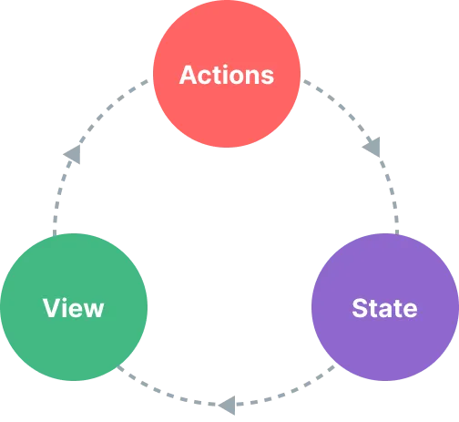
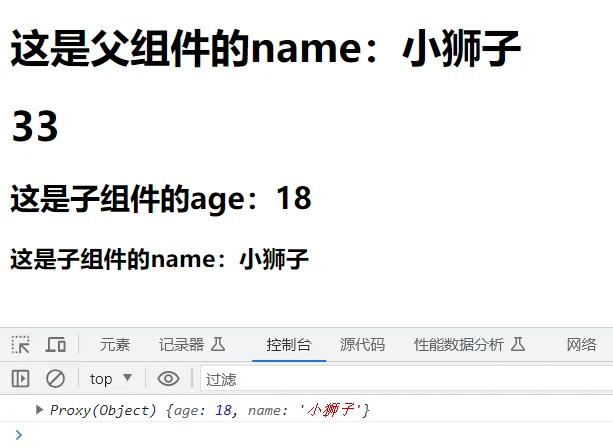

来源：https://www.yuque.com/chengxuyuanyideng/bu4rdb/eq7d76

视频：https://www.bilibili.com/video/BV1P4421D7Ap?p=12&vd_source=d6c3edd9a4f6205095ccfba6b2a61eec

时间：20240816

# 环境搭建

## dev-tools安装

https://chrome.zzzmh.cn/index

搜索vue即可，谷歌、edge都有

## Node环境安装

下载地址  https://nodejs.org/en/download/prebuilt-installer

```tex
测试安装环境
C:\Users\admin>node --version
v16.15.0
```


## vite创建项目

### 创建一个 Vue 应用

```
2种方式：
npm create vue@latest  推荐
npm init vite@latest
```


这一指令将会安装并执行 create-vue，它是 Vue 官方的项目脚手架工具。你将会看到一些诸如 TypeScript 和测试支持之类的可选功能提示：

```
cd <your-project-name>
npm install
npm run dev
```

你现在应该已经运行起来了你的第一个 Vue 项目！请注意，生成的项目中的示例组件使用的是组合式 API 和 <script setup>，而非选项式 API。

## VS Code

### vscode 新建vue模板

vue.code-snippets

```
"Print to console":{
    "prefix":"vue",
    "body": [
        "<template>\n",
        "</template>\n",
        "<script setup lang=\"ts\">\n",
        "</script>\n",
        "<style scoped>\n",
        "</style>",
        ],
    "description":"Log output to console"
}
```

新建vue文件之后，输入vue就会有提示

### vscode语法提示

推荐IDE和工具

推荐的 IDE 配置是 [Visual Studio Code](https://code.visualstudio.com/) + [Vue - Official 扩展](https://marketplace.visualstudio.com/items?itemName=Vue.volar)


## idea中配置

### idea中不能使用npm命令的解决办法

File-> Settings -> Tools -> Terminal -> Shell path中内容由cmd.exe修改为C:\Windows\System32\cmd.exe全路径


### idea中配置vue启动


### idea中vue.js插件


## vue修改端口

vite.config.ts

```javascript
import { defineConfig } from 'vite'
import vue from '@vitejs/plugin-vue'

// https://vitejs.dev/config/
export default defineConfig({
  plugins: [vue()],
  server:{
    host:'0.0.0.0',
    port:8088,
    open:true //启动后打开浏览器
  }
})
```

## Vue3 项目打包

打包 Vue 项目使用以下命令：

```
npm run build
```

在项目根目录下生成dist文件夹


配置nginx转发到该目录即可访问

```
server {
  listen       7002;
  server_name  localhost;
  
  location / {
    root C:/sources/vue3/vue01/dist;
    index  index.html;
  }
}
```

## typescript忽略类型检查

### 单行忽略(添加到特定行的行前来忽略这一行的错误)

```
// @ts-ignore
```

### 跳过对某些文件的检查 (添加到该文件的首行才起作用)

```
// @ts-nocheck
```

### 对某些文件的检查

```
// @ts-check
```

## 配置"@"路径别名

https://cn.vitejs.dev/config/

### 安装依赖

```
npm i @types/node
```

### 修改vite.config.js

```javascript
import { defineConfig } from 'vite'
import { resolve } from 'path'

export default defineConfig {
    // ...
    resolve: {
        alias: {
            "@": resolve(__dirname, 'src'), // 路径别名
        },
        extensions: ['.js', '.json', '.ts'] // 使用路径别名时想要省略的后缀名，可以自己 增减
    }
    // ...
}
```

```javascript
// @ts-nocheck
import { defineConfig } from 'vite'
import vue from '@vitejs/plugin-vue'
import { resolve } from 'path'

// https://vitejs.dev/config/
export default defineConfig({
  plugins: [
    vue({
      reactivityTransform: true
    })
  ],
  resolve: {
    alias: {
      "@": resolve(__dirname, 'src'), // 路径别名
    },
    extensions: ['.js', '.json', '.ts'] // 使用路径别名时想要省略的后缀名，可以自己 增减
  }

})
```

### 修改tsconfig.json

```javascript
{
    "compilerOptions" : {
        // ...
        "baseUrl": ".", // 用于设置解析非相对模块名称的基本目录，相对模块不会受到baseUrl的影响
        "paths": { // 用于设置模块名到基于baseUrl的路径映射
            "@/*": ["src/*"]
        }
        // ...
    }
}

```

## vite忽略.vue扩展名

```javascript
// vite.config.js
import { defineConfig } from 'vite'
export default defineConfig({
    // ...其他配置项
    resolve: {
      // 忽略后缀名的配置选项, 添加 .vue 选项时要记得原本默认忽略的选项也要手动写入
      extensions: ['.mjs', '.js', '.ts', '.jsx', '.tsx', '.json', '.vue']
    }
  })


```


# Vue3 介绍

## MVVM

**MVVM是Model-View-ViewModel的简写**。它本质上就是MVC 的改进版。MVVM 就是将其中的View 的状态和行为抽象化，让我们将视图 UI 和业务逻辑分开。


- 模型

模型是指代表真实状态内容的领域模型（面向对象），或指代表内容的数据访问层（以数据为中心）。

- 视图

就像在MVC和MVP模式中一样，视图是用户在屏幕上看到的结构、布局和外观（UI）。

- 视图模型

视图模型是暴露公共属性和命令的视图的抽象。MVVM没有MVC模式的控制器，也没有MVP模式的presenter，有的是一个绑定器。在视图模型中，绑定器在视图和数据绑定器之间进行通信。

- 绑定器

声明性数据和命令绑定隐含在MVVM模式中。在Microsoft解决方案堆中，绑定器是一种名为[XAML](https://baike.baidu.com/item/XAML?fromModule=lemma_inlink)的[标记语言](https://baike.baidu.com/item/标记语言?fromModule=lemma_inlink)。绑定器使开发人员免于被迫编写样板式逻辑来同步视图模型和视图。在微软的堆之外实现时，声明性数据绑定技术的出现是实现该模式的一个关键因素。 [1] 


## 什么是 Vue？

Vue (发音为 /vjuː/，类似 **view**) 是一款用于构建用户界面的 JavaScript 框架。它基于标准 HTML、CSS 和 JavaScript 构建，并提供了一套声明式的、组件化的编程模型，帮助你高效地开发用户界面。无论是简单还是复杂的界面，Vue 都可以胜任。


官网地址：https://cn.vuejs.org/


## 渐进式框架

Vue 是一个框架，也是一个生态。其功能覆盖了大部分前端开发常见的需求。但 Web 世界是十分多样化的，不同的开发者在 Web 上构建的东西可能在形式和规模上会有很大的不同。考虑到这一点，Vue 的设计非常注重灵活性和“可以被逐步集成”这个特点。根据你的需求场景，你可以用不同的方式使用 Vue：

- 无需构建步骤，渐进式增强静态的 HTML
- 在任何页面中作为 Web Components 嵌入
- 单页应用 (SPA)
- 全栈 / 服务端渲染 (SSR)
- Jamstack / 静态站点生成 (SSG)
- 开发桌面端、移动端、WebGL，甚至是命令行终端中的界面

如果你是初学者，可能会觉得这些概念有些复杂。别担心！理解教程和指南的内容只需要具备基础的 HTML 和 JavaScript 知识。即使你不是这些方面的专家，也能够跟得上。

如果你是有经验的开发者，希望了解如何以最合适的方式在项目中引入 Vue，或者是对上述的这些概念感到好奇，我们在[使用 Vue 的多种方式](https://cn.vuejs.org/guide/extras/ways-of-using-vue.html)中讨论了有关它们的更多细节。

无论再怎么灵活，Vue 的核心知识在所有这些用例中都是通用的。即使你现在只是一个初学者，随着你的不断成长，到未来有能力实现更复杂的项目时，这一路上获得的知识依然会适用。如果你已经是一个老手，你可以根据实际场景来选择使用 Vue 的最佳方式，在各种场景下都可以保持同样的开发效率。这就是为什么我们将 Vue 称为“渐进式框架”：它是一个可以与你共同成长、适应你不同需求的框架。


# Vue3 响应式

## reactive声明响应式状态

我们可以使用 reactive() 函数创建一个响应式对象或数组：

```javascript
<script setup>
import { reactive } from 'vue'

const state = reactive({ count: 0 })
</script>
```

在组件模板中使用响应式状态。

```javascript
<template>
<div>{{ state.count }}</div>
</template>
```

自然，我们也可以在同一个作用域下定义一个更新响应式状态的函数：

```javascript
<script setup>
import { reactive } from 'vue'

const state = reactive({ count: 0 })

function increment() {
      state.count++
}

</script>
```

暴露的方法通常会被用作事件监听器：

```javascript
<button @click="increment">
  {{ state.count }}
</button>
```


### 深层响应性

在 Vue 中，状态都是默认深层响应式的。这意味着即使在更改深层次的对象或数组，你的改动也能被检测到。

```javascript
import { reactive } from 'vue'

const obj = reactive({
  nested: { count: 0 },
  arr: ['foo', 'bar']
})

function mutateDeeply() {
  // 以下都会按照期望工作
  obj.nested.count++
  obj.arr.push('baz')
}
```


### reactive() 的局限性

reactive() API 有两条限制：

1. 仅对对象类型有效（对象、数组和 Map、Set 这样的[集合类型](https://developer.mozilla.org/zh-CN/docs/Web/JavaScript/Reference/Global_Objects#使用键的集合对象)），而对 string、number 和 boolean 这样的 [原始类型](https://developer.mozilla.org/zh-CN/docs/Glossary/Primitive) 无效。
2. 因为 Vue 的响应式系统是通过属性访问进行追踪的，因此我们必须始终保持对该响应式对象的相同引用。这意味着我们不可以随意地“替换”一个响应式对象，因为这将导致对初始引用的响应性连接丢失：

```javascript
let state = reactive({ count: 0 })

// 上面的引用 ({ count: 0 }) 将不再被追踪（响应性连接已丢失！）
state = reactive({ count: 1 })
```

同时这也意味着当我们将响应式对象的属性赋值或解构至本地变量时，或是将该属性传入一个函数时，我们会失去响应性：

```javascript
const state = reactive({ count: 0 })

// n 是一个局部变量，同 state.count
// 失去响应性连接
let n = state.count
// 不影响原始的 state
n++

// count 也和 state.count 失去了响应性连接
let { count } = state
// 不会影响原始的 state
count++

// 该函数接收一个普通数字，并且
// 将无法跟踪 state.count 的变化
callSomeFunction(state.count)
```


## 用 ref() 定义响应式变量

reactive() 的种种限制归根结底是因为 JavaScript 没有可以作用于所有值类型的 “引用” 机制。为此，Vue 提供了一个 ref() 方法来允许我们创建可以使用任何值类型的响应式 **ref**：

```javascript
import { ref } from 'vue'

const count = ref(0)
```
ref() 将传入参数的值包装为一个带 .value 属性的 ref 对象：

```javascript
const count = ref(0)

console.log(count) // { value: 0 }
console.log(count.value) // 0

count.value++
console.log(count.value) // 1
```

和响应式对象的属性类似，ref 的 .value 属性也是响应式的。同时，当值为对象类型时，会用 reactive() 自动转换它的 .value。

一个包含对象类型值的 ref 可以响应式地替换整个对象：

```javascript
const objectRef = ref({ count: 0 })

// 这是响应式的替换
objectRef.value = { count: 1 }
```

ref 被传递给函数或是从一般对象上被解构时，不会丢失响应性：

```vue
const obj = {
  foo: ref(1),
  bar: ref(2)
}

// 该函数接收一个 ref
// 需要通过 .value 取值
// 但它会保持响应性
callSomeFunction(obj.foo)

// 仍然是响应式的
const { foo, bar } = obj
```

简言之，ref() 让我们能创造一种对任意值的 “引用”，并能够在不丢失响应性的前提下传递这些引用。


### ref 在模板中的解包

当 ref 在模板中作为顶层属性被访问时，它们会被自动“解包”，所以不需要使用 .value。下面是之前的计数器例子，用 ref() 代替：

```vue
<script setup>
import { ref } from 'vue'

const count = ref(0)

function increment() {
  count.value++
}
</script>

<template>
  <button @click="increment">
    {{ count }} <!-- 无需 .value -->
  </button>
</template>
```


# Vue3 ref获取元素节点

### 前言

虽然在 Vue 中不提倡我们直接操作 DOM，毕竟 Vue 的理念是以数据驱动视图。但是在实际情况中，我们有很多需求都是需要直接操作 DOM 节点的，这个时候 Vue 提供了一种方式让我们可以获取 DOM 节点：ref 属性。ref 属性是 Vue2 和 Vue3 中都有的，但是使用方式却不大一样，这也导致了很多从 Vue2 转到 Vue3 的小伙伴感到有些困惑。

### Vue3 中 ref 访问元素

Vue3 中通过 ref 访问元素节点与 Vue2 不太一样，在 Vue3 中我们是没有 this 的，所以当然也没有 this.$refs。想要获取 ref，我们只能通过声明变量的方式。

```vue
<template>
	<view>
		<button ref="hello" id="10">
			这里是组件
		</button>
	</view>
</template>

<script setup>
	import { onMounted, ref } from 'vue';
	const hello = ref(null)
	onMounted(()=>{
		console.log(hello.value) //通过.value可以查看target中的值
		console.log(hello.value.id) //获取属性值
		console.log(hello.value.$el.innerHTML) //获取内容值
	})
	
</script>

<style lang="scss" scoped>
	
</style>
```

输出结果：


注意：通过输出.value 来查看target中的值！可以获取组件元素的属性以及内部的html


上段代码中我们同样给 div 元素添加了 ref 属性，为了获取到这个元素，我们声明了一个与 ref 属性名称相同的变量 hello，然后我们通过 hello.value 的形式便获取到了该 div 元素。

# Vue3 语法

## Vue3 模板语法

Vue 使用了基于 HTML 的模板语法，允许开发者声明式地将 DOM 绑定至底层 Vue 实例的数据。

Vue 的核心是一个允许你采用简洁的模板语法来声明式的将数据渲染进 DOM 的系统。

结合响应系统，在应用状态改变时， Vue 能够智能地计算出重新渲染组件的最小代价并应用到 DOM 操作上。

### 插值

#### 文本

数据绑定最常见的形式就是使用 {{...}}（双大括号）的文本插值：

```vue
<script setup>
const message = $ref('Hello Vue!!')
</script>

<template>
{{ message }}
</template>
```

{{...}} 标签的内容将会被替代为对应组件实例中 message 属性的值，如果 message 属性的值发生了改变，{{...}} 标签内容也会更新。

如果不想改变标签的内容，可以通过使用 v-once 指令执行一次性地插值，当数据改变时，插值处的内容不会更新。

```javascript
<input type="text" v-model="message"/><br/>
<span v-once>这个将不会改变: {{ message }}</span>
```

#### Html

使用 v-html 指令用于输出 html 代码

双大括号会将数据解释为纯文本，而不是 HTML。若想插入 HTML，你需要使用 `v-html` 指令

```vue
<script setup>
const rawHtml = $ref('<span style="color: red">这里会显示红色！</span>')
</script>

<template>

<p>使用双大括号的文本插值: {{ rawHtml }}</p>
<p>使用 v-html 指令: <span v-html="rawHtml"></span></p>

</template>
```

#### 属性

HTML 属性中的值应使用 v-bind 指令。

```vue
<div v-bind:id="dynamicId"></div>
```

对于布尔属性，常规值为 true 或 false，如果属性值为 null 或 undefined，则该属性不会显示出来。

```
<button v-bind:disabled="isButtonDisabled">按钮</button>
```

以上代码中如果 isButtonDisabled 的值是 null 或 undefined，则 disabled 属性甚至不会被包含在渲染出来的 <button> 元素中。

以下实例判断 use 的值，如果为 true 使用 class1 类的样式，否则不使用该类：

```vue
<script setup>
const id = $ref('100')
const title = $ref('标题')

</script>

<template>

<span v-bind:id="id" :title="title">测试绑定标签属性</span>
<div v-bind:class="cls">属性绑定</div>
<div :class="cls">简化属性绑定</div>
<div :id="id">同名属性绑定</div>
<div :id>简化同名属性绑定</div>
<div v-bind:id>简化同名属性绑定</div>

<h5>v-bind 指令:布尔值</h5>
<button :disabled="isButtonDisabled">Button</button>
<button :disabled="! isButtonDisabled">Button</button>

<h5>v-bind 指令:动态绑定多个值</h5>
<div v-bind="objectofAttrs">动态绑定多个值</div>

</template>
```

**v-bind注意：**

- 简写的格式：`:属性名=xx`，例如：

  ```
  <h1 v-bind:class="v1"></h1>
  <h1 :class="v1"></h1>
  
  ```

- v-bind属于单向绑定（JS修改->HTML修改）。

#### 表达式

Vue 都提供了完全的 JavaScript 表达式支持。

每个绑定仅支持**单一表达式**，也就是一段能够被求值的 JavaScript 代码。一个简单的判断方法是是否可以合法地写在 `return` 后面。

```vue
<script setup>
      const ok =  $ref(true)
      const message = $ref('HelloVue!!')
      const id = $ref('1')
</script>

<template>

    {{5 + 5}}<br>
    {{ ok ? 'YES' : 'NO' }}<br>
    {{ message.split('').reverse().join('') }}
    <div v-bind:id="'list-' + id">欢迎学习VUE!</div>

</template>
```

表达式会在当前活动实例的数据作用域下作为 JavaScript 被解析。有个限制就是，每个绑定都只能包含单个表达式，所以下面的例子都不会生效:

```
<!--  这是语句，不是表达式：-->
{{ var a = 1 }}

<!-- 流控制也不会生效，请使用三元表达式 -->
{{ if (ok) { return message } }}
```

### 指令

指令是带有 v- 前缀的特殊属性。

#### v-if指令

条件渲染，v-if` 指令会基于表达式值的真假来移除/插入该元素。

指令用于在表达式的值改变时，将某些行为应用到 DOM 上。如下例子：

```vue
<script setup>
      const seen = $ref(true)
</script>

<template>

<p v-if="seen">现在你看到我了</p>

</template>
```

这里， v-if 指令将根据表达式 seen 的值( true 或 false )来决定是否插入 p 元素。

#### v-show

条件渲染，根据条件显示和隐藏（标签都会渲染到页面）

不满足的情况下使用的是display: none;便签还是存在的

```
<h4 v-show="age >= 18">成年</h4>
<h4 v-show="age < 18">未成年</h4>
```

#### v-for指令

另外还有其它很多指令，每个都有特殊的功能。例如，v-for 指令可以绑定数组的数据来渲染一个项目列表：

```
<script setup>
const sites = $ref([
        { text: 'C++' },
        { text: 'Java' },
        { text: 'PHP' }
      ])

</script>

<template>

<ol>
    <li v-for="(site,index) in sites" :key="index">
      {{ site.text }}
    </li>
  </ol>

</template>
```

用户数据进行循环并展示，我们可以使用 `v-for` 指令基于一个数组来渲染一个列表。`v-for` 指令的值需要使用 `item in items` 形式的特殊语法，其中 `items` 是源数据的数组，而 `item` 是迭代项的**别名**

##### 通过 key 管理状态

Vue 默认按照“就地更新”的策略来更新通过 `v-for` 渲染的元素列表。当数据项的顺序改变时，Vue 不会随之移动 DOM 元素的顺序，而是就地更新每个元素，确保它们在原本指定的索引位置上渲染。

为了给 Vue 一个提示，以便它可以跟踪每个节点的标识，从而重用和重新排序现有的元素，你需要为每个元素对应的块提供一个唯一的 `key` 属性

==注意==

`key` 在这里是一个通过 `v-bind` 绑定的特殊 attribute。

推荐在任何可行的时候为 `v-for` 提供一个 `key` attribute。

`key` 绑定的值期望是一个基础类型的值，例如字符串或 number 类型。不要用对象作为 `v-for` 的 key。

#### v-bind指令

参数在指令后以冒号指明。例如， v-bind 指令被用来响应地更新 HTML 属性：

```vue
<script setup>
const id = $ref(100)
const title = $ref('标题')

</script>

<template>

<span v-bind:id="id" :title="title">测试绑定标签属性</span>

</template>

```

#### v-on指令

另一个例子是 v-on 指令，它用于监听 DOM 事件：

```vue
<!-- 完整语法 -->
<a v-on:click="doSomething"> ... </a>

<!-- 缩写 -->
<a @click="doSomething"> ... </a>

```

在这里参数是监听的事件名。

#### 缩写

##### v-bind 缩写

Vue.js 为两个最为常用的指令提供了特别的缩写：

```vue
<!-- 完整语法 -->
<a v-bind:href="url"></a>
<!-- 缩写 -->
<a :href="url"></a>
```

##### v-on 缩写

```vue
<!-- 完整语法 -->
<a v-on:click="doSomething"></a>
<!-- 缩写 -->
<a @click="doSomething"></a>
```

### v-model

#### 双向绑定

在 input 输入框中我们可以使用 v-model 指令来实现双向数据绑定：

```vue
<script setup>
const message = $ref('HelloVue!')
</script>

<template>

<p>{{ message }}</p>
<input v-model="message">

</template>
```

v-model 指令用来在 input、select、textarea、checkbox、radio 等表单控件元素上创建双向数据绑定，根据表单上的值，自动更新绑定的元素的值。

#### select中使用

```vue
<script setup>
const selected = $ref('')
</script>

<template>

<select v-model="selected">
    <option disabled value="">请选择</option>
    <option>A</option>
    <option>B</option>
    <option>C</option>
  </select>
<span><br/>
  
Selected: {{ selected }}</span>

</template>
```

#### v-for使用

循环动态绑定select的option数据。选中数据的时候selected动态更新

```vue
<script setup>

const selected = $ref('A')

const options = $ref([
      { text: 'One', value: 'A' },
      { text: 'Two', value: 'B' },
      { text: 'Three', value: 'C' }
    ])

</script>

<template>

<select v-model="selected">
  <option v-for="option in options" v-bind:value="option.value">
    {{ option.text }}
  </option>
</select>
<span>Selected: {{ selected }}</span>

</template>
```

#### textarea中使用

```vue
<script setup>

const message = $ref('HelloVue!')

</script>

<template>

<textarea v-model="message" rows="10" cols="10"></textarea><br/>
    {{message}}
</template>
```

#### checkbox中使用

checkbox中选中自动将value值放到数组中

```vue
<script setup>

const courses = $ref([])

</script>

<template>

java:<input type="checkbox" value="java" v-model="courses" /><br/>
php:<input type="checkbox" value="php" v-model="courses" /><br/>
python:<input type="checkbox" value="python" v-model="courses" /><br/>
c++:<input type="checkbox" value="c++" v-model="courses" /><br/>
<ol>
    <li v-for="course in courses">{{course}}</li>
</ol>

</template>
```

#### checkbox全选、反选

更好用的参考计算属性中的案例

```vue
<template>
    <table border="1">
    <tr>
      <td>
        <input type="checkbox" v-on:click="selectAll" v-model="select">
      </td>
      <td>ID</td>
      <td>用户名</td>
      <td>密码</td>
    </tr>
    <tr v-for="user in users" :key="user.id">
      <td>
        <input type="checkbox" v-bind:value="user.id" v-model="ids" >
      </td>
      <td v-text="user.id"></td>
      <td v-text="user.userName"></td>
      <td v-text="user.password"></td>
    </tr>
  </table><br/>
  被选中的用户id:{{ids}}
</template>

<script setup>
import { ref } from 'vue';

let select = ref(false)

const users = ref([
  {id:1,userName:"张三",password:"123456"},
  {id:2,userName:"李四",password:"123456"},
  {id:3,userName:"王五",password:"123456"},
  {id:4,userName:"赵六",password:"123456"},
  {id:5,userName:"王二麻子",password:"123456"},
])

const ids = ref([])

function selectAll(){
    select.value = !select.value

  if(select.value){
    users.value.forEach(function(current, index){
      ids.value.push(current.id)
    })
  }else{
    ids.value.length=0
  }
  
}
</script>

<style scoped>

</style>
```

#### radio中使用

```vue
<script setup>

const sex = $ref('男')

</script>

<template>

男:<input type="radio" value="男" v-model="sex" /><br/>
女:<input type="radio" value="女" v-model="sex" /><br/>
{{sex}}

</template>
```

### 方法使用：获取登录账号密码

按钮的事件我们可以使用 v-on 监听事件，并对用户的输入进行响应

```vue
<script setup>

const userName = $ref('')
const password = $ref('')

function login(){
  console.log(userName)
  console.log(password)
}

</script>

<template>

<h3>登录、注册:拿到用户、密码 做ajax提交 true:跳转首页 失败:提示</h3>
userName:{{userName}}<br/>
password:{{password}}<br/>
用户名:<input type="text" v-model="userName"><br/>
密码:<input type="text" v-model="password"><br/>
<button v-on:click="login" >登录</button><br/>

</template>
```

#### 综合训练

```vue
<script setup>

const a = $ref(0)
const b = $ref(0)
const ret = $ref(0)

function add(){
    ret = parseInt(a) + parseInt(b)
}

</script>

<template>

a:<input type="text" v-model="a"><br/>
b:<input type="text" v-model="b"><br/>
<button v-on:click="add" >加</button><br/>
结果：{{ret}}

</template>
```

## Vue3 条件语句

### 条件判断

> v-if和v-else-if、v-else中间不能有其他标签被隔开！

#### v-if

条件判断使用 v-if 指令，指令的表达式返回 true 时才会显示：

```vue
<script setup>

const seen = $ref(true)

</script>

<template>

<p v-if="seen">现在你看到我了</p>

</template>

```

这里， v-if 指令将根据表达式 seen 的值( true 或 false )来决定是否插入 p 元素。

因为 v-if 是一个指令，所以必须将它添加到一个元素上。如果是多个元素，可以包裹在 <template> 元素上，并在上面使用 v-if。最终的渲染结果将不包含 <template> 元素。

```vue
<script setup>

const seen = $ref(true)

</script>

<template>

<template v-if="seen">
    <h1>网站</h1>
    <p>Google</p>
    <p>Java</p>
    <p>Taobao</p>
</template>

</template>
```

**template 元素上使用 v-if 指令 <font color='red'>template标签不会在页面上显示</font>**

在 <template> 元素上使用 v-if 指令：

```vue
<script setup>

const seen = $ref(true)

</script>

<template>

<template v-if="seen">
    <h1>网站</h1>
    <p>Google</p>
    <p>Java</p>
    <p>Taobao</p>
</template>

</template>
```

#### v-else

可以用 v-else 指令给 v-if 添加一个 "else" 块：

```vue
<script setup>

</script>

<template>

<div v-if="Math.random() > 0.5">
  随机数大于 0.5
</div>
<div v-else>
  随机数小于等于 0.5
</div>

</template>
```

#### v-else-if

v-else-if 即 v-if 的 else-if 块，可以链式的使用多次：

```vue
<script setup>
const type = $ref('C')
</script>

<template>

<div v-if="type === 'A'">
      A
</div>
<div v-else-if="type === 'B'">
  B
</div>
<div v-else-if="type === 'C'">
  C
</div>
<div v-else>
  Not A/B/C
</div>

</template>
```

>v-else 、v-else-if 必须跟在 v-if 或者 v-else-if之后。

```vue
<script setup>
const type = $ref('C')
</script>

<template>

<select v-model="type">
  <option typeof="A">A</option>
  <option typeof="B">B</option>
  <option typeof="C">C</option>
</select>
<template v-if="type === 'A'">
  <h1>Java</h1>
</template>
<template v-else-if="type === 'B'">
  <h1>PHP</h1>
</template>
<template v-else>
  <h1>C++</h1>
</template>

</template>
```

#### v-show

我们也可以使用 v-show 指令来根据条件展示元素：

```vue
<script setup>
const ok = $ref(true)
</script>

<template>

<h1 v-show="ok">Hello!</h1>

</template>
```

### v-if和v-show区别


v-if：控制元素不显示，并且标签也不存在

v-show是控制元素：display: none;(根据条件显示和隐藏（标签都会渲染到页面）)

## Vue3 循环语句

### 循环使用 v-for 指令

v-for 指令需要以 site in sites 形式的特殊语法， sites 是源数据数组并且 site 是数组元素迭代的别名。

v-for 可以绑定数据到数组来渲染一个列表：

```vue
<script setup>
const sites = $ref([
    { text: 'Google' },
    { text: 'Java' },
    { text: 'Taobao' }
  ])

</script>

<template>

    <ol>
        <li v-for="site in sites">
          {{ site.text }}
        </li>
    </ol>

</template>
```


```vue
<script setup>
const users = $ref([
  {userName:'张三',pwd:'123456',age:20},
  {userName:'李四',pwd:'123456',age:22},
  {userName:'王五',pwd:'123456',age:24},
  {userName:'赵六',pwd:'123456',age:26},
  {userName:'小明',pwd:'123456',age:28}
])

</script>

<template>

<span v-for="user in users" >
    用户名：{{user.userName}},密码：{{user.pwd}},年龄：{{user.age}}<br/>
</span>

</template>

```

v-for 还支持一个可选的第二个参数，参数值为当前项的索引：

index 为列表项的索引值：

```vue
<script setup>
const sites = $ref([
  { text: 'Google' },
  { text: 'Java' },
  { text: 'Taobao' }
])

</script>

<template>

<ol>
  <li v-for="(site, index) in sites">
    {{ index }} -{{ site.text }}
  </li>
</ol>

</template>

```

模板 <template> 中使用 v-for：

```vue
<script setup>
const sites = $ref([
    { text: 'Google' },
    { text: 'Java' },
    { text: 'Taobao' }
  ])

</script>

<template>
	<ul>
	  <template v-for="site in sites">
		<li>{{ site.text }}</li>
		<li>--------------</li>
	  </template>
	</ul>

</template>
```

v-for 迭代对象

```vue
<script setup>

const object = $ref({
    userName:'张三',
    age:20,
    sex:'男'
})

</script>

<template>

<span v-for="obj in object">
  {{obj}}<br/>
</span>

</template>

```

你也可以提供第二个的参数为键名：

```vue
<script setup>

const object = $ref({
    userName:'张三',
    age:20,
    sex:'男'
})

</script>

<template>

<span v-for="(obj,key) in object">
  {{key}}:{{obj}}<br/>
</span>

</template>

```

第三个参数为索引：

```vue
<script setup>

const object = $ref({
    userName:'张三',
    age:20,
    sex:'男'
})

</script>

<template>

<span v-for="(obj,key,index) in object">
  {{index}}:{{key}}:{{obj}}<br/>
</span>

</template>

```

### v-for 迭代整数

v-for 也可以循环整数

```vue
<script setup>

</script>

<template>

<ul>
  <li v-for="n in 10">
    {{ n }}
  </li>
</ul>

</template>

```

### v-for/v-if 联合使用

当它们同时存在于一个节点上时，v-if 比 v-for 的优先级更高。这意味着 v-if 的条件将无法访问到 v-for 作用域内定义的变量别名

```vue
<!--
 这会抛出一个错误，因为属性 todo 此时
 没有在该实例上定义
-->
<li v-for="todo in todos" v-if="!todo.isComplete">
  {{ todo.name }}
</li>
```

在外新包装一层 <template> 再在其上使用 v-for 可以解决这个问题 (这也更加明显易读)：

```vue
<template v-for="todo in todos">
  <li v-if="!todo.isComplete">
    {{ todo.name }}
  </li>
</template>
```

### 在组件上使用 v-for

如果你还没了解组件的内容，可以先跳过这部分。

在自定义组件上，你可以像在任何普通元素上一样使用 v-for：

```vue
<my-component v-for="item in items" :key="item.id"></my-component>
```

然而，任何数据都不会被自动传递到组件里，因为组件有自己独立的作用域。为了把迭代数据传递到组件里，我们要使用 props：

```vue
<my-component
  v-for="(item, index) in items"
  :item="item"
  :index="index"
  :key="item.id"
></my-component>
```

## Vue3 v-for的key

下面的例子，没有key和有key的情况下不一样：

1、没有key，选中前面的checkbox，进行删除，在数组上方加入数据，选中的是位置

2、有key，选中前面的checkbox，进行删除，在数组上方加入数据，选中的是元素

总结：无：key属性时，状态默认绑定的是位置；有：key属性时，状态根据key的属性值绑定到了相应的数组元素。

官网解释：当 Vue 正在更新使用 v-for 渲染的元素列表时，它默认使用“就地更新”的策略。如果数据项的顺序被改变，Vue 将不会移动 DOM 元素来匹配数据项的顺序，而是就地更新每个元素，并且确保它们在每个索引位置正确渲染。

[维护状态](https://v3.cn.vuejs.org/guide/list.html#维护状态)

```vue
<script setup>
  const users = $ref([
    {userName:'张三1',age:22,password:'123456'},
    {userName:'张三2',age:22,password:'123456'},
    {userName:'张三3',age:22,password:'123456'},
    {userName:'张三4',age:22,password:'123456'},
    {userName:'张三5',age:22,password:'123456'},
    {userName:'张三6',age:22,password:'123456'}
  ])

  function addUser(){
    //this.users.push({userName:'张三'+(this.users.length+1),age:22,password:'123456'}) //在数组头部添加一条数据
    users.unshift({userName:'张三'+(users.length+1),age:22,password:'123456'}) //在数组尾部添加一条数据
  }

  function del(e){
    users.splice(e,1) //splice:代表删除N条数据
  }
  //一个页面里面实际上没那么多业务的 放在一起都是OK的
</script>

<template>
  <h4>v-for循环 状态管理案例</h4>
  <h1> key:一般都是唯一值 一般都是需要加上key </h1>
  <span v-for="(user,index) in users" :key="user.userName">
    <input type="checkbox">{{user.userName}},{{index}},<button @click="del(index)" >delete</button><br/>
    </span>
  <br/>
  <button @click="addUser">新增user</button>

</template>

  <style>

</style>
```

## Vue3 template

### 说明

template不会显示在网页中：解决vue只能放在标签上的问题，当有一些业务需求不能放在标签上或者希望放在标签之外执行vue表达式的时候可以使用。

**<font color='red'>注意：不能直接单独使用</font>**

### 在if中使用template

```vue
<template v-if="1==1">
   <span>这里是span</span>
</template>
```

### 在v-for中使用template

```vue
<template v-for="n in 10">
  {{n}} <br/>
</template>
```

## Vue3 方法调用

### 方法使用

我们可以使用 v-on 指令来监听 DOM 事件，从而执行 JavaScript 代码。

v-on 指令可以缩写为 @ 符号。

#### 语法格式

```vue
v-on:click="methodName"
或
@click="methodName"
```

#### 方法调用

v-on

```vue
<script setup>

const counter = $ref(0)

</script>

<template>

<button @click="counter += 1">增加 1</button>
<p>这个按钮被点击了 {{ counter }} 次。</p>

</template>

```

通常情况下，我们需要使用一个方法来调用 JavaScript 方法。

v-on 可以接收一个定义的方法来调用

```vue
<script setup>

const name = $ref('Java')

function greet(event) {
    // `methods` 内部的 `this` 指向当前活动实例
    alert('Hello ' + name + '!')
    // `event` 是原生 DOM event
    if (event) {
    alert(event.target.tagName)
    }
}

</script>

<template>

<!-- `greet` 是在下面定义的方法名 -->
<button @click="greet">点我</button>

</template>

```

#### 方法传参

```vue
<script setup>

function say(message) {
    console.log(message)
}

</script>

<template>

<button @click="say('hi')">Say hi</button>
<button @click="say('what')">Say what</button>

</template>

```

## Vue3 计算属性

### 介绍

**<font color='red'>计算属性：用法上和方法一样，可以看做是方法的特殊用法。当数据变化的时候会被触发，如果不变化即使多次调用，也不会执行。但是方法就不一样了，每次调用都会执行一遍。</font>**

**<font color='red'>适用场景：适合做计算的场景，比如统计购物车的总价：当选择的商品数量变化，计算属性的方法被调用，自动计算总价。</font>**


计算属性是自动监听依赖值的变化，从而动态返回内容，监听是一个过程，在监听的值变化时，可以触发一个回调，并做一些事情。特点：

- 监测的是依赖值，依赖值不变的情况下其会直接读取缓存进行复用，变化的情况下才会重新计算
- 数据可以进行逻辑处理，减少模板中计算逻辑。
- 对计算属性中的数据进行监视


计算属性由两部分组成：get和set，分别用来获取计算属性和设置计算属性。默认只有get，如果需要set，要自己添加。另外set设置属性，并不是直接修改自身的值，而是修改它的依赖。

### 定义计算属性

vue3中计算属性需要导入:computed

```vue
<script setup>
import { reactive, computed } from 'vue'

const author = reactive({
  name: 'John Doe',
  books: [
    'Vue 2 - Advanced Guide',
    'Vue 3 - Basic Guide',
    'Vue 4 - The Mystery'
  ]
})

// 一个计算属性 ref
const publishedBooksMessage = computed(() => {
  return author.books.length > 0 ? 'Yes' : 'No'
})
</script>

<template>
  <p>Has published books:</p>
  <span>{{ publishedBooksMessage }}</span>
</template>

```

#### 使用方法做计算器相加

不使用计算属性

```vue
<script setup>
  const a = $ref(0)
  const b = $ref(0)
  const ret = $ref(0)

function add(){
  ret = parseInt(a) + parseInt(b)
}

</script>

<template>

第一个数:<input type="text" v-model="a"><br/>
第二个数:<input type="text" v-model="b"><br/>
<button v-on:click="add">计算结果</button>
两个数相加:{{ret}}

</template>

```

测试发现必须点击**<font color='red'>计算结果</font>**按钮才可以，比较麻烦，**<font color='red'>不能自动计算！</font>**

#### 使用计算属性做计算器相加

使用计算属性

```vue
<script setup>
import { computed  } from 'vue';

  const a = $ref(0)
  const b = $ref(0)

  const result = computed ( ()=>{
      return parseInt(a) + parseInt(b);
  } )

</script>

<template>

第一个数:<input type="text" v-model="a"><br/>
第二个数:<input type="text" v-model="b"><br/>
两个数相加:{{result}}

</template>
```

<font color='red'>**只要随便输入一个数据，就可以自动计算最终结果：说明计算属性中，有在监控data中的数据！！！**</font>

#### 当计算属性中的数据变化

当计算属性中的数据变化的时候，计算属性对应的方法会被调用

```vue
<script setup>
import { computed  } from 'vue';

const message = $ref('')

const reversedMessage = computed( ()=>{
  console.log('x') 
  return message.split('').reverse().join('')
})

</script>

<template>

<input type="text" v-model="message"/>
  {{reversedMessage}}<br/>
</template>

```

### computed vs methods

我们可以使用 methods 来替代 computed，效果上两个都是一样的，但是 computed 是基于它的依赖缓存，只有相关依赖发生改变时才会重新取值。而使用 methods ，在重新渲染的时候，函数总会重新调用执行。


#### 多次调用方法

```vue
<script setup>

function run(){
    console.log('每次调用都会执行该方法!!!'+new Date().getTime())
}

</script>

<template>
    
<!-- 每次点击都会触发方法执行 -->
<button @click="run">调用方法</button>

</template>

```


#### 多次调用计算属性

只有当data中的值变化，计算属性才会重新计算

```vue
<script setup>

import { computed } from 'vue';

const count = $ref(0)
const price = $ref(200)

const message = computed(()=>{
    console.log('计算属性多次被调用不会触发!!!')
    return '计算属性多次被调用不会触发!!!' //计算属性必须要有返回值
})

const total = computed(()=>{
    console.log('当计算属性中有data中的值变更,会被触发:相当于监控了data!!!')
    return count * price
})

</script>

<template>

<span v-text="message"></span><br/>
<span v-text="message"></span><br/>
<span v-text="message"></span><br/>
<span v-text="message"></span><br/>
购买数量:<input type="text" v-model="count"><br/>
总价:<span v-text="total"></span>
</template>
```

### computed setter

computed 属性默认只有 get ，大多数情况下get就可以满足需求，不过在需要时你也可以提供一个 set ：

```vue
<script setup>

import { computed } from 'vue';

const userName = $ref("李四")
//注意：这里不需要()=>了
const message = computed({
    get(){
        return userName
    },
    set(v){
        userName = v
    }
})

</script>

<template>

<!-- 计算属性message变化的时候 设置的值赋值给userName -->
<input type="text" v-model="message"><br/>
{{userName}}

</template>
```

### 计算属性案例：

#### 1、大小写转换

直接在HTML中使用toUpperCase()方法，这样使得代码太长，影响代码的逻辑；因此就引入了计算属性的应用

不使用计算属性

```vue
<script setup>

const msg = $ref('')

</script>

<template>

<input type="text" v-model="msg"><br/>
{{msg.toUpperCase()}}

</template>
```

使用计算属性

```vue
<script setup>
import { computed } from 'vue';

const msg = $ref('')

const msgUpper = computed(()=>{
    return msg.toUpperCase()
})

</script>

<template>

<input type="text" v-model="msg"><br/>
{{ msgUpper }}

</template>
```

### 综合练习1

计算属性是 Vue 组件的一个重要内容，它具有 分离逻辑、缓存值、双向绑定 等作用或功能。
计算属性有缓存机制，方法没有；

只要计算属性内相关依赖的值不发生改变，多次调用计算属性可以从缓存中获取值，不必重复计算；

方法每次调用都要重新执行一遍；

依赖值发生改变时都会发生调用；

```vue
<script setup>
import { computed } from 'vue';

const goods = $ref([
    {goodsName: '苹果手机',price:10,num:10},
    {goodsName: '华为手机',price:20,num:5}
])

const goodsName = $ref('')
const price = $ref('')
const num = $ref('')

const totalPrice = computed(()=>{
    let total = 0
    goods.forEach(function(item,index){
        total += item.price * item.num
    })
    return total
})

function totalPrice2(){
    let total = 0
    goods.forEach(function(item,index){
        total += item.price * item.num
    })
    return total
}

function add(){
    console.log(goodsName)
    goods.push({goodsName:goodsName,price:price,num:num})
}

</script>

<template>

商品名称:<input type="text" v-model="goodsName" /><br/>
商品价格:<input type="text" v-model="price" /><br/>
商品数量:<input type="text" v-model="num" /><br/>
<button @click="add">添加商品</button><br/>
<span v-for="good in goods">
    商品名称：{{good.goodsName}},商品价格：{{good.price}},商品数量：{{good.num}}<br/>
</span>
计算属性 总价：{{totalPrice}}<br/>
方法 总价：{{totalPrice2()}}<br/>

</template>
```

### 综合练习2

通过计算属性计算每个商品总价，以及所有商品的总价

```
https://lark-assets-prod-aliyun.oss-cn-hangzhou.aliyuncs.com/yuque/0/2022/zip/23145762/1669472192520-deada9b4-ca26-4568-9491-5bc17bdf2d14.zip?OSSAccessKeyId=LTAI4GKnqTWmz2X8mzA1Sjbv&Expires=1723802294&Signature=BZdc0SeMC75iO3rhGU1Px56ljCs%3D&response-content-disposition=attachment%3Bfilename*%3DUTF-8%27%27taobao-shopping-cart-case.zip
```

### 综合练习3 全选和反选

```vue
<script setup>
import { computed } from 'vue';

const data = $ref([
          {
            hobby:"篮球",
            check:false,
          },{
            hobby:"棒球",
            check:false

          },{
            hobby:"羽毛球",
            check:false
          },{
            hobby:"乒乓球",
            check:false
          }
        ])

const all = computed({
    get(){
        /* 获取选项框中的选择状态是false还是true */
        console.log('get')
        return data.every(item => item.check === true)
    },
    set(val){
        console.log('set')
        /*拿到全选框的选中状态(true/false)，从而影响小选框的选中状态*/
        data.forEach(item => item.check = val)
    }

})

function inverse(){
    //点击的时候让对象里的 check属性取反再赋予回去
    data.forEach(item  => item.check = !item.check)
}

</script>

<template>

<h3>爱好</h3>
  <!-- v-model 关联全选按钮的 选中 状态 -->
  全选<input type="checkbox"   v-model="all" />
  <!-- 给 反选 按钮绑定点击事件 -->
  反选<input type="checkbox"   @change="inverse">
  <ul>
    <li  v-for="(item,index) in data" :key="index">
      <input type="checkbox" v-model="item.check" />
      <!-- 让对象的 check属性，关联 选中 状态  获取hobby的值-->
      <span>{{item.hobby}}</span>
    </li>
    </ul>

</template>
```

## Vue3 侦听器

### watch侦听器

 Vue3 监听属性 watch，我们可以通过 watch 来响应数据的变化。

定义方式和计算属性类似

通过watch监听

```vue
<script setup>
import { watch,ref } from 'vue';

const userName = ref('') // 这里不能使用语法糖

watch(userName,(newValue,oldValue)=>{
    console.log('新的值：'+newValue+' 旧的值：'+oldValue)
})

</script>

<template>

<input v-model="userName" />
</template>
```

### 使用场景

侦听数据异常：

#### 1、输入数据判断 ——验证用户名是否可用

```vue
<script setup>
import { watch,ref } from 'vue';

const userName = ref('') // 这里不能使用语法糖
const ok = $ref(false)

watch(userName, (n,o)=>{
    if('admin' == n){
        ok = true
    }else{
        ok = false
    }
})

</script>

<template>

<input v-model="userName"><br/>
<span class="error" v-show="ok">{{userName}} 不能用！</span>

</template>

<style>
.error{
    color: red;
}
</style>

```

#### 2、判断用户名和密码两个值

```vue
<script setup>
import { ref, watch } from 'vue';

const userName = ref('')
const password = ref('')
const error = ref(false)

watch([userName,password],([newUserName,newPassword],[oldUserName,oldPassword])=>{
  console.log('用户名新的的值:'+newUserName + ' 用户名原来的值:'+oldUserName)
  console.log('密码新的值:'+newPassword + ' 密码原来的值:' + oldPassword)
  if(newUserName === 'admin' && newPassword === '123456'){
      error.value = false 
  }else{
    error.value = true 
  }
})

</script>

<template>
用户名：<input type="text" v-model="userName"/><br/>
密码：<input type="text" v-model="password"/><br/>
<span style="background-color: red;" v-if="error">用户名异常</span>
</template>

<style scoped>

</style>

```

#### 3、可以侦听计算属性变化

```vue
<script setup>
import { computed, ref, watch } from 'vue';

let userName = ref('')

const message = computed({
    get(){
        return userName.value
    },
    set(v){
        userName.value = v
    }
})

watch(message, (newValue,oldValue)=>{
    console.log('新的值：'+newValue+' 旧的值：'+oldValue)
})

</script>

<template>
<input v-model="message">

</template>

<style scoped>

</style>
```

## Vue3 计算属性和侦听器使用场景

Vue 中的计算属性（computed）和侦听器（watch）有明显的区别和各自的适用场景。

理解何时使用侦听器（watch）和计算属性（computed）可以帮助你更有效地组织 Vue 组件的逻辑。

### 使用侦听器（watch）的业务场景：

1. 异步操作或副作用：

- - 场景：需要在数据变化时执行异步操作，如调用后端 API 请求数据。
  - 示例：在搜索框中输入关键词时，自动发起异步搜索请求，并更新搜索结果。

1. 复杂数据处理逻辑：

- - 场景：需要根据数据的变化进行复杂的计算或数据处理。
  - 示例：根据用户选择的不同筛选条件动态计算并更新商品列表的显示。

1. 非响应式数据监听：

- - 场景：需要监听非响应式数据的变化，如原生 DOM 元素的属性变化。
  - 示例：监听浏览器窗口尺寸变化，实时调整页面布局。

### 使用计算属性（computed）的业务场景：

1. 派生数据的计算：

- - 场景：需要基于一个或多个响应式数据计算出一个新的派生值。
  - 示例：计算购物车中商品总价，基于购物车中各商品的价格和数量计算得出。

1. 数据的重用和缓存：

- - 场景：需要在多个地方使用同一组数据计算结果，并希望这些结果能被缓存，减少重复计算。
  - 示例：根据用户输入的排序方式和过滤条件生成过滤后的列表，确保列表在排序和过滤条件未变化时不会重复计算。

1. 简化模板逻辑：

- - 场景：需要简化模板中的逻辑，将复杂的计算逻辑移至组件外部。
  - 示例：在表格中显示每行数据的总和、平均值等统计信息，通过计算属性预先计算并在模板中直接引用。

### 1. 计算属性 (Computed Properties)

计算属性适用于基于已有的响应式数据生成派生数据，它们具有缓存特性，只有相关依赖发生改变时才会重新计算值。计算属性在 setup 函数中使用 computed 来定义。

使用场景：

- 当你需要基于一个或多个响应式数据计算出一个新的值时，特别是这个计算过程可能是复杂或者会被多次调用的情况下，计算属性非常适合使用。

示例：

```vue
<script setup>
import { ref, computed } from 'vue';

const count = ref(0);

const doubleCount = computed(() => {
  return count.value * 2;
});

function increment() {
  count.value++;
}

</script>

<template>
  <div>
    <p>Count: {{ count }}</p>
    <p>Double Count: {{ doubleCount }}</p>
    <button @click="increment">Increment</button>
  </div>
</template>
```

### 2. 侦听器 (Watchers)

侦听器用于监听特定的数据变化，并在数据变化时执行自定义的操作。侦听器在 setup 函数中通过 watch 来定义。

使用场景：

- 当你需要在某个数据变化时执行异步操作、复杂的数据处理逻辑或者需要监听非响应式数据的变化时，侦听器是非常有用的工具。

示例：

```vue
<script setup>
import { ref, watch } from 'vue';

const message = ref('Hello');

watch(message, (newValue, oldValue) => {
  console.log(`Message changed from ${oldValue} to ${newValue}`);
  // Additional logic based on the change
});
</script>

<template>
  <div>
    <input v-model="message" type="text">
    <p>Current Message: {{ message }}</p>
  </div>
</template>
```

### 总结

- 计算属性：适合用于计算一个新的派生值，基于一个或多个响应式数据，具有缓存机制。
- 侦听器：适合用于监听特定数据的变化，并在变化时执行自定义的操作，不具有缓存。

使用组合式 API 可以更清晰地组织和管理 Vue 组件的逻辑，通过 computed 和 watch 函数，能够更灵活地处理数据的派生计算和变化监听需求。

## Vue3 样式绑定

### class

class 与 style 是 HTML 元素的属性，用于设置元素的样式，我们可以用 v-bind 来设置样式属性。

v-bind 在处理 class 和 style 时， 表达式除了可以使用字符串之外，还可以是对象或数组。

v-bind:class 可以简写为 :class。

### 通过布尔值控制class

```vue
<template>
  <div>
    <p :class="{ 'red-text': isRedText }">这是一个简单的 class 绑定示例。</p>
  </div>
</template>

<script setup>
import { ref } from 'vue';

const isRedText = ref(false);
</script>

<style scoped>
.red-text {
  color: red;
}
</style>
```

### class 属性绑定

我们可以为 v-bind:class 设置一个对象，从而动态的切换 class:

实例中将 isActive 设置为 true 显示了一个绿色的 div 块，如果设置为 false 则不显示：

```vue
<script setup>
const isShow = $ref(true)

</script>

<template>

<div :class="{'a':isShow,'b':!isShow}" @click="isShow=!isShow">

</div>

</template>
<style>
.a{
  width: 100px;
  height: 100px;
  background-color: #1ba1e6;
}
.b{
  width: 100px;
  height: 100px;
  background-color: #b1191a;
}
</style>
```

我们也可以在对象中传入更多属性用来动态切换多个 class 。

此外，:class 指令也可以与普通的 class 属性共存。

text-danger 类背景颜色覆盖了 active 类的背景色：

```vue
<script setup>

const isActive = $ref(false)
const hasError = $ref(true)

</script>

<template>

<div class="static" :class="{ 'active': isActive, 'text-danger': hasError }">

</div>

</template>
<style>
.static {
	width: 100px;
	height: 100px;
}
.active {
	background: green;
}
.text-danger {
	background: red;
}
</style>

```

以上实例 div class 渲染结果为：

```vue
<div class="static text-danger"></div>
```


当 isActive 或者 hasError 变化时，class 属性值也将相应地更新。例如，如果 active 的值为 true，class 列表将变为"static active text-danger"。

# Vue3 表单

这节我们为大家介绍 Vue 表单上的应用。

我们可以用 v-model 指令在表单 <input>、<textarea> 及 <select> 等元素上创建双向数据绑定。


v-model 会根据控件类型自动选取正确的方法来更新元素。

v-model 会忽略所有表单元素的 value、checked、selected 属性的初始值，使用的是 data 选项中声明初始值。

v-model 在内部为不同的输入元素使用不同的属性并抛出不同的事件：

- text 和 textarea 元素使用 value 属性和 input 事件；
- checkbox 和 radio 使用 checked 属性和 change 事件；
- select 字段将 value 作为属性并将 change 作为事件。

实例中演示了 input 和 textarea 元素中使用 v-model 实现双向数据绑定：

```vue
<script setup>

const userName = $ref('')

</script>

<template>

<input type="text" v-model="userName" placeholder="请输入用户名...."><br/>
刚刚输入的用户名:{{userName}}
</template>
```

在文本区域 textarea 插值是不起作用，需要使用 v-model 来代替

```vue
<!-- 错误 -->
<textarea>{{ text }}</textarea>

<!-- 正确 -->
<textarea v-model="text"></textarea>
```


```vue
<script setup>

const userName = $ref('')
const password = $ref('')
const age = $ref(0)
const sex = $ref('')

function save(){
    console.log(userName)
    console.log(password)
    console.log(age)
    console.log(sex)
}

</script>

<template>

    用户名：<input type="text" v-model="userName" /><br/>
    密码：<input type="text" v-model="password" /><br/>
    年龄：<input type="text" v-model="age" /><br/>
    性别：<br/>
    男：<input type="radio" v-model="sex" name="sex" value="男"/><br/>
    女：<input type="radio" v-model="sex" name="sex" value="女"/><br/>
    <button v-on:click="save" >提交</button>
</template>

```

## 复选框

复选框如果是一个为逻辑值，如果是多个则绑定到同一个数组：

以下实例中演示了复选框的双向数据绑定：

```vue
<script setup>

const checked = $ref(false)
const checkedNames = $ref([])

</script>

<template>

    <p>单个复选框：</p>
    <input type="checkbox" id="checkbox" v-model="checked">
    <label for="checkbox">{{ checked }}</label>

    <p>多个复选框：</p>
    <input type="checkbox" id="java" value="Java" v-model="checkedNames">
    <label for="java">java</label>
    <input type="checkbox" id="php" value="php" v-model="checkedNames">
    <label for="php">php</label>
    <input type="checkbox" id="python" value="python" v-model="checkedNames">
    <label for="python">python</label>
    <br>
    <span>选择的值为: {{ checkedNames }}</span>
</template>
```


```vue
<script setup>

const cck = $ref('') //如果是用单个值接收 是true/false 选中 未选择
const ccn = $ref([]) //如果是用数组接收 接收到的是value值

</script>

<template>

    如果是用单个值接收:<input type="checkbox" value="football" v-model="cck" />足球<br/>
    结果：{{cck}}<br/>
    如果是用数组接收：<br/>
    <input type="checkbox" value="足球" v-model="ccn" />足球<br/>
    <input type="checkbox" value="篮球" v-model="ccn" />篮球<br/>
    <input type="checkbox" value="乒乓球" v-model="ccn" />乒乓球<br/>
    <input type="checkbox" value="滑雪" v-model="ccn" />滑雪<br/>
    <input type="checkbox" value="机车" v-model="ccn" />机车<br/>
    结果：{{ccn}}
</template>

```

## 单选按钮

以下实例中演示了单选按钮的双向数据绑定：

```vue
<script setup>

const sex = $ref('man')

</script>

<template>
  <input type="radio" id="man" value="man" v-model="sex">
  <label for="man">男</label>
  <br>
  <input type="radio" id="woman" value="woman" v-model="sex">
  <label for="woman">女</label>
  <br>
  <span>选中值为: {{ sex }}</span>
</template>

```


## select 列表

以下实例中演示了下拉列表的双向数据绑定：

```vue
<script setup>

const selected = $ref('')

</script>

<template>
    <select v-model="selected">
        <option value="足球">足球</option>
        <option value="篮球">篮球</option>
        <option value="乒乓球">乒乓球</option>
    </select><br/>
    选中的值：{{selected}}
</template>

```

多选时会绑定到一个数组：

```vue
<script setup>

const selected = $ref([])

</script>

<template>
  <select v-model="selected"  multiple>
    <option value="java">java</option>
    <option value="php">php</option>
    <option value="c">c</option>
  </select>
 
  <div id="output">
      选择的语言是: {{selected}}
  </div>
</template>
```

使用 v-for 循环输出选项：

```vue
<script setup>

const selected = $ref('java')
const options = $ref([
{ text: 'java语言', value: 'java' },
{ text: 'php语言', value: 'php' },
{ text: 'c语言', value: 'c' }
])

</script>

<template>

<select v-model="selected">
    <option v-for="option in options" :value="option.value">
      {{ option.text }}
    </option>
  </select>
  <span>选择的是: {{ selected }}</span>

</template>
```


```vue
<script setup>

const users = $ref([
    {userName:'张三',password:'123456',age:20},
    {userName:'李四',password:'123456',age:30},
    {userName:'王五',password:'123456',age:40},
    {userName:'赵六',password:'123456',age:50},
    {userName:'小明',password:'123456',age:60}
])
const selected = $ref('')

</script>

<template>

<select v-model="selected">
    <option v-for="user in users" :value="user">{{user.userName}}</option>
</select><br/>
选中的值：{{selected}}

</template>
```

# Vue3 组件

## 组件介绍

组件允许我们将 UI 划分为独立的、可重用的部分，并且可以对每个部分进行单独的思考。在实际应用中，组件常常被组织成层层嵌套的树状结构：


这和我们嵌套 HTML 元素的方式类似，Vue 实现了自己的组件模型，使我们可以在每个组件内封装自定义内容与逻辑。

## 定义一个组件

当使用构建步骤时，我们一般会将 Vue 组件定义在一个单独的 .vue 文件中，这被叫做单文件组件 (简称 SFC)：

```vue
<script setup>
const count = $ref(0)
</script>

<template>
  <button @click="count++">点击我 {{ count }} 次数.</button>
</template>
```

## 使用组件

要使用一个子组件，我们需要在父组件中导入它。假设我们把计数器组件放在了一个叫做 ButtonCounter.vue 的文件中，这个组件将会以默认导出的形式被暴露给外部。

App.vue

```vue
<script setup>
import ButtonCounter from './ButtonCounter.vue'
</script>

<template>
  <h1>使用子组件!</h1>
  <ButtonCounter />
</template>
```

通过 <script setup>，导入的组件都在模板中直接可用。

组件可以被重用任意多次：

```vue
<script setup>
import ButtonCounter from './ButtonCounter.vue'
</script>

<template>
    <h1>使用子组件!</h1>
    <ButtonCounter />
    <ButtonCounter />
    <ButtonCounter />
</template>
```

> <font color='red'>**你会注意到，每当点击这些按钮时，每一个组件都维护着自己的状态，是不同的count。这是因为每当你使用一个组件，就创建了一个新的实例。**</font>

## <font color='red'>组件名注意点</font>

在单文件组件中，推荐为子组件使用 PascalCase 的标签名，以此来和原生的 HTML 元素作区分。虽然原生 HTML 标签名是不区分大小写的，但 Vue 单文件组件是可以在编译中区分大小写的。我们也可以使用 /> 来关闭一个标签。

如果你是直接在 DOM 中书写模板 (例如原生 <template> 元素的内容)，模板的编译需要遵从浏览器中 HTML 的解析行为。在这种情况下，你应该需要使用 kebab-case 形式并显式地关闭这些组件的标签。

```vue
<!-- 如果是在 DOM 中书写该模板 -->
<button-counter></button-counter>
<button-counter></button-counter>
<button-counter></button-counter>
```

## 样式scoped

主组件如果不加scoped，并且子组件也不加，则会覆盖子组件的样式

但是如果主组件加scoped则只会在当前组件中生效，如果子组件也加了也会有阻挡做种

## 传参

### 父组件给子组件传参：Prop传参

#### Prop使用

Props 是一种特别的 attributes，你可以在组件上声明注册。要传递给博客文章组件一个标题，我们必须在组件的 props 列表上声明它。这里要用到 defineProps 宏：

BlogPost.vue

```vue
<script setup>
defineProps(['title']) //定义一个变量用来接收父组件的数据
</script>

<template>
  <h4>{{ title }}</h4>
</template>
```

defineProps 是一个仅 <script setup> 中可用的编译宏命令，并不需要显式地导入。声明的 props 会自动暴露给模板。defineProps 会返回一个对象，其中包含了可以传递给组件的所有 props：

BlogPost.vue

```vue
<script setup>
const props = defineProps(['title']) //定义一个变量用来接收父组件的数据
console.log(props.title)
</script>

<template>
  <h4>{{ title }}</h4>
</template>
```

App.vue

```vue
<script setup>
import BlogPost from './BlogPost.vue'
</script>

<template>
    <h1>使用子组件!</h1>
<!-- 如果是在 DOM 中书写该模板 -->
<blog-post title="来自父组件的消息"></blog-post>

</template>

```

一个组件可以有任意多的 props，默认情况下，所有 prop 都接受任意类型的值。

当一个 prop 被注册后，可以像这样以自定义 attribute 的形式传递数据给它：

```vue
<BlogPost title="张三正在学习vue" />
<BlogPost title="李四正在学习vue" />
<BlogPost title="王五正在学习vue" />
```

在实际应用中，我们可能在父组件中会有如下的一个博客文章数组：

```vue
const posts = $ref([
  { id: 1, title: '张三正在学习vue' },
  { id: 2, title: '李四正在学习vue' },
  { id: 3, title: '王五正在学习vue' }
])
```

这种情况下，我们可以使用 v-for 来渲染它们：

```vue
<script setup>
import BlogPost from './BlogPost.vue'

const posts = $ref([
  { id: 1, title: '张三正在学习vue' },
  { id: 2, title: '李四正在学习vue' },
  { id: 3, title: '王五正在学习vue' }
])

</script>

<template>
<BlogPost
  v-for="post in posts"
  :key="post.id"
  :title="post.title"
 />

</template>

```

#### Prop 名字格式

如果一个 prop 的名字很长，应使用 camelCase【单驼峰】 形式，因为它们是合法的 JavaScript 标识符，可以直接在模板的表达式中使用，也可以避免在作为属性 key 名时必须加上引号。

MyComponent.vue

```vue
<script setup>
defineProps({
  greetingMessage: String
})
</script>

<template>
<span>{{ greetingMessage }}</span>
</template>
```

虽然理论上你也可以在向子组件传递 props 时使用 camelCase 形式 (使用 [DOM 模板](https://cn.vuejs.org/guide/essentials/component-basics.html#dom-template-parsing-caveats)时例外)，但实际上为了和 HTML attribute 对齐，我们通常会将其写为 kebab-case 形式：<font color='red'>【HTML属性不区分大小写 所以vue属性一致改为小写】</font>

```vue
<script setup>
import MyComponent from './MyComponent.vue'
</script>

<template>
<my-component greeting-message="hello" />
</template>

```

对于组件名我们推荐使用 PascalCase，因为这提高了模板的可读性，能帮助我们区分 Vue 组件和原生 HTML 元素。然而对于传递 props 来说，使用 camelCase 并没有太多优势，因此我们推荐更贴近 HTML 的书写风格。

#### 静态 vs. 动态 Prop

至此，你已经见过了很多像这样的静态值形式的 props：

```vue
<BlogPost title="My journey with Vue" />
```

相应地，还有使用 v-bind 或缩写 : 来进行动态绑定的 props：

```vue
<!-- 根据一个变量的值动态传入 -->
<BlogPost :title="post.title" />

<!-- 根据一个更复杂表达式的值动态传入 -->
<BlogPost :title="post.title + ' by ' + post.author.name" />
```

#### 传递不同的值类型

在上述的两个例子中，我们只传入了字符串值，但实际上**任何**类型的值都可以作为 props 的值被传递。

##### Number

```vue
<!-- 虽然 `42` 是个常量，我们还是需要使用 v-bind -->
<!-- 因为这是一个 JavaScript 表达式而不是一个字符串 -->
<BlogPost :likes="42" />

<!-- 根据一个变量的值动态传入 -->
<BlogPost :likes="post.likes" />
```

##### Boolean

```vue
<!-- 仅写上 prop 但不传值，会隐式转换为 `true` -->
<BlogPost is-published />

<!-- 虽然 `false` 是静态的值，我们还是需要使用 v-bind -->
<!-- 因为这是一个 JavaScript 表达式而不是一个字符串 -->
<BlogPost :is-published="false" />

<!-- 根据一个变量的值动态传入 -->
<BlogPost :is-published="post.isPublished" />
```

##### Array

```vue
<!-- 虽然这个数组是个常量，我们还是需要使用 v-bind -->
<!-- 因为这是一个 JavaScript 表达式而不是一个字符串 -->
<BlogPost :comment-ids="[234, 266, 273]" />

<!-- 根据一个变量的值动态传入 -->
<BlogPost :comment-ids="post.commentIds" />
```

##### Object

```vue
<!-- 虽然这个对象字面量是个常量，我们还是需要使用 v-bind -->
<!-- 因为这是一个 JavaScript 表达式而不是一个字符串 -->
<BlogPost
  :author="{
    name: 'Veronica',
    company: 'Veridian Dynamics'
  }"
 />

<!-- 根据一个变量的值动态传入 -->
<BlogPost :author="post.author" />
```

#### 单向数据流

所有的 props 都遵循着**单向绑定**原则，props 因父组件的更新而变化，自然地将新的状态向下流往子组件，而不会逆向传递。这避免了子组件意外修改父组件的状态的情况，不然应用的数据流将很容易变得混乱而难以理解。

另外，每次父组件更新后，所有的子组件中的 props 都会被更新到最新值，这意味着你**不应该**在子组件中去更改一个 prop。若你这么做了，Vue 会在控制台上向你抛出警告：

```vue
const props = defineProps(['foo'])

// ❌ 警告！prop 是只读的！
props.foo = 'bar'
```

导致你想要更改一个 prop 的需求通常来源于以下两种场景

**1.prop 被用于传入初始值；而子组件想在之后将其作为一个局部数据属性**。在这种情况下，最好是新定义一个局部数据属性，从 props 上获取初始值即可：

```vue
const props = defineProps(['initialCounter'])

// 计数器只是将 props.initialCounter 作为初始值
// 像下面这样做就使 prop 和后续更新无关了
const counter = ref(props.initialCounter)
```

**2.需要对传入的 prop 值做进一步的转换**。在这种情况中，最好是基于该 prop 值定义一个计算属性：

```vue
const props = defineProps(['size'])

// 该 prop 变更时计算属性也会自动更新
const normalizedSize = computed(() => props.size.trim().toLowerCase())
```

#### props数据类型/校验

当对象或数组作为 props 被传入时，虽然子组件无法更改 props 绑定，但仍然**可以**更改对象或数组内部的值。这是因为 JavaScript 的对象和数组是按引用传递，而对 Vue 来说，禁止这样的改动虽然可能，但有很大的性能损耗，比较得不偿失。

这种更改的主要缺陷是它允许了子组件以某种不明显的方式影响父组件的状态，可能会使数据流在将来变得更难以理解。在最佳实践中，你应该尽可能避免这样的更改，除非父子组件在设计上本来就需要紧密耦合。在大多数场景下，子组件应该抛出一个事件来通知父组件做出改变。

##### Prop 校验

Vue 组件可以更细致地声明对传入的 props 的校验要求。比如我们上面已经看到过的类型声明，如果传入的值不满足类型要求，Vue 会在浏览器控制台中抛出警告来提醒使用者。这在开发给其他开发者使用的组件时非常有用。

要声明对 props 的校验，你可以向 defineProps() 宏提供一个带有 props 校验选项的对象，例如：

```vue
defineProps({
  // 基础类型检查
  // （给出 `null` 和 `undefined` 值则会跳过任何类型检查）
  propA: Number,
  // 多种可能的类型
  propB: [String, Number],
  // 必传，且为 String 类型
  propC: {
    type: String,
    required: true
  },
  // Number 类型的默认值
  propD: {
    type: Number,
    default: 100
  },
  // 对象类型的默认值
  propE: {
    type: Object,
    // 对象或数组的默认值
    // 必须从一个工厂函数返回。
    // 该函数接收组件所接收到的原始 prop 作为参数。
    default(rawProps) {
      return { message: 'hello' }
    }
  },
  // 自定义类型校验函数
  propF: {
    validator(value) {
      // The value must match one of these strings
      return ['success', 'warning', 'danger'].includes(value)
    }
  },
  // 函数类型的默认值
  propG: {
    type: Function,
    // 不像对象或数组的默认，这不是一个工厂函数。这会是一个用来作为默认值的函数
    default() {
      return 'Default function'
    }
  }
})
```

一些补充细节：

- 所有 prop 默认都是可选的，除非声明了 required: true。
- 除 Boolean 外的未传递的可选 prop 将会有一个默认值 undefined。
- Boolean 类型的未传递 prop 将被转换为 false。这可以通过为它设置 default 来更改——例如：设置为 default: undefined 将与非布尔类型的 prop 的行为保持一致。
- 如果声明了 default 值，那么在 prop 的值被解析为 undefined 时，无论 prop 是未被传递还是显式指明的 undefined，都会改为 default 值。

当 prop 的校验失败后，Vue 会抛出一个控制台警告 (在开发模式下)。

如果使用了基于类型的 prop 声明 ，Vue 会尽最大努力在运行时按照 prop 的类型标注进行编译。举例来说，defineProps<{ msg: string }> 会被编译为 { msg: { type: String, required: true }}。

User.vue

```vue
<script setup>
defineProps({
    id:[String,Number],
    name:{
        type:String,
        default:'小王',
        validator(value){
            return value === 'admin'
        }
    },
    user:{
        type:Object,
        default(newUser){
            return {id:10,userName:'test',password:'123456'}
        }
    },
    m1:{
        type:Function,
        default(){
            return '默认值'
        }
    }
})

</script>

<template>
{{ id }},{{ name }},{{ user }},{{ m1() }}
</template>

<style scoped>

</style>
```

App.vue

```vue
<script setup>
import User from './User.vue'
const m1 = ()=>{
    return 'm1...'
}
</script>

<template>
  <User id="abc" name="admin" :m1="m1"></User>
</template>

<style scoped>

</style>

```

##### 运行时类型检查

校验选项中的 type 可以是下列这些原生构造函数：

- String
- Number
- Boolean
- Array
- Object
- Date
- Function
- Symbol

另外，type 也可以是自定义的类或构造函数，Vue 将会通过 instanceof 来检查类型是否匹配。例如下面这个类：

```vue
class Person {
  constructor(firstName, lastName) {
    this.firstName = firstName
    this.lastName = lastName
  }
}
```

你可以将其作为一个 prop 的类型：

```vue
defineProps({
  author: Person
})
```

Vue 会通过 instanceof Person 来校验 author prop 的值是否是 Person 类的一个实例。

##### Boolean 类型转换

为了更贴近原生 boolean attributes 的行为，声明为 Boolean 类型的 props 有特别的类型转换规则。以带有如下声明的 <MyComponent> 组件为例：

```vue
defineProps({
  disabled: Boolean
})
```

该组件可以被这样使用：

```vue
<!-- 等同于传入 :disabled="true" -->
<MyComponent disabled />

<!-- 等同于传入 :disabled="false" -->
<MyComponent />
```

当一个 prop 被声明为允许多种类型时，例如：

```vue
defineProps({
  disabled: [Boolean, Number]
})
```

无论声明类型的顺序如何，Boolean 类型的特殊转换规则都会被应用。

### 子组件给父组件传参：监听事件

两种方式：1、$emit方法，2、defineEmits方法

#### $emit方法

##### 父组件

在父组件中定义:@getInfo，子组件通过$emit触发getInfo，可以调用geiInfo中的printInfo方法。

ParentComponent.vue

```vue
<script setup lang="ts">
import ChildComponent from "./ChildComponent.vue";

function printInfo(userName,password,age){
  console.log(userName)
  console.log(password)
  console.log(age)
}

</script>

<template>
  <h1>子组件给父组件传递参数</h1>
  <ChildComponent @getInfo="printInfo"></ChildComponent>

</template>

```

##### 子组件

子组件通过$emit调用getInfo方法，可以传递参数

ChildComponent.vue

```vue
<template>
<button @click="$emit('getInfo','张三','123123',22)">传递参数</button>
</template>

<script setup lang="ts">

</script>

<style scoped>

</style>
```

#### defineEmits 

我们可以通过 defineEmits 宏来声明需要抛出的事件：类似于defineProps

##### 父组件

ParentComponent.vue

```vue
<script setup lang="ts">
import ChildComponent from "./ChildComponent.vue";

function printInfo(userName,password,age){
  console.log(userName)
  console.log(password)
  console.log(age)
}

</script>

<template>
  <h1>子组件给父组件传递参数</h1>
  <ChildComponent @getInfo="printInfo"></ChildComponent>

</template>

```

##### 子组件

ChildComponent.vue

```vue
<template>
<button @click="large">defineEmits传递参数</button><br/>
</template>

<script setup lang="ts">
const emit = defineEmits(['getInfo','setInfo'])

function large(){
  emit('getInfo','张三','123123',22)
}

</script>

<style scoped>

</style>
```

## Vue3 defineExposs

defineExposs可以暴露属性、方法给父组件调用

index.vue

```vue
<template>
	<childDemo ref="child"></childDemo>
</template>

<script setup>
  import childDemo from './childDemo.vue'
	import { onMounted, ref } from 'vue';
  //child可以直接获取childDemo中的数据
	const child = ref(null)
	
	onMounted(()=>{
		console.log(child.value.count)
		console.log(child.value.str)
		console.log(child.value)
		
		setInterval(()=>{
			child.value.fn()
		},1000)
		
	})
</script>

<style lang="scss" scoped>
</style>
```

childDemo.vue

```vue
<template>
	子组件,count:{{count}}
</template>

<script setup>
	import { ref } from 'vue';
	const count = ref(100);
	const fn = function(){
		count.value++
	}
	
	defineExpose({
		//count:count 和下面使用一样的
		count,//暴露属性
		str:'哈喽',//暴露属性
		fn //暴露方法
	})
</script>

<style lang="scss" scoped>
</style>
```

## Vue3 动态组件

通过component来动态控制页面切换。

注：虽然动态组件可以切换页面布局，但是如果是布局最终还是通过路由去控制更加合理。

创建system.vue、article.vue，以及改造App.vue

system.vue

```vue
<template >
  <div class="right">
    system
  </div>
</template>

<script setup lang="ts">

</script>

<style scoped>
.right{
  width: calc(100% - 200px);
  height: calc(100vh);
  background-color: aqua;
  float: left;
}
</style>

```

article.vue

```vue
<template >
  <div class="right">
    article
  </div>
</template>

<script setup lang="ts">

</script>

<style scoped>
.right{
  width: calc(100% - 200px);
  height: calc(100vh);
  background-color: #646cff;
  float: left;
}
</style>

```

App.vue

```vue
<script setup>
import {ref} from 'vue'
import system from './system.vue';
import article from './article.vue';

let rightMain = ref('system')

const comList = {system, article};

function openMenu(m){ // 传递进来的就是组件名称
    console.log(m)
  rightMain.value = m
}

</script>

<template>
  <div class="left">
    <button @click="openMenu('system')" >打开系统管理</button><br/>
    <button @click="openMenu('article')" >打开文章管理</button><br/>
  </div>

  <component :is="comList[rightMain]"></component>

</template>


<style scoped>
.left{
  width: 200px;
  height: calc(100vh);
  background-color: coral;
  float: left;
}
</style>
```

## Vue3 命名规范

### 1、js中定义的变量

必须全部一致

### 2、html中的标签

HTML attribute 名不区分大小写，因此浏览器将所有大写字符解释为小写。这意味着当你在 DOM 模板中使用时，驼峰 prop 名称和 event 处理器参数需要使用它们的 kebab-cased (横线字符分隔) 等效值：

```vue
import footerPage from "@/first/footerPage";

<!-- 以下两种都是可以的:最好是用横线分割形式 -->
<footer-page />
<footerPage />
    
```

## Vue3 插槽

### 什么是插槽？

我们知道，在vue中，引入的子组件标签中间是不允许写内容的。为了解决这个问题，官方引入了插槽(slot)的概念。

插槽，其实就相当于占位符。它在组件中给你的HTML模板占了一个位置，让你来传入一些东西。插槽又分为**匿名插槽**、**具名插槽**以及**作用域插槽**。

你可能不太明白，为什么我要给子组件中传入HTML，而不直接写在子组件中呢？答案是这样的。你可以想象一个场景，你有五个页面，这五个页面中只有一个区域的内容不一样，你会怎么去写这五个页面呢？复制粘贴是一种办法，但在vue中，插槽(slot)是更好的做法。

在之前的章节中，我们已经了解到组件能够接收任意类型的 JavaScript 值作为 props，但组件要如何接收模板内容呢？在某些场景中，我们可能想要<font color='red'>**为子组件传递一些模板片段**</font>，让子组件在它们的组件中渲染这些片段。

插槽的用途就和它的名字一样：有一个缺槽，我们可以插入一些东西。

<font color='red'>**简单理解就是：在引入一个通用页面的时候，这个通用页面中有一小块是不太确定的，可以通过调用页面来动态改动。**</font>

### vue的匿名插槽（默认插槽）

父组件

App.vue

```vue

<script setup>
import Myslot from './components/myslot.vue';

</script>

<template>

<Myslot>我是刚刚</Myslot>

</template>

```

子组件

myslot.vue

```vue
<script setup>

</script>

<template>
  <slot></slot>
</template>
```

### vue的具名插槽：有名字的插槽

父组件

```vue
<myslot>
  <template #one>我是具名插槽：用户名one</template>
  <template #two>我是具名插槽：用户名tow</template>
  <template #three>我是具名插槽：用户名three</template>
  我是匿名插槽：刚刚
</myslot>
```

子组件

```vue
<slot name="one"></slot>
<slot></slot>
<slot name="two"></slot>
<slot name="three"></slot>
```

### vue的作用域插槽：传参

作用域插槽：父组件可以通过插槽读到子组件对应插槽所带的数据

**子组件向父组件传递参数**

父组件

```vue
<mainslot>
  <template #one="data">
    <div>{{data.childData.message}}</div>
  </template>

  <template #default>猪猪是一只大肥猫</template>
  <template #footer>猪猪是一只大肥猫</template>
</mainslot>
```

子组件

```vue
<script setup>

const one = $ref( {
 message: '这是子组件所带的数据message',
})

</script>

<template>
    <slot name="one" :childData='one'></slot>
    <slot></slot>
    <slot name="footer"></slot>
</template>
```

### 作业

1、通过匿名插槽将如下信息放到子组件中：

```vue
<h1>我热爱VUE</h1>
```

2、通过具名插槽将如下信息放到子组件中：

```vue
<span>我正在学习VUE</span>
```

3、将子组件中的数据传递到父组件中：

```vue
user:{
  userName:'张三',
  age:22,
  password:'123456'
}
```

## Vue3 依赖注入

### Prop 逐级透传问题

通常情况下，当我们需要从父组件向子组件传递数据时，会使用 props。想象一下这样的结构：有一些多层级嵌套的组件，形成了一颗巨大的组件树，而某个深层的子组件需要一个较远的祖先组件中的部分数据。在这种情况下，如果仅使用 props 则必须将其沿着组件链逐级传递下去，这会非常麻烦：


注意，虽然这里的 <Footer> 组件可能根本不关心这些 props，但为了使 <DeepChild> 能访问到它们，仍然需要定义并向下传递。如果组件链路非常长，可能会影响到更多这条路上的组件。这一问题被称为“prop 逐级透传”，显然是我们希望尽量避免的情况。

provide 和 inject 可以帮助我们解决这一问题。 一个父组件相对于其所有的后代组件，会作为依赖提供者。任何后代的组件树，无论层级有多深，都可以注入由父组件提供给整条链路的依赖。


### Provide (提供)

要为组件后代提供数据，需要使用到 provide() 函数：

```vue
<script setup>
import { provide } from 'vue'

provide(/* 注入名 */ 'message', /* 值 */ 'hello!')
</script>
```

如果不使用 <script setup>，请确保 provide() 是在 setup() 同步调用的：

```vue
import { provide } from 'vue'

export default {
  setup() {
    provide(/* 注入名 */ 'message', /* 值 */ 'hello!')
  }
}
```

provide() 函数接收两个参数。第一个参数被称为注入名，可以是一个字符串或是一个 Symbol。后代组件会用注入名来查找期望注入的值。一个组件可以多次调用 provide()，使用不同的注入名，注入不同的依赖值。

第二个参数是提供的值，值可以是任意类型，包括响应式的状态，比如一个 ref：

```vue
import { ref, provide } from 'vue'

const count = ref(0)
provide('key', count)
```

提供的响应式状态使后代组件可以由此和提供者建立响应式的联系。

### 应用层 Provide

除了在一个组件中提供依赖，我们还可以在整个应用层面提供依赖：

```vue
import { createApp } from 'vue'

const app = createApp({})

app.provide(/* 注入名 */ 'message', /* 值 */ 'hello!')
```

在应用级别提供的数据在该应用内的所有组件中都可以注入。这在你编写插件时会特别有用，因为插件一般都不会使用组件形式来提供值。

### Inject (注入)

要注入上层组件提供的数据，需使用 inject() 函数：

```vue
<script setup>
import { inject } from 'vue'

const message = inject('message')
</script>
```

如果提供的值是一个 ref，注入进来的会是该 ref 对象，而不会自动解包为其内部的值。这使得注入方组件能够通过 ref 对象保持了和供给方的响应性链接。

同样的，如果没有使用 <script setup>，inject() 需要在 setup() 内同步调用：

```vue
import { inject } from 'vue'

export default {
  setup() {
    const message = inject('message')
    return { message }
  }
}
```

#### 注入默认值

默认情况下，inject 假设传入的注入名会被某个祖先链上的组件提供。如果该注入名的确没有任何组件提供，则会抛出一个运行时警告。

如果在注入一个值时不要求必须有提供者，那么我们应该声明一个默认值，和 props 类似：

```vue
// 如果没有祖先组件提供 "message"
// `value` 会是 "这是默认值"
const value = inject('message', '这是默认值')
```

在一些场景中，默认值可能需要通过调用一个函数或初始化一个类来取得。为了避免在用不到默认值的情况下进行不必要的计算或产生副作用，我们可以使用工厂函数来创建默认值：

```vue
const value = inject('key', () => new ExpensiveClass())
```

### 和响应式数据配合使用

当提供 / 注入响应式的数据时，建议尽可能将任何对响应式状态的变更都保持在供给方组件中。这样可以确保所提供状态的声明和变更操作都内聚在同一个组件内，使其更容易维护。

有的时候，我们可能需要在注入方组件中更改数据。在这种情况下，我们推荐在供给方组件内声明并提供一个更改数据的方法函数：

```vue
<!-- 在供给方组件内 -->
<script setup>
import { provide, ref } from 'vue'

const location = ref('North Pole')

function updateLocation() {
  location.value = 'South Pole'
}

provide('location', {
  location,
  updateLocation
})
</script>
```

```vue
<!-- 在注入方组件 -->
<script setup>
import { inject } from 'vue'

const { location, updateLocation } = inject('location')
</script>

<template>
  <button @click="updateLocation">{{ location }}</button>
</template>
```

最后，如果你想确保提供的数据不能被注入方的组件更改，你可以使用 readonly() 来包装提供的值。

```vue
<script setup>
import { ref, provide, readonly } from 'vue'

const count = ref(0)
provide('read-only-count', readonly(count))
</script>
```

### 使用 Symbol 作注入名

至此，我们已经了解了如何使用字符串作为注入名。但如果你正在构建大型的应用，包含非常多的依赖提供，或者你正在编写提供给其他开发者使用的组件库，建议最好使用 Symbol 来作为注入名以避免潜在的冲突。

我们通常推荐在一个单独的文件中导出这些注入名 Symbol：

```vue
// keys.js
export const myInjectionKey = Symbol()
```

```vue
// 在供给方组件中
import { provide } from 'vue'
import { myInjectionKey } from './keys.js'

provide(myInjectionKey, { /*
  要提供的数据
*/ });
```

```vue
// 注入方组件
import { inject } from 'vue'
import { myInjectionKey } from './keys.js'

const injected = inject(myInjectionKey)
```

### 顶级传递:main.js文件中提供数据

main.js提供数据

```vue
import { createApp } from 'vue'

import App from './App.vue'

const app = createApp(App)

app.provide('message','这里是main.js的数据')

app.mount('#app')

```

App.vue中使用

```vue
<script setup>
import { provide, ref } from 'vue';

const message = inject('message')
</script>

<template>
App:{{message}}
</template>

<style scoped >

</style>

```

### 提供多个数据

App.vue

```vue
<script setup>
import Child from './Child.vue'
import { provide, ref } from 'vue';

provide('data',{
    name:'张三',
    password:'123456'
})

</script>

<template>

</template>

<style scoped >

</style>

```

Child.vue

```vue
<script setup>
import { inject } from 'vue';

const message = inject('message')
const {name,password,fn} = inject('data')
</script>

<template>
<ul>
  <li>child:{{message}}</li>
  <li>name:{{name}}</li>
  <li>password:{{password}}</li>
</ul>
</template>

<style scoped >

</style>

```

### 子组件控制父组件的方法以及数据变化

```vue
<script setup>
import Child from './Child.vue'
import { provide, ref } from 'vue';

const name = ref('李四')

const fn = ()=>{
    console.log('abc')
}

provide('data',{
    name:name,
    password:'123456',
    fn:fn
})

</script>

<template>
<Child></Child>
父组件的name:{{name}}
</template>

<style scoped >

</style>

```

Child.vue

```vue
<script setup>
import { inject } from 'vue';

const {name,password,fn} = inject('data')


</script>

<template>
<input type="text" v-model="name"/><br/>
<button @click="fn">点击</button>
</template>

<style scoped >

</style>

```

### 综合案例

 main.js

```vue
import { createApp } from 'vue'

import App from './App.vue'

const app = createApp(App)

app.provide('appMsg','这里是app的数据')

app.mount('#app')

```

App.vue

```vue
<script setup>
import { inject, provide, ref } from 'vue';
import Child from './Child.vue'

const appMsg = inject('appMsg')

const address = ref('App中提供的地址，这是动态变量，子组件child可以修改')

const fn = (d)=>{
    console.log('App.vue中的方法被调用了->'+d)
}

provide('AppData',{
    name:'张三',
    age:22,
    address:address,
    fn:fn
})

</script>

<template>

<ul>
    <li>App.vue 从main.js中获取provide提供的数据:{{appMsg}}</li>
    <li>App.vue 提供的地址:{{address}}</li>
</ul>
---------------------------------------------------------------<p/>
<Child></Child>

</template>

<style scoped >

</style>

```

Child.vue

```vue
<script setup>
import { inject } from 'vue';

const appMsg = inject('appMsg')

const {name,age,address,fn} = inject('AppData')

</script>

<template>
<ul>
    <li>Child.vue 从main.js中获取provide提供的数据:{{appMsg}}</li>
    <li>Child.vue 从App.vue中获取provide提供的数据:{{name}}、{{age}}</li>
    <li>Child.vue 修改App.vue提供的数据:<input type="text" v-model='address'/></li>
    <li>Child.vue <button @click="fn('ChildData')">调用App.vue中的fn方法</button></li>
</ul>
</template>

<style scoped >

</style>

```

# Vue3 生命周期钩子

## 钩子函数

> 每个 Vue 实例在被创建时都要经过一系列的初始化过程——例如，需要设置数据监听、编译模板、将实例挂载到 DOM 并在数据变化时更新 DOM 等。同时在这个过程中也会运行一些叫做生命周期钩子的函数，这给了用户在不同阶段添加自己的代码的机会。

简单点来说，钩子函数就是你创建的Vue在初始化、更新数据、销毁时会被自动调用的函数。

## VUE生命周期


## 钩子函数运行

通过v-if控制组件显示、隐藏，来实现挂载、卸载。

```vue
<script setup lang="ts">
import top from './top.vue'

import { onMounted,onUpdated,onUnmounted,onBeforeMount,onBeforeUpdate,onBeforeUnmount } from 'vue';
//onMounted:挂载之后
//onUpdated:更新dom之后
//onUnmounted:卸载之后
//onBeforeMount:挂载之前
//onBeforeUpdate:更新dom之前
//onBeforeUnmount:卸载之前

onMounted(()=>{
  console.log('onMounted');
})

onBeforeUpdate(()=>{
  console.log('onBeforeUpdate');
})

onUpdated(()=>{
  console.log('onUpdated');
})

let flag = $ref(true)

onBeforeMount(()=>{
  console.log('onBeforeMount:加载之前');
})

</script>

<template>
  <button @click="flag=!flag">点击显示隐藏</button>
<h1 v-if="flag" >这里是H1</h1>
  <top v-if="flag"></top>
</template>

```


```vue
<template>
top....
</template>

<script setup lang="ts">
import { onUnmounted,onBeforeUnmount } from 'vue';

onBeforeUnmount(()=>{
  console.log('onBeforeUnmount:卸载之前');
})

onUnmounted(()=>{
  console.log('onUnmounted:卸载之后');
})

</script>

<style scoped>

</style>
```

## 需要使用选项式演示

下面几个需要使用选项式才能实现

### beforeCreate,created

beforeCreate可以简单的理解为在数据初始化的之前被调用，这时候data和methods尚未没有数据。

created可以理解为在数据初始化之后被调用，这时候data和methods已经被填充了相应的数据。

```vue
<template>

</template>

<script >
export default {
  data(){
    return{
      msg:"在这之间"       //添加msg数据
    }
  },
  beforeCreate() {
    console.log("=========beforeCreate==========")
    console.log(this) // Proxy {…} 在执行 beforeCreate 时VUE对象已经创建好 data、methods中没有数据
    console.log("this.msg= "+this.msg) // undefined
    console.log("this.md= "+this.md) // undefined
  },
  created() {
    console.log("=========created==========")
    console.log(this) // Proxy {…}  在执行 created 时VUE对象已经创建好 data、methods中有数据
    console.log("this.msg= "+this.msg) // 在这之间
    console.log("this.md= "+this.md) // function () { [native code] }
  },
  methods: {
    md: function(){}        //空方法
  }
}
</script>

<style scoped>

</style>
```

结果显示在beforeCreate方法与create方法之间完成了资源的注入。

# Vue3 路由

## 脚手架中使用路由

### 安装路由

```
npm install vue-router@4
```

### src下创建router.ts

```
// @ts-nocheck
import { createRouter, createWebHistory } from 'vue-router'

import index from './components/index.vue'
import goods from "./components/goods.vue"

// 创建路由实例对象
const router = createRouter({
    history: createWebHistory(),
    routes: [
        { path: '/', name:'index',component:index },
        { path: '/goods', name:'goods',component:goods }
    ],
})

export default router

```

### 修改main.ts

```
import { createApp } from 'vue'
import App from './App.vue'
import router from './router'

const app = createApp(App)

app.use(router)

app.mount('#app')
```

### 修改App.vue

```
<template>
  <router-view/>
</template>

<script setup>

</script>
```

### src/components下新建index.vue、goods.vue文件

router-link：会转换为a标签 to相当于href

index.vue

```
<template>
  <div>
    <router-link to="/goods">商品列表</router-link><br/>
  </div>
</template>

<script setup lang="ts">

</script>

<style scoped>

</style>

```

goods.vue

```
<template>
  <div>
    goods....
  </div>
</template>

<script setup lang="ts">

</script>

<style scoped>

</style>
```

### 启动

```
npm run dev
```

### 访问

http://localhost:5173/

## History Api

### 什么是History Api呢？

History Api就是window对象通过history对象提供的一个属性和方法的集合，允许开发者基于js操作用户浏览历史的前进、后退、刷新等浏览历史操作，同时提供了对浏览记录栈的操作。

### 1、back

history.back()方法用来在不刷新页面的情况下基于浏览历史记录后退到上一个页面。

a.html

```html
<!DOCTYPE html>
<html lang="en">
<head>
    <meta charset="UTF-8">
    <meta name="viewport" content="width=device-width, initial-scale=1.0">
    <title>Document</title>
</head>
<body>
    <a href="./b.html">b.html</a>
</body>
</html>
```

b.html

```html
<!DOCTYPE html>
<html lang="en">
<head>
    <meta charset="UTF-8">
    <meta name="viewport" content="width=device-width, initial-scale=1.0">
    <title>Document</title>
</head>
<body>
    <h1>Back</h1>
    
    <button onclick="goBack()">Go Back</button>
  
    <script>
      function goBack() {
        window.history.back();
      }
    </script>
  </body>
</html>
```

### 2、forward

history.forward()方法用来在不刷新页面的情况下基于浏览记录前进到下一个页面。

a.html

```html
<!DOCTYPE html>
<html lang="en">
<head>
    <meta charset="UTF-8">
    <meta name="viewport" content="width=device-width, initial-scale=1.0">
    <title>后退和前进导航</title>
</head>


<h1>后退和前进导航</h1>
<a href="./b.html">b.html</a>
<button onclick="goForward()">前进:需要已经访问过b.html</button>

<script>
  function goForward() {
    window.history.forward();
  }
</script>
</html>
```

b.html

```html
<!DOCTYPE html>
<html lang="en">
<head>
  <meta charset="UTF-8">
  <meta name="viewport" content="width=device-width, initial-scale=1.0">
  <title>后退和前进导航</title>
</head>
<body>
  <h1>后退和前进导航示例</h1>
  
  <button onclick="goBack()">后退</button>

  <script>
    function goBack() {
      window.history.back();
    }

  </script>
</body>
</html>
```

### 3、go

history.go()方法有多种用法，可以实现back,forward的功能，还可以实现刷新当前页面的功能。

后退

```
window.history.go(-1)
```

前进

```
window.history.go(1)
```

刷新当前页

```
window.history.go(0)
```

### 代码演示

a.html

```html
<!DOCTYPE html>
<html lang="en">
<head>
    <meta charset="UTF-8">
    <meta name="viewport" content="width=device-width, initial-scale=1.0">
    <title>Document</title>
</head>
<body>
    <a href="b.html">打开B页面</a>
    <h3>forward</h3>
    <button id="forward">前进</button>
    <h3>go前进</h3>
    <button id="goForawrd">go前进</button>
    <h3>刷新</h3>
    <button id="reload">刷新</button>

</body>
<script>
    // forward
    const forward = document.getElementById('forward')
    forward.addEventListener('click', () => {
        window.history.forward();
    })

    const goForawrd = document.getElementById('goForawrd');
    goForawrd.addEventListener('click', () => {
    window.history.go(1)
    })

    const reload = document.getElementById('reload');
    reload.addEventListener('click', function () {
        window.history.go(0)
    })
</script>
</html>
```

b.html

```html
<!DOCTYPE html>
<html lang="en">
<head>
    <meta charset="UTF-8">
    <meta name="viewport" content="width=device-width, initial-scale=1.0">
    <title>Document</title>
</head>
<body>
    <h3>back</h3>
    <button id="back">返回</button>
    <h3>go后退</h3>
    <button id="goBack">go后退</button>
</body>

<script>
    // 返回
    const back = document.getElementById('back');
    back.addEventListener('click', function () {
        window.history.back()
    })

    const goBack = document.getElementById('goBack');
    goBack.addEventListener('click', () => {
        window.history.go(-1)
    })

</script>

</html>
```

### 4、栈操作

HTML5在History Api新增了pushState、replaceState用来对浏览记录栈的操作。

##### 4.1、pushState

history.pushState(state, title, url):用来在不刷新页面的情况下向浏览记录添加一条新记录。

- state: 新记录state对象，可以用来传值。
- title: 新记录的标题，目前好像被忽略没用。
- url: 新记录的地址。

```html
<!DOCTYPE html>
<html lang="en">
<head>
    <meta charset="UTF-8">
    <meta name="viewport" content="width=device-width, initial-scale=1.0">
    <title>Document</title>
</head>
<body>
    <h3>添加记录</h3>
    <button id="pushState">添加记录</button>
</body>

<script>
    console.log('history:原来长度:'+window.history.length)
    const pushState = document.getElementById('pushState');
    pushState.addEventListener('click', () => {
        const state = {
        msg: 'test pushState'
        }
        // 添加
        window.history.pushState(state, 'null', 'stateOne')
        console.log('history:现在长度:'+window.history.length)
    })
</script>

</html>
```

假如我们现在页面地址：http://127.0.0.1:5500/c.html

执行完上面的操作，我们的地址将变为：http://127.0.0.1:5500/stateOne

##### 4.2、replaceState

history.replaceState(state, title, url):用来在不刷新页面的情况下，以当前url替换地址栏活动项state的url, 以当前state替换处于活动的state，并不添加新历史记录。

```html
<!DOCTYPE html>
<html lang="en">
<head>
    <meta charset="UTF-8">
    <meta name="viewport" content="width=device-width, initial-scale=1.0">
    <title>Document</title>
</head>
<body>
    <h3>替换记录</h3>
    <button id="replaceState">替换记录</button>
</body>

<script>
    console.log('history:原来长度:'+window.history.length)
    const replaceState = document.getElementById('replaceState');
    replaceState.addEventListener('click', () => {
        const state = {
        msg: 'test replaceState'
        }
        // 添加
        window.history.replaceState(state, 'null', 'stateTwo')
        console.log('history:现在长度:'+window.history.length)
    })
</script>

</html>
```

假如我们现在的地址栏地址：http://127.0.0.1:5500/c.html

执行上面的替换操作，地址栏将变为：http://127.0.0.1:5500/stateTwo, 此时，浏览记录history.length并不会发生变化。

##### 4. 3、onpopstate事件

onpopstate是window的事件处理对象，每当处于激活状态的历史记录条目发生变化时就会触发onpopstate事件。

```html
<!DOCTYPE html>
<html lang="en">
<head>
  <meta charset="UTF-8">
  <meta name="viewport" content="width=device-width, initial-scale=1.0">
  <title>onpopstate 示例</title>
</head>
<body>
  <h1>onpopstate 示例</h1>
  
  <button onclick="goToPage('page1')">页面1</button>
  <button onclick="goToPage('page2')">页面2</button>

  <script>
    // 监听 popstate 事件
    window.onpopstate = function(event) {
      if (event.state) {
        console.log('当前历史记录状态对象:', event.state);
      }
    };

    // 点击按钮后变更历史记录
    function goToPage(page) {
      // 假设每个页面有自己的状态对象
      let stateObject = { page: page };
      let pageTitle = `页面 ${page}`;
      let url = `#${page}`;//手动添加一个#号

      // 添加到历史记录中
      history.pushState(stateObject, pageTitle, url);

      // 更新页面内容或执行其他操作
      console.log(`导航到 ${pageTitle}`);
    }
  </script>
</body>
</html>
```

解释

- 在这个示例中，window.onpopstate 被设置为一个匿名函数，用于监听 popstate 事件。
- 当用户点击按钮（通过 goToPage 函数）导致历史记录发生变化时，会调用 history.pushState 将新的状态对象和 URL 添加到历史记录中。
- 如果用户在浏览器中使用前进或后退按钮导航，onpopstate 事件会被触发，并且可以在事件处理函数中访问到相关的状态信息。

这样，通过 window.onpopstate 可以在 JavaScript 中更精确地控制和响应浏览器历史记录的变化。

### 5、History Api的应用

前端路由vue-router、react-router等都是基于History Api的实现，主要依赖pushState和replaceState在不刷新页面的情况下修改地址栏url，并根据活动state匹配渲染前端路由配置页面组件。

## Vue3 History

### 介绍

createWebHashHistory 和 createWebHistory 是 Vue Router 4 中用于创建不同类型的路由历史模式的工厂函数。

### 区别和选择

- 哈希模式 (createWebHashHistory)：

- - 不需要服务器配置，适合简单的单页应用。
  - URL 中带有 # 符号，可能不够语义化。
  - 兼容性较好，支持所有现代浏览器。

- 历史模式 (createWebHistory)：

- - URL 更加干净、语义化。
  - 需要服务器端配置，以处理直接访问特定 URL 的请求。
  - 兼容性良好，但在旧版 IE 中需要降级处理。

通常情况下，如果你的应用是一个简单的 SPA 或者需要兼容性更好，可以选择哈希模式。如果你的应用可以在服务器上配置重定向，且更注重 URL 的语义化和干净性，可以选择历史模式。

总结：哈希模式 (createWebHashHistory)会带有#号，第一次访问服务器会请求，再次访问则使用客户端本地缓存。

### createWebHistory

createWebHistory 是 Vue Router 提供的一种基于浏览器 history API 的路由模式，它使用了 HTML5 中的 history.pushState 和 history.replaceState 方法来实现路由跳转。这种模式可以使得 URL 更加直观，而且不会在 URL 中添加任何特殊字符。例如，我们可以将路由设置为 /home、/about 等等。


使用 createWebHistory 可以通过以下方式创建一个路由：

```vue
import { createRouter, createWebHistory } from 'vue-router'
import Home from '@/views/Home.vue'
import About from '@/views/About.vue'

const router = createRouter({
  history: createWebHistory(),
  routes: [
    {
      path: '/home',
      name: 'home',
      component: Home
    },
    {
      path: '/about',
      name: 'about',
      component: About
    }
  ]
})
```

在使用 createWebHistory 时，需要注意以下几点：

1、在使用 createWebHistory 时，需要在服务器端进行一些配置。因为使用了 history API，如果直接在浏览器中刷新或直接访问某个路由，服务器将无法识别该路由，并返回 404 错误。因此，需要在服务器端配置，将所有的路由请求都返回首页，再由前端代码进行路由的匹配和处理。

2、createWebHistory 只支持 HTML5 标准浏览器，对于老版本的浏览器无法使用。

3、在开发环境下，我们需要将 webpack 的 historyApiFallback 属性设置为 true，以便在开发环境下正常使用路由。

### createWebHashHistory

createWebHashHistory 是 Vue Router 提供的一种基于浏览器 URL 的 hash 路由模式，它将路由添加到 URL 中的 hash 中，例如：/#/home、/#/about。这种模式可以避免服务器配置的问题，而且支持所有浏览器。但是，由于 URL 中添加了 hash，因此在搜索引擎的 SEO 优化中存在一些问题。

使用 createWebHashHistory 可以通过以下方式创建一个路由：

```vue
import { createRouter, createWebHashHistory } from 'vue-router'
import Home from '@/views/Home.vue'
import About from '@/views/About.vue'

const router = createRouter({
  history: createWebHashHistory(),
  routes: [
    {
      path: '/home',
      name: 'home',
      component: Home
    },
```

## 路由请求参数

### 官网文档

[路由参数](https://router.vuejs.org/zh/guide/essentials/navigation.html#导航到不同的位置)

### 案例代码

[路由案例c.zip(5 KB) ](https://lark-assets-prod-aliyun.oss-cn-hangzhou.aliyuncs.com/yuque/0/2022/zip/23145762/1653498958960-f34b65bf-48b3-4e34-9473-4383d6518ca4.zip?OSSAccessKeyId=LTAI4GKnqTWmz2X8mzA1Sjbv&Expires=1724076716&Signature=cxA0CFThfwfZSzOeD9tRLgTPKqM%3D&response-content-disposition=attachment%3Bfilename*%3DUTF-8%27%27%25E8%25B7%25AF%25E7%2594%25B1%25E6%25A1%2588%25E4%25BE%258Bc.zip)

### 路由传参有几种方式

1、通过router-link to的形式
2、通过router-link :to的形式
3、通过a连接的形式
4、通过编程形式，也就是router push的形式

#### 1、通过router-link to的形式：直接请求参数

这里需要注意的是：

rest形式和问号？参数，获取参数不一样

rest：{{ $route.params.id }}

问号？：{{$route.query.id}}

<font color='red'>**rest传参需要全部小写**</font>

```vue
<router-link to="/goods">商品列表</router-link><br/>
<router-link to="/rest/user1/100">rest请求:/user1/100</router-link><br/>
<router-link to="/rest/user2/100/张三/123456">rest请求:/rest/user2/100/张三/123456</router-link><br/>
<router-link to="/query/goods1?id=100&userName=张三&password=123456">query 请求:/query/goods1?id=100&userName=张三&password=123456</router-link><br/>
```

路由：rest的路由需要添加占位

```vue
import { createRouter, createWebHistory } from 'vue-router'

import index from './coms/index.vue'
import goods from "./components/goods.vue"
import user from "./components/user.vue"
  
import goods1 from "./components/goods1.vue"
import user1 from "./components/user1.vue"
import user2 from "./components/user2.vue"

// 创建路由实例对象
const router = createRouter({
    history: createWebHistory(),
    routes: [
        { path: '/', name:'index',component:index },
        { path: '/goods', name:'goods',component:goods },
        { path: '/user', name:'user',component:user },
      
        { path: '/rest/user1/:id', name:'user1',component:user1 },
        { path: '/rest/user2/:id/:username/:password', name:'user2',component:user2 },
        { path: '/query/goods1', name:'goods1',component:goods1 }
    ],
})

export default router
```

页面：

user1.vue

/rest/user1/100

```vue
<template>
user1:<br/>
ID:{{ $route.params.id }}
</template>

<script setup>
import { useRoute } from "vue-router";

const route = useRoute();
const id = route.params.id

console.log('id='+id)

</script>

<style scoped>

</style>
```

user2.vue

/rest/user2/100/张三/123456

```vue
<template>
user2:<br/>
ID:{{ $route.params.id }}<br/>
username:{{ $route.params.username }}<br/>
password:{{ $route.params.password }}
</template>

<script setup>
import { useRoute } from "vue-router";
const route = useRoute();
const id = route.params.id
const username = route.params.username
const password = route.params.password

console.log('id='+id)
console.log('username='+username)
console.log('password='+password)

</script>

<style scoped>

</style>
```

goods1.vue

从路由中获取useRoute，通过useRoute来获取参数赋值给属性。

/query/goods1?id=100&userName=张三&password=123456

```vue
<template>
  <div>
    goods1....<br/>
    goods1:<br/>
    ID:{{$route.query.id}}<br/>
    userName:{{$route.query.userName}}<br/>
    password:{{$route.query.password}}<br/>
    <h3>属性接收参数</h3>
    id:{{id}}<br/>
    userName:{{userName}}<br/>
    password:{{password}}<br/>
  </div>
</template>

<script setup>
import { useRoute } from "vue-router";

const route = useRoute();

const id = route.query.id
const userName = route.query.userName
const password = route.query.password

</script>

```

#### 2、通过router-link :to的形式：绑定参数

问号形式：如果通过path，那么参数是通过query传递、获取

rest形式：如果是通过name，那么参数是params传递、获取

无参数形式

```vue
<!-- 这里用的是路由中的地址 query形式 -->
<router-link :to="{ path: '/goods' }">商品列表</router-link><br/>

<!-- 这里用的是路由中的名称 rest形式 -->
<router-link :to="{ name: 'goods' }">商品列表</router-link><br/>
```

有参数

```vue
<!-- 问号 query 形式  -->
<router-link :to="{ path: '/query/goods1', query: { id: 100,userName:'张三',password:'123456'  } }">query 请求:/query/goods1?id=100&userName=张三&password=123456</router-link><br/>

<!-- 这里用的是路由中的名称 rest形式 -->
<router-link :to="{ name: 'user1', params: { id: 100 } }">rest请求:/user1/100</router-link><br/>
<!-- 用法同上 只不过参数增多 rest形式 -->
<router-link :to="{ name: 'user2', params: { id: 100,username:'张三',password:'123456' } }">rest请求:/rest/user2/100/张三/123456</router-link><br/>

```

动态参数

```vue
<h3>通过router-link :to的形式 动态变量</h3>
<router-link :to="{ path: '/query/goods1', query: { id: user.id,username:user.userName,password:user.password  } }">query 请求:/query/goods1?id=100&userName=张三&password=123456</router-link><br/>
<router-link :to="{ name: 'user2', params: { id: user.id,username:user.userName,password:user.password } }">rest请求 通过name:/rest/user2/100/李四/123456</router-link><br/>

<script setup lang="ts">
import {ref} from 'vue'
const user = ref({id:100,userName:'张三',password:'1234567890'})
</script>
```

#### 3、通过a连接的形式

需要配置history：

[https://router.vuejs.org/zh/guide/essentials/history-mode.html#hash-%E6%A8%A1%E5%BC%8F](https://router.vuejs.org/zh/guide/essentials/history-mode.html#hash-模式)

```javascript
import { createRouter, createWebHashHistory } from 'vue-router'

const router = createRouter({
  history: createWebHashHistory(),
  routes: [
    //...
  ],
})
```

改成如下：

```
import { createRouter, createWebHistory } from 'vue-router'

const router = createRouter({
  history: createWebHistory(),
  routes: [
    //...
  ],
})
```

不推荐的用法

```
<h1>a链接传参:不推荐</h1>
<a href="/query/goods1?id=100&userName=张三&password=123456">query 请求:/query/goods1?id=100&userName=张三&password=123456</a><br/>
```

#### 4、通过编程形式，也就是router push的形式

如果通过path，那么参数是通过query传递、获取

如果是通过name，那么参数是params传递、获取

```
<template>
    <h1>编程形式</h1>
    <button @click="m1">无参数</button><br/><br/>
    <button @click="m2">path无参数</button><br/><br/>
    <button @click="m3">rest有参数:/rest/user2/100/张三/123456</button><br/><br/>
    <button @click="m4">问号形式有参数:/query/goods1?id=100&username=张三&password=123456</button><br/><br/>
</template>

<script setup>
import { useRouter } from "vue-router";
import {ref} from "vue";
//初始化路由
const router = useRouter();

const myId = ref(100)
const myUserName = ref('张三')
const myPassword = ref('123456')

    function m1(){
      router.push('/goods')
    }

    function m2(){
      router.push({ path: '/goods' })
    }

    function m3(){
      // 命名的路由,并加上参数,让路由建立
      router.push({ name: 'user2', params: { id: myId.value,username:myUserName.value,password:myPassword.value } })
    }

    function m4(){
      // 带查询参数，结果是
      router.push({ path: '/query/goods1', query: { id: myId.value,username:myUserName.value,password:myPassword.value } })
    }
</script>
```

## props接收参数

### rest形式的参数

**路由：需要加上 props: true**</font>

router.js

```javascript
{ path: '/rest/user2/:id/:username/:password', name:'user2',component:user2,props:true },
```

子页面

user2.vue

```vue
<template>
  user2:<br/>
  ID:{{ $route.params.id }}<br/>
  userName:{{ $route.params.username }}<br/>
  password:{{ $route.params.password }}
  <h2>通过props接收参数</h2>
  id:{{id}}<br/>
  userName:{{username}}<br/>
  password:{{password}}<br/>
  <button @click="execFun">调用props中的数据</button>
</template>

<script setup>
 const props = defineProps(['id','username','password'])

 function execFun(){
   console.log(props.id)
   console.log(props.username)
   console.log(props.password)
 }
 
</script>

<style scoped>

</style>
```

两种跳转链接：一个是数据写死，一个是动态绑定参数

index.vue

```vue
<router-link to="/rest/user2/100/张三/123456">rest请求:/rest/user2/100/张三/123456</router-link><br/>
<router-link :to="{ name: 'user2', params: { id: 100,username:'张三',password:'123456' } }">rest请求:/rest/user2/100/张三/123456</router-link><br/>
```

### query问号形式的参数

<font color='red'>**路由配置：这里的id、userName是传过来的参数**</font>

router.js

```javascript
{ path: '/query/goods1', name:'goods1',component:goods1 , props: route => ({ id: route.query.id,userName:route.query.userName,password:route.query.password })}
```

两种方式请求代码：直接写死，和动态传参

```
<router-link to="/query/goods1?id=200&userName=张三&password=123456789">query传参props接收参数</router-link><br/>
<router-link :to="{ path: '/query/goods1', query: { id: 100,userName:'张三',password:'123456'  } }">query 请求:/query/goods1?id=100&userName=张三&password=123456</router-link><br/>
```

参数接收代码

goods1.vue

```vue
<template>
<div>
    goods1....<br/>
    id:{{ id }}<br/>
    userName:{{ userName }}<br/>
    password:{{ password }}<br/>
</div>
</template>

<script setup>
defineProps(['id','userName','password'])

</script>
```

## 路由重定向

重定向也是通过 routes 配置来完成，下面例子是从 /home 重定向到 /：

```
const routes = [{ path: '/home', redirect: '/' }]
```

重定向的目标也可以是一个命名的路由：

```
const routes = [{ path: '/home', redirect: { name: 'homepage' } }]
```

## 动态路由

一、页面 settings.vue

```vue
<template>
  settings....
</template>

<script setup>

</script>

<style scoped>

</style>
```

二、路由文件中添加 router.js中添加即可

```javascript
router.addRoute({ path: '/settings', component: settings })
```

三、和导航守卫配合实现动态菜单

```
let routerMap = new Map();
routerMap.set("settings", { path: '/settings', component: settings });

router.addRoute(routerMap.get("settings"))
```

## 404 页面

404配置：NotFound是一个vue的页面。

 404页面

```
{path:"/404",name:'NotFound',component:NotFound}
```

404匹配规则

```
{path: "/:catchAll(.*)",redirect: '/404'}// 不识别的path自动匹配404
```

## 嵌套路由

### 介绍

一些应用程序的 UI 由多层嵌套的组件组成。在这种情况下，URL 的片段通常对应于特定的嵌套组件结构，例如：

```
/user/johnny/profile                     /user/johnny/posts
+------------------+                  +-----------------+
| User             |                  | User            |
| +--------------+ |                  | +-------------+ |
| | Profile      | |  +------------>  | | Posts       | |
| |              | |                  | |             | |
| +--------------+ |                  | +-------------+ |
+------------------+                  +-----------------+
```

通过 Vue Router，你可以使用嵌套路由配置来表达这种关系。

### 使用场景

当我们有一个系统，左侧是菜单，点击右侧可以切换功能，可以通过路由嵌套实现

### router-view

router-link 实现路由之间的跳转
router-view 当你的路由path 与访问的地址相符时，会将指定的组件替换该 router-view

#### 配置子路由

```
const routes = [
  {
    path: '/user/:id',
    component: User,
    children: [
      {
        // 当 /user/:id/profile 匹配成功
        // UserProfile 将被渲染到 User 的 <router-view> 内部
        path: 'profile',
        component: UserProfile,
      },
      {
        // 当 /user/:id/posts 匹配成功
        // UserPosts 将被渲染到 User 的 <router-view> 内部
        path: 'posts',
        component: UserPosts,
      },
    ],
  },
]
```

### 案例1

#### 路由配置

router.js

```javascript
import { createRouter, createWebHistory } from 'vue-router'

import user from '../components/User.vue'
import profile from '../components/Profile.vue'
import posts from '../components/Posts.vue'


// 创建路由实例对象
const router = createRouter({
    history: createWebHistory(),
    routes: [
        {path:'/',redirect:{path:'/user'}},
        { path: '/user', name:'user',component:user,
            children: [
                {
                    path: '',
                    name:'profileDefault',
                    component: profile,
                  },
                {
                  path: 'profile',
                  name:'profile',
                  component: profile,
                },
                {
                  path: 'posts',
                  name:'posts',
                  component: posts,
                },
              ],

         }
    ],
})

export default router

```

#### 配置User.vue

User.vue

```
<template>
  <h1>用户界面</h1>
  <router-link to="/user/profile">个人资料</router-link><br/>
  <router-link to="/user/posts">个人邮箱列表</router-link><br/>

  <!-- 子路由在这里展示 -->
  <router-view/>
</template>

<script setup>

</script>

<style>

</style>
```

#### 配置Profile.vue

```
<template>
  <div>个人资料</div>
</template>

<script setup>

</script>

<style scoped>
div{
    width: 200px;
    height: 200px;
    background-color: aqua;
}
</style>
```

#### 配置Posts.vue

```
<template>
    <div>个人邮件列表</div>
</template>

<script setup>

</script>

<style scoped>
div{
    width: 200px;
    height: 200px;
    background-color: rgb(95, 198, 54);
}
</style>
```

### 案例2

#### 路由配置

router.ts

```
// @ts-nocheck
import { createRouter, createWebHistory } from 'vue-router'

import home from './components/home.vue'
import system from './components/system.vue'
import menu from './components/menu.vue'
import user from './components/user.vue'
import logs from './components/logs.vue'

// 创建路由实例对象
const router = createRouter({
    history: createWebHistory(),
    routes: [
        { path: '/', name:'home',component:home,
            children:[
                {path:'system',component:system},
                {path:'menu',component:menu},
                {path:'user',component:user},
                {path:'logs',component:logs}
            ]

        },

    ],
})

export default router

```

#### 创建界面

home.vue

```
<template>
  <div class="top">

  </div>
  <div class="menu">
    <button class="menu_btn" @click="openRight('/system')">系统管理</button>
    <button class="menu_btn" @click="openRight('/menu')">菜单管理</button>
    <button class="menu_btn" @click="openRight('/user')">用户管理</button>
    <button class="menu_btn" @click="openRight('/logs')">系统日志</button>

    <router-link to="/system">系统管理</router-link><br/>
    <router-link to="/menu">菜单管理</router-link><br/>
    <router-link to="/user">用户管理</router-link><br/>
    <router-link to="/logs">系统日志</router-link><br/>
  </div>

  <router-view/>
</template>

<script setup lang="ts">
import { useRouter } from "vue-router"
const router = useRouter()

function openRight(url){
  router.push(url)
}
</script>

<style scoped>
.top{
  width: 100%;
  height: 100px;
  background-color: coral;
}
.menu{
  width: 200px;
  height: calc(100vh - 100px);
  background-color: aqua;
  float: left;
}

.menu_btn{
  margin-left: 50px;
  margin-top: 20px;
  background-color: lemonchiffon;
  border: 0px;
  cursor: pointer;
  width: 100px;
  height: 40px;
  text-decoration: none;
}

a{
  margin-left: 50px;
  margin-top: 20px;

  display: block;
  text-decoration: none;
  width: 102px;
  height: 42px;
  background-color: #5cb85c;
  text-align: center;
  line-height: 42px;
  color: white;
  border-radius: 2px;
  font-size: 12px;
  border-width: 1px;
  border-style: solid;
  border-color: #5cb85c;
}
a:hover{
  display: block;
  text-decoration: none;
  width: 100px;
  height: 40px;
  background-color: #7ad67a;
  text-align: center;
  line-height: 40px;
  color: white;
  border-radius: 2px;
  font-size: 12px;

}
</style>
```

system.vue

```
<template>
  <div class="right">
    系统管理
  </div>
</template>

<script setup lang="ts">

</script>

<style scoped>

.right{
  width: calc(100% - 200px);
  height: calc(100vh - 100px);
  background-color: cornflowerblue;
  float: left;
}
</style>
```

menu.vue

```
<template>
  <div class="right">
    菜单
  </div>
</template>

<script setup lang="ts">

</script>

<style scoped>

.right{
  width: calc(100% - 200px);
  height: calc(100vh - 100px);
  background-color: red;
  float: left;
}
</style>
```

user.vue

```
<template>
  <div class="right">
    用户管理
  </div>
</template>

<script setup lang="ts">

</script>

<style scoped>

.right{
  width: calc(100% - 200px);
  height: calc(100vh - 100px);
  background-color: gray;
  float: left;
}
</style>
```

logs.vue

```
<template>
  <div class="right">
    日志
  </div>
</template>

<script setup lang="ts">

</script>

<style scoped>

.right{
  width: calc(100% - 200px);
  height: calc(100vh - 100px);
  background-color: pink;
  float: left;
}
</style>
```

#### 修改index.html

```
<style>
  *{
    margin: 0px;
    padding: 0px;
  }
</style>
```

#### 演示代码下载

```
https://lark-assets-prod-aliyun.oss-cn-hangzhou.aliyuncs.com/yuque/0/2023/zip/23145762/1680705769258-2ce5acad-ca06-4acd-b13e-b045ff9a5c0f.zip?OSSAccessKeyId=LTAI4GKnqTWmz2X8mzA1Sjbv&Expires=1724077816&Signature=83fpbUNDXqaiW0rmKMOR%2FVvwt0Q%3D&response-content-disposition=attachment%3Bfilename*%3DUTF-8%27%27vue01.zip
```

## 路由守卫

**作用：对路由进行权限控制**

**分类：全局守卫、独享守卫、组件内守卫** 

**全局守卫:**  

​        可以使用 router.beforeEach 注册一个全局前置守卫： 全局前置守卫：初始化时执行、每次路由切换前执行

​        可以使用 router.afterEach 注册一个全局后置守卫： 全局后置守卫：初始化时执行、每次路由切换后执行

**守卫中的参数：**

to: Route: 即将要进入的目标（路由对象）

from: Route: 当前导航正要离开的路由【例如：登陆后跳转回之前访问的页面】

next: Function:  调用该方法来控制接下来的行为（后置守卫中没有这个参数）

### 全局守卫

```
//引入VueRouter
import VueRouter from 'vue-router'
// 引入组件
import Home from '../pages/Home'
import Message from '../pages/Message'
 
//创建router实例对象，去管理一组一组的路由规则
const router =  new VueRouter({
    // 配置路由规则
    routes: [
        {
            name: 'message',
            path: "/message",
            component: Message,
            meta: {
                isAuth: true,   // 配置是否需要
                title: '信息'
            }
        },
        {   
            name: 'home',
            path: "/home",
            component: Home,
            meta: {
                title: '主页'
            }
            
        }
    ]
})
// 注册一个全局前置守卫
router.beforeEach((to, from, next) => {
    if(to.meta.isAuth) {    //判断当前路由是否需要进行权限控制
        if(localStorage.getItem('name') === 'abc'){    //权限控制的具体规则
            next()
        }else {
            alert("验证是失败")
        }
    } else {
        next() // 放行
    }
})
 
// 注册一个全局后置守卫
router.afterEach((to) => {
    if(to.meta.title) {
        document.title = to.meta.title //修改网页的title
    }else {
        document.title = 'course_demo'
    }
})
 
export default router
```

### 独享守卫

用法与全局守卫一致。只是，将其写进其中一个路由对象中，只在这个路由下起作用

beforeEnter(to, from, next) {}   设置在路由规则中

注意：独享守卫只有前置守卫  但是可以和全局后置守卫配合使用

```
routes: [
    {
        name: 'message',
        path: "/message",
        component: Message,
        meta: {
            title: '信息'
        },
        // 只在当前路由规则里有效
        beforeEnter(to, from, next) {
            if (localStorage.getItem('name') === 'abc') {    //权限控制的具体规则
                next()
            } else {
                alert("验证是失败")
            }
        }
    },
    
   ···
]
```

### 判断登录状态

```

// 全局路由导航守卫
router.beforeEach((to, from, next) => {
    
    // 判断用户访问的是否为登录页
    if (to.path === '/login' || to.path==='/regist') return next()
    // 获取 token 值
    const loginToken = localStorage.getItem('loginToken')
    
    if (!loginToken) {
        next('/login')
    } else {
        next()
    }
})

```

## 嵌套路由实现复杂菜单

```
https://gitee.com/damoadmin/vue3_ts_menu
```

# localstorage

## HTML API

localstorage 在浏览器的 API 有两个：localStorage 和sessionStorage，存在于 window 对象中：localStorage 对应 window.localStorage，sessionStorage 对应 window.sessionStorage。

localStorage 和 sessionStorage 的区别主要是在于其生存期。

## 基本使用方法


- 这里的作用域指的是：如何隔离开不同页面之间的localStorage（不能在百度的页面上能读到腾讯的localStorage）。
- localStorage只要在相同的协议、相同的主机名、相同的端口下，就能读取/修改到同一份localStorage数据。
- sessionStorage比localStorage更严苛一点，除了协议、主机名、端口外，还要求在同一窗口（也就是浏览器的标签页）下。

## 生存期

localStorage理论上来说是永久有效的，即不主动清空的话就不会消失，即使保存的数据超出了浏览器所规定的大小，也不会把旧数据清空而只会报错。但需要注意的是，在移动设备上的浏览器或各Native App用到的WebView里，localStorage都是不可靠的，可能会因为各种原因（比如说退出App、网络切换、内存不足等原因）被清空。
sessionStorage的生存期顾名思义，类似于session，只要关闭浏览器（也包括浏览器的标签页），就会被清空。由于sessionStorage的生存期太短，因此应用场景很有限，但从另一方面来看，不容易出现异常情况，比较可靠。

## 数据结构

localstorage为标准的键值对（Key-Value,简称KV）数据类型，简单但也易扩展，只要以某种编码方式把想要存储进localstorage的对象给转化成字符串，就能轻松支持。举点例子：把对象转换成json字符串，就能让存储对象了；把图片转换成DataUrl（base64），就可以存储图片了。另外对于键值对数据类型来说，"键是唯一的"这个特性也是相当重要的，重复以同一个键来赋值的话，会覆盖上次的值

```
localStorage.setItem('zhangsan','张三')
sessionStorage.setItem('sessionUser','李四')

var  data = {name:"john"};
data = JSON.stringify(data);
localStorage.setItem("data1",data);
    
```

```
//存储在浏览器中 类似于cookie
console.log(localStorage.getItem('zhangsan'))
//类似于session 当前页面没有关闭 不同tab页中可以访问
console.log(sessionStorage.getItem('sessionUser'))

var str = localStorage.getItem("data1");
var obj = JSON.parse(str);
console.log(obj);
    
```

## 删除

```
localStorage.removeItem('userName')
localStorage.removeItem('password')
this.$router.push('/login')
```

## 容量限制

目前业界基本上统一为5M，已经比cookies的4K要大很多了

## 域名限制

由于浏览器的安全策略，localstorage是无法跨域的，也无法让子域名继承父域名的localstorage数据，这点跟cookies的差别还是蛮大的。

# Vuex 状态管理

## Vuex 是什么？

Vuex 是一个专为 Vue.js 应用程序开发的**状态管理模式 + 库**。它采用集中式存储管理应用的所有组件的状态，并以相应的规则保证状态以一种可预测的方式发生变化。

## 什么是“状态管理模式”？

让我们从一个简单的 Vue 计数应用开始：

```javascript
const Counter = {
  // 状态
  data () {
    return {
      count: 0
    }
  },
  // 视图
  template: `
    <div>{{ count }}</div>
  `,
  // 操作
  methods: {
    increment () {
      this.count++
    }
  }
}

createApp(Counter).mount('#app')
```

这个状态自管理应用包含以下几个部分：

- **状态**，驱动应用的数据源；
- **视图**，以声明方式将**状态**映射到视图；
- **操作**，响应在**视图**上的用户输入导致的状态变化。

以下是一个表示“单向数据流”理念的简单示意：


但是，当我们的应用遇到**多个组件共享状态**时，单向数据流的简洁性很容易被破坏：

- 多个视图依赖于同一状态。
- 来自不同视图的行为需要变更同一状态。

对于问题一，传参的方法对于多层嵌套的组件将会非常繁琐，并且对于兄弟组件间的状态传递无能为力。

对于问题二，我们经常会采用父子组件直接引用或者通过事件来变更和同步状态的多份拷贝。以上的这些模式非常脆弱，通常会导致无法维护的代码。

因此，我们为什么不把组件的共享状态抽取出来，以一个全局单例模式管理呢？在这种模式下，我们的组件树构成了一个巨大的“视图”，不管在树的哪个位置，任何组件都能获取状态或者触发行为！

通过定义和隔离状态管理中的各种概念并通过强制规则维持视图和状态间的独立性，我们的代码将会变得更结构化且易维护。

这就是 Vuex 背后的基本思想，借鉴了 [Flux](https://facebook.github.io/flux/docs/overview)、[Redux](http://redux.js.org/) 和 [The Elm Architecture](https://guide.elm-lang.org/architecture/)。与其他模式不同的是，Vuex 是专门为 Vue.js 设计的状态管理库，以利用 Vue.js 的细粒度数据响应机制来进行高效的状态更新。

如果你想交互式地学习 Vuex，可以看这个 [Scrimba 上的 Vuex 课程](https://scrimba.com/g/gvuex)，它将录屏和代码试验场混合在了一起，你可以随时暂停并尝试。


## 什么情况下我应该使用 Vuex？

Vuex 可以帮助我们管理共享状态，并附带了更多的概念和框架。这需要对短期和长期效益进行权衡。

如果您不打算开发大型单页应用，使用 Vuex 可能是繁琐冗余的。确实是如此——如果您的应用够简单，您最好不要使用 Vuex。一个简单的 [store 模式](https://v3.cn.vuejs.org/guide/state-management.html#从零打造简单状态管理)就足够您所需了。但是，如果您需要构建一个中大型单页应用，您很可能会考虑如何更好地在组件外部管理状态，Vuex 将会成为自然而然的选择。引用 Redux 的作者 Dan Abramov 的话说就是：

Flux 架构就像眼镜：您自会知道什么时候需要它。

## Vuex的使用场景

实际上在真是开发中我们可能会在下面这种情况使用它：

1. 登录的状态、以及用户的信息
2. 购物车的信息，收藏的信息等
3. 用户的地理位置

这些数据我们都可以放在Vuex中进行响应式的管理

<font color='red'>可以当做session使用</font>


## 安装

```
npm install vuex@next
```

## Vuex使用

### Vuex组件之间传值

#### 状态管理必要性分析

Vuex 是一个专为 Vue.js 应用程序开发的**状态管理模式**。它采用集中式存储管理应用的所有组件的状态，并以相应的**规则**保证状态以一种可预测的方式发生变化。

如果使用了Vuex，就可以**非常方便**的进行复杂的组件之间数据传递（非父子关系）


总结：

1. 所有组件的数据进行统一管理（存储和变更），每个组件内部就不再需要维护这些数据了
2. 数据变更时，统一修改Store中数据即可，组件中用到这个数据的组件会自动更新（数据是响应式的）

### Vuex介绍

目标：熟悉Vuex是如何实现上述集中管理组件数据这种思想（模式）的


- state 管理组件数据，管理的数据是响应式的，当数据改变时驱动视图更新。
- mutations 更新数据，state中的数据只能使用mutations去改变数据（只能处理同步的场景）
- actions 处理异步场景，处理成功后把数据提交给mutations，进而更新state
- Devtools指的是浏览器的Vue插件调试工具，它可以监控到数据的所有变更操作。
- getters相当于在State和组件之间添加一个环节（对state中的数据进行加工处理后再提供给组件）
- getters不要修改state中的数据

### 状态state

#### 初始化状态

状态state用于存储所有组件的数据。

- 管理数据

store.js中

```javascript
// 创建一个新的 store 实例
const store = createStore({
    state () {
        return {
            count: 0
        }
    }
})
```

- 在组件获取state的数据：原始用法插值表达式

index.vue中

```
<template>
  <div>A组件 state的数据：{{$store.state.count}}</div>
  <div>A组件 state的数据：{{count}}</div>
</template>

<script>
export default {
  name: "index",
  // 把state中数据，定义在组件内的计算属性中
  computed: {
    // 1. 最完整的写法
    // count: function () {
    //   return this.$store.state.count
    // },
    // 2. 缩写
    count () {
      return this.$store.state.count
    }
  }
// 不能使用剪头函数  this指向的不是vue实例

}
</script>

<style scoped>

</style>
```

#### 总结：

1. state中的数据是自定义的，但是state属性名是固定的
2. 获取数据可以通过 $store.state
3. 可以使用计算属性优化模板中获取数据的方式
4. 计算属性不可以使用箭头函数（箭头函数本身是没有this的，实际上用的是父级函数中的this）

#### mapState

目标：简化获取store数据的代码

##### 1、使用：mapState(对象)

```
<template>
  <div>A组件 state的数据：{{$store.state.count}}</div>
  <div>A组件 state的数据：{{count}}</div>
</template>

<script>
import { mapState } from 'vuex'

export default {
  name: "index",
  // 使用mapState来生成计算属性  mapState函数返回值是对象
  // 使用mapState使用对象传参
  //******************下面1/2/3/4任意一个打开都可以获得数据*************
  computed: mapState({
    // 1. 基础写法 (state) 代表就是vuex申明的state
    // count: function(state) {
    //   return state.count
    // }
    // 2. 使用箭头函数
    // count: state => state.count
    // 3. vuex提供写法 (count是state中的字段名称)
    // count: 'count',
    // 4. 当你的计算属性 需要依赖vuex中的数据 同时  依赖组件中data的数据
    count (state) {
      return state.count
    }
  })

// 不能使用剪头函数  this指向的不是vue实例

}
</script>

<style scoped>

</style>
```

##### 2、使用：mapState(数组)

```
<template>
  <div>A组件 state的数据：{{$store.state.count}}</div>
  <div>A组件 state的数据：{{count}}</div>
</template>

<script>
import { mapState } from 'vuex'

export default {
  name: "index",
  // 2、mapState参数是一个数组
  computed: mapState(['count'])
}
</script>

```

##### 3、如果组件自己有计算属性，state的字段映射成计算属性

```
<template>
  <div>A组件 state的数据：{{$store.state.count}}</div>
  <div>A组件 state的数据：{{count}}</div>
  <div>num = {{calcNum}}</div>
</template>

<script>
import { mapState } from 'vuex'

export default {
  data(){
    return{
      num:10
    }
  },
  name: "index",
// 3、即在内部保留原有的计算属性，又要把store中的数据映射为计算属性
  computed: {
    // 组件自己的计算属性
    calcNum () {
      return this.num + 1
    },
    // 把mapState返回值那个对象进行展开操作（把对象的属性添加到该位置）
    ...mapState(['count'])
  }

}
</script>

```

##### 总结：

1、是否组件的所有数据都应该放到Store中？不一定（数据仅仅需要在本组件使用，那么没有必要放到Store），放到Store中的数据一般需要多个组件共享。

2、mapState

- 基本使用
- 简化用法
- 自定义和映射计算属性结合。

### 状态修改mutations

#### 状态修改基本操作

目标：Vuex规定必须通过mutation修改数据，不可以直接通过store修改状态数据。

为什么要用mutation方式修改数据？Vuex的规定

为什么要有这样的规定？统一管理数据，便于监控数据变化

##### 1、定义状态修改函数

store.js

```
import { createStore } from 'vuex'

// 创建一个新的 store 实例
const store = createStore({
    state () {
        return {
            count: 0
        }
    },
    // mutations是固定的，用于定义修改数据的动作（函数）
    mutations: {
        // 定义一个mutation，用于累加count值
        // increment这个名字是自定义的
        increment (state, payload) {
            // state表示Store中所有数据
            // payload表示组件中传递过来的数据
            state.count = state.count + payload
        },
        decrement (state, payload) {
            state.count = state.count - payload
        }
    }

})

export default store
```

##### 2、组件中调用

index.vue

```
<template>
  <div>A组件 state的数据：{{$store.state.count}}</div>
  <button @click="handleClick1">handleClick1</button><br/>
  <button @click="handleClick2">handleClick2</button>
</template>

<script>

export default {

  methods: {
    handleClick1 () {
      // 通过触发mutation修改state中的count的值
      this.$store.commit('increment', 2)
    },
    handleClick2 () {
      this.$store.commit('decrement', 1)
    }
  }
}
</script>
```

##### 总结：

先定义（mutations），再出发 this.$store.commit(‘mutation的名称，参数’)

mutation的本质就是方法，方法名称自定义，mutation函数内部负责处理的变更操作。

一种操作就是一个mutation，不同的mutation处理不同的场景。

#### mapMutations

- 把vuex中的mutations的函数映射到组件的methods中
- 通俗：通过mapMutations函数可以生成methods中函数

```
<template>
  <div>A组件 state的数据：{{$store.state.count}}</div>
  <button @click="increment(3)">increment</button><br/>
  <button @click="decrement(4)">decrement</button>
</template>

<script>
import { mapMutations } from 'vuex'

export default {
  methods: {
    // 1、对象参数的写法
    // ...mapMutations({
    //   // 冒号右侧的increment是mutation的名称
    //   // 冒号左侧的increment是事件函数的名称，可以自定义
    //   increment: 'increment',
    //   decrement: 'decrement'
    // })
    // 2、数组参数的写法（事件函数名称和mutation名称一致）
    // ...mapMutations(['increment','decrement'])
    // 3、这种写法和第2种等效
    increment (param) {
      // 点击触发该函数后要再次触发mutation的
      this.$store.commit('increment', param)
    },
    decrement (param) {
      // 点击触发该函数后要再次触发mutation的
      this.$store.commit('decrement', param)
    },

  }

}
</script>

```

总结：

1. mapMutations函数的作用：简化methods的定义
2. 原始方式：通过$store.commit方法触发mutation
3. 简写方式一：对象写法
4. 简写方式二：数组写法

### 异步操作action

#### 异步获取数据

目标：主要用于处理异步的任务

##### 1、安装axios的包

```
npm install axios

//导入包
import axios from 'axios'
```

##### 2、定义获取数据方法

store.js

```
import { createStore } from 'vuex'
//导入包
import axios from 'axios'

// 创建一个新的 store 实例
const store = createStore({
    state () {
        return {
            list:[]
        }
    },
    // mutations是固定的，用于定义修改数据的动作（函数）
    mutations: {
        updateList (state, payload) {
            state.list = payload
        }
    },
    // actions是固定的，用于定义异步操作的动作（函数）
    actions: {
        // 定义了一个action，用于查询接口数据
        async queryData (context, payload) {
            console.log(payload)
            // 调用接口获取数据
            const ret = await axios.get('http://test.zjie.wang/tab')
            // 必须触发mutation修改list的值
            // context类似于this.$store
            context.commit('updateList', ret.data.list)
        }
    }
})

export default store

```

##### 3、组件使用

index.vue

```
<template>
  <div>A组件 state的数据：{{$store.state.list}}</div><br/>
  <button @click="handleQuery">handleQuery</button>
</template>

<script>
import { mapMutations } from 'vuex'

export default {
  methods: {
    handleQuery () {
      // 触发action(必须调用dispatch方法)
      this.$store.dispatch('queryData', 111)
    }
  }
}
</script>
```

##### 总结：

1. action的作用：处理异步任务，获取异步结果后，把数据交给mutation更新数据
2. 触发action需要使用 this.$store.dispatch

#### mapActions

- mapActions辅助函数，把actions中的函数映射组件methods中
- 通俗：通过mapActions函数可以生成methods中函数

index.vue

```
<template>
  <div>A组件 state的数据：{{$store.state.list}}</div><br/>
  <button @click="queryData(111)">queryData</button>
</template>

<script>
import { mapActions } from 'vuex'

export default {
  methods: {
    // 相当于 methods申明了一个函数fn(num){ this.$store.dispatch('queryData', num)}
// ...mapActions({
//   fn: 'queryData'
// })
// 相当于 methods申明了一个函数getData(num){ this.$store.dispatch('getData', num)}
    ...mapActions(['queryData'])

  }
}
</script>

```

总结：

1. 原始方式：this.$store.dispatch(‘queryData’, num)
2. 简化方式一：对象
3. 简化方式二：数组

### getters用法

目标：熟悉getters的应用场景和具体使用步骤

#### 先定义getters

```
import { createStore } from 'vuex'
//导入包
import axios from 'axios'

// 创建一个新的 store 实例
const store = createStore({
    state () {
        return {
            list: []
        }
    },
    // mutations是固定的，用于定义修改数据的动作（函数）
    mutations: {
        updateList (state, payload) {
            state.list = payload
        }
    },
    // actions是固定的，用于定义异步操作的动作（函数）
    actions: {
        // 定义了一个action，用于查询接口数据
        async queryData (context, payload) {
            console.log(payload)
            // 调用接口获取数据
            const ret = await axios.get('http://test.zjie.wang/tab')
            // 必须触发mutation修改list的值
            // context类似于this.$store
            context.commit('updateList', ret.data.list)
        }
    },
    // 相当于state的计算属性（基于State处理成另外一份数据）
    // getters的主要应用场景：模板中需要的数据和State中的数据不完全一样
    // 需要基于state中的数据进行加工处理，形成一份新的的数据，给模板使用
    getters: {
        getPartList (state) {
            return state.list.filter(item => {
                return item.id > 1
            })
        }
    }
})

export default store

```

#### 再使用getters

```
<template>
  <div>A组件 state的数据：{{$store.state.list}}</div><br/>
  <div> caleList = {{caleList}} </div>
  <button @click="queryData(111)">queryData</button>
</template>

<script>
import { mapActions } from 'vuex'

export default {
  methods: {
    // 相当于 methods申明了一个函数fn(num){ this.$store.dispatch('queryData', num)}
    // ...mapActions({
    //   fn: 'queryData'
    // })
    // 相当于 methods申明了一个函数getData(num){ this.$store.dispatch('getData', num)}
    ...mapActions(['queryData']),

  },
  computed:{
    caleList () {
      // 注意：获取getters的值，不需要加括号（当属性使用）
      return this.$store.getters.getPartList
    },
  }
}
</script>

```

简化用法

```
<template>
  <div>A组件 state的数据：{{$store.state.list}}</div><br/>
  <div> getPartList = {{getPartList}} </div>
  <button @click="queryData(111)">queryData</button>
</template>

<script>
import { mapActions,mapGetters } from 'vuex'

export default {
  methods: {
    // 相当于 methods申明了一个函数fn(num){ this.$store.dispatch('queryData', num)}
    // ...mapActions({
    //   fn: 'queryData'
    // })
    // 相当于 methods申明了一个函数getData(num){ this.$store.dispatch('getData', num)}
    ...mapActions(['queryData']),

  },
// mapGetters的作用：把getters映射为计算属性
  computed: {
    ...mapGetters(['getPartList']),
    // ...mapGetters({
    //   calcList: 'getPartList'
    // }),
    // calcList () {
    //   // 注意：获取getters的值，不需要加括号（当属性使用）
    //   return this.$store.getters.getPartList
    // },
  }
}
</script>
```

### 总结：

1. getters相当于在State和组件之间添加一个环节（对state中的数据进行加工处理后再提供给组件）
2. getters不要修改state中的数据
3. getters类似之前的计算属性（基于state中的数据进行计算）

#### vuex

vuex的核心思想：组件数据统一管理（统一存储，统一修改）

vuex具体实现的核心概念

#### state 用来保存组件的数据

基本使用

简化用法 mapState

#### mutations 用来修改state中的数据（数据是响应式的）

基本使用

简化用法 mapMutations

#### actions 用来处理异步任务，获取异步的结果，但是不可以修改数据

基本使用

简化用法 mapActions

#### getters 用来处理state中的数据，方便给组件提供符合需求的数据格式

基本使用

简化用法 mapGetters

# pina 状态管理

## 什么是状态管理？

理论上来说，每一个 Vue 组件实例都已经在“管理”它自己的响应式状态了。我们以一个简单的计数器组件为例：

counter.vue

```
<script setup>
import { ref } from 'vue'

// 状态
const count = ref(0)

// 动作
function increment() {
  count.value++
}
</script>

<!-- 视图 -->
<template>{{ count }}</template>
```

它是一个独立的单元，由以下几个部分组成：

- **状态**：驱动整个应用的数据源；
- **视图**：对**状态**的一种声明式映射；
- **交互**：状态根据用户在**视图**中的输入而作出相应变更的可能方式。

下面是“单向数据流”这一概念的简单图示：



然而，当我们有**多个组件共享一个共同的状态**时，就没有这么简单了：

1. 多个视图可能都依赖于同一份状态。
2. 来自不同视图的交互也可能需要更改同一份状态。

对于情景 1，一个可行的办法是将共享状态“提升”到共同的祖先组件上去，再通过 props 传递下来。然而在深层次的组件树结构中这么做的话，很快就会使得代码变得繁琐冗长。这会导致另一个问题：[Prop 逐级透传问题](https://cn.vuejs.org/guide/components/provide-inject.html#prop-drilling)。

对于情景 2，我们经常发现自己会直接通过模板引用获取父/子实例，或者通过触发的事件尝试改变和同步多个状态的副本。但这些模式的健壮性都不甚理想，很容易就会导致代码难以维护。

一个更简单直接的解决方案是抽取出组件间的共享状态，放在一个全局单例中来管理。这样我们的组件树就变成了一个大的“视图”，而任何位置上的组件都可以访问其中的状态或触发动作。

## 状态管理使用场景

- 当一个组件需要多次派发事件时。例如购物车数量加减。
- 跨组件共享数据、跨页面共享数据。例如订单状态更新。
- 需要持久化的数据。例如登录后用户的信息。
- 当您需要开发中大型应用，适合复杂的多模块多页面的数据交互，考虑如何更好地在组件外部管理状态时

实际上在真是开发中我们可能会在下面这种情况使用它：

1. 登录的状态、以及用户的信息
2. 购物车的信息，收藏的信息等
3. 用户的地理位置

这些数据我们都可以放在状态管理中进行响应式的管理

<font color='red'>可以当做session使用：状态管理数据刷新会恢复到初始值，需要做持久化操作。</font>


## 为什么你应该使用 Pinia？

Pinia 是 Vue 的专属状态管理库，它允许你跨组件或页面共享状态。如果你熟悉组合式 API 的话，你可能会认为可以通过一行简单的 export const state = reactive({}) 来共享一个全局状态。对于单页应用来说确实可以，但如果应用在服务器端渲染，这可能会使你的应用暴露出一些安全漏洞。 

## 为什么取名 *Pinia*？

Pinia (发音为 /piːnjʌ/，类似英文中的 “peenya”) 是最接近有效包名 piña (西班牙语中的 *pineapple*，即“菠萝”) 的词。 菠萝花实际上是一组各自独立的花朵，它们结合在一起，由此形成一个多重的水果。 与 Store 类似，每一个都是独立诞生的，但最终它们都是相互联系的。 它(菠萝)也是一种原产于南美洲的美味热带水果。

## 对比 Vuex

Pinia 起源于一次探索 Vuex 下一个迭代的实验，因此结合了 Vuex 5 核心团队讨论中的许多想法。最后，我们意识到 Pinia 已经实现了我们在 Vuex 5 中想要的大部分功能，所以决定将其作为新的推荐方案来代替 Vuex。

与 Vuex 相比，Pinia 不仅提供了一个更简单的 API，也提供了符合组合式 API 风格的 API，最重要的是，搭配 TypeScript 一起使用时有非常可靠的类型推断支持。

**优势：**

- Vue2和Vue3都支持，这让我们同时使用Vue2和Vue3的小伙伴都能很快上手。
- pinia中只有state、getter、action，抛弃了Vuex中的Mutation，Vuex中mutation一直都不太受小伙伴们的待见，pinia直接抛弃它了，这无疑减少了我们工作量。
- pinia中action支持同步和异步，Vuex不支持
- 良好的Typescript支持，毕竟我们Vue3都推荐使用TS来编写，这个时候使用pinia就非常合适了
- 无需再创建各个模块嵌套了，Vuex中如果数据过多，我们通常分模块来进行管理，稍显麻烦，而pinia中每个store都是独立的，互相不影响。
- 体积非常小，只有1KB左右。
- pinia支持插件来扩展自身功能。
- 支持服务端渲染。

pinia的优点还有非常多，上面列出的主要是它的一些主要优点，更多细节的地方还需要大家在使用的时候慢慢体会。

现有用户可能对 Vuex 更熟悉，它是 Vue 之前的官方状态管理库。由于 Pinia 在生态系统中能够承担相同的职责且能做得更好，**因此 Vuex 现在处于维护模式。它仍然可以工作，但不再接受新的功能。对于新的应用，建议使用 Pinia。**

## 安装

```
npm install pinia
```

### 使用

```
import { createApp } from 'vue'
import { createPinia } from 'pinia'
import App from './App.vue'

const pinia = createPinia()
const app = createApp(App)

app.use(pinia)
app.mount('#app')
```

## Store

Store 是什么？

Store (如 Pinia) 是一个保存状态和业务逻辑的实体，它并不与你的组件树绑定。换句话说，**它承载着全局状态**。它有点像一个永远存在的组件，每个组件都可以读取和写入它。它有**三个概念**，<font color='red'>**state、getter 和 action，我们可以假设这些概念相当于组件中的data、 computed 和 methods。**</font>

### 应该在什么时候使用 Store?

一个 Store 应该包含可以在整个应用中访问的数据。这包括在许多地方使用的数据，例如显示在导航栏中的用户信息，以及需要通过页面保存的数据，例如一个非常复杂的多步骤表单。

另一方面，你应该避免在 Store 中引入那些原本可以在组件中保存的本地数据，例如，一个元素在页面中的可见性。

并非所有的应用都需要访问全局状态，但如果你的应用确实需要一个全局状态，那 Pinia 将使你的开发过程更轻松。

### 定义 Store

在深入研究核心概念之前，我们得知道 Store 是用 defineStore() 定义的，它的第一个参数要求是一个**独一无二的**名字：

store.ts

```
import { defineStore } from 'pinia'

// 你可以对 `defineStore()` 的返回值进行任意命名，但最好使用 store 的名字，同时以 `use` 开头且以 `Store` 结尾。(比如 `useUserStore`，`useCartStore`，`useProductStore`)
// 第一个参数是你的应用中 Store 的唯一 ID。
export const useStore = defineStore('main', {
  // 其他配置...
})
```

这个**名字** ，也被用作 *id* ，是必须传入的， Pinia 将用它来连接 store 和 devtools。为了养成习惯性的用法，将返回的函数命名为 *use...* 是一个符合组合式函数风格的约定。

defineStore() 的第二个参数可接受两类值：Setup 函数或 Option 对象。

定义变量count

store.ts

```
export const useCounterStore = defineStore('counter', {
  state: () => ({ count: 0 })
})
```

### 使用 Store

使用变量

App.vue

```
<script setup>
import { useCounterStore } from './store';

const counter = useCounterStore()

</script>

<template>
<button @click="counter.count++">点击累加</button><br/>
{{ counter.count }}

</template>
```

### 注意

state变量值变化只在当前页面生效，其他页面还是会访问到原来初始化的值

state中的变量可以和v-model配合使用

## State

在大多数情况下，state 都是你的 store 的核心。人们通常会先定义能代表他们 APP 的 state。在 Pinia 中，state 被定义为一个返回初始状态的函数。这使得 Pinia 可以同时支持服务端和客户端。

### 直接修改 State 的值

```
<script setup>
import { useCounterStore } from './store';

const counter = useCounterStore()

</script>

<template>
<button @click="counter.count++">点击累加</button><br/>
{{ counter.count }}

</template>
```

### 批量修改State的值

在他的实例上有$patch方法可以批量修改多个值

App.vue

```
<script setup>
import { useCounterStore } from './store';

const counter = useCounterStore()

function change(){
    counter.$patch({
        count:100
    })
}

</script>

<template>
<button @click="change">点击change</button><br/>
{{ counter.count }}

</template>

```

### 批量修改函数形式

推荐使用函数形式 可以自定义修改逻辑

App.vue

```
<script setup>
import { useCounterStore } from './store';

const counter = useCounterStore()

function change(){
    // counter.$patch({
    //     count:100
    // })
    counter.$patch((state)=>{ //函数形式 可以自定义逻辑
        state.count++
    })
}

</script>

<template>
<button @click="change">点击change</button><br/>
{{ counter.count }}

</template>

```

### 通过原始对象修改整个实例

$state您可以通过将store的属性设置为新对象来替换store的整个状态

缺点就是必须修改整个对象的所有属性

App.vue

```
<script setup>
import { useCounterStore } from './store';

const counter = useCounterStore()

function change(){
    // counter.$patch({
    //     count:100
    // })
    // counter.$patch((state)=>{
    //     state.count++
    // })
    counter.$state={
        count:1000
    }
}

</script>

<template>
<button @click="change">点击change</button><br/>
{{ counter.count }}

</template>

```

### 通过actions修改

定义Actions

在actions 中直接使用this就可以指到state里面的值

store.ts

```
import { defineStore } from 'pinia'

// 你可以对 `defineStore()` 的返回值进行任意命名，但最好使用 store 的名字，同时以 `use` 开头且以 `Store` 结尾。
// (比如 `useUserStore`，`useCartStore`，`useProductStore`)
// 第一个参数是你的应用中 Store 的唯一 ID。
export const useCounterStore = defineStore('counter', {
    state: () => ({ count: 0 }),
    actions: {
      increment() {
        this.count++
      },
    },
  })
```

使用方法直接在实例调用

App.vue

```
<script setup>
import { useCounterStore } from './store';

const counter = useCounterStore()

</script>

<template>
<button @click="counter.increment">点击累加</button><br/>
{{ counter.count }}

</template>

```

## Getter

Getter 完全等同于 store 的 state 的计算属性。可以通过 defineStore() 中的 getters 属性来定义它们。**推荐**使用箭头函数，并且它将接收 state 作为第一个参数：

store.ts

```
import { defineStore } from 'pinia'

// 你可以对 `defineStore()` 的返回值进行任意命名，但最好使用 store 的名字，同时以 `use` 开头且以 `Store` 结尾。
// (比如 `useUserStore`，`useCartStore`，`useProductStore`)
// 第一个参数是你的应用中 Store 的唯一 ID。
export const useCounterStore = defineStore('counter', {
    state: () => ({ count: 0,price:500 }),
    getters: {
      double: (state) => state.count * 2,
      totalPrice:(state)=> state.price * state.count
    },
    actions: {
      increment() {
        this.count++
      },
    },
  })
```


App.vue

```
<script setup>
import { useCounterStore } from './store';

const counter = useCounterStore()

function change(){
    // counter.$patch({
    //     count:100
    // })
    // counter.$patch((state)=>{
    //     state.count++
    // })
    counter.$state={
        count:1000
    }
}

</script>

<template>
<button @click="counter.increment">点击累加</button><br/>
<button @click="change">点击change</button><br/>
{{ counter.count }}-{{ counter.double }}-{{ counter.totalPrice }}

</template>
```

## API

### 1.$reset

重置store到他的初始状态

用法一

```
<button @click="counter.$reset">重置</button><br/>
```

用法二

```
function reset(){
    counter.$reset()
}

<button @click="reset">重置</button><br/>
```

### 2.订阅state的改变

 只要有state 的变化就会走这个函数

放到App.vue的script中

```
counter.$subscribe((args,state)=>{
   console.log(args,state);
})
```

### 3.订阅Actions的调用

 只要有actions被调用就会走这个函数

放到App.vue的script中

```
counter.$onAction((args)=>{
   console.log(args);
})
```

## 数据持久化

如果是当做数据存储可以考虑sessionStorage、localStorage

### 一.安装pinia-plugin-persist

```
npm install pinia-plugin-persist
```

### 二.挂载

main.ts

```
import { createApp } from 'vue'
import App from './App.vue'

import { createPinia } from 'pinia'

import piniaPluginPersist from 'pinia-plugin-persist'

const pinia  = createPinia()

pinia.use(piniaPluginPersist)

const app = createApp(App)

app.use(pinia )

app.mount('#app')

```

### 三.使用方法

<font color='red'>**在store.ts中添加persist**</font>

enabled: true即表示开启数据缓存

store.ts

```
export const useUserStore = defineStore({id: 'userId',
  state: () => {
    return {
      userInfo:{
        name:'Ghmin',
        age:18,
        sex:'男'
        },
      id:'666666'
    }
  },
  // 开启数据缓存
  persist: {
    enabled: true
  }
})
```

这个时候数据默认是存在[sessionStorage](https://so.csdn.net/so/search?q=sessionStorage&spm=1001.2101.3001.7020) 里，需要修改的话如下：

```
persist: {
  enabled: true,
  strategies: [
    {
      key: 'userInfo',//设置存储的key
      storage: localStorage,//表示存储在localStorage
    }
  ]
}
```

默认所有 state 都会进行缓存,如果你不想所有的数据都持久化存储，那么可以通过 paths 指定要长久化的字段，其余的字段则不会进行长久化，如下:

```
persist: {
  enabled: true,
  strategies: [
    {
      storage: localStorage,
      paths: ['id'],//指定要长久化的字段
    }
  ]
}
```

# Vue3 异步交互 axios

Vue 版本推荐使用 axios 来完成 ajax 请求。

Axios 是一个基于 Promise 的 HTTP 库，可以用在浏览器和 node.js 中。

Github开源地址：

https://github.com/axios/axios

中文文档：

https://www.axios-http.cn/docs/intro

## 安装

```
npm install axios
```

## 导入axios

```
import axios from "axios";
```

## 使用

```
<template>
  <button @click="getData('/user/list')">获取数据</button>
</template>

<script setup>
import axios from "axios";

/**
 * async 异步处理
 * await 等待处理完成
 */
 async function getData(url){
    var ret = ''
    await axios.get('/api'+url).then(function (res) {
        ret = res.data
        console.log(res)
    })
    return ret
}


</script>

<style scoped>

</style>

```

## 封装axios

### 创建remote.ts

或者其他文件名

```
import axios from "axios";
const server = 'http://localhost:8181'

/**
 * async 异步处理
 * await 等待处理完成
 */
async function getData(url,param){
    var ret = ''
    await axios.get(server+url, {params: param}).then(function (res) {
        ret = res.data
    })
    return ret
}

//post请求体传输数据
async function postData(url,param){
    var options = {  // 设置axios的参数
        url: server+url,
        data: param,
        method: 'post',
    }

    var ret = ''
    await axios(options).then(function (res) {
        ret = res
    })
    return ret
}

//post表单形式提交 请求头传输数据
async function postDataForm(url,param){
  var options = {  // 设置axios的参数
    url: server+url,
    data: param,
    method: 'post',
    headers: {'Content-Type':'application/x-www-form-urlencoded'}
  }

  var ret = ''
  await axios(options).then(function (res) {
    ret = res
  })
  return ret
}
    

async function uploadFile(url,param){
    var options = {  // 设置axios的参数
        url: server+url,
        data: param,
        method: 'post',
        headers: {
            'Content-Type': 'multipart/form-data'
        }
    }

    var ret = ''
    await axios(options).then(function (res) {
        ret = res.data
    })
    return ret
}

// export:导出变量、函数
export  {getData,postData,postDataForm,uploadFile}
```

### 使用

```
import {getData,postData,uploadFile} from '../common/remote'

getData('/user/list',{current:current}).then(function (res) {
    
})

postData('/user/delete',[id]).then(function (res) {

})

uploadFile(url,formData).then(function (res) {

})
```

## Vite 解决跨域问题

### Access-Control-Allow-Origin

在写代码的时候出现上述跨域问题

### 解决问题

在工程文件夹的根目录修改vite.config.ts文件，写入代码：

```
import { defineConfig } from 'vite'
import vue from '@vitejs/plugin-vue'

// https://vitejs.dev/config/
export default defineConfig({
  plugins: [vue()],

  server:{
    proxy: { 
      '/api': {
        target: 'http://localhost:8080/',  //你要跨域访问的网址
        changeOrigin: true,   // 允许跨域
        rewrite: (path) => path.replace(/^\/api/, '') // 重写路径把路径变成空字符
      }
    }
  }
})

```

然后在需要发送请求的文件中写,就可以跨域请求数据了：

```
let data = await axios.get('/api/')  //结构赋值
```

通过配置options

```
var options = {  // 设置axios的参数
  url: '/api/login',
  data: {username:username.value,password:password.value},
  method: 'post',
  headers: {'Content-Type':'application/x-www-form-urlencoded'}
}

  axios(options).then((res: any)=>{
      console.log(res);
      if(res.data==='loginOK'){
          router.push('/');
      }else{
          alert('账号密码错误');
      }
  })
```

在vite.config.js文件中的’/api’ 可以改成任意你想要的名字，只要把它重写成空字符，就无所谓的，还是原来的网址。

## Servlet中使用

### 1、安装axios

```
npm install axios
```

### 2、修改main.js

导入axios，并且修改vue的默认地址配置，使用的时候直接：`this.$http.get`、`this.$http.post`

```
import { createApp } from 'vue'
import App from './App.vue'
import router from './router'
import axios from 'axios'

const app = createApp(App)

axios.defaults.baseURL = 'http://localhost:8181/'
app.config.globalProperties.$http = axios

app.use(router)

app.mount('#app')
```

### 3、get请求 参数在url后面

login登录方法中添加如下代码：获取用户名、密码

const self=this：在axios内部不能直接访问this，需要赋值给self，内部访问self

```
const self = this    
var url = '/login?userName='+this.userName+'&password='+this.password    
this.$http.get(url).then(function(res){
if(res){
  localStorage.setItem("userName",self.userName)
  self.$router.push('/')
}else{
  localStorage.removeItem("userName")
}
})
```

### 4、get请求 参数通过params

get请求另一种方式，在login页面的登录方法中，获取用户名、密码请求后端接口

```
const self = this
this.$http.get('/login', {
    params: {
      userName: this.userName,
      password:this.password
    }
}).then(function (res) {
    if(res){
      localStorage.setItem("userName",self.userName)
      self.$router.push('/')
    }else{
      localStorage.removeItem("userName")
    }
})
```

### 5、post请求

和get同理

```
const self = this
this.$http({
    url: '/login',
    method: 'post',
    data: {
      userName: this.userName,
      password:this.password
    }
})
.then(function (res) {
    if(res){
      localStorage.setItem("userName",self.userName)
      self.$router.push('/')
    }else{
      localStorage.removeItem("userName")
    }
})
```

### 6、servlet

<font color='red'>浏览器请求不同的url地址的时候，有安全限制，需要服务提供方配置跨域允许访问，常见的就是前后端分离、nginx、cdn等等。。。</font>

```
import javax.servlet.ServletException;
import javax.servlet.annotation.WebServlet;
import javax.servlet.http.HttpServlet;
import javax.servlet.http.HttpServletRequest;
import javax.servlet.http.HttpServletResponse;
import java.io.IOException;

@WebServlet("/login")
public class LoginServet extends HttpServlet {
    @Override
    protected void service(HttpServletRequest req, HttpServletResponse response) throws ServletException, IOException {
        String userName = req.getParameter("userName");
        String password = req.getParameter("password");

        /* 允许跨域的主机地址 */
        response.setHeader("Access-Control-Allow-Origin", "*");
        /* 允许跨域的请求方法GET, POST, HEAD 等 */
        response.setHeader("Access-Control-Allow-Methods", "*");
        /* 重新预检验跨域的缓存时间 (s) */
        response.setHeader("Access-Control-Max-Age", "4200");
        /* 允许跨域的请求头 */
        response.setHeader("Access-Control-Allow-Headers", "*");
        /* 是否携带cookie */
        response.setHeader("Access-Control-Allow-Credentials", "true");

        response.getWriter().write("true");
    }
}
```

### 7、token使用

由于前后端分离，没有session、cookie可以使用，所以需要开发人员自己模拟session，我们可以使用token关键字

在servlet的登录方法中，登录成功返回token：token可以是任意数据，方便识别即可

这里选用UUID生成32位随机数。

```
import com.alibaba.fastjson.JSON;

import javax.servlet.ServletException;
import javax.servlet.annotation.WebServlet;
import javax.servlet.http.HttpServlet;
import javax.servlet.http.HttpServletRequest;
import javax.servlet.http.HttpServletResponse;
import java.io.IOException;
import java.util.HashMap;
import java.util.Map;
import java.util.UUID;

@WebServlet("/login")
public class LoginServlet extends HttpServlet {
    @Override
    protected void doGet(HttpServletRequest req, HttpServletResponse resp) throws ServletException, IOException {
        String userName = req.getParameter("userName");
        String password = req.getParameter("password");

        Map<String,Object> maps = new HashMap<>();

        if("admin".equals(userName) && "123456".equals(password)){
            String token = UUID.randomUUID().toString().replace("-","");

            maps.put("token",token);
            maps.put("flag",true);

            resp.getWriter().write(JSON.toJSONString(maps));
        }else{
            maps.put("flag",false);

            resp.getWriter().write(JSON.toJSONString(maps));
        }

    }

}

```

### 8、过滤器中获得token

```
String token = req.getHeader("token");
```

### 9、axios拦截器中配置token

修改在main.js中，在axios的拦截器中判断是否有token，如果有，则添加到请求头上，每次发送请求会将token携带上，服务端从请求头上获取数据。

```
import { createApp } from 'vue'
import App from './App.vue'
import store from "@/store"; //导入src/store.js

import router from './router' //导入router.js

import axios from 'axios'

const app = createApp(App)

axios.defaults.baseURL = 'http://localhost:8181/'
app.config.globalProperties.$http = axios

// http request 拦截器
axios.interceptors.request.use(
    config => {
        //debugger
        if (localStorage.token) { //判断token是否存在
            config.headers.token = localStorage.token;  //将token设置成请求头
        }
        return config;
    },
    err => {
        return Promise.reject(err);
    }
);

// 将 store 实例作为插件安装
app.use(router)
app.use(store)

app.mount('#app')

```

## Servlet上传文件

### 1、服务端

```
package com.manage.web;

import com.alibaba.fastjson.JSON;

import javax.servlet.ServletException;
import javax.servlet.annotation.MultipartConfig;
import javax.servlet.annotation.WebServlet;
import javax.servlet.http.HttpServlet;
import javax.servlet.http.HttpServletRequest;
import javax.servlet.http.HttpServletResponse;
import javax.servlet.http.Part;
import java.io.IOException;
import java.util.ArrayList;
import java.util.Collection;
import java.util.List;

@WebServlet("/upload")
@MultipartConfig(location = "c:/aServer/upload",maxFileSize = 1024*1024*5,maxRequestSize = 1024*1024*5,fileSizeThreshold = 10)
public class UploadServlet extends HttpServlet {
    @Override
    protected void doPost(HttpServletRequest req, HttpServletResponse resp) throws ServletException, IOException {
        String userName = req.getParameter("userName");//可以获得请求参数

        Collection<Part> parts = req.getParts();
        List<String> urls = new ArrayList<>();

        if(parts!=null){
            for (Part part : parts) {
                if(part.getSubmittedFileName()==null){
                    break;
                }
                //提交的文件名 我们上传后在服务器上面 也保存为这个文件名
                //当然如果文件太多 可以使用UUID作为文件名
                String fileName = part.getSubmittedFileName();

                //String toPath = "c:/b2b2c/aFile/"+fileName;

                urls.add("http://localhost:8001/upload/"+fileName);

                part.write(fileName);
            }
        }
        resp.getWriter().write(JSON.toJSONString(urls));
    }
}

```

### 2、vue客户端

这里需要注意：v-model不能作用于file，因为是只读的，可以通过v-on:change($event)，通过event拿到文件。

之后构造FormData

```
<template>
  <div class="top">
    上传文件<br/>
    <top></top>
  </div>

  <div class="left">
    <menus></menus>
  </div>

  <div class="right">
    <template v-if="urls.length==0">
    
    </template>
    <template v-else>
      
    </template>
    <input style="display: none" type="file" @change="uploadPhoto($event)" ref="photo" name="photo" accept="image/jpg,image/jpeg"><br/>

    用户名：<input type="text" v-model="userName"><br/>
    选择文件:<input type="file" @change="getFile($event)" name="f1" accept="image/jpg,image/jpeg"><br/>
    选择文件:<input type="file" @change="getFile($event)" name="f2"><br/>
    选择文件:<input type="file" @change="getFile($event)" name="f3"><br/>
    选择文件:<input type="file" @change="getFile($event)" name="f4"><br/>
    选择文件:<input type="file" @change="getFile($event)" name="f5"><br/>
    <input type="button" value="ajax上传" @click="ajaxUpload()">
  </div>

</template>

<script>
import menus from "@/components/menus";
import top from "@/components/top";

export default {
  name: "list",
  data(){
    return{
      userName:'',
      files:[],
      urls:[]
    }
  },
  components:{
    menus,top
  },
  methods:{
    openItem(){
      this.$refs.photo.click()
    },
    uploadPhoto(e){
      var formData = new FormData();
      formData.append('f1',e.target.files[0])

      this.upload(formData)

    },
    getFile(e){
      this.files.push(e.target.files[0])
    },
    upload(formData){
      var options = {  // 设置axios的参数
        url: '/upload',
        data: formData,
        method: 'post',
        headers: {
          'Content-Type': 'multipart/form-data'
        }
      }

      const self = this
      this.$http(options).then(function (res) {
        self.urls = res.data
        console.log(self.urls[0])
      })
    },
    ajaxUpload(){
      var formData = new FormData();
      formData.append('f1',this.files[0])
      formData.append('f2',this.files[1])
      formData.append('f3',this.files[2])
      formData.append('f4',this.files[3])
      formData.append('f5',this.files[4])
      formData.append('userName',this.userName)
      this.upload(formData)

    }
  }
}
</script>

<style scoped>

</style>
```

### 3、页面布局


## SpringBoot 跨域

### 一、为什么会出现跨域问题

出于浏览器的同源策略限制。同源策略（Sameoriginpolicy）是一种约定，它是浏览器最核心也最基本的安全功能，如果缺少了同源策略，则浏览器的正常功能可能都会受到影响。可以说Web是构建在同源策略基础之上的，浏览器只是针对同源策略的一种实现。

**同源策略**

> 同源策略会阻止一个域的javascript脚本和另外一个域的内容进行交互。所谓同源（即指在同一个域）就是两个页面具有相同的协议（protocol），主机（host）和端口号（port）

### 二、什么是跨域

举例说明:

当一个请求url的协议、域名、端口三者之间任意一个与当前页面url不同即为跨域


### 三、非同源限制

【1】无法读取非同源网页的 Cookie、LocalStorage 和 IndexedDB

【2】无法接触非同源网页的 DOM

【3】无法向非同源地址发送 AJAX 请求

### 四、java 后端 实现 CORS 跨域请求的方式

对于 CORS的跨域请求，主要有以下几种方式可供选择：

1. 返回新的CorsFilter
2. 重写 WebMvcConfigurer
3. 使用注解 @CrossOrigin
4. 手动设置响应头 (HttpServletResponse)
5. 自定web filter 实现跨域

注意

- CorFilter / WebMvConfigurer / @CrossOrigin 需要 SpringMVC 4.2以上版本才支持，对应springBoot 1.3版本以上
- 上面前两种方式属于全局 CORS 配置，后两种属于局部 CORS配置。如果使用了局部跨域是会覆盖全局跨域的规则，所以可以通过 @CrossOrigin 注解来进行细粒度更高的跨域资源控制。
- 其实无论哪种方案，最终目的都是修改响应头，向响应头中添加浏览器所要求的数据，进而实现跨域

#### 1.返回新的 CorsFilter(全局跨域)

在任意配置类，返回一个 新的 CorsFIlter Bean ，并添加映射路径和具体的CORS配置路径。

```java
@Configuration
public class GlobalCorsConfig {
    @Bean
    public CorsFilter corsFilter() {
        //1. 添加 CORS配置信息
        CorsConfiguration config = new CorsConfiguration();
        //放行哪些原始域
        config.addAllowedOrigin("*");
        //是否发送 Cookie
        config.setAllowCredentials(true);
        //放行哪些请求方式
        config.addAllowedMethod("*");
        //放行哪些原始请求头部信息
        config.addAllowedHeader("*");
        //暴露哪些头部信息
        config.addExposedHeader("*");
        //2. 添加映射路径
        UrlBasedCorsConfigurationSource corsConfigurationSource = new UrlBasedCorsConfigurationSource();
        corsConfigurationSource.registerCorsConfiguration("/**",config);
        //3. 返回新的CorsFilter
        return new CorsFilter(corsConfigurationSource);
    }
}

```

#### 2. 重写 WebMvcConfigurer(全局跨域)

```java
@Configuration
public class CorsConfig implements WebMvcConfigurer {
    @Override
    public void addCorsMappings(CorsRegistry registry) {
        registry.addMapping("/**")
                //是否发送Cookie
                .allowCredentials(true)
                //放行哪些原始域
                .allowedOriginPatterns("*")
                .allowedMethods(new String[]{"GET", "POST", "PUT", "DELETE"})
                .allowedHeaders("*")
                .exposedHeaders("*");
    }
}
```

#### 3.使用注解 (局部跨域)

在控制器(类上)上使用注解 @CrossOrigin:，表示该类的所有方法允许跨域。

```java
@RestController
@CrossOrigin(origins = "*")
public class HelloController {
    @RequestMapping("/hello")
    public String hello() {
        return "hello world";
    }
}
```

在方法上使用注解 @CrossOrigin:

```java
@RequestMapping("/hello")
    @CrossOrigin(origins = "*")
     //@CrossOrigin(value = "http://localhost:8081") //指定具体ip允许跨域
    public String hello() {
        return "hello world";
    }

```

#### 4. 手动设置响应头(局部跨域)

使用 HttpServletResponse 对象添加响应头(Access-Control-Allow-Origin)来授权原始域，这里 Origin的值也可以设置为 “*”,表示全部放行。

```java
@RequestMapping("/index")
public String index(HttpServletResponse response) {
    response.addHeader("Access-Allow-Control-Origin","*");
    return "index";
}
```

#### 5. 使用自定义filter实现跨域

##### SSM用法

首先编写一个过滤器，可以起名字为MyCorsFilter.java

```java
package com.mesnac.aop;

import java.io.IOException;
import javax.servlet.Filter;
import javax.servlet.FilterChain;
import javax.servlet.FilterConfig;
import javax.servlet.ServletException;
import javax.servlet.ServletRequest;
import javax.servlet.ServletResponse;
import javax.servlet.http.HttpServletResponse;
import org.springframework.stereotype.Component;
@Component
public class MyCorsFilter implements Filter {
  public void doFilter(ServletRequest req, ServletResponse res, FilterChain chain) throws IOException, ServletException {
    HttpServletResponse response = (HttpServletResponse) res;
    response.setHeader("Access-Control-Allow-Origin", "*");
    response.setHeader("Access-Control-Allow-Methods", "POST, GET, OPTIONS, DELETE");
    response.setHeader("Access-Control-Max-Age", "3600");
    response.setHeader("Access-Control-Allow-Headers", "x-requested-with,content-type");
    chain.doFilter(req, res);
  }
  public void init(FilterConfig filterConfig) {}
  public void destroy() {}
}

```

在web.xml中配置这个过滤器，使其生效

```java
<!-- 跨域访问 START-->
<filter>
 <filter-name>CorsFilter</filter-name>
 <filter-class>com.mesnac.aop.MyCorsFilter</filter-class>
</filter>
<filter-mapping>
 <filter-name>CorsFilter</filter-name>
 <url-pattern>/*</url-pattern>
</filter-mapping>
<!-- 跨域访问 END  -->

```

##### springboot可以简化

```java
import org.springframework.context.annotation.Configuration;
import javax.servlet.*;
import javax.servlet.annotation.WebFilter;
import javax.servlet.http.HttpServletResponse;
import java.io.IOException;
@WebFilter(filterName = "CorsFilter ")
@Configuration
public class CorsFilter implements Filter {
    @Override
    public void doFilter(ServletRequest req, ServletResponse res, FilterChain chain) throws IOException, ServletException {
        HttpServletResponse response = (HttpServletResponse) res;
        response.setHeader("Access-Control-Allow-Origin","*");
        response.setHeader("Access-Control-Allow-Credentials", "true");
        response.setHeader("Access-Control-Allow-Methods", "POST, GET, PATCH, DELETE, PUT");
        response.setHeader("Access-Control-Max-Age", "3600");
        response.setHeader("Access-Control-Allow-Headers", "Origin, X-Requested-With, Content-Type, Accept");
        chain.doFilter(req, res);
    }
}

```

## SpringBoot中使用

### DataGetRequestController

```java
package com.boot.controller;

import com.boot.entity.User;
import org.springframework.web.bind.annotation.GetMapping;
import org.springframework.web.bind.annotation.RequestParam;
import org.springframework.web.bind.annotation.RestController;

import java.util.List;
import java.util.Map;

@RestController
public class DataGetRequestController {

    @GetMapping("/getInt")
    public int getInt(int id){
        return id;
    }

    @GetMapping(value = "/getBox")
    public String getBox(String name,Integer id){
        return "name = " + name + " id = " + id;
    }

    @GetMapping("/getRequestParam")
    public String getRequestParam(@RequestParam(value = "rp",required = false) Integer id){
        return "ID = " + id;
    }

    @GetMapping(value = "/getUser")
    public User getUser(User user){
        return user;
    }

    @GetMapping("/getIds")
    public List<Long> getIds(@RequestParam List<Long> ids){
        return ids;
    }

    @GetMapping(value = "/getMap")
    public Map<String,Object> getMap(@RequestParam Map<String,Object> map){
        return map;
    }

    @GetMapping(value = "/getObj")
    public Object getObj(@RequestParam(name = "ik",required = true,defaultValue = "500") Integer id){
        return id;
    }

    @GetMapping("/getArr")
    public String[] getArr(String[] arr){
        return arr;
    }

    @GetMapping(value = "/getList")
    public List<String> getList(@RequestParam List<String> names){
        return names;
    }

}


```

### DataPostRequestController

```java
package com.boot.controller;

import com.boot.entity.User;
import org.springframework.web.bind.annotation.PostMapping;
import org.springframework.web.bind.annotation.RequestBody;
import org.springframework.web.bind.annotation.RestController;

import java.util.List;
import java.util.Map;

@RestController
public class DataPostRequestController {
    //表单形式接收
    @PostMapping("/postInt")
    public int postInt(int id){
        return id;
    }

    //表单形式接收
    @PostMapping("/postBox")
    public String postBox(String name,Integer id){
        return "name = " + name +" id = " + id;
    }

    /**
     * @RequestBody:
     * 要求请求参数必须是在body中的
     *
     * 如果不加@RequestBody:
     * 请求可以放在parameter、body中
     * 复杂对象也是可以传的
     * @param user
     * @return
     */
    @PostMapping("/postUser")
    public User postUser(@RequestBody User user){
        return user;
    }

    //表单形式接收
    @PostMapping("/postUserNoBody")
    public User postUserNoBody( User user){
        return user;
    }

    @PostMapping("/postIds")
    public List<Integer> postIds(@RequestBody List<Integer> ids){
        return ids;
    }

    @PostMapping("/postUsers")
    public List<User> postUsers(@RequestBody List<User> users){
        return users;
    }

    @PostMapping("/postMap")
    public Map<String,Object> postMap(@RequestBody Map<String,Object> map){
        return map;
    }

}


```

### axios get请求

```javascript
<script setup>

import {getData,postData,uploadFile} from './remote.ts'

getData('/getInt',{id:100}).then(function (res) {
  console.log('getInt--->'+res)
})

getData('/getBox',{id:100,name:'张三'}).then(function (res) {
  console.log('getBox--->'+res)
})

getData('/getRequestParam',{rp:100}).then(function (res) {
  console.log('getRequestParam--->'+res)
})

getData('/getUser',{id:100,userName:'张三',password:'123456'}).then(function (res) {
  console.log('getUser--->id:'+res.id+' userName:'+res.userName+' password:'+res.password)
})

getData('/getIds',{ids:'1,2,3,4,5'}).then(function (res) {
  console.log('getIds--->'+res)
  console.log('getIds--->'+res[3])
})

getData('/getMap',{id:100,userName:'张三',password:'123456'}).then(function (res) {
  console.log('getMap--->id:'+res.id+' userName:'+res.userName+' password:'+res.password)
})

getData('/getArr',{arr:'张三,李四,王五'}).then(function (res) {
  console.log('getArr--->'+res)
})

getData('/getList',{names:'张三,李四,王五'}).then(function (res) {
  console.log('getList--->'+res)
})

</script>

<template>

</template>

```

### axios post请求

```javascript
<script setup>

import {getData,postData,postDataForm,uploadFile} from './remote.ts'

postDataForm('/postInt',{id:100}).then(function (res) {
  console.log(res)
  console.log('postInt--->'+res.data)
})

postDataForm('/postBox',{id:100,name:'李四'}).then(function (res) {
  console.log(res)
  console.log('postBox--->'+res.data)
})

postData('/postUser',{id:100,userName:'李四',password:'123456'}).then(function (res) {
  console.log(res)
  console.log('postUser--->id:'+res.data.id+' userName:'+res.data.userName+' password:'+res.data.password)
})

postDataForm('/postUserNoBody',{id:100,userName:'李四',password:'123456'}).then(function (res) {
  console.log(res)
  console.log('postUserNoBody--->id:'+res.data.id+' userName:'+res.data.userName+' password:'+res.data.password)
})

postData('/postIds',[1,2,3,4,5]).then(function (res) {
  console.log(res)
  console.log('postIds--->'+res)
})

postData('/postUsers',[{id:100,userName:'李四',password:'123456'},{id:101,userName:'王五',password:'123456'}]).then(function (res) {
  console.log('----postUsers----')
  console.log(res)
  console.log('----postUsers----')
})

postData('/postMap',{id:100,userName:'李四',password:'123456'}).then(function (res) {
  console.log('----postMap----')
  console.log(res)
  console.log('----postMap----')
})
</script>

<template>

</template>

```

## export

ES中的模块导出导入

说实话，在es中的模块，就非常清晰了。不过也有一些细节的东西需要搞清楚。

比如 export 和 export default，还有 导入的时候，import a from ..,import {a} from ..，总之也有点乱，那么下面我们就开始把它们捋清楚吧。

export 和 export default

首先我们讲这两个导出，下面我们讲讲它们的区别

export与export default均可用于导出常量、函数、文件、模块等

在一个文件或模块中，export、import可以有多个，export default仅有一个

通过export方式导出，在导入时要加{ }，export default则不需要

export能直接导出变量表达式，export default不行。

# Vue3 setup

## Vue3 setup

### 为什么使用setup

当项目变大时，一个方法（methods）、一个数据（data）、一张表，相同的逻辑代码出现在多个地方，给维护带来很大的不便。 setup的出现就是为了解决这个问题。

setup可以当做方法形式使用，也可以放到script标签上

### 创建vue3项目

开始之前首先确认vue cli 版本

```
vue --version
```

安装 vue cli

```
npm install -g @vue/cli
```

创建基于vue3的项目：

```
vue create vue3
```

选择 vue3：


点击回车安装。

### 在组件中编写setup方法

```
<template>
  <div class="hello">
    <h1>{{ name }}</h1>
  </div>
</template>
<script>
export default {
  name: "App",
  setup(msg) {
    console.log(msg);
    return { name:"张三" };
  },
};
</script>
<style scoped>
</style>

```

如果一切正常，你将看到此输出：


### setup生命周期

#### 执行时机

setup 会在 beforeCreate 之前执行。

```
<template>
  <div class="hello">
    <h1>{{ name }}</h1>
  </div>
</template>
<script>
export default {
  name: "App",
  setup(msg) {
    console.log(msg);
    return { name:"张三" };
  },
  beforeCreate(){
    console.log("beforeCreate");
  }
};
</script>
<style scoped>
</style>

```


#### setup 包含的生命周期

onBeforeMount——挂载开始前调用

onMounted——挂载后调用

onBeforeUpdate——当响应数据改变，且重新渲染前调用

onUpdated——重新渲染后调用

onBeforeUnmount——Vue实例销毁前调用

onUnmounted——实例销毁后调用

onActivated——当keep-alive组件被激活时调用

onDeactivated——当keep-alive组件取消激活时调用

onErrorCaptured——从子组件中捕获错误时调用

比如：onMounted：

```
<template>
  <div class="hello">
    <h1>{{ name }}</h1>
  </div>
</template>
<script>
import { onMounted } from 'vue'

export default {
  name: "App",
  setup(msg) {
    onMounted(()=>{
      console.log("onMounted");
    })

    console.log(msg);
    return { name:"张三" };
  },
  beforeCreate(){
    console.log("beforeCreate");
  }
};
</script>
<style scoped>
</style>

```

### setup使用ref对数据进行响应式绑定

响应式绑定：使用ref

```
<template>
  <div class="hello">
    <h1>{{ name }}</h1>
    <h5>count:{{count}}</h5>
  </div>
</template>
<script>
import { onMounted } from 'vue'

export default {
  name: "App",
  setup(msg) {
    onMounted(()=>{
      console.log("onMounted");
    })

    console.log(msg);

    //创建定时器增加count值
    let count = 1;
    setInterval(()=>{
      count++
    },1000)

    return { name:"张三",count:count  };
  },
  beforeCreate(){
    console.log("beforeCreate");
  }
};
</script>
<style scoped>
</style>

```

虽然我们创建了定时器增加count的值，但视图并未发生变化。


换成 ref 赋值：

```
<template>
  <div class="hello">
    <h1>{{ name }}</h1>
    <h5>count:{{count}}</h5>
  </div>
</template>
<script>
import { ref,onMounted } from 'vue'

export default {
  name: "App",
  setup(msg) {
    onMounted(()=>{
      console.log("onMounted");
    })

    console.log(msg);

    //创建定时器增加count值
    //创建定时器增加count值
    let count = ref(1);
    setInterval(()=>{
      count.value++
    },1000)
    return { name:"张三",count:count  };
  },
  beforeCreate(){
    console.log("beforeCreate");
  }
};
</script>
<style scoped>
</style>

```

ref接受参数并返回它包装在一个带有value属性的对象中，然后可以使用该属性访问或改变反应变量的值

别忘了引入ref：

```
import { ref,onMounted } from 'vue'
```

接下来视图的数据会一直变化。

### setup使用watch和computed

#### 对变化做出反应 watch

使用 watch 监听count的变化：

```
<template>
  <div class="hello">
    <h1>{{ name }}</h1>
    <h5>count:{{count}}</h5>
  </div>
</template>
<script>
import { ref,onMounted,watch  } from 'vue'

export default {
  name: "App",
  setup(msg) {
    onMounted(()=>{
      console.log("onMounted");
    })

    console.log(msg);

    //创建定时器增加count值
    //创建定时器增加count值
    let count = ref(1);
    setInterval(()=>{
      count.value++
    },1000)

    watch(count, (newValue, oldValue) => {
      console.log(newValue,oldValue);
      console.log(count.value);
    });

    return { name:"张三",count:count  };
  },
  beforeCreate(){
    console.log("beforeCreate");
  }
};
</script>
<style scoped>
</style>

```

#### 使用 computed 计算count的值：

```
let count2 = computed(()=>count.value*2);

return { name:"张三",count:count2   };
```

数据将会展示出：2 4 6 8…

### setup看起来似乎更笨重了

当代码多的时候，看起来似乎没有解决问题，反而看起来很笨重。

我们可以将代码分成多个部分并引入：

新建 mycount.js 文件：

```
import { ref } from 'vue'
export default function mycount(){
    //创建定时器增加count值
    let count = ref('1');
    setInterval(()=>{
        count.value++
    },1000)
    return{
        count:count
    }
}

```

引入 mycount 文件：

```
<template>
  <div class="hello">
    <h1>{{ name }}</h1>
    <h5>count:{{count}}</h5>
  </div>
</template>
<script>
import mycount from "@/assets/mycount";

export default {
  name: "App",
  setup() {
    let {count} = mycount();

    return { name:"张三",count:count   };
  },
  beforeCreate(){
    console.log("beforeCreate");
  }
};
</script>
<style scoped>
</style>

```

count的值会实时变化并更新视图。

### 关于 props 的值

父组件给子组件传值 user:'anny'

子组件setup可以取出该值：

子组件

```
<template>
  <div >
    子组件
  </div>
</template>
<script>

export default {
  name: "App",
  props:{
    user:String
  },
  setup(msg) {
    console.log(msg.user)

    return { name:"张三" };
  },
  beforeCreate(){
    console.log("beforeCreate");
  }
};
</script>
<style scoped>
</style>

```

父组件

```
<template>
  <div class="hello">
    <Hello user="张三"></Hello>
  </div>
</template>
<script>
import Hello from "@/components/Hello";

export default {
  name: "App",
  components:{Hello}
};
</script>
<style scoped>
</style>

```

## Vue3 setup参数

vue3中setup的两个参数 props，context (attrs，emit，slots)，vue3中的双向数据绑定自定义事件emit和v-model

### setup函数

有两个参数分别是props，context

```
setup(props,context){
  console.log(props,context)
}
```

### props参数

props参数是一个对象，里面存有外部传入的属性

#### 案例

##### 第一种写法(用setup函数的方式)：

父组件（这种写法父组件必须写components命名)

```
<template>
  <div >
    <h1>这是父组件的name：{{obj.name}}</h1>
    <Box :age="obj.age" :name="obj.name"></Box>
  </div>
</template>
<script>
import Box from "@/components/Box";
import {reactive} from "vue";

export default {
  name: "App",
  components:{ //这种写法必须命名
    Box
  } ,
  setup(){
    let obj=reactive({name:"小狮子",age:18})
    return {obj}
  }
};
</script>
<style scoped>
</style>
```

子组件

```
<template>
  <div >
    <h1>33</h1>
    <h2>这是子组件的age：{{age}}</h2>
    <h3>这是子组件的name：{{name}}</h3>
  </div>
</template>
<script>

export default {
  name: "App",
  props:["age",'name'],
  setup(props) {
    console.log(props,666) //打印props属性
  }
};
</script>
<style scoped>
</style>

```

此时效果如下，说明传值成功，且控制台打印：说明props参数为一个proxy对象，里面存有父组件传入的属性值


##### 第二种方法（语法糖形式即setup写入script标签中）也可以传值，

父组件：

```
<template>
  <div>
    <h1>这是父组件的name：{{obj.name}}</h1>
    <Box :age="obj.age" :name="obj.name"></Box>

  </div>
</template>

<script setup>
import Box from "@/components/Box";

import { reactive } from 'vue';
let obj=reactive({name:"小狮子",age:18})
</script>
```

子组件（此时需要自己在script标签中将值传进来用 defineProps([ ])  ）

```
<template>
  <div>
    <h1>33</h1>
    <h2>这是子组件的age：{{obj.age}}</h2>
    <h3>这是子组件的name：{{obj.name}}</h3>
  </div>
</template>

<script setup>
import {defineProps} from "vue";

let obj=defineProps(["age","name"])
console.log(obj)
</script>
```

效果一样



#### context (attrs，emit，slots)

context：上下文对象

- attrs: 值为对象，包含：组件外部传递过来，但没有在props配置中声明的属性
- slots: 写入插槽的内容
- emit: 自定义事件函数

```
setup(props,context){
  console.log(context.attrs,context.emit,context.slots)
}
```

### vue3中的双向数据绑定自定义事件emit和v-model

#### emit自定义事件

下面只阐述语法糖形式的内容即setup写入script标签中的写法

注意：

defineEmit  是vue3.2版本之前的用法
    useContext 3.2 但是废弃了 useContext函数的返回值有{emit,attr,}
    vue3.2版本之后用defineEmits

案例：子组件向父组件传值

父组件代码

```
<template>
  <div>
    <h1>这是父组件的name：{{obj.name}}</h1>
    <!-- 绑定一个自定义事件 -->
    <Box :age="obj.age" :name="obj.name" @mychange="fn"></Box>

  </div>
</template>

<script setup>
import Box from "./components/Box.vue"
import { reactive } from 'vue';
let obj=reactive({name:"小狮子",age:18})

let fn=(arg1,arg2)=>{
  obj.age=arg1
  console.log("这是父组件的自定义事件","这是传入的值：",arg1,arg2)
}
</script>
```

子组件（defineEmits可以不引入，3.2版本之后自带）

如果不用setup语法糖，用的setup函数中的参数context使用emit，即cotext.emit去使用

```
<template>
  <div>
    <h1>33</h1>
    <h2>这是子组件的age：{{obj.age}}</h2>
    <h3>这是子组件的name：{{obj.name}}</h3>
    <button @click="fn1">触发自定义事件</button>
  </div>
</template>

<script setup>
import {defineEmits} from "vue" //可以不引入

let obj=defineProps(["age","name"])

let emit=defineEmits() //如果用的setup函数则是用cotext.emit去使用

let fn1=()=>{
  emit("mychange",11,22) //可以传参 //用setup函数则为context.emit("mychange",11,22)
}

</script>
```

效果图


点击按钮后界面后控制台的内容为


成功触发了自定义事件，还可以得出子组件向父组件传值可以用自定义事件

#### v-model

由上边的emit得知，v-model也是大致一样

父组件

```
<HomeView v-model:title="bookTitle"></HomeView>
```

子组件

1.接收参数：props:["title"] （在语法糖中则是用defineProps(["title"])）

2.定义事件：emits: ['update:title'] 必须写update

3.触发事件：this.$emit("update:title","子组件传递给父组件的值")

重点举例：多个 v-model 绑定

如：

```
<MyVmodel v-model="msg" v-model:msg2="msg2" v-model:msg3="msg3"></MyVmodel> 
```

父组件

```
<template>
  <div>
    <h1>这是父组件的msg:{{msg1}}--{{msg2}}--{{msg3}}</h1>
    <!-- 绑定一个自定义事件 -->
    <Box :age="obj.age" :name="obj.name"
         v-model:msg1="msg1" v-model:msg2="msg2" v-model:msg3="msg3"></Box>

  </div>
</template>

<script setup>
import Box from "./components/Box.vue"
import { reactive,ref} from 'vue';
let obj=reactive({name:"小狮子",age:18})

let msg1=ref("大牛")
let msg2=ref("大狮")
let msg3=ref("大羊")
</script>
```

子组件

```
<template>
  <div>

    <h2>这是子组件的age：{{obj.age}}</h2>
    <h3>这是子组件的name：{{obj.name}}</h3>
    <h4>这是v-model传入的值：{{obj.msg1}}--{{obj.msg2}}--{{obj.msg3}}</h4>
    <button @click="fn1">改变msg1</button>
    <button @click="fn2">改变msg2</button>
  </div>
</template>

<script setup>
import {defineEmits} from "vue"

let obj=defineProps(["age","name","msg1","msg2","msg3"])

let emits=defineEmits()

let fn1=()=>{
  emits("update:msg1","小牛") //写多个传参，只生效第一个
}
let fn2=()=>{
  emits("update:msg2","小狮") //写多个传参，只生效第一个
}

</script>
```

效果图


当我们分别点击两个按钮时：


说明双向数据绑定成功

## 语法糖与函数区别

[Vue3 script setup 语法糖详解 - 掘金](https://juejin.cn/post/7009282373476941831)

[vue3中＜script setup＞ 和 setup函数的区别_setup语法糖与setup函数的区别_奥特曼　的博客-CSDN博客](https://blog.csdn.net/m0_46846526/article/details/126832370)

# Vue3 部署

打包部署到nginx

打包命令

```
npm run build
```

配置nginx

```
server {
    listen       8001;
    server_name  localhost;

    location / {
        root   E:/java/07_vuejs/source/vue12/dist;
        index  index.html;
        add_header 'Access-Control-Allow-Origin' *;
    }
    error_page   500 502 503 504  /50x.html;
    location = /50x.html {
        root   html;
    }
}
```

