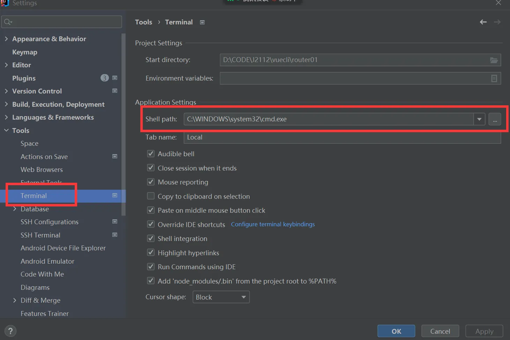

笔记用于记录VUE3.0学习过程，始于2025.4.21

+++

# 学习网址

```tex
官网： https://cn.vuejs.org/
菜鸟：https://www.runoob.com/vue3/vue3-tutorial.html
```

# VUE3.0准备工作

## 安装 node.js

```tex
下载地址:https://nodejs.org/en/download/prebuilt-installer

测试安装环境
C:\Users\admin>node --version
v16.15.0
```

## 创建项目

cmd 运行

```
# 两种方式
npm create vue@latest  推荐
npm init vite@latest
```


- 安装依赖并启动服务器

  ```
  cd vue3.0    进入项目目录
  npm install  安装依赖
  npm run dev  启动服务器
  ```

- 推荐IDE和工具

  推荐的 IDE 配置是 [Visual Studio Code](https://code.visualstudio.com/) + [Vue - Official 扩展](https://marketplace.visualstudio.com/items?itemName=Vue.volar)


## 目录结构


参考资料：

```
public/assets目录区别:https://blog.csdn.net/m0_69497411/article/details/138285400
```

src文件夹说明：

```
src文件夹是项目的核心，包含源代码和主要配置文件。
components文件夹用于存放可复用的Vue组件。
assets文件夹存放静态资源，如图片和样式文件。
router文件夹用于配置路由，定义页面导航。
store文件夹用于状态管理，集中管理应用状态。
plugins文件夹存放Vue插件，扩展应用功能。
views文件夹存放视图组件，与路由直接关联。
utils文件夹存放工具函数和辅助方法，提供通用功能。
```

## 项目打包

```
npm run build
```


## nginx 部署

### 下载 nginx

下载地址：https://nginx.org/en/download.html

### 使用：解压缩

### windows服务器简单配置


#### ubuntu命令


### ubuntu配置

/etc/nginx/sites-available,添加文件

```
# vim /etc/nginx/sites-available/JiYuanWeb
# upstream JiYuanWeb { server 0.0.0.0:5002; }
server {
        listen 5001;
        server_name localhost;
        # root /home/wt/JiYuan_Web;
        location /static { alias /home/wt/JiYuan_Web/static; }
        location / {
        	include uwsgi_params;
    		uwsgi_pass 127.0.0.1:5002;           
        }
}

# 创建符号链接，将配置文件链接到Nginx的sites-enabled目录中
# sudo ln -s /etc/nginx/sites-available/JiYuanWeb /etc/nginx/sites-enabled/
```

访问静态资源 无权限

```
# user www-data;
user root;
```

错误日志

```
/var/log/nginx/error.log
```

## VS Code

### vscode 新建vue模板

vue.code-snippets

```
"Print to console":{
    "prefix":"vue",
    "body": [
        "<template>\n",
        "</template>\n",
        "<script setup lang=\"ts\">\n",
        "</script>\n",
        "<style scoped>\n",
        "</style>",
        ],
    "description":"Log output to console"
}
```

## idea中配置

### idea中不能使用npm命令的解决办法

File-> Settings -> Tools -> Terminal -> Shell path中内容由cmd.exe修改为C:\Windows\System32\cmd.exe全路径



### idea中配置vue启动


### idea中vue.js插件


## vue修改端口

vite.config.ts

```javascript
import { defineConfig } from 'vite'
import vue from '@vitejs/plugin-vue'

// https://vitejs.dev/config/
export default defineConfig({
  plugins: [vue()],
  server:{
    host:'0.0.0.0',
    port:8088,
    open:true //启动后打开浏览器
  }
})
```

## typescript忽略类型检查

### 单行忽略

(添加到特定行的行前来忽略这一行的错误)

```
// @ts-ignore
```

### 跳过对某些文件的检查

 (添加到该文件的首行才起作用)

```
// @ts-nocheck
```

### 对某些文件的检查

```
// @ts-check
```

## 配置"@"路径别名

https://cn.vitejs.dev/config/

## 安装依赖

```
npm i @types/node
```

## 修改vite.config.js

```javascript
import { defineConfig } from 'vite'
import { resolve } from 'path'

export default defineConfig {
    // ...
    resolve: {
        alias: {
            "@": resolve(__dirname, 'src'), // 路径别名
        },
        extensions: ['.js', '.json', '.ts'] // 使用路径别名时想要省略的后缀名，可以自己 增减
    }
    // ...
}
```

```javascript
// @ts-nocheck
import { defineConfig } from 'vite'
import vue from '@vitejs/plugin-vue'
import { resolve } from 'path'

// https://vitejs.dev/config/
export default defineConfig({
  plugins: [
    vue({
      reactivityTransform: true
    })
  ],
  resolve: {
    alias: {
      "@": resolve(__dirname, 'src'), // 路径别名
    },
    extensions: ['.js', '.json', '.ts'] // 使用路径别名时想要省略的后缀名，可以自己 增减
  }

})
```

## 修改tsconfig.json

```javascript
{
    "compilerOptions" : {
        // ...
        "baseUrl": ".", // 用于设置解析非相对模块名称的基本目录，相对模块不会受到baseUrl的影响
        "paths": { // 用于设置模块名到基于baseUrl的路径映射
            "@/*": ["src/*"]
        }
        // ...
    }
}

```

## vite忽略扩展名

```javascript
// vite.config.js
import { defineConfig } from 'vite'
export default defineConfig({
    // ...其他配置项
    resolve: {
      // 忽略后缀名的配置选项, 添加 .vue 选项时要记得原本默认忽略的选项也要手动写入
      extensions: ['.mjs', '.js', '.ts', '.jsx', '.tsx', '.json', '.vue']
    }
  })
```

