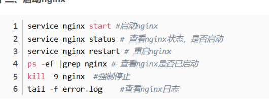

笔记用于记录VUE3.0学习过程，始于2025.4.21

+++

# 学习网址

```tex
官网： https://cn.vuejs.org/
菜鸟：https://www.runoob.com/vue3/vue3-tutorial.html
```

# 一、 VUE3.0准备工作

## 安装 node.js

```tex
下载地址:https://nodejs.org/en/download/prebuilt-installer

测试安装环境
C:\Users\admin>node --version
v16.15.0
```

## 创建项目

cmd 运行

```
# 两种方式
npm create vue@latest  推荐
npm init vite@latest
```


- 安装依赖并启动服务器

  ```
  cd vue3.0    进入项目目录
  npm install  安装依赖
  npm run dev  启动服务器
  ```

- 推荐IDE和工具

  推荐的 IDE 配置是 [Visual Studio Code](https://code.visualstudio.com/) + [Vue - Official 扩展](https://marketplace.visualstudio.com/items?itemName=Vue.volar)


## 目录结构


参考资料：

```
public/assets目录区别:https://blog.csdn.net/m0_69497411/article/details/138285400
```

src文件夹说明：

```
src文件夹是项目的核心，包含源代码和主要配置文件。
components文件夹用于存放可复用的Vue组件。
assets文件夹存放静态资源，如图片和样式文件。
router文件夹用于配置路由，定义页面导航。
store文件夹用于状态管理，集中管理应用状态。
plugins文件夹存放Vue插件，扩展应用功能。
views文件夹存放视图组件，与路由直接关联。
utils文件夹存放工具函数和辅助方法，提供通用功能。
```


### tsconfig.json

负责控制 TypeScript编译器的行为。

> **根选项**
> include：指定被编译文件所在的目录。
> exclude：指定不需要被编译的目录。
> extends：指定要继承的配置文件。
> files：指定被编译的文件。
> references：项目引用，是 TS 3.0 中的一项新功能，它允许将 TS 程序组织成更小的部分。
> 使用小技巧：在填写路径时 ** 表示任意目录， * 表示任意文件。
> compilerOptions：定义项目的运行时期望、JavaScript 的发出方式和位置以及与现有 JavaScript 代码的集成级别。

常用的配置如下：

```json
{
  "compilerOptions": {
    // 目标代码(ts -> js(es5/6/7))
    "target": "esnext",  
    "allowJs": true, // 允许编译javascript文件。
    "allowSyntheticDefaultImports": true,
    "allowUnreachableCode": true, // 不报告执行不到的代码错误。
    "allowUnusedLabels": false,	// 不报告未使用的标签错误
    "alwaysStrict": false, // 以严格模式解析并为每个源文件生成 "use strict"语句
    "baseUrl": ".",  // 文件路径在解析时,基本url,【工作根目录】
    "declaration": true, // 是否自动创建类型声明文件
    "declarationDir": "./lib", // 类型声明文件的输出目录
    "esModuleInterop": true,
    "experimentalDecorators": true, // 启用实验性的ES装饰器
    "noImplicitAny": false, // 是否默认禁用 any
    "removeComments": true, // 是否移除注释
    "target": "esnext",// 编译的目标是什么版本的
      
    // "commonjs" 指定生成哪个模块系统代码
    // export default/module.exports = {}
    // es module 和 commonjs
    // 目标代码需要使用的模块化方案(commonjs require/module.exports/es module import/export)
    "module": "esnext", 
    "moduleResolution": "node",  // 按照node的方式去解析模块 import "/index.node"
    "jsx": "preserve",  // 对jsx进行怎么样的处理，在 .tsx文件里支持JSX
    "importHelpers": true,  // 辅助的导入功能
    "strict": true,  // 严格一些严格的检查(any)
      
    // 跳过一些库的类型检测 (axios -> 类型/ lodash -> @types/lodash / 其他的第三方)
    // import { Person } from 'axios'
    "skipLibCheck": true,
    "suppressImplicitAnyIndexErrors": true,
    "sourceMap": true,  // 是否生成map文件 要不要生成映射文件(ts -> js)
    

    // 指定具体要解析使用的类型
    "types": ["webpack-env"],
    // 指定模块的路径，和baseUrl有关联，和webpack中resolve.alias配置一样
    "paths": {
      "@/*": ["src/*"],
      "@assets/*": ["src/assets/*"],
      "@components/*": ["src/components/*"],
      "@views/*": ["src/views/*"],
      "@store/*": ["src/stores/*"],
    },
    // 编译过程中需要引入的库文件的列表
    "lib": ["esnext", "dom", "dom.iterable", "scripthost"]
  },
    
  // 指定一个匹配列表（属于自动指定该路径下的所有ts相关文件）
  "include": [
    "src/**/*.ts",
    "src/**/*.tsx",
    "src/**/*.vue",
    "tests/**/*.ts",
    "tests/**/*.tsx"
  ],
   // 指定不需要被编译的目录
  "exclude": ["node_modules"]
}
```

### vite.config.js(ts)

官网：https://vitejs.dev/config/

```javascript
import { fileURLToPath, URL } from 'node:url'

// 使用 defineConfig 帮手函数，这样不用 jsdoc 注解也可以获取类型提示
import { defineConfig } from 'vite'
import vue from '@vitejs/plugin-vue'
import vueJsx from '@vitejs/plugin-vue-jsx'

// 此处引用了path路径导向
import path from "path"


export default defineConfig({
  // 查看 插件 API 获取 Vite 插件的更多细节 https://www.vitejs.net/guide/api-plugin.html
  plugins: [vue(), vueJsx()],
  // 在生产中服务时的基本路径
  base: './',
    
  // 配置别名绝对路径  https://webpack.js.org/configuration/resolve/
  resolve: {
    // resolve.alias: 更轻松地为import或require某些模块创建别名
    alias: {
      // '@': fileURLToPath(new URL('./src', import.meta.url)),
      // 如果报错__dirname找不到，需要安装node,执行npm install @types/node --save-dev
      "@": path.resolve(__dirname, "./src"),
      "@assets": path.resolve(__dirname, "./src/assets"),
      "@components": path.resolve(__dirname, "./src/components"),
      "@views": path.resolve(__dirname, "./src/views"),
      "@store": path.resolve(__dirname, "./src/stores"),
    },
    // 忽略后缀名的配置选项, 添加 .vue 选项时要记得原本默认忽略的选项也要手动写入
    extensions: ['.js', '.json', '.ts', '.vue'] 
  },
    
  
  // 打包相关配置 
  // 参考资料：https://zhuanlan.zhihu.com/p/690208925
  build: {
    outDir: "dist",  // 与根相关的目录，构建输出将放在其中，如果目录存在，它将在构建之前被删除  @default 'dist'
    rollupOptions: {  
      // 单页面
      input: './src/main.ts'  // 告诉Vite使用这个文件作为构建的入口
      // 多页面配置  
      // input: {
        // main: './src/main.ts',
        // another: './src/another_entry.ts'
      // }
    }  
  },
  
  // 服务器配置  
  server: {
    https: false, // 是否开启 https
    open: true, // 是否自动在浏览器中打开
    port: 8001, // 端口号
    host: "0.0.0.0",
    // 跨域代理
    proxy: {
       // 设置值：https://news.baidu.com/
       //使用值：/api/widget?ajax=json&id=ad
       // 最终值：http://localhost:5173/api/widget?ajax=json&id=ad  
       // 实际访问： https://news.baidu.com/widget?ajax=json&id=ad
      '/api': {
        target: "http://localhost:3000",  // 后台接口
        changeOrigin: true,
        // secure: false, // 如果是https接口，需要配置这个参数
        // ws: true, //websocket支持
        // 截取api，并用api代替
        // rewrite: (path) => path.replace(/^\/api/, "/api"),
      }
    }
  },

  // 引入第三方的配置
  optimizeDeps: {
    include: [],
  }
})
```


## 项目打包

```
npm run build
```


## nginx 部署

### 下载 nginx

下载地址：https://nginx.org/en/download.html

### 使用：解压缩

### windows服务器简单配置


#### ubuntu命令



### ubuntu配置

/etc/nginx/sites-available,添加文件

```
# vim /etc/nginx/sites-available/JiYuanWeb
# upstream JiYuanWeb { server 0.0.0.0:5002; }
server {
        listen 5001;
        server_name localhost;
        # root /home/wt/JiYuan_Web;
        location /static { alias /home/wt/JiYuan_Web/static; }
        location / {
        	include uwsgi_params;
    		uwsgi_pass 127.0.0.1:5002;           
        }
}

# 创建符号链接，将配置文件链接到Nginx的sites-enabled目录中
# sudo ln -s /etc/nginx/sites-available/JiYuanWeb /etc/nginx/sites-enabled/
```

访问静态资源 无权限

```
# user www-data;
user root;
```

错误日志

```
/var/log/nginx/error.log
```

## VS Code

### vscode 新建vue模板

vue.code-snippets

```
{
"Print to console":{
    "prefix":"vue",
    "body": [
        "<template>\n",
        "</template>\n",
        "<script setup lang=\"ts\">\n",
        "</script>\n",
        "<style scoped>\n",
        "</style>",
        ],
    "description":"Log output to console"
}
}
```

## idea中配置

### idea中不能使用npm命令的解决办法

File-> Settings -> Tools -> Terminal -> Shell path中内容由cmd.exe修改为C:\Windows\System32\cmd.exe全路径


### idea中配置vue启动


### idea中vue.js插件


## typescript忽略类型检查

### 单行忽略

(添加到特定行的行前来忽略这一行的错误)

```
// @ts-ignore
```

### 跳过对某些文件的检查

 (添加到该文件的首行才起作用)

```
// @ts-nocheck
```

### 对某些文件的检查

```
// @ts-check
```

## 安装依赖

```
npm i @types/node
```

# 二、基础语法

Vue.js 是一个渐进式 JavaScript 框架，主要用于构建用户界面。

Vue.js 基于组件化和响应式数据的理念，提供了一种简单高效的方式来构建用户界面。

## Vue 单文件组件

Vue 单文件组件（Single File Component，简称 SFC）是 Vue.js 框架的文件格式，它允许开发者将 HTML、JavaScript 和 CSS 代码放在一个文件中，通常以 .vue 为文件后缀。

单文件组件是一种可复用的代码组织形式，它将从属于同一个组件的 HTML、CSS 和 JavaScript 封装在使用 .vue 后缀的文件中。

## 1.创建 Vue 实例

创建一个 Vue 实例并将其挂载到一个 DOM 元素上。

```html
<!DOCTYPE html>
<html lang="en">
<head>
    <script src="https://unpkg.com/vue@3/dist/vue.global.js"></script>
</head>
<body>
    <div id="hello-vue">{{ message }}</div>
    <script>
        const { createApp,ref } = Vue
        // 组合式
        const HelloVueAppSetup = {
            setup() {
                const message = ref('Hello vue!')
                return {message}
             }
        }
    // 创建应用实例
    const app = createApp(HelloVueAppSetup)
    // 挂载应用
    app.mount('#hello-vue')
    </script>
</body>
</html>
```

**HTML 部分说明：**

```tex
<div id="hello-vue">{{ message }}</div>:
    这是一个 <div> 元素，它具有 id 为 hello-vue 。
    在 Vue 应用中，这个 <div> 将会被 Vue 实例管理，并且会在数据发生变化时更新内容。
{{ message }}:
    这是 Vue.js 的模板语法，用于将 Vue 实例中的 message 数据绑定到页面上。
    当 Vue 实例中的 message 数据变化时，页面上的内容也会随之更新。
```

**JavaScript 部分说明：**

Vue 实例定义:

```tex
const HelloVueAppSetup = {
            setup() {
                const message = ref('Hello vue!')
                return {message}
             }
}
```

- `HelloVueAppSetup` 是一个普通的 JavaScript 对象，包含了 Vue 组件。

- `setup`函数来定义响应式数据`message`。
- 使用`ref`来创建响应式数据`message`。
- `setup`函数中返回`message`，这样就可以在模板中被访问和使用。

**执行过程**

- 页面加载时，浏览器解析 HTML 和 JavaScript。
- Vue.js 脚本执行时，创建了一个 Vue 应用实例，并将其绑定到 `<div id="hello-vue">` 元素上。
- Vue 应用实例根据 `setup()` 中的初始数据，将 `message` 的值渲染到页面上的 `{{ message }}` 处。
- 当 `message` 数据发生变化时（例如通过用户交互或异步操作），页面会自动更新以反映这些变化。

## 2. 模板语法

### 插值

使用双大括号 {{ }} 来表示文本插值

```vue
<div>{{ message }}</div>
```

### 指令

指令是带有前缀 `v- `的特殊属性，用于在模板中表达逻辑。

`v-bind`: 动态绑定一个或多个特性，或一个组件 prop。

```vue
<a v-bind:href="url">Link</a>
简写：
<a :href="url">Link</a>
```

`v-if / v-else-if / v-else`: 条件渲染

```vue
<p v-if="visible">内容可见</p>
<p v-else>内容不可见</p>
```

`v-for`: 列表渲染。

```vue
<ul>
  <li v-for="item in items" :key="item.id">{{ item.text }}</li>
</ul>
```

`v-model`: 双向数据绑定。

```vue
<input v-model="message" placeholder="edit me">
<p>Message is: {{ message }}</p>
```

`v-on`: 事件监听器。

```vue
<button v-on:click="doSomething">Click me</button>
简写：
<button @click="doSomething">Click me</button>
```

## 3. 事件处理

使用 v-on 指令来监听 DOM 事件，并在触发时执行一些 JavaScript 代码。

```vue
<div id="app">
  <button @click="greet">Greet</button>
</div>

<script>
 const { createApp } = Vue
 // 组合式
 const HelloVueAppSetup = {
 setup() {
   const greet = () => alert('Hello')
   return { greet }
   }
 }
// 创建应用实例
const app = createApp(HelloVueAppSetup)
// 挂载应用
app.mount('#hello-vue')
</script>
```

## 4. 计算属性

计算属性是基于其依赖进行缓存的属性。计算属性只有在其相关依赖发生变化时才会重新计算。

```vue
<div id="hello-vue">
    <!-- 计算属性 -->
    <p>{{ reversedMessage }}</p>
</div>
<script>
    const { createApp,ref,computed } = Vue
    // 组合式
    const HelloVueAppSetup = {
        setup() {
            const message = ref("Hello")
            const reversedMessage = computed(() => message.value.split('').reverse().join(''))
            return { reversedMessage }
        }
    }
    // 创建应用实例
    const app = createApp(HelloVueAppSetup)
    // 挂载应用
    app.mount('#hello-vue')
</script>
```

## 5. 组件

组件允许你使用小型、独立和通常可复用的组件构建大型应用。

```vue
 <div id="hello-vue">
     <!-- 组件 -->
     <my-component></my-component>
</div>
<script>
    // 创建应用实例
    const app = createApp({})
    // 全局注册一个组件，使其在应用的任何地方都可以使用。
    app.component('my-component', {
        template: '<div>A custom component!</div>'
    })
    // 挂载应用
    app.mount('#hello-vue')
</script>
```

## 6. Props 和事件

### Props

Props 用于在组件之间传递数据。

```vue
 <div id="hello-vue">
     <!-- 组件传参 -->
     <blog-post title="My journey with Vue"></blog-post>
</div>
<script>
    // 创建应用实例
    const app = createApp({})
    // 组件接收参数
    app.component('blog-post', {
    props: ['title'],
    template: '<h3>{{ title }}</h3>'
    })
    // 挂载应用
    app.mount('#hello-vue')
</script>
```

### 事件

子组件通过 emit 触发事件，父组件可以监听这些事件

```vue
<div id="hello-vue">
    <button-counter @increment="incrementTotal"></button-counter>
    <p>Total clicks: {{ total }}</p>
</div>
<script>
    const { createApp,ref,computed } = Vue
    // 组合式
    const HelloVueAppSetup = {
        setup() {
			const total = ref(0)
            const incrementTotal = () => total.value++
            return {
                total,incrementTotal
            }
        }
    }
    // 创建应用实例
    const app = createApp(HelloVueAppSetup)
    app.component('button-counter', {
        template:'<button @click="increment">You clicked me {{ count }} times.</button>',
        props: {
            message: {
            type: String,
            required: true
            }
        },
        setup(props, context) {
            const count = ref(0)
            const increment = () => {
                count.value++
                context.emit('increment')   
            }
            return { count,increment }
        },
    })

    // 挂载应用
    app.mount('#hello-vue')
</script>
```

笔记:

```tex
vue3 setup函数:https://www.cnblogs.com/jocongmin/p/18682607
```

# 三、声明式渲染

声明式渲染（Declarative Rendering）是指通过数据驱动视图的更新，而不是直接操作 DOM。

声明式渲染让开发者可以更专注于业务逻辑，而不需要关心如何更新视图和 DOM。

Vue3 的声明式渲染是一种基于模板的渲染方式，它允许开发者通过简洁的模板语法来描述页面的结构和数据绑定关系，而不需要直接操作 DOM。

Vue3 的声明式渲染通过使用模板、指令（如 v-if、v-for、v-bind 等）以及响应式数据来简化 UI 更新过程。

Vue 的声明式渲染让你只需要声明 UI 应该如何呈现，Vue 会根据数据的变化自动更新视图，当你改变数据时，视图会自动响应。

Vue3 使用模板语法（类似 HTML）来描述 UI，模板中的表达式（如 {{ message }}）会绑定到组件的数据模型。

## 1、数据绑定

数据绑定是声明式渲染的核心。

通过绑定数据，Vue 可以自动更新 DOM 元素的内容，避免了传统的手动 DOM 操作。

### 插值表达式

插值表达式是通过双花括号 {{ }} 来将组件的数据插入到 HTML 模板中。

```vue
<template>
  <div>
    <h1>{{ message }}</h1>
  </div>
</template>

<script setup lang="ts">
    import { ref } from 'vue'
    const message = ref('Hello World')
</script>
```

双花括号 {{ message }} 会渲染为 **Hello World**，并且当 message 的值改变时，视图会自动更新。

在双花括号中的内容并不只限于标识符或路径——我们可以使用任何有效的 JavaScript 表达式。

```vue
<h1>{{ message.split('').reverse().join('') }}</h1>
```

### 属性绑定

通过 v-bind 指令，你可以绑定 HTML 属性到组件的数据，这样可以使得 DOM 元素的属性（如 href、class、src）根据组件的状态动态更新。

```vue
<template>
  <div>
    <a v-bind:href="url">点我</a>
  </div>
</template>

<script setup lang="ts">
    import { ref } from 'vue'
    const url = ref('https://www.baidu.com')
</script>
```

v-bind:href 会将 url 数据绑定到 <a> 标签的 href 属性，当 url 发生变化时，href 会自动更新。

## 2、条件渲染

Vue 通过 v-if、v-else-if 和 v-else 指令实现条件渲染，根据某个数据条件来决定是否渲染某个 DOM 元素。

```vue
<template>
  <div>
    <p v-if="isVisible">这段文本是可见的</p>
    <button @click="toggleVisibility">切换可见性</button>
  </div>
</template>

<script setup lang="ts">
    import { ref } from 'vue'
    const isVisible = ref(true)
    const toggleVisibility = () => isVisible.value = !isVisible.value

</script>
```

当 isVisible 为 true 时，<p> 标签会被渲染，当点击按钮时，isVisible 会反转，<p> 标签的显示与否也会自动改变。

## 3、列表渲染

使用 v-for 指令可以渲染一个列表。

Vue 会根据数组的每一项渲染对应的 DOM 元素，并且在数组数据变化时，自动更新视图。

```vue
<template>
  <div>
    <ul>
      <li v-for="item in items" :key="item.id">{{ item.name }}</li>
    </ul>
  </div>
</template>

<script setup lang="ts">
    import { reactive } from 'vue'
    const items = reactive([
      { id: 1, name: 'Vue 3' },
      { id: 2, name: 'JavaScript' },
      { id: 3, name: 'HTML' }
    ])

</script>
```

v-for 会根据 items 数组渲染出一个列表。每个列表项都有一个 key 来帮助 Vue 跟踪每一项，从而提高渲染效率。

## 4、双向数据绑定

Vue 提供了 v-model 指令来实现表单元素（如 <input>）和组件数据之间的双向绑定，这样，表单元素的值与数据模型保持同步，用户输入时会自动更新数据，数据变化时会自动更新视图。

```vue
<template>
  <div>
    <input v-model="msg" placeholder="输入一些文本" />
    <p>你输入了：{{ msg }}</p>
  </div>
</template>

<script setup lang="ts">
    import { ref } from 'vue'
    const msg = ref('')
</script>
```

v-model 使得 input 元素的值与 msg 数据保持同步。当用户在输入框中输入文本时，msg 会自动更新，<p> 标签中的内容也会自动变化。

## 5、事件处理

Vue 提供了 v-on 指令来监听 DOM 事件并在事件触发时执行方法，这种方式让你能够声明式地处理用户输入、点击等事件。

```vue
<template>
  <div>
    <button v-on:click="increment">点击我</button>
    <p>点击次数：{{ count }}</p>
  </div>
</template>

<script setup lang="ts">
    const count = ref(0)
    const increment = () => count.value++
</script>
```

v-on:click 会监听按钮的点击事件，并在每次点击时调用 increment 方法来增加 count 的值，count 会自动更新到视图中。

## 6、计算属性

计算属性是 Vue 提供的一种声明式计算值的方式。

计算属性基于响应式数据，且只有在依赖的数据发生变化时才会重新计算。

```vue
<template>
  <div>
    <p>
      <a>原始金额：</a>
      <input v-model="amount" placeholder="输入一些数字" />
    </p>
    <p>税后金额：{{ computedAmount }}</p>
  </div>
</template>

<script setup lang="ts">
    const amount = ref<number>(100)
    // 假设税率为10%, 程序尽量避免小数运算 
    const computedAmount = computed(() => amount.value * 1.1 
</script>
```

computedAmount 是一个计算属性，基于 amount 计算出税后金额。当 amount 改变时，computedAmount 会自动更新，而不需要手动触发视图更新。

# 四、 指令

Vue 指令（Directives）是 Vue.js 的一项核心功能，它们可以在 HTML 模板中以 v- 开头的特殊属性形式使用，用于将响应式数据绑定到 DOM 元素上或在 DOM 元素上进行一些操作。

Vue 指令是带有前缀 v- 的特殊 HTML 属性，它赋予 HTML 标签额外的功能。

与传统的 JavaScript 方法相比，使用 Vue 创建响应式页面要容易得多，并且需要的代码更少。

以下是几个常用的 Vue 指令：

| 指令      | 描述                                                         |
| --------- | ------------------------------------------------------------ |
| `v-bind`  | 用于将 Vue 实例的数据绑定到 HTML 元素的属性上。              |
| `v-if`    | 用于根据表达式的值来条件性地渲染元素或组件。                 |
| `v-show`  | v-show 是 Vue.js 提供的一种指令，用于根据表达式的值来条件性地显示或隐藏元素。 |
| `v-for`   | 用于根据数组或对象的属性值来循环渲染元素或组件。             |
| `v-on`    | 用于在 HTML 元素上绑定事件监听器，使其能够触发 Vue 实例中的方法或函数。 |
| `v-model` | 用于在表单控件和 Vue 实例的数据之间创建双向数据绑定。        |
| `v-once`  | 使用 **v-once** 指令执行一次性地插值，当数据改变时，插值处的内容不会更新 |

除了这些常用的指令，Vue 还提供了一些其他的指令，如 v-text、v-html 等，以及自定义指令，让开发者能够更加灵活地操作 DOM 元素。

## v-bind

使用 v-bind 指令将 Vue 实例的数据绑定到 HTML 元素的属性上：

```vue
<template>
  <div>
    <a v-bind:href="url">点我</a>
  </div>
</template>

<script setup lang="ts">
    import { ref } from 'vue'
    const url = ref('https://www.baidu.com')
</script>
```

## v-if

使用 v-if 和 v-else 指令根据表达式的值来条件性地渲染元素或组件：

```vue
<template>
  <div>
    <p v-if="isVisible">这段文本是可见的</p>
    <p v-else>Goodbye Vue!</p>
    <button @click="toggleVisibility">切换可见性</button>
  </div>
</template>

<script setup lang="ts">
    import { ref } from 'vue'
    const isVisible = ref(true)
    const toggleVisibility = () => isVisible.value = !isVisible.value

</script>
```

## v-show

和v-if区别：

- v-if：控制元素不显示，并且标签也不存在

- v-show是控制元素：display: none;(根据条件显示和隐藏（标签都会渲染到页面）)

```vue
<template>
  <div>
    <p v-show="isVisible">这段文本是可见的</p>
    <button @click="toggleVisibility">显示/隐藏</button>
  </div>
</template>

<script setup lang="ts">
    import { ref } from 'vue'
    const isVisible = ref(true)
    const toggleVisibility = () => isVisible.value = !isVisible.value
</script>
```

## v-for

使用 v-for 指令根据数组的属性值循环渲染元素或组件

```vue
<template>
  <div>
    <ul>
      <li v-for="item in items" :key="item.id">{{ item.name }}</li>
    </ul>
  </div>
</template>

<script setup lang="ts">
    import { reactive } from 'vue'
    const items = reactive([
      { id: 1, name: 'Vue 3' },
      { id: 2, name: 'JavaScript' },
      { id: 3, name: 'HTML' }
    ])

</script>
```

## v-on

使用 v-on 指令在 HTML 元素上绑定事件监听器

```vue
<template>
  <div>
    <button v-on:click="increment">点击我</button>
    <p>点击次数：{{ count }}</p>
  </div>
</template>

<script setup lang="ts">
    const count = ref(0)
    const increment = () => count.value++
</script>
```

## v-model

使用 v-model 指令实现表单数据双向绑定

```vue
<template>
  <div>
    <input v-model="msg" placeholder="输入一些文本" />
    <p>你输入了：{{ msg }}</p>
  </div>
</template>

<script setup lang="ts">
    import { ref } from 'vue'
    const msg = ref('')
</script>
```

## v-once

```vue
<span v-once>这个将不会改变: {{ message }}</span>
```


# 五、模板语法

Vue 使用了基于 HTML 的模板语法，允许开发者声明式地将 DOM 绑定至底层 Vue 实例的数据。

Vue 的核心是一个允许你采用简洁的模板语法来声明式的将数据渲染进 DOM 的系统。

结合响应系统，在应用状态改变时， Vue 能够智能地计算出重新渲染组件的最小代价并应用到 DOM 操作上。

```vue
<template>
  <div>
    <!-- 插值 -->
    <p>{{ message }}</p>
    
    <!-- v-bind -->
    <a :href="url">Link</a>
    
    <!-- v-on -->
    <button @click="handleClick">Click me</button>
    
    <!-- v-for -->
    <ul>
      <li v-for="item in items" :key="item.id">{{ item.name }}</li>
    </ul>
  </div>
</template>
```

## 插值

### 文本

数据绑定最常见的形式就是使用 {{...}}（双大括号）的文本插值：

```vue
<div id="app">
  <p>{{ message }}</p>
</div>
```

{{...}} 标签的内容将会被替代为对应组件实例中 **message** 属性的值，如果 **message** 属性的值发生了改变，{{...}} 标签内容也会更新。

如果不想改变标签的内容，可以通过使用 **v-once** 指令执行一次性地插值，当数据改变时，插值处的内容不会更新。

```vue
<span v-once>这个将不会改变: {{ message }}</span>
```

### Html

使用 v-html 指令用于输出 html 代码：

```vue
<template>
  <div>
    <p>使用双大括号的文本插值: {{ rawHtml }}</p>
    <p>使用 v-html 指令: <span v-html="rawHtml"></span></p>
  </div>
</template>

<script setup lang="ts">
    import { ref } from 'vue'
    const rawHtml = ref('<span style="color:red">This should be red.</span>')
</script>
```

### 属性

 HTML 属性中的值应使用 v-bind 指令。

```
<div v-bind:id="dynamicId"></div>
```

对于布尔属性，常规值为 true 或 false，如果属性值为 null 或 undefined，则该属性不会显示出来。

```
<button v-bind:disabled="isButtonDisabled">按钮</button>
```

以上代码中如果 isButtonDisabled 的值是 null 或 undefined，则 disabled 属性甚至不会被包含在渲染出来的 <button> 元素中。

以下实例判断 use 的值，如果为 true 使用 class1 类的样式，否则不使用该类：

```vue
<template>
  <div>
    <label>修改颜色</label>
    <input type="checkbox" v-model="use">
    <br><br>
    <div v-bind:class="{ 'class1': use }">
      v-bind:class 指令
    </div>
  </div>
</template>

<script setup lang="ts">
    import { ref } from 'vue'
    const use = ref(false)
</script>
```

### 表达式

Vue.js 都提供了完全的 JavaScript 表达式支持。

```vue
<template>
  <div>
    {{ 5 + 5 }}<br>
    {{ ok ? 'YES' : 'NO' }}<br>
    {{ message2.split('').reverse().join('') }}
    <div v-bind:id="'list-' + id">菜鸟教程</div>
  </div>
</template>

<script setup lang="ts">
    import { ref } from 'vue'
    const ok = ref(true)
    const message2 = ref('RUNOOB!!')
    const id = ref(1)
</script>
```

表达式会在当前活动实例的数据作用域下作为 JavaScript 被解析。有个限制就是，每个绑定都只能包含单个表达式，所以下面的例子都不会生效:

```
<!--  这是语句，不是表达式：-->
{{ var a = 1 }}

<!-- 流控制也不会生效，请使用三元表达式 -->
{{ if (ok) { return message } }}
```

## 指令

指令是带有 v- 前缀的特殊属性。

指令用于在表达式的值改变时，将某些行为应用到 DOM 上。如下例子：

```vue
<template>
  <div>
    <p v-if="isVisible">这段文本是可见的</p>
    <p v-else>Goodbye Vue!</p>
    <button @click="toggleVisibility">切换可见性</button>
  </div>
</template>

<script setup lang="ts">
    import { ref } from 'vue'
    const isVisible = ref(true)
    const toggleVisibility = () => isVisible.value = !isVisible.value

</script>
```

这里， v-if 指令将根据表达式 isVisible 的值( true 或 false )来决定是否插入 p 元素。

另外还有其它很多指令，每个都有特殊的功能。例如，v-for 指令可以绑定数组的数据来渲染一个项目列表：

```vue
<template>
  <div>
    <ul>
      <li v-for="item in items" :key="item.id">{{ item.name }}</li>
    </ul>
  </div>
</template>

<script setup lang="ts">
    import { reactive } from 'vue'
    const items = reactive([
      { id: 1, name: 'Vue 3' },
      { id: 2, name: 'JavaScript' },
      { id: 3, name: 'HTML' }
    ])

</script>
```

### 参数

参数在指令后以冒号指明。例如， v-bind 指令被用来响应地更新 HTML 属性：

```vue
<template>
  <div>
    <a v-bind:href="url">点我</a>
  </div>
</template>

<script setup lang="ts">
    import { ref } from 'vue'
    const url = ref('https://www.baidu.com')
</script>
```

在这里 href 是参数，告知 v-bind 指令将该元素的 href 属性与表达式 url 的值绑定。

另一个例子是 v-on 指令，它用于监听 DOM 事件：

```vue
<!-- 完整语法 -->
<a v-on:click="doSomething"> ... </a>

<!-- 缩写 -->
<a @click="doSomething"> ... </a>

<!-- 动态参数的缩写 (2.6.0+) -->
<a @[event]="doSomething"> ... </a>
```

在这里参数是监听的事件名。

### 修饰符

修饰符是以半角句号 . 指明的特殊后缀，用于指出一个指令应该以特殊方式绑定。例如，**.prevent** 修饰符告诉 v-on 指令对于触发的事件调用 **event.preventDefault()**：

```vue
<form v-on:submit.prevent="onSubmit"></form>
```

## 用户输入

在 input 输入框中我们可以使用 v-model 指令来实现双向数据绑定：

```vue
<template>
  <div>
    <input v-model="msg" placeholder="输入一些文本" />
    <p>你输入了：{{ msg }}</p>
  </div>
</template>

<script setup lang="ts">
    import { ref } from 'vue'
    const msg = ref('')
</script>
```

v-model 指令用来在 input、select、textarea、checkbox、radio 等表单控件元素上创建双向数据绑定，根据表单上的值，自动更新绑定的元素的值。

按钮的事件我们可以使用  v-on 监听事件，并对用户的输入进行响应。

以下实例在用户点击按钮后对字符串进行反转操作：

```vue
<template>
  <div>
    <p>{{ message }}</p>
    <button v-on:click="reverseMessage">反转字符串</button>
  </div>
</template>

<script setup lang="ts">
import { ref } from 'vue'
const message = ref('Runoob')
const reverseMessage = () => { message.value = message.value.split('').reverse().join('') }
</script>
```

## 缩写

### v-bind 缩写

Vue.js 为两个最为常用的指令提供了特别的缩写：

```
<!-- 完整语法 -->
<a v-bind:href="url"></a>
<!-- 缩写 -->
<a :href="url"></a>
```

### v-on 缩写

```
<!-- 完整语法 -->
<a v-on:click="doSomething"></a>
<!-- 缩写 -->
<a @click="doSomething"></a>
```

# 六、条件语句

在 Vue 3 中，你可以在模板中使用多种条件语句来控制组件的渲染。

主要的条件语句有 `v-if`、`v-else-if`、`v-else` 和 `v-show`，以下是它们的用法及区别：

- **`v-if`**：元素在条件为 `false` 时不会被渲染到 DOM 中，适用于条件变化不频繁的情况。
- **`v-show`**：元素总是渲染到 DOM 中，适用于条件变化频繁的情况，切换显示隐藏性能更好。
- **`v-else-if` 和 `v-else`**：用于处理多个条件分支，配合 `v-if` 使用。

## 条件判断

### v-if

根据表达式的真假条件性地渲染元素。如果表达式为真，则渲染该元素；如果为假，则不渲染（不会在 DOM 中生成该元素）。

条件判断使用 v-if 指令，指令的表达式返回 true 时才会显示：

**在元素中使用 v-if 指令：**

```vue
<template>
  <div>
    <p v-if="seen">现在你看到我了</p>
  </div>
</template>

<script setup lang="ts">
import { ref } from 'vue'
const seen = ref(true)  /* 改为false，信息就无法显示 */
</script>
```

这里， v-if 指令将根据表达式 seen 的值( true 或 false )来决定是否插入 p 元素。

因为 v-if 是一个指令，所以必须将它添加到一个元素上。如果是多个元素，可以包裹在 <template> 元素上，并在上面使用 v-if。最终的渲染结果将不包含 <template> 元素。

**在 <template> 元素上使用 v-if 指令**

```vue
<template>
  <div>
    <template v-if="seen">
      <h1>网站</h1>
      <p>Google</p>
      <p>Runoob</p>
      <p>Taobao</p>
    </template>
  </div>
</template>

<script setup lang="ts">
import { ref } from 'vue'
const seen = ref(true)  /* 改为false，信息就无法显示 */
</script>
```

### v-else

与 v-if 搭配使用，表示在前一个 v-if 表达式为假时渲染的元素。

可以用 v-else 指令给 v-if 添加一个 "else" 块：

**随机生成一个数字，判断是否大于 0.5，然后输出对应信息：**

```vue
<template>
  <div>
   <div v-if="Math.random() > 0.5">
      随机数大于 0.5
   </div>
   <div v-else>
      随机数小于等于 0.5
   </div>
  </div>
</template>
```

### v-else-if

在 v-if 和 v-else 之间添加额外的条件判断，可以连续使用多个 v-else-if。

**判断 type 变量的值：**

```VUE
<template>
  <div>
    <div v-if="type === 'A'">
      A
    </div>
    <div v-else-if="type === 'B'">
      B
    </div>
    <div v-else-if="type === 'C'">
      C
    </div>
    <div v-else>
      Not A/B/C
    </div>
  </div>
</template>

<script setup lang="ts">
import { ref } from 'vue'
const type = ref('A')
</script>
```

> v-else 、v-else-if 必须跟在 v-if 或者 v-else-if之后。

### v-show

根据表达式的真假条件性地显示或隐藏元素，与 v-if 不同的是，v-show 始终会在 DOM 中保留元素，只是通过 CSS 的 display 属性控制元素的显示和隐藏。

我们也可以使用 v-show 指令来根据条件展示元素：

```VUE
<h1 v-show="ok">Hello!</h1>
```

如果需要频繁切换元素的显示与隐藏，推荐使用 v-show，因为它只是简单地切换 CSS 样式，而不是重新渲染整个元素。

# 七、循环语句

在 Vue 中，循环语句主要通过 v-for 指令来实现，用于遍历数组或对象，生成对应数量的元素。

在元素上使用 v-for 指令，根据源数据的数组或对象进行循环渲染元素。

遍历数组：

```
v-for="(item, index) in items"
```

遍历对象：

```
v-for="(value, key, index) in object"
```

- **key 的作用**: 使用 `v-for` 渲染列表时，必须为每个项提供一个唯一的 `key` 属性，以便 Vue 能够识别每个项的唯一性，从而进行高效的 DOM 更新。
- **嵌套循环**: 可以嵌套使用多个 `v-for` 来渲染多维数组或对象结构。

### v-for 迭代数组

v-for 可以通过一个对象的属性来迭代数据：

**v-for 可以绑定数据到数组来渲染一个列表：**

```vue
<template>
  <div>
    <ul>
      <li v-for="item in items" :key="item.id">{{ item.name }}</li>
    </ul>
  </div>
</template>

<script setup lang="ts">
    import { reactive } from 'vue'
    const items = reactive([
      { id: 1, name: 'Vue 3' },
      { id: 2, name: 'JavaScript' },
      { id: 3, name: 'HTML' }
    ])

</script>
```

**v-for 还支持一个可选的第二个参数，参数值为当前项的索引：**

index 为列表项的索引值：

```vue
<template>
  <div>
    <ul>
      <li v-for="(item, index) in items" :key="item.id">{{ index }} - {{ item.name }} </li>
    </ul>
  </div>
</template>

<script setup lang="ts">
    import { reactive } from 'vue'
    const items = reactive([
      { id: 1, name: 'Vue 3' },
      { id: 2, name: 'JavaScript' },
      { id: 3, name: 'HTML' }
    ])

</script>
```

**模板 <template> 中使用 v-for：**

```vue
<ul>
  <template v-for="item in items">
    <li>{{ item.name }}</li>
    <li>--------------</li>
  </template>
</ul>
```

### v-for 迭代对象

v-for 可以通过一个对象的属性来迭代数据：

```vue
<template>
  <div>
    <ul>
      <li v-for="value in object">
        {{ value }}
      </li>
    </ul>
  </div>
</template>

<script setup lang="ts">
    import { reactive } from 'vue'
    const object = reactive({
      name: '菜鸟教程',
      url: 'http://www.runoob.com',
      slogan: '学的不仅是技术，更是梦想！'
    })
</script>
```

**也可以提供第二个的参数为键名：**

```vue
<template>
  <div>
    <ul>
      <li v-for="(value, key) in object">
        {{ key }} : {{ value }}
      </li>
    </ul>
  </div>
</template>
```

**第三个参数为索引：**

```vue
<div>
    <ul>
        <li v-for="(value, key, index) in object">
            {{ index }}. {{ key }} : {{ value }}
        </li>
    </ul>
</div>
```

### v-for 迭代整数

v-for 也可以循环整数

```vue
<template>
  <div>
    <ul>
      <li v-for="n in 10">
        {{ n }}
      </li>
    </ul>
  </div>
</template>
```

### 显示过滤/排序后的结果

我们可以对数组的元素进行处理后再显示出来，一般可以通过创建一个计算属性，来返回过滤或排序后的数组。

**输出数组中的偶数：**

```vue
<template>
  <div>
    <ul>
      <li v-for="n in evenNumbers">{{ n }}</li>
    </ul>
  </div>
</template>

<script setup lang="ts">
import { reactive, computed } from 'vue'
const numbers = reactive([1, 2, 3, 4, 5])
// .filter 根据指定的条件筛选出满足条件的元素,并返回一个新的数组
const evenNumbers = computed(() => numbers.filter(number => number % 2 === 0))
</script>
```

### v-for/v-if 联合使用

联合使用 v-for/v-if 给 select 设置默认值：

```vue
<template>
  <div>
    <select @change="changeVal($event)" v-model="selOption">
      <template v-for="(site, index) in sites" :site="site" :index="index" :key="site.id">
        <!-- 索引为 1 的设为默认值，索引值从0 开始-->
        <option v-if="index == 1" :value="site.name" selected>{{ site.name }}</option>
        <option v-else :value="site.name">{{ site.name }}</option>
      </template>
    </select>
    <div v-once>您选中了:{{ selOption }}</div>
  </div>
</template>

<script setup lang="ts">
import { ref, reactive, computed } from 'vue'
let selOption = ref("Runoob")
const sites = reactive([
  { id: 1, name: "Google" },
  { id: 2, name: "Runoob" },
  { id: 3, name: "Taobao" },
])
const changeVal = (event: any) => {
  selOption.value = event.target.value
  alert("你选中了" + selOption.value)
}
</script>
```

使用 `selected` 属性设置默认选中的选项。

### 在组件上使用 v-for

在自定义组件上，你可以像在任何普通元素上一样使用 v-for：

```vue
<my-component v-for="item in items" :key="item.id"></my-component>
```

然而，任何数据都不会被自动传递到组件里，因为组件有自己独立的作用域。为了把迭代数据传递到组件里，我们要使用 props：

```vue
<my-component
  v-for="(item, index) in items"
  :item="item"
  :index="index"
  :key="item.id"
></my-component>
```

不自动将 item 注入到组件里的原因是，这会使得组件与 v-for 的运作紧密耦合。明确组件数据的来源能够使组件在其他场合重复使用。

下面是一个简单的 todo 列表的完整例子：

**父组件**

```vue
<template>
  <div id="todo-list-example">
    <form v-on:submit.prevent="addNewTodo">
      <label for="new-todo">添加 todo</label>
      <input v-model="newTodoText" id="new-todo" placeholder="例如：明天早上跑步" />
      <button>添加</button>
    </form>
    <ul>
      <todo-item v-for="(todo, index) in todos" :key="todo.id" :title="todo.title"
        @remove="todos.splice(index, 1)"></todo-item>
    </ul>
  </div>
</template>

<script setup lang="ts">
import { ref, reactive } from 'vue'
import todoItem from './todoItem.vue'

const newTodoText = ref('')
const todos = reactive([
  { id: 1,  title: '看电影'  },
  { id: 2,  title: '吃饭'  },
  { id: 3,  title: '上 RUNOOB 学习'  }
])
const nextTodoId = ref<number>(4)
const addNewTodo = () => {
  todos.push({
    'id': nextTodoId.value++,
    'title': newTodoText.value
  })
  newTodoText.value = ''
}
</script>
```

**子组件**

```vue
<template>
  <li>
    {{ props.title }}
    <button @click="$emit('remove')">删除</button>
  </li>
</template>

<script setup lang="ts">
import { defineEmits, defineProps } from "vue"
// 外部传入的哪些是 props
const props = defineProps(['title'])
// 父组件中可以使用 kebab-case 形式来监听
const emit = defineEmits(['remove'])
</script>
```

# 八、组件

每个 Vue 组件都是一个独立的 Vue 实例，具有自己的模板、数据、方法和生命周期钩子，使得组件可以自包含地定义和管理自己的功能和样式。

组件（Component）是 Vue.js 最强大的功能之一。

组件可以扩展 HTML 元素，封装可重用的代码，可以帮助你将用户界面拆分成独立和可复用的部分。

每个 Vue 组件都是一个独立的 Vue 实例，具有自己的模板、数据、方法和生命周期钩子，使得组件可以自包含地定义和管理自己的功能和样式。

**组件的特性和优势**

- **复用性**: 组件可以在不同的地方多次使用，提高代码的复用性和可维护性。
- **封装性**: 每个组件都是独立的作用域，可以封装自己的状态和逻辑，避免全局污染。
- **组合性**: 可以通过组合多个小组件构建复杂的界面。
- **响应式**: 组件的数据响应式地绑定到视图，数据更新时自动更新视图。
- **模块化**: 支持模块化开发，可以使用现代前端工具链进行构建和管理。

组件系统让我们可以用独立可复用的小组件来构建大型应用，几乎任意类型的应用的界面都可以抽象为一个组件树：


每个 Vue 应用都是通过用 createApp 函数创建的，传递给 createApp 的选项用于配置根组件。当我们挂载应用时，该组件被用作渲染的起点。

一个应用需要被挂载到一个 DOM 元素中。

我们将 Vue 应用挂载到 <div id="app"></div>，应该传入 #app：

```ts
import { createApp } from 'vue'
import App from './App.vue'

const app = createApp(App)

app.mount('#app')
```

### 注册全局组件

注册一个全局组件语法格式如下：

```ts
import { createApp } from 'vue'
import App from './App.vue'
import myComponentName from './components/myComponentName.vue'

const app = createApp(App)
app.component('my-component-name', myComponentName)

app.mount('#app')
```

**my-component-name** 为组件名，myComponentName 为组件部分。注册后，我们可以使用以下方式来调用组件：

```
<my-component-name></my-component-name>
```

注册一个简单的全局组件 myComponentName，并使用它：

**main.ts**

```ts
import { createApp } from 'vue'
import App from './App.vue'
import myComponentName from './components/myComponentName.vue'

const app = createApp(App)
app.component('my-component-name', myComponentName)

app.mount('#app')
```

**myComponentName.vue**

```vue
<template>
  <div>
    <h1>My Component Name</h1>
  </div>
</template>
```

### 组件的复用

你可以将组件进行任意次数的复用：

```vue
<template>
  <div>
    <h1>My Component Name</h1>
    <h2>My Component Name</h2>
    <h3>My Component Name</h3>
  </div>
</template>
```

### 全局组件

我们的组件都只是通过 component 全局注册的。

全局注册的组件可以在随后创建的 app 模板中使用，也包括根实例组件树中的所有子组件的模板中。

**注册**

 Vue 3 中需要明确地单独注册或使用循环来批量注册组件。

```ts
import { createApp } from 'vue'
import App from './App.vue'
import myComponentName from './components/myComponentName.vue'

const app = createApp(App)
app.component('my-component-name', myComponentName)

app.mount('#app')
```

**使用**

```vue
<template>
  <div>
    <h1>My Component Name</h1>
  </div>
</template>
```

### 局部组件

全局注册往往是不够理想的。比如，如果你使用一个像 webpack 这样的构建系统，全局注册所有的组件意味着即便你已经不再使用一个组件了，它仍然会被包含在你最终的构建结果中。这造成了用户下载的 JavaScript 的无谓的增加。

在这些情况下，你可以通过一个普通的 JavaScript 对象来定义组件：

```vue
<template>
  <A />
</template>

<script setup lang="ts">
import A from './components/A.vue'
</script>
```

### Prop

prop 是子组件用来接受父组件传递过来的数据的一个自定义属性。

父组件的数据需要通过 props 把数据传给子组件，子组件需要显式地用 props 选项声明 "prop"：

**父组件**

```vue
<template>
  <div>
    <site-name title="Google" bb="t"></site-name>
    <site-name title="Runoob" bb="y"></site-name>
    <site-name title="Taobao" bb="u"></site-name>
  </div>
</template>

<script setup lang="ts">
import siteName from './siteName.vue'

</script>
```

**子组件**

siteName.vue

```vue
<template>
  <h4>{{ props.title }}-{{ props.bb }}</h4>
</template>

<script setup lang="ts">
import { defineProps } from "vue"
// 外部传入的哪些是 props
const props = defineProps(['title', 'bb'])

</script>
```

一个组件默认可以拥有任意数量的 prop，任何值都可以传递给任何 prop。

### 动态 Prop

类似于用 v-bind 绑定 HTML 特性到一个表达式，也可以用 v-bind 动态绑定 props 的值到父组件的数据中。每当父组件的数据变化时，该变化也会传导给子组件：

**父组件**

```vue
<template>
  <div>
    <site-name v-for="site in sites" :title=site.title :id=site.id></site-name>
  </div>
</template>

<script setup lang="ts">
import { reactive } from 'vue'
import siteName from './siteName.vue'

const sites = reactive([
  { id: 1, title: 'Google' },
  { id: 2, title: 'Runoob' },
  { id: 3, title: 'Taobao' }
])

</script>
```

子组件

```vue
<template>
  <h4>{{ props.id }} - {{ props.title }}</h4>
</template>

<script setup lang="ts">
import { defineProps } from "vue"
// 外部传入的哪些是 props
const props = defineProps(['title', 'id'])

</script>
```

### Prop 验证

组件可以为 props 指定验证要求。

为了定制 prop 的验证方式，你可以为 props 中的值提供一个带有验证需求的对象，而不是一个字符串数组。例如：

```vue
<template>
  <h4>{{ props.id }} - {{ props.title }}</h4>
</template>

<script setup lang="ts">
import { defineProps } from "vue"
// 外部传入的哪些是 props
// const props = defineProps(['title', 'id'])
const props = defineProps({
  title: {
    type: String,
    default: '默认值',
    validator: (value: string) => {
      return value.length > 5
    }
  },
  id: {
    type: Number,
    required: true,  // 必填
    default: 1,
    validator: (value: number) => {
      return value > 3
    }
  }
})

</script>
```

当 prop 验证失败的时候，(开发环境构建版本的) Vue 将会产生一个控制台的警告。

type 可以是下面原生构造器：

- `String`
- `Number`
- `Boolean`
- `Array`
- `Object`
- `Date`
- `Function`
- `Symbol`

type 也可以是一个自定义构造器，使用 instanceof 检测。

# 九、 计算属性

计算属性用于根据其他数据的变化动态计算衍生出来的属性值，而且具有缓存机制，只有相关依赖发生变化时才会重新计算。

计算属性关键词: computed。

计算属性在处理一些复杂逻辑时是很有用的。

**反转字符串**

```vue
<template>
  <div>
    {{ message.split('').reverse().join('') }}
  </div>
</template>
<script setup lang="ts">
import { ref } from 'vue'
const message = ref("RUNOOB!!")
</script>
```

**使用computed 函数来定义计算属性**

```vue
<template>
  <div>
    <p>原始字符串: {{ message }}</p>
    <p>计算后反转字符串: {{ reversedMessage }}</p>
  </div>
</template>

<script setup lang="ts">
import { ref, computed } from 'vue'
const message = ref("RUNOOB!!")
const reversedMessage = computed(() => message.value.split('').reverse().join(''))

</script>
```

**说明**

**`computed` 函数**:

- 在 `setup` 函数中使用 `computed` 函数来定义计算属性。
- 通过箭头函数返回计算的值，该函数会自动跟踪其依赖的响应式数据。

**使用计算属性**:

- `reversedMessage` 计算属性衍生自 `message`，每当 `message` 发生变化时，`reversedMessage` 会自动更新。

### computed vs methods

使用 methods 来替代 computed，效果上两个都是一样的，但是 computed 是基于它的依赖缓存，只有相关依赖发生改变时才会重新取值。而使用 methods ，在重新渲染的时候，函数总会重新调用执行。

使用 computed 性能会更好，但是如果你不希望缓存，你可以使用 methods 属性。

### 可写计算属性

计算属性默认是只读的。当你尝试修改一个计算属性时，你会收到一个运行时警告。只在某些特殊场景中你可能才需要用到“可写”的属性，你可以通过同时提供 getter 和 setter 来创建：

```vue
<template>
  <div>
    <p>"fullName"{{ fullName }}</p>
    <p>"firstName"{{ firstName }}</p>
    <p>"lastName"{{ lastName }}</p>
    <input type="text" v-model="lastName" />
    <input type="text" v-model="fullName" />
  </div>
</template>

<script setup>
import { ref, computed } from 'vue'

const firstName = ref('John')
const lastName = ref('Doe')

const fullName = computed({
  // getter previous上一个值
  get(previous) {
    return firstName.value + ' ' + lastName.value
  },
  // setter newValue最新值
  set(newValue) {
    // 注意：我们这里使用的是解构赋值语法
    [firstName.value, lastName.value] = newValue.split(' ')
  }
})
</script>
```

### 避免直接修改计算属性值

计算属性的返回值应该被视为只读的，并且永远不应该被更改——应该更新它所依赖的源状态以触发新的计算

# 十、监听属性

通过监听属性 **watch** 来响应数据的变化。

**watch** 的作用是用于监测响应式属性的变化，并在属性发生改变时执行特定的操作，它是 Vue 中的一种响应式机制，允许你在数据发生变化时做出相应的响应，执行自定义的逻辑。

**watch** 使得在响应式属性变化时能够有更多的控制权和灵活性，让你的组件能够更好地响应数据的变化并执行相应的逻辑。

**通过使用 watch 实现计数器：**

```vue
<template>
  <div>
    <p style="font-size:25px;">计数器: {{ counter }}</p>
    <button @click="counter++" style="font-size:25px;">点我</button>
  </div>
</template>

<script setup>
import { ref, watch } from 'vue'
const counter = ref(1)
watch(counter,
  (newValue,oldValue) => {alert('计数器值的变化 :' + oldValue + ' 变为 ' + newValue + '!')}
)
</script>
```

**千米**与**米**之间的换算：

```vue
<template>
  <div>
    <!-- focus就是input框聚焦时触发，blue就是input框失去焦点时触发。 -->
    千米 : <input type="text" v-model="kilometers" @focus="currentlyActiveField = 'kilometers'">
    米 : <input type="text" v-model="meters" @focus="currentlyActiveField = 'meters'">
  </div>
  <div v-show=kilometers>修改前值为: {{ oldKilometers }}，修改后值为: {{ kilometers }}</div>
</template>

<script setup>
import { ref, watch } from 'vue'

const kilometers = ref(0)
const meters = ref(0)
const currentlyActiveField = ref('')
const oldKilometers = ref(0)

// 监听 kilometers 变化
watch(kilometers, (newValue, oldValue) => {
  if (currentlyActiveField.value === 'kilometers') {
    meters.value = newValue * 1000
  }
  // 这个回调将在 kilometers 改变后调用
  oldKilometers.value = oldValue
})

// 监听 meters 变化
watch(meters, (newValue) => {
  if (currentlyActiveField.value === 'meters') {
    kilometers.value = newValue / 1000
  }
})
</script>
```

**异步加载中使用 watch**

异步数据的加载 Vue 通过 watch 选项提供了一个更通用的方法，来响应数据的变化。

```vue
<template>
  <div>
    <p>
      输入一个问题，以 ? 号结尾输出答案:
      <input v-model="question" />
    </p>
    <p>{{ answer }}</p>
  </div>
</template>

<script setup lang="ts">
import { ref, watch } from 'vue'
import axios from "axios"
const question = ref('')
const answer = ref('每个问题结尾需要输入 ? 号。')

const getAnswer = async () => {
  answer.value = '加载中...'
  axios
    .get('/api/try/ajax/json_vuetest.php')
    .then((response) => {
      answer.value = response.data.answer
    })
    .catch((error) => {
      answer.value = '错误! 无法访问 API。 ' + error
    })
}

watch(question,
  async (newQuestion, oldQuestion) => {
    if (newQuestion.indexOf('?') > -1 || newQuestion.indexOf('？') > -1) {
      await getAnswer()
    }
  })
</script>
```

## 用法总结

watch 是 Vue 3 提供的一种响应式数据监听机制，可以监听单个或多个属性。

你可以通过传递回调函数来处理数据变化，支持深度监听、立即执行等选项。

### 1. 基本用法

在 Vue 3 中，watch 函数用于监听响应式属性。

当监听的属性值发生变化时，Vue 会触发回调函数执行。

```vue
<template>
  <div>
    <p style="font-size:25px;">计数器: {{ state.count }}</p>
    <button @click="state.count++" style="font-size:25px;">点我</button>
  </div>
</template>
<script setup>
import { reactive, watch } from 'vue'
const state = reactive({ count: 0 })

watch(
  () => state.count,  // 监听的属性
  (newValue, oldValue) => {  // 监听属性变化后执行的回调函数
    alert('计数器值的变化 :' + oldValue + ' 变为 ' + newValue + '!')
  }
)
</script>
```

### 2. 监听多个响应式属性

同时监听多个响应式属性，可以通过一个数组来传递监听的多个属性：

```vue
<template>
  <div>
    <p style="font-size:25px;">计数器: {{ state.count }}</p>
    <button @click="state.count++" style="font-size:25px;">点我</button>
  </div>
</template>

<script setup>
import { ref, reactive, watch } from 'vue'
const state = reactive({
  count: 0,
  name: 'Vue3'
})

watch(
  [() => state.count, () => state.name], // 监听多个属性
  ([newCount, newName], [oldCount, oldName]) => {
    console.log(`count changed from ${oldCount} to ${newCount}`)
    console.log(`name changed from ${oldName} to ${newName}`)
  }
)

</script>
```

### 3. 深度监听

如果你要监听的是一个对象或数组，并希望对其内部的嵌套属性进行监听，可以使用 deep: true 选项。这会监听对象的所有属性变化。

```vue
<template>
  <div>
    <p style="font-size:25px;">计数器: {{ state.user.age }}</p>
    <button @click="state.user.age++" style="font-size:25px;">点我</button>
  </div>
</template>

<script setup>
import { ref, reactive, watch } from 'vue'
const state = reactive({
  user: {
    name: 'Alice',
    age: 25
  }
})

watch(
  () => state.user, // 监听整个对象
  (newValue, oldValue) => {
    // 注意：`newValue` 此处和 `oldValue` 是相等的
    // *除非* state.user 被整个替换了
    console.log('User object changed:', newValue, oldValue)
  },
  { deep: true } // 启用深度监听
)
</script>
```

在 Vue 3.5+ 中，`deep` 选项还可以是一个数字，表示最大遍历深度——即 Vue 应该遍历对象嵌套属性的级数。

**谨慎使用**

深度侦听需要遍历被侦听对象中的所有嵌套的属性，当用于大型数据结构时，开销很大。因此请只在必要时才使用它，并且要留意性能。

### 4. 立即执行

默认情况下，watch 只会在监听的值发生变化时触发回调，如果你希望在组件加载时就立即执行一次回调，可以设置 immediate: true。

```vue
<template>
  <div>
    <p style="font-size:25px;">计数器: {{ state.user.age }}</p>
    <button @click="state.user.age++" style="font-size:25px;">点我</button>
  </div>
</template>

<script setup>
import { ref, reactive, watch } from 'vue'
const state = reactive({
  user: {
    name: 'Alice',
    age: 25
  }
})

watch(
  () => state.user, // 监听整个对象
  (newValue, oldValue) => {
    // 注意：`newValue` 此处和 `oldValue` 是相等的
    // *除非* state.user 被整个替换了
    console.log('User object changed:', newValue, oldValue)
  },
  { deep: true, immediate: true }, // 启用深度监听 立即执行
)
</script>
```

### 5.一次性侦听器

仅支持 3.4 及以上版本

每当被侦听源发生变化时，侦听器的回调就会执行。如果希望回调只在源变化时触发一次，请使用 `once: true` 选项。

```vue
<template>
  <div>
    <p style="font-size:25px;">计数器: {{ state.user.age }}</p>
    <button @click="state.user.age++" style="font-size:25px;">点我</button>
  </div>
</template>

<script setup>
import { ref, reactive, watch } from 'vue'
const state = reactive({
  user: {
    name: 'Alice',
    age: 25
  }
})

watch(
  () => state.user, // 监听整个对象
  (newValue, oldValue) => {
    // 注意：`newValue` 此处和 `oldValue` 是相等的
    // *除非* state.user 被整个替换了
    console.log('User object changed:', newValue, oldValue)
  },
  { deep: true, once: true }, // 启用深度监听 仅触发一次
)
</script>
```

### 6. watchEffect 简化版的监听

Vue 3 还提供了 watchEffect API，它比 watch 更加简洁，可以自动地跟踪响应式数据的变化，而不需要指定具体的数据源。

```vue
<template>
  <div>
    {{ todoId }}
  </div>
</template>

<script setup>
import { ref, watchEffect } from 'vue'
const data = ref(null)
const todoId = ref(1)

watchEffect(async () => {
  const response = await fetch(
    `https://jsonplaceholder.typicode.com/todos/${todoId.value}`
  )
  data.value = await response.json()
  console.log(data.value);
})
</script>
```

回调会立即执行，不需要指定 `immediate: true`。在执行期间，它会自动追踪 `todoId.value` 作为依赖（和计算属性类似）。每当 `todoId.value` 变化时，回调会再次执行。有了 `watchEffect()`，我们不再需要明确传递 `todoId` 作为源值。

对于这种只有一个依赖项的例子来说，`watchEffect()` 的好处相对较小。但是对于有多个依赖项的侦听器来说，使用 `watchEffect()` 可以消除手动维护依赖列表的负担。此外，如果你需要侦听一个嵌套数据结构中的几个属性，`watchEffect()` 可能会比深度侦听器更有效，因为它将只跟踪回调中被使用到的属性，而不是递归地跟踪所有的属性。

**注意**

`watchEffect` 仅会在其**同步**执行期间，才追踪依赖。在使用异步回调时，只有在第一个 `await` 正常工作前访问到的属性才会被追踪。

**`watch` vs. `watchEffect`**

`watch` 和 `watchEffect` 都能响应式地执行有副作用的回调。它们之间的主要区别是追踪响应式依赖的方式：

- `watch` 只追踪明确侦听的数据源。它不会追踪任何在回调中访问到的东西。另外，仅在数据源确实改变时才会触发回调。`watch` 会避免在发生副作用时追踪依赖，因此，我们能更加精确地控制回调函数的触发时机。
- `watchEffect`，则会在副作用发生期间追踪依赖。它会在同步执行过程中，自动追踪所有能访问到的响应式属性。这更方便，而且代码往往更简洁，但有时其响应性依赖关系会不那么明确。

### 7.副作用清理

介绍见官网：https://cn.vuejs.org/guide/essentials/watchers.html#side-effect-cleanup

参考资料：https://blog.csdn.net/MUIO1994/article/details/146497716

```vue
<template>
  <div>
    <input v-model="r1" />
  </div>
</template>

<script setup>
import { ref, reactive, watch, watchEffect, onWatcherCleanup } from 'vue'
const r1 = ref("haluo")
let timer = 3000
const getData = (timer) => {
  return new Promise((resolve) => {
    setTimeout(() => {
      resolve(timer)
    }, timer)
  })
}

watch(r1,
  async (newVal, oldVal, onCleanup) => {
    let flag = true
    timer -= 1000
    console.log(timer)

    // onWatcherCleanup(() => {
    //   // 清理逻辑
    //   flag = false
    // })

    const r = await getData(timer)
    if (flag) {
      console.log("-->", r)
    }
  },
  { flush: 'sync' }
)

setTimeout(() => {
  r1.value = "haluo1"
  r1.value = "haluo2"
  r1.value = "haluo3"
}, 10000)

</script>
```

### 8.回调的触发时机

参见资料：https://blog.csdn.net/qq_63358859/article/details/140613562

flush选项：`pre`(默认值)、`post`、`sync`

##### `flush:'pre'`

- **触发时机**：在响应式依赖项的值更新之前执行回调。

##### `flush:'post'`

- **触发时机**：在响应式依赖项的值更新之后执行回调。

想在侦听器回调中能访问被 Vue 更新**之后**的所属组件的 DOM，你需要指明 `flush: 'post'` 选项：

```js
watch(source, callback, {
  flush: 'post'
})

watchEffect(callback, {
  flush: 'post'
})
```

后置刷新的 `watchEffect()` 有个更方便的别名 `watchPostEffect()`：

```js
import { watchPostEffect } from 'vue'

watchPostEffect(() => {
  /* 在 Vue 更新后执行 */
})
```

**案例**

```vue
<template>
  <div>
    <button id="aa" @click="r++; s++">{{ r }} - {{ s }}</button>
  </div>
</template>

<script setup>
import { ref, reactive, watch, watchEffect, onWatcherCleanup, watchPostEffect } from 'vue'
const r = ref(2)
const s = ref(10)
// 可以立即回调
// watchEffect(() => {
//   console.log(r.value, s.value)
//   console.log(document.querySelector('#aa') && document.querySelector('#aa').innerText)
// }, { flush: 'post' })

// 不能立即回调
// watch(r, (newVal, oldVal) => {
//   console.log(r.value, s.value)
//   console.log(document.querySelector('#aa') && document.querySelector('#aa').innerText)
// }, { flush: 'post' })

watchPostEffect(() => {
  console.log(r.value, s.value)
  console.log(document.querySelector('#aa') && document.querySelector('#aa').innerText)
})
</script>
```

##### `flush: 'sync'`

**同步侦听器**

- **触发时机**：在数据变化的同步代码块中执行回调。

创建一个同步触发的侦听器，它会在 Vue 进行任何更新之前触发：

```js
watch(source, callback, {
  flush: 'sync'
})

watchEffect(callback, {
  flush: 'sync'
})
```

同步触发的 `watchEffect()` 有个更方便的别名 `watchSyncEffect()`：

```js
import { watchSyncEffect } from 'vue'

watchSyncEffect(() => {
  /* 在响应式数据变化时同步执行 */
})
```

**注意**

```tex
谨慎使用
同步侦听器不会进行批处理，每当检测到响应式数据发生变化时就会触发。可以使用它来监视简单的布尔值，但应避免在可能多次同步修改的数据源 (如数组) 上使用。
```

# 十一、 样式绑定

class 与 style 是 HTML 元素的属性，用于设置元素的样式，我们可以用 v-bind 来设置样式属性。

v-bind 在处理 class 和 style 时， 表达式除了可以使用字符串之外，还可以是对象或数组。

## class 属性绑定

我们可以为 v-bind:class 设置一个对象，从而动态的切换 **class**:

**isActive 设置为 true 显示了一个绿色的 div 块，如果设置为 false 则不显示：**

```vue
<template>
  <div>
    <button @click="btn">点击</button>
    <div :class="{ 'active': isActive }"></div>
  </div>
</template>

<script setup>
import { ref, reactive, watch, watchEffect, onWatcherCleanup, watchPostEffect } from 'vue'
const isActive = ref(true)
const btn = () => {
  isActive.value = !isActive.value
  console.log(isActive.value)
}

</script>
<style scoped>
.active {
  width: 100px;
  height: 100px;
  background: green;
}
</style>
```

也可以在对象中传入更**多属性**用来动态切换多个 class 。此外，:class 指令也可以与普通的 class 属性共存。

**text-danger 类背景颜色覆盖了 active 类的背景色：**

```vue
<template>
  <div>
    <button @click="btn">点击</button>
    <div class="static" :class="{ 'active': isActive, 'text-danger': hasError }"></div>
  </div>
</template>

<script setup>
import { ref, reactive, watch, watchEffect, onWatcherCleanup, watchPostEffect } from 'vue'
const isActive = ref(true)
const hasError = ref(false)
const btn = () => {
  isActive.value = !isActive.value
  hasError.value = !hasError.value
  console.log(isActive.value, hasError.value)
}

</script>
<style scoped>
.static {
  width: 100px;
  height: 100px;
}

.active {
  background: green;
}

.text-danger {
  background: red;
}
</style>
```

直接绑定数据里的一个**对象**：

```vue
<template>
  <div>
    <button @click="btn">点击</button>
    <div class="static" :class="classObject"></div>
  </div>
</template>

<script setup>
import { ref, reactive, watch, watchEffect, onWatcherCleanup, watchPostEffect } from 'vue'
const classObject = reactive({
  'active': true,
  'text-danger': false
})
const btn = () => {
  classObject.active = !classObject.active
  classObject['text-danger'] = !classObject['text-danger']
  console.log(classObject)
}

</script>
<style scoped>
.static {
  width: 100px;
  height: 100px;
}

.active {
  background: green;
}

.text-danger {
  background: red;
}
</style>
```

绑定一个返回对象的**计算属性**

```vue
<template>
  <div>
    <button @click="btn">点击</button>
    <div class="static" :class="classObject"></div>
    <div>{{ classObject }}</div>
  </div>
</template>

<script setup>
import { ref, reactive, computed, watch, watchEffect, onWatcherCleanup, watchPostEffect } from 'vue'
const isActive = ref(true)
const error = ref(false)

const classObject = computed(() => {
  return {
    active: isActive.value,
    'text-danger': error.value
  }
})
const btn = () => {
  isActive.value = !isActive.value
  error.value = !error.value
  console.log(classObject, error.value)
}

</script>
<style scoped>
.static {
  width: 100px;
  height: 100px;
}

.active {
  background: green;
}

.text-danger {
  background: red;
}
</style>
```

**数组语法**

```vue
<template>
  <div>
    <div class="static" :class="[activeClass, errorClass]"></div>
  </div>
</template>

<script setup>
import { ref } from 'vue'
const activeClass = ref('active')
const errorClass = ref("text-danger")

</script>
<style scoped>
.static {
  width: 100px;
  height: 100px;
}

.active {
  background: green;
}

.text-danger {
  background: red;
}
</style>
```

**三元表达式**

errorClass 是始终存在的，isActive 为 true 时添加 activeClass 类：

```vue
<template>
  <div>
    <div class="static" :class="[isActive ? activeClass : '', errorClass]"></div>
  </div>
</template>

<script setup>
import { ref } from 'vue'
const isActive = ref(false)
const activeClass = ref('active')
const errorClass = ref("text-danger")

</script>
<style scoped>
.static {
  width: 100px;
  height: 100px;
}

.active {
  background: green;
}

.text-danger {
  background: red;
}
</style>
```

## style(内联样式)

在 v-bind:style **直接设置**样式，可以简写为 :style：

```vue
<template>
  <div>
    <div :style="{ color: activeColor, fontSize: fontSize + 'px' }">菜鸟教程</div>
  </div>
</template>

<script setup>
import { ref } from 'vue'
const activeColor = ref('red')
const fontSize = ref(30)

</script>
```

直接绑定到一个样式**对象**

```vue
<template>
  <div>
    <div :style="styleObject">菜鸟教程</div>
  </div>
</template>

<script setup>
import { reactive, ref } from 'vue'
const styleObject = reactive({
  color: "red",
  fontSize: "30px"
})
</script>
```

使用**数组**

```vue
<template>
  <div>
    <div :style="[baseStyles, overridingStyles]">菜鸟教程</div>
  </div>
</template>

<script setup>
import { reactive, ref } from 'vue'
const baseStyles = reactive({
  color: 'green',
  fontSize: '30px'
})
const overridingStyles = reactive({
  'font-weight': 'bold'
})
</script>
```

**自动前缀 **

当你在 `:style` 中使用了需要浏览器特殊前缀的 CSS 属性时，Vue 会自动为他们加上相应的前缀。Vue 是在运行时检查该属性是否支持在当前浏览器中使用。如果浏览器不支持某个属性，那么将尝试加上各个浏览器特殊前缀，以找到哪一个是被支持的。

参见：https://developer.mozilla.org/en-US/docs/Glossary/Vendor_Prefix#css_prefixes

可以对一个样式属性提供多个 (不同前缀的) 值，举例来说：

```vue
<div :style="{ display: ['-webkit-box', '-ms-flexbox', 'flex'] }"></div>
```

数组仅会渲染浏览器支持的最后一个值。在这个示例中，在支持不需要特别前缀的浏览器中都会渲染为 `display: flex`。

## 组件上使用 class 属性

对于只有一个根元素的组件，当你使用了 `class` attribute 时，这些 class 会被添加到根元素上并与该元素上已有的 class 合并。

举例来说，如果你声明了一个组件名叫 `MyComponent`，模板如下：

```vue
<!-- 子组件模板 -->
<p class="foo bar">Hi!</p>
```

在使用时添加一些 class：

```vue
<!-- 在使用组件时 -->
<MyComponent class="baz boo" />
```

渲染出的 HTML 为：

```vue
<p class="foo bar baz boo">Hi!</p>
```

Class 的绑定也是同样的：

```vue
<MyComponent :class="{ active: isActive }" />
```

当 `isActive` 为真时，被渲染的 HTML 会是：

```vue
<p class="foo bar active">Hi!</p>
```

如果你的组件有多个根元素，你将需要指定哪个根元素来接收这个 class。你可以通过组件的 `$attrs` 属性来指定接收的元素：

```vue
<!-- MyComponent 模板使用 $attrs 时 -->
<p :class="$attrs.class">Hi!</p>
<span>This is a child component</span>
```


```vue
<MyComponent class="baz" />
```

这将被渲染为：

```html
<p class="baz">Hi!</p>
<span>This is a child component</span>
```

# 十二、 事件处理

## 监听事件

使用 `v-on` 指令 (简写为 `@`) 来监听 DOM 事件，并在事件触发时执行对应的 JavaScript。

用法：`v-on:click="handler"` 或 `@click="handler"`。

事件处理器 (handler) 的值可以是：

1. **内联事件处理器**：事件被触发时执行的内联 JavaScript 语句 (与 `onclick` 类似)。
2. **方法事件处理器**：一个指向组件上定义的方法的属性名或是路径。

## 内联事件处理器

```	vue
<template>
  <div>
    <button @click="counter += 1">增加 1</button>
    <p>这个按钮被点击了 {{ counter }} 次。</p>
  </div>
</template>

<script setup>
import { reactive, ref } from 'vue'
const counter = ref(0)
</script>
```

## 方法事件处理器

**v-on 可以接收一个定义的方法来调用：**

```vue
<template>
  <div>
    <!-- `greet` 是在下面定义的方法名 -->
    <button @click="greet">点我</button>
  </div>
</template>

<script setup>
import { reactive, ref, watch } from 'vue'
const name = ref('Runoob')

const greet = (event) => {
  // 当前活动实例
  alert(`Hello ${name.value}!`)
  // `event` 是原生 DOM event
  if (event) {
    alert(event.target.tagName)
  }
}
</script>
```

## 方法与内联事件判断

模板编译器会通过检查 `v-on` 的值是否是合法的 JavaScript 标识符或属性访问路径来断定是何种形式的事件处理器。举例来说，`foo`、`foo.bar` 和 `foo['bar']` 会被视为方法事件处理器，而 `foo()` 和 `count++` 会被视为内联事件处理器。

## 在内联处理器中调用方法

除了直接绑定方法名，你还可以在内联事件处理器中调用方法。这允许我们向方法传入自定义参数以代替原生事件：

```vue
<template>
  <div>
    <button @click="say('hi')">Say hi</button>
    <button @click="say('what')">Say what</button>
  </div>
</template>

<script setup>
import { reactive, ref, watch } from 'vue'

const say = (message) => {
  alert(message)
}

</script>
```

## 在内联事件处理器中访问事件参数

有时我们需要在内联事件处理器中访问原生 DOM 事件。你可以向该处理器方法传入一个特殊的 `$event` 变量，或者使用内联箭头函数：

```vue
<template>
  <div>
    <!-- 使用特殊的 $event 变量 -->
    <button @click="warn('Form cannot be submitted yet.', $event)">
      Submit
    </button>

    <!-- 使用内联箭头函数 -->
    <button @click="(event) => warn('Form cannot be submitted yet.', event)">
      Submit
    </button>
  </div>
</template>

<script setup>
import { reactive, ref, watch } from 'vue'
const warn = (message, event) => {
  // 这里可以访问原生事件
  if (event) {
    event.preventDefault()
    console.log(event)
  }
  alert(message)
}
</script>
```

**事件处理程序中可以有多个方法，这些方法由逗号运算符分隔：**

```vue
<template>
  <div>
    <!-- 这两个 one() 和 two() 将执行按钮点击事件 -->
    <button @click="one($event), two($event)"> 点我 </button>
  </div>
</template>

<script setup>
import { reactive, ref, watch } from 'vue'
const one = (event) => {
  alert("第一个事件处理器逻辑...")
}
const two = (event) => {
  alert("第二个事件处理器逻辑...")
}
</script>
```

## 事件修饰符

Vue.js 为 v-on 提供了事件修饰符来处理 DOM 事件细节，如：event.preventDefault() 或 event.stopPropagation()。

Vue.js 通过由点 . 表示的指令后缀来调用修饰符。

- `.stop` - 阻止冒泡
- `.prevent` - 阻止默认事件
- `.capture` - 阻止捕获
- `.self` - 只监听触发该元素的事件
- `.once` - 只触发一次
- `.left` - 左键事件
- `.right` - 右键事件
- `.middle` - 中间滚轮事件
- `.passive`- 触摸事件

```
<!-- 阻止单击事件冒泡 -->
<a v-on:click.stop="doThis"></a>
<!-- 提交事件不再重载页面 -->
<form v-on:submit.prevent="onSubmit"></form>
<!-- 修饰符可以串联  -->
<a v-on:click.stop.prevent="doThat"></a>
<!-- 只有修饰符 -->
<form v-on:submit.prevent></form>
<!-- 添加事件侦听器时使用事件捕获模式 -->
<div v-on:click.capture="doThis">...</div>
<!-- 只当事件在该元素本身（而不是子元素）触发时触发回调 -->
<div v-on:click.self="doThat">...</div>

<!-- click 事件只能点击一次，2.1.4版本新增 -->
<a v-on:click.once="doThis"></a>

<!-- 滚动事件的默认行为 (scrolling) 将立即发生而非等待 `onScroll` 完成 -->
<!--.passive 修饰符一般用于触摸事件的监听器，可以用来改善移动端设备的滚屏性能。-->
<!-- 以防其中包含 `event.preventDefault()` -->
<div @scroll.passive="onScroll">...</div>
```

**注**

```tex
使用修饰符时需要注意调用顺序，因为相关代码是以相同的顺序生成的。因此使用 @click.prevent.self 会阻止元素及其子元素的所有点击事件的默认行为，而 @click.self.prevent 则只会阻止对元素本身的点击事件的默认行为。

请勿同时使用 .passive 和 .prevent，因为 .passive 已经向浏览器表明了你不想阻止事件的默认行为。如果你这么做了，则 .prevent 会被忽略，并且浏览器会抛出警告。
```


## 按键修饰符

Vue 允许为 v-on 在监听键盘事件时添加按键修饰符：

```
<!-- 只有在 keyCode 是 13 时调用 vm.submit() -->
<input v-on:keyup.13="submit">
```

记住所有的 keyCode 比较困难，所以 Vue 为最常用的按键提供了别名：

```
<!-- 同上 -->
<input v-on:keyup.enter="submit">
<!-- 缩写语法 -->
<input @keyup.enter="submit">
```

你可以直接使用[`KeyboardEvent.key`](https://developer.mozilla.org/zh-CN/docs/Web/API/UI_Events/Keyboard_event_key_values)暴露的按键名称作为修饰符，但需要转为 kebab-case 形式。

```
<input @keyup.page-down="onPageDown" />
```

在上面的例子中，仅会在 `$event.key` 为 `'PageDown'` 时调用事件处理。


全部的按键别名：

- `.enter`
- `.tab`
- `.delete` (捕获 "删除" 和 "退格" 键)
- `.esc`
- `.space`
- `.up`
- `.down`
- `.left`
- `.right`

系统修饰键：

- `.ctrl`
- `.alt`
- `.shift`
- `.meta`

```tex
注意

在 Mac 键盘上，meta 是 Command 键 (⌘)。在 Windows 键盘上，meta 键是 Windows 键 (⊞)。在 Sun 微机系统键盘上，meta 是钻石键 (◆)。在某些键盘上，特别是 MIT 和 Lisp 机器的键盘及其后代版本的键盘，如 Knight 键盘，space-cadet 键盘，meta 都被标记为“META”。在 Symbolics 键盘上，meta 也被标识为“META”或“Meta”。
```

```vue
<!-- Alt + Enter -->
<input @keyup.alt.enter="clear" />

<!-- Ctrl + 点击 -->
<div @click.ctrl="doSomething">Do something</div>
```

```tex
注意

系统按键修饰符和常规按键不同。与 keyup 事件一起使用时，该按键必须在事件发出时处于按下状态。换句话说，keyup.ctrl 只会在你仍然按住 ctrl 但松开了另一个键时被触发。若你单独松开 ctrl 键将不会触发。
```

 `.exact` 修饰符

`.exact` 修饰符允许精确控制触发事件所需的系统修饰符的组合。

```
<!-- 当按下 Ctrl 时，即使同时按下 Alt 或 Shift 也会触发 -->
<button @click.ctrl="onClick">A</button>

<!-- 仅当按下 Ctrl 且未按任何其他键时才会触发 -->
<button @click.ctrl.exact="onCtrlClick">A</button>

<!-- 仅当没有按下任何系统按键时触发 -->
<button @click.exact="onClick">A</button>
```

## 鼠标按键修饰符

- ` .left`
- `.right`
- `.middle`

这些修饰符将处理程序限定为由特定鼠标按键触发的事件。

但请注意，`.left`，`.right` 和 `.middle` 这些修饰符名称是基于常见的右手用鼠标布局设定的，但实际上它们分别指代设备事件触发器的“主”、”次“，“辅助”，而非实际的物理按键。因此，对于左手用鼠标布局而言，“主”按键在物理上可能是右边的按键，但却会触发 `.left` 修饰符对应的处理程序。又或者，触控板可能通过单指点击触发 `.left` 处理程序，通过双指点击触发 `.right` 处理程序，通过三指点击触发 `.middle` 处理程序。同样，产生“鼠标”事件的其他设备和事件源，也可能具有与“左”，“右”完全无关的触发模式。

# 十三、 表单

 v-model 指令在表单 `<input>`、`<textarea>` 及 `<select>` 等元素上创建双向数据绑定。

v-model 会根据控件类型自动选取正确的方法来更新元素。

v-model 会忽略所有表单元素的 value、checked、selected 属性的初始值，使用的是 data 选项中声明初始值。

v-model 在内部为不同的输入元素使用不同的属性并抛出不同的事件：

- text 和 textarea 元素使用 `value` 属性和 `input` 事件；
- checkbox 和 radio 使用 `checked` 属性和 `change` 事件；
- select 字段将 `value` 作为属性并将 `change` 作为事件。

---

### 输入框

input 和 textarea 元素中使用 v-model 实现双向数据绑定：

```vue
<template>
  <div>
    <p>input 元素：</p>
    <input v-model="message" placeholder="编辑我……">
    <p>input 表单消息是: {{ message }}</p>

    <p>textarea 元素：</p>
    <textarea v-model="message2" placeholder="多行文本输入……"></textarea>
    <p>textarea 表单消息是:</p>
    <p>{{ message2 }}</p>
  </div>
</template>

<script setup>
import { reactive, ref, watch } from 'vue'
const message = ref('')
const message2 = ref('菜鸟教程\r\nhttps://www.runoob.com')
</script>
```

在文本区域 textarea 插值是不起作用，需要使用 v-model 来代替：

```
<!-- 错误 -->
<textarea>{{ text }}</textarea>

<!-- 正确 -->
<textarea v-model="text"></textarea>
```

---

### 复选框

复选框如果是单一的复选框，绑定布尔类型值，如果是多个则绑定到同一个数组：

```vue
<template>
  <div>
    <p>单个复选框：</p>
    <input type="checkbox" id="checkbox" v-model="checked">
    <label for="checkbox">{{ checked }}</label>

    <p>多个复选框：</p>
    <input type="checkbox" id="runoob" value="Runoob" v-model="checkedNames">
    <label for="runoob">Runoob</label>
    <input type="checkbox" id="google" value="Google" v-model="checkedNames">
    <label for="google">Google</label>
    <input type="checkbox" id="taobao" value="Taobao" v-model="checkedNames">
    <label for="taobao">taobao</label>
    <br>
    <span>选择的值为: {{ checkedNames }}</span>
  </div>
</template>

<script setup>
import { reactive, ref, watch } from 'vue'
const checked = ref(false)
const checkedNames = ref([])
</script>
```

---

### 单选按钮

```vue
<template>
  <div>
    <input type="radio" id="runoob" value="Runoob" v-model="picked">
    <label for="runoob">Runoob</label>
    <br>
    <input type="radio" id="google" value="Google" v-model="picked">
    <label for="google">Google</label>
    <br>
    <span>选中值为: {{ picked }}</span>
  </div>
</template>

<script setup>
import { reactive, ref, watch } from 'vue'
const picked = ref('')
</script>
```

---

### select 列表

单选

```vue
<template>
  <div>
    <select v-model="selected">
      <option disabled value="">选择一个网站</option>
      <option value="www.runoob.com">Runoob</option>
      <option value="www.google.com">Google</option>
    </select>

    <div id="output">
      选择的网站是: {{ selected }}
    </div>
  </div>
</template>

<script setup>
import { reactive, ref, watch } from 'vue'
const selected = ref('')
</script>
```

**注意**

```tex
如果 v-model 表达式的初始值不匹配任何一个选择项，<select> 元素会渲染成一个“未选择”的状态。在 iOS 上，这将导致用户无法选择第一项，因为 iOS 在这种情况下不会触发一个 change 事件。因此，我们建议提供一个空值的禁用选项，如上面的例子所示。
```

多选 (值绑定到一个数组)：

```vue
<template>
  <div>
    <!-- size 控制显示行数 默认0 -->
    <select v-model="selected" multiple size=2>
      <option value="www.runoob.com">Runoob</option>
      <option value="www.google.com">Google</option>
      <option value="www.taobao.com">Taobao</option>
    </select>

    <div id="output">
      选择的网站是: {{ selected }}
    </div>
  </div>
</template>

<script setup>
import { reactive, ref, watch } from 'vue'
const selected = ref([])
</script>
```

选择器的选项可以使用 `v-for` 动态渲染：

```vue
<template>
  <div>
    <select v-model="selected">
      <option disabled value="">选择一个网站</option>
      <option v-for="option in options" :value="option.value">
        {{ option.text }}
      </option>
    </select>
    <span>选择的是: {{ selected }}</span>
  </div>
</template>

<script setup>
import { reactive, ref, watch } from 'vue'
// const selected = ref('www.google.com')
const selected = ref('')

const options = ref([
  { text: 'Runoob', value: 'www.runoob.com' },
  { text: 'Google', value: 'www.google.com' },
  { text: 'Taobao', value: 'www.taobao.com' }
])
</script>
```

---

### 值绑定

对于单选按钮，复选框及选择框的选项，v-model 绑定的值通常是静态字符串 (对于复选框也可以是布尔值)：

```vue
<!-- 当选中时，`picked` 为字符串 "a" -->
<input type="radio" v-model="picked" value="a" />

<!-- `toggle` 为 true 或 false -->
<input type="checkbox" v-model="toggle" />

<!-- 当选中第一个选项时，`selected` 为字符串 "abc" -->
<select v-model="selected">
<option value="abc">ABC</option>
</select>
```

但是有时我们可能想把值绑定到当前活动实例的一个动态属性上，这时可以用 v-bind 实现，此外，使用 v-bind 可以将输入值绑定到非字符串。

**复选框 (Checkbox)：**

```vue
<input type="checkbox" v-model="toggle" true-value="yes" false-value="no" />
...
// 选中时
toggle === 'yes'
// 取消选中 
toggle === 'no'
```

**单选框 (Radio)：**

```vue
<input type="radio" v-model="pick" v-bind:value="a" />
// 当选中时
pick == a
```

**选择框选项 (Select)：**

```vue
<select v-model="selected">
  <!-- 内联对象字面量 -->
  <option :value="{ number: 123 }">123</option>
</select>
// 当被选中时
typeof selected // => 'object'
selected.number // => 123
```

------

### 修饰符

####  .lazy

在默认情况下， v-model 在 input 事件中同步输入框的值与数据，但你可以添加一个修饰符 lazy ，从而转变为在 change 事件中同步：

```vue
<!-- 在 "change" 而不是 "input" 事件中更新 -->
<input v-model.lazy="msg" >
```

#### .number

如果想自动将用户的输入值转为 Number 类型（如果原值的转换结果为 NaN 则返回原值），可以添加一个修饰符 number 给 v-model 来处理输入值：

```vue
<input v-model.number="age" type="number">
```

这通常很有用，因为在 type="number" 时 HTML 中输入的值也总是会返回字符串类型。

####  .trim

如果要自动过滤用户输入的首尾空格，可以添加 trim 修饰符到 v-model 上过滤输入：

```vue
<input v-model.trim="msg">
```

# 十四、自定义指令

除了默认设置的核心指令( v-model 和 v-show ), Vue 也允许注册自定义指令。

## 局部注册

下面我们注册一个指令 v-focus, 该指令的功能是在页面加载时，元素获得焦点：

```VUE
<template>
  <div>
    <p>页面载入时，input 元素自动获取焦点：</p>
    <input v-focus>
  </div>
</template>

<script setup>
import { reactive, ref, watch } from 'vue'
// 在模板中启用 v-highlight
const vFocus = {
  mounted(el) {
    // 聚焦元素
    el.focus()
  }
}
</script>
```

在 `<script setup>` 中，任何以 `v` 开头的驼峰式命名的变量都可以当作自定义指令使用。在上述例子中，`vFocus` 可以在模板中以 `v-focus` 的形式使用。

在不使用 `<script setup>` 的情况下，自定义指令需要通过 `directives` 选项注册：

```vue
<template>
  <div>
    <p v-highlight>This sentence is important!</p>
  </div>
</template>

<script>
// import { reactive, ref, watch } from 'vue'
export default {
  setup() {
    /*...*/
  },
  directives: {
    // 在模板中启用 v-highlight
    highlight: {
      /* 添加class 到元素 */
      mounted: el => {
        el.classList.add('is-highlight')
      }
    }
  }
}
</script>
```

## 全局注册

自定义指令全局注册到应用层级也是一种常见的做法：

```js
app.directive('highlight', {
  mounted: el => {
    el.classList.add('is-highlight')
  }
})
```

## 自定义指令的使用时机

只有当所需功能只能通过直接的 DOM 操作来实现时，才应该使用自定义指令。

```vue
<script setup>
import { reactive, ref, watch } from 'vue'
const vFocus = {
  mounted: el => el.focus()
}
</script>
```

该指令比 `autofocus` 属性更有用，因为它不仅在页面加载时有效，而且在 Vue 动态插入元素时也有效！

建议尽可能使用 `v-bind` 等内置指令声明模板，因为它们更高效，对服务端渲染也更友好。

## 指令钩子

一个指令的定义对象可以提供几种钩子函数 (都是可选的)：

```js
const vMyDirective = {
  // 在绑定元素的 attribute 前
  // 或事件监听器应用前调用
  created(el, binding, vnode) {
    // 下面会介绍各个参数的细节
  },
  // 在元素被插入到 DOM 前调用
  beforeMount(el, binding, vnode) {},
  // 在绑定元素的父组件
  // 及他自己的所有子节点都挂载完成后调用
  mounted(el, binding, vnode) {},
  // 绑定元素的父组件更新前调用
  beforeUpdate(el, binding, vnode, prevVnode) {},
  // 在绑定元素的父组件
  // 及他自己的所有子节点都更新后调用
  updated(el, binding, vnode, prevVnode) {},
  // 绑定元素的父组件卸载前调用
  beforeUnmount(el, binding, vnode) {},
  // 绑定元素的父组件卸载后调用
  unmounted(el, binding, vnode) {}
}
```

### 钩子参数

指令的钩子会传递以下几种参数：

- `el`：指令绑定到的元素。这可以用于直接操作 DOM。
- `binding`：一个对象，包含以下属性。
  - `value`：传递给指令的值。例如在 `v-my-directive="1 + 1"` 中，值是 `2`。
  - `oldValue`：之前的值，仅在 `beforeUpdate` 和 `updated` 中可用。无论值是否更改，它都可用。
  - `arg`：传递给指令的参数 (如果有的话)。例如在 `v-my-directive:foo` 中，参数是 `"foo"`。
  - `modifiers`：一个包含修饰符的对象 (如果有的话)。例如在 `v-my-directive.foo.bar` 中，修饰符对象是 `{ foo: true, bar: true }`。
  - `instance`：使用该指令的组件实例。
  - `dir`：指令的定义对象。
- `vnode`：代表绑定元素的底层 VNode。
- `prevVnode`：代表之前的渲染中指令所绑定元素的 VNode。仅在 `beforeUpdate` 和 `updated` 钩子中可用。


```vue
<template>
  <div>
    <div v-my-directive:foo="message"></div>
  </div>
</template>

<script setup>
import { ref } from 'vue'

const message = ref('hello')
const vMyDirective = {
  mounted: (el, binding, vnode) => {
    console.log(el)
    console.log(binding)
    el.innerHTML = binding.value
    el.style.color = 'red'
  }
}
</script>
```

**注**

```tex
除了 el 外，其他参数都是只读的，不要更改它们。若你需要在不同的钩子间共享信息，推荐通过元素的 dataset attribute 实现。
```

## 简化形式

对于自定义指令来说，一个很常见的情况是仅仅需要在 `mounted` 和 `updated` 上实现相同的行为，除此之外并不需要其他钩子。这种情况下我们可以直接用一个函数来定义指令，如下所示：

```js
const vMyDirective = (el, binding, vnode) => {
  // 这会在 `mounted` 和 `updated` 时都调用
  console.log(el)
  console.log(binding)
  el.innerHTML = binding.value
  el.style.color = 'red'
  binding.arg == 'foo' ? el.style.color = 'blue' : el.style.color = 'red'
}
```

## 对象字面量

如果你的指令需要多个值，你可以向它传递一个 JavaScript 对象字面量。别忘了，指令也可以接收任何合法的 JavaScript 表达式。

```vue
<div v-demo="{ color: 'white', text: 'hello!' }"></div>
```


```js
app.directive('demo', (el, binding) => {
  console.log(binding.value.color) // => "white"
  console.log(binding.value.text) // => "hello!"
})
```

## 在组件上使用

```tex
不推荐在组件上使用自定义指令。当组件具有多个根节点时可能会出现预期外的行为。
```

当在组件上使用自定义指令时，它会始终应用于组件的根节点，和[透传 attributes](https://cn.vuejs.org/guide/components/attrs.html) 类似。

```vue
<MyComponent v-demo="test" />
```


```vue
<!-- MyComponent 的模板 -->

<div> <!-- v-demo 指令会被应用在此处 -->
  <span>My component content</span>
</div>
```

需要注意的是组件可能含有多个根节点。当应用到一个多根组件时，指令将会被忽略且抛出一个警告。和 attribute 不同，指令不能通过 `v-bind="$attrs"` 来传递给一个不同的元素。

# 十五、组合式函数

在 Vue 应用的概念中，“组合式函数”(Composables) 是一个利用 Vue 的组合式 API 来封装和复用**有状态逻辑**的函数。

## 鼠标跟踪器示例

直接在组件中使用组合式 API 实现鼠标跟踪功能

```vue
<script setup>
import { ref, onMounted, onUnmounted } from 'vue'

const x = ref(0)
const y = ref(0)

function update(event) {
  x.value = event.pageX
  y.value = event.pageY
}

// window.addEventListener('mousemove', update) 事件监听
// 元素对象.addEventListener('事件类型',要执行的函数)
onMounted(() => window.addEventListener('mousemove', update))
// window.removeEventListener('mousemove', update) 事件解绑
// 元素对象.removeEventListener(事件类型,事件处理函数,[获取捕获或冒泡阶段])
onUnmounted(() => window.removeEventListener('mousemove', update))
</script>

<template>Mouse position is at: {{ x }}, {{ y }}</template>
```

把逻辑以一个组合式函数的形式提取到外部文件中：

```vue
// mouse.js
import { ref, onMounted, onUnmounted } from 'vue'

// 按照惯例，组合式函数名以“use”开头
export function useMouse() {
  // 被组合式函数封装和管理的状态
  const x = ref(0)
  const y = ref(0)

  // 组合式函数可以随时更改其状态。
  function update(event) {
    x.value = event.pageX
    y.value = event.pageY
  }

  // 一个组合式函数也可以挂靠在所属组件的生命周期上
  // 来启动和卸载副作用
  onMounted(() => window.addEventListener('mousemove', update))
  onUnmounted(() => window.removeEventListener('mousemove', update))

  // 通过返回值暴露所管理的状态
  return { x, y }
}
```

在组件中使用的方式：

```vue
<script setup>
import { useMouse } from './mouse.js'

const { x, y } = useMouse()
</script>

<template>Mouse position is at: {{ x }}, {{ y }}</template>
```

## 嵌套多个组合式函数

将添加和清除 DOM 事件监听器的逻辑封装进一个组合式函数中：

```js
// event.js
import { onMounted, onUnmounted } from 'vue'

// 元素对象.addEventListener('事件类型',要执行的函数)
export function useEventListener(target, event, callback) {
  // 如果你想的话，
  // 也可以用字符串形式的 CSS 选择器来寻找目标 DOM 元素
  onMounted(() => target.addEventListener(event, callback))
  onUnmounted(() => target.removeEventListener(event, callback))
}
```

`useMouse()` 组合式函数可以被简化:

```js
// mouse.js
import { ref } from 'vue'
import { useEventListener } from './event'

export function useMouse() {
  const x = ref(0)
  const y = ref(0)

  useEventListener(window, 'mousemove', (event) => {
    x.value = event.pageX
    y.value = event.pageY
  })

  return { x, y }
}
```

## 异步状态示例

在做异步数据请求时，我们常常需要处理不同的状态：加载中、加载成功和加载失败。

**组合式函数：**

```js
// fetch.js
import { ref } from 'vue'

export function useFetch(url) {
  const data = ref(null)
  const error = ref(null)

  fetch(url)
    .then((res) => res.json())
    .then((json) => (data.value = json))
    .catch((err) => (error.value = err))

  return { data, error }
}
```

**组件：**

```vue
<script setup>
import { useFetch } from '../assets/fetch.js'
const { data, error } = useFetch('/api/widget?ajax=json&id=ad')
</script>

<template>
  <div v-if="error">Oops! Error encountered: {{ error.message }}</div>
  <div v-else-if="data">
    Data loaded:
    <pre>{{ data }}</pre>
  </div>
  <div v-else>Loading...</div>
</template>
```

### 接收响应式状态

`useFetch()` 接收一个静态 URL 字符串作为输入——因此它只会执行一次 fetch 并且就此结束。如果我们想要在 URL 改变时重新 fetch 呢？为了实现这一点，我们需要将响应式状态传入组合式函数，并让它基于传入的状态来创建执行操作的侦听器。

举例来说，`useFetch()` 应该能够接收一个 ref：

```js
const url = ref('/initial-url')

const { data, error } = useFetch(url)

// 这将会重新触发 fetch
url.value = '/new-url'
```

或者接收一个 [getter 函数](https://developer.mozilla.org/zh-CN/docs/Web/JavaScript/Reference/Functions/get#description)：

```js
// 当 props.id 改变时重新 fetch
const { data, error } = useFetch(() => `/posts/${props.id}`)
```

[`watchEffect()`](https://cn.vuejs.org/api/reactivity-core.html#watcheffect) 和 [`toValue()`](https://cn.vuejs.org/api/reactivity-utilities.html#tovalue) API 来重构我们现有的实现：

```js
// fetch.js
import { ref, watchEffect, toValue } from 'vue'

export function useFetch(url) {
  const data = ref(null)
  const error = ref(null)

  const fetchData = () => {
    // reset state before fetching..
    data.value = null
    error.value = null

    fetch(toValue(url))
      .then((res) => res.json())
      .then((json) => (data.value = json))
      .catch((err) => (error.value = err))
  }

  watchEffect(() => {
    fetchData()
  })

  return { data, error }
}
```

`toValue()` 是一个在 3.3 版本中新增的 API。它的设计目的是将 ref 或 getter 规范化为值。如果参数是 ref，它会返回 ref 的值；如果参数是函数，它会调用函数并返回其返回值。否则，它会原样返回参数。它的工作方式类似于 [`unref()`](https://cn.vuejs.org/api/reactivity-utilities.html#unref)，但对函数有特殊处理。

注意 `toValue(url)` 是在 `watchEffect` 回调函数的**内部**调用的。这确保了在 `toValue()` 规范化期间访问的任何响应式依赖项都会被侦听器跟踪。

这个版本的 `useFetch()` 现在能接收静态 URL 字符串、ref 和 getter，使其更加灵活。watch effect 会立即运行，并且会跟踪 `toValue(url)` 期间访问的任何依赖项。如果没有跟踪到依赖项 (例如 url 已经是字符串)，则 effect 只会运行一次；否则，它将在跟踪到的任何依赖项更改时重新运行。


**组件：**

```vue
<script setup>
import { ref } from 'vue'
import { useFetch } from '../assets/fetch.js'
// /api=>'https://news.baidu.com/'
const url = ref('/api/widget?ajax=json&id=ad')
const { data, error } = useFetch(url)
url.value = '/api/widget?id=LocalNews&ajax=json&t=1747123669994'
url.value = '/api/passport'
</script>

<template>
  <div v-if="error">Oops! Error encountered: {{ error.message }}</div>
  <div v-else-if="data">
    Data loaded:
    <pre>{{ data }}</pre>
  </div>
  <div v-else>Loading...</div>
</template>
```

## 约定和最佳实践

### 命名

组合式函数约定用驼峰命名法命名，并以“use”作为开头。

### 输入参数

即便不依赖于 ref 或 getter 的响应性，组合式函数也可以接收它们作为参数。如果你正在编写一个可能被其他开发者使用的组合式函数，最好处理一下输入参数是 ref 或 getter 而非原始值的情况。可以利用 [`toValue()`](https://cn.vuejs.org/api/reactivity-utilities.html#tovalue) 工具函数来实现：

```js
import { toValue } from 'vue'

function useFeature(maybeRefOrGetter) {
  // 如果 maybeRefOrGetter 是一个 ref 或 getter，
  // 将返回它的规范化值。
  // 否则原样返回。
  const value = toValue(maybeRefOrGetter)
}
```

如果组合式函数在输入参数是 ref 或 getter 的情况下创建了响应式 effect，为了让它能够被正确追踪，请确保要么使用 `watch()` 显式地监视 ref 或 getter，要么在 `watchEffect()` 中调用 `toValue()`。

### 返回值

我们一直在组合式函数中使用 `ref()` 而不是 `reactive()`。我们推荐的约定是组合式函数始终返回一个包含多个 ref 的普通的非响应式对象，这样该对象在组件中被解构为 ref 之后仍可以保持响应性：

```js
// x 和 y 是两个 ref
const { x, y } = useMouse()
```

从组合式函数返回一个响应式对象会导致在对象解构过程中丢失与组合式函数内状态的响应性连接。与之相反，ref 则可以维持这一响应性连接。

如果你更希望以对象属性的形式来使用组合式函数中返回的状态，你可以将返回的对象用 `reactive()` 包装一次，这样其中的 ref 会被自动解包，例如：

```js
const mouse = reactive(useMouse())
// mouse.x 链接到了原来的 x ref
console.log(mouse.x)
```


```template
Mouse position is at: {{ mouse.x }}, {{ mouse.y }}
```

### 副作用

在组合式函数中的确可以执行副作用 (例如：添加 DOM 事件监听器或者请求数据)，但请注意以下规则：

- 如果你的应用用到了服务端渲染(SSR)，请确保在组件挂载后才调用的生命周期钩子中执行 DOM 相关的副作用，例如：`onMounted()`。这些钩子仅会在浏览器中被调用，因此可以确保能访问到 DOM。
- 确保在 `onUnmounted()` 时清理副作用。举例来说，如果一个组合式函数设置了一个事件监听器，它就应该在 `onUnmounted()` 中被移除 (就像我们在 `useMouse()` 示例中看到的一样)。当然也可以像之前的 `useEventListener()` 示例那样，使用一个组合式函数来自动帮你做这些事。

### 使用限制

组合式函数只能在 `<script setup>` 或 `setup()` 钩子中被调用。在这些上下文中，它们也只能被**同步**调用。在某些情况下，你也可以在像 `onMounted()` 这样的生命周期钩子中调用它们。

这些限制很重要，因为这些是 Vue 用于确定当前活跃的组件实例的上下文。访问活跃的组件实例很有必要，这样才能：

1. 将生命周期钩子注册到该组件实例上
2. 将计算属性和监听器注册到该组件实例上，以便在该组件被卸载时停止监听，避免内存泄漏。

```vue
<script setup> 是唯一在调用 await 之后仍可调用组合式函数的地方。编译器会在异步操作之后自动为你恢复当前的组件实例。
```

## 通过抽取组合式函数改善代码结构

抽取组合式函数不仅是为了复用，也是为了代码组织。随着组件复杂度的增高，你可能会最终发现组件多得难以查询和理解。组合式 API 会给予你足够的灵活性，让你可以基于逻辑问题将组件代码拆分成更小的函数：

```vue
<script setup>
import { useFeatureA } from './featureA.js'
import { useFeatureB } from './featureB.js'
import { useFeatureC } from './featureC.js'

const { foo, bar } = useFeatureA()
const { baz } = useFeatureB(foo)
const { qux } = useFeatureC(baz)
</script>
```

在某种程度上，你可以将这些提取出的组合式函数看作是可以相互通信的组件范围内的服务。

## 在选项式 API 中使用组合式函数

如果你正在使用选项式 API，组合式函数必须在 `setup()` 中调用。且其返回的绑定必须在 `setup()` 中返回，以便暴露给 `this` 及其模板：

```js
import { useMouse } from './mouse.js'
import { useFetch } from './fetch.js'

export default {
  setup() {
    const { x, y } = useMouse()
    const { data, error } = useFetch('...')
    return { x, y, data, error }
  },
  mounted() {
    // setup() 暴露的属性可以在通过 `this` 访问到
    console.log(this.x)
  }
  // ...其他选项
}
```
