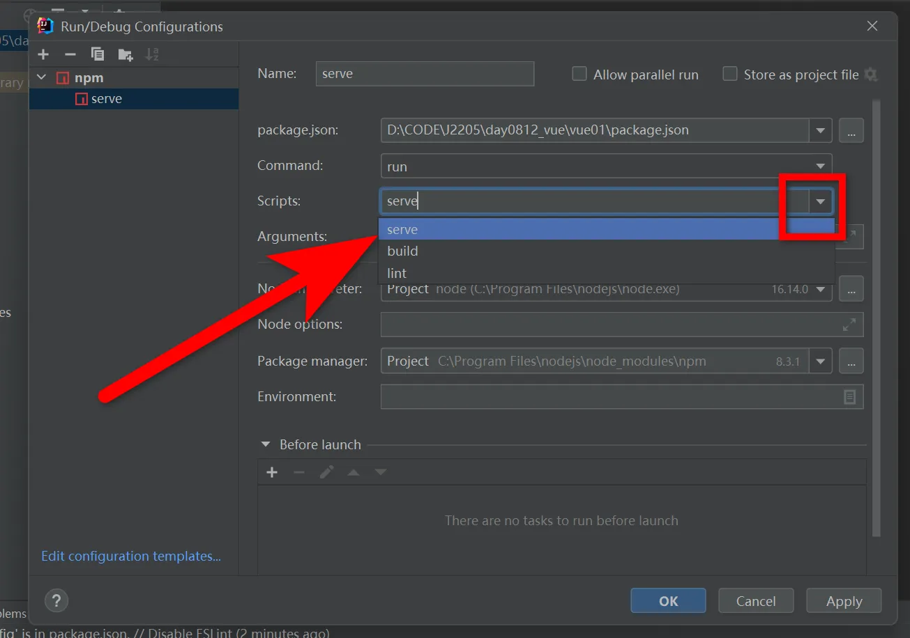

笔记用于记录VUE3.0学习过程，始于2025.4.21

+++

# 学习网址

```tex
官网： https://cn.vuejs.org/
菜鸟：https://www.runoob.com/vue3/vue3-tutorial.html
```

# 一、 VUE3.0准备工作

## 安装 node.js

```tex
下载地址:https://nodejs.org/en/download/prebuilt-installer

测试安装环境
C:\Users\admin>node --version
v16.15.0
```

## 创建项目

cmd 运行

```
# 两种方式
npm create vue@latest  推荐
npm init vite@latest
```


- 安装依赖并启动服务器

  ```
  cd vue3.0    进入项目目录
  npm install  安装依赖
  npm run dev  启动服务器
  ```

- 推荐IDE和工具

  推荐的 IDE 配置是 [Visual Studio Code](https://code.visualstudio.com/) + [Vue - Official 扩展](https://marketplace.visualstudio.com/items?itemName=Vue.volar)


## 目录结构


参考资料：

```
public/assets目录区别:https://blog.csdn.net/m0_69497411/article/details/138285400
```

src文件夹说明：

```
src文件夹是项目的核心，包含源代码和主要配置文件。
components文件夹用于存放可复用的Vue组件。
assets文件夹存放静态资源，如图片和样式文件。
router文件夹用于配置路由，定义页面导航。
store文件夹用于状态管理，集中管理应用状态。
plugins文件夹存放Vue插件，扩展应用功能。
views文件夹存放视图组件，与路由直接关联。
utils文件夹存放工具函数和辅助方法，提供通用功能。
```


### tsconfig.json

负责控制 TypeScript编译器的行为。

> **根选项**
> include：指定被编译文件所在的目录。
> exclude：指定不需要被编译的目录。
> extends：指定要继承的配置文件。
> files：指定被编译的文件。
> references：项目引用，是 TS 3.0 中的一项新功能，它允许将 TS 程序组织成更小的部分。
> 使用小技巧：在填写路径时 ** 表示任意目录， * 表示任意文件。
> compilerOptions：定义项目的运行时期望、JavaScript 的发出方式和位置以及与现有 JavaScript 代码的集成级别。

常用的配置如下：

```json
{
  "compilerOptions": {
    // 目标代码(ts -> js(es5/6/7))
    "target": "esnext",  
    "allowJs": true, // 允许编译javascript文件。
    "allowSyntheticDefaultImports": true,
    "allowUnreachableCode": true, // 不报告执行不到的代码错误。
    "allowUnusedLabels": false,	// 不报告未使用的标签错误
    "alwaysStrict": false, // 以严格模式解析并为每个源文件生成 "use strict"语句
    "baseUrl": ".",  // 文件路径在解析时,基本url,【工作根目录】
    "declaration": true, // 是否自动创建类型声明文件
    "declarationDir": "./lib", // 类型声明文件的输出目录
    "esModuleInterop": true,
    "experimentalDecorators": true, // 启用实验性的ES装饰器
    "noImplicitAny": false, // 是否默认禁用 any
    "removeComments": true, // 是否移除注释
    "target": "esnext",// 编译的目标是什么版本的
      
    // "commonjs" 指定生成哪个模块系统代码
    // export default/module.exports = {}
    // es module 和 commonjs
    // 目标代码需要使用的模块化方案(commonjs require/module.exports/es module import/export)
    "module": "esnext", 
    "moduleResolution": "node",  // 按照node的方式去解析模块 import "/index.node"
    "jsx": "preserve",  // 对jsx进行怎么样的处理，在 .tsx文件里支持JSX
    "importHelpers": true,  // 辅助的导入功能
    "strict": true,  // 严格一些严格的检查(any)
      
    // 跳过一些库的类型检测 (axios -> 类型/ lodash -> @types/lodash / 其他的第三方)
    // import { Person } from 'axios'
    "skipLibCheck": true,
    "suppressImplicitAnyIndexErrors": true,
    "sourceMap": true,  // 是否生成map文件 要不要生成映射文件(ts -> js)
    

    // 指定具体要解析使用的类型
    "types": ["webpack-env"],
    // 指定模块的路径，和baseUrl有关联，和webpack中resolve.alias配置一样
    "paths": {
      "@/*": ["src/*"],
      "@assets/*": ["src/assets/*"],
      "@components/*": ["src/components/*"],
      "@views/*": ["src/views/*"],
      "@store/*": ["src/stores/*"],
    },
    // 编译过程中需要引入的库文件的列表
    "lib": ["esnext", "dom", "dom.iterable", "scripthost"]
  },
    
  // 指定一个匹配列表（属于自动指定该路径下的所有ts相关文件）
  "include": [
    "src/**/*.ts",
    "src/**/*.tsx",
    "src/**/*.vue",
    "tests/**/*.ts",
    "tests/**/*.tsx"
  ],
   // 指定不需要被编译的目录
  "exclude": ["node_modules"]
}
```

### vite.config.js(ts)

官网：https://vitejs.dev/config/

```javascript
import { fileURLToPath, URL } from 'node:url'

// 使用 defineConfig 帮手函数，这样不用 jsdoc 注解也可以获取类型提示
import { defineConfig } from 'vite'
import vue from '@vitejs/plugin-vue'
import vueJsx from '@vitejs/plugin-vue-jsx'

// 此处引用了path路径导向
import path from "path"


export default defineConfig({
  // 查看 插件 API 获取 Vite 插件的更多细节 https://www.vitejs.net/guide/api-plugin.html
  plugins: [vue(), vueJsx()],
  // 在生产中服务时的基本路径
  base: './',
    
  // 配置别名绝对路径  https://webpack.js.org/configuration/resolve/
  resolve: {
    // resolve.alias: 更轻松地为import或require某些模块创建别名
    alias: {
      // '@': fileURLToPath(new URL('./src', import.meta.url)),
      // 如果报错__dirname找不到，需要安装node,执行npm install @types/node --save-dev
      "@": path.resolve(__dirname, "./src"),
      "@assets": path.resolve(__dirname, "./src/assets"),
      "@components": path.resolve(__dirname, "./src/components"),
      "@views": path.resolve(__dirname, "./src/views"),
      "@store": path.resolve(__dirname, "./src/stores"),
    },
    // 忽略后缀名的配置选项, 添加 .vue 选项时要记得原本默认忽略的选项也要手动写入
    extensions: ['.js', '.json', '.ts', '.vue'] 
  },
    
  
  // 打包相关配置 
  // 参考资料：https://zhuanlan.zhihu.com/p/690208925
  build: {
    outDir: "dist",  // 与根相关的目录，构建输出将放在其中，如果目录存在，它将在构建之前被删除  @default 'dist'
    rollupOptions: {  
      // 单页面
      input: './src/main.ts'  // 告诉Vite使用这个文件作为构建的入口
      // 多页面配置  
      // input: {
        // main: './src/main.ts',
        // another: './src/another_entry.ts'
      // }
    }  
  },
  
  // 服务器配置  
  server: {
    https: false, // 是否开启 https
    open: true, // 是否自动在浏览器中打开
    port: 8001, // 端口号
    host: "0.0.0.0",
    // 跨域代理
    proxy: {
      '/api': {
        target: "http://localhost:3000",  // 后台接口
        changeOrigin: true,
        // secure: false, // 如果是https接口，需要配置这个参数
        // ws: true, //websocket支持
        // 截取api，并用api代替
        // rewrite: (path) => path.replace(/^\/api/, "/api"),
      }
    }
  },

  // 引入第三方的配置
  optimizeDeps: {
    include: [],
  }
})
```


## 项目打包

```
npm run build
```


## nginx 部署

### 下载 nginx

下载地址：https://nginx.org/en/download.html

### 使用：解压缩

### windows服务器简单配置


#### ubuntu命令


### ubuntu配置

/etc/nginx/sites-available,添加文件

```
# vim /etc/nginx/sites-available/JiYuanWeb
# upstream JiYuanWeb { server 0.0.0.0:5002; }
server {
        listen 5001;
        server_name localhost;
        # root /home/wt/JiYuan_Web;
        location /static { alias /home/wt/JiYuan_Web/static; }
        location / {
        	include uwsgi_params;
    		uwsgi_pass 127.0.0.1:5002;           
        }
}

# 创建符号链接，将配置文件链接到Nginx的sites-enabled目录中
# sudo ln -s /etc/nginx/sites-available/JiYuanWeb /etc/nginx/sites-enabled/
```

访问静态资源 无权限

```
# user www-data;
user root;
```

错误日志

```
/var/log/nginx/error.log
```

## VS Code

### vscode 新建vue模板

vue.code-snippets

```
{
"Print to console":{
    "prefix":"vue",
    "body": [
        "<template>\n",
        "</template>\n",
        "<script setup lang=\"ts\">\n",
        "</script>\n",
        "<style scoped>\n",
        "</style>",
        ],
    "description":"Log output to console"
}
}
```

## idea中配置

### idea中不能使用npm命令的解决办法

File-> Settings -> Tools -> Terminal -> Shell path中内容由cmd.exe修改为C:\Windows\System32\cmd.exe全路径


### idea中配置vue启动




### idea中vue.js插件


## typescript忽略类型检查

### 单行忽略

(添加到特定行的行前来忽略这一行的错误)

```
// @ts-ignore
```

### 跳过对某些文件的检查

 (添加到该文件的首行才起作用)

```
// @ts-nocheck
```

### 对某些文件的检查

```
// @ts-check
```

## 安装依赖

```
npm i @types/node
```

# 二、基础语法

Vue.js 是一个渐进式 JavaScript 框架，主要用于构建用户界面。

Vue.js 基于组件化和响应式数据的理念，提供了一种简单高效的方式来构建用户界面。

## Vue 单文件组件

Vue 单文件组件（Single File Component，简称 SFC）是 Vue.js 框架的文件格式，它允许开发者将 HTML、JavaScript 和 CSS 代码放在一个文件中，通常以 .vue 为文件后缀。

单文件组件是一种可复用的代码组织形式，它将从属于同一个组件的 HTML、CSS 和 JavaScript 封装在使用 .vue 后缀的文件中。

## 1.创建 Vue 实例

创建一个 Vue 实例并将其挂载到一个 DOM 元素上。

```html
<!DOCTYPE html>
<html lang="en">
<head>
    <script src="https://unpkg.com/vue@3/dist/vue.global.js"></script>
</head>
<body>
    <div id="hello-vue">{{ message }}</div>
    <script>
        const { createApp,ref } = Vue
        // 组合式
        const HelloVueAppSetup = {
            setup() {
                const message = ref('Hello vue!')
                return {message}
             }
        }
    // 创建应用实例
    const app = createApp(HelloVueAppSetup)
    // 挂载应用
    app.mount('#hello-vue')
    </script>
</body>
</html>
```

**HTML 部分说明：**

```tex
<div id="hello-vue">{{ message }}</div>:
    这是一个 <div> 元素，它具有 id 为 hello-vue 。
    在 Vue 应用中，这个 <div> 将会被 Vue 实例管理，并且会在数据发生变化时更新内容。
{{ message }}:
    这是 Vue.js 的模板语法，用于将 Vue 实例中的 message 数据绑定到页面上。
    当 Vue 实例中的 message 数据变化时，页面上的内容也会随之更新。
```

**JavaScript 部分说明：**

Vue 实例定义:

```tex
const HelloVueAppSetup = {
            setup() {
                const message = ref('Hello vue!')
                return {message}
             }
}
```

- `HelloVueAppSetup` 是一个普通的 JavaScript 对象，包含了 Vue 组件。

- `setup`函数来定义响应式数据`message`。
- 使用`ref`来创建响应式数据`message`。
- `setup`函数中返回`message`，这样就可以在模板中被访问和使用。

**执行过程**

- 页面加载时，浏览器解析 HTML 和 JavaScript。
- Vue.js 脚本执行时，创建了一个 Vue 应用实例，并将其绑定到 `<div id="hello-vue">` 元素上。
- Vue 应用实例根据 `setup()` 中的初始数据，将 `message` 的值渲染到页面上的 `{{ message }}` 处。
- 当 `message` 数据发生变化时（例如通过用户交互或异步操作），页面会自动更新以反映这些变化。

## 2. 模板语法

### 插值

使用双大括号 {{ }} 来表示文本插值

```vue
<div>{{ message }}</div>
```

### 指令

指令是带有前缀 `v- `的特殊属性，用于在模板中表达逻辑。

`v-bind`: 动态绑定一个或多个特性，或一个组件 prop。

```vue
<a v-bind:href="url">Link</a>
简写：
<a :href="url">Link</a>
```

`v-if / v-else-if / v-else`: 条件渲染

```vue
<p v-if="visible">内容可见</p>
<p v-else>内容不可见</p>
```

`v-for`: 列表渲染。

```vue
<ul>
  <li v-for="item in items" :key="item.id">{{ item.text }}</li>
</ul>
```

`v-model`: 双向数据绑定。

```vue
<input v-model="message" placeholder="edit me">
<p>Message is: {{ message }}</p>
```

`v-on`: 事件监听器。

```vue
<button v-on:click="doSomething">Click me</button>
简写：
<button @click="doSomething">Click me</button>
```

## 3. 事件处理

使用 v-on 指令来监听 DOM 事件，并在触发时执行一些 JavaScript 代码。

```vue
<div id="app">
  <button @click="greet">Greet</button>
</div>

<script>
 const { createApp } = Vue
 // 组合式
 const HelloVueAppSetup = {
 setup() {
   const greet = () => alert('Hello')
   return { greet }
   }
 }
// 创建应用实例
const app = createApp(HelloVueAppSetup)
// 挂载应用
app.mount('#hello-vue')
</script>
```

## 4. 计算属性

计算属性是基于其依赖进行缓存的属性。计算属性只有在其相关依赖发生变化时才会重新计算。

```vue
<div id="hello-vue">
    <!-- 计算属性 -->
    <p>{{ reversedMessage }}</p>
</div>
<script>
    const { createApp,ref,computed } = Vue
    // 组合式
    const HelloVueAppSetup = {
        setup() {
            const message = ref("Hello")
            const reversedMessage = computed(() => message.value.split('').reverse().join(''))
            return { reversedMessage }
        }
    }
    // 创建应用实例
    const app = createApp(HelloVueAppSetup)
    // 挂载应用
    app.mount('#hello-vue')
</script>
```

## 5. 组件

组件允许你使用小型、独立和通常可复用的组件构建大型应用。

```vue
 <div id="hello-vue">
     <!-- 组件 -->
     <my-component></my-component>
</div>
<script>
    // 创建应用实例
    const app = createApp({})
    // 全局注册一个组件，使其在应用的任何地方都可以使用。
    app.component('my-component', {
        template: '<div>A custom component!</div>'
    })
    // 挂载应用
    app.mount('#hello-vue')
</script>
```

## 6. Props 和事件

### Props

Props 用于在组件之间传递数据。

```vue
 <div id="hello-vue">
     <!-- 组件传参 -->
     <blog-post title="My journey with Vue"></blog-post>
</div>
<script>
    // 创建应用实例
    const app = createApp({})
    // 组件接收参数
    app.component('blog-post', {
    props: ['title'],
    template: '<h3>{{ title }}</h3>'
    })
    // 挂载应用
    app.mount('#hello-vue')
</script>
```

### 事件

子组件通过 emit 触发事件，父组件可以监听这些事件

```vue
<div id="hello-vue">
    <button-counter @increment="incrementTotal"></button-counter>
    <p>Total clicks: {{ total }}</p>
</div>
<script>
    const { createApp,ref,computed } = Vue
    // 组合式
    const HelloVueAppSetup = {
        setup() {
			const total = ref(0)
            const incrementTotal = () => total.value++
            return {
                total,incrementTotal
            }
        }
    }
    // 创建应用实例
    const app = createApp(HelloVueAppSetup)
    app.component('button-counter', {
        template:'<button @click="increment">You clicked me {{ count }} times.</button>',
        props: {
            message: {
            type: String,
            required: true
            }
        },
        setup(props, context) {
            const count = ref(0)
            const increment = () => {
                count.value++
                context.emit('increment')   
            }
            return { count,increment }
        },
    })

    // 挂载应用
    app.mount('#hello-vue')
</script>
```

笔记:

```tex
vue3 setup函数:https://www.cnblogs.com/jocongmin/p/18682607
```

# 三、声明式渲染

声明式渲染（Declarative Rendering）是指通过数据驱动视图的更新，而不是直接操作 DOM。

声明式渲染让开发者可以更专注于业务逻辑，而不需要关心如何更新视图和 DOM。

Vue3 的声明式渲染是一种基于模板的渲染方式，它允许开发者通过简洁的模板语法来描述页面的结构和数据绑定关系，而不需要直接操作 DOM。

Vue3 的声明式渲染通过使用模板、指令（如 v-if、v-for、v-bind 等）以及响应式数据来简化 UI 更新过程。

Vue 的声明式渲染让你只需要声明 UI 应该如何呈现，Vue 会根据数据的变化自动更新视图，当你改变数据时，视图会自动响应。

Vue3 使用模板语法（类似 HTML）来描述 UI，模板中的表达式（如 {{ message }}）会绑定到组件的数据模型。

## 1、数据绑定

数据绑定是声明式渲染的核心。

通过绑定数据，Vue 可以自动更新 DOM 元素的内容，避免了传统的手动 DOM 操作。

### 插值表达式

插值表达式是通过双花括号 {{ }} 来将组件的数据插入到 HTML 模板中。

```vue
<template>
  <div>
    <h1>{{ message }}</h1>
  </div>
</template>

<script setup lang="ts">
import { ref } from 'vue'
const message = ref('Hello World')
</script>
```

双花括号 {{ message }} 会渲染为 **Hello World**，并且当 message 的值改变时，视图会自动更新。

在双花括号中的内容并不只限于标识符或路径——我们可以使用任何有效的 JavaScript 表达式。

```vue
<h1>{{ message.split('').reverse().join('') }}</h1>
```

### 属性绑定

通过 v-bind 指令，你可以绑定 HTML 属性到组件的数据，这样可以使得 DOM 元素的属性（如 href、class、src）根据组件的状态动态更新。

```vue
<template>
  <div>
    <a v-bind:href="url">点我</a>
  </div>
</template>

<script setup lang="ts">
import { ref } from 'vue'
const url = ref('https://www.baidu.com')
</script>
```

v-bind:href 会将 url 数据绑定到 <a> 标签的 href 属性，当 url 发生变化时，href 会自动更新。

## 条件渲染

Vue 通过 v-if、v-else-if 和 v-else 指令实现条件渲染，根据某个数据条件来决定是否渲染某个 DOM 元素。

```vue
<template>
  <div>
    <p v-if="isVisible">这段文本是可见的</p>
    <button @click="toggleVisibility">切换可见性</button>
  </div>
</template>

<script setup lang="ts">
import { ref } from 'vue'
const isVisible = ref(true)
const toggleVisibility = () => isVisible.value = !isVisible.value

</script>
```

当 isVisible 为 true 时，<p> 标签会被渲染，当点击按钮时，isVisible 会反转，<p> 标签的显示与否也会自动改变。

## 列表渲染

使用 v-for 指令可以渲染一个列表。

Vue 会根据数组的每一项渲染对应的 DOM 元素，并且在数组数据变化时，自动更新视图。

```vue
<template>
  <div>
    <ul>
      <li v-for="item in items" :key="item.id">{{ item.name }}</li>
    </ul>
  </div>
</template>

<script setup lang="ts">
import { reactive } from 'vue'
const items = reactive([
  { id: 1, name: 'Vue 3' },
  { id: 2, name: 'JavaScript' },
  { id: 3, name: 'HTML' }
])

</script>
```

v-for 会根据 items 数组渲染出一个列表。每个列表项都有一个 key 来帮助 Vue 跟踪每一项，从而提高渲染效率。
