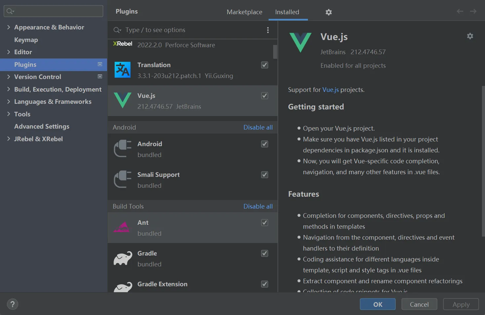

笔记用于记录VUE3.0学习过程，始于2025.4.21

+++

# 学习网址

```tex
官网： https://cn.vuejs.org/
菜鸟：https://www.runoob.com/vue3/vue3-tutorial.html
```

# 一、 VUE3.0准备工作

## 安装 node.js

```tex
下载地址:https://nodejs.org/en/download/prebuilt-installer

测试安装环境
C:\Users\admin>node --version
v16.15.0
```

## 创建项目

cmd 运行

```
# 两种方式
npm create vue@latest  推荐
npm init vite@latest
```


- 安装依赖并启动服务器

  ```
  cd vue3.0    进入项目目录
  npm install  安装依赖
  npm run dev  启动服务器
  ```

- 推荐IDE和工具

  推荐的 IDE 配置是 [Visual Studio Code](https://code.visualstudio.com/) + [Vue - Official 扩展](https://marketplace.visualstudio.com/items?itemName=Vue.volar)


## 目录结构


参考资料：

```
public/assets目录区别:https://blog.csdn.net/m0_69497411/article/details/138285400
```

src文件夹说明：

```
src文件夹是项目的核心，包含源代码和主要配置文件。
components文件夹用于存放可复用的Vue组件。
assets文件夹存放静态资源，如图片和样式文件。
router文件夹用于配置路由，定义页面导航。
store文件夹用于状态管理，集中管理应用状态。
plugins文件夹存放Vue插件，扩展应用功能。
views文件夹存放视图组件，与路由直接关联。
utils文件夹存放工具函数和辅助方法，提供通用功能。
```


### tsconfig.json

负责控制 TypeScript编译器的行为。

> **根选项**
> include：指定被编译文件所在的目录。
> exclude：指定不需要被编译的目录。
> extends：指定要继承的配置文件。
> files：指定被编译的文件。
> references：项目引用，是 TS 3.0 中的一项新功能，它允许将 TS 程序组织成更小的部分。
> 使用小技巧：在填写路径时 ** 表示任意目录， * 表示任意文件。
> compilerOptions：定义项目的运行时期望、JavaScript 的发出方式和位置以及与现有 JavaScript 代码的集成级别。

常用的配置如下：

```json
{
  "compilerOptions": {
    // 目标代码(ts -> js(es5/6/7))
    "target": "esnext",  
    "allowJs": true, // 允许编译javascript文件。
    "allowSyntheticDefaultImports": true,
    "allowUnreachableCode": true, // 不报告执行不到的代码错误。
    "allowUnusedLabels": false,	// 不报告未使用的标签错误
    "alwaysStrict": false, // 以严格模式解析并为每个源文件生成 "use strict"语句
    "baseUrl": ".",  // 文件路径在解析时,基本url,【工作根目录】
    "declaration": true, // 是否自动创建类型声明文件
    "declarationDir": "./lib", // 类型声明文件的输出目录
    "esModuleInterop": true,
    "experimentalDecorators": true, // 启用实验性的ES装饰器
    "noImplicitAny": false, // 是否默认禁用 any
    "removeComments": true, // 是否移除注释
    "target": "esnext",// 编译的目标是什么版本的
      
    // "commonjs" 指定生成哪个模块系统代码
    // export default/module.exports = {}
    // es module 和 commonjs
    // 目标代码需要使用的模块化方案(commonjs require/module.exports/es module import/export)
    "module": "esnext", 
    "moduleResolution": "node",  // 按照node的方式去解析模块 import "/index.node"
    "jsx": "preserve",  // 对jsx进行怎么样的处理，在 .tsx文件里支持JSX
    "importHelpers": true,  // 辅助的导入功能
    "strict": true,  // 严格一些严格的检查(any)
      
    // 跳过一些库的类型检测 (axios -> 类型/ lodash -> @types/lodash / 其他的第三方)
    // import { Person } from 'axios'
    "skipLibCheck": true,
    "suppressImplicitAnyIndexErrors": true,
    "sourceMap": true,  // 是否生成map文件 要不要生成映射文件(ts -> js)
    

    // 指定具体要解析使用的类型
    "types": ["webpack-env"],
    // 指定模块的路径，和baseUrl有关联，和webpack中resolve.alias配置一样
    "paths": {
      "@/*": ["src/*"],
      "@assets/*": ["src/assets/*"],
      "@components/*": ["src/components/*"],
      "@views/*": ["src/views/*"],
      "@store/*": ["src/stores/*"],
    },
    // 编译过程中需要引入的库文件的列表
    "lib": ["esnext", "dom", "dom.iterable", "scripthost"]
  },
    
  // 指定一个匹配列表（属于自动指定该路径下的所有ts相关文件）
  "include": [
    "src/**/*.ts",
    "src/**/*.tsx",
    "src/**/*.vue",
    "tests/**/*.ts",
    "tests/**/*.tsx"
  ],
   // 指定不需要被编译的目录
  "exclude": ["node_modules"]
}
```

### vite.config.js(ts)

官网：https://vitejs.dev/config/

```javascript
import { fileURLToPath, URL } from 'node:url'

// 使用 defineConfig 帮手函数，这样不用 jsdoc 注解也可以获取类型提示
import { defineConfig } from 'vite'
import vue from '@vitejs/plugin-vue'
import vueJsx from '@vitejs/plugin-vue-jsx'

// 此处引用了path路径导向
import path from "path"


export default defineConfig({
  // 查看 插件 API 获取 Vite 插件的更多细节 https://www.vitejs.net/guide/api-plugin.html
  plugins: [vue(), vueJsx()],
  // 在生产中服务时的基本路径
  base: './',
    
  // 配置别名绝对路径  https://webpack.js.org/configuration/resolve/
  resolve: {
    // resolve.alias: 更轻松地为import或require某些模块创建别名
    alias: {
      // '@': fileURLToPath(new URL('./src', import.meta.url)),
      // 如果报错__dirname找不到，需要安装node,执行npm install @types/node --save-dev
      "@": path.resolve(__dirname, "./src"),
      "@assets": path.resolve(__dirname, "./src/assets"),
      "@components": path.resolve(__dirname, "./src/components"),
      "@views": path.resolve(__dirname, "./src/views"),
      "@store": path.resolve(__dirname, "./src/stores"),
    },
    // 忽略后缀名的配置选项, 添加 .vue 选项时要记得原本默认忽略的选项也要手动写入
    extensions: ['.js', '.json', '.ts', '.vue'] 
  },
    
  
  // 打包相关配置 
  // 参考资料：https://zhuanlan.zhihu.com/p/690208925
  build: {
    outDir: "dist",  // 与根相关的目录，构建输出将放在其中，如果目录存在，它将在构建之前被删除  @default 'dist'
    rollupOptions: {  
      // 单页面
      input: './src/main.ts'  // 告诉Vite使用这个文件作为构建的入口
      // 多页面配置  
      // input: {
        // main: './src/main.ts',
        // another: './src/another_entry.ts'
      // }
    }  
  },
  
  // 服务器配置  
  server: {
    https: false, // 是否开启 https
    open: true, // 是否自动在浏览器中打开
    port: 8001, // 端口号
    host: "0.0.0.0",
    // 跨域代理
    proxy: {
      '/api': {
        target: "http://localhost:3000",  // 后台接口
        changeOrigin: true,
        // secure: false, // 如果是https接口，需要配置这个参数
        // ws: true, //websocket支持
        // 截取api，并用api代替
        // rewrite: (path) => path.replace(/^\/api/, "/api"),
      }
    }
  },

  // 引入第三方的配置
  optimizeDeps: {
    include: [],
  }
})
```


## 项目打包

```
npm run build
```


## nginx 部署

### 下载 nginx

下载地址：https://nginx.org/en/download.html

### 使用：解压缩

### windows服务器简单配置


#### ubuntu命令


### ubuntu配置

/etc/nginx/sites-available,添加文件

```
# vim /etc/nginx/sites-available/JiYuanWeb
# upstream JiYuanWeb { server 0.0.0.0:5002; }
server {
        listen 5001;
        server_name localhost;
        # root /home/wt/JiYuan_Web;
        location /static { alias /home/wt/JiYuan_Web/static; }
        location / {
        	include uwsgi_params;
    		uwsgi_pass 127.0.0.1:5002;           
        }
}

# 创建符号链接，将配置文件链接到Nginx的sites-enabled目录中
# sudo ln -s /etc/nginx/sites-available/JiYuanWeb /etc/nginx/sites-enabled/
```

访问静态资源 无权限

```
# user www-data;
user root;
```

错误日志

```
/var/log/nginx/error.log
```

## VS Code

### vscode 新建vue模板

vue.code-snippets

```
{
"Print to console":{
    "prefix":"vue",
    "body": [
        "<template>\n",
        "</template>\n",
        "<script setup lang=\"ts\">\n",
        "</script>\n",
        "<style scoped>\n",
        "</style>",
        ],
    "description":"Log output to console"
}
}
```

## idea中配置

### idea中不能使用npm命令的解决办法

File-> Settings -> Tools -> Terminal -> Shell path中内容由cmd.exe修改为C:\Windows\System32\cmd.exe全路径


### idea中配置vue启动


### idea中vue.js插件



## typescript忽略类型检查

### 单行忽略

(添加到特定行的行前来忽略这一行的错误)

```
// @ts-ignore
```

### 跳过对某些文件的检查

 (添加到该文件的首行才起作用)

```
// @ts-nocheck
```

### 对某些文件的检查

```
// @ts-check
```

## 安装依赖

```
npm i @types/node
```

# 二、基础语法

Vue.js 是一个渐进式 JavaScript 框架，主要用于构建用户界面。

Vue.js 基于组件化和响应式数据的理念，提供了一种简单高效的方式来构建用户界面。

## Vue 单文件组件

Vue 单文件组件（Single File Component，简称 SFC）是 Vue.js 框架的文件格式，它允许开发者将 HTML、JavaScript 和 CSS 代码放在一个文件中，通常以 .vue 为文件后缀。

单文件组件是一种可复用的代码组织形式，它将从属于同一个组件的 HTML、CSS 和 JavaScript 封装在使用 .vue 后缀的文件中。

## 1.创建 Vue 实例

创建一个 Vue 实例并将其挂载到一个 DOM 元素上。

```html
<!DOCTYPE html>
<html lang="en">
<head>
    <script src="https://unpkg.com/vue@3/dist/vue.global.js"></script>
</head>
<body>
    <div id="hello-vue">{{ message }}</div>
    <script>
        const { createApp,ref } = Vue
        // 组合式
        const HelloVueAppSetup = {
            setup() {
                const message = ref('Hello vue!')
                return {message}
             }
        }
    // 创建应用实例
    const app = createApp(HelloVueAppSetup)
    // 挂载应用
    app.mount('#hello-vue')
    </script>
</body>
</html>
```

**HTML 部分说明：**

```tex
<div id="hello-vue">{{ message }}</div>:
    这是一个 <div> 元素，它具有 id 为 hello-vue 。
    在 Vue 应用中，这个 <div> 将会被 Vue 实例管理，并且会在数据发生变化时更新内容。
{{ message }}:
    这是 Vue.js 的模板语法，用于将 Vue 实例中的 message 数据绑定到页面上。
    当 Vue 实例中的 message 数据变化时，页面上的内容也会随之更新。
```

**JavaScript 部分说明：**

Vue 实例定义:

```tex
const HelloVueAppSetup = {
            setup() {
                const message = ref('Hello vue!')
                return {message}
             }
}
```

- `HelloVueAppSetup` 是一个普通的 JavaScript 对象，包含了 Vue 组件。

- `setup`函数来定义响应式数据`message`。
- 使用`ref`来创建响应式数据`message`。
- `setup`函数中返回`message`，这样就可以在模板中被访问和使用。

**执行过程**

- 页面加载时，浏览器解析 HTML 和 JavaScript。
- Vue.js 脚本执行时，创建了一个 Vue 应用实例，并将其绑定到 `<div id="hello-vue">` 元素上。
- Vue 应用实例根据 `setup()` 中的初始数据，将 `message` 的值渲染到页面上的 `{{ message }}` 处。
- 当 `message` 数据发生变化时（例如通过用户交互或异步操作），页面会自动更新以反映这些变化。

## 2. 模板语法

### 插值

使用双大括号 {{ }} 来表示文本插值

```vue
<div>{{ message }}</div>
```

### 指令

指令是带有前缀 `v- `的特殊属性，用于在模板中表达逻辑。

`v-bind`: 动态绑定一个或多个特性，或一个组件 prop。

```vue
<a v-bind:href="url">Link</a>
简写：
<a :href="url">Link</a>
```

`v-if / v-else-if / v-else`: 条件渲染

```vue
<p v-if="visible">内容可见</p>
<p v-else>内容不可见</p>
```

`v-for`: 列表渲染。

```vue
<ul>
  <li v-for="item in items" :key="item.id">{{ item.text }}</li>
</ul>
```

`v-model`: 双向数据绑定。

```vue
<input v-model="message" placeholder="edit me">
<p>Message is: {{ message }}</p>
```

`v-on`: 事件监听器。

```vue
<button v-on:click="doSomething">Click me</button>
简写：
<button @click="doSomething">Click me</button>
```

## 3. 事件处理

使用 v-on 指令来监听 DOM 事件，并在触发时执行一些 JavaScript 代码。

```vue
<div id="app">
  <button @click="greet">Greet</button>
</div>

<script>
 const { createApp } = Vue
 // 组合式
 const HelloVueAppSetup = {
 setup() {
   const greet = () => alert('Hello')
   return { greet }
   }
 }
// 创建应用实例
const app = createApp(HelloVueAppSetup)
// 挂载应用
app.mount('#hello-vue')
</script>
```

## 4. 计算属性

计算属性是基于其依赖进行缓存的属性。计算属性只有在其相关依赖发生变化时才会重新计算。

```vue
<div id="hello-vue">
    <!-- 计算属性 -->
    <p>{{ reversedMessage }}</p>
</div>
<script>
    const { createApp,ref,computed } = Vue
    // 组合式
    const HelloVueAppSetup = {
        setup() {
            const message = ref("Hello")
            const reversedMessage = computed(() => message.value.split('').reverse().join(''))
            return { reversedMessage }
        }
    }
    // 创建应用实例
    const app = createApp(HelloVueAppSetup)
    // 挂载应用
    app.mount('#hello-vue')
</script>
```

## 5. 组件

组件允许你使用小型、独立和通常可复用的组件构建大型应用。

```vue
 <div id="hello-vue">
     <!-- 组件 -->
     <my-component></my-component>
</div>
<script>
    // 创建应用实例
    const app = createApp({})
    // 全局注册一个组件，使其在应用的任何地方都可以使用。
    app.component('my-component', {
        template: '<div>A custom component!</div>'
    })
    // 挂载应用
    app.mount('#hello-vue')
</script>
```

## 6. Props 和事件

### Props

Props 用于在组件之间传递数据。

```vue
 <div id="hello-vue">
     <!-- 组件传参 -->
     <blog-post title="My journey with Vue"></blog-post>
</div>
<script>
    // 创建应用实例
    const app = createApp({})
    // 组件接收参数
    app.component('blog-post', {
    props: ['title'],
    template: '<h3>{{ title }}</h3>'
    })
    // 挂载应用
    app.mount('#hello-vue')
</script>
```

### 事件

子组件通过 emit 触发事件，父组件可以监听这些事件

```vue
<div id="hello-vue">
    <button-counter @increment="incrementTotal"></button-counter>
    <p>Total clicks: {{ total }}</p>
</div>
<script>
    const { createApp,ref,computed } = Vue
    // 组合式
    const HelloVueAppSetup = {
        setup() {
			const total = ref(0)
            const incrementTotal = () => total.value++
            return {
                total,incrementTotal
            }
        }
    }
    // 创建应用实例
    const app = createApp(HelloVueAppSetup)
    app.component('button-counter', {
        template:'<button @click="increment">You clicked me {{ count }} times.</button>',
        props: {
            message: {
            type: String,
            required: true
            }
        },
        setup(props, context) {
            const count = ref(0)
            const increment = () => {
                count.value++
                context.emit('increment')   
            }
            return { count,increment }
        },
    })

    // 挂载应用
    app.mount('#hello-vue')
</script>
```

笔记:

```tex
vue3 setup函数:https://www.cnblogs.com/jocongmin/p/18682607
```

# 三、声明式渲染

声明式渲染（Declarative Rendering）是指通过数据驱动视图的更新，而不是直接操作 DOM。

声明式渲染让开发者可以更专注于业务逻辑，而不需要关心如何更新视图和 DOM。

Vue3 的声明式渲染是一种基于模板的渲染方式，它允许开发者通过简洁的模板语法来描述页面的结构和数据绑定关系，而不需要直接操作 DOM。

Vue3 的声明式渲染通过使用模板、指令（如 v-if、v-for、v-bind 等）以及响应式数据来简化 UI 更新过程。

Vue 的声明式渲染让你只需要声明 UI 应该如何呈现，Vue 会根据数据的变化自动更新视图，当你改变数据时，视图会自动响应。

Vue3 使用模板语法（类似 HTML）来描述 UI，模板中的表达式（如 {{ message }}）会绑定到组件的数据模型。

## 1、数据绑定

数据绑定是声明式渲染的核心。

通过绑定数据，Vue 可以自动更新 DOM 元素的内容，避免了传统的手动 DOM 操作。

### 插值表达式

插值表达式是通过双花括号 {{ }} 来将组件的数据插入到 HTML 模板中。

```vue
<template>
  <div>
    <h1>{{ message }}</h1>
  </div>
</template>

<script setup lang="ts">
    import { ref } from 'vue'
    const message = ref('Hello World')
</script>
```

双花括号 {{ message }} 会渲染为 **Hello World**，并且当 message 的值改变时，视图会自动更新。

在双花括号中的内容并不只限于标识符或路径——我们可以使用任何有效的 JavaScript 表达式。

```vue
<h1>{{ message.split('').reverse().join('') }}</h1>
```

### 属性绑定

通过 v-bind 指令，你可以绑定 HTML 属性到组件的数据，这样可以使得 DOM 元素的属性（如 href、class、src）根据组件的状态动态更新。

```vue
<template>
  <div>
    <a v-bind:href="url">点我</a>
  </div>
</template>

<script setup lang="ts">
    import { ref } from 'vue'
    const url = ref('https://www.baidu.com')
</script>
```

v-bind:href 会将 url 数据绑定到 <a> 标签的 href 属性，当 url 发生变化时，href 会自动更新。

## 2、条件渲染

Vue 通过 v-if、v-else-if 和 v-else 指令实现条件渲染，根据某个数据条件来决定是否渲染某个 DOM 元素。

```vue
<template>
  <div>
    <p v-if="isVisible">这段文本是可见的</p>
    <button @click="toggleVisibility">切换可见性</button>
  </div>
</template>

<script setup lang="ts">
    import { ref } from 'vue'
    const isVisible = ref(true)
    const toggleVisibility = () => isVisible.value = !isVisible.value

</script>
```

当 isVisible 为 true 时，<p> 标签会被渲染，当点击按钮时，isVisible 会反转，<p> 标签的显示与否也会自动改变。

## 3、列表渲染

使用 v-for 指令可以渲染一个列表。

Vue 会根据数组的每一项渲染对应的 DOM 元素，并且在数组数据变化时，自动更新视图。

```vue
<template>
  <div>
    <ul>
      <li v-for="item in items" :key="item.id">{{ item.name }}</li>
    </ul>
  </div>
</template>

<script setup lang="ts">
    import { reactive } from 'vue'
    const items = reactive([
      { id: 1, name: 'Vue 3' },
      { id: 2, name: 'JavaScript' },
      { id: 3, name: 'HTML' }
    ])

</script>
```

v-for 会根据 items 数组渲染出一个列表。每个列表项都有一个 key 来帮助 Vue 跟踪每一项，从而提高渲染效率。

## 4、双向数据绑定

Vue 提供了 v-model 指令来实现表单元素（如 <input>）和组件数据之间的双向绑定，这样，表单元素的值与数据模型保持同步，用户输入时会自动更新数据，数据变化时会自动更新视图。

```vue
<template>
  <div>
    <input v-model="msg" placeholder="输入一些文本" />
    <p>你输入了：{{ msg }}</p>
  </div>
</template>

<script setup lang="ts">
    import { ref } from 'vue'
    const msg = ref('')
</script>
```

v-model 使得 input 元素的值与 msg 数据保持同步。当用户在输入框中输入文本时，msg 会自动更新，<p> 标签中的内容也会自动变化。

## 5、事件处理

Vue 提供了 v-on 指令来监听 DOM 事件并在事件触发时执行方法，这种方式让你能够声明式地处理用户输入、点击等事件。

```vue
<template>
  <div>
    <button v-on:click="increment">点击我</button>
    <p>点击次数：{{ count }}</p>
  </div>
</template>

<script setup lang="ts">
    const count = ref(0)
    const increment = () => count.value++
</script>
```

v-on:click 会监听按钮的点击事件，并在每次点击时调用 increment 方法来增加 count 的值，count 会自动更新到视图中。

## 6、计算属性

计算属性是 Vue 提供的一种声明式计算值的方式。

计算属性基于响应式数据，且只有在依赖的数据发生变化时才会重新计算。

```vue
<template>
  <div>
    <p>
      <a>原始金额：</a>
      <input v-model="amount" placeholder="输入一些数字" />
    </p>
    <p>税后金额：{{ computedAmount }}</p>
  </div>
</template>

<script setup lang="ts">
    const amount = ref<number>(100)
    // 假设税率为10%, 程序尽量避免小数运算 
    const computedAmount = computed(() => amount.value * 1.1 
</script>
```

computedAmount 是一个计算属性，基于 amount 计算出税后金额。当 amount 改变时，computedAmount 会自动更新，而不需要手动触发视图更新。

# 四、 指令

Vue 指令（Directives）是 Vue.js 的一项核心功能，它们可以在 HTML 模板中以 v- 开头的特殊属性形式使用，用于将响应式数据绑定到 DOM 元素上或在 DOM 元素上进行一些操作。

Vue 指令是带有前缀 v- 的特殊 HTML 属性，它赋予 HTML 标签额外的功能。

与传统的 JavaScript 方法相比，使用 Vue 创建响应式页面要容易得多，并且需要的代码更少。

以下是几个常用的 Vue 指令：

| 指令      | 描述                                                         |
| --------- | ------------------------------------------------------------ |
| `v-bind`  | 用于将 Vue 实例的数据绑定到 HTML 元素的属性上。              |
| `v-if`    | 用于根据表达式的值来条件性地渲染元素或组件。                 |
| `v-show`  | v-show 是 Vue.js 提供的一种指令，用于根据表达式的值来条件性地显示或隐藏元素。 |
| `v-for`   | 用于根据数组或对象的属性值来循环渲染元素或组件。             |
| `v-on`    | 用于在 HTML 元素上绑定事件监听器，使其能够触发 Vue 实例中的方法或函数。 |
| `v-model` | 用于在表单控件和 Vue 实例的数据之间创建双向数据绑定。        |
| `v-once`  | 使用 **v-once** 指令执行一次性地插值，当数据改变时，插值处的内容不会更新 |

除了这些常用的指令，Vue 还提供了一些其他的指令，如 v-text、v-html 等，以及自定义指令，让开发者能够更加灵活地操作 DOM 元素。

## v-bind

使用 v-bind 指令将 Vue 实例的数据绑定到 HTML 元素的属性上：

```vue
<template>
  <div>
    <a v-bind:href="url">点我</a>
  </div>
</template>

<script setup lang="ts">
    import { ref } from 'vue'
    const url = ref('https://www.baidu.com')
</script>
```

## v-if

使用 v-if 和 v-else 指令根据表达式的值来条件性地渲染元素或组件：

```vue
<template>
  <div>
    <p v-if="isVisible">这段文本是可见的</p>
    <p v-else>Goodbye Vue!</p>
    <button @click="toggleVisibility">切换可见性</button>
  </div>
</template>

<script setup lang="ts">
    import { ref } from 'vue'
    const isVisible = ref(true)
    const toggleVisibility = () => isVisible.value = !isVisible.value

</script>
```

## v-show

和v-if区别：

- v-if：控制元素不显示，并且标签也不存在

- v-show是控制元素：display: none;(根据条件显示和隐藏（标签都会渲染到页面）)

```vue
<template>
  <div>
    <p v-show="isVisible">这段文本是可见的</p>
    <button @click="toggleVisibility">显示/隐藏</button>
  </div>
</template>

<script setup lang="ts">
    import { ref } from 'vue'
    const isVisible = ref(true)
    const toggleVisibility = () => isVisible.value = !isVisible.value
</script>
```

## v-for

使用 v-for 指令根据数组的属性值循环渲染元素或组件

```vue
<template>
  <div>
    <ul>
      <li v-for="item in items" :key="item.id">{{ item.name }}</li>
    </ul>
  </div>
</template>

<script setup lang="ts">
    import { reactive } from 'vue'
    const items = reactive([
      { id: 1, name: 'Vue 3' },
      { id: 2, name: 'JavaScript' },
      { id: 3, name: 'HTML' }
    ])

</script>
```

## v-on

使用 v-on 指令在 HTML 元素上绑定事件监听器

```vue
<template>
  <div>
    <button v-on:click="increment">点击我</button>
    <p>点击次数：{{ count }}</p>
  </div>
</template>

<script setup lang="ts">
    const count = ref(0)
    const increment = () => count.value++
</script>
```

## v-model

使用 v-model 指令实现表单数据双向绑定

```vue
<template>
  <div>
    <input v-model="msg" placeholder="输入一些文本" />
    <p>你输入了：{{ msg }}</p>
  </div>
</template>

<script setup lang="ts">
    import { ref } from 'vue'
    const msg = ref('')
</script>
```

## v-once

```vue
<span v-once>这个将不会改变: {{ message }}</span>
```


# 五、Vue3 模板语法

Vue 使用了基于 HTML 的模板语法，允许开发者声明式地将 DOM 绑定至底层 Vue 实例的数据。

Vue 的核心是一个允许你采用简洁的模板语法来声明式的将数据渲染进 DOM 的系统。

结合响应系统，在应用状态改变时， Vue 能够智能地计算出重新渲染组件的最小代价并应用到 DOM 操作上。

```vue
<template>
  <div>
    <!-- 插值 -->
    <p>{{ message }}</p>
    
    <!-- v-bind -->
    <a :href="url">Link</a>
    
    <!-- v-on -->
    <button @click="handleClick">Click me</button>
    
    <!-- v-for -->
    <ul>
      <li v-for="item in items" :key="item.id">{{ item.name }}</li>
    </ul>
  </div>
</template>
```

## 插值

### 文本

数据绑定最常见的形式就是使用 {{...}}（双大括号）的文本插值：

```vue
<div id="app">
  <p>{{ message }}</p>
</div>
```

{{...}} 标签的内容将会被替代为对应组件实例中 **message** 属性的值，如果 **message** 属性的值发生了改变，{{...}} 标签内容也会更新。

如果不想改变标签的内容，可以通过使用 **v-once** 指令执行一次性地插值，当数据改变时，插值处的内容不会更新。

```vue
<span v-once>这个将不会改变: {{ message }}</span>
```

### Html

使用 v-html 指令用于输出 html 代码：

```vue
<template>
  <div>
    <p>使用双大括号的文本插值: {{ rawHtml }}</p>
    <p>使用 v-html 指令: <span v-html="rawHtml"></span></p>
  </div>
</template>

<script setup lang="ts">
    import { ref } from 'vue'
    const rawHtml = ref('<span style="color:red">This should be red.</span>')
</script>
```

### 属性

 HTML 属性中的值应使用 v-bind 指令。

```
<div v-bind:id="dynamicId"></div>
```

对于布尔属性，常规值为 true 或 false，如果属性值为 null 或 undefined，则该属性不会显示出来。

```
<button v-bind:disabled="isButtonDisabled">按钮</button>
```

以上代码中如果 isButtonDisabled 的值是 null 或 undefined，则 disabled 属性甚至不会被包含在渲染出来的 <button> 元素中。

以下实例判断 use 的值，如果为 true 使用 class1 类的样式，否则不使用该类：

```vue
<template>
  <div>
    <label>修改颜色</label>
    <input type="checkbox" v-model="use">
    <br><br>
    <div v-bind:class="{ 'class1': use }">
      v-bind:class 指令
    </div>
  </div>
</template>

<script setup lang="ts">
    import { ref } from 'vue'
    const use = ref(false)
</script>
```

### 表达式

Vue.js 都提供了完全的 JavaScript 表达式支持。

```vue
<template>
  <div>
    {{ 5 + 5 }}<br>
    {{ ok ? 'YES' : 'NO' }}<br>
    {{ message2.split('').reverse().join('') }}
    <div v-bind:id="'list-' + id">菜鸟教程</div>
  </div>
</template>

<script setup lang="ts">
    import { ref } from 'vue'
    const ok = ref(true)
    const message2 = ref('RUNOOB!!')
    const id = ref(1)
</script>
```

表达式会在当前活动实例的数据作用域下作为 JavaScript 被解析。有个限制就是，每个绑定都只能包含单个表达式，所以下面的例子都不会生效:

```
<!--  这是语句，不是表达式：-->
{{ var a = 1 }}

<!-- 流控制也不会生效，请使用三元表达式 -->
{{ if (ok) { return message } }}
```

## 指令

指令是带有 v- 前缀的特殊属性。

指令用于在表达式的值改变时，将某些行为应用到 DOM 上。如下例子：

```vue
<template>
  <div>
    <p v-if="isVisible">这段文本是可见的</p>
    <p v-else>Goodbye Vue!</p>
    <button @click="toggleVisibility">切换可见性</button>
  </div>
</template>

<script setup lang="ts">
    import { ref } from 'vue'
    const isVisible = ref(true)
    const toggleVisibility = () => isVisible.value = !isVisible.value

</script>
```

这里， v-if 指令将根据表达式 isVisible 的值( true 或 false )来决定是否插入 p 元素。

另外还有其它很多指令，每个都有特殊的功能。例如，v-for 指令可以绑定数组的数据来渲染一个项目列表：

```vue
<template>
  <div>
    <ul>
      <li v-for="item in items" :key="item.id">{{ item.name }}</li>
    </ul>
  </div>
</template>

<script setup lang="ts">
    import { reactive } from 'vue'
    const items = reactive([
      { id: 1, name: 'Vue 3' },
      { id: 2, name: 'JavaScript' },
      { id: 3, name: 'HTML' }
    ])

</script>
```

### 参数

参数在指令后以冒号指明。例如， v-bind 指令被用来响应地更新 HTML 属性：

```vue
<template>
  <div>
    <a v-bind:href="url">点我</a>
  </div>
</template>

<script setup lang="ts">
    import { ref } from 'vue'
    const url = ref('https://www.baidu.com')
</script>
```

在这里 href 是参数，告知 v-bind 指令将该元素的 href 属性与表达式 url 的值绑定。

另一个例子是 v-on 指令，它用于监听 DOM 事件：

```vue
<!-- 完整语法 -->
<a v-on:click="doSomething"> ... </a>

<!-- 缩写 -->
<a @click="doSomething"> ... </a>

<!-- 动态参数的缩写 (2.6.0+) -->
<a @[event]="doSomething"> ... </a>
```

在这里参数是监听的事件名。

### 修饰符

修饰符是以半角句号 . 指明的特殊后缀，用于指出一个指令应该以特殊方式绑定。例如，**.prevent** 修饰符告诉 v-on 指令对于触发的事件调用 **event.preventDefault()**：

```vue
<form v-on:submit.prevent="onSubmit"></form>
```

## 用户输入

在 input 输入框中我们可以使用 v-model 指令来实现双向数据绑定：

```vue
<template>
  <div>
    <input v-model="msg" placeholder="输入一些文本" />
    <p>你输入了：{{ msg }}</p>
  </div>
</template>

<script setup lang="ts">
    import { ref } from 'vue'
    const msg = ref('')
</script>
```

v-model 指令用来在 input、select、textarea、checkbox、radio 等表单控件元素上创建双向数据绑定，根据表单上的值，自动更新绑定的元素的值。

按钮的事件我们可以使用  v-on 监听事件，并对用户的输入进行响应。

以下实例在用户点击按钮后对字符串进行反转操作：

```vue
<template>
  <div>
    <p>{{ message }}</p>
    <button v-on:click="reverseMessage">反转字符串</button>
  </div>
</template>

<script setup lang="ts">
import { ref } from 'vue'
const message = ref('Runoob')
const reverseMessage = () => { message.value = message.value.split('').reverse().join('') }
</script>
```

## 缩写

### v-bind 缩写

Vue.js 为两个最为常用的指令提供了特别的缩写：

```
<!-- 完整语法 -->
<a v-bind:href="url"></a>
<!-- 缩写 -->
<a :href="url"></a>
```

### v-on 缩写

```
<!-- 完整语法 -->
<a v-on:click="doSomething"></a>
<!-- 缩写 -->
<a @click="doSomething"></a>
```

# 六、条件语句

在 Vue 3 中，你可以在模板中使用多种条件语句来控制组件的渲染。

主要的条件语句有 `v-if`、`v-else-if`、`v-else` 和 `v-show`，以下是它们的用法及区别：

- **`v-if`**：元素在条件为 `false` 时不会被渲染到 DOM 中，适用于条件变化不频繁的情况。
- **`v-show`**：元素总是渲染到 DOM 中，适用于条件变化频繁的情况，切换显示隐藏性能更好。
- **`v-else-if` 和 `v-else`**：用于处理多个条件分支，配合 `v-if` 使用。

## 条件判断

### v-if

根据表达式的真假条件性地渲染元素。如果表达式为真，则渲染该元素；如果为假，则不渲染（不会在 DOM 中生成该元素）。

条件判断使用 v-if 指令，指令的表达式返回 true 时才会显示：

**在元素中使用 v-if 指令：**

```vue
<template>
  <div>
    <p v-if="seen">现在你看到我了</p>
  </div>
</template>

<script setup lang="ts">
import { ref } from 'vue'
const seen = ref(true)  /* 改为false，信息就无法显示 */
</script>
```

这里， v-if 指令将根据表达式 seen 的值( true 或 false )来决定是否插入 p 元素。

因为 v-if 是一个指令，所以必须将它添加到一个元素上。如果是多个元素，可以包裹在 <template> 元素上，并在上面使用 v-if。最终的渲染结果将不包含 <template> 元素。

**在 <template> 元素上使用 v-if 指令**

```vue
<template>
  <div>
    <template v-if="seen">
      <h1>网站</h1>
      <p>Google</p>
      <p>Runoob</p>
      <p>Taobao</p>
    </template>
  </div>
</template>

<script setup lang="ts">
import { ref } from 'vue'
const seen = ref(true)  /* 改为false，信息就无法显示 */
</script>
```

### v-else

与 v-if 搭配使用，表示在前一个 v-if 表达式为假时渲染的元素。

可以用 v-else 指令给 v-if 添加一个 "else" 块：

**随机生成一个数字，判断是否大于 0.5，然后输出对应信息：**

```vue
<template>
  <div>
   <div v-if="Math.random() > 0.5">
      随机数大于 0.5
   </div>
   <div v-else>
      随机数小于等于 0.5
   </div>
  </div>
</template>
```

### v-else-if

在 v-if 和 v-else 之间添加额外的条件判断，可以连续使用多个 v-else-if。

**判断 type 变量的值：**

```VUE
<template>
  <div>
    <div v-if="type === 'A'">
      A
    </div>
    <div v-else-if="type === 'B'">
      B
    </div>
    <div v-else-if="type === 'C'">
      C
    </div>
    <div v-else>
      Not A/B/C
    </div>
  </div>
</template>

<script setup lang="ts">
import { ref } from 'vue'
const type = ref('A')
</script>
```

> v-else 、v-else-if 必须跟在 v-if 或者 v-else-if之后。

### v-show

根据表达式的真假条件性地显示或隐藏元素，与 v-if 不同的是，v-show 始终会在 DOM 中保留元素，只是通过 CSS 的 display 属性控制元素的显示和隐藏。

我们也可以使用 v-show 指令来根据条件展示元素：

```VUE
<h1 v-show="ok">Hello!</h1>
```

如果需要频繁切换元素的显示与隐藏，推荐使用 v-show，因为它只是简单地切换 CSS 样式，而不是重新渲染整个元素。

# 七、循环语句

在 Vue 中，循环语句主要通过 v-for 指令来实现，用于遍历数组或对象，生成对应数量的元素。

在元素上使用 v-for 指令，根据源数据的数组或对象进行循环渲染元素。

遍历数组：

```
v-for="(item, index) in items"
```

遍历对象：

```
v-for="(value, key, index) in object"
```

- **key 的作用**: 使用 `v-for` 渲染列表时，必须为每个项提供一个唯一的 `key` 属性，以便 Vue 能够识别每个项的唯一性，从而进行高效的 DOM 更新。
- **嵌套循环**: 可以嵌套使用多个 `v-for` 来渲染多维数组或对象结构。

### v-for 迭代数组

v-for 可以通过一个对象的属性来迭代数据：

**v-for 可以绑定数据到数组来渲染一个列表：**

```vue
<template>
  <div>
    <ul>
      <li v-for="item in items" :key="item.id">{{ item.name }}</li>
    </ul>
  </div>
</template>

<script setup lang="ts">
    import { reactive } from 'vue'
    const items = reactive([
      { id: 1, name: 'Vue 3' },
      { id: 2, name: 'JavaScript' },
      { id: 3, name: 'HTML' }
    ])

</script>
```

**v-for 还支持一个可选的第二个参数，参数值为当前项的索引：**

index 为列表项的索引值：

```vue
<template>
  <div>
    <ul>
      <li v-for="(item, index) in items" :key="item.id">{{ index }} - {{ item.name }} </li>
    </ul>
  </div>
</template>

<script setup lang="ts">
    import { reactive } from 'vue'
    const items = reactive([
      { id: 1, name: 'Vue 3' },
      { id: 2, name: 'JavaScript' },
      { id: 3, name: 'HTML' }
    ])

</script>
```

**模板 <template> 中使用 v-for：**

```vue
<ul>
  <template v-for="item in items">
    <li>{{ item.name }}</li>
    <li>--------------</li>
  </template>
</ul>
```

### v-for 迭代对象

v-for 可以通过一个对象的属性来迭代数据：

```vue
<template>
  <div>
    <ul>
      <li v-for="value in object">
        {{ value }}
      </li>
    </ul>
  </div>
</template>

<script setup lang="ts">
    import { reactive } from 'vue'
    const object = reactive({
      name: '菜鸟教程',
      url: 'http://www.runoob.com',
      slogan: '学的不仅是技术，更是梦想！'
    })
</script>
```

**也可以提供第二个的参数为键名：**

```vue
<template>
  <div>
    <ul>
      <li v-for="(value, key) in object">
        {{ key }} : {{ value }}
      </li>
    </ul>
  </div>
</template>
```

**第三个参数为索引：**

```vue
<div>
    <ul>
        <li v-for="(value, key, index) in object">
            {{ index }}. {{ key }} : {{ value }}
        </li>
    </ul>
</div>
```

### v-for 迭代整数

v-for 也可以循环整数

```vue
<template>
  <div>
    <ul>
      <li v-for="n in 10">
        {{ n }}
      </li>
    </ul>
  </div>
</template>
```

### 显示过滤/排序后的结果

我们可以对数组的元素进行处理后再显示出来，一般可以通过创建一个计算属性，来返回过滤或排序后的数组。

**输出数组中的偶数：**

```vue
<template>
  <div>
    <ul>
      <li v-for="n in evenNumbers">{{ n }}</li>
    </ul>
  </div>
</template>

<script setup lang="ts">
import { reactive, computed } from 'vue'
const numbers = reactive([1, 2, 3, 4, 5])
// .filter 根据指定的条件筛选出满足条件的元素,并返回一个新的数组
const evenNumbers = computed(() => numbers.filter(number => number % 2 === 0))
</script>
```

### v-for/v-if 联合使用

联合使用 v-for/v-if 给 select 设置默认值：

```vue
<template>
  <div>
    <select @change="changeVal($event)" v-model="selOption">
      <template v-for="(site, index) in sites" :site="site" :index="index" :key="site.id">
        <!-- 索引为 1 的设为默认值，索引值从0 开始-->
        <option v-if="index == 1" :value="site.name" selected>{{ site.name }}</option>
        <option v-else :value="site.name">{{ site.name }}</option>
      </template>
    </select>
    <div v-once>您选中了:{{ selOption }}</div>
  </div>
</template>

<script setup lang="ts">
import { ref, reactive, computed } from 'vue'
let selOption = ref("Runoob")
const sites = reactive([
  { id: 1, name: "Google" },
  { id: 2, name: "Runoob" },
  { id: 3, name: "Taobao" },
])
const changeVal = (event: any) => {
  selOption.value = event.target.value
  alert("你选中了" + selOption.value)
}
</script>
```

使用 `selected` 属性设置默认选中的选项。

### 在组件上使用 v-for

在自定义组件上，你可以像在任何普通元素上一样使用 v-for：

```vue
<my-component v-for="item in items" :key="item.id"></my-component>
```

然而，任何数据都不会被自动传递到组件里，因为组件有自己独立的作用域。为了把迭代数据传递到组件里，我们要使用 props：

```vue
<my-component
  v-for="(item, index) in items"
  :item="item"
  :index="index"
  :key="item.id"
></my-component>
```

不自动将 item 注入到组件里的原因是，这会使得组件与 v-for 的运作紧密耦合。明确组件数据的来源能够使组件在其他场合重复使用。

下面是一个简单的 todo 列表的完整例子：

**父组件**

```vue
<template>
  <div id="todo-list-example">
    <form v-on:submit.prevent="addNewTodo">
      <label for="new-todo">添加 todo</label>
      <input v-model="newTodoText" id="new-todo" placeholder="例如：明天早上跑步" />
      <button>添加</button>
    </form>
    <ul>
      <todo-item v-for="(todo, index) in todos" :key="todo.id" :title="todo.title"
        @remove="todos.splice(index, 1)"></todo-item>
    </ul>
  </div>
</template>

<script setup lang="ts">
import { ref, reactive } from 'vue'
import todoItem from './todoItem.vue'

const newTodoText = ref('')
const todos = reactive([
  { id: 1,  title: '看电影'  },
  { id: 2,  title: '吃饭'  },
  { id: 3,  title: '上 RUNOOB 学习'  }
])
const nextTodoId = ref<number>(4)
const addNewTodo = () => {
  todos.push({
    'id': nextTodoId.value++,
    'title': newTodoText.value
  })
  newTodoText.value = ''
}
</script>
```

**子组件**

```vue
<template>
  <li>
    {{ props.title }}
    <button @click="$emit('remove')">删除</button>
  </li>
</template>

<script setup lang="ts">
import { defineEmits, defineProps } from "vue"
// 外部传入的哪些是 props
const props = defineProps(['title'])
// 父组件中可以使用 kebab-case 形式来监听
const emit = defineEmits(['remove'])
</script>
```

# 八、组件

每个 Vue 组件都是一个独立的 Vue 实例，具有自己的模板、数据、方法和生命周期钩子，使得组件可以自包含地定义和管理自己的功能和样式。

组件（Component）是 Vue.js 最强大的功能之一。

组件可以扩展 HTML 元素，封装可重用的代码，可以帮助你将用户界面拆分成独立和可复用的部分。

每个 Vue 组件都是一个独立的 Vue 实例，具有自己的模板、数据、方法和生命周期钩子，使得组件可以自包含地定义和管理自己的功能和样式。

**组件的特性和优势**

- **复用性**: 组件可以在不同的地方多次使用，提高代码的复用性和可维护性。
- **封装性**: 每个组件都是独立的作用域，可以封装自己的状态和逻辑，避免全局污染。
- **组合性**: 可以通过组合多个小组件构建复杂的界面。
- **响应式**: 组件的数据响应式地绑定到视图，数据更新时自动更新视图。
- **模块化**: 支持模块化开发，可以使用现代前端工具链进行构建和管理。

组件系统让我们可以用独立可复用的小组件来构建大型应用，几乎任意类型的应用的界面都可以抽象为一个组件树：


每个 Vue 应用都是通过用 createApp 函数创建的，传递给 createApp 的选项用于配置根组件。当我们挂载应用时，该组件被用作渲染的起点。

一个应用需要被挂载到一个 DOM 元素中。

我们将 Vue 应用挂载到 <div id="app"></div>，应该传入 #app：

```ts
import { createApp } from 'vue'
import App from './App.vue'

const app = createApp(App)

app.mount('#app')
```

### 注册全局组件

注册一个全局组件语法格式如下：

```ts
import { createApp } from 'vue'
import App from './App.vue'
import myComponentName from './components/myComponentName.vue'

const app = createApp(App)
app.component('my-component-name', myComponentName)

app.mount('#app')
```

**my-component-name** 为组件名，myComponentName 为组件部分。注册后，我们可以使用以下方式来调用组件：

```
<my-component-name></my-component-name>
```

注册一个简单的全局组件 myComponentName，并使用它：

**main.ts**

```ts
import { createApp } from 'vue'
import App from './App.vue'
import myComponentName from './components/myComponentName.vue'

const app = createApp(App)
app.component('my-component-name', myComponentName)

app.mount('#app')
```

**myComponentName.vue**

```vue
<template>
  <div>
    <h1>My Component Name</h1>
  </div>
</template>
```

### 组件的复用

你可以将组件进行任意次数的复用：

```vue
<template>
  <div>
    <h1>My Component Name</h1>
    <h2>My Component Name</h2>
    <h3>My Component Name</h3>
  </div>
</template>
```

### 全局组件

我们的组件都只是通过 component 全局注册的。

全局注册的组件可以在随后创建的 app 模板中使用，也包括根实例组件树中的所有子组件的模板中。

**注册**

 Vue 3 中需要明确地单独注册或使用循环来批量注册组件。

```ts
import { createApp } from 'vue'
import App from './App.vue'
import myComponentName from './components/myComponentName.vue'

const app = createApp(App)
app.component('my-component-name', myComponentName)

app.mount('#app')
```

**使用**

```vue
<template>
  <div>
    <h1>My Component Name</h1>
  </div>
</template>
```

### 局部组件

全局注册往往是不够理想的。比如，如果你使用一个像 webpack 这样的构建系统，全局注册所有的组件意味着即便你已经不再使用一个组件了，它仍然会被包含在你最终的构建结果中。这造成了用户下载的 JavaScript 的无谓的增加。

在这些情况下，你可以通过一个普通的 JavaScript 对象来定义组件：

```vue
<template>
  <A />
</template>

<script setup lang="ts">
import A from './components/A.vue'
</script>
```

### Prop

prop 是子组件用来接受父组件传递过来的数据的一个自定义属性。

父组件的数据需要通过 props 把数据传给子组件，子组件需要显式地用 props 选项声明 "prop"：

**父组件**

```vue
<template>
  <div>
    <site-name title="Google" bb="t"></site-name>
    <site-name title="Runoob" bb="y"></site-name>
    <site-name title="Taobao" bb="u"></site-name>
  </div>
</template>

<script setup lang="ts">
import siteName from './siteName.vue'

</script>
```

**子组件**

siteName.vue

```vue
<template>
  <h4>{{ props.title }}-{{ props.bb }}</h4>
</template>

<script setup lang="ts">
import { defineProps } from "vue"
// 外部传入的哪些是 props
const props = defineProps(['title', 'bb'])

</script>
```

一个组件默认可以拥有任意数量的 prop，任何值都可以传递给任何 prop。

### 动态 Prop

类似于用 v-bind 绑定 HTML 特性到一个表达式，也可以用 v-bind 动态绑定 props 的值到父组件的数据中。每当父组件的数据变化时，该变化也会传导给子组件：

**父组件**

```vue
<template>
  <div>
    <site-name v-for="site in sites" :title=site.title :id=site.id></site-name>
  </div>
</template>

<script setup lang="ts">
import { reactive } from 'vue'
import siteName from './siteName.vue'

const sites = reactive([
  { id: 1, title: 'Google' },
  { id: 2, title: 'Runoob' },
  { id: 3, title: 'Taobao' }
])

</script>
```

子组件

```vue
<template>
  <h4>{{ props.id }} - {{ props.title }}</h4>
</template>

<script setup lang="ts">
import { defineProps } from "vue"
// 外部传入的哪些是 props
const props = defineProps(['title', 'id'])

</script>
```

### Prop 验证

组件可以为 props 指定验证要求。

为了定制 prop 的验证方式，你可以为 props 中的值提供一个带有验证需求的对象，而不是一个字符串数组。例如：

```vue
<template>
  <h4>{{ props.id }} - {{ props.title }}</h4>
</template>

<script setup lang="ts">
import { defineProps } from "vue"
// 外部传入的哪些是 props
// const props = defineProps(['title', 'id'])
const props = defineProps({
  title: {
    type: String,
    default: '默认值',
    validator: (value: string) => {
      return value.length > 5
    }
  },
  id: {
    type: Number,
    required: true,  // 必填
    default: 1,
    validator: (value: number) => {
      return value > 3
    }
  }
})

</script>
```

当 prop 验证失败的时候，(开发环境构建版本的) Vue 将会产生一个控制台的警告。

type 可以是下面原生构造器：

- `String`
- `Number`
- `Boolean`
- `Array`
- `Object`
- `Date`
- `Function`
- `Symbol`

type 也可以是一个自定义构造器，使用 instanceof 检测。
