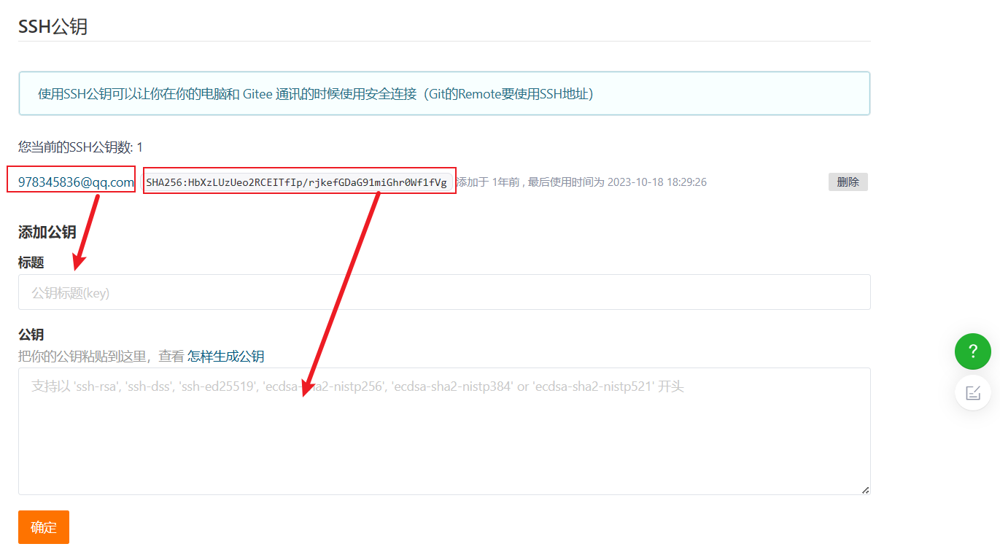

# github 公钥配置

### **1、使用ssh-keygen命令生成ssh 密钥**

```
ssh-keygen -t rsa -C "你的邮箱"
```

说明：ssh-keygen命令可以生成rsa或dsa两种格式的密钥。在上面的示例中，使用-t rsa参数生成了id_rsa和id_rsa.pub两个文件，分别表示rsa私钥和rsa公钥。同理，可以使用-t  dsa参数生成dsa私钥和dsa公钥，生成的文件名分别是：id_dsa、id_dsa.pub。


### **2、配置SSH**

将.pub里面的全部代码复制到github的SSH中


GITEE设置



### **3、测试ssh keys是否设置成功**

```
 ssh -T git@gitee.com
```

### 4、.git/config 文件配置


```
[core]
	repositoryformatversion = 0
	filemode = false
	bare = false
	logallrefupdates = true
	symlinks = false
	ignorecase = true
[submodule]
	active = .
[remote "origin"]
	url = git@gitee.com:disguisor/study-notes.git
	fetch = +refs/heads/*:refs/remotes/origin/*
[branch "master"]
	remote = origin
	merge = refs/heads/master
[lfs]
	repositoryformatversion = 0

```


### 5、.gitconfig 文件配置


# GitHub Desktop配置


