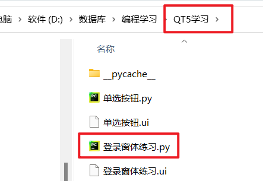

# 加载Ui文件

## 动态加载Ui文件

```python
from PyQt5 import uic

class Stats:

    def __init__(self):
        # 从文件中加载UI定义
        uic.loadUi('内置信号和槽使用.ui',self)

白月黑羽建议：通常采用动态加载比较方便，因为改动界面后，不需要转化，直接运行，特别方便。

但是，如果 你的程序里面有非qt designer提供的控件， 这时候，需要在代码里面加上一些额外的声明，而且 可能还会有奇怪的问题。往往就 要采用 转化Python代码的方法
```

## 静态加载Ui文件

```
from QT5学习.登录窗体练习 import Ui_Form  # 导入窗体模块


class MyMainForm(QMainWindow, Ui_Form):  # 类继承父类QMainWindow,Ui_Form
    def __init__(self, parent=None):  # 类初始化
        # super() 是用来解决多重继承问题的，直接用类名调用父类方法在使用单继承的时候没问题，
        # 但是如果使用多继承，会涉及到查找顺序（MRO）、重复调用（钻石继承）等种种问题。
        super(MyMainForm, self).__init__(parent)
        self.setupUi(self)  # 调用Ui_Form父类函数setupUi
        # 添加登录按钮信号和槽，注意display函数不加小括号
        self.login_pushButton.clicked.connect(self.display)
        # 添加退出按钮信号和槽，调用close函数
        self.cancel_pushButton.clicked.connect(self.close)  # close关闭函数
```

