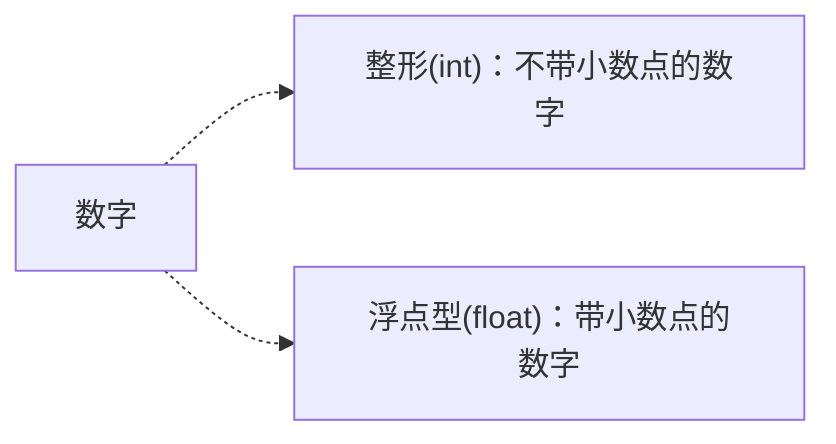
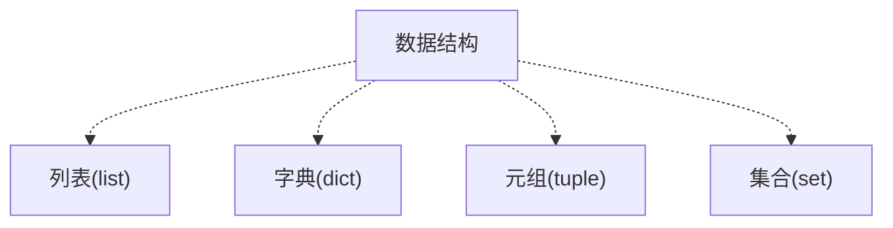
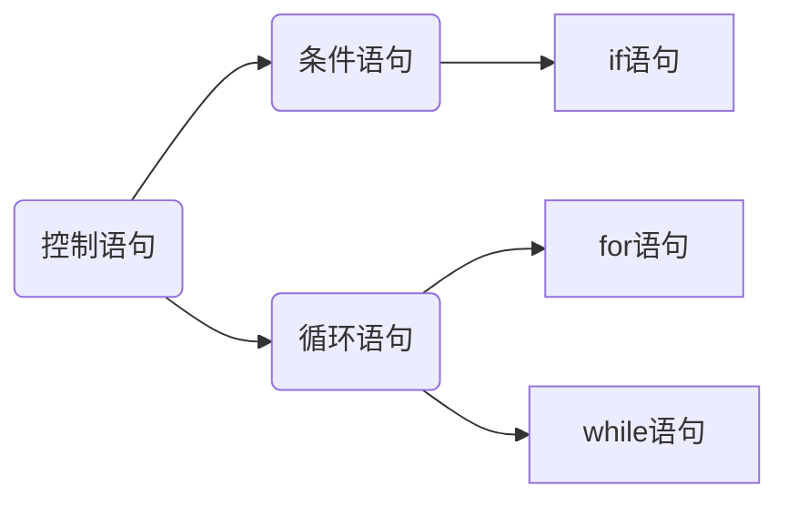

# 一、安装Python

网上教程很多，可以自行百度。

# 二、编辑器的选择

推荐使用PyCharm

# 三、基本概念

## 3.1 常量

​	值不能改变的数据

## 3.2 变量

变量的命名规则：

- 必须以字母或下划线开头，建议英文字母开头，如：name、name_1
- 禁止用Python的关键字或内置函数命名，如：print
- 建议：使用英文字母和数字组成变量，变量名要有一定的意义，能够直观地描述变量所代表的数据内容。

注：定义变量时不需要指明变量的数据类型，Python会自动识别。

## 3.3 数据类型

基本数据类型：数字、字符串。

### 3.3.1、数字



### 3.3.2、字符串(str)

- 单引号(‘ ’)
- 双引号(“ ”)
- 三引号(“”“ ”“”)
- 转义字符(反斜杠+想要实现的转义功能首字母)，如：\n
- 自然字符串：通过给字符串加上前缀r或R来指定
- Unicode字符串 ：在字符串前加上前缀u或U
- 字符串是不可变的
- 按字面意义级连字符串

## 3.4 数据结构

数据结构：列表、字典、元组、集合




### 3.4.1 列表

语法格式：列表名 = [元素1, 元素2,·······]

元素类型: 字符串、数字、列表

> 提取列表单个元素：列表名[序号]
>
> 提取列表多个元素：列表切片（左闭右开）
>
> 提取列表所有元素：``for 变量  in 列表名:``

### 3.4.2 字典

语法格式：字典名 = {键1 : 值1, 键2 : 值2, ········}

> 提取字典单个元素的值：字典名[‘键名’]
>
> 提取字典所有元素：
>
> ```
> for 变量 in 字典:
> 	print (变量（键名） + '：' + 字典名['键名'])
> ```

### 3.4.3 元组

语法格式：元组名 = (元素1, 元素2,·······)

元素类型：类似于列表

备注：元组中的元素不可修改

### 3.4.4 集合

语法格式：集合名 = set () 或 集合名 = { }

备注：集合中不会有重复元素

## 3.5 运算符

### 3.5.1 算数运算符

| 运算符 | 含义   |
| ------ | ------ |
| +      | 加     |
| -      | 减     |
| *      | 乘     |
| /      | 除     |
| **     | 幂运算 |
| //     | 取整除 |
| %      | 取模   |

### 3.5.2 字符串运算符

| 运算符 | 含义               |
| ------ | ------------------ |
| +      | 拼接字符串         |
| *      | 字符串复制指定份数 |

### 3.5.3 比较运算符

| 运算符 | 含义     |
| ------ | -------- |
| >      | 大于     |
| <      | 小于     |
| >=     | 大于等于 |
| <=     | 小于等于 |
| ==     | 等于     |
| !=     | 不等于   |

### 3.5.4 逻辑运算符

| 运算符 | 含义   |
| ------ | ------ |
| and    | 逻辑与 |
| or     | 逻辑或 |
| not    | 逻辑非 |

## 3.6 编码规范

### 3.6.1 缩进

【Tab】 缩进

【Shift + Tab】 减少缩进

### 3.6.2 注释

#### 3.6.2.1、 单行注释

以 # 号开头

> 规范：
>
> - 单行注释放在被注释代码上方时，在 # 号之后先输入一个空格，再输入注释内容
> - 单行注释放在被注释代码后时， # 号与代码之间至少有两个空格，# 号与注释之间也要有一个空格

#### 3.6.2.2、多行注释

使用3个单引号或3个双引号

## 3.7 控制语句




### 3.7.1 if语句

```python
if 条件：
	代码1
elif 条件：
	代码2
else:
	代码3
```

备注：elif、else可省略

### 3.7.2 while语句

```python
while 条件：
	要重复执行的代码
```

### 3.7.3 for循环

```
for 变量 in 序列：
```

### 3.7.4 break语句

break语句是用来 终止 循环语句的，即哪怕循环条件没有称为False或序列还没有被完全递归， 也停止执行循环语句。

### 3.7.5 continue语句

continue语句被用来告诉Python跳过当前循环块中的剩余语句，然后 继续 进行下一轮循环。

# 四、内置函数

## 4.1 数据类型查询

函数：``type()``

```python
name = "Tom"
print(type(name))
```

## 4.2 数据类型转换

- 转换成字符串：``str()``
- 转换成整型：``int()``，小数只保留整数部分
- 转换成浮点型：``float()``

## 4.3 统计列表元素个数

函数：``len()``

## 4.4 添加列表元素

函数：`append()`

```python
score = []
score.append(元素)
```

## 4.5 列表转换成字符串

函数：`join()`

语法：``‘连接符’ . join(列表名)``

```python
list = [ '张三' , '李四']
a = ' , ' .join(list)
print(a) # 张三，李四
```

## 4.6 字符串转换成列表

函数：`split()`

语法：``字符串 . split(‘分隔符’)``

```python
a = 'hi hello world'
print(a.split(' ')) # ['hi', 'hello', 'world']
```

## 4.7 遍历字典

函数：`items()`

语法：`字典名.items()`

备注：返回的是可遍历的(键，值)元组数组

## 4.8 创建整数序列

函数：`range()`

语法:range(起始值，终止值，步长)

## 4.9 字符串查找替换

函数：`replace()`

语法：字符串.replace(要查找的内容，要替换为的内容)

```python
a = '<em>面朝大海，</em>春暖花开'
a = a.replace('<em>', '')
```

## 4.10 删除字符串首尾空白字符

函数：`strip()`

语法：字符串.strip()

# 五、自定义函数

## 5.1 函数定义与调用

函数定义语法：

```python
def 函数名(参数)：
	代码
```

举例：

```python
# 定义函数,x为形式参数
def y(x):
    print(x + 1)
    
# 调用函数
y(1)
```

## 5.2 return语句

定义函数返回值，或跳出函数

## 5.3 变量作用域

### 5.3.1 局部变量

在函数定义内声明变量的时候，它们与函数外具有相同名称的其他变量没有任何关系，即 变量名称对于函数来说是 局部 的。

```python
def func(x):
    print 'x is', x
    x = 2
    print ('Changed local x to', x)
x = 50
func(x)
print 'x is still', x

# 输出结果
x is 50
Changed local x to 2
x is still 50 
```

### 5.3.2 全局变量

使用global语句声明变量为全局变量

```python
def func():
    global x
    print 'x is', x
    x = 2
    print 'Changed local x to', x
x = 50
func()
print 'Value of x is', x

# 输出结果
x is 50
Changed global x to 2
Value of x is 2 
```

## 5.4 默认参数

在函数定义的形参名后 加上赋值运算符（=）和默认值，从而给形参指定默认参数值。

==备注==：只有在形参表末尾的那些参数可以有默认参数值，例如，def func(a, b=5)是有效的，但是def func (a=5, b)是 无效 的。

举例：

```python
def say(message, times = 1):  # 参数time为默认参数 
	print message * times
say('Hello')
say('World', 5)
```

## 5.5 关键参数

通过参数名来为部分参数赋值

```python
def func(a, b=5, c=10):
	print 'a is', a, 'and b is', b, 'and c is', c
func(3, 7)
func(25, c=24)
func(c=50, a=100) 

# 输出结果
a is 3 and b is 7 and c is 10
a is 25 and b is 5 and c is 24
a is 100 and b is 5 and c is 50
```

## 5.6 不定长参数

传入的函数中实际参数可以是0个，一个，两个到任意个。

> 主要形式：
>
> - *parameter 【列表】
> - **parameter  【字典】

举例：*parameter

```python
def player(*obj):
	print(obj)

player('C罗')
player('C罗','梅西')

# 列表调用
playerlist = ['C罗','梅西']
player(*playerlist)
```


举例：**parameter

```python
def Fruits(**MyFruits):
    print("我买的水果价格：\n")
    for key,vslue in MyFruits.items():
        print('{0}:{1}'.format(key,vlue))
        
Fruits(Apple = 3.24, Grape = 3.35, Lemon = 3.67)

# 字典调用
dict1 = {'Apple' :'3.24', 'Grape' :' 3.35', 'Lemon' :'3.67'}
Fruits(**dict1)
```


## 5.7 函数说明文档

DocStrings(==文档字符串==)使你的程序文档更加简单易懂

举例：

```python
# coding=UTF-8
# Filename: func_doc.py

def sum(x, y):
    """
    2个数字求和
    :param x: 数字1
    :param y: 数字2
    :return: 2个数字和
    """
    return x + y


print(sum(2, 3))  # 调用函数
print(sum.__doc__)  # 打印函数说明文档

# 输出结果
5

    2个数字求和
    :param x: 数字1
    :param y: 数字2
    :return: 2个数字和
```

