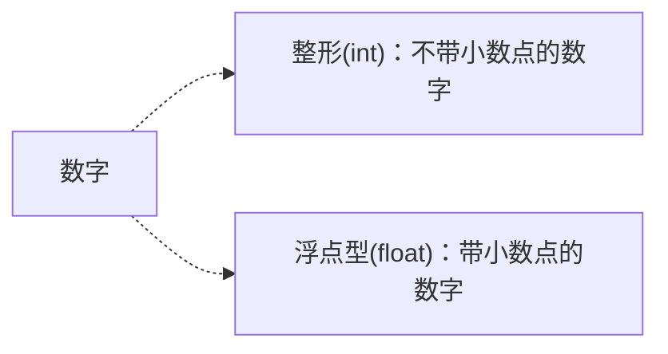
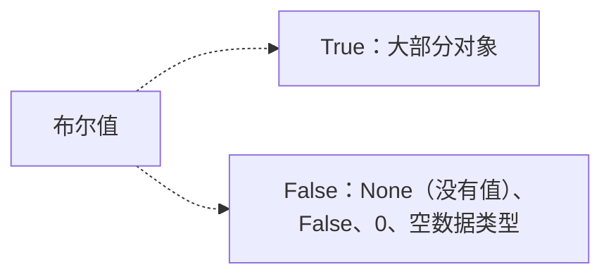
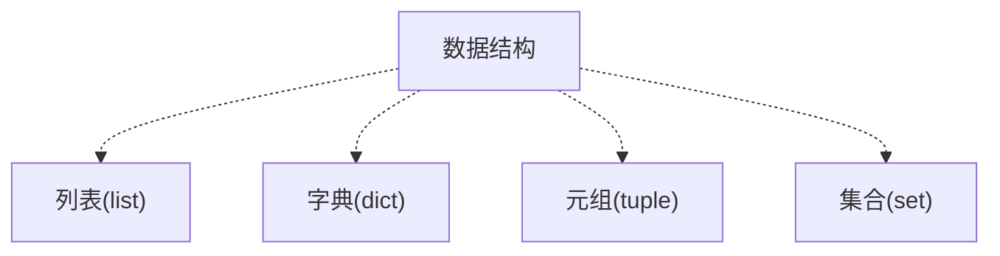
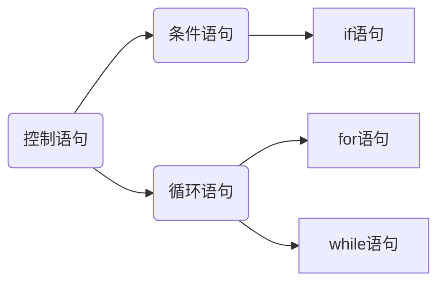
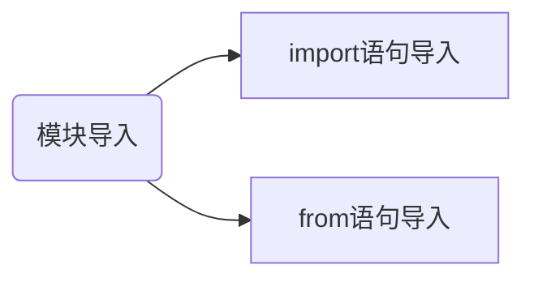
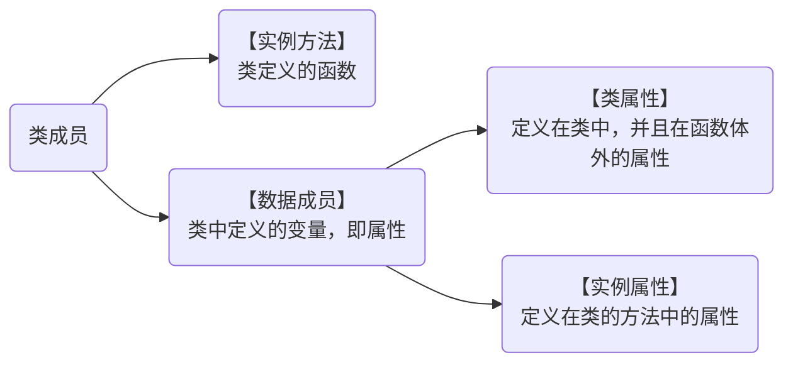
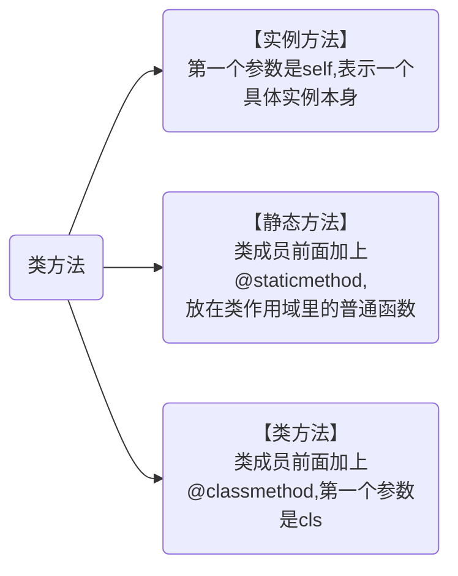

# 一、安装Python

网上教程很多，可以自行百度。

# 二、编辑器的选择

推荐使用PyCharm

## 2.1 Jupyter Notebook介绍

Anaconda自带工具，数据分析领域使用的比较多。

### 2.1.1 新建文件


### 2.1.2 运行代码


### 2.1.3 重命名文件


### 2.1.4 保存文件


### 2.1.5 导入本地文件


### 2.1.6 文本框模式


### 2.1.7 添加目录

备注：目录需要手动安装

安装方法：

> 1、打开  Anaconda Prompt （软件自带）
>
> 2、安装jupyter_contrib_nbextensions模块：输入 pip install jupyter_contrib_nbextensions
>
> 3、用户配置 jupyter contrib nbextensions install --user
>
> 4、添加目录功能 
>
> 
>
> 

### 2.1.8 自定义表格展示式样

可以根据个人喜好设置。border 是边框粗细，像素可以自己改，比如现在是1px；可以改成粗一点,5px；color：可以换成red，blue等；!important这个不要去掉，以免被其他CSS样式覆盖掉。

```HTML
%%HTML
<style type="text/css">
table.dataframe td, table.dataframe th {
    border: 2px  black solid !important;
  color: red !important;
}
```

## 2.2 Anaconda3系统变量配置

```
D:\ProgramData\anaconda3;
D:\ProgramData\anaconda3\Library\mingw-w64\bin;
D:\ProgramData\anaconda3\Library\usr\bin;
D:\ProgramData\anaconda3\Library\bin;
D:\ProgramData\anaconda3\Scripts;
```


# 三、基本概念

## 3.1 常量

​	值不能改变的数据

## 3.2 变量

变量的命名规则：

- 必须以字母或下划线开头，建议英文字母开头，如：name、name_1
- 禁止用Python的关键字或内置函数命名，如：print
- 建议：使用英文字母和数字组成变量，变量名要有一定的意义，能够直观地描述变量所代表的数据内容。

注：定义变量时不需要指明变量的数据类型，Python会自动识别。

## 3.3 数据类型

基本数据类型：数字、字符串。

### 3.3.1、数字



### 3.3.2、字符串(str)

- 单引号(‘ ’)

- 双引号(“ ”)

- 三引号(“”“ ”“”)

- 转义字符(反斜杠+想要实现的转义功能首字母)，如：\n

- 自然字符串：通过给字符串加上前缀r或R来指定

- Unicode字符串 ：在字符串前加上前缀u或U

- 字符串是不可变的

- 按字面意义级连字符串

- 输出格式设置

  - 一对一填充：`print('我在学习:{}'.format('python 基础知识'))`

  - 多对多填充：`print('我在学习:{0}中的{1}'.format('python数据分析','python 基础知识'))`

  - 浮点数设置：`print('{}约{:.2f}亿'.format('python数据分析',2))`，说明：.2f[^注1]

  - 百分数设置：`print('中国男性占总人口的比例：{:.2%}亿'.format(0.122))`，说明：.2%[^注2]

    

### 3.3.3、布尔值




## 3.4 数据结构

数据结构：列表、字典、元组、集合




### 3.4.1 列表

语法格式：列表名 = [元素1, 元素2,·······]

元素类型: 字符串、数字、列表

> 提取列表单个元素：列表名[序号]
>
> 提取列表多个元素：列表切片（左闭右开）
>
> 提取列表所有元素：``for 变量  in 列表名:``

### 3.4.2 字典

语法格式：字典名 = {键1 : 值1, 键2 : 值2, ········}

> 提取字典单个元素的值：字典名[‘键名’]
>
> 提取字典所有元素：
>
> ```
> for 变量 in 字典:
> 	print (变量（键名） + '：' + 字典名['键名'])
> ```

### 3.4.3 元组

语法格式：元组名 = (元素1, 元素2,·······)

元素类型：类似于列表

备注：元组中的元素不可修改

### 3.4.4 集合

语法格式：集合名 = set () 或 集合名 = { }

备注：集合中不会有重复元素

## 3.5 运算符

### 3.5.1 算数运算符

| 运算符 | 含义   |
| ------ | ------ |
| +      | 加     |
| -      | 减     |
| *      | 乘     |
| /      | 除     |
| **     | 幂运算 |
| //     | 取整除 |
| %      | 取模   |

### 3.5.2 字符串运算符

| 运算符 | 含义               |
| ------ | ------------------ |
| +      | 拼接字符串         |
| *      | 字符串复制指定份数 |

### 3.5.3 比较运算符

| 运算符 | 含义     |
| ------ | -------- |
| >      | 大于     |
| <      | 小于     |
| >=     | 大于等于 |
| <=     | 小于等于 |
| ==     | 等于     |
| !=     | 不等于   |

### 3.5.4 逻辑运算符

| 运算符 | 含义   |
| ------ | ------ |
| and    | 逻辑与 |
| or     | 逻辑或 |
| not    | 逻辑非 |

## 3.6 编码规范

### 3.6.1 缩进

【Tab】 缩进

【Shift + Tab】 减少缩进

### 3.6.2 注释

#### 3.6.2.1、 单行注释

以 # 号开头

> 规范：
>
> - 单行注释放在被注释代码上方时，在 # 号之后先输入一个空格，再输入注释内容
> - 单行注释放在被注释代码后时， # 号与代码之间至少有两个空格，# 号与注释之间也要有一个空格

#### 3.6.2.2、多行注释

使用3个单引号或3个双引号

## 3.7 控制语句




### 3.7.1 if语句

```python
if 条件：
	代码1
elif 条件：
	代码2
else:
	代码3
```

备注：elif、else可省略

### 3.7.2 while语句

```python
while 条件：
	要重复执行的代码
```

### 3.7.3 for循环

```
for 变量 in 序列：
```

### 3.7.4 break语句

break语句是用来 终止 循环语句的，即哪怕循环条件没有称为False或序列还没有被完全递归， 也停止执行循环语句。

### 3.7.5 continue语句

continue语句被用来告诉Python跳过当前循环块中的剩余语句，然后 继续 进行下一轮循环。

### 3.7.6 推导式

- 列表推导式

  ```python
  # 挑出美元在后面的元素
  # for结构
  currency = ["USDJPY", "USDGBP", "USDCHF", "USDCAD", "AUDUSD", "NZDUSD"]
  
  usd = []
  for pair in currency:
      if pair[3:] == "USD":
          usd.append(pair[:3])
  print(usd)  # ["AUD", "NZD"]
  
  # 列表推导式
  [pair[:3] for pair in currency if pair[3:] == "USD"]  # ["AUD", "NZD"]
  ```

- 字典推导式

  ```python
  exchange = {"EURUSD" : 1.1152,
             	"GBPUSD" : 1.2454,
              "AUDUSD" : 0.6161}
  {k: v *100 for (k, v) in exchange.items()}  # "EURUSD" :111.52,"GBPUSD": 124.54,"AUDUSD": 61.61"
  ```

- 集合推导式

  ```python
  {s + "USD" for s in ["EUR", "GBP", "EUR", "NZD", "NZD"]}  # {"EURUSD", "GBPUSD", "NZDUSD"}
  ```

  

# 四、内置函数

## 4.1 数据类型查询

函数：``type()``

```python
name = "Tom"
print(type(name))
```

## 4.2 数据类型转换

- 转换成字符串：``str()``
- 转换成整型：``int()``，小数只保留整数部分
- 转换成浮点型：``float()``

## 4.3 统计列表元素个数

函数：``len()``

## 4.4 添加列表元素

### 4.4.1 在列表末尾添加元素

函数：`append()`

```python
score = []
score.append(元素)
```

### 4.4.2 在列表指定位置添加元素

函数：`insert()`

```
score = []
score.insert(指定位置,指定元素)
```


## 4.5 列表转换成字符串

函数：`join()`

语法：``‘连接符’ . join(列表名)``

```python
list = [ '张三' , '李四']
a = ' , ' .join(list)
print(a) # 张三，李四
```

## 4.6 字符串转换成列表

函数：`split()`

语法：``字符串 . split(‘分隔符’)``

```python
a = 'hi hello world'
print(a.split(' ')) # ['hi', 'hello', 'world']
```

## 4.7 遍历字典

函数：`items()`

语法：`字典名.items()`

备注：返回的是可遍历的(键，值)元组数组

## 4.8 创建整数序列

函数：`range()`

语法:range(起始值，终止值，步长)

## 4.9 字符串查找替换

函数：`replace()`

语法：字符串.replace(要查找的内容，要替换为的内容)

```python
a = '<em>面朝大海，</em>春暖花开'
a = a.replace('<em>', '')
```

## 4.10 删除字符串首尾字符

函数：`strip()`

语法：字符串.strip()

## 4.11 迭代器

函数：`iter()`

语法：iter(object[, sentinel])

```python
lst = [1, 2, 3]
	for i in iter(lst):
    print(i)  # 1	2	3
```

## 4.12 字母转化成大写

函数：`upper()`

语法：str.upper()

```
"python".upper()  # PYTHON
```

## 4.13 字母转化成小写

函数：`lower()`

语法：str.lower()

```
"PYTHON".lower()  # python
```

## 4.14 列表合并

函数：`extend()`

语法：list.extend()

# 五、自定义函数

## 5.1 函数定义与调用

函数定义语法：

```python
def 函数名(参数)：
	代码
```

举例：

```python
# 定义函数,x为形式参数
def y(x):
    print(x + 1)
    
# 调用函数
y(1)
```

## 5.2 return语句

定义函数返回值，或跳出函数

## 5.3 变量作用域

### 5.3.1 局部变量

在函数定义内声明变量的时候，它们与函数外具有相同名称的其他变量没有任何关系，即 变量名称对于函数来说是 局部 的。

```python
def func(x):
    print 'x is', x
    x = 2
    print ('Changed local x to', x)
x = 50
func(x)
print 'x is still', x

# 输出结果
x is 50
Changed local x to 2
x is still 50 
```

### 5.3.2 全局变量

使用global语句声明变量为全局变量

```python
def func():
    global x
    print 'x is', x
    x = 2
    print 'Changed local x to', x
x = 50
func()
print 'Value of x is', x

# 输出结果
x is 50
Changed global x to 2
Value of x is 2 
```

## 5.4 默认参数

在函数定义的形参名后 加上赋值运算符（=）和默认值，从而给形参指定默认参数值。

==备注==：只有在形参表末尾的那些参数可以有默认参数值，例如，def func(a, b=5)是有效的，但是def func (a=5, b)是 无效 的。

举例：

```python
def say(message, times = 1):  # 参数time为默认参数 
	print message * times
say('Hello')
say('World', 5)
```

## 5.5 关键参数

通过参数名来为部分参数赋值

```python
def func(a, b=5, c=10):
	print 'a is', a, 'and b is', b, 'and c is', c
func(3, 7)
func(25, c=24)
func(c=50, a=100) 

# 输出结果
a is 3 and b is 7 and c is 10
a is 25 and b is 5 and c is 24
a is 100 and b is 5 and c is 50
```

## 5.6 不定长参数

传入的函数中实际参数可以是0个，一个，两个到任意个。

> 主要形式：
>
> - *parameter 【列表】
> - **parameter  【字典】

举例：*parameter

```python
def player(*obj):
	print(obj)

player('C罗')
player('C罗','梅西')

# 列表调用
playerlist = ['C罗','梅西']
player(*playerlist)
```


举例：**parameter

```python
def Fruits(**MyFruits):
    print("我买的水果价格：\n")
    for key,vslue in MyFruits.items():
        print('{0}:{1}'.format(key,vlue))
        
Fruits(Apple = 3.24, Grape = 3.35, Lemon = 3.67)

# 字典调用
dict1 = {'Apple' :'3.24', 'Grape' :' 3.35', 'Lemon' :'3.67'}
Fruits(**dict1)
```


## 5.7 函数说明文档

DocStrings(==文档字符串==)使你的程序文档更加简单易懂

举例：

```python
# coding=UTF-8
# Filename: func_doc.py

def sum(x, y):
    """
    2个数字求和
    :param x: 数字1
    :param y: 数字2
    :return: 2个数字和
    """
    return x + y


print(sum(2, 3))  # 调用函数
print(sum.__doc__)  # 打印函数说明文档

# 输出结果
5

    2个数字求和
    :param x: 数字1
    :param y: 数字2
    :return: 2个数字和
```

## 5.8 匿名函数

使用` lambda `来创建匿名函数

语法：

```python
lambda [arg1 [,arg2,.....argn]]:expression
```

举例：

```python
sum = lambda arg1, arg2: arg1 + arg2
 
# 调用sum函数
print "相加后的值为 : ", sum( 10, 20 )
print "相加后的值为 : ", sum( 20, 20 )
```

# 六、模块

## 6.1 模块来源

### 6.1.1 内置模块

Python自带模块，如：sys、time、math等

### 6.1.2 第三方开源模块

由一些程序员或企业开发并免费分享给大家使用，使用需要安装

模块安装：

#### 6.1.2.1 pip工具

> - pip安装
>
>   > - 默认软件自带
>   >
>   > - 手动安装
>   >
>   >   > 1. 将 pip-9.0.1.tar.gz解压到目录 比如C:/test 目录
>   >   >
>   >   > 2. 然后使用管理员身份打开cmd窗口，cd C:/test 目录，执行 python setup.py install
>   >   >
>   >   > 3. 执行完毕后 切换到 python 安装目录的scripts下，执行这个命令查看安装结果 pip --version
>   >   >
>   >   > 4. 至此 以后就可以使用 pip安装 python的各种包了
>   >   >
>   >   > 查看pip的版本，判断pip是否安装
>   >   > pip --version
>
>   
>
> - pip使用
>
>   > - 安装模块
>   >
>   >   > pip install 模块名
>   >   > pip install 模块名==版本号 
>   >   > pip install -i https://pypi.tuna.tsinghua.edu.cn/simple 模块名
>   >
>   > - 卸载模块
>   >
>   >   > pip uninstall 模块名
>   >
>   > - 其他
>   >
>   >   > pip list                      #列出已经安装的模块
>   >   > pip list -o                   #列出可升级的模块
>   >   > pip install -U 模块名          #升级模块
>   >   > pip install pip-review		#批量更新包工具
>   >   > pip-review --local interactive #批量更新包

#### 6.1.2.2 pipenv工具

​		[使用方法详见](../python/虚拟环境建立/pipenv虚拟环境.md)

### 6.1.3 自定义模块

用户可以将自己编写的代码或函数封装成模块

==注意：==自定义模块不能和内置模块重名

## 6.2 模块导入



### 6.2.1 import 语句导入

导入指定模块中的所有函数，适用于需要使用指定模块中的==大量函数==的情况，调用函数时需要在函数名前==加上模块名==的前缀。

语法格式：

```python
import 模块名
```

举例:

```python
import math
a = math.sqrt(16)
print(a)
```

### 6.2.2 from 语句导入

导入指定模块中的指定函数，适用于只需要使用模块中的==少数几个函数==，调用函数时直接写出函数名，==无需添加模块名==前缀。

```python
from 模块名 import 函数名
```

举例：

```ptyhon
from math import sqrt
a = sqrt(16)
print(a)
```

备注：可以使用“ * ”代替函数名，代表模块下面所有函数

### 6.2.3 关键字 as

导入模块或函数时可以使用关键字as简化

举例：

```python
import xlwings as xw
from math import factorial as fc
```

# 七、异常处理

## 7.1 标准异常

| 异常名称                  | 描述                                               |
| ------------------------- | -------------------------------------------------- |
| BaseException             | 所有异常的基类                                     |
| SystemExit                | 解释器请求退出                                     |
| KeyboardInterrupt         | 用户中断执行(通常是输入^C)                         |
| Exception                 | 常规错误的基类                                     |
| StopIteration             | 迭代器没有更多的值                                 |
| GeneratorExit             | 生成器(generator)发生异常来通知退出                |
| StandardError             | 所有的内建标准异常的基类                           |
| ArithmeticError           | 所有数值计算错误的基类                             |
| FloatingPointError        | 浮点计算错误                                       |
| OverflowError             | 数值运算超出最大限制                               |
| ZeroDivisionError         | 除(或取模)零 (所有数据类型)                        |
| AssertionError            | 断言语句失败                                       |
| AttributeError            | 对象没有这个属性                                   |
| EOFError                  | 没有内建输入,到达EOF 标记                          |
| EnvironmentError          | 操作系统错误的基类                                 |
| IOError                   | 输入/输出操作失败                                  |
| OSError                   | 操作系统错误                                       |
| WindowsError              | 系统调用失败                                       |
| ImportError               | 导入模块/对象失败                                  |
| LookupError               | 无效数据查询的基类                                 |
| IndexError                | 序列中没有此索引(index)                            |
| KeyError                  | 映射中没有这个键                                   |
| MemoryError               | 内存溢出错误(对于Python 解释器不是致命的)          |
| NameError                 | 未声明/初始化对象 (没有属性)                       |
| UnboundLocalError         | 访问未初始化的本地变量                             |
| ReferenceError            | 弱引用(Weak reference)试图访问已经垃圾回收了的对象 |
| RuntimeError              | 一般的运行时错误                                   |
| NotImplementedError       | 尚未实现的方法                                     |
| SyntaxError               | Python 语法错误                                    |
| IndentationError          | 缩进错误                                           |
| TabError                  | Tab 和空格混用                                     |
| SystemError               | 一般的解释器系统错误                               |
| TypeError                 | 对类型无效的操作                                   |
| ValueError                | 传入无效的参数                                     |
| UnicodeError              | Unicode 相关的错误                                 |
| UnicodeDecodeError        | Unicode 解码时的错误                               |
| UnicodeEncodeError        | Unicode 编码时错误                                 |
| UnicodeTranslateError     | Unicode 转换时错误                                 |
| Warning                   | 警告的基类                                         |
| DeprecationWarning        | 关于被弃用的特征的警告                             |
| FutureWarning             | 关于构造将来语义会有改变的警告                     |
| OverflowWarning           | 旧的关于自动提升为长整型(long)的警告               |
| PendingDeprecationWarning | 关于特性将会被废弃的警告                           |
| RuntimeWarning            | 可疑的运行时行为(runtime behavior)的警告           |
| SyntaxWarning             | 可疑的语法的警告                                   |
| UserWarning               | 用户代码生成的警告                                 |

## 7.2 捕获异常

### 7.2.1 不带异常类型

==不能通过该程序识别出具体的异常信息。因为它捕获所有的异常。==

```python
try:
    正常的操作
   ......................
except:
    发生异常，执行这块代码
   ......................
else:  # 可省略
    如果没有异常执行这块代码
```

### 7.2.2 带异常类型

```python
try:
    正常的操作
   ......................
except(Exception1[, Exception2[,...ExceptionN]]):
   发生以上多个异常中的一个，执行这块代码
   ......................
else:  # 可省略
    如果没有异常执行这块代码
```

## 7.3 异常处理

```python
try:
    正常的操作
   ......................
except(Exception1[, Exception2[,...ExceptionN]]):
   发生以上多个异常中的一个，执行这块代码
   ......................
finally:  # 可省略
    任何情况都执行
```

## 7.4 抛出异常

我们可以使用raise语句自己抛出异常

raise语法格式如下：

```
raise [Exception [, args [, traceback]]]
```

语句中 Exception 是异常的类型（例如，NameError）参数标准异常中任一种，args 是自已提供的异常参数。

最后一个参数是可选的（在实践中很少使用），如果存在，是跟踪异常对象。

## 7.5 自定义异常

通过创建一个新的异常类，程序可以命名它们自己的异常。异常应该是典型的继承自Exception类，通过直接或间接的方式。

# 八、面向对象

程序设计的三个基本特征：

- 封装：面向对象编程的核心思想，将对象的属性和行为封装起来，其载体就是类。
- 继承：子类通过继承复用父类的属性和行为，同时添加子类特有的属性和行为。
- 多态：将父类对象应用于子类的特征就是多态。

备注：在对象中==变量==被称作==属性==（访问对象数据），==函数==被称作==方法==（执行某种操作）

## 8.1 类

### 8.1.1 类定义

语法：

```python
class CassName:  # 类名称采用“驼峰式命名”
    "类的帮助信息"
    stattement  # 类体
```

### 8.1.2 类初始化方法

`__init__`当创建了类的实例时就会调用该方法

举例：

```python
# coding=UTF-8
# Filename: Class.py

class Car:
    """汽车类"""

    def __init__(self):
        print("我是汽车")


CarObj = Car()  # 我是汽车
```

### 8.1.3 创造类成员



#### 8.1.3.1 创建实例方法并访问

实例方法：类定义的函数

语法格式：

```python
def functionName(self, parameterlist):
    blok
    
"""
functionName: 方法名，一般使用小写字母开头
self: 必要参数，表示类的实例
parameterlist：用于指定初self参数以外的参数，各参数间使用逗号“，”分隔
blok:方法体，实现具体功能
"""
```

#### 8.1.3.2 创建数据成员

数据成员:类中定义的变量，即属性

根据定义位置分为：

- 类属性：定义在类中，并且在函数体外的属性
- 实例属性：定义在类的方法中的属性

举例：类属性

```python
class People(object):
    name = "Jack"  # 类属性（公有）
    country = "China"
    def __int__(self):
        print("构造函数自动调用：", People.country)
        
print(People.country)  # 通过类对象，打印类属性： country 输出为China
p = People()  # 创建实例化对象
print(p.country)  # 通过实例化的对象，打印类属性： country 输出China
p.country = "England"  # 通过实例化对象修改
print(p.country)  # 通过实例化的对象，打印类属性： country 输出England
print(People.country)  # 通过实例化的对象，打印类属性： country 输出China
del p.country  # 删除实例属性
print(p.country)  # 实例属性被删除后，再调用同名称的属性，会调用类属性：China
```

举例：实例属性

```python
class People(object):
    address = "南京"  # 类属性
    
    def __int__(self):
        self.name = "xiaowang"  # 实例属性
        self.age = 20  # 实例属性
```

### 8.1.4 类访问限制

- `__foo__`：首尾双下划线表示定义特殊方法，一般是系统定义名字，如 `__int_()`
- `_foo`：单下划线开关的表示protected(保护)类型成员，只允许类本身和子类、类实例访问，不能使用”from module import * “语句导入
- `__foo`：双下划线表示prviate(私有)定类型的成员，只允许定义该方法的类本身访问，不能通过类的实例访问，但可以通过”类的实例名.类名__XXX“方式访问。

protected(保护)类型成员

```
class people_test:
    def __init__(self, name, age):  # 构造函数
        self.name = name
        self.age = age

    _features = "直立行走"  # 定义类的属性
    brain = "智商较高"  # 定义类的属性

    def detail(self):  # 实例化的方法
        print(self.name)
        print(self.age)
        print(people_test._features)
        print(people_test.brain)


t1 = people_test("张三", 12)  # 实例化
print(t1._features)  # 访问保护属性，直立行走
print(people_test._features)  # 访问保护属性，直立行走
```

prviate(私有)定类型的成员

```
# coding=UTF-8
# Filename: XXXXX.py


class people_test:
    def __init__(self, name, age):  # 构造函数
        self.name = name
        self.age = age

    __features = "直立行走"  # 定义类的属性
    brain = "智商较高"  # 定义类的属性

    def detail(self):  # 实例化的方法
        print(self.name)
        print(self.age)
        print(people_test._features)
        print(people_test.brain)


t1 = people_test("张三", 12)  # 实例化
print(t1._people_test__features)  # 可以法访问，直立行走
```

### 8.1.5 类语法




# 九、Python 项目开发规范

## 9.1 新建工程初始文件

工程包含：`__init__.py`、`main.py`文件

- `__init__.py`文件:

- `main.py`文件：用于脚本代码的编写，是工程的主入口，必须定义一个execute(**kw)函数作为脚本程序的主入口


[^注1]: .2f ：表示以浮点型展示，且显示小数点后两位
[^注2]: .2%：表示以百分比的形式展示，且显示小数点后两位
