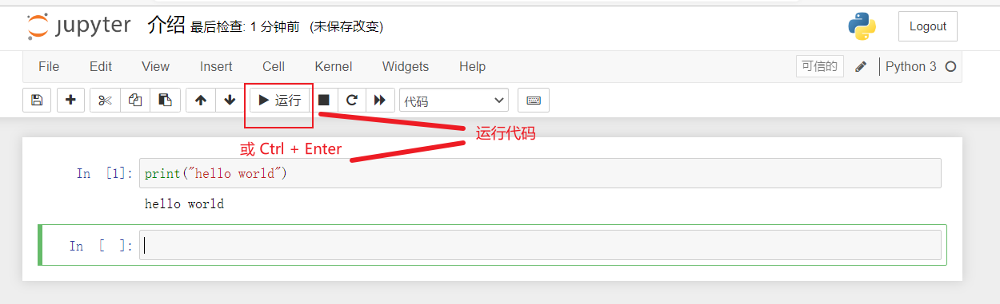

Python ==**官方文档**== https://docs.python.org/zh-cn/3.11/archives/python-3.11.0-docs-pdf-a4.zip

# 一、安装Python

网上教程很多，可以自行百度。

# 二、编辑器的选择

推荐使用PyCharm

## 2.1 Jupyter Notebook介绍

Anaconda自带工具，数据分析领域使用的比较多。

### 2.1.1 新建文件


### 2.1.2 运行代码



### 2.1.3 重命名文件


### 2.1.4 保存文件


### 2.1.5 导入本地文件


### 2.1.6 文本框模式


### 2.1.7 添加目录

备注：目录需要手动安装

安装方法：

> 1、打开  Anaconda Prompt （软件自带）
>
> 2、安装jupyter_contrib_nbextensions模块：输入 pip install jupyter_contrib_nbextensions
>
> 3、用户配置 jupyter contrib nbextensions install --user
>
> 4、添加目录功能 
>
> 
>
> 

### 2.1.8 自定义表格展示式样

可以根据个人喜好设置。border 是边框粗细，像素可以自己改，比如现在是1px；可以改成粗一点,5px；color：可以换成red，blue等；!important这个不要去掉，以免被其他CSS样式覆盖掉。

```HTML
%%HTML
<style type="text/css">
table.dataframe td, table.dataframe th {
    border: 2px  black solid !important;
  color: red !important;
}
```

## 2.2 Anaconda3系统变量配置

```
D:\ProgramData\anaconda3;
D:\ProgramData\anaconda3\Library\mingw-w64\bin;
D:\ProgramData\anaconda3\Library\usr\bin;
D:\ProgramData\anaconda3\Library\bin;
D:\ProgramData\anaconda3\Scripts;

D:\ProgramData\anaconda3;
D:\ProgramData\anaconda3\Library;
D:\ProgramData\anaconda3\Scripts;
```

## 2.3 PyCharm 配置

### 2.3.1 外部工具-QT5 配置


```
实参：    -o $FileNameWithoutExtension$.py $FileName$
```

### 2.3.2 文件代码模板

```
#!/usr/bin/env python
# -*- coding: utf-8 -*-
# @File    : ${NAME}.py
# @Time    : ${DATE} ${TIME}
# @Author  : 978345836@qq.com
# @Software: win11 python3.9
# @Describe: 

def execute(**kw):
    """
    脚本程序主入口
    :param kw: 参数
    :return: 运行结果
    """
    pass
if __name__ == '__main__':
    execute()
```


# 三、基本概念

## 3.1 常量

​	值不能改变的数据

## 3.2 变量

变量的命名规则：

- 必须以字母或下划线开头，建议英文字母开头，如：name、name_1
- 禁止用Python的关键字或内置函数命名，如：print
- 建议：使用英文字母和数字组成变量，变量名要有一定的意义，能够直观地描述变量所代表的数据内容。

注：定义变量时不需要指明变量的数据类型，Python会自动识别。

## 3.3 数据类型

基本数据类型：数字、字符串。

### 3.3.1、数字


### 3.3.2、字符串(str)

- 单引号(‘ ’)
- 双引号(“ ”)
- 三引号(“”“ ”“”)
- 转义字符(反斜杠+想要实现的转义功能首字母)，如：\n
- 字符串是不可变的
- 按字面意义级连字符串
- 输出格式设置

  - 一对一填充：`print('我在学习:{}'.format('python 基础知识'))`

  - 多对多填充：`print('我在学习:{0}中的{1}'.format('python数据分析','python 基础知识'))`

  - 浮点数设置：`print('{}约{:.2f}亿'.format('python数据分析',2))`，说明：.2f[^注1]

  - 百分数设置：`print('中国男性占总人口的比例：{:.2%}亿'.format(0.122))`，说明：.2%[^注2]


#### 字符串前缀

##### 1.前加 u

```
例子：u"字符串中有中文"
含义：
前缀u表示该字符串是[unicode]编码，Python2中用，用在含有中文字符的字符串前，防止因为编码问题，导致中文出现乱码。另外一般要在文件开关标明编码方式采用utf8。
Python3中，所有字符串默认都是unicode字符串。
```

##### 2. 字符串前加 r

```
例子：r"\n\t"
含义：
在普通字符串中，反斜线是[转义符]，代表一些特殊的内容，如换行符\n。
前缀r表示该字符串是原始字符串，即\不是转义符，只是单纯的一个符号。
常用于特殊的字符如换行符、正则表达式、文件路径。
注意不能在原始字符串结尾输入反斜线，否则Python不知道这是一个字符还是换行符(字符串最后用\表示换行)，会报错：
SyntaxError: EOL while scanning string literal
那如果是一个文件夹路径就是以\结尾怎么办呢，可以再接一个转义\的字符串：
print(r'C:\Program File\my\path''\\') C:\Program File\my\path\
```

##### 3. 字符串前加 b

```
例子：b'## Hello World!' 
含义：
前缀b表示该字符串是bytes类型。
用在Python3中，Python3里默认的str是unicode类。Python2的str本身就是bytes类，所以可不用。
常用在如网络编程中，服务器和浏览器只认bytes类型数据。如：send 函数的参数和 recv 函数的返回值都是 bytes 类型。
在 Python3 中，bytes 和 str 的互相转换方式是
str.encode('utf-8')
bytes.decode('utf-8')
```

##### 4. 字符串前加 f

```
例子：
\>>> account = '测试工程师小站'

\>>> month = '30'

\>>> f'我的微信公众号是：{account}，已经连续发文{int(month) * 5}天啦！'

'我的微信公众号是：测试工程师小站，已经连续发文150天啦！'
含义：
Python3.6新加特性，前缀f用来格式化字符串。可以看出f前缀可以更方便的格式化字符串,比format()方法可读性高且使用方便。
而且加上f前缀后,支持在大括号内,运行Python表达式。
你还可以用fr前缀来表示原生字符串。
```


### 3.3.3、布尔值


## 3.4 数据结构

数据结构：列表、字典、元组、集合


### 3.4.1 列表

语法格式：列表名 = [元素1, 元素2,·······]

元素类型: 字符串、数字、列表

> 提取列表单个元素：列表名[序号]
>
> 提取列表多个元素：列表切片（左闭右开）
>
> 提取列表所有元素：``for 变量  in 列表名:``

####  列表方法详解

列表数据类型支持很多方法，列表对象的所有方法所示如下：

- ` list.append(x) `

  > 在列表末尾添加一个元素，相当于 a[len(a):] = [x] 。 

- `list.extend(iterable)` 

  > 用可迭代对象的元素扩展列表。相当于 a[len(a):] = iterable 。 

- `list.insert(i, x)` 

  > 在指定位置插入元素。第一个参数是插入元素的索引，因此，a.insert(0, x) 在列表开头插入 元素，a.insert(len(a), x) 等同于 a.append(x) 。 

- `list.remove(x)` 

  > 从列表中删除第一个值为 x 的元素。未找到指定元素时，触发 ValueError 异常。 

- `list.pop([i])` 

  > 删除列表中指定位置的元素，并返回被删除的元素。未指定位置时，a.pop() 删除并返回列表的 最后一个元素。（方法签名中 i 两边的方括号表示该参数是可选的，不是要求输入方括号。这种表 示法常见于 Python 参考库）。

- ` list.clear()` 

  > 删除列表里的所有元素，相当于 del a[:] 。

- `list.index(x[, start[, end ] ])` 

  > 返回列表中第一个值为 x 的元素的零基索引。未找到指定元素时，触发 ValueError 异常。 可选参数 start 和 end 是切片符号，用于将搜索限制为列表的特定子序列。返回的索引是相对于整 个序列的开始计算的，而不是 start 参数。

- ` list.count(x) `

  > 返回列表中元素 x 出现的次数。

- `list.sort(*, key=None, reverse=False)` 

  > 就地排序列表中的元素（要了解自定义排序参数，详见 sorted()）。 

- `list.reverse()` 

  > 翻转列表中的元素。

- list.copy() 

  > 返回列表的浅拷贝。相当于 a[:] 。

#### 用列表实现堆栈

使用列表方法实现堆栈非常容易，最后插入的最先取出（“后进先出”）。把元素添加到堆栈的顶端，使用 append() 。从堆栈顶部取出元素，使用 pop() ，不用指定索引。例如：

```python
stack = [3, 4, 5]
==============插入===================
stack.append(6)
stack.append(7)
stack
++++++++++++++++++++++++++++++++++++
[3, 4, 5, 6, 7]
===============取出==================
stack.pop()
++++++++++++++++++++++++++++++++++++
7
===============显示==================
stack
++++++++++++++++++++++++++++++++++++
[3, 4, 5, 6]
===============取出==================
stack.pop()
++++++++++++++++++++++++++++++++++++
6
===============取出==================
stack.pop()
++++++++++++++++++++++++++++++++++++
5
===============显示==================
stack
++++++++++++++++++++++++++++++++++++
[3, 4]
```

#### 用列表实现队列

列表也可以用作队列，最先加入的元素，最先取出（“先进先出”）；然而，列表作为队列的效率很低。因为，在列表末尾添加和删除元素非常快，但在列表开头插入或移除元素却很慢（因为所有其他元素都必 须移动一位）。 

实现队列最好用 collections.deque，可以快速从两端添加或删除元素。例如：

```
from collections import deque

queue = deque(["Eric", "John", "Michael"])
==============插入===================
queue.append("Terry")  # Terry arrives
queue.append("Graham")  # Graham arrives
===============取出==================
print(queue.popleft()) # The first to arrive now leaves
++++++++++++++++++++++++++++++++++++
'Eric'
===============取出==================
print(queue.popleft())  # The second to arrive now leaves
++++++++++++++++++++++++++++++++++++
'John'
===============显示==================
print(queue)  # Remaining queue in order of arrival
++++++++++++++++++++++++++++++++++++
deque(['Michael', 'Terry', 'Graham'])
```

####  列表推导式


### 3.4.2 字典

语法格式：字典名 = {键1 : 值1, 键2 : 值2, ········}

> 提取字典单个元素的值：字典名[‘键名’]
>
> 提取字典所有元素：
>
> ```
> for 变量 in 字典:
> 	print (变量（键名） + '：' + 字典名['键名'])
> ```

### 3.4.3 元组

语法格式：元组名 = (元素1, 元素2,·······)

元素类型：类似于列表

备注：元组中的元素不可修改

### 3.4.4 集合

语法格式：集合名 = set () 或 集合名 = { }

备注：集合中不会有重复元素

## 3.5 运算符

### 3.5.1 算数运算符

| 运算符 | 含义   |
| ------ | ------ |
| +      | 加     |
| -      | 减     |
| *      | 乘     |
| /      | 除     |
| **     | 幂运算 |
| //     | 取整除 |
| %      | 取模   |

### 3.5.2 字符串运算符

| 运算符 | 含义               |
| ------ | ------------------ |
| +      | 拼接字符串         |
| *      | 字符串复制指定份数 |

### 3.5.3 比较运算符

| 运算符 | 含义     |
| ------ | -------- |
| >      | 大于     |
| <      | 小于     |
| >=     | 大于等于 |
| <=     | 小于等于 |
| ==     | 等于     |
| !=     | 不等于   |

### 3.5.4 逻辑运算符

| 运算符 | 含义   |
| ------ | ------ |
| and    | 逻辑与 |
| or     | 逻辑或 |
| not    | 逻辑非 |

## 3.6 编码规范

### 3.6.1 缩进

【Tab】 缩进

【Shift + Tab】 减少缩进

### 3.6.2 注释

#### 3.6.2.1、 单行注释

以 # 号开头

> 规范：
>
> - 单行注释放在被注释代码上方时，在 # 号之后先输入一个空格，再输入注释内容
> - 单行注释放在被注释代码后时， # 号与代码之间至少有两个空格，# 号与注释之间也要有一个空格

#### 3.6.2.2、多行注释

使用3个单引号或3个双引号

## 3.7 控制语句


### 3.7.1 if语句

```python
if 条件：
	代码1
elif 条件：
	代码2
else:
	代码3
```

备注：elif、else可省略

### 3.7.2 while语句

```python
while 条件：
	要重复执行的代码
```

### 3.7.3 for循环

```
for 变量 in 序列：
```

遍历集合时修改集合的内容，会很容易生成错误的结果。因此不能直接进行循环，而是应遍历该集合的 副本或创建新的集合：

```
# 遍历副本
# Create a sample collection
users = {'Hans': 'active', 'Éléonore': 'inactive', '景 太 郎': 'active'}
# Strategy: Iterate over a copy
for user, status in users.copy().items():
    if status == 'inactive':
    	del users[user]

# 创建新集合    	
# Strategy: Create a new collection
active_users = {}
for user, status in users.items():
    if status == 'active':
    	active_users[user] = status
```


### 3.7.4 break语句

break语句是用来 终止 循环语句的，即哪怕循环条件没有成为False或序列还没有被完全递归， 也停止执行循环语句。

```
for n in range(2, 10):
    for x in range(2, n):
        if n % x == 0:
            print(n, 'equals', x, '*', n//x)
            break
    else:
        # loop fell through without finding a factor
        print(n, 'is a prime number')
        
# 说明
"""
与 if 语句相比，循环的 else 子句更像 try 的 else 子句：try 的 else 子句在未触发异常时执行，循
环的 else 子句则在未运行 break 时执行。
"""
```

### 3.7.5 continue语句

continue语句被用来告诉Python跳过当前循环块中的剩余语句，然后 继续 进行下一轮循环。

### 3.7.6 推导式

- 列表推导式

  ```python
  # 挑出美元在后面的元素
  # for结构
  currency = ["USDJPY", "USDGBP", "USDCHF", "USDCAD", "AUDUSD", "NZDUSD"]
  
  usd = []
  for pair in currency:
      if pair[3:] == "USD":
          usd.append(pair[:3])
  print(usd)  # ["AUD", "NZD"]
  
  # 列表推导式
  [pair[:3] for pair in currency if pair[3:] == "USD"]  # ["AUD", "NZD"]
  ```

- 字典推导式

  ```python
  exchange = {"EURUSD" : 1.1152,
             	"GBPUSD" : 1.2454,
              "AUDUSD" : 0.6161}
  {k: v *100 for (k, v) in exchange.items()}  # "EURUSD" :111.52,"GBPUSD": 124.54,"AUDUSD": 61.61"
  ```

- 集合推导式

  ```python
  {s + "USD" for s in ["EUR", "GBP", "EUR", "NZD", "NZD"]}  # {"EURUSD", "GBPUSD", "NZDUSD"}
  ```


# 四、内置函数

## 4.1 数据类型查询

函数：``type()``

```python
name = "Tom"
print(type(name))
```

## 4.2 数据类型转换

- 转换成字符串：``str()``
- 转换成整型：``int()``，小数只保留整数部分
- 转换成浮点型：``float()``

## 4.3 统计列表元素个数

函数：``len()``

## 4.4 添加列表元素

### 4.4.1 在列表末尾添加元素

函数：`append()`

```python
score = []
score.append(元素)
```

### 4.4.2 在列表指定位置添加元素

函数：`insert()`

```
score = []
score.insert(指定位置,指定元素)
```


## 4.5 列表转换成字符串

函数：`join()`

语法：``‘连接符’ . join(列表名)``

```python
list = [ '张三' , '李四']
a = ' , ' .join(list)
print(a) # 张三，李四
```

## 4.6 字符串转换成列表

函数：`split()`

语法：``字符串 . split(‘分隔符’)``

```python
a = 'hi hello world'
print(a.split(' ')) # ['hi', 'hello', 'world']
```

## 4.7 遍历字典

函数：`items()`

语法：`字典名.items()`

备注：返回的是可遍历的(键，值)元组数组

## 4.8 创建整数序列

函数：`range()`

语法:range(起始值，终止值，步长)

## 4.9 字符串查找替换

函数：`replace()`

语法：字符串.replace(要查找的内容，要替换为的内容)

```python
a = '<em>面朝大海，</em>春暖花开'
a = a.replace('<em>', '')
```

## 4.10 删除字符串首尾字符

函数：`strip()`

语法：字符串.strip()

## 4.11 迭代器

函数：`iter()`

语法：iter(object[, sentinel])

```python
lst = [1, 2, 3]
	for i in iter(lst):
    print(i)  # 1	2	3
```

## 4.12 字母转化成大写

函数：`upper()`

语法：str.upper()

```
"python".upper()  # PYTHON
```

## 4.13 字母转化成小写

函数：`lower()`

语法：str.lower()

```
"PYTHON".lower()  # python
```

## 4.14 列表合并

函数：`extend()`

语法：list.extend()

## 4.15 Open函数

打开文件，是非常方便的函数，但开销也很大，毕竟直接返回了一个文件对象。

```
open(file, mode, buffering, encoding, errors, newline, closefd, opener)
# file，文件
# mode，操作模式
# buffering，缓冲设置
# encoding，打开文件所用的编码
# errors，编解码报错的处理模式
# newline，换行符设置
# closefd，控制file参数的传入值类型
# opener，
```

用法：

```
# 读
with open(file, 'rb') as fp:
	fp.read()
# 写
with open(save_file, 'a', errors="ignore") as f:
	f.write(i.get('words') + "\n")  # "\n"换行
```

## 4.16 getattr() 函数

用于返回一个对象属性值。

```
getattr(object, name[, default])
```

参数

- object -- 对象。

- name -- 字符串，对象属性。

- default -- 默认返回值，如果不提供该参数，在没有对应属性时，将触发 AttributeError。

  ```
  class A(object):
       bar = 1
   
  a = A()
  getattr(a, 'bar')        # 获取属性 bar 值
  1
  getattr(a, 'bar2')       # 属性 bar2 不存在，触发异常
  Traceback (most recent call last):
    File "<stdin>", line 1, in <module>
  AttributeError: 'A' object has no attribute 'bar2'
  getattr(a, 'bar2', 3)    # 属性 bar2 不存在，但设置了默认值
  3
  ```


## 4.17 print 函数

- 字符串中将自动包括行结束符，但也可以在换行的地方添加一个 \ 来避免此情况。参见以下示例：

```
print("""\
Usage: thingy [OPTIONS]
-h Display this usage message
-H hostname Hostname to connect to
""")
```

-  取消 print 函数换行符 `print(“====”,end=' ')`

## 4.18 enumerate() 函数

遍历列表下标及值

```
list = ["1", "2", "3"]
for i, j in enumerate(list):
    print(i, j)
===================================    
0 1
1 2
2 3    
```


# 五、自定义函数

## 5.1 函数定义与调用

函数定义语法：

```python
def 函数名(参数)：
	代码
```

举例：

```python
# 定义函数,x为形式参数
def y(x):
    print(x + 1)
    
# 调用函数
y(1)
```

## 5.2 return语句

定义函数返回值，或跳出函数

## 5.3 变量作用域

### 5.3.1 局部变量

在函数定义内声明变量的时候，它们与函数外具有相同名称的其他变量没有任何关系，即 变量名称对于函数来说是 局部 的。

```python
def func(x):
    print 'x is', x
    x = 2
    print ('Changed local x to', x)
x = 50
func(x)
print 'x is still', x

# 输出结果
x is 50
Changed local x to 2
x is still 50 
```

### 5.3.2 全局变量

使用global语句声明变量为全局变量

```python
def func():
    global x
    print 'x is', x
    x = 2
    print 'Changed local x to', x
x = 50
func()
print 'Value of x is', x

# 输出结果
x is 50
Changed global x to 2
Value of x is 2 
```

## 5.4 默认参数

在函数定义的形参名后 加上赋值运算符（=）和默认值，从而给形参指定默认参数值。

==备注==：只有在形参表末尾的那些参数可以有默认参数值，例如，def func(a, b=5)是有效的，但是def func (a=5, b)是 无效 的。

举例：

```python
def say(message, times = 1):  # 参数time为默认参数 
	print message * times
say('Hello')
say('World', 5)
```

==重要警告：==默认值只计算一次。默认值为列表、字典或类实例等可变对象时，会产生与该规则不同的结 果。例如，下面的函数会累积后续调用时传递的参数：

```python
def f(a, L=[]):
    L.append(a)
    return L
print(f(1))
print(f(2))
print(f(3))
=============================
[1]
[1, 2]
[1, 2, 3]
+++++++++++++++++++++++++++++++++++++++++++++
不想在后续调用之间共享默认值时，应以如下方式编写函数：
+++++++++++++++++++++++++++++++++++++++++++++
def f(a, L=None):
    if L is None:
        L = []
        L.append(a)
    return L
```

## 5.5 关键参数

通过参数名来为部分参数赋值

```python
def func(a, b=5, c=10):
	print 'a is', a, 'and b is', b, 'and c is', c
func(3, 7)
func(25, c=24)
func(c=50, a=100) 

# 输出结果
a is 3 and b is 7 and c is 10
a is 25 and b is 5 and c is 24
a is 100 and b is 5 and c is 50
```

## 5.6 不定长参数

传入的函数中实际参数可以是0个，一个，两个到任意个。

> 主要形式：
>
> - *parameter 【列表】
>
>   参数为==值==的形式
>
> - **parameter  【字典】
>
>   参数为==键值对==的形式

举例：*parameter

```python
def player(*obj):
	print(obj)

player('C罗')
player('C罗','梅西')

# 列表调用
playerlist = ['C罗','梅西']
player(*playerlist)
```

举例：**parameter

```python
def Fruits(**MyFruits):
    print("我买的水果价格：\n")
    for key,vlue in MyFruits.items():
        print('{0}:{1}'.format(key,vlue))
        
Fruits(Apple = 3.24, Grape = 3.35, Lemon = 3.67)

# 字典调用
dict1 = {'Apple' :'3.24', 'Grape' :' 3.35', 'Lemon' :'3.67'}
Fruits(**dict1)
```

## 特殊参数

- 仅位置参数 ：/ 前面参数，仅限位置参数
- 仅限关键字参数：* 后面参数，仅限关键字参数

```
def standard_arg(arg):
    print(arg)

def pos_only_arg(arg, /, fg):
    print(arg)
    print("===================")
    print(fg)

def kwd_only_arg(fg, *, arg):
    print(arg)
    print("===================")
    print(fg)

kwd_only_arg(fg=3,arg=1)
```

以下用例决定哪些形参可以用于函数定义：

```
def f(pos1, pos2, /, pos_or_kwd, *, kwd1, kwd2):
说明：
    • 使用仅限位置形参，可以让用户无法使用形参名。形参名没有实际意义时，强制调用函数的实参顺
    序时，或同时接收位置形参和关键字时，这种方式很有用。
    • 当形参名有实际意义，且显式名称可以让函数定义更易理解时，阻止用户依赖传递实参的位置时，才使用关键字。
    • 对于 API，使用仅限位置形参，可以防止未来修改形参名时造成破坏性的 API 变动。
```


## 5.7 函数说明文档

DocStrings(==文档字符串==)使你的程序文档更加简单易懂

举例：

```python
# coding=UTF-8
# Filename: func_doc.py

def sum(x, y):
    """
    2个数字求和
    :param x: 数字1
    :param y: 数字2
    :return: 2个数字和
    """
    return x + y


print(sum(2, 3))  # 调用函数
print(sum.__doc__)  # 打印函数说明文档

# 输出结果
5

    2个数字求和
    :param x: 数字1
    :param y: 数字2
    :return: 2个数字和
```

## 5.8 匿名函数

[参考](https://mp.weixin.qq.com/s/Qh-L2nL12jSd2GJ-XZr7Fg)

使用` lambda `来创建匿名函数

语法：

```python
lambda [arg1 [,arg2,.....argn]]:expression
```

举例：

```python
sum = lambda arg1, arg2: arg1 + arg2
 
# 调用sum函数
print "相加后的值为 : ", sum( 10, 20 )
print "相加后的值为 : ", sum( 20, 20 )
```

### 5.8.1 普通用法

```
lambda x: 2 * x
说明：x 参数 ，2 * x 返回值
```

> 无参形式

```
f1 = lambda: "f1"
等价于普通函数：
def f1():
	return "f1"
```

> 有参形式

```
f2 = lambda x,y,z: print(x,y,z)
等价于普通函数：
def f2(x,y,z):
	print(x,y,z)
```

> 有分支条件形式

```
f3 = lambda x: print("偶数") if x % 2 == 0 else print("奇数")
等价于普通函数：
def f3(x):
	if x % 2 == 0:
		print("偶数")
	else:
		print("奇数")
```

实例：

```
pairs = [(1, 'one'), (2, 'two'), (3, 'three'), (4, 'four')]
pairs.sort(key=lambda pair: pair[1])
print(pairs)
=======================
[(4, 'four'), (1, 'one'), (3, 'three'), (2, 'two')]
```


### 5.8.2  配合高阶函数使用

配合map函数计算两数平方和

```
s = lambda x,y : x**2 + y**2

array1 = [1,3,5,7,9]
array2 = [2,4,6,8,10]

print(list(map(s, array1, array2)))
```

配合filter函数筛选从数组中筛选偶数

```
array3 = [1,2,3,4,5,6,7,8,9,10]

even = lambda x: x if x % 2 == 0 else None
 
print(list(filter(even, array3)))
```

配合reduce函数实现数组中的数俩俩相乘

```
from functools import reduce

array4 = [1,2,3,4,5,6,7,8,9,10]

m = lambda x, y: x * y

print(reduce(m, array4))
```

### 5.8.3 使用建议

- lambda是函数式编程的利器；
- lambda函数与普通函数相比，不会提高程序运行效率的提高；
- 不建议在lambda函数内写太复杂的条件语句，不易读；
- 如果要使用循环，老老实实用def去定义函数

## 5.9 装饰器

### 5.9.1 装饰器介绍

装饰器经常用于有切面需求的场景，比如：插入日志、性能测试、事务处理、缓存、权限校验等场景。

Python 对某个对象是否能通过装饰器（ @decorator ）形式使用只有一个要求：decorator 必须是一个“可被调用（callable）的对象。 

 使用方法:

- 先定义一个装饰器（帽子） 

- 再定义你的业务函数或者类（人）

- 最后把这装饰器（帽子）扣在这个函数（人）头上

### 5.9.2 普通装饰器

1. wrapper使用了通配符，*args代表所有的位置参数，**kwargs代表所有的关键词参数。这样就可以应对任何参数情况。
2. wrapper调用被装饰的函数的时候，只要原封不动的把参数再传递进去就可以了

```
import time

# 定义帽子
def timer(func):  # 参数 func 是被装饰的函数
    '''统计函数运行时间的装饰器'''

    def wrapper(*args, **kwargs):
        start = time.time()  # 开始时间
        ret_value = func(*args, **kwargs)  # 调用函数
        end = time.time()  # 结束时间
        used = end - start  # 运行时长
        print(f'{func.__name__} used {used}')
		return ret_value
    return wrapper

@timer  # 调用装饰器
def step1(num):
 print(f'我走了#{num}步')
```

### 5.9.3 带参数的函数装饰器

要让装饰器接受参数，需要在普通装饰器的外面再套上一层

```
def repeat(nums=3):
    def decorator_repeat(func):
        def wrapper_repeat(*args, **kwargs):
            for i in range(nums):
                func(*args, **kwargs)
        return wrapper_repeat
    return decorator_repeat

@repeat(3)
def run():
    print('跑步有利于身体健康，来一圈')

#这里会重复执行3次
run()
```

### 5.9.4 不带参数的类装饰器

基于类装饰器的实现，必须实现 `__call__` 和 `__init__ `两个内置函数。

- `__init__ `：接收被装饰函数

-  `__call__` ：实现装饰逻辑。

```
class logger(object):
    def __init__(self, func):
        self.func = func

    def __call__(self, *args, **kwargs):
        print("[INFO]: the function {func}() is running...".format(func=self.func.__name__))
        return self.func(*args, **kwargs)

@logger
def say(something):
    print("say {}!".format(something))

say("hello")
```

### 5.9.5 带参数的类装饰器 

 `__init__ `：接收传入参数。

 `__call__` ：接收被装饰函数，实现装饰逻辑。

```python
class logger(object):
    def __init__(self, level='INFO'):
        self.level = level
    def __call__(self, func):  # 接收函数
        def wrapper(*args, **kwargs):
            print("[{level}]: the function {func}() is running...".format(level=self.level, func=func.__name__))
            func(*args, **kwargs)
        return wrapper  # 返回函数

@logger(level='WARNING')
def say(something):
    print("say {}!".format(something))

say("hello")
```

### 5.9.6 使用偏函数与类实现装饰器

类和偏函数结合实现一个与众不同的装饰器。 

DelayFunc 是一个实现了 `__call__` 的类，delay 返回一个偏函数，delay 就可以做为一个装饰器。（以下代码摘自 Python工匠：使用装饰器的小技巧）

```
import time
import functools

class DelayFunc:
    def __init__(self, duration, func):
        self.duration = duration
        self.func = func
    def __call__(self, *args, **kwargs):
        print(f'Wait for {self.duration} seconds...')
        time.sleep(self.duration)
        return self.func(*args, **kwargs)
    def eager_call(self, *args, **kwargs):
        print('Call without delay')
        return self.func(*args, **kwargs)

def delay(duration):
    """
    装饰器：推迟某个函数的执行，同时提供 .eager_call 方法立即执行
    """
    # 为了避免定义额外函数
    # 直接使用 functools.partial 帮助构造 DelayFunc 实例
    return functools.partial(DelayFunc, duration)

# 业务函数
@delay(duration=1)
def add(a, b):
    return a + b

print(add(3, 5))
```

### 5.9.7 类装饰器

**类装饰器实际上装饰的是类的初始化方法。只有初始化的时候会装饰一次**。

用装饰器实现单例模式

```
def singleton(cls):
    '''创建一个单例模式'''

    def single_wrapper(*args, **kwargs):
    	#如果没有实例，则创建实例
        if not single_wrapper.instance:
            single_wrapper.instance = cls(*args, **kwargs)
        #返回原来的实例，或者新的实例
        return single_wrapper.instance
    #给新创建的函数添加一个属性保存实例
    single_wrapper.instance = None

    return single_wrapper

@singleton
class Counter():
    def __init__(self):
        self._count = 0

    def visit(self):
        self._count += 1
        print(f'visiting: {self._count}')


c1 = Counter()
c1.visit()
c1.visit()

c2 = Counter()
c2.visit()
c2.visit()
```

>  single_wrapper.instance = None

在创建完函数后，又给函数添加了一个属性，用来保存实例，开始为None，就是没有实例。

再来分析一下代码逻辑：

1. 先判断是否有实例，如果没有就创建一个。反过来，已经有了就不用创建。
2. 返回实例。

把这个装饰器加到类上的时候，就相当于加到了初始化方法。

### 5.9.8 带状态的装饰器

装饰器自己保存了一个实例，你要的时候它就给你这一个，所以才实现了单例模式。这种就叫做带状态的装饰器。

```
def count(func):
    def wrapper_count():
        wrapper_count.count += 1
        print(f'{func.__name__}：第{wrapper_count.count}次调用')
        func()
    wrapper_count.count = 0
    return wrapper_count

@count
def run():
    print('跑步有利于身体健康，来一圈')

run()
run()
run()
```

> wrapper_count.count = 0

给wrapper_count函数添加了count属性，来记录函数调用的次数，它也是一个有状态的装饰器。

### 5.9.9 多个装饰器嵌套

装饰器的本质就是先调用装饰器，装饰器再调用函数。既然这样，那么多调用几层也无妨吧。

```
import time
from slow import slow

def timer(func):
 def wrapper():
    start_time = time.perf_counter()
    func()
    end_time = time.perf_counter()
    used_time = end_time - start_time
    print(f'{func.__name__} used {used_time}')
 return wrapper

@slow
@timer
def run():
    print('跑步有利于身体健康，来一圈')

run()
```

这个例子中，run函数用了两个装饰器，slow和timer。它的执行过程就相当于：

> slow(time(run()))

从上到下调用，先是调用slow，然后slow去调用timer，然后timer去调用run

## 5.10 高阶函数

> 高阶函数定义

​	Python的高阶函数其实就是接受函数为参数，或者把函数作为结果返回的函数是高阶函数(higher-order function)。

> 案例：

1、写个`abs_add`函数，求两个数值的绝对值之和

```
# 普通写法
def abs_add(v1, v2):
  return abs(v1) + abs(v2)

r = abs_add(-5, 6)
print(r)

# 高阶函数写法
def abs_add(v1, v2, func):
  return func(v1) + func(v2)

r = abs_add(-5, 6, abs)
print(r)
```

**把abs这个内置函数作为参数传进abs_add函数中，那么此时abs_add就成了高阶函数。**

2、**用于自定义排序中**

```
cars = ['Toyota', 'GM', 'Volkswagen', 'Honda', 'Tesla', 'Benz']

print(sorted(cars, key=len)) # 根据字符串长度进行排序
```

输出结果：

```
['gm', 'benz', 'honda', 'tesla', 'toyota', 'volkswagen']
```

根据字符串长度排序（sorted和len都是内置函数）。

假如我现在想按照列表中的最后一个字符串的字母进行排序，那么我怎么怎么去写key呢？

> Toyota的最后一个字符是a，gm则是m，正常字符串排序出来都是按照首字符的字母abc...顺序。

==先实现字符串翻转==

```
def reverse(string):
    return string[::-1]

print(reverse('BMW'))
```

输出结果

```
WMB
```

==再把这个函数作为key参数传入sorted函数==

```
cars = ['toyota', 'gm', 'volkswagen', 'honda', 'tesla', 'benz']

def reverse(string):
    return string[::-1]

print(sorted(cars))                # 非翻转排序
print(sorted(cars, key=reverse))   # 翻转排序
```

输出结果：

```
['benz', 'gm', 'honda', 'tesla', 'toyota', 'volkswagen']
['honda', 'tesla', 'toyota', 'gm', 'volkswagen', 'benz']
```

# 六、模块

## 6.1 模块来源

### 6.1.1 内置模块

Python自带模块，如：sys、time、math等

### 6.1.2 第三方开源模块

由一些程序员或企业开发并免费分享给大家使用，使用需要安装

模块安装：

#### 6.1.2.1 pip工具

> - pip安装
>
>   > - 默认软件自带
>   >
>   > - 手动安装
>   >
>   >   > 1. 将 pip-9.0.1.tar.gz解压到目录 比如C:/test 目录
>   >   >
>   >   > 2. 然后使用管理员身份打开cmd窗口，cd C:/test 目录，执行 python setup.py install
>   >   >
>   >   > 3. 执行完毕后 切换到 python 安装目录的scripts下，执行这个命令查看安装结果 pip --version
>   >   >
>   >   > 4. 至此 以后就可以使用 pip安装 python的各种包了
>   >   >
>   >   > 查看pip的版本，判断pip是否安装
>   >   > pip --version
>
>   
>
> - pip使用
>
>   > - 安装模块
>   >
>   >   > pip install 模块名
>   >   > pip install 模块名==版本号 
>   >   > pip install -i https://pypi.tuna.tsinghua.edu.cn/simple 模块名
>   >
>   > - 卸载模块
>   >
>   >   > pip uninstall 模块名
>   >
>   > - 其他
>   >
>   >   > pip list                      #列出已经安装的模块
>   >   > pip list -o                   #列出可升级的模块
>   >   > pip install -U 模块名          #升级模块
>   >   > pip install pip-review		#批量更新包工具
>   >   > pip-review --local interactive #批量更新包

#### 6.1.2.2 pipenv工具

​		[使用方法详见](../python/虚拟环境建立/pipenv虚拟环境.md)

### 6.1.3 自定义模块

用户可以将自己编写的代码或函数封装成模块

==注意：==自定义模块不能和内置模块重名

## 6.2 模块导入


### 6.2.1 import 语句导入

导入指定模块中的所有函数，适用于需要使用指定模块中的==大量函数==的情况，调用函数时需要在函数名前==加上模块名==的前缀。

语法格式：

```python
import 模块名
```

举例:

```python
import math
a = math.sqrt(16)
print(a)
```

### 6.2.2 from 语句导入

导入指定模块中的指定函数，适用于只需要使用模块中的==少数几个函数==，调用函数时直接写出函数名，==无需添加模块名==前缀。

```python
from 模块名 import 函数名
```

举例：

```ptyhon
from math import sqrt
a = sqrt(16)
print(a)
```

备注：可以使用“ * ”代替函数名，代表模块下面所有函数

### 6.2.3 关键字 as

导入模块或函数时可以使用关键字as简化

举例：

```python
import xlwings as xw
from math import factorial as fc
```

## 6.3 模块搜索路径

1. 内置模块
2. 当前模块所在的目录
3. 环境变量 PYTHONPATH （默认包含python的安装路径）
4. Python 安装路径下的lib文件夹
5. lib 文件夹下的site-packages 文件夹（第三方模块）
6. sys.path.append() 追加的目录

### 6.2.4 追加模块目录

sys.path.append()

# 七、异常处理

参考文章：https://mp.weixin.qq.com/s/8RTGhX8IhzEKROQh819LrA

## 7.1 标准异常

| 异常名称                  | 描述                                               |
| ------------------------- | -------------------------------------------------- |
| BaseException             | 所有异常的基类                                     |
| SystemExit                | 解释器请求退出                                     |
| KeyboardInterrupt         | 用户中断执行(通常是输入^C)                         |
| Exception                 | 常规错误的基类                                     |
| StopIteration             | 迭代器没有更多的值                                 |
| GeneratorExit             | 生成器(generator)发生异常来通知退出                |
| StandardError             | 所有的内建标准异常的基类                           |
| ArithmeticError           | 所有数值计算错误的基类                             |
| FloatingPointError        | 浮点计算错误                                       |
| OverflowError             | 数值运算超出最大限制                               |
| ZeroDivisionError         | 除(或取模)零 (所有数据类型)                        |
| AssertionError            | 断言语句失败                                       |
| AttributeError            | 对象没有这个属性                                   |
| EOFError                  | 没有内建输入,到达EOF 标记                          |
| EnvironmentError          | 操作系统错误的基类                                 |
| IOError                   | 输入/输出操作失败                                  |
| OSError                   | 操作系统错误                                       |
| WindowsError              | 系统调用失败                                       |
| ImportError               | 导入模块/对象失败                                  |
| LookupError               | 无效数据查询的基类                                 |
| IndexError                | 序列中没有此索引(index)                            |
| KeyError                  | 映射中没有这个键                                   |
| MemoryError               | 内存溢出错误(对于Python 解释器不是致命的)          |
| NameError                 | 未声明/初始化对象 (没有属性)                       |
| UnboundLocalError         | 访问未初始化的本地变量                             |
| ReferenceError            | 弱引用(Weak reference)试图访问已经垃圾回收了的对象 |
| RuntimeError              | 一般的运行时错误                                   |
| NotImplementedError       | 尚未实现的方法                                     |
| SyntaxError               | Python 语法错误                                    |
| IndentationError          | 缩进错误                                           |
| TabError                  | Tab 和空格混用                                     |
| SystemError               | 一般的解释器系统错误                               |
| TypeError                 | 对类型无效的操作                                   |
| ValueError                | 传入无效的参数                                     |
| UnicodeError              | Unicode 相关的错误                                 |
| UnicodeDecodeError        | Unicode 解码时的错误                               |
| UnicodeEncodeError        | Unicode 编码时错误                                 |
| UnicodeTranslateError     | Unicode 转换时错误                                 |
| Warning                   | 警告的基类                                         |
| DeprecationWarning        | 关于被弃用的特征的警告                             |
| FutureWarning             | 关于构造将来语义会有改变的警告                     |
| OverflowWarning           | 旧的关于自动提升为长整型(long)的警告               |
| PendingDeprecationWarning | 关于特性将会被废弃的警告                           |
| RuntimeWarning            | 可疑的运行时行为(runtime behavior)的警告           |
| SyntaxWarning             | 可疑的语法的警告                                   |
| UserWarning               | 用户代码生成的警告                                 |

备注：Exception是大部分常见异常的父类

## 7.2 捕获异常

### 7.2.1 不带异常类型

==不能通过该程序识别出具体的异常信息。因为它捕获所有的异常。==

```python
try:
    正常的操作
   ......................
except:
    发生异常，执行这块代码
   ......................
else:  # 可省略
    如果没有异常执行这块代码
```

### 7.2.2 带异常类型

```python
try:
    正常的操作
   ......................
except(Exception1[, Exception2[,...ExceptionN]]):
   发生以上多个异常中的一个，执行这块代码
   ......................
else:  # 可省略
    如果没有异常执行这块代码
```

举例：

```
while True:
    try:
        # 提示用户输入一个整数
        num = int(input("输入一个整数："))
        # 输入不是整数就报错，输入0也是报错，这里我们需要捕获异常
        result = 8 / num
        print(result)
    except ZeroDivisionError:
        print("错误，除数不能为0")
    except ValueError:
        print("请输入数字")
    # 捕获未知错误
    except Exception as result:
        print("未知错误 %s" %result)
```

## 7.3 异常处理

```python
try:
    正常的操作
   ......................
except(Exception1[, Exception2[,...ExceptionN]]):
   发生以上多个异常中的一个，执行这块代码
   ......................
finally:  # 可省略
    任何情况都执行
```

```
try:
    # 提示用户输入一个整数
    num = int(input("输入一个整数："))
    # 输入不是整数就报错，输入0也是报错，这里我们需要捕获异常
    result = 8 / num
    print(result)
except ValueError:
    print("请输入数字")
except Exception as result:
    print("未知错误%s" % result)
else:
    print("尝试成功！")
finally:
    print("无论是否出现错误都会执行的代码")

    输入：`z`
输出：请输入数字
输出：无论是否出现错误都会执行的代码
```

从产生异常的地方开始传递到调用异常的地方，如果一直没有处理异常，就会一直传递到主函数，然后停止程序并报出异常信息。只需要在主程序中做一个异常处理就可以完成代码的异常处理

```
def demo1():
    return int(input("输入整数："))
def demo2():
    return demo1()
    
#利用异常的传递性，在主程序捕获异常
try:
    print(demo2())
except Exception as result:
    print("程序出现了%s错误"%(result))
```

## 7.4 抛出异常

我们可以使用raise语句自己抛出异常

raise语法格式如下：

```
raise [Exception [, args [, traceback]]]
```

语句中 Exception 是异常的类型（例如，NameError）参数标准异常中任一种，args 是自已提供的异常参数。

最后一个参数是可选的（在实践中很少使用），如果存在，是跟踪异常对象。

```
def input_password():
    #1.提示用户输入密码
    result =input("请输入密码")
    #2.判断密码长度 >=8 ,返回用户输入的密码
    if len(result) >=8:
        return result
    #3.如果<8 主动抛出异常
    print("主动抛出异常！")
    #1>创建异常对象 -可以使用错误信息字符串作为参数
    ex =Exception("密码长度不够！")
    #2> 主动抛出异常
    raise ex
#提示用户输入密码
try:
    print(input_password())
except Exception as result:
    print(result)
```

## 7.5 自定义异常

通过创建一个新的异常类，程序可以命名它们自己的异常。异常应该是典型的继承自Exception类，通过直接或间接的方式。

# 八、面向对象

==先**「将具体事物抽象成类」**，再将**「类具象化具体事物」**==

推荐结构顺序

> 1. 类变量
> 2. 构造方法`__init__`
> 3. 内置特殊方法`__call`，`__repr__`
> 4. 类方法
> 5. 静态方法
> 6. 属性
> 7. 实例方法
> 8. 私有方法 

程序设计的三个基本特征：

- 封装：面向对象编程的核心思想，将对象的属性和行为封装起来，其载体就是类。
- 继承：子类通过继承复用父类的属性和行为，同时添加子类特有的属性和行为。
- 多态：将父类对象应用于子类的特征就是多态。

备注：在对象中==变量==被称作==属性==（访问对象数据），==函数==被称作==方法==（执行某种操作）

## 8.1 类

### 8.1.1 类定义

语法：

```python
class CassName:  # 类名称采用“驼峰式命名”
    "类的帮助信息"
    stattement  # 类体
```

### 8.1.2 类初始化方法

`__init__`当创建了类的实例时就会调用该方法

举例：

```python
# coding=UTF-8
# Filename: Class.py

class Car:
    """汽车类"""

    def __init__(self):
        print("我是汽车")


CarObj = Car()  # 我是汽车
```

### 8.1.3 创造类成员


#### 8.1.3.1 创建实例方法并访问

实例方法：类定义的函数

语法格式：

```python
def functionName(self, parameterlist):
    blok
    
"""
functionName: 方法名，一般使用小写字母开头
self: 必要参数，表示类的实例
parameterlist：用于指定初self参数以外的参数，各参数间使用逗号“，”分隔
blok:方法体，实现具体功能
"""
```

#### 8.1.3.2 创建数据成员

数据成员:类中定义的变量，即属性

根据定义位置分为：

- 类属性：定义在类中，并且在函数体外的属性
- 实例属性：定义在类的方法中的属性

举例：类属性

```python
class People(object):
    name = "Jack"  # 类属性（公有）
    country = "China"
    def __int__(self):
        print("构造函数自动调用：", People.country)
        
print(People.country)  # 通过类对象，打印类属性： country 输出为China
p = People()  # 创建实例化对象
print(p.country)  # 通过实例化的对象，打印类属性： country 输出China
p.country = "England"  # 通过实例化对象修改
print(p.country)  # 通过实例化的对象，打印类属性： country 输出England
print(People.country)  # 通过实例化的对象，打印类属性： country 输出China
del p.country  # 删除实例属性
print(p.country)  # 实例属性被删除后，再调用同名称的属性，会调用类属性：China
```

举例：实例属性

```python
class People(object):
    address = "南京"  # 类属性
    
    def __int__(self):
        self.name = "xiaowang"  # 实例属性
        self.age = 20  # 实例属性
```

### 8.1.4 类访问限制

- `__foo__`：首尾双下划线表示定义特殊方法，一般是系统定义名字，如 `__int_()`
- `_foo`：单下划线开关的表示protected(保护)类型成员，只允许类本身和子类、类实例访问，不能使用”from module import * “语句导入
- `__foo`：双下划线表示prviate(私有)定类型的成员，只允许定义该方法的类本身访问，不能通过类的实例访问，但可以通过”类的实例名.类名__XXX“方式访问。

protected(保护)类型成员

```
class people_test:
    def __init__(self, name, age):  # 构造函数
        self.name = name
        self.age = age

    _features = "直立行走"  # 定义类的属性
    brain = "智商较高"  # 定义类的属性

    def detail(self):  # 实例化的方法
        print(self.name)
        print(self.age)
        print(people_test._features)
        print(people_test.brain)


t1 = people_test("张三", 12)  # 实例化
print(t1._features)  # 访问保护属性，直立行走
print(people_test._features)  # 访问保护属性，直立行走
```

prviate(私有)定类型的成员

```
# coding=UTF-8
# Filename: XXXXX.py


class people_test:
    def __init__(self, name, age):  # 构造函数
        self.name = name
        self.age = age

    __features = "直立行走"  # 定义类的属性
    brain = "智商较高"  # 定义类的属性

    def detail(self):  # 实例化的方法
        print(self.name)
        print(self.age)
        print(people_test._features)
        print(people_test.brain)


t1 = people_test("张三", 12)  # 实例化
print(t1._people_test__features)  # 可以法访问，直立行走
```

### 8.1.5 类语法


### 举例介绍

[参考](https://mp.weixin.qq.com/s/URCVWCTNC_X5PJLu751toA)

#### 将具体事物抽象成类

`动物`是一个很大的类，再细分下去还能分为`胎生动物`和`卵生动物`，`胎生动物`还能再细分下去...我们暂不做解释...

但凡是动物都离不开**「呼吸、吃、喝、生娃」**， 这些共同点我们都可以直接写进动物类，因为这四个都是动物的基本行为且只有`实例化`（从抽象到实体）才能展现，所以写成**「实例方法」**。

```
class Animal:

    def eat(self):
        print("我会吃")

    def breath(self):
        print("我会呼吸")

    def drink(self):
        print("我会喝")
    
    def give_a_baby(self):
        print("生娃")
```

接下来是`胎生动物`和`卵生动物`，胎生宝宝生下来就就是动物的模样与`卵生动物`所生的蛋是有差别的，所以我们需要在两个子类中重写父类（Animal类）的`give_a_baby`方法。

```
# 胎生动物
class Vivipara(Animal):

    def give_a_baby(self):
        print("生了一个小宝宝")

# 卵生动物
class Vipara(Animal):
    
    def give_a_baby(self):
        print("生了一个蛋")
```

接下来，我们使用上面两个类创造实例。

#### 将类具象出具体事物

我先将胎生动物这个类具象化出一个“人”来，这个人会吃 会喝 会呼吸 会生娃。

```
human = Vivipara() # 类的实例化操作
human.eat()
human.breath()
human.drink()
human.give_a_baby()
```

执行代码：

```
我会吃
我会呼吸      
我会喝        
生了一个小宝宝
```

同理，我们将卵生动物也具象化出一个“乌龟”来。

```
tortoise = Vipara()
tortoise.eat()
tortoise.breath()
tortoise.drink()
tortoise.give_a_baby()
```

执行代码：

```
我会吃
我会呼吸
我会喝
生了一个蛋
```

对了，感觉是不是少了点什么东西？

**「怎么具象化出来的“人”和“乌龟”怎么都没有名字甚至性别呢？你让雄性生物生个娃试试」**

我马上改写下代码，让具象化出来的实例拥有名字和性别（属性）。

> 如果要为具象化出的实例拥有属性，就需要使用`构造函数__init__`为实例传入所需的属性值。

```
# 胎生动物
class Vivipara(Animal):
    def __init__(self, name, sex):
        self.name = name
        self.sex = sex

    def give_a_baby(self):
        print(f"我是{self.name}")
        if self.sex == "母":
            print("生了一个小宝宝")
        else:
            print("我不会生娃")
```

此后我们如果要实例化这个类，就需要带上名字和性别两个参数才行。

```
xiaoming = Vivipara("小明","公") # 带上参数实例化
xiaohong = Vivipara("小红","母") # 带上参数实例化

xiaoming.give_a_baby()
xiaohong.give_a_baby()
```

执行结果:

```
我是小明
我不会生娃
我是小红
生了一个小宝宝
```


# 九、并发编程

## 9.1 . 基本概念

- 串行 ：一个人在同一时间段只能干一件事，譬如吃完饭才能看电视； 

- 并行 ：一个人在同一时间段可以干多件事，譬如可以边吃饭边看电视；

- 多线程，交替执行，另一种意义上的串行。

- 多进程，并行执行，真正意义上的并发

## 9.2 单线程VS多线程VS多进程

四种类型的场景 和多线程、多进程 的适用场景有关

CPU计算密集型：计算量很大,多个CPU同时进行计算工作

磁盘IO密集型：计算量很小， 主要是IO等待时间的浪费

网络IO密集型：计算量很小， 主要是IO等待时间的浪费

【模拟】IO密集型：计算量很小， 主要是IO等待时间的浪费

```
## CPU计算密集型
import time
import requests

def count(x=1, y=1):
    # ֵ是程序完成150万
    c = 0
    while c < 500000:
        c += 1
    x += x
    y += y

## 磁盘读写IO密集型
def io_disk():
    with open("file.txt", "w") as f:
        for x in range(5000000):
            f.write("python-learning\n")

## 网络IO密集型
header = {
    'User-Agent': 'Mozilla/5.0 (Windows NT 6.1; WOW64) '
                  'AppleWebKit/537.36 (KHTML, like Gecko) Chrome / 66.0.3359.139Safari / 537.36'}
url = "https://www.tieba.com/"

def io_request():
    try:
        webPage = requests.get(url, headers=header)
        html = webPage.text
        return html
    except Exception as e:
        return {"error": e}

## 【模拟】IO密集型
def io_simulation():
    time.sleep(2)
```

```
# 时间计时器
def timer(mode):
    def wrapper(func):
        def deco(*args, **kw):
            type = kw.setdefault('type', None)
            t1 = time.time()
            func(*args, **kw)
            t2 = time.time()
            cost_time = t2 - t1
            print("{}-{}花费时间：{}秒".format(mode, type, cost_time))
        return deco
    return wrapper
```

### 9.2.1 单线程

```
@timer("【单线程】")
def single_thread(func, type=""):
    for i in range(10):
        func()
        
## 单线程
single_thread(count, type="CPU计算密集型")
single_thread(io_disk, type="磁盘IO密集型")
single_thread(io_request, type="网络IO密集型")
single_thread(io_simulation, type="【模拟】IO密集型")

【单线程】-CPU计算密集型花费时间：0.29221677780151367秒
【单线程】-磁盘IO密集型花费时间：23.14224362373352秒
【单线程】-网络IO密集型花费时间：1.8724982738494873秒
【单线程】-【模拟】IO密集型花费时间：20.102575540542603秒
```

### 9.2.2 多线程

```
from threading import Thread

@timer("【多线程】")
def multi_thread(func, type=""):
    thread_list = []
    for i in range(10):
        t = Thread(target=func, args=())
        thread_list.append(t)
        t.start()
    e = len(thread_list)
    while True:
        for th in thread_list:
            if not th.is_alive():
                e -= 1
        if e <= 0:
            break


## 多线程
multi_thread(count, type="CPU计算密集型")
multi_thread(io_disk, type="磁盘IO密集型")
multi_thread(io_request, type="网络IO密集型")
multi_thread(io_simulation, type="【模拟】IO密集型")

【多线程】-CPU计算密集型花费时间：0.26007771492004395秒
【多线程】-磁盘IO密集型花费时间：29.776642322540283秒
【多线程】-网络IO密集型花费时间：0.6917674541473389秒
【多线程】-【模拟】IO密集型花费时间：2.0239551067352295秒
```

### 9.2.3 多进程

==为什么在Windows中Process（）必须放到`if __name__ == '__main__':`下==

由于Windows没有fork，多处理模块启动一个新的Python进程并导入调用模块。

如果在导入时调用Process（），那么这将启动无限继承的新进程（或直到机器耗尽资源）。

这是隐藏对Process（）内部调用的原，使用`if __name__ == '__main__':`，这个if语句中的语句将不会在导入时被调用。

```
from multiprocessing import Process

@timer("【多进程】")
def multi_process(func, type=""):
    process_list = []
    for x in range(10):
        p = Process(target=func, args=())
        process_list.append(p)
        p.start()
    e = process_list.__len__()
    while True:
        for pr in process_list:
            if not pr.is_alive():
                e -= 1
        if e <= 0:
            break

if __name__ == '__main__':

    ## 多进程
    multi_process(count, type="CPU计算密集型")
    multi_process(io_disk, type="磁盘IO密集型")
    multi_process(io_request, type="网络IO密集型")
    multi_process(io_simulation, type="【模拟】IO密集型")
    
【多进程】-CPU计算密集型花费时间：0.606135368347168秒
【多进程】-磁盘IO密集型花费时间：6.140481948852539秒
【多进程】-网络IO密集型花费时间：0.9574322700500488秒
【多进程】-【模拟】IO密集型花费时间：2.685659885406494秒
```

>  单线程总是最慢的，多进程总是最快的。 
>
> 多线程适合在IO密集场景下使用，譬如爬虫，网站开发等 
>
> 多进程适合在对CPU计算运算要求较高的场景下使用，譬如大数据分析，机器学习等 多进程虽然总是最快的，但是不一定是最优的选择，因为它需要CPU资源支持下才能体现优势

Python创建多线程主要有如下两种方法： 函数、类

## 9.3 使用案例

### 9.3.1 多线程

```
class MyThread(Thread):
    def __init__(self, file_paths, sheet):
        Thread.__init__(self)
        self.file_paths = file_paths
        self.sheet = sheet

    def run(self):
        self.result = excel(self.file_paths, self.sheet)

    def get_result(self):
        return self.result
        
        
    thread_list = []
    df = pd.DataFrame()
    for i in range(len(file)):
        thread_list.append(MyThread(file[i], sheet))
    for thread in thread_list:
        thread.start()
    for thread in thread_list:
        thread.join()
    for thread in thread_list:
        df = pd.concat([df, thread.get_result()], ignore_index=False)
```

### 9.3.2 多进程

```
class MyProcess(Process):
    def __init__(self, file_paths, sheet):
        Process.__init__(self)
        self.file_paths = file_paths
        self.sheet = sheet
        self.result = Queue()

    def run(self):
        df = excel(self.file_paths, self.sheet)
        self.result.put(df)

    def get_result(self):
        return self.result.get()
        
     process_list = []
    df = pd.DataFrame()
    for i in range(len(file)):
        process_list.append(MyProcess(file[i], sheet))
    for process in process_list:
        process.start()
    for process in process_list:
        df = pd.concat([df, process.get_result()], ignore_index=False)
    for process in process_list:
        process.join()     
```

### 9.3.3 协程

```
import time
import asyncio

# 异步函数定义需要在def前加async前缀
async def wash_clothes():
  # sleep也需要使用协程专用的模块支持，同步的库不能在异步中使用
 asyncio.sleep(2)
 print(f"衣服洗好了！当前时间：{time.time()}")

def run():
 for i in range(20):
    # 将协程函数注册到loop（循环事件）中
  loop.run_until_complete(wash_clothes())

# 创建一个协程loop（循环事件）中
loop = asyncio.get_event_loop()

if __name__ =='__main__':
 run()
```


# 十、Python 项目开发规范

## 9.1 新建工程初始文件

### 项目文件结构

project_name

​	|- project_name  # 项目名称

​		|- main.py  # 项目入口文件 

​		|- core/  # 核心代码文件夹

​			|- _ _ init _ _.py

​		|- config.ini  # 项目配置文件

​		|- data/  # 数据文件

​		|- lib/  #函数集合

​			|- _ _ init _ _.py

​		|- utils/  # 组件：功能完善模块

​			|- _ _ init _ _.py

​		|- tests/ # 单元测试

​			|- _ _ init _ _.py

​		|- docs/  # 使用文档

​		|- log/  # 日志文件

​		|- README.md  # 程序说明文件

工程包含：`main.py`、`config.ini`文件

- `main.py`文件：用于脚本代码的编写，是工程的主入口，必须定义一个execute(**kw)函数作为脚本程序的主入口
- `config.ini`文件：程序配置文件

## 9.2 新建文件文件头

```
#!/usr/bin/env python
# -*- coding: utf-8 -*-
# @File    : ${NAME}.py
# @Time    : ${DATE} ${TIME}
# @Author  : 978345836@qq.com
# @Software: win11 python3.9
# @Describe: 

def execute(**kw):
    """
    脚本程序主入口
    :param kw: 参数
    :return: 运行结果
    """
    pass
if __name__ == '__main__':
    execute()
```

## 9.3 编程习惯

注释添加 TODO 标注显示

## 9.4 文档字符串 

以下是文档字符串内容和格式的约定。 

第一行应为对象用途的简短摘要。为保持简洁，不要在这里显式说明对象名或类型，因为可通过其他方 式获取这些信息（除非该名称碰巧是描述函数操作的动词）。这一行应以大写字母开头，以句点结尾。 

文档字符串为多行时，第二行应为空白行，在视觉上将摘要与其余描述分开。后面的行可包含若干段落， 描述对象的调用约定、副作用等。 

Python 解析器不会删除 Python 中多行字符串字面值的缩进，因此，文档处理工具应在必要时删除缩进。 这项操作遵循以下约定：文档字符串第一行 之后的第一个非空行决定了整个文档字符串的缩进量（第一 行通常与字符串开头的引号相邻，其缩进在字符串中并不明显，因此，不能用第一行的缩进），然后，删 除字符串中所有行开头处与此缩进“等价”的空白符。不能有比此缩进更少的行，但如果出现了缩进更 少的行，应删除这些行的所有前导空白符。转化制表符后（通常为 8 个空格），应测试空白符的等效性。 

下面是多行文档字符串的一个例子：

```
def my_function():
    """Do nothing, but document it.
    
    No, really, it doesn't do anything.
    """
    pass

print(my_function.__doc__)
```

## 9.5 函数注解

函数注解是可选的用户自定义函数类型的元数据完整信息（详见 PEP 3107 和 PEP 484 ）。 

标注 以字典的形式存放在函数的 __annotations__ 属性中，并且不会影响函数的任何其他部分。

形参标注的定义方式是在形参名后加冒号，后面跟一个表达式，该表达式会被求值为标注的值。

返回值标 注的定义方式是加组合符号 ->，后面跟一个表达式，该标注位于形参列表和表示 def 语句结束的冒号 之间。

下面的示例有一个必须的参数，一个可选的关键字参数以及返回值都带有相应的标注:

```python
def f(ham: str, eggs: str = 'eggs') -> str:
    print("Annotations:", f.__annotations__)
    print("Arguments:", ham, eggs)
    return ham + ' and ' + eggs

f('spam')
=============================================
Annotations: {'ham': <class 'str'>, 'eggs': <class 'str'>, 'return': <class 'str'>}
Arguments: spam eggs
```

## 9.6 编码风格

Python 项目大多都遵循 PEP 8 的风格指南；它推行的编码风格易于阅读、赏心悦目。Python 开发者均应 抽时间悉心研读；

以下是该提案中的核心要点： 

- 缩进，用 4 个空格，不要用制表符。 4 个空格是小缩进（更深嵌套）和大缩进（更易阅读）之间的折中方案。制表符会引起混乱，最好 别用。 

- 换行，一行不超过 79 个字符。 这样换行的小屏阅读体验更好，还便于在大屏显示器上并排阅读多个代码文件。 

- 用空行分隔函数和类，及函数内较大的代码块。 

- 最好把注释放到单独一行。

- 使用文档字符串。 

- 运算符前后、逗号后要用空格，但不要直接在括号内使用：a = f(1, 2) + g(3, 4)。 

- 类 和 函 数 的 命 名 要 一 致； 按 惯 例， 命 名 类 用 UpperCamelCase， 命 名 函 数 与 方 法 用 lowercase_with_underscores。命名方法中第一个参数总是用 self (类和方法详见初探 类)。 

- 编写用于国际多语环境的代码时，不要用生僻的编码。Python 默认的 UTF-8 或纯 ASCII 可以胜任 各种情况。

- 同理，就算多语阅读、维护代码的可能再小，也不要在标识符中使用非 ASCII 字符。


[^注1]: .2f ：表示以浮点型展示，且显示小数点后两位
[^注2]: .2%：表示以百分比的形式展示，且显示小数点后两位
