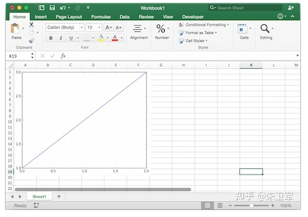

# 功能模块笔记

## 一、办公自动化

### 1、Python处理Excel数据

可以使用pandas、xlwings、openpyxl等包来对Excel进行增删改查、格式调整等操作，甚至可以使用Python函数来对excel数据进行分析。

#### 1.1 读取excel表格

```
import xlwings as xw
wb = xw.Book()  # this will create a new workbook
wb = xw.Book('FileName.xlsx')  # connect to a file that is open or in the current working directory
wb = xw.Book(r'C:\path\to\file.xlsx')  # on Windows: use raw strings to escape backslashes
```

#### 1.2 将 matplotlib 绘图写入excel表格

```

import matplotlib.pyplot as plt
import xlwings as xw

fig = plt.figure()
plt.plot([1, 2, 3])

sheet = xw.Book().sheets[0]
sheet.pictures.add(fig, name='MyPlot', update=True)
```



### 2、Python处理PDF文本

PDF几乎是最常见的文本格式，很多人有各种处理PDF的需求，比如制作PDF、获取文本、获取图片、获取表格等。Python中有PyPDF、pdfplumber、ReportLab、PyMuPDF等包可以轻松实现这些需求。

#### 2.1 提取PDF文字

```
import PyPDF2

pdfFile = open('example.pdf','rb')
pdfReader = PyPDF2.PdfFileReader(pdfFile)
print(pdfReader.numPages)
page = pdfReader.getPage(0)
print(page.extractText())
pdfFile.close()
```

#### 2.2 提取PDF表格

```
# 提取pdf表格
import pdfplumber
with pdfplumber.open("example.pdf") as pdf:
    page01 = pdf.pages[0] #指定页码
    table1 = page01.extract_table()#提取单个表格
    # table2 = page01.extract_tables()#提取多个表格
    print(table1)
```

### 3、Python处理Email

在Python中可以使用smtplib配合email库，来实现邮件的自动化传输，非常方便。

```
import smtplib
import email

# 负责将多个对象集合起来
from email.mime.multipart import MIMEMultipart
from email.header import Header

# SMTP服务器,这里使用163邮箱
mail_host = "smtp.163.com"
# 发件人邮箱
mail_sender = "******@163.com"
# 邮箱授权码,注意这里不是邮箱密码,如何获取邮箱授权码,请看本文最后教程
mail_license = "********"
# 收件人邮箱，可以为多个收件人
mail_receivers = ["******@qq.com","******@outlook.com"]

mm = MIMEMultipart('related')
# 邮件正文内容
body_content = """你好，这是一个测试邮件！"""
# 构造文本,参数1：正文内容，参数2：文本格式，参数3：编码方式
message_text = MIMEText(body_content,"plain","utf-8")
# 向MIMEMultipart对象中添加文本对象
mm.attach(message_text)

# 创建SMTP对象
stp = smtplib.SMTP()
# 设置发件人邮箱的域名和端口，端口地址为25
stp.connect(mail_host, 25)  
# set_debuglevel(1)可以打印出和SMTP服务器交互的所有信息
stp.set_debuglevel(1)
# 登录邮箱，传递参数1：邮箱地址，参数2：邮箱授权码
stp.login(mail_sender,mail_license)
# 发送邮件，传递参数1：发件人邮箱地址，参数2：收件人邮箱地址，参数3：把邮件内容格式改为str
stp.sendmail(mail_sender, mail_receivers, mm.as_string())
print("邮件发送成功")
# 关闭SMTP对象
stp.quit()
```

### 4、Python处理数据库

数据库是我们常用的办公应用，Python中有各种数据库驱动接口包，支持对数据库的增删改查、运维管理工作。比如说pymysql包对应MySQL、psycopg2包对应PostgreSQL、pymssql包对应sqlserver、cxoracle包对应Oracle、PyMongo包对应MongoDB等等。

#### 4.1 对MySQL的连接查询

```
import pymysql

# 打开数据库连接
db = pymysql.connect(host='localhost',
                     user='testuser',
                     password='test123',
                     database='TESTDB') 
# 使用 cursor() 方法创建一个游标对象 cursor
cursor = db.cursor()
# 使用 execute()  方法执行 SQL 查询 
cursor.execute("SELECT VERSION()")
# 使用 fetchone() 方法获取单条数据.
data = cursor.fetchone()
print ("Database version : %s " % data)
# 关闭数据库连接
db.close()
```

### 5、Python处理批量文件

对很多办公场景来说，批量处理文件一直是个脏活累活，Python可以帮你脱离苦海。Python中有很多处理系统文件的包，比如sys、os、shutil、glob、path.py等等。

#### 5.1 批量删除不同文件夹下的同名文件夹

```
import os,shutil
import sys
import numpy as np

def arrange_file(dir_path0):
  for dirpath,dirnames,filenames in os.walk(dir_path0):
    if 'my_result' in dirpath:
      # print(dirpath)
      shutil.rmtree(dirpath)
```

#### 5.2 批量修改文件后缀名

```
import os

def file_rename():
    path = input("请输入你需要修改的目录(格式如'F:\\test')：")
    old_suffix = input('请输入你需要修改的后缀（需要加点.）：')
    new_suffix = input('请输入你要改成的后缀（需要加点.）：')
    file_list = os.listdir(path)
    for file in file_list:
        old_dir = os.path.join(path, file)
        print('当前文件：', file)
        if os.path.isdir(old_dir):
            continue
        if old_suffix != os.path.splitext(file)[1]:
            continue
        filename = os.path.splitext(file)[0]
        new_dir = os.path.join(path, filename + new_suffix)
        os.rename(old_dir, new_dir)

if __name__ == '__main__':
    file_rename()
```

### 6、Python控制鼠标

这是很多人的需求，实现对鼠标的自动控制，去做一些流水线的工作，比如软件测试。

Python有个pyautogui库可以任意地去控制你的鼠标。

控制鼠标左击/右击/双击函数以及测试源码

```
# 获取鼠标位置
import pyautogui as pg

try:
    while True:
        x, y = pg.position()
        print(str(x) + " " + str(y))  #输出鼠标位置

        if 1746 < x < 1800 and 2 < y < 33:
            pg.click()#左键单击
        if 1200 < x < 1270 and 600 < y < 620:
            pg.click(button='right')#右键单击
        if 1646 < x < 1700 and 2 < y < 33:
            pg.doubleClick()#左键双击

except KeyboardInterrupt:
    print("\n")
```

### 7、Python控制键盘

同样的，Python也可以通过pyautogui控制键盘。

键盘写入

```
import pyautogui
#typewrite()无法输入中文内容，中英文混合的只能输入英文
#interval设置文本输入速度，默认值为0
pyautogui.typewrite('你好，world!',interval=0.5)
```

### 8、Python压缩文件

压缩文件是办公中常见的操作，一般压缩会使用压缩软件，需要手动操作。

Python中有很多包支持文件压缩，可以让你自动化压缩或者解压缩本地文件，或者将内存中的分析结果进行打包。比如zipfile、zlib、tarfile等可以实现对.zip、.rar、.7z等压缩文件格式的操作。

#### 8.1 压缩文件

```
import zipfile
try:
  with zipfile.ZipFile("c://test.zip",mode="w") as f:
    f.write("c://test.txt")          #写入压缩文件，会把压缩文件中的原有覆盖
except Exception as e:
    print("异常对象的类型是:%s"%type(e))
    print("异常对象的内容是:%s"%e)
finally:
    f.close()
```

#### 8.2 解压文件

```
import zipfile
try:
  with zipfile.ZipFile("c://test.zip",mode="a") as f:
     f.extractall("c://",pwd=b"root") ##将文件解压到指定目录，解压密码为root
except Exception as e:
     print("异常对象的类型是:%s"%type(e))
     print("异常对象的内容是:%s"%e)
finally:
     f.close()
```

### 9、Python爬取网络数据

python爬虫应该是最受欢迎的功能，也是广大Python爱好者们入坑的主要的原因。

Python中有非常多的包支持爬虫，而爬虫包又分为抓取、解析两种。

比如说requests、urllib这种是网络数据请求工具，也就是抓取包；xpath、re、bs4这种会对抓取下来的网页内容进行解析，称为解析包。

爬取百度首页图片，并保存到本地

```
# 导入urlopen
from urllib.request import urlopen
# 导入BeautifulSoup
from bs4 import BeautifulSoup as bf
# 导入urlretrieve函数，用于下载图片
from urllib.request import urlretrieve
# 请求获取HTML
html = urlopen("http://www.baidu.com/")
# 用BeautifulSoup解析html
obj = bf(html.read(),'html.parser')
# 从标签head、title里提取标题
title = obj.head.title
# 只提取logo图片的信息
logo_pic_info = obj.find_all('img',class_="index-logo-src")
# 提取logo图片的链接
logo_url = "https:"+logo_pic_info[0]['src']
# 使用urlretrieve下载图片
urlretrieve(logo_url, 'logo.png')
```

### 10、Python处理图片图表

图片处理、图表可视化涉及到图像处理，这也是Python的强项，现在诸如图像识别、计算机视觉等前沿领域也都会用到Python。

在Python中处理图像的包有scikit Image、PIL、OpenCV等，处理图表的包有matplotlib、plotly、seaborn等。

#### 10.1 对图片进行黑白化处理

```
from PIL import Image
from PIL import ImageEnhance

img_main = Image.open(u'E:/login1.png')
img_main = img_main.convert('L')
threshold1 = 138
table1 = []
for i in range(256):
  if i < threshold1:
    table1.append(0)
  else:
    table1.append(1)
img_main = img_main.point(table1, "1")
img_main.save(u'E:/login3.png')
```

#### 10.2 生成统计图表

```
import numpy as np
import matplotlib.pyplot as plt

N = 5
menMeans = (20, 35, 30, 35, 27)
womenMeans = (25, 32, 34, 20, 25)
menStd = (2, 3, 4, 1, 2)
womenStd = (3, 5, 2, 3, 3)
ind = np.arange(N)    # the x locations for the groups
width = 0.35       # the width of the bars: can also be len(x) sequence

p1 = plt.bar(ind, menMeans, width, yerr=menStd)
p2 = plt.bar(ind, womenMeans, width,
             bottom=menMeans, yerr=womenStd)

plt.ylabel('Scores')
plt.title('Scores by group and gender')
plt.xticks(ind, ('G1', 'G2', 'G3', 'G4', 'G5'))
plt.yticks(np.arange(0, 81, 10))
plt.legend((p1[0], p2[0]), ('Men', 'Women'))

plt.show()
```