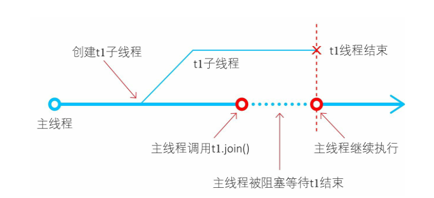
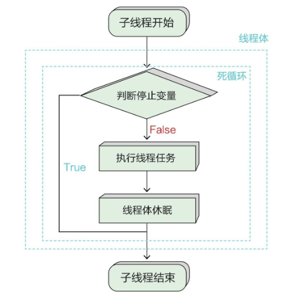
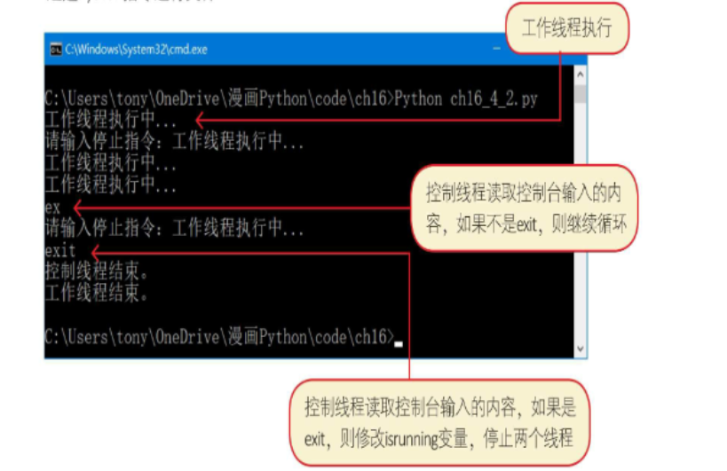
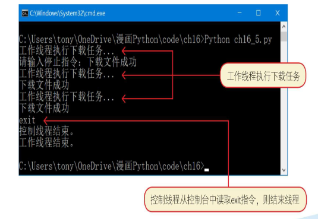

# 多线程

如果想让我们的程序同时执行多个任务，就需要使用多线程技术了。到目前为止，我们编写的程序都是单线程的，在运行时一次只能执行一个任务
### 进程

一个进程就是一个正在执行的程序，每一个进程都有自己独立的一块内存空间、一组系统资源。在进程的概念中，每一个进程的内部数据
和状态都是完全独立的。
在Windows操作系统中，一个进程就是一个exe或者dll程序，它们相互独立，相互也可以通信。

### 线程
在一个进程中可以包含多个线程，多个线程共享一块内存空间和一组系统资源。所以，系统在各个线程之间切换时，开销要比进程小得多
，正因如此，线程被称为轻量级进程。
多线程，要在其它线程被阻塞【阻塞状态是线程因为某种原因放弃CPU使用权，暂时停止运行】的情况下才有机会运行到。

### 主线程
Python程序至少有一个线程，这就是主线程，程序在启动后由Python解释器负责创建主线程，在程序结束后由Python解释器负责停止主线程。
在多线程中，主线程负责其他线程的启动、挂起、停止等操作。其他线程被称为子线程。

## 线程模块——threading
Python官方提供的threading模块可以进行多线程编程。threading模块提供了多线程编程的高级API，使用起来比较简单。
在threading模块中提供了线程类Thread，还提供了很多线程相关的函数，这些函数中常用的如下。
active_count（）：返回当前处于活动状态的线程个数。
current_thread（）：返回当前的Thread对象。
main_thread（）：返回主线程对象。主线程是Python解释器启动的线程。

示例代码如下：


```python
# 导入线程模块
import threading

# 当前线程对象
t = threading.current_thread()  # 在运行过程中只有一个线程，就是主线程，因此当前线程是主线程
# 当前线程名
print(t.name)
# 返回当前处于活动状态的线程个数
print(threading.activeCount())  # 在运行过程中只有一个线程，活动状态的线程只有一个
# 当主线程对象
t = threading.main_thread()  # 主线程和当前线程是同一个
# 主线程名
print(t.name)
```

打印结果：

```
MainThread
1
MainThread
```

## 创建子线程

创建一个可执行的子线程，需要如下两个要素。
1 线程对象：线程对象是threading模块的线程类Thread或Thread子类所创建的对象。
2 线程体：线程体是子线程要执行的代码，这些代码会被封装到一个函数中。子线程在启动后会执行线程体。
实现线程体主要有以下两种方式:
1）自定义函数实现线程体。
2）自定义线程类实现线程体。

### 自定义函数实现线程体
创建线程Thread对象的构造方法如下：
```python
Thread(target=None, name=None, args=0)
```
target参数指向线程体函数，我们可以自定义该线程体函数；通过name参数可以设置线程名，如果省略这个参数，则系统会为其分配一个名称；args是为线程体函数提供的参数，是一个元组类型。
示例代码如下：


```python
import threading
import time


# 线程体函数
def thread_body():
    # 当前线程对象
    t = threading.current_thread()
    for n in range(5):
        # 当前线程名
        print('第{0}次执行线程{1}'.format(n, t.name))
        # 线程休眠
        time.sleep(2)  # 该函数可以使得当前线程休眠两秒。只有当前线程休眠，其他线程才有机会执行
    print('线程{0}执行完成! '.format(t.name))


# 主线程
# 创建线程对象t1
t1 = threading.Thread(target=thread_body)  # 指定线程体的函数名，注意在函数名后面不要跟小括号
# 创建线程对象t2
t2 = threading.Thread(target=thread_body, name='MyThread')  # name = 'MyThread' 设置线程名
# 启动线程t1
t1.start()
# 启动线程t2
t2.start()
```

| ~~time.sleep(2)~~打印结果： | time.sleep(2)打印结果： |
| --------------------------- | ----------------------- |
|第0次执行线程Thread-1<br>第1次执行线程Thread-1<br>第2次执行线程Thread-1<br>第3次执行线程Thread-1<br>第4次执行线程Thread-1<br>线程Thread-1执行完成!<br>第0次执行线程MyThread<br>第1次执行线程MyThread<br>第2次执行线程MyThread<br>第3次执行线程MyThread<br>第4次执行线程MyThread<br>线程MyThread执行完成!  | 第0次执行线程Thread-1<br>第0次执行线程MyThread<br>第1次执行线程Thread-1<br>第1次执行线程MyThread<br>第2次执行线程Thread-1<br>第2次执行线程MyThread<br>第3次执行线程MyThread<br>第3次执行线程Thread-1<br>第4次执行线程MyThread<br>第4次执行线程Thread-1<br>线程Thread-1执行完成!<br>线程MyThread执行完成! |

从运行结果可见，两个子线程是交错运行的，为什么这样呢?
在多线程编程时，要注意给每个子线程执行的机会，主要是通过让子线程休眠来让当前线程暂停执行，其他线程才有机会执行。如果子线程没有休眠，则基本上在第1个子线程执行完毕后，再执行第2个子线程

### 自定义线程类实现线程体
另外一种实现线程体的方式是，创建一个Thread子类并重写run（）方法，run（）方法就是线程体函数。
采用自定义线程类重新实现，示例代码如下：


```python
import threading
import time


# 自定义线程类，继承Thread类
class SmallThread(threading.Thread):
    # 定义线程类的构造方法,name参数是线程名
    def __init__(self, name=None):
        super().__init__(name=name)

    # 线程体函数
    # 重写父类Thread的run()方法
    def run(self):
        # 当前线程对象
        t = threading.current_thread()
        for n in range(5):
            # 当前线程名
            print('第{0}次执行线程{1}'.format(n, t.name))
            # 线程休眠
            time.sleep(2)
        print('线程{0}执行完成!'.format(t.name))


# 主线程
t1 = SmallThread()
# 创建线程对象t2
t2 = SmallThread(name='MyThread')
# 启动线程t1
t1.start()
# 启动线程t2
t2.start()
```

打印结果：同上

## 线程管理
线程管理包括线程创建、线程启动、线程休眠、等待线程结束和线程停止，其中，线程创建、线程启动和线程休眠在前面已经用到了，
这些不再赘述。这里重点介绍等待线程结束和线程停止的内容

### 等待线程结束

有时，一个线程（假设是主线程）需要等待另外一个线程（假设是t1子线程）执行结束才能继续执行。


join（）方法的语法如下：
```python
join(timeout=None)
```
参数timeout用于设置超时时间，单位是秒。如果没有设置timeout，
则可以一直等待，直到结束。
使用join（）方法的示例代码如下：


```python
# coding=utf-8
# 代码文件: 
import threading
import time

# 共享变量
value=[]  # 定义一个共享变量value，该变量是多个线程都可以访问的变量

# 线程体函数
def thread_body():
    # 当前线程对象
    print('t1子线程开始...')
    for n in range(2):
        print('t1子线程执行...')
        value.append(n)  # 在子线程体中修改变量value的内容
        # 线程休眠
        time.sleep(2)
        print("t1子线程结束。")

# 主线程
print("主线程开始执行...")
# 创建线程对象t1
t1 = threading.Thread(target=thread_body)
# 启动线程t1
t1.start()
# 主线程被阻塞，等待t1线程结束
t1.join()  # 在当前线程(主线程)中调用t1的join()方法，因此会导致当前线程阻塞，等待t1线程结束
print('value = {0}'.format(value))  # t1线程结束，继续执行访问并输出变量value
print("主线程继续执行...")
```

|~~t1.join()~~打印结果 |t1.join()打印结果|
|--|--|
|主线程开始执行...<br>t1子线程开始...<br>t1子线程执行...<br>value = [0]<br>主线程继续执行...<br>t1子线程结束。<br>t1子线程执行...<br>t1子线程结束。|主线程开始执行...<br>t1子线程开始...<br>t1子线程执行...<br>t1子线程结束。<br>t1子线程执行...<br>t1子线程结束。<br>value = [0, 1]<br>主线程继续执行...|

从运行结果来看，在子线程t1结束后，主线程才输出变量value的内容，这说明主线程被阻塞了。
如果尝试将t1.join（）语句注释掉，从运行结果可见，子线程t1还没有结束，主线程就输出变量value的内容。

### 线程停止
在线程体结束时，线程就停止了。但在某些业务比较复杂时，会在线程体中执行一个“死循环”。线程体是否持续执行“死循环”是通过判断停止变量实现的，“死循环”结束则线程体结束，线程也就结束了。
另外，在一般情况下，死循环会执行线程任务，然后休眠，再执行，再休眠，直到结束循环。




```python
# coding=utf-8
# 代码文件:

import threading
import time

# 线程停止变量
isrunning = True  # 创建一个线程停止变量isrunning，控制线程结束


# 工作线程体函数
def workthread_body():  # 工作线程体执行一些任务
    while isrunning:  # 工作线程体“死循环
        # 线程开始工作
        print('工作线程执行中...')
        # 线程休眠
        time.sleep(5)
        print("工作线程结束。")


# 控制线程体函数
def controlthread_body():  # 控制线程体从控制台读取指令，根据指令修改线程停止变量
    global isrunning  # 由于需要在线程体中修改变量isrunning，因此需要将isrunning变量声明为global
    while isrunning:  # 控制线程体“死循环
        # 从键盘输入停止指今exit
        command = input("请输入停止指令:")
        if command == 'exit':
            isrunning = False
            print("控制线程结束。")


# 主线程
# 创建工作线程对象workthread
workthread = threading.Thread(target=workthread_body)  # 工作线程用来执行一些任务
# 启动线程workthread
workthread.start()

# 创建控制线程对象controlthread
controlthread = threading.Thread(target=controlthread_body)  # 控制线程控制修改线程停止变量
# 启动线程controlthread
controlthread.start()
```



## 下载图片示例

多线程应用有很多，一些阻塞主线程的操作应该被放到子线程中处理。
例如:一个网络爬虫程序，它需要定期下载图片等。下面来实现这个应用。

这个网络爬虫程序每隔一段时间都会执行一次下载图片任务，在下载任务完成后，休眠一段时间再执行。这样反复执行，直到爬虫程序停止。
示例参考代码如下：


```python
# codinguutf-8
# 代码文件:
import threading
import time
import urllib.request
import requests

# 线程停止变量
isrunning = True


# 工作线程体函数
def workthread_body():
    while isrunning:
        # 线程开始工作
        print("工作线程执行下载任务...")
        download()
        input()
        # 线程休眠
        time.sleep(5)
        print("工作线程结束。")


# 控制线程体函数
def controlthread_body():
    global isrunning
    while isrunning:
        # 从键盘输入停止指令exit
        command = input("请输入停止指令:")
        if command == 'exit':
            isrunning = False
            print("控制线程结束。")


def download():
    """
    两种下载方式
    """
    headers = {
        "User-Agent":
            "Mozilla/5.0 (Windows NT 10.0; Win64; x64; rv:101.0) Gecko/20100101 Firefox/101.0"
    }
    # url = "http://localhost:8888/view/NoteWebService/logo.png"
    url = "https://up.enterdesk.com/edpic_source/e5/b0/5e/e5b05e9a05a1d2883ed6afbb0f41a69f.jpg"
    req = urllib.request.Request(url,headers=headers)
    with urllib.request.urlopen(req) as response:
        data = response.read()
        f_name = 'download.jpg'
        with open(f_name, 'wb') as f:
            f.write(data)
            print("下载文件成功")

    # with requests.get(url, headers=headers) as response:
    #     data = response.content
    #     # print(response.read())
    #     f_name = 'download.jpg'
    #     with open(f_name, 'wb') as f:
    #         f.write(data)
    #         print("下载文件成功")


# 主线程
# 创建工作线程对象workthread
workthread = threading.Thread(target=workthread_body)
# 启动线程workthread
workthread.start()

# 创建控制线程对象controlthread
controlthread = threading.Thread(target=controlthread_body)
# 启动线程controlthread
controlthread.start()
```




```python

```
