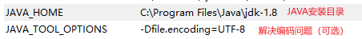
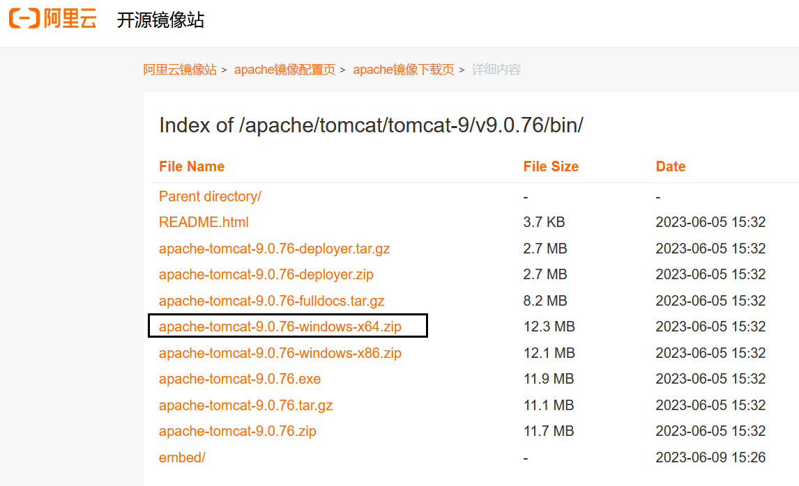
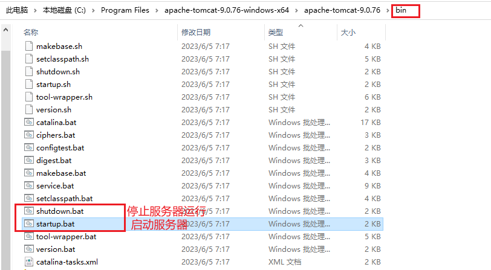
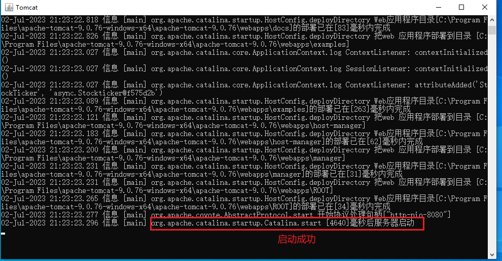
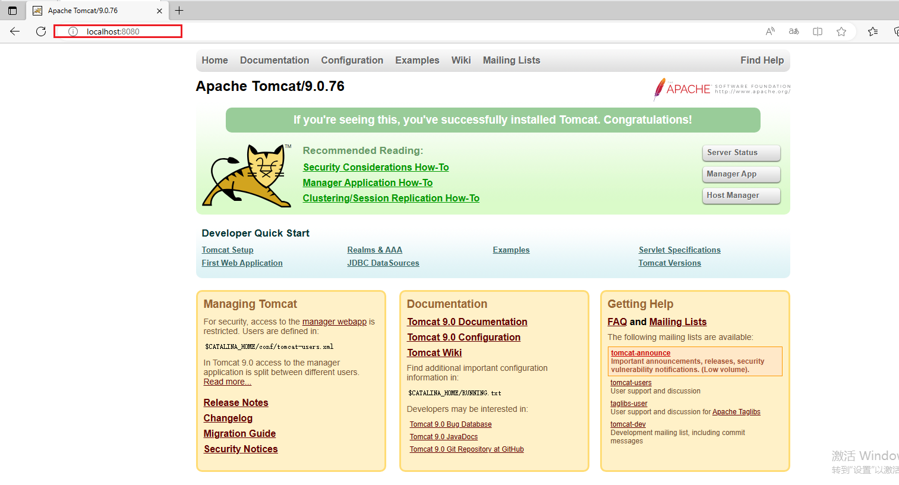
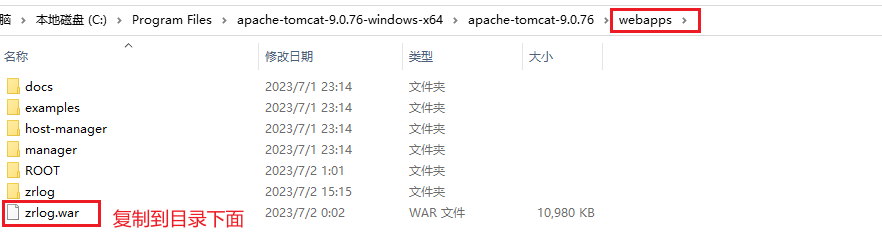
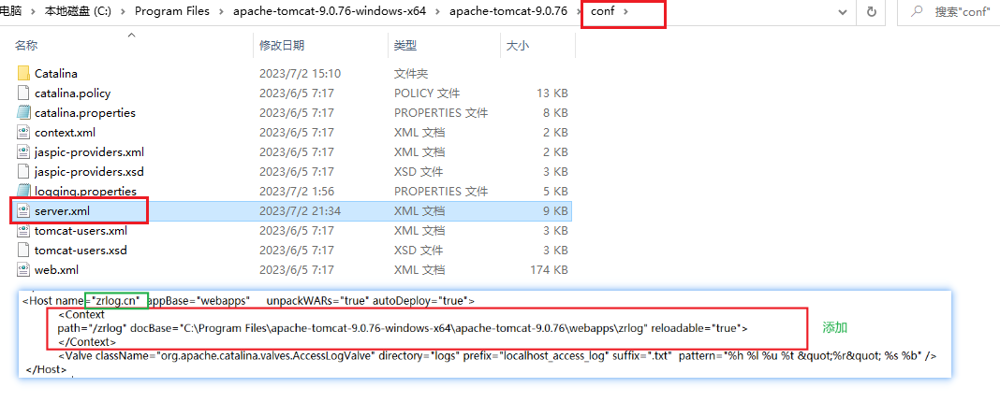

##  一、基本的网络知识

### 1.  TCP/IP

​		在网络通信中会用到一些相关协议，其中，TCP/IP是非常重要的协议，由IP和TCP两个协议构成。IP（Internet Protocol）是一种低级的路由协议，它将数据拆分在许多小的数据包中，并通过网络将它们发送到某一特定地址，但无法保证所有包都抵达目的地，也不能保证包按顺序抵达。

​		由于通过IP传输数据存在不安全性，所以还需要通过TCP（Transmission Control Protocol，传输控制协议）进行网络通信。TCP是一种高层次的协议，是面向连接的可靠数据传输协议，如果有些数据包没被收到，则会重发，对数据包的内容准确性进行检查并保证数据包按顺序抵达。所以，TCP能够保证数据包安全地按照发送时的顺序送达目的地。

### 2.  IP地址

​		为了实现网络中不同计算机之间的通信，每台计算机都必须有一个与众不同的标识，这就是IP地址，TCP/IP使用IP地址来标识源地址和目的地址。
​		最初，所有的IP地址都是由32位数字构成的，由4个8位的二进制数组成，每8位之间用圆点隔开，例如192.168.1.1，这种类型的地址通过IPv4指定。现在有一种新的地址模式，叫作IPv6，IPv6使用128位数字表示一个地址。尽管IPv6比IPv4有很多优势，但是由于习惯的问题，很多设备还是采用IPv4。
​		另外，我们有时还会用到一个特殊的IP地址127.0.0.1，127.0.0.1叫作回送地址，指本机。回送地址主要用于网络软件测试及本机的进程间通信，只发送数据，只进行本机进程间通信，不进行任何网络传输。

### 3. 端口

​		一个IP地址标识一台计算机，每一台计算机又有很多网络通信程序在运行，提供网络服务或进行通信，这就需要不同的端口进行通信。如果把IP地址比作电话号码，那么端口就是分机号码，在进行网络通信时不仅要指定IP地址，还要指定端口号。

​		TCP/IP系统中的端口号是一个16位的数字，它的范围是 0～65535。将小于1024的端口号保留给预定义的服务，例如HTTP是80，FTP是21，Telnet是23，Email是25，等等。除非要和那些服务进行通信，否则不应该使用小于1024的端口。

### 4. HTTP/HTTPS

​		对互联网的访问大多基于HTTP/HTTPS，HTTP/HTTPS是TCP/IP的一种协议。

#### 4.1 HTTP

​		HTTP（Hypertext Transfer Protocol，超文本传输协议）属于应用层协议，其简捷、快速的方式适用于分布式超文本信息传输。HTTP是无连接协议，即在每一次请求时都建立连接，服务器在处理完客户端的请求后，会先应答客户端，然后断开连接，不会一直占用网络资源。HTTP/1.1共定义了8种请求方法：OPTIONS、HEAD、GET、POST、PUT、DELETE、TRACE和CONNECT。GET和POST方法最常用。

- GET方法：用于向指定的资源发出请求，被发送的信息“显式”地跟在URL后面。它一般只用于读取数据，例如静态图片等。GET方法
  有点像使用明信片给别人写信，将“信的内容”写在外面，接触到的人都可以看到，因此是不安全的。
-  POST方法：用于向指定的资源提交数据，请求服务器进行处理，例如提交表单或者上传文件等。数据被包含在请求体中。POST方法
  像是把“信的内容”装入信封中，接触到该信封的人都看不到信的内容，因此是相对安全的。

#### 4.2 HTTPS

​		HTTPS（Hypertext Transfer Protocol Secure，超文本传输安全协议）是超文本传输协议和SSL的组合，用于提供加密通信及对网络服务器身份的鉴定。简单地说，HTTPS是加密的HTTP。

​		HTTPS与HTTP的区别是：HTTPS使用https://代替http://，HTTPS使用端口443，而HTTP使用端口80与TCP/IP通信。

##  二、搭建Web服务器

为了测试和学习方便，建议自己搭建Web服务器。

### 1. Apache Tomcat

搭建Web服务器的步骤如下：

- 安装JDK（Java开发工具包）

  ​		Apache Tomcat是支持Java Web技术的Web服务器。Apache Tomcat的运行需要Java运行环境，而JDK提供了Java运行环境，因此我们首先需要安装JDK。JDK安装包jdk-8u211-windows-i586.exe(官网可以下载)

- 配置Java运行环境

  Apache Tomcat在运行时需要用到JAVA_HOME环境变量，因此需要先设置JAVA_HOME环境变量

  

### 2. 安装Apache Tomcat服务器

- 下载服务器Apache Tomcat安装包（apache-tomcat-9.0.13.zip）

  国内镜像：http://mirrors.aliyun.com
  
  下载网址：https://mirrors.aliyun.com/apache/tomcat/tomcat-9/v9.0.76/bin/?spm=a2c6h.25603864.0.0.77bd484cF3l0Fx



- 安装服务器

  解压缩到指定位置即可

- 环境变量配置

  

### 3. 启动Apache Tomcat服务器





###  4. 测试Apache Tomcat服务器

打开浏览器，在地址栏中输入http://localhost:8080



### 5. 部署Web应用

- 下载war包

  学习使用：ZRLOG可能是最好用的开源 Java 博客程序：https://www.zrlog.com/

- 安装应用

  服务启动后自动解压缩安装

  

- 修改配置文件

  

## 三、urllib.request模块

#### 3.1 发送GET请求

示例如下：

```
# 导入模块
import urllib.request
# 请求URL网址
url = "http://192.168.1.5:8080/zrlog/"
# 创建Request对象，默认是GET请求
req = urllib.request.Request(url)
# 发送网络请求
with urllib.request.urlopen(req) as response:
    # 读取数据，为字节序列数据
    data =response.read()
    # 将字节序列数据转换为字符串
    json_data =data.decode()
    print(json_data)
```


#### 3.2 发送POST请求

```
# 导入模块
import urllib.request
import urllib.parse
# 请求URL网址
url = "http://192.168.1.5:8080/zrlog/admin/login"

params_dict = {
    "userName":"admin",
    "password":"admin"
}
params_str = urllib.parse.urlencode(params_dict)
print(params_str)
params_bytes=params_str.encode()
# 创建Request对象，默认是GET请求
req = urllib.request.Request(url,data = params_bytes)
# 发送网络请求
with urllib.request.urlopen(req) as response:
    # 读取数据，为字节序列数据
    data =response.read()
    # 将字节序列数据转换为字符串
    json_data =data.decode()
    print(json_data)
```

