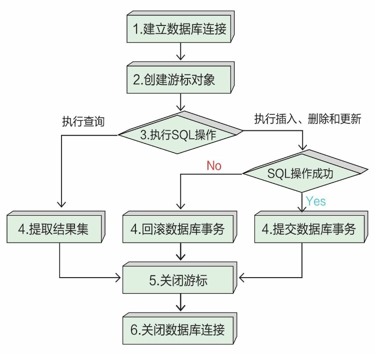
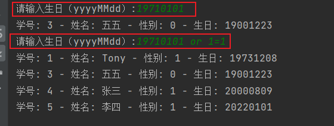

# 访问数据库

如果数据量较少，则我们可以将数据保存到文件中；如果数据量较大，则我们可以将数据保存到数据库中。

## 数据库编程的基本操作过程

数据库编程主要分为两类：查询（Read）和修改（C插入、U更新、D删除）。



### 1 查询数据

查询数据时需要6步，在查询过程中需要提取数据结果集，最后释放资源，即关闭游标和数据库。

### 2 修改数据

修改数据时如上图所示，最多需要6步，在修改过程中如果执行SQL操作成功，则提交数据库事务；如果失败，则回滚事务。最后释放资源，关闭游标和数据库。
数据库事务 (transaction) 是修改数据库的一系列操作，这些操作要么全部执行，要么全部不执行。若全部操作执行成功，则确定修改，称之为“提交事务”，如果有操作执行失败，则放弃修改，称之为“回滚事务

## SQLite数据库

SQLite是嵌入式系统使用的关系数据库，目前的主流版本是SQLite3。SQLite是开源的，采用C语言编写而成，具有可移植性强、可靠性高、小而易用等特点。SQLite提供了对SQL-92标准的支持，支持多表、索引、事务、视图和触发。

## sqlite3模块API

Python官方提供了sqlite3模块来访问SQLite数据库。

### 1 数据库连接对象Connection

数据库访问的第一步是进行数据库连接。
我们可以通过connect（database）函数建立数据库连接，参数database是SQLite数据库的文件路径，如果连接成功，则返回数据库连接对象Connection。
Connection对象有如下重要的方法:

- close（）：关闭数据库连接，在关闭之后再使用数据库连接将引发异常。
- commit（）：提交数据库事务。
- rollback（）：回滚数据库事务。
- cursor（）：获得Cursor游标对象。

### 2 游标对象Cursor

一个Cursor游标对象表示一个数据库游标，游标暂时保存了SQL操作所影响到的数据。游标是通过数据库连接创建的。

游标Cursor对象有很多方法和属性，其中的基本SQL操作方法如下。

- execute（sql[，parameters]）：执行一条SQL语句，sql是SQL语句，parameters是为SQL提供的参数，可以是序列或字典类型。返回值是整数，表示执行SQL语句影响的行数。
- executemany（sql[，seq_of_params]）：执行批量SQL语句，sql是SQL语句，seq_of_params是为SQL提供的参数，seq_of_params是序列。返回值是整数，表示执行SQL语句影响的行数。
- 在通过execute（）和executemany（）方法执行SQL查询语句后，还要通过提取方法从查询结果集中返回数据，相关提取方法如下：
  - fetchone（）：从结果集中返回只有一条记录的序列，如果没有数据，则返回None。
  - fetchmany（size=cursor.arraysize）：从结果集中返回小于等于size记录数的序列，如果没有数据，则返回空序列，size在默认情况下是整个游标的行数。
  - fetchall（）：从结果集中返回所有数据。

### 3 数据库的CRUD操作示例

对数据库表中的数据可以进行4类操作：数据插入（Create）、数据查询（Read）、数据更新（Update）和数据删除（Delete），即增、删、改、查。

为了介绍数据库的CRUD操作，这里修改school_db数据库中的student（学生）表。为了查询方便，预先插入几条记录。

```sqlite
-- 建表
CREATE TABLE"student"(
"s_id"INTEGER PRIMARY KEY AUTOINCREMENT,
"s_name" TEXT NOT NULL,
"s_sex" INTEGER DEFAULT 1,
"s_birthday" TEXT);

-- 插入数据
INSERT INTO student (s_name,s_sex,s_birthday) VALUES ('Tony',1,'19731208');
INSERT INTO student (s_name, s_sex, s_birthday) VALUES('Tom',1,'19701107');
INSERT INTO student (s_name, s_sex, s_birthday) VALUES('zhao',0,'19770511');
INSERT INTO student (s_name, s_sex, s_birthday) VALUES ('张三',1,'20000809');
```

#### 3.1 无条件查询

SQL查询语句是SELECT，根据是否带有WHERE子句，分为：无条件查询和有条件查询。
无条件查询最为简单，没有WHERE子句。
示例代码如下：

```sqlite
# coding=utf-8
# 代码文件:

import sqlite3
try:
    # 1.建立数据库连接
    con = sqlite3.connect( './data/school_db.db')
    # 2.创建游标对象
    cursor = con.cursor()
    # 3.执行SOL查询操作
    sql = 'SELECT s_id, s_name,s_sex, s_birthday FROM student'
    cursor.execute(sql)
    # 4.提取结果集
    result_set = cursor.fetchall()  # 从结果集中返回所有数据
    for row in result_set:  # 遍历结果集
        # 提取出字段的内容，row[0]是第一个字段的内容
        print('学号: {0} - 姓名: {1} - 性别: {2} - 生日: {3}'.format(row[0],row[1], row[2], row[3]))
except sqlite3.Error as e:  # sqlite3相关的异常
    print("数据查询发生错误：{}".format(e))
finally:
    # 5.关闭游标
    if cursor:
        cursor.close()
    # 6.关闭数据连接
    if con:
        con.close()
```

打印结果：

```
学号: 1 - 姓名: Tony - 性别: 1 - 生日: 19731208
学号: 2 - 姓名: Tom - 性别: 1 - 生日: 19701107
学号: 3 - 姓名: zhao - 性别: 0 - 生日: 19770511
学号: 4 - 姓名: 张三 - 性别: 1 - 生日: 20000809
```

#### 3.2 有条件查询

有条件查询带有WHERE子句，WHERE子句是查询条件。
示例代码如下：

```sqlite
# coding=utf-8
# 代码文件:

import sqlite3
istr= input("请输入生日（yyyyMMdd）:")  # 从控制台中输入查询条件（生日）
try:
    # 1.建立数据库连接
    con = sqlite3.connect( './data/school_db.db')
    # 2.创建游标对象
    cursor = con.cursor()
    # 3.执行SOL查询操作
    sql = 'SELECT s_id, s_name,s_sex, s_birthday FROM student WHERE  s_birthday < ?'  # 查询条件中的占位符
    cursor.execute(sql,[istr])  # 在执行时为占位符传递实参，实参被放到一个元组或列表中
    # 4.提取结果集
    result_set = cursor.fetchall()  # 从结果集中返回所有数据
    for row in result_set:  # 遍历结果集
        # 提取出字段的内容，row[0]是第一个字段的内容
        print('学号: {0} - 姓名: {1} - 性别: {2} - 生日: {3}'.format(row[0],row[1], row[2], row[3]))
except sqlite3.Error as e:  # sqlite3相关的异常
    print("数据查询发生错误：{}".format(e))
finally:
    # 5.关闭游标
    if cursor:
        cursor.close()
    # 6.关闭数据连接
    if con:
        con.close()
```

打印结果：

```
学号: 1 - 姓名: Tony - 性别: 1 - 生日: 19731208
学号: 2 - 姓名: Tom - 性别: 1 - 生日: 19701107
学号: 3 - 姓名: zhao - 性别: 0 - 生日: 19770511
```

#### 3.3 插入数据

数据插入操作SQL语句是INSERT。
示例代码如下：

```sqlite
# coding=utf-8
# 代码文件:

import sqlite3

i_name = input("请输入【姓名】:")  # 从控制台中输入查询条件（生日）
i_sex = input("请输入【性别】（1表示男，0表示女）:")  # 从控制台中输入查询条件（生日）
i_birthday = input("请输入【生日】（yyyyMMdd）:")  # 从控制台中输入查询条件（生日）
try:
    # 1.建立数据库连接
    con = sqlite3.connect('./data/school_db.db')
    # 2.创建游标对象
    cursor = con.cursor()
    # 3.执行SOL查询操作
    sql = 'INSERT INTO student (s_name,s_sex,s_birthday) VALUES (?,?,?)'  # 要插入的数据使用占位符占位
    cursor.execute(sql, [i_name,i_sex,i_birthday])  # 替换占位符的实参
    # 4.提交数据库事务
    con.commit()  # 插入成功，提交事务
    print("插入数据成功")
except sqlite3.Error as e:  # sqlite3相关的异常
    print("插入数据失败：{}".format(e))
    # 4.回滚数据库事务
    con.rollback()  # 插入失败，回滚事务
finally:
    # 5.关闭游标
    if cursor:
        cursor.close()
    # 6.关闭数据连接
    if con:
        con.close()
```

打印结果：

```
插入数据成功
```

#### 3.4 更新数据

数据更新操作SQL语句是UPDATE

示例代码如下：

```sqlite
# coding=utf-8
# 代码文件:

import sqlite3

i_id = input("请输入【学号】:")
i_name = input("请输入【姓名】:")
i_sex = input("请输入【性别】（1表示男，0表示女）:")
i_birthday = input("请输入【生日】（yyyyMMdd）:")
try:
    # 1.建立数据库连接
    con = sqlite3.connect('./data/school_db.db')
    # 2.创建游标对象
    cursor = con.cursor()
    # 3.执行SOL查询操作
    sql = 'UPDATE student SET s_name=?,s_sex=?,s_birthday=? WHERE s_id=?'  # 要更新的数据使用占位符占位
    cursor.execute(sql, [i_name,i_sex,i_birthday,i_id])  # 替换占位符的实参
    # 4.提交数据库事务
    con.commit()  # 更新成功，提交事务
    print("更新数据成功")
except sqlite3.Error as e:  # sqlite3相关的异常
    print("更新数据失败：{}".format(e))
    # 4.回滚数据库事务
    con.rollback()  # 更新失败，回滚事务
finally:
    # 5.关闭游标
    if cursor:
        cursor.close()
    # 6.关闭数据连接
    if con:
        con.close()
```

打印结果：

```
更新数据成功
```

#### 3.5 删除数据

数据删除操作SQL语句是DELETE。

示例代码如下：

```
# coding=utf-8
# 代码文件:

import sqlite3

i_id = input("请输入要删除学生的【学号】:")
try:
    # 1.建立数据库连接
    con = sqlite3.connect('./data/school_db.db')
    # 2.创建游标对象
    cursor = con.cursor()
    # 3.执行SOL查询操作
    sql = 'DELETE FROM student  WHERE s_id=?'  # 要插入的数据使用占位符占位
    cursor.execute(sql, [i_id])  # 替换占位符的实参
    # 4.提交数据库事务
    con.commit()  # 提交事务
    print("删除数据成功")
except sqlite3.Error as e:  # sqlite3相关的异常
    print("删除数据失败：{}".format(e))
    # 4.回滚数据库事务
    con.rollback()  # 回滚事务
finally:
    # 5.关闭游标
    if cursor:
        cursor.close()
    # 6.关闭数据连接
    if con:
        con.close()
```

打印结果：

```
删除数据成功
```

## 防止SQL注入攻击

在构建SQL语句时，参数采用占位符占位，在执行时再传递实参，这种方式太麻烦!是否可以在构建SQL语句时直接将实参拼接起来，这样不是很简单吗? 是否可以将代码替换为如下代码?

```sqlite
3.执行SOL查询操作,直接将参数istr拼接起来
sql = 'SELECT s_id, s name, s_sex, s_birthday FROM student WHERE s_birthday < ' + istr
cursor.execute(sq1)
```

可以。不仅是查询操作，所有的SQL语句构建都可以采用拼接参教实现，但有一个潜在风险一会受到“SQL注入攻击”。

SQL注入攻击指在传递实参时，使用特殊字符或SQL关键字，在拼接成SQL后，这条SQL语句就有一定的攻击性! 

修改代码，在运行文件时,原本是查询小于19710101的数据(符合条件的数据只有1条)，但是如果我们传递的参数是19701107 0r 1=1这样的字符串，查询的结果就是表中的所有数据。如果这条SQL语句不是用于查询数据而是用于删除数据的，就会删除表中的所有数据!这就是“SQL注入攻击”导致的问题!


