# 第一节：Linux基础

## 1.1 Python开发环境搭建和学习方法介绍

### 1. 安装Python

​	网上教程很多，可以自行百度。

### 2. 编辑器的选择

推荐使用PyCharm

#### 2 .1 Jupyter Notebook介绍

Anaconda自带工具，数据分析领域使用的比较多。

##### 2 .1.1 新建文件

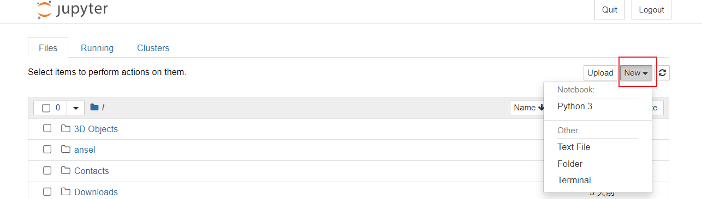

##### 2 .1.2 运行代码

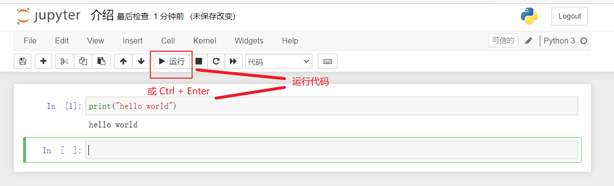

##### 2 .1.3 重命名文件


##### 2 .1.4 保存文件

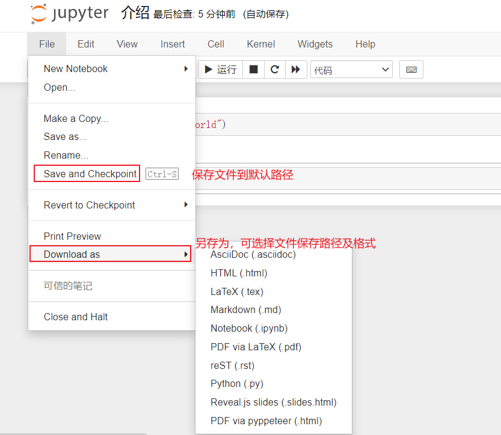

##### 2 .1.5 导入本地文件

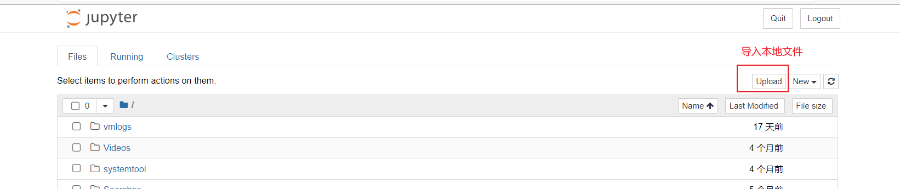

##### 2 .1.6 文本框模式

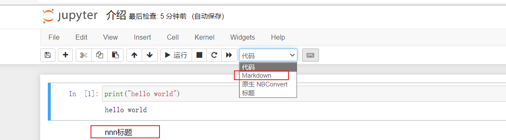

##### 2 .1.7 添加目录

备注：目录需要手动安装

安装方法：

> 1、打开  Anaconda Prompt （软件自带）
>
> 2、安装jupyter_contrib_nbextensions模块：输入 pip install jupyter_contrib_nbextensions
>
> 3、用户配置 jupyter contrib nbextensions install --user
>
> 4、添加目录功能 
>
> 
>
> 

##### 2 .1.8 自定义表格展示式样

可以根据个人喜好设置。border 是边框粗细，像素可以自己改，比如现在是1px；可以改成粗一点,5px；color：可以换成red，blue等；!important这个不要去掉，以免被其他CSS样式覆盖掉。

```HTML
%%HTML
<style type="text/css">
table.dataframe td, table.dataframe th {
    border: 2px  black solid !important;
  color: red !important;
}
```

#### 2.2 Anaconda3系统变量配置

```
D:\ProgramData\anaconda3;
D:\ProgramData\anaconda3\Library;
D:\ProgramData\anaconda3\Scripts;
```

#### 2.3 PyCharm 配置

##### 2.3.1 外部工具

**举例：QT5 配置**


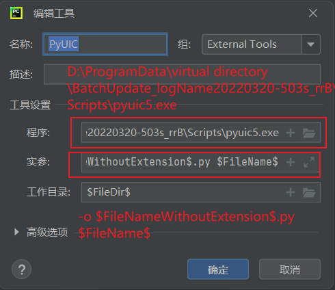

```
实参：    -o $FileNameWithoutExtension$.py $FileName$
```

##### 2.3.2 文件代码模板

```
#!/usr/bin/env python
# -*- coding: utf-8 -*-
# @File    : ${NAME}.py
# @Time    : ${DATE} ${TIME}
# @Author  : 978345836@qq.com
# @Software: win11 python3.9
# @Version : 1.0
# @Describe: None

"""
程序说明：
    功能：
"""
# here put the import lib

def execute(**kw):
    """
    脚本程序主入口
    :param kw: 参数
    :return: 运行结果
    """
    pass
if __name__ == '__main__':
    execute()
```

##### 2.3.3 gitee配置

git忽略文件.gitignore

```git
# pycharm 自动生成的目录
.idea/

# python缓存文件
__pycache__/
*.py[cod]
*.$py.calss


# Django stuff:
local_settings.py
*.sqlite3

# database migrations
*/migrations/*.py
!*/migrations/__init__.py
```

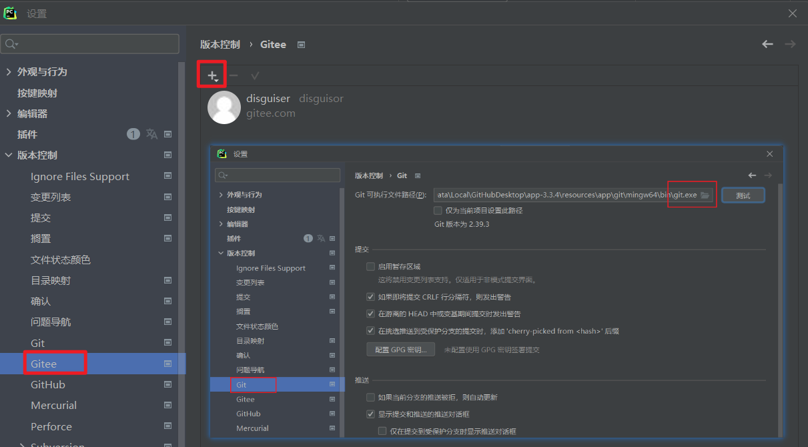


#### 2.4 VScode 使用

##### 2.4.1 界面汉化


##### 2.4.1 python 配置

###### 1、安装python 插件

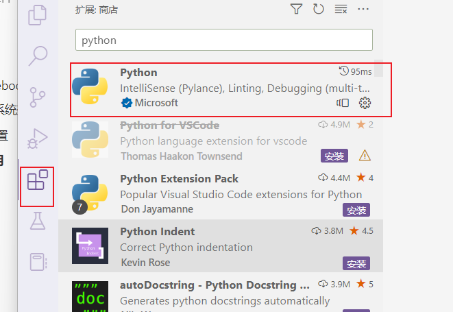

###### 2、python 文件头设置

2种方式：本项目设置、全局设置

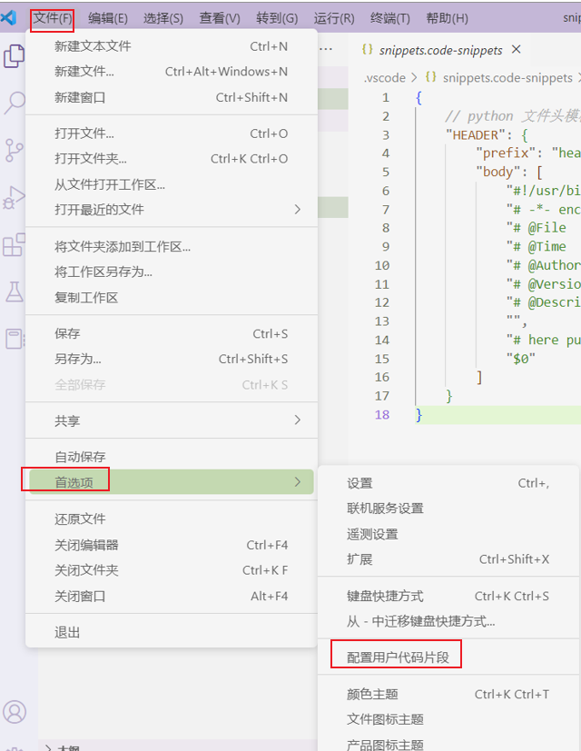

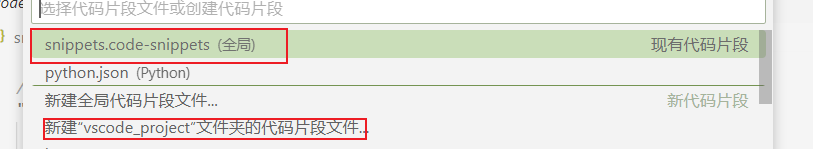

```
	// python 文件头模板
	"HEADER": {
		"prefix": "header",
		"body": [
			"#!/usr/bin/env python",
			"# -*- encoding: utf-8 -*-",
			"# @File    :   $TM_FILENAME",
			"# @Time    :   $CURRENT_YEAR/$CURRENT_MONTH/$CURRENT_DATE $CURRENT_HOUR:$CURRENT_MINUTE:$CURRENT_SECOND",
			"# @Author  :   978345836@qq.com",
			"# @Version :   1.0",
			"# @Describe:   None",
			"",
			"# here put the import lib",
			"$0"
```

###### 3、常用插件

vscode-icons 设置文件图标主题

autoDocstring 实现函数注释

Todo Tree 实现TODO 标签功能

Markdown Preview Enhanced 实现Markdown的一些功能

indent-rainbow 缩进渲染

```
// 取消插件indent-Rainbow缩进渲染报错
"indentRainbow.ignoreErrorLanguages": [
"python"
]
```


## 1.2 认识和使用Linux系统

### Linux系统配置

#### 1. 设置计算机名称

- RedHat的hostname修改

​			vi   /etc/sysconfig/network 

​			HOSTNAME=你要设置的hostname

- Debian发行版hostname修改

​			vi  /etc/hostname 修改主机名

​			cat /etc/hostname 查看主机名

重启系统读取配置文件设置新的hostname

#### 2. 编辑网络配置文件

- 修改配置文件 ifcfg-ens33 命令 vi /etc/sysconfig/network-scripts/ifcfg-ens33

  TYPE="Ethernet" #网卡类型为以太网卡 ==需要==
  PROXY_METHOD="none"
  BROWSER_ONLY="no"
  BOOTPROTO="staitc"    # dhcp 自动分配ip ，staitc 静态ip。==必须修改==
  DEFROUTE="yes"
  IPV4_FAILURE_FATAL="yes"
  IPV6INIT="yes"
  IPV6_AUTOCONF="yes"
  IPV6_DEFROUTE="yes"
  IPV6_FAILURE_FATAL="no"
  IPV6_ADDR_GEN_MODE="stable-privacy"
  NAME="ens33" # 网卡名称 ==需要==
  UUID="e8a9dda6-1f3d-416b-802f-16fcc4b4761c" # 网卡设备编号，可以删除
  DEVICE="ens33" # 网卡设置 ==需要==
  ONBOOT="yes"  激活网卡 ==必须修改==
  IPADDR="192.168.88.151"  # ip地址  ==必须添加==
  PREFIX="24" # 掩码 ==必须添加==
  GATEWAY="192.168.88.2" #网管 ==必须添加==
  DNS1="192.168.88.2" # 域名服务器1 ==必须添加==
  DNS2="114.114.114.114" # 域名服务器2 ==必须添加==
  IPV6_PRIVACY="no"

- 重启服务 sudo systemctl restart network / service network restart

```
centos7.2设置静态ip不生效

一、检查/etc/sysconfig/network-scripts目录下配置文件
1、看到了一个陌生的配置文件 ifcfg-Wired_connection_1，度娘查询了一下这个配置文件是系统启动调用的网卡配置文件和NetworkManager服务相关。
在这里插入图片描述
2、在CentOS系统上，目前有NetworkManager和network两种网络管理工具。如果两种都配置会引起冲突，而且NetworkManager在网络断开的时候，会清理路由，如果一些自定义的路由，没有加入到NetworkManager的配置文件中，路由就被清理掉，网络连接后需要自定义添加上去。

二、解决方法
1、停掉NetworkManager服务
systemctl stop NetworkManager.service
2、设置开机不自动启动
systemctl disable NetworkManager.service
----------------------输出信息---------------------------
Removed /etc/systemd/system/multi-user.target.wants/NetworkManager.service.
Removed /etc/systemd/system/dbus-org.freedesktop.NetworkManager.service.
Removed /etc/systemd/system/dbus-org.freedesktop.nm-dispatcher.service.
3、systemctl is-enabled NetworkManager #查看是否禁用
4、设置network服务开机自启动
systemctl enable network.service
----------------------输出信息---------------------------
network.service is not a native service, redirecting to /sbin/chkconfig.
Executing /sbin/chkconfig network on
5、输出的大概意思就是需要执行一下 chkconfig network on
6、以上执行完成后配置你的物理网卡信息
vim /etc/sysconfig/network-scripts/ifcfg-ens32

7、配置完成后重启服务器即可
```


#### 3. Hosts 映射

- 修改配置文件hosts 命令 vi /etc/hosts

  添加内容

  ```
  # IP地址			别名	 网址
  192.168.88.151 centos1 centos.centos1.cn
  192.168.88.152 centos2 centos.centos2.cn
  192.168.88.153 centos3 centos.centos3.cn
  ```

- 查看主机映射 cat /etc/hosts 

#### 4. 安装 vim 和 ntp（集群时间同步）

- ntp :时间同步 yum install ntp -y  ‘-y’ 可以省略确认提示

  依赖 ntpdate 会同步安装

  date 查看系统时间

  chkconfig 查看服务状态  举例：chkconfig ntp on 服务状态打开

  - 3 命令行启动 
  - 5 图形界面启动
  - 6 重启
  - 0 关机
  - 2 无网络用户
  - 1 单用户模式
  - 4 未用

  >  集群时间同步 ==推荐==
  >
  >  yum -y install ntpdate  安装插件
  >
  >  ntpdate ntp5.aliyun.com  阿里云时间授权
  >
  >  ```
  >  硬件时间和系统时间之间同步
  >  
  >    hwclock --systohc  #将系统时间写入硬件时间
  >    hwclock --hctosys  #将硬件时间写入系统时间
  >  
  >  强制系统时间写入CMOS中防止重启失效
  >  
  >  　　hwclock -w
  >  　　或clock -w
  >  ```
  >
  >  

- vim :编辑器

#### 5. 防火墙关闭

systemctl stop firewalld.service  关闭防火墙

systemctl disable firewalld.service  禁止防火墙开启自启

systemctl status firewalld.service  防火墙状态

#### 6. 禁用 selinux

增强安全子系统，不需要，关掉

getenforce 查看状态

编辑配置文件 vim /etc/selinux/config 

SELINUX=enforcing  修改为 disabled

重启生效

#### 7. ssh免密登录

（node1执行- node1|node2|node3)

ssh-keygen #4个回车 生成公钥、私钥

ssh-copy-id nodel、ssh-copy-id node2、ssh-copy-id node3 可以把本地主机的公钥复制到远程主机的authorized_keys文件上（推荐）

 scp -r authorized_keys root@hadoop02:/root/.ssh/ 远程传输文件

#### 8. 关闭 sshd 服务的DNS 【非必须】

加快 SSH登录远程的速度 

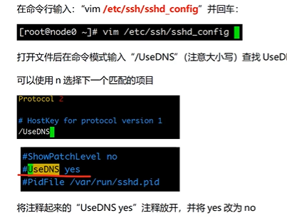

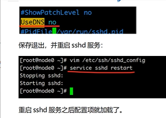

#### 9. 删除 70-persistent-net.rules文件

文件路径 /etc/udev/rules.d


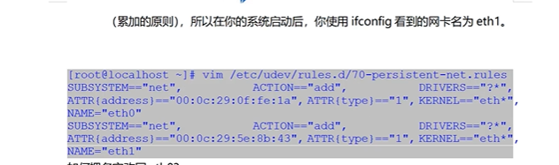

#### 10. 创建统一工作目录

mkdir -p /export/server/  软件安装路径

mkdir -p /export/data/  数据储存路径

mkdir -p /export/software/  安装包存放路径


## 1.3 Linux命令

作者：雨滴测试  来源：toutiao.com/i6947662843621802528/


### 1.帮助命令

#### **1.1 help命令**

```
#语法格式： 命令 --help
#作用: 查看某个命令的帮助信息
# 示例: 
    # ls --help     查看ls命令的帮助信息
    # netstat --help    查看netstat命令的帮助信息
```

#### **1.2 man命令**

```
#语法格式：man 命令
#作用: 查看某个命令的帮助手册
# 示例: 
    # man ls        #查看ls命令的帮助手册
    # man netstat   #查看netstat命令的帮助手册
```

### 2.路径切换及查看

#### **2.1 cd命令**

```
#语法格式：cd 目录
#作用: 切换到目录中
# 示例: 
    # cd /opt       切换到/opt目录下
    # cd ~  切换到用户目录
    # cd -  切换到上一次访问的目录
    # cd .. 切换到上一次所在的目录
```

#### **2.2 pwd命令**

```
#语法格式：pwd
#作用: 查看当前所在路径
# 示例: 
    # pwd   查看当前路径，会将当前路径回显
```

#### **2.3 ls命令**

```
#语法格式：ls [-la] [文件/目录]
#作用: 查看当前路径下的文件和目录，若后带有文件或目录，则只查看当前文件或目录
# 示例: 
    # ls   查看当前路径下所有的文件或目录
    # ls -l 查看当前路径下所有的文件或目录的详细信息
    # ls -a 查看当前路径下所有的文件或目录,将隐藏文件显示出来
    # ls -l a.log   查看当前路径下a.log下的详细信息
```

#### **2.4 find命令**

```
#语法格式：find [路径] [参数] [匹配模式]
#作用: 可以根据给定的路径和表达式查找的文件或目录
# 示例: 
    # find / -name "*.txt"    查询根目录下所有以.txt结尾的文件 。
    # find /test -perm  644   查询/test目录下权限为644的所有文件
    # find . -type f     查询当前目录下所有的文件
    # find . -type f -name "abc"    查询当前目录下所有文件中包含abc字符的文件
    # find . -type f | sort         查询当前目录下所有文件并排序
    # find . -type d                查询当前目录下所有目录
    # find . -size 10M
```

### 3.文件|目录操作

#### **3.1 文件和目录的基本操作**

##### **3.1.1 touch命令**

```
#语法格式：touch 文件名
#作用: 创建一个文件
# 示例: 
    # touch a.log     创建一个a.log文件。
```

##### **3.1.2 ln命令**

```
#语法格式： 
    ln 源文件名 硬链接文件名
    ln -s 源文件名 软连接文件名
#作用: 创建文件链接
# 示例: 
    # ln a.txt a.txt.link     为a.txt创建一个硬链接文件a.txt.link。
    # ln -s a.txt a.txt.link  为a.txt创建一个软连接文件 。
    
# 备注：
    软链接文件：就像Windows中快捷方式一样，只是源文件的一个指向，删除软连接文件，源文件任存在。
    硬链接文件：比如当前目录下有2个文件，这2个文件除了名字不一样其他的一模一样，但是占用的实际磁盘空间还是只有1M，改变任何一个文件的内容另一个文件也会跟着改变；
```

##### **3.1.3 mkdir 命令**

```
#语法格式：mkdir 目录名
#作用: 创建一个目录
# 示例: 
    # mkdir test     创建一个test的目录。
    # mkdir -p test  若存在test，则不创建；若不存在，则创建
    # mkidr -p test/a/b  创建test目录，其下再创建a目录，a目录再创建b目录 。
```

##### **3.1.4 rm命令**

```
#语法格式：rm [-rf] 文件|目录
#作用: 创建文件或目录
# 示例: 
    # rm a.txt     删除a.txt,删除前询问 。
    # rm -f a.txt  直接删除a.txt ,不在询问 。
    # rm -r test  删除test目录，删除前询问
    # rm -rf test  直接删除test目录，不在询问 。
# 备注：任何的删除操作都是危险的动作，慎用 。
```

##### **3.1.5 mv命令**

```
#语法格式：mv 源文件|目录 目标文件|目标目录
#作用: 有两层意思，分别为：
    1. 进行重命名文件或目录
    2. 进行移动文件或目录到目的目录 。
    
# 示例: 
    # mv a.txt b.txt    修改文件名a.txt为b.txt 。
    # mv a.txt test/    移动a.txt 到test目录下
    # mv abc bcd        重命名目录abc为bcd .
    # mv abc bcd/       移动abc目录到bcd下 。
```

##### **3.1.6 cp命令**

```
#语法格式：cp [-rf] 源文件|目录 目标文件|目录
#作用: 拷贝文件或目录为另一个文件或目录 。
    
# 示例: 
    # cp a.txt b.txt   拷贝a.txt为b.txt ,若b.txt以存在，则提示是否继续拷贝 。
    # cp -f a.txt b.txt 拷贝a.txt为b.txt ,即使b.txt以前就存在，也是直接覆盖 。
    # cp -r abc bcd 拷贝abc目录为bcd ,若abc存在，则提示是否继续拷贝 。
    # cp -rf abc bcd 拷贝abc目录为bcd ,即使abc存在，则也是直接覆盖 。
```

#### **3.2 文件压缩与解压缩**

##### **3.2.1 zipinfo命令**

```
#语法格式：zipinfo zip文件
#作用:  查看zip文件里的信息。
    
# 示例: 
    # zipinfo  abc.zip  查看abc.zip里的文件信息 。
    # zipinfo -v abc.zip 显示abc.zip里的每个文件的信息 。
```

##### **3.2.2 zip命令**

```
#语法格式：zip 压缩文件 文件|目录
#作用:  将目标文件或目录进行压缩。
    
# 示例: 
    # zip a.zip a.txt  将a.txt进行压缩形成a.zip 。
    # zip a.zip test/ 将test目录下的所有文件和目录压缩到a.zip 。
```

##### **3.2.3. gzip命令**

```
#语法格式：gzip [-d] 文件|目录
#作用:  压缩|解压缩文件或目录
    
# 示例: 
    # gzip a.txt  将a.txt压缩为a.txt.gz ,注意压缩后源文件已不存在。
    # gzip -d a.txt.gz 解压a.txt.gz文件
```

##### **3.2.4 unzip命令**

```
#语法格式：gzip [-d] 文件|目录
#作用:  压缩|解压缩文件或目录
    
# 示例: 
    # gzip a.txt  将a.txt压缩为a.txt.gz ,注意压缩后源文件已不存在。
    # gzip -d a.txt.gz 解压a.txt.gz文件
```

##### **3.2.5 gunzip命令**

```
#语法格式：gunzip 压缩文件
#作用:  解压压缩文件
    
# 示例: 
    # gunzip a.txt.gz  解压a.txt.gz
    # guzip  test.tar.gz  解压test.tar.gz
```

##### **3.2.6 tar命令**

```
#语法格式：tar [-c|xzvf] 文件|压缩文件
#作用:  进行归档并创建压缩文件 或 进行解压归档压缩文档  
    
# 示例: 
    # tar -cvzf a.tar  a.txt    # 将文件a.txt进行压缩并归档
    # tar -xvzf a.tar .     解压a.tar文件到当前目录 。
```

#### **3.3 文件传输**

##### **3.3.1 tftp命令**

```
#语法格式：tftp 远程主机
#作用:  连接远程主机，上传或下载文件
    
# 示例: (需连接到远程主机)
    # get a.txt        下载a.txt文件
    # put a.txt        上传a.txt到远程主机
```

##### **3.3.2 curl命令**

```
#语法格式：curl url
#作用:  进行文件下载或者请求http协议数据
    
# 示例: 
    # curl  http://www.baidu.com     #请求百度
    # curl -o baidu.html http://www.baidu.com    将请求到的数据保存到baidu.html中 。
```

##### **3.3.3 scp命令**

```
#语法格式：scp 远程主机账号@远程IP地址 本地目录
#作用:  登录远程主机进行拷贝文件或目录
    
# 示例: 
    # scp root@192.168.12.11:/soft/test.tar.gz /tools/    将远程主机目录下的/soft/test.tar.gz 拷贝到本地目录下的tools/下
    # scp root@192.168.12.11:/soft/ /tools/  将远程主机目录soft 拷贝到本地目录的tools/下 。
```

##### **3.3.4 rcp命令**

```
#语法格式：scp 主机1 主机2
#作用:  远程主机间的文件或目录相互拷贝
    
# 示例: 
    #  rcp test 192.168.128.169:/test    拷贝当前目录下的test 到192.168.128.169的/test目录下
    #  rcp root@192.168.128.169:./test  /test 复制远程目录到本地的/test下
```

#### **3.4 文件属性查看**

##### **3.4.1 file命令**

```
#语法格式：file 文件名
#作用:  查看文件的类型
    
# 示例: 
    #  file a.txt   #查看a.txt是什么类型 
    #  file abc     #查看abc是什么类型 
```

##### **3.4.2 du命令**

```
#语法格式：du 文件名
#作用:  查看文件的大小
    
# 示例: 
    #  du a.txt    #查看a.txt的文件大小，以k为单位
    #  du -h a.txt      #查看a.txt的文件大小，以M为单位 。
```

#### **3.5 文件目录权限设置**

##### **3.5.1 chmod命令**

```
#语法格式： 有两种用法
    chmod [u/g/o/a][+/-/=] rwx 文件/目录     +:增加权限，-取消权限， =设定权限
    chmod 数字 文件/目录
    
#作用:  为文件或目录设置权限。
    
# 示例: 
    #  chmod a=rw a.txt  为所有者设置读写权限 。
    #  chmod 644 a.txt   为所有者设置读权限，为用户设置写权限。
```

### 4.文本内容查看及过滤

#### **4.1 文本内容查看**

##### **4.1.1 cat命令**

```
#语法格式：cat 文件名
#作用:  查看文本内容，会将内容全部显示。
    
# 示例: 
    #  cat a.txt  显示a.txt里的内容。
```

##### **4.1.2 more命令**

```
#语法格式：more 文件名
#作用:  百分比显示文件内容，按Enter继续。
    
# 示例: 
    #  more a.txt  若只有一页，则全部显示，否则按百分比显示。
```

##### **4.1.3 tail命令**

```
#语法格式：
        tail 文件名        #查看文本内容
        tail -n 数量 文件名      #只显示倒数的几行
        tail -f 文件名         # 实时的查看文件写入的信息
#作用:  查看文本内容，
    
# 示例: 
    #  tail a.txt   查看文件内容，和cat效果一样 。
    #  tail -n 2 a.txt  显示a.txt最后两行 
    #  tail -f a.txt    实时监控a.txt文本内容。
```

##### **4.1.4 head命令**

```
#语法格式： 
    head 文件名
    head -n 数量 文件名
#作用:  查看文本内容。
    
# 示例: 
    #  head a.txt    查看文本内容，和cat效果一样。
    #  head -n 2 a.txt  查看文本的前两行 。
```

#### **4.2 文本内容筛选过滤**

##### **4.2.1 grep命令**

```
#语法格式：grep [选项] [模式] 文件
#作用:  文本搜索工具。
    
# 示例: 
    #  grep "aaa" a.txt    从a.txt中搜索aaa字符的行
    #  grep -v "aaa" a.txt  从a.txt中不包含aaa的行 
    #  grep -n "aaa" a.txt  从a.txt中搜索aaa字符的行,并在前面加上行号
    #  grep -i "aaa" a.txt  从a.txt中搜索aaa字符的行,其中忽略aaa的大小写
    #  grep -e "a*" a.txt   从a.txt中搜索匹配a字符的行
    #  ps -ef |grep "mysql"   查看mysql的进程
    
#备注：grep命令非常强大，详细用法请参考本人另一篇关于grep命令的博文
```

##### **4.2.2 sed命令**

```
#语法格式：sed [选项]  文件
#作用:  文本编辑工具。
    
# 示例: 
    #  sed -n '2p' a.txt    从a.txt中的第二行内容
    #  sed '3,5d' a.txt     删除a.txt中第3到5行的内容，(注：源文件内容不变，只是回显内容会删除)
    #  sed '/aaa/d' a.txt   删除匹配aaa的行，从a.txt中 。
    
#备注：sed命令非常强大，详细用法请参考本人另一篇关于sed命令的博文
```

##### **4.2.3 awk命令**

```
#语法格式：awk [选项]  文件
#作用:  文本分析工具。
    
# 示例: 
    #  awk '{print $5}' a.txt    显示a.txt中第5列的内容
    #  awk 'NR <=2 {print $1,$3,$5}' a.txt   显示前两行内容，每行只显示第1,3,5列 。
    #  awk '/^d/ {print $1,$9}' a.txt 显示以d开头的行，每行只显示第一，九列 。
    
#备注：awk命令非常强大，详细用法请参考本人另一篇关于awk命令的博文
```

##### **4.2.4 cut命令**

```
#语法格式：cut 选项 文件
#作用:  用于剪切字符。
    
# 示例: 
    #  cut -c 1-3 a.txt 只输出每行第一到第三的字符
    #  cut -f4 -d" " a.txt 显示第四列，以空格为分隔符 
```

##### **4.2.5 col命令**

```
#语法格式：col 选项 文件
#作用:  用于过滤字符。
    
# 示例: 
    #  man ls | col-b > ls_help  过滤掉ls手册中的控制字符并输出到文件
```

#### **4.3 文本编辑**

##### **4.3.1 vi/vim命令**

```
#语法格式：vi/vim  文件
#作用:  用于编辑文件。
    
# 示例:  
    #  vi a.txt   编辑a.txt,可以进行修改里面的内容
    #  vim a.txt  编辑a.txt,可以进行修改里面的内容
# 备注：
vi和vim的用法基本一样，可以说vim是vi的增加版，就像记事本与notepad++
```

#### **4.4 输出到文本$$文件**

##### **4.4.1 >命令**

```
#语法格式： >  文件
#作用:  将内容输出到文件，若文件中有内容则覆盖。若文件不存在，则创建文件
    
# 示例:  
    #  ll > a.txt   查看详细后输出到a.txt 。
    #  cat a.txt > b.txt  将a.txt中的内容添加到b.txt中 。
```

##### **4.4.2 >>命令**

```
#语法格式： >>  文件
#作用:  将内容追加到文件，若文件中有内容则追加。若文件不存在，则创建文件
    
# 示例:  
    #  ll >> a.txt   查看详细后追加到a.txt 。
    #  cat a.txt >> b.txt  将a.txt中的内容添加到b.txt中 。
```

##### **4.4.3 tee命令**

```
#语法格式：tee  文件
#作用:  将内容输出到文件并输出内容显示在控制台上。若文件不存在，则创建文件，一般需要和管道符(|)一起使用。
    
# 示例:  
    #  cat a.txt | tee b.txt  将a.txt中的内容添加到b.txt中，同时将添加内容回显到控制台上 。
```

#### **4.5 文本内容处理**

##### **4.5.1 join命令**

```
#语法格式：join  文件1 文件2
#作用:  用于将两个文件中，指定栏目内容相同的行连接起来
    
# 示例:  
    #  join a.txt b.txt   若第一行相同，将后面的内容连接起来 。
```

##### **4.5.2 split命令**

```
#语法格式：split 数量 文件
#作用:  用于将一个文件分割成数个
    
# 示例:  
    # split -5 c.txt  按每5行显示分隔出一个文件。
```

##### **4.5.3 uniq命令**

```
#语法格式：uniq  文件
#作用:  用于检查及删除文本文件中重复出现的行列，注意：重复的行一定是相邻的行，若不相邻不会删除
    
# 示例:  
    #  uniq d.txt  将d.txt中相邻重复的行去掉 。
    #  uniq d.txt | sort  将d.txt中相邻重复的行去掉并排序
# 备注： 此命令经常和sort命令结合使用，用于去重和排序。
```

##### **4.5.4 sort命令**

```
#语法格式：sort  文件
#作用:  对文本内容进行排序
    
# 示例:  
    #  sort a.txt  将a.txt中的内容进行排序，默认为升序。
    # sort -r a.txt 将a.txt中的内容进行相反顺序排序
    #  uniq d.txt | sort -r 将d.txt中相邻重复的行去掉并倒序排序
```

##### **4.5.5 paste命令**

```
#语法格式：paste  文件1 文件2 ...
#作用:  用于合并文件的列。
    
# 示例:  
    #  cat a.txt b.txt  将两个文件的列合并起来显示 。
```

### 5.用户|组操作

#### **5.1 用户增删改**

##### **5.1.1 useradd命令**

```
#语法格式：useradd 新用户
#作用:  创建用户
    
# 示例:  
    #  useradd test    创建test用户
    #  useradd -d /home/test  test  创建test用户，并指定test用户的家目录为home/test
    #  useradd -u 666 test   为test用户指定uid为666
```

##### **5.1.2 adduser命令**

```
#语法格式：adduser 新用户
#作用:  创建用户
    
# 示例:  
    #  adduser test    创建test用户
    #  adduser -d /home/test  test  创建test用户，并指定test用户的家目录为home/test
    #  adduser -u 666 test   为test用户指定uid为666
# 备注：useradd和adduser使用上一致，设置两个命令可能就是为了解决用户将字母记错输返。
```

##### **5.1.3 userdel命令**

```
#语法格式：userdel 用户
#作用:  删除用户
    
# 示例:  
    #  userdel test   删除test用户
    #  userdel -r test  删除test用户及其家目录
```

##### **5.1.4 usermod命令**

```
#语法格式：usermod 用户
#作用:  修改用户
    
# 示例:  
    #  usermod -l test1 test    将用户test修改为test1
    #  usermod -d /home/test00  test   将用户test的家目录修改为/home/test00
    #  usermod -L test      锁定test用户的密码
    #  usermod -U test      解锁test用户的密码
```

#### **5.2 用户设置密码**

##### **5.2.1 passwd命令**

```
#语法格式：passwd 用户
#作用:  修改用户密码，输入命令回车后会引到用户设置新密码 。
    
# 示例:  
    #  passwd test     修改用户密码
```

#### **5.3 组的增删改**

##### **5.3.1 groupadd命令**

```
#语法格式：groupadd 用户组
#作用:  添加用户组
    
# 示例:  
    #  groupadd  test   添加用户组为test
    #  groupadd -g 9999 test  为创建用户组test并设置gid为9999
```

##### **5.3.2 groupdel命令**

```
#语法格式：groupdel 用户组
#作用:  删除用户组
    
# 示例:  
    #  groupdel test  删除用户组test
```

##### **5.3.3 groupmod**

```
#语法格式：groupmod 用户组
#作用:  修改用户组
    
# 示例:  
    #  groupmod -n root test    更改test用户组为root
```

#### **5.4 文件设置用户权限**

##### **5.4.1 chown命令**

```
#语法格式：chown 文件|目录 用户|用户组
#作用:  更改文件目录的用户或用户组
    
# 示例:  
    #  chown root /test/a.txt  把a.txt的所有者设置为root
    #  chown root:root /test/a.txt   把a.txt的所有者设置为root,组设置为root
    #  chown -R test:test *    把当前目录下的所有文件都设置为test用户和test用户组
```

#### **5.5 切换用户**

##### **5.5.1 su命令**

```
#语法格式：su [-] 用户
#作用:  切换用户
    
# 示例:  
    #  su test  切换当前用户为test用户   
    #  su - test 切换当前用户为test用户
# 备注： 第一次切换时需要输入密码
```

### 6.任务管理器

#### **6.1 进程**

##### **6.1.1 ps命令**

```
#语法格式：ps [参数]
#作用:  显示当前系统的进程状态
    
# 示例:  
    #  ps -ef   显示所有进程
    #  ps -aux   显示所有进程
    #  ps -ef | grep mysql  查看mysql进程
    #  ps -u root 显示root用户进程。
```

##### **6.1.2 kill 命令**

```
#语法格式：kill [参数]
#作用:  杀掉系统中执行的程序(进程)
    
# 示例:  
    #  kill 319877   杀掉进程319877
    #  kill -9  319877  强制杀掉进程319877
```

#### **6.2 系统资源**

##### **6.2.1 top命令**

```
#语法格式：top [参数]
#作用:  显示系统中各个进程的资源占用情况
    
# 示例:  
    #   top    查看系统各个进程的资源占用，比如CPU ，内存信息。  
    #   top -n 5  动态更新5次结束
    #   top -d 5  每隔5秒更新一次
```

##### **6.2.2 vmstat命令**

```
#语法格式：vmstat [参数]
#作用:  显示虚拟内存状态
    
# 示例:  
    #     vmstat    显示内存信息
    #     vmstat  -s   以列表形式显示内存
    #     vmstat 2  每隔2秒刷新一次
```

##### **6.2.3 free命令**

```
#语法格式：free [参数]
#作用:  查看系统内存信息
    
# 示例:  
    #   free   显示内存信息，默认以kb为单位  
    #   free -m   显示内存信息，以mb为单位
    #   free -g   显示内存信息，以gb为单位
```

##### **6.2.4 df命令**

```
#语法格式：  df [参数] 分区
#作用:  查看磁盘占用空间
    
# 示例:  
    #     df    查看各分区在磁盘占用情况
    #     df -h   以比较容易阅读方式查看磁盘使用情况
    #     df /dev/shm   查看该挂载点下的使用情况
```

##### **6.2.5 fdisk命令**

```
#语法格式：fdisk [参数]
#作用:  进行磁盘分区管理
    
# 示例:  
    #  fdisk -l  查看所有分区情况   
```

##### **6.2.6 netstat命令**

```
#语法格式：netstat [参数]
#作用:  显示各种网络信息
    
# 示例:  
    #   netstat    查看各网络信息 
    #   netstat -an | grep 3306   查看3306端口的使用情况
```

#### **6.3 服务**

##### **6.3.1 service命令（RHEL6）**

```
#语法格式：service [参数]
#作用:  服务管理
    
# 示例:  
    #   service --status-all    查看所有服务的运行状态  
    #   service  mysql  start   启动mysql
    #   service  mysql  stop    停止mysql
    #   service  mysql  restart   重启mysql
```

##### **6.3.2 systemctl命令（RHEL7）**

```
#语法格式：systemctl [选项] [服务]
#作用:  对服务进行管理，如启动/重启/停止/查看服务
    
# 示例:  
    #  systemctl status httpd.service   查看http服务状态
    #  systemctl start httpd.service    启动http服务
    #  systemctl stop  httpd.service    停止http服务
    #  systemctl restart httpd.service  重启http服务
    #  systemctl status firewalld   查看防火墙状态
    #  systemctl start firewalld   开启防火墙
    #  systemctl stop firewalld    关闭防火墙
```

##### **6.3.3 chkconfig命令**

```
#语法格式：chkconfig [参数]
#作用:  更新（启动或停止）和查询系统服务的运行级信息
    
# 示例:  
    #     chkconfig -list   显示所有运行级系统服务的运行状态信息（on或off）
    #     chkconfig –add httpd        增加httpd服务
    #     chkconfig –del httpd        删除httpd服务
```

### 7.网络管理

#### **7.1 ifconfig命令**

```
#语法格式：ifconfig 
#作用:  查看或设置网络设备
    
# 示例:  
    #  ifconfig   查看网络信息，比如IP地址
    #  ifconfig eth0 down    关闭eth0的网卡 
    #  ifconfig eth0 up      开启eth0的网卡
    #  ifconfig eth0 hw ether 00:AA:BB:CC:DD:EE   修改Mac地址
    #  ifconfig eth0 add 32ffe:3840:320:2007::2/64      为网卡配置IPV6地址
    #  ifconfig eth0 del 32ffe:3840:320:2007::2/64      删除网卡的IPV6地址
    # ifconfig eth0 192.168.128.169     修改ip地址为192.168.128.169 
    # ifconfig eth0 192.168.128.169 netmask 255.255.255.0    修改IP和子网掩码
    # ifconfig eth0 192.168.1.56 netmask 255.255.255.0 broadcast 192.168.1.255  修改ip，子网掩码及网关
```

#### **7.2 ping命令**

```
#语法格式：ping IP地址
#作用:  确认是否和某主机的网络相同
    
# 示例:  
    #  ping 192.168.12.12  确认是否能连通到192.168.12.12
    #  ping www.baidu.com  确认是否能正常访问百度
    #  ping -c 4 www.baidu.com  只ping四次
    #  ping -c 4 -i 2 www.baidu.com  只ping四次，每次间隔2s
```

#### **7.3 firewall-cmd命令**

```
#语法格式：firewall-cmd [参数]
#作用:  防火墙端口管理
    
# 示例:  
    #  firewall-cmd --state   查看当前防火墙的运行状态
    #  firewall-cmd --zone=public --list-ports   查看所有放行的端口
    #  firewall-cmd --reload   重新加载修改的配置
    #  firewall-cmd --query-port=8888/tcp   查询端口8888是否被开放7.3 systemctl命令

#语法格式：systemctl [选项] [服务]
#作用:  对服务进行管理，如启动/重启/停止/查看服务
    
# 示例:  
    #  systemctl status httpd.service   查看http服务状态
    #  systemctl start httpd.service    启动http服务
    #  systemctl stop  httpd.service    停止http服务
    #  systemctl restart httpd.service  重启http服务
    #  systemctl status firewalld   查看防火墙状态
    #  systemctl start firewalld   开启防火墙
    #  systemctl stop firewalld    关闭防火墙
```

#### 7.4 firewall-cmd命令

```
#语法格式：firewall-cmd [参数]
#作用:  防火墙端口管理
    
# 示例:  
    #  firewall-cmd --state   查看当前防火墙的运行状态
    #  firewall-cmd --zone=public --list-ports   查看所有放行的端口
    #  firewall-cmd --reload   重新加载修改的配置
    #  firewall-cmd --query-port=8888/tcp   查询端口8888是否被开放
    #  firewall-cmd --add-port=8888/tcp    开启8888端口通过防火墙
    #  firewall-cmd --permanent --remove-port=123/tcp   关闭123端口


    #  firewall-cmd --add-port=8888/tcp    开启8888端口通过防火墙
    #  firewall-cmd --permanent --remove-port=123/tcp   关闭123端口
```

### 8.安装更新配置

#### **8.1 yum命令**

```
#语法格式：yum [选项]
#作用:  rpm的软件包管理器
    
# 示例:  
    #  yum install mysql     安装mysql
    #  yum remove mysql      卸载mysql 
    #  yum clean  mysql      清除缓存目录下的安装包
    #  yum install           全部安装
    #  yum update            全部更新
    #  yum update mysql      更新mysql
    #  yum info   mysql      显示mysql安装包信息
    #  yum list  mysql       显示mysql安装包信息
    #  yum list              显示所有已安装包和可安装包
```

#### **8.2 sh命令**

```
#语法格式：sh  可执行文件
#作用:  运行可执行文件，一般都是shell脚本
    
# 示例:  
    #  sh a.sh      运行a.sh文件，
    #  sh -x a.sh   运行并调试a.sh脚本
```

### 9.系统相关

#### **9.1 环境变量**

##### **9.1.1 set命令**

```
#语法格式：set [参数]
#作用:  显示当前shell的变量，包括当前用户的变量;
    
# 示例:  
    #  abcd=100
    #  set | grep abcd    显示abcd的变量值
```

##### **9.1.2 unset命令**

```
#语法格式：unset [参数]
#作用:  删除shell变量的值
    
# 示例:  
    #  abcd=100
    #  unset abcd    删除abcd的变量值
```

##### **9.1.3 env命令**

```
#语法格式：env [参数]
#作用:  设置或显示当前环境变量
    
# 示例:  
    #  env    显示当前环境变量
    #  env abcd=10    定义环境变量
    #  env -u  abcd   删除已经定义的环境变量abcd
```

##### **9.1.4 export命令**

```
#语法格式：export [参数]
#作用:  设置或显示环境变量
    
# 示例:  
    #  export  显示当前环境变量
    #  export abcd=101  定义环境变量
```

#### **9.2 重启与关机**

##### **9.2.1 shutdown命令**

```
#语法格式：shutdown [参数]
#作用:  关闭或重启
    
# 示例:  
    #  shutdown -h now      立即关机
    #  shutdown -r now      立即重启
    #  shutdown -h 22:30    22:30关机
```

##### **9.2.2 reboot命令**

```
#语法格式：reboot [参数]
#作用:  重启计算机
    
# 示例:  
    #  reboot  重启
```

##### **9.2.3 poweroff命令**

```
#语法格式：poweroff [参数]
#作用:  关闭计算机
    
# 示例:  
    #  poweroff    关闭计算机及电源
```

##### **9.2.4 halt命令**

```
#语法格式：halt 
#作用:  关闭操作系统
    
# 示例:  
    #  halt      关闭系统
    #  halt -p   关闭计算机及电源，等同于poweroff
    #  halt -f   强制关机
```

##### **9.2.5 exit命令**

```
#语法格式：exit
#作用:  退出当前执行的shell
    
# 示例:  
    #  exit   退出当前shell 
```

#### **9.3 查看系统信息**

##### **9.3.1 uname命令**

```
#语法格式：uname [参数]
#作用:  显示系统相关信息
    
# 示例:  
    #  uname       显示当前系统
    #  uname -an   显示系统的详细信息
    #  uname -r    显示内核信息
    #  uname -i    显示当前架构
```

##### **9.3.2 date命令**

```
#语法格式：date [参数]
#作用:  显示或设定时间
    
# 示例:  
    #  date    查看当前时间
    #  date -s "2021-04-04 22:38:56"   设置时间为2021-04-04 22:38:56
```

##### **9.3.3 last命令**

```
#语法格式：last 
#作用:  显示最近用户或终端的登录情况
    
# 示例:  
    #  last    显示最近用户的登录情况
```

##### **9.3.4 history命令**

```
#语法格式：history [参数]
#作用:  查看历史输入命令
    
# 示例:  
    #  history   查看历史命令
    #  history  | grep "sed"    查看输入过sed命令
    #  history -5  查看最近的5条命令
```

##### **9.3.5 who命令**

```
#语法格式：who [参数]
#作用:  查看当前登录用户信息
    
# 示例:  
    #  who    查看登录用户信息
    #  who -H  带标题显示 
    #  who -b  输出系统最近启动时间
```

#### **9.4 定时任务**

##### **9.4.1 crontab命令**

```
#语法格式：crontab [参数] 
#作用:  任务调度
    
# 示例:  
    #  crontab -l   查看当前计划任务
    #  crontab -e   创建计划任务，打开后，需要以按照如下格式编辑
    
#备注

#设置格式如下：
minute(分)   hour(小时)   day(天)   month(月)   week(周)   command(命令)   

# 设置范围：
minute   是从0到59之间的任何整数
hour     是从0到23之间的任何整数
day      是从1到31之间的任何整数
month    是从1到12之间的任何整数
week     是从0到7之间的任何整数，其中0或7代表星期日
command  要执行的命令，可以是系统命令，也可以是自己编写的脚本文件
若某列没有设置，则使用*代替 。

# 举例：
* * 1 * *   tar -czvf bk.tar.gz /log_bakup       # 每天进行一次归档备份
```

#### **9.5 运行管理员权限**

##### **9.5.1 sudo命令**

```
#语法格式：sudo [命令]
#作用:  运行以管理员权限运行命令,一般是非root用户进行操作
    
# 示例:  (假设当前账号为test)
    #  sudo mkdir abc   创建abc目录 。
```

#### **9.6 其它**

##### **9.6.1 clear命令**

```
#语法格式：clear
#作用:  清屏操作，也可以使用快捷键Ctrl + L
    
# 示例:  
    #  clear  清屏
```

##### **9.6.2 echo命令**

```
#语法格式：echo [变量]
#作用:  输出变量值
    
# 示例:  
    #  echo  $abc  输出变量abc的值，需要提前定义abc的值
    #  echo  `pwd`  显示当前路径
```


## 1.4 Linux编辑器

### 1. VIM编辑器

#### 1.1 保存退出

:q 退出

:w 保存

:wq 保存退出

:wq! 强制保存退出

:q! 强制退出

shift + zz 命令模式下快速保存退出

#### 1.2 编辑模式进入

i 输入模式，定位当前光标前面

o 输入模式，定位到当前行的下一行（添加一行空行）

#### 1.3 光标移动操

home 行首 end 行尾

G 跳到文件的最后一行

gg 跳到文件第一行

#### 1.4  复制粘贴

yy 复制光标当前所在行

nyy 复制当前行往下n行

p 粘贴到当前行的下一行

P 粘贴到当前行的上一行

#### 1.5 删除、撤销操作

dd 删除光标所在当前行

ndd 删除当前行往下n行

u 撤销上一步操作

Ctrl + r 反撤销

#### 1.6 批量缩进

方法一：

    在程序代码界面，按esc，退出编辑模式，到命令模式，并在英语输入法下输入“：”
    
    将所要批量缩进的行号写上，按照格式：“行号1，行号2>”输入命令，如要将2至9行批量缩进一个tab值，则命令为“2,9>”
    
    输入完毕后，按回车可以执行，就可以看到2至9行全部缩进了一个tab值了，

同样的，如果要缩回来一个tab值，则用命令“行号1，行号2<”即可

方法二：

    方法二是在编辑模式下选择要移动的列，操作为，esc从编辑模式退到命令模式，将光标移到需要缩进的行的行首，然后按shift+v，可以看到该行已被选中，且左下角提示为“可视”
    
    此时，按键盘上的上k下j左h右l方向键，如这里按向下的箭头，选中所有需要批量缩进的行
    
    选择好了之后，按shift+>,是向前缩进一个tab值，按shift+<，则是缩回一个tab值


## 1.5 Ubuntu安装软件和服务器

## 1.6 虚拟机VMware 安装

### 1. 软件下载

VMware Workstation Pro 15 存放于百度网盘

### 2. 安装

省略

### 3. 虚拟机安装注意事项

安装路径：尽量避免中文路径及有空格

#### 3.1、虚拟机网络配置

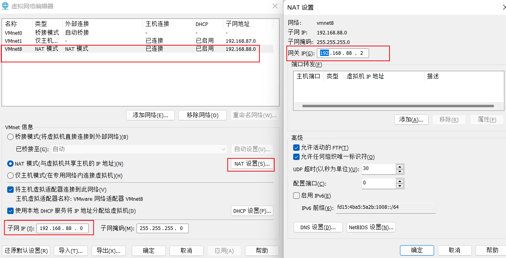

#### 3.2、虚拟机网卡配置


#### 3.3 网络验证


网卡验证失败：

https://blog.csdn.net/wofengyun/article/details/90513262

### 4. 虚拟机克隆

### 5. 虚拟机快照


# 第二节：Python基础

## Python之禅

```python
Beautiful is better than ugly.
精美优于丑陋。
Explicit is better than implicit.
明确优于含混。
Simple is better than complex.
简明优于繁复。
Complex is better than complicated.
繁复优于难懂。
Flat is better than nested.
平铺直叙优于构架交错。
Sparse is better than dense.
错落有致优于密密麻麻。
Readability counts.
易读性很必要。
Special cases aren't special enough to break the rules. Although practicality beats purity.
尽管在按部就班面前，实用性更重要，但是在规则面前没有特例。
Errors should never pass silently. Unless explicitly silenced.
错误不应被轻易的放过，除非故意如此。
In the face of ambiguity, refuse the temptation to guess.
在模棱两可的时候不要试图去盲目测试。
There should be one-- and preferably only one --obvious way to do it.
一定有一种明显的方法去解决它，最好是唯一一种。
Although that way may not be obvious at first unless you're Dutch.
尽管在开始时没有那么显而易见，除非你是个荷兰人。（Python创始人是个荷兰人，或是调侃复杂问题像是看荷兰语）
Now is better than never. Although never is often better than *right* now.
尽管从不开始经常好过于不暇思索立马就做，但是现在仍优于从不开始。
If the implementation is hard to explain, it's a bad idea.
如何执行方案很难解释，那这行不通。
If the implementation is easy to explain, it may be a good idea.
如果执行方案很容易解释，那这或许是个好主意。
Namespaces are one honking great idea -- let's do more of those!
命名空间是个超级棒的主意，让我们多一些这样的想法。
```

---

## 1.1 认识Python

## 1.2 变量&输入输出&基本数据类型

**变量**
