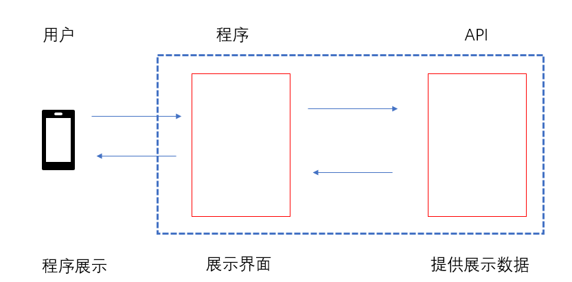
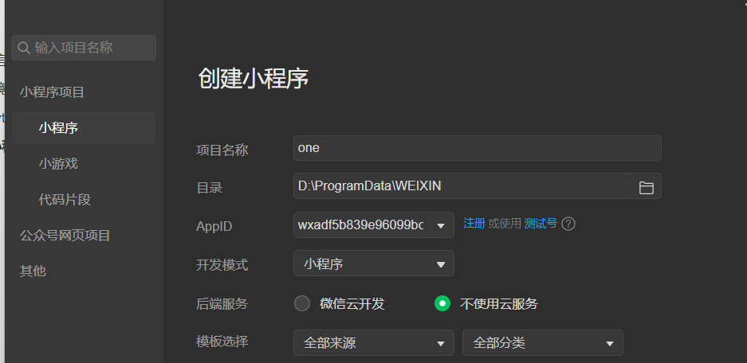
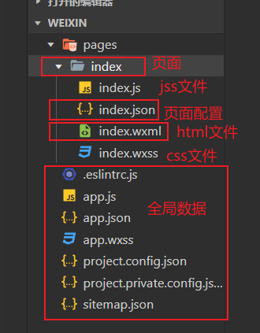
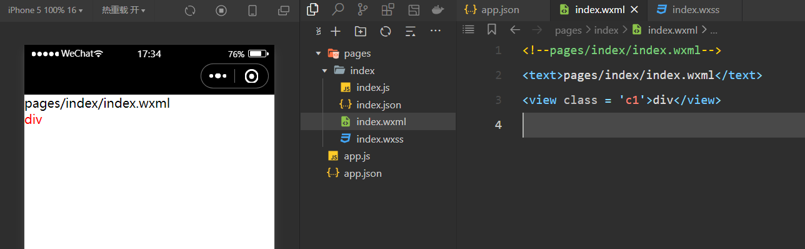

[官方文档](https://developers.weixin.qq.com/miniprogram/dev/framework/)

# 一、微信小程序介绍

小程序整体结构图：



- 小程序：微信开发的语言（前端html、css、js、vue.js）
  - 工具：微信开发者工具

- API：restful接口（python + django + drf框架）
  - 工具： pycharm

# 二、环境搭建

## 2.1 python环境

- 创建虚拟环境
  - django
  - drf
- pycharm

## 2.2 小程序环境

### 2.2.1 申请微信公众平台账号

小程序模块

### 2.2.2 保存自己的APPID

```
AppID(小程序ID)	wxadf5b839e96099bc
```

### 2.2.3 下载开发者工具

平台下载

### 2.2.4 创建项目



### 2.2.5 工具界面介绍

- 文件目录介绍



### 2.2.5 项目搭建



# 三、开发小程序

## 3.1 全局配置