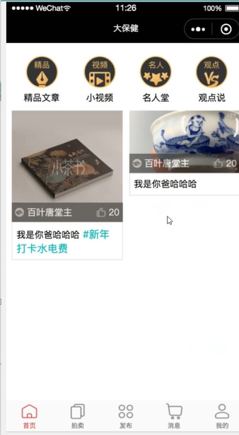
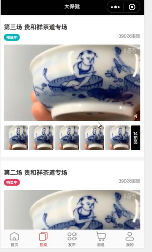
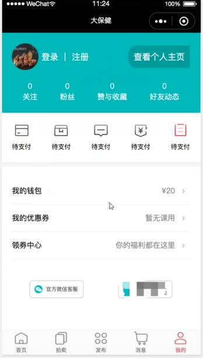

[官方文档](https://developers.weixin.qq.com/miniprogram/dev/framework/)

# 一、微信小程序介绍

小程序整体结构图：


- 小程序：微信开发的语言（前端html、css、js、vue.js）
  - 工具：微信开发者工具

- API：restful接口（python + django + drf框架）
  - 工具： pycharm

# 二、环境搭建

## 2.1 python环境

- 创建虚拟环境
  - django
  - drf
- pycharm

## 2.2 小程序环境

### 2.2.1 申请微信公众平台账号

小程序模块

### 2.2.2 保存自己的APPID

```
AppID(小程序ID)	wxadf5b839e96099bc
```

### 2.2.3 下载开发者工具

平台下载

### 2.2.4 创建项目


### 2.2.5 工具界面介绍

- 文件目录介绍


### 2.2.5 项目搭建


# 三、开发小程序

## 3.1 全局配置

app.json

==不允许注释==

```
{
  "pages": [
    "pages/index/index",
    "pages/home/home",
    "pages/test1/test1",
    "pages/test2/test2"
  ],
  "window": {
    "backgroundTextStyle": "light",
    "navigationBarBackgroundColor": "#fff",
    "navigationBarTitleText": "微信小程序学习",
    "navigationBarTextStyle": "black"
  },
  "tabBar": {
      "list": [
      {
        "pagePath": "pages/index/index",
        "text": "首页"
      },
      {
        "pagePath": "pages/test1/test1",
        "text": "测试1"
      },
      {
        "pagePath": "pages/test2/test2",
        "text": "测试2"
      },
      {
        "pagePath": "pages/home/home",
        "text": "我的"
      }
    ]
  }
}
```

## 3.2 组件

### 3.2.1 text

编写文本信息，类似于span标签

### 3.2.2 view

容器，类似于div标签

### 3.2.3 image

图片

## 3.3 样式

### 3.3.1 像素

- px  不会调整
- rpx  ==推荐使用==，根据设备自动调整，规定设备固定750rpx

# 四、flex布局

一种非常方便的布局方式

在容器中记住4个样式即可

```
  /* flex布局 */
  display: flex;
  /* 在水平方向排列 */
  /* row,规定主轴方向为水平 */
  /* column,规定在主轴方向为垂直 */
  flex-direction: row;
  /* 在主轴(x)方向均匀分布  flex-(start 左对齐 end 右对齐) space-around（around 均匀 betwee 两端对齐）*/
  justify-content: space-around;
  /* 在副轴（y）方向分布  flex-(start 左对齐 end 右对齐) space-around（around 均匀 betwee 两端对齐） */
  align-items:flex-start;
```

# 五、实战页面

## 5.1 首页



## 5.2 拍卖页



## 5.3 消息页


## 5.4 我的


