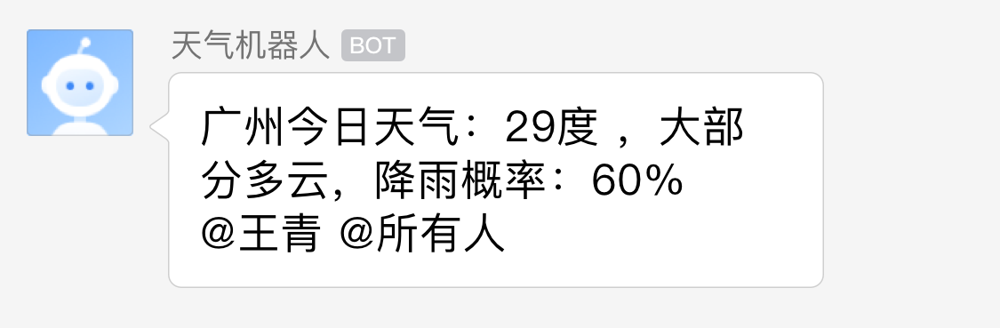
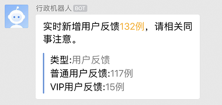
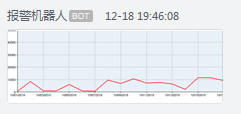
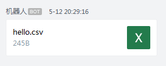
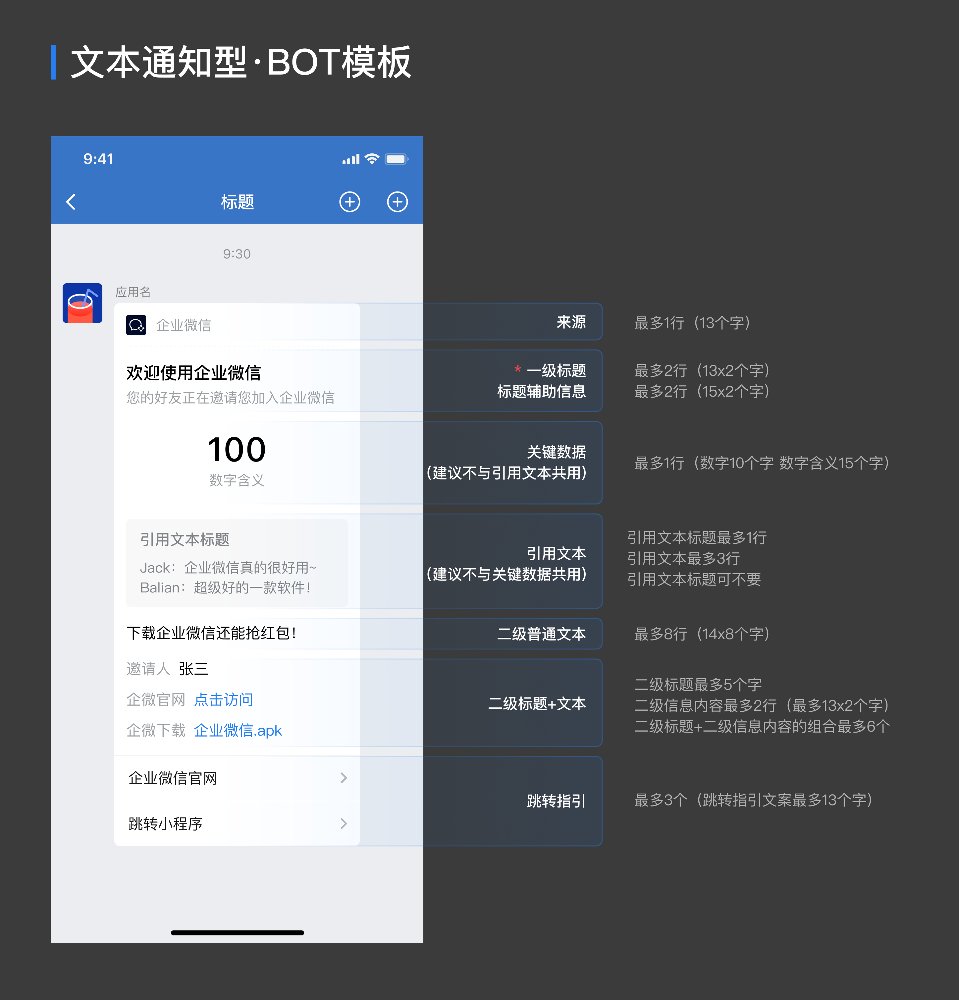
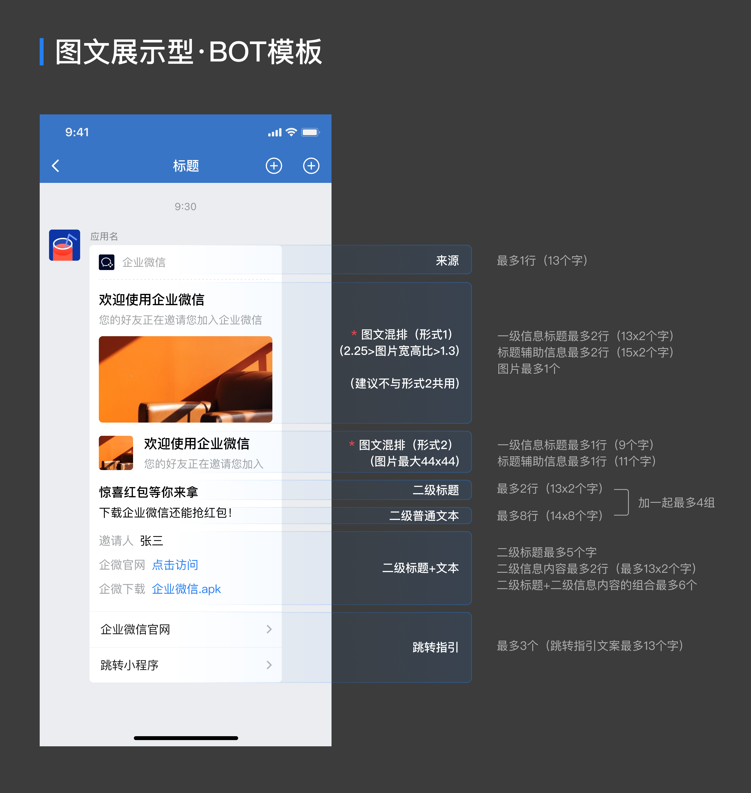

**微信机器人**

20220725 注册企业微信，微信机器人(webhookurl地址)：

`https://qyapi.weixin.qq.com/cgi-bin/webhook/send?key=694abbd3-9bfa-4bb4-9e9b-09fd7ab197d4`

- 当前自定义机器人支持文本（text）、markdown（markdown）、图片（image）、图文（news）四种消息类型。
- 机器人的text/markdown类型消息支持在content中使用<@userid>扩展语法来@群成员

# 一、官方文档

## 消息类型及数据格式

### 文本类型

```javascript
{
    "msgtype": "text",
    "text": {
        "content": "广州今日天气：29度，大部分多云，降雨概率：60%",
		"mentioned_list":["wangqing","@all"],
		"mentioned_mobile_list":["13800001111","@all"]
    }
}
```

| 参数                  | 是否必填 | 说明                                                         |
| --------------------- | -------- | ------------------------------------------------------------ |
| msgtype               | 是       | 消息类型，此时固定为text                                     |
| content               | 是       | 文本内容，最长不超过2048个字节，必须是utf8编码               |
| mentioned_list        | 否       | userid的列表，提醒群中的指定成员(@某个成员)，@all表示提醒所有人，如果开发者获取不到userid，可以使用mentioned_mobile_list |
| mentioned_mobile_list | 否       | 手机号列表，提醒手机号对应的群成员(@某个成员)，@all表示提醒所有人 |

 



### markdown类型

```json
{
    "msgtype": "markdown",
    "markdown": {
        "content": "实时新增用户反馈<font color=\"warning\">132例</font>，请相关同事注意。\n
         >类型:<font color=\"comment\">用户反馈</font>
         >普通用户反馈:<font color=\"comment\">117例</font>
         >VIP用户反馈:<font color=\"comment\">15例</font>"
    }
}
```

| 参数    | 是否必填 | 说明                                               |
| ------- | -------- | -------------------------------------------------- |
| msgtype | 是       | 消息类型，此时固定为markdown                       |
| content | 是       | markdown内容，最长不超过4096个字节，必须是utf8编码 |



目前支持的markdown语法是如下的子集：

1. 标题 （支持1至6级标题，注意#与文字中间要有空格） 

   ```javascript
   # 标题一
   ## 标题二
   ### 标题三
   #### 标题四
   ##### 标题五
   ###### 标题六
   ```

2. 加粗

   ```javascript
   **bold**
   ```

3. 链接

   ```javascript
   [这是一个链接](http://work.weixin.qq.com/api/doc)
   ```

4. 行内代码段（暂不支持跨行）

   ```javascript
   `code`
   ```

5. 引用

   ```javascript
   > 引用文字
   ```

6. 字体颜色(只支持3种内置颜色)

   ```javascript
   <font color="info">绿色</font>
   <font color="comment">灰色</font>
   <font color="warning">橙红色</font>
   ```

### 图片类型

```javascript
{
    "msgtype": "image",
    "image": {
        "base64": "DATA",
		"md5": "MD5"
    }
}
```

| 参数    | 是否必填 | 说明                            |
| ------- | -------- | ------------------------------- |
| msgtype | 是       | 消息类型，此时固定为image       |
| base64  | 是       | 图片内容的base64编码            |
| md5     | 是       | 图片内容（base64编码前）的md5值 |

> 注：图片（base64编码前）最大不能超过2M，支持JPG,PNG格式



### 图文类型

```javascript
{
    "msgtype": "news",
    "news": {
       "articles" : [
           {
               "title" : "中秋节礼品领取",
               "description" : "今年中秋节公司有豪礼相送",
               "url" : "www.qq.com",
               "picurl" : "http://res.mail.qq.com/node/ww/wwopenmng/images/independent/doc/test_pic_msg1.png"
           }
        ]
    }
}
```

| 参数        | 是否必填 | 说明                                                         |
| ----------- | -------- | ------------------------------------------------------------ |
| msgtype     | 是       | 消息类型，此时固定为news                                     |
| articles    | 是       | 图文消息，一个图文消息支持1到8条图文                         |
| title       | 是       | 标题，不超过128个字节，超过会自动截断                        |
| description | 否       | 描述，不超过512个字节，超过会自动截断                        |
| url         | 是       | 点击后跳转的链接。                                           |
| picurl      | 否       | 图文消息的图片链接，支持JPG、PNG格式，较好的效果为大图 1068*455，小图150*150。 |


### 文件类型

```javascript
{
    "msgtype": "file",
    "file": {
 		"media_id": "3a8asd892asd8asd"
    }
}
```

| 参数     | 是否必填 | 说明                               |
| -------- | -------- | ---------------------------------- |
| msgtype  | 是       | 消息类型，此时固定为file           |
| media_id | 是       | 文件id，通过下文的文件上传接口获取 |



### 模版卡片类型

#### 文本通知模版卡片



```javascript
{
    "msgtype":"template_card",
    "template_card":{
        "card_type":"text_notice",
        "source":{
            "icon_url":"https://wework.qpic.cn/wwpic/252813_jOfDHtcISzuodLa_1629280209/0",
            "desc":"企业微信",
            "desc_color":0
        },
        "main_title":{
            "title":"欢迎使用企业微信",
            "desc":"您的好友正在邀请您加入企业微信"
        },
        "emphasis_content":{
            "title":"100",
            "desc":"数据含义"
        },
        "quote_area":{
            "type":1,
            "url":"https://work.weixin.qq.com/?from=openApi",
            "appid":"APPID",
            "pagepath":"PAGEPATH",
            "title":"引用文本标题",
            "quote_text":"Jack：企业微信真的很好用~\nBalian：超级好的一款软件！"
        },
        "sub_title_text":"下载企业微信还能抢红包！",
        "horizontal_content_list":[
            {
                "keyname":"邀请人",
                "value":"张三"
            },
            {
                "keyname":"企微官网",
                "value":"点击访问",
                "type":1,
                "url":"https://work.weixin.qq.com/?from=openApi"
            },
            {
                "keyname":"企微下载",
                "value":"企业微信.apk",
                "type":2,
                "media_id":"MEDIAID"
            }
        ],
        "jump_list":[
            {
                "type":1,
                "url":"https://work.weixin.qq.com/?from=openApi",
                "title":"企业微信官网"
            },
            {
                "type":2,
                "appid":"APPID",
                "pagepath":"PAGEPATH",
                "title":"跳转小程序"
            }
        ],
        "card_action":{
            "type":1,
            "url":"https://work.weixin.qq.com/?from=openApi",
            "appid":"APPID",
            "pagepath":"PAGEPATH"
        }
    }
}
```

请求参数

| 参数          | 类型   | 必须 | 说明                                          |
| ------------- | ------ | ---- | --------------------------------------------- |
| msgtype       | String | 是   | 消息类型，此时的消息类型固定为`template_card` |
| template_card | Object | 是   | 具体的模版卡片参数                            |

template_card的参数说明

| 参数                             | 类型     | 必须 | 说明                                                         |
| -------------------------------- | -------- | ---- | ------------------------------------------------------------ |
| card_type                        | String   | 是   | 模版卡片的模版类型，文本通知模版卡片的类型为`text_notice`    |
| source                           | Object   | 否   | 卡片来源样式信息，不需要来源样式可不填写                     |
| source.icon_url                  | String   | 否   | 来源图片的url                                                |
| source.desc                      | String   | 否   | 来源图片的描述，建议不超过13个字                             |
| source.desc_color                | Int      | 否   | 来源文字的颜色，目前支持：0(默认) 灰色，1 黑色，2 红色，3 绿色 |
| main_title                       | Object   | 是   | 模版卡片的主要内容，包括一级标题和标题辅助信息               |
| main_title.title                 | String   | 否   | 一级标题，建议不超过26个字。**模版卡片主要内容的一级标题main_title.title和二级普通文本sub_title_text必须有一项填写** |
| main_title.desc                  | String   | 否   | 标题辅助信息，建议不超过30个字                               |
| emphasis_content                 | Object   | 否   | 关键数据样式                                                 |
| emphasis_content.title           | String   | 否   | 关键数据样式的数据内容，建议不超过10个字                     |
| emphasis_content.desc            | String   | 否   | 关键数据样式的数据描述内容，建议不超过15个字                 |
| quote_area                       | Object   | 否   | 引用文献样式，建议不与关键数据共用                           |
| quote_area.type                  | Int      | 否   | 引用文献样式区域点击事件，0或不填代表没有点击事件，1 代表跳转url，2 代表跳转小程序 |
| quote_area.url                   | String   | 否   | 点击跳转的url，quote_area.type是1时必填                      |
| quote_area.appid                 | String   | 否   | 点击跳转的小程序的appid，quote_area.type是2时必填            |
| quote_area.pagepath              | String   | 否   | 点击跳转的小程序的pagepath，quote_area.type是2时选填         |
| quote_area.title                 | String   | 否   | 引用文献样式的标题                                           |
| quote_area.quote_text            | String   | 否   | 引用文献样式的引用文案                                       |
| sub_title_text                   | String   | 否   | 二级普通文本，建议不超过112个字。**模版卡片主要内容的一级标题main_title.title和二级普通文本sub_title_text必须有一项填写** |
| horizontal_content_list          | Object[] | 否   | 二级标题+文本列表，该字段可为空数组，但有数据的话需确认对应字段是否必填，列表长度不超过6 |
| horizontal_content_list.type     | Int      | 否   | 链接类型，0或不填代表是普通文本，1 代表跳转url，2 代表下载附件，3 代表@员工 |
| horizontal_content_list.keyname  | String   | 是   | 二级标题，建议不超过5个字                                    |
| horizontal_content_list.value    | String   | 否   | 二级文本，如果horizontal_content_list.type是2，该字段代表文件名称（要包含文件类型），建议不超过26个字 |
| horizontal_content_list.url      | String   | 否   | 链接跳转的url，horizontal_content_list.type是1时必填         |
| horizontal_content_list.media_id | String   | 否   | 附件的[media_id](https://developer.work.weixin.qq.com/document/path/91770#14404/文件上传接口)，horizontal_content_list.type是2时必填 |
| horizontal_content_list.userid   | String   | 否   | 被@的成员的userid，horizontal_content_list.type是3时必填     |
| jump_list                        | Object[] | 否   | 跳转指引样式的列表，该字段可为空数组，但有数据的话需确认对应字段是否必填，列表长度不超过3 |
| jump_list.type                   | Int      | 否   | 跳转链接类型，0或不填代表不是链接，1 代表跳转url，2 代表跳转小程序 |
| jump_list.title                  | String   | 是   | 跳转链接样式的文案内容，建议不超过13个字                     |
| jump_list.url                    | String   | 否   | 跳转链接的url，jump_list.type是1时必填                       |
| jump_list.appid                  | String   | 否   | 跳转链接的小程序的appid，jump_list.type是2时必填             |
| jump_list.pagepath               | String   | 否   | 跳转链接的小程序的pagepath，jump_list.type是2时选填          |
| card_action                      | Object   | 是   | 整体卡片的点击跳转事件，text_notice模版卡片中该字段为必填项  |
| card_action.type                 | Int      | 是   | 卡片跳转类型，1 代表跳转url，2 代表打开小程序。text_notice模版卡片中该字段取值范围为[1,2] |
| card_action.url                  | String   | 否   | 跳转事件的url，card_action.type是1时必填                     |
| card_action.appid                | String   | 否   | 跳转事件的小程序的appid，card_action.type是2时必填           |
| card_action.pagepath             | String   | 否   | 跳转事件的小程序的pagepath，card_action.type是2时选填        |

#### 图文展示模版卡片



```javascript
{
    "msgtype":"template_card",
    "template_card":{
        "card_type":"news_notice",
        "source":{
            "icon_url":"https://wework.qpic.cn/wwpic/252813_jOfDHtcISzuodLa_1629280209/0",
            "desc":"企业微信",
            "desc_color":0
        },
        "main_title":{
            "title":"欢迎使用企业微信",
            "desc":"您的好友正在邀请您加入企业微信"
        },
        "card_image":{
            "url":"https://wework.qpic.cn/wwpic/354393_4zpkKXd7SrGMvfg_1629280616/0",
            "aspect_ratio":2.25
        },
        "image_text_area":{
            "type":1,
            "url":"https://work.weixin.qq.com",
            "title":"欢迎使用企业微信",
            "desc":"您的好友正在邀请您加入企业微信",
            "image_url":"https://wework.qpic.cn/wwpic/354393_4zpkKXd7SrGMvfg_1629280616/0"
        },
        "quote_area":{
            "type":1,
            "url":"https://work.weixin.qq.com/?from=openApi",
            "appid":"APPID",
            "pagepath":"PAGEPATH",
            "title":"引用文本标题",
            "quote_text":"Jack：企业微信真的很好用~\nBalian：超级好的一款软件！"
        },
        "vertical_content_list":[
            {
                "title":"惊喜红包等你来拿",
                "desc":"下载企业微信还能抢红包！"
            }
        ],
        "horizontal_content_list":[
            {
                "keyname":"邀请人",
                "value":"张三"
            },
            {
                "keyname":"企微官网",
                "value":"点击访问",
                "type":1,
                "url":"https://work.weixin.qq.com/?from=openApi"
            },
            {
                "keyname":"企微下载",
                "value":"企业微信.apk",
                "type":2,
                "media_id":"MEDIAID"
            }
        ],
        "jump_list":[
            {
                "type":1,
                "url":"https://work.weixin.qq.com/?from=openApi",
                "title":"企业微信官网"
            },
            {
                "type":2,
                "appid":"APPID",
                "pagepath":"PAGEPATH",
                "title":"跳转小程序"
            }
        ],
        "card_action":{
            "type":1,
            "url":"https://work.weixin.qq.com/?from=openApi",
            "appid":"APPID",
            "pagepath":"PAGEPATH"
        }
    }
}
```

请求参数

| 参数          | 类型   | 必须 | 说明                                |
| ------------- | ------ | ---- | ----------------------------------- |
| msgtype       | String | 是   | 模版卡片的消息类型为`template_card` |
| template_card | Object | 是   | 具体的模版卡片参数                  |

template_card的参数说明

| 参数                             | 类型     | 必须 | 说明                                                         |
| -------------------------------- | -------- | ---- | ------------------------------------------------------------ |
| card_type                        | String   | 是   | 模版卡片的模版类型，图文展示模版卡片的类型为`news_notice`    |
| source                           | Object   | 否   | 卡片来源样式信息，不需要来源样式可不填写                     |
| source.icon_url                  | String   | 否   | 来源图片的url                                                |
| source.desc                      | String   | 否   | 来源图片的描述，建议不超过13个字                             |
| source.desc_color                | Int      | 否   | 来源文字的颜色，目前支持：0(默认) 灰色，1 黑色，2 红色，3 绿色 |
| main_title                       | Object   | 是   | 模版卡片的主要内容，包括一级标题和标题辅助信息               |
| main_title.title                 | String   | 是   | 一级标题，建议不超过26个字                                   |
| main_title.desc                  | String   | 否   | 标题辅助信息，建议不超过30个字                               |
| card_image                       | Object   | 是   | 图片样式                                                     |
| card_image.url                   | String   | 是   | 图片的url                                                    |
| card_image.aspect_ratio          | Float    | 否   | 图片的宽高比，宽高比要小于2.25，大于1.3，不填该参数默认1.3   |
| image_text_area                  | Object   | 否   | 左图右文样式                                                 |
| image_text_area.type             | Int      | 否   | 左图右文样式区域点击事件，0或不填代表没有点击事件，1 代表跳转url，2 代表跳转小程序 |
| image_text_area.url              | String   | 否   | 点击跳转的url，image_text_area.type是1时必填                 |
| image_text_area.appid            | String   | 否   | 点击跳转的小程序的appid，必须是与当前应用关联的小程序，image_text_area.type是2时必填 |
| image_text_area.pagepath         | String   | 否   | 点击跳转的小程序的pagepath，image_text_area.type是2时选填    |
| image_text_area.title            | String   | 否   | 左图右文样式的标题                                           |
| image_text_area.desc             | String   | 否   | 左图右文样式的描述                                           |
| image_text_area.image_url        | String   | 是   | 左图右文样式的图片url                                        |
| quote_area                       | Object   | 否   | 引用文献样式，建议不与关键数据共用                           |
| quote_area.type                  | Int      | 否   | 引用文献样式区域点击事件，0或不填代表没有点击事件，1 代表跳转url，2 代表跳转小程序 |
| quote_area.url                   | String   | 否   | 点击跳转的url，quote_area.type是1时必填                      |
| quote_area.appid                 | String   | 否   | 点击跳转的小程序的appid，quote_area.type是2时必填            |
| quote_area.pagepath              | String   | 否   | 点击跳转的小程序的pagepath，quote_area.type是2时选填         |
| quote_area.title                 | String   | 否   | 引用文献样式的标题                                           |
| quote_area.quote_text            | String   | 否   | 引用文献样式的引用文案                                       |
| vertical_content_list            | Object[] | 否   | 卡片二级垂直内容，该字段可为空数组，但有数据的话需确认对应字段是否必填，列表长度不超过4 |
| vertical_content_list.title      | String   | 是   | 卡片二级标题，建议不超过26个字                               |
| vertical_content_list.desc       | String   | 否   | 二级普通文本，建议不超过112个字                              |
| horizontal_content_list          | Object[] | 否   | 二级标题+文本列表，该字段可为空数组，但有数据的话需确认对应字段是否必填，列表长度不超过6 |
| horizontal_content_list.type     | Int      | 否   | 模版卡片的二级标题信息内容支持的类型，1是url，2是文件附件    |
| horizontal_content_list.keyname  | String   | 是   | 二级标题，建议不超过5个字                                    |
| horizontal_content_list.value    | String   | 否   | 二级文本，如果horizontal_content_list.type是2，该字段代表文件名称（要包含文件类型），建议不超过26个字 |
| horizontal_content_list.url      | String   | 否   | 链接跳转的url，horizontal_content_list.type是1时必填         |
| horizontal_content_list.media_id | String   | 否   | 附件的[media_id](https://developer.work.weixin.qq.com/document/path/91770#14404/文件上传接口)，horizontal_content_list.type是2时必填 |
| jump_list                        | Object[] | 否   | 跳转指引样式的列表，该字段可为空数组，但有数据的话需确认对应字段是否必填，列表长度不超过3 |
| jump_list.type                   | Int      | 否   | 跳转链接类型，0或不填代表不是链接，1 代表跳转url，2 代表跳转小程序 |
| jump_list.title                  | String   | 是   | 跳转链接样式的文案内容，建议不超过13个字                     |
| jump_list.url                    | String   | 否   | 跳转链接的url，jump_list.type是1时必填                       |
| jump_list.appid                  | String   | 否   | 跳转链接的小程序的appid，jump_list.type是2时必填             |
| jump_list.pagepath               | String   | 否   | 跳转链接的小程序的pagepath，jump_list.type是2时选填          |
| card_action                      | Object   | 是   | 整体卡片的点击跳转事件，news_notice模版卡片中该字段为必填项  |
| card_action.type                 | Int      | 是   | 卡片跳转类型，1 代表跳转url，2 代表打开小程序。news_notice模版卡片中该字段取值范围为[1,2] |
| card_action.url                  | String   | 否   | 跳转事件的url，card_action.type是1时必填                     |
| card_action.appid                | String   | 否   | 跳转事件的小程序的appid，card_action.type是2时必填           |
| card_action.pagepath             | String   | 否   | 跳转事件的小程序的pagepath，card_action.type是2时选填        |

## 消息发送频率限制

每个机器人发送的消息不能超过20条/分钟。

## 文件上传接口

> 素材上传得到media_id，该media_id仅三天内有效
> media_id只能是对应上传文件的机器人可以使用

**请求方式：**POST（**HTTPS**）
**请求地址：**https://qyapi.weixin.qq.com/cgi-bin/webhook/upload_media?key=KEY&type=TYPE

使用multipart/form-data POST上传文件， 文件标识名为"media"
**参数说明：**

| 参数 | 必须 | 说明                                      |
| ---- | ---- | ----------------------------------------- |
| key  | 是   | 调用接口凭证, 机器人webhookurl中的key参数 |
| type | 是   | 固定传file                                |

POST的请求包中，form-data中媒体文件标识，应包含有 **filename**、filelength、content-type等信息

> filename标识文件展示的名称。比如，使用该media_id发消息时，展示的文件名由该字段控制

**请求示例：**

```javascript
POST https://qyapi.weixin.qq.com/cgi-bin/webhook/upload_media?key=693a91f6-7xxx-4bc4-97a0-0ec2sifa5aaa&type=file HTTP/1.1
Content-Type: multipart/form-data; boundary=-------------------------acebdf13572468
Content-Length: 220

---------------------------acebdf13572468
Content-Disposition: form-data; name="media";filename="wework.txt"; filelength=6
Content-Type: application/octet-stream

mytext
---------------------------acebdf13572468--
```

**返回数据：**

```javascript
{
   "errcode": 0,
   "errmsg": "ok",
   "type": "file",
   "media_id": "1G6nrLmr5EC3MMb_-zK1dDdzmd0p7cNliYu9V5w7o8K0",
   "created_at": "1380000000"
}
```

**参数说明：**

| 参数       | 说明                                                         |
| ---------- | ------------------------------------------------------------ |
| type       | 媒体文件类型，分别有图片（image）、语音（voice）、视频（video），普通文件(file) |
| media_id   | 媒体文件上传后获取的唯一标识，3天内有效                      |
| created_at | 媒体文件上传时间戳                                           |

**上传的文件限制：**

- 所有文件size必须大于5个字节
  - 图片（image）：10MB，支持JPG,PNG格式
  - 语音（voice） ：2MB，播放长度不超过60s，**仅支持**AMR格式
  - 视频（video） ：10MB，支持MP4格式
  - 普通文件（file）：20MB

## 获取access_token  

指导网址：https://open.work.weixin.qq.com/wwopen/devtool/interface/combine

access_token是企业后台去企业微信的后台获取信息时的重要票据，由corpid和secret产生。所有接口在通信时都需要携带此信息用于验证接口的访问权限                          

**请求方式：** GET（**HTTPS**）
**请求地址：** https://qyapi.weixin.qq.com/cgi-bin/gettoken?corpid=ID&corpsecret=SECRET

提示此处标注大写的单词 ID 和 SECRET，为需要替换的变量，根据实际获取值更新。其它接口也采用相同的标注，不再说明。

**参数说明：**

ww62b73dcfecf7cfe7

| 参数       | 必须 | 说明           |
| ---------- | ---- | -------------- |
| corpid     | 是   | 企业ID         |
| corpsecret | 是   | 应用的凭证密钥 |

**权限说明：**
每个应用有独立的secret，获取到的access_token只能本应用使用，所以每个应用的access_token应该分开来获取

### corpid

每个企业都拥有唯一的corpid，获取此信息可在管理后台“我的企业”－“企业信息”下查看“企业ID”（需要有管理员权限）

### secret

secret是企业应用里面用于保障数据安全的“钥匙”，每一个应用都有一个独立的访问密钥，为了保证数据的安全，secret务必不能泄漏。
目前secret有：

- 自建应用secret。在管理后台->“应用与小程序”->“应用”->“自建”，点进某个应用，即可看到。
- 基础应用secret。某些基础应用（如“审批”“打卡”应用），支持通过API进行操作。在管理后台->“应用与小程序”->“应用->”“基础”，点进某个应用，点开“API”小按钮，即可看到。
- 通讯录管理secret。在“管理工具”-“通讯录同步”里面查看（需开启“API接口同步”）；
- 外部联系人管理secret。在“客户联系”栏，点开“API”小按钮，即可看到。

# 二、微信机器人【WorkWeixinRobot模块】学习

```
#!/usr/bin/env python
# -*- coding: utf-8 -*-
# Author: Will v.stone@163.com

import requests
import base64
import hashlib
import os
import yaml
import sys
import getopt


help_doc = """Usage: wwx-robot -k <robot_key> -t <msg_type> -d <msg_data> -f <msg_file_path>
Option:
    -k      Robot key
    -t      Message type
              text, markdown, image, news
    -d      Message data
    -f      Message file
              +--------------+--------------+
              | Message Type |  File Type   |
              +--------------+--------------+
              |     text     |     text     |
              +--------------+--------------+
              |   markdown   |   markdown   |
              +--------------+--------------+
              |     image    |    jpg,png   |
              +--------------+--------------+
              |     news     |     yaml     |
              +--------------+--------------+
Example:
    wwx-robot -k xxxx -t text -d "Hello world"
    wwx-robot -k xxxx -t markdown -f demo/help.md
    wwx-robot -k xxxx -t image -f demo/picture.jpg
    wwx-robot -k xxxx -t news -f demo/articles.yaml
"""


class WWXRobot(object):
    def __init__(self, key: str):
        self.url = 'https://qyapi.weixin.qq.com/cgi-bin/webhook/send?key=' + key
        self.headers = {
            'Content-Type': 'application/json'
        }

    def _send(self, body: dict):
        rsp = requests.post(url=self.url, headers=self.headers, json=body)
        assert rsp.status_code == 200, rsp.content
        assert rsp.json().get('errmsg') == 'ok', rsp.content
        print('SUCCEED')
        return True

    def send_text(self, content: str):
        """
        文本类型
        :param content:
        :return:
        """
        body = {
            'msgtype': 'text',
            'text': {
                'content': content,
                # 'mentioned_list': ['@all'],  # Optional
                # 'mentioned_mobile_list': ['@all']  # Optional
            }
        }
        self._send(body)

    def send_markdown(self, content: str):
        """
        Markdown 类型
        :param content:
        :return:
        """
        body = {
            'msgtype': 'markdown',
            'markdown': {
                'content': content,
            }
        }
        self._send(body)

    def send_image(self, local_file=None, remote_url=None):
        """
        图片类型
        :param local_file: local file path
        :param remote_url: image url
        :return:
        """
        if local_file:
            with open(local_file, 'rb') as f:
                image_content = f.read()
        elif remote_url:
            image_content = requests.get(remote_url).content
        else:
            raise Exception('Need provide local_file: str or remote_url: str')
        image_base64 = base64.b64encode(image_content).decode('utf-8')
        md5 = hashlib.md5()
        md5.update(image_content)
        image_md5 = md5.hexdigest()
        body = {
            'msgtype': 'image',
            'image': {
                'base64': image_base64,
                'md5': image_md5
            }
        }
        self._send(body)

    def send_news(self, articles: list):
        """
        图文类型
        :param articles: [
            {
                'title': '',
                'description': '',  # Optional
                'url': '',
                'picurl': '',  # Optional
            }
        ]
        :return:
        """
        assert len(articles) <= 8, 'Only support 1-8 articles'
        for article in articles:
            assert article.get('title'), 'Need provide article title'
            assert article.get('url'), 'Need provide article url'
        body = {
            'msgtype': 'news',
            'news': {
                'articles': articles
            }
        }
        self._send(body)

    @staticmethod
    def read_file(file_path):
        if os.path.exists(file_path):
            with open(file_path, 'r', encoding='utf-8') as f:
                return f.read()
        else:
            return ""

    def sender(self, msg_type: str = "text", msg_data=None, msg_file_path=None):
        if msg_type == "text":
            self.send_text(msg_data or self.read_file(msg_file_path))
        elif msg_type == "markdown":
            self.send_markdown(msg_data or self.read_file(msg_file_path))
        elif msg_type == "image":
            if os.path.exists(msg_file_path):
                self.send_image(local_file=msg_file_path)
            else:
                self.send_image(remote_url=msg_file_path)
        elif msg_type == "news":
            self.send_news(yaml.full_load(self.read_file(msg_file_path)))


def main():
    if len(sys.argv[1:]) == 0:
        print(help_doc)
        exit(1)
    try:
        _args = dict()
        for opt, arg in getopt.getopt(sys.argv[1:], "k:t:d:f:")[0]:
            if opt == '-k':
                _args['key'] = arg
            elif opt == '-t':
                _args['type'] = arg
            elif opt == '-d':
                _args['data'] = arg
            elif opt == '-f':
                _args['file'] = arg
        if not _args.get('key') or not _args.get('type'):
            print('Robot key and message type is required')
            print(help_doc)
            exit(1)
        if not _args.get('data') and not _args.get('file'):
            print('Message data or message file is required')
            print(help_doc)
            exit(1)
        print('Welcome to use Work WeiXin Robot tool')
        rbt = WWXRobot(key=_args.get('key'))
        print('Try to send == %s == type message' % _args.get('type').upper())
        if _args.get('data'):
            print('Message Content:\n%s' % _args.get('data'))
        else:
            if _args.get('type') == 'image':
                print('Message Content: \n%s' % _args.get('file'))
            else:
                with open(_args.get('file'), 'r', encoding='utf-8') as f:
                    print('Message Content:\n%s' % f.read())
        rbt.sender(msg_type=_args.get('type'), msg_data=_args.get('data'), msg_file_path=_args.get('file'))
    except getopt.GetoptError:
        print(help_doc)
        exit(1)
    print('Complete to send message')


if __name__ == '__main__':
    print('This is the scripts of Work Weixin Robot sender')

```


# 三、使用【WorkWeixinRobot模块】

```
# 导入WorkWeixinRobot 库
from WorkWeixinRobot.work_weixin_robot import WWXRobot

ROBOT_KEY = "694abbd3-9bfa-4bb4-9e9b-09fd7ab197d4"
# 初始化一个机器人实例
rbt = WWXRobot(key=ROBOT_KEY)

# 发送一个字符串作为文本消息
rbt.send_text(content='Hello, World')

# 发送 Markdown 格式消息
content = '\n'.join([
    '# 企业微信群机器人',
    '#### WorkWeixinRobot',
    '[GitHub地址](https://github.com/seoktaehyeon/work-weixin-robot)'
])
rbt.send_markdown(content=content)
# 发送图片
rbt.send_image(local_file='local_image.jpg')
# 还支持直接发送一个在线的图片
url = 'http://xxxx.jpg'
rbt.send_image(remote_url=url)

# 发送图文
articles = [
    {
        'title': '企业微信群机器人',
        'description': '如何配置企业微信群机器人?',
        'url': 'https://work.weixin.qq.com/help?person_id=1&doc_id=13376',
        'picurl': 'https://p.qpic.cn/pic_wework/3478722865/7b7dda774dab6fcebd7949815c85fb0f47681013914755be/0'
    },
    {
        'title': 'Python 操控企业微信机器人',
        'description': '不但可以 Python 脚本，还可以直接命令行执行',
        'url': 'https://pypi.org/project/WorkWeixinRobot',
        'picurl': 'https://www.python.org/static/img/python-logo.png'
    }
]
rbt.send_news(articles=articles)
```

