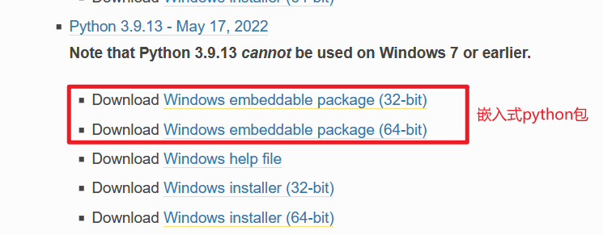

# 嵌入式 Python

## 下载嵌入式 Python

网址：https://www.python.org/downloads/windows/




# bat方式使用

python39._pth文件添加第三方模块及主程序目录，方便python.exe引用

```python
# 加载标准库
python39.zip
# 当前目录
.
# 加载第三方库
Lib\site-packages
# 主程序路径，主目录
..\
```

.bat文件

```python
.\Scripts\python.exe  .\util\main.py
```

# 套壳方式使用

来源：https://github.com/skywind3000/PyStand

案例文件：https://files.cnblogs.com/files/blogs/685292/PyStand-py39-x64.zip?t=1700739105&download=true

使用系统：WIN10及以上

"PyStand-py39-x64\runtime"  python嵌入式软件目录
"PyStand-py39-x64\site-packages"  第三方模块
"PyStand-py39-x64\util"  自己程序文件

"PyStand-py39-x64\PyStand.exe"  程序运行文件
"PyStand-py39-x64\PyStand.int"  程序PyStand.exe运行入口

---

PyStand.int文件添加以下代码，矫正当前运行目录，设置 `sys.path`

```
import sys, os
os.chdir(os.path.dirname(__file__))
sys.path.append(os.path.abspath('script'))
sys.path.append(os.path.abspath('script.egg'))
```

