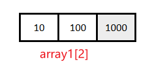
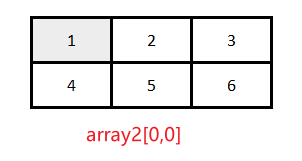
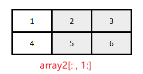
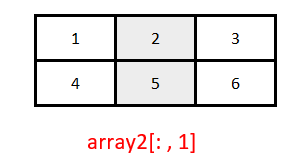
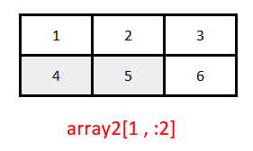

<font size=8>**NumPy基础**</font>

# 一、NumPy入门

## 1.1、NumPy数组

NumPy数组是保存==同构[^注1]数据==的N维数组。数组起始位置左上角。

创建数组：

```python
# coding=UTF-8
# Filename: XXXXX.py
"""
创建数组
"""
# 首先导入NumPy
import numpy as np

# 使用列表构造一个一维数组
array1 = np.array([10, 100, 1000.])
# 使用嵌套列表构造一个二维数组
array2 = np.array([[1., 2., 3.],
                   [4., 5., 6.]])
print(array1.dtype)  # float64,数组数据类型，数组dtype属性
print(type(array2))  # <class 'numpy.ndarray'> ，对象array2类型
```

## 1.2、向量化和广播

### 1.2.1 向量化

对一个标量[^注2]和NumPy数组求和，NumPy会执行==按元素==的操作，NumPy社区称之为==向量化==。

常量运算：

```python
array2 + 1 

# 输出
array([[2., 3., 4.]
		[5., 6., 7.]])
```

数组运算：

```python
array = array2 * array2
 
# 输出
array([[ 1. , 4. , 9.]
		 [16., 25. ,36.]])
```

### 1.2.2 广播

在算术运算中使用两个形状不同的数组，NumPy在可能的情况下会自动将较小的==数组扩展==成较大的数组形状，称之为==广播==。

```python
array = array2 * array1

# 输出
array([[  10. , 200. ,3000.]
 		[  40. , 500. ,6000.]])
```

## 1.3 NumPy函数

### 1.3.1 sum函数

作用：求出每一列或行总和

语法：`np.sum(数组，axis = 0)`或`数组.sum(数组，axis = 1)`

备注：参数`axis = 0`表示以行为轴，`axis = 1`表示以列为轴，省略`axis`参数会将整个数组加起来

```
np.sum(array2,axis=0)

# 输出一维数组
array([5. 7. 9.])
```

## 1.4 存取元素



## 1.5 数组构造器

```python
# coding = UTF-8
# Filename:NumPy基础.py

"""
学习案例
"""
import numpy as np

# 构造数组之arange函数
array = np.arange(2 * 5).reshape(2, 5)  # 2行5列
print(array)

# 服从正态分布的伪随机数数组
print(np.random.randn(2, 3))  # 2行3列

#  创建全是1的数组
print(np.ones(6).reshape(6, 1))  # 6行1列

#  创建全是0的数组
print(np.zeros(6).reshape(3, 2))  # 3行2列

# 创建单位矩阵
print(np.eye(4))
```

## 1.6 视图和副本

对视图[^注3]值修改会改变原数组中的值

对副本值修改不影响原数组，副本创建 `subset = array2[:,:2].copy()`

---

[^注1]: 同构：所有数据必须是相同类型
[^注2]: 标量：某种Python基本数据类型，比如浮点型和字符串，是为了将其和列表及字典一类的多元素数据结构以及一维和二维的NumPy数组区分开来。
[^注3]: 视图：NumPy数组切片时返回值