PyQt5学习 2022.12.6

# 一、安装模块

```python
pip install pyqt5
pip install PyQt5-tools(designer)
```

<font color = red size =5>注意事项：PyQt5安装路径不能包含中文字符</font>

# 二、业务与逻辑分离实现

信号与槽函数的使用

```python
"""
  这一步主要实现业务逻辑，也就是点击登录和退出按钮后程序要执行的操作。为了后续维护方便，采用界面与业务逻辑相分离来实现。
  也就是通过创建主程序调用界面文件方式实现。这有2个好处。第1就是实现逻辑清晰。
  第2就是后续如果界面或者逻辑需要变更，好维护。新建py文件程序，调用登录窗体练习.py文件。
"""
import sys  # 导入系统模块
from PyQt5.QtWidgets import QApplication, QMainWindow  # 导入pyQT5模块
from QT5学习.登录窗体练习 import Ui_Form  # 导入窗体模块


class MyMainForm(QMainWindow, Ui_Form):  # 类继承父类QMainWindow,Ui_Form
    def __init__(self, parent=None):  # 类初始化
        # super() 是用来解决多重继承问题的，直接用类名调用父类方法在使用单继承的时候没问题，
        # 但是如果使用多继承，会涉及到查找顺序（MRO）、重复调用（钻石继承）等种种问题。
        super(MyMainForm, self).__init__(parent)
        self.setupUi(self)  # 调用Ui_Form父类函数setupUi
        # 添加登录按钮信号和槽，注意display函数不加小括号
        self.login_pushButton.clicked.connect(self.display)
        # 添加退出按钮信号和槽，调用close函数
        self.cancel_pushButton.clicked.connect(self.close)  # close关闭函数

    def display(self):
        # 利用line Edit控件对象text()函数获取界面输入
        username = self.user_lineEdit.text()
        password = self.pwd_lineEdit.text()
        # 利用text Browser控件对象setText()函数设置界面显示
        self.user_textBrowser.setText('登录成功！\n' + '用户名是：' + username + '\n密码是：' + password)


if __name__ == '__main__':
    # 固定的，PyQt5程序都需要QApplication对象，sys.argv是命令行参数列表，确保程序可以双击运行
    app = QApplication(sys.argv)
    mywin = MyMainForm()  # 实类初始化
    mywin.show()  # 将窗口控件显示在屏幕上
    sys.exit(app.exec_())  # 程序运行，sys.exit方法确保程序完整退出
```

# 三、Ui文件加载方式

## 动态加载Ui文件

```python
from PyQt5 import uic

class Chengxu(QMainWindow):
    def __init__(self, pandas=None):
        super(Chengxu, self).__init__(pandas)
        # 从文件中加载UI定义
        uic.loadUi('日常小程序.ui', self)
        self.Flie_nameh_Button.clicked.connect(self.Flie_nameh)

白月黑羽建议：通常采用动态加载比较方便，因为改动界面后，不需要转化，直接运行，特别方便。

但是，如果 你的程序里面有非qt designer提供的控件， 这时候，需要在代码里面加上一些额外的声明，而且 可能还会有奇怪的问题。往往就 要采用 转化Python代码的方法
```

## 静态加载Ui文件

```
from QT5学习.登录窗体练习 import Ui_Form  # 导入窗体模块


class MyMainForm(QMainWindow, Ui_Form):  # 类继承父类QMainWindow,Ui_Form
    def __init__(self, parent=None):  # 类初始化
        # super() 是用来解决多重继承问题的，直接用类名调用父类方法在使用单继承的时候没问题，
        # 但是如果使用多继承，会涉及到查找顺序（MRO）、重复调用（钻石继承）等种种问题。
        super(MyMainForm, self).__init__(parent)
        self.setupUi(self)  # 调用Ui_Form父类函数setupUi
        # 添加登录按钮信号和槽，注意display函数不加小括号
        self.login_pushButton.clicked.connect(self.display)
        # 添加退出按钮信号和槽，调用close函数
        self.cancel_pushButton.clicked.connect(self.close)  # close关闭函数
```

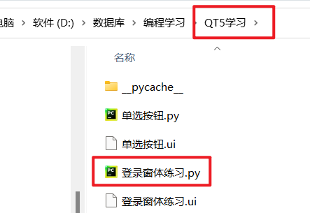

# 四、案例学习

## 4.1 创建空白窗体

```python
"""
1、安装模块    pip install pyqt5
2、super() 函数说明：
    用来解决多重继承问题的，直接用类名调用父类方法在使用单继承的时候没问题，
    但是如果使用多继承，会涉及到查找顺序（MRO）、重复调用（钻石继承）等种种问题。
"""
import sys  # 导入系统模块

# 导入pyQT5模块
from PyQt5.QtWidgets import QApplication, QWidget, QDesktopWidget

class MainWindow(QWidget):  # 类继承父类QWidget
    def __init__(self):  # 类初始化
        super().__init__()
        # 窗体标题和尺寸
        self.setWindowTitle("NB的xx系统")
        # 窗体的尺寸
        self.resize(980, 450)

        # 窗体位置
        qr = self.frameGeometry()
        cp = QDesktopWidget().availableGeometry().center()
        qr.moveCenter(cp)

if __name__ == '__main__':
    # 固定的，PyQt5程序都需要QApplication对象，sys.argv是命令行参数列表，确保程序可以双击运行
    app = QApplication(sys.argv)
    mywin = MainWindow()  # 实类初始化
    mywin.show()  # 将窗口控件显示在屏幕上
    sys.exit(app.exec_())  # 程序运行，sys.exit方法确保程序完整退出
```

## 4.2 窗口布局

```python
"""
1、安装模块    pip install pyqt5
2、super() 函数说明：
    用来解决多重继承问题的，直接用类名调用父类方法在使用单继承的时候没问题，
    但是如果使用多继承，会涉及到查找顺序（MRO）、重复调用（钻石继承）等种种问题。
3、布局模块
    QHBoxLayout 水平布局
    QVBoxLayout 垂直布局
4、 功能模块
    QPushButton 按钮
    QLineEdit 输入框
    QTableWidget 表格
    QTableWidgetItem 单元格对象
    QLabel 标签
    QT 属性设置
"""
import sys  # 导入系统模块

# 导入pyQT5模块
from PyQt5.QtWidgets import QApplication, QWidget, QDesktopWidget
from PyQt5.QtWidgets import QHBoxLayout, QVBoxLayout
from PyQt5.QtWidgets import QPushButton, QLineEdit, QTableWidget, QTableWidgetItem, QLabel
from PyQt5.QtCore import Qt

class MainWindow(QWidget):  # 类继承父类QWidget
    def __init__(self):  # 类初始化
        super().__init__()
        # 窗体标题和尺寸
        self.setWindowTitle("NB的xx系统")
        # 窗体的尺寸
        self.resize(1228, 450)

        # 窗体位置
        qr = self.frameGeometry()
        cp = QDesktopWidget().availableGeometry().center()
        qr.moveCenter(cp)

        # 创建垂直布局，一级布局
        layout = QVBoxLayout()

        layout.addLayout(self.init_header())
        layout.addLayout(self.init_form())
        layout.addLayout(self.init_table())
        layout.addLayout(self.init_footer())

        # 给窗体设置元素的排列方式
        self.setLayout(layout)

        # 弹簧
        # layout.addStretch()
        
    def init_header(self):
        # 1.创建顶部菜单布局，二级布局
        header_layout = QHBoxLayout()  # 水平布局
        # 1.1 创建按钮，加入header_layout
        btn_start = QPushButton("开始")
        # # 设置按钮高度、宽度
        # btn_start.setFixedHeight(100)
        # btn_start.setFixedWidth(200)
        header_layout.addWidget(btn_start)

        btn_stop = QPushButton("停止")
        header_layout.addWidget(btn_stop)

        # 弹簧
        header_layout.addStretch()
        return header_layout
    
    def init_form(self):
        # 2.创建标题布局，二级布局
        form_layout = QHBoxLayout()

        # 2.1 输入框
        txt_asin = QLineEdit()
        txt_asin.setPlaceholderText("请输入商品ID和价格")  # 默认值设置
        form_layout.addWidget(txt_asin)
        # 2.2 添加按钮
        btn_add = QPushButton("添加")
        form_layout.addWidget(btn_add)
        return form_layout
    
    def init_table(self):
        # 3.创建中间的表格
        table_layout = QHBoxLayout()

        # 3.1 创建表格
        table_widget = QTableWidget(0, 8)  # 表格0行8列
        table_layout.addWidget(table_widget)

        table_header = [
            {"field": "asin", "text": "ASIN", "width": 120},
            {"field": "title", "text": "标题", "width": 150},
            {"field": "url", "text": "URL", "width": 400},
            {"field": "price", "text": "低价", "width": 100},
            {"field": "success", "text": "成功次数", "width": 100},
            {"field": "error", "text": "503次数", "width": 100},
            {"field": "status", "text": "状态", "width": 100},
            {"field": "frequency", "text": "频率（N秒/次）", "width": 120}
        ]

        for idx, info in enumerate(table_header):
            item = QTableWidgetItem()
            item.setText(info["text"])
            table_widget.setHorizontalHeaderItem(idx, item)
            table_widget.setColumnWidth(idx, info["width"])  # 设置列宽
        return table_layout
    
    def init_footer(self):
        # 4.创建底部菜单
        footer_layout = QHBoxLayout()

        label_status = QLabel("未检测", self)
        footer_layout.addWidget(label_status)

        # 弹簧
        footer_layout.addStretch()

        btn_reinit = QPushButton("重新初始化")
        footer_layout.addWidget(btn_reinit)

        btn_recheck = QPushButton("重新检测")
        footer_layout.addWidget(btn_recheck)

        btn_reset_count = QPushButton("次数清零")
        footer_layout.addWidget(btn_reset_count)

        btn_delete = QPushButton("删除检测项")
        footer_layout.addWidget(btn_delete)

        btn_alert = QPushButton("SMTP报警配置")
        footer_layout.addWidget(btn_alert)

        btn_proxy = QPushButton("代理IP")
        footer_layout.addWidget(btn_proxy)
        return footer_layout

if __name__ == '__main__':
    # 固定的，PyQt5程序都需要QApplication对象，sys.argv是命令行参数列表，确保程序可以双击运行
    app = QApplication(sys.argv)
    mywin = MainWindow()  # 实类初始化
    mywin.show()  # 将窗口控件显示在屏幕上
    sys.exit(app.exec_())  # 程序运行，sys.exit方法确保程序完整退出
```

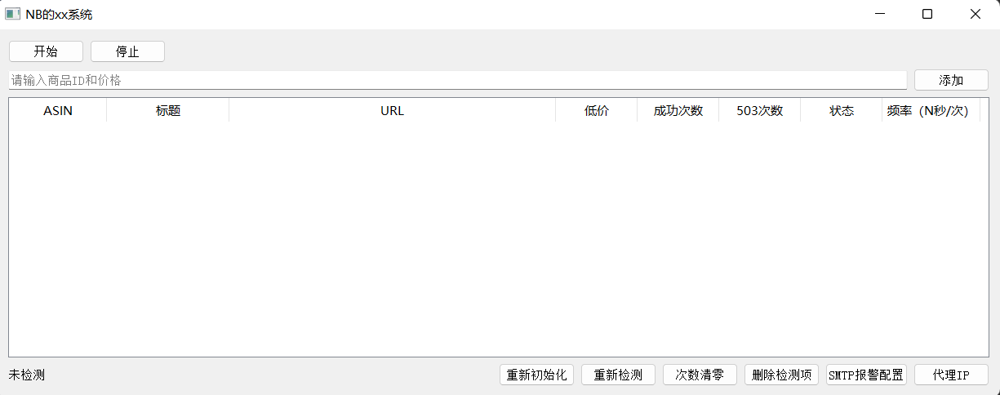

## 4.3 表格数据初始化

- 有数据

- 表格中展示

  ```python
  # 3.2 初始化表格数据
  # 读取数据文件
  import json
  file_path = "db.json"
  with open(file_path, mode='r', encoding='utf-8') as f:
      data = f.read()
      data_list = json.loads(data)['RECORDS']  # 根据文件设置
  
      current_roe_count = table_widget.rowCount()  # 当前表格有多少行
      for row_list in data_list:
          table_widget.insertRow(current_roe_count)  # 添加行
  
          # 写数据
          # cell = QTableWidgetItem(row_list["日期"])  # 获取内容
          # table_widget.setItem(current_roe_count, 0, cell)  # 参数：行、列、内容
          # current_roe_count += 1
          for i, ele in enumerate(row_list):
              cell = QTableWidgetItem(row_list[str(ele)])  # 获取内容
              if i in [0, 4, 6, 7]:
                  # 设置不可修改
                  cell.setFlags(Qt.ItemIsSelectable | Qt.ItemIsEnabled)
                  table_widget.setItem(current_roe_count, i, cell)  # 参数：行、列、内容
                  current_roe_count += 1
  ```


# 五、学习笔记

## 5.1 PyQt5第一个程序

```python
import sys
from PyQt5.QtWidgets import QApplication, QWidget

if __name__ == '__main__':
    # 固定的，PyQt5程序都需要QApplication对象，sys.argv是命令行参数列表，确保程序可以双击运行
    app = QApplication(sys.argv)
    # 实类初始化
    w = QWidget()
    # 设置窗口标题
    w.setWindowTitle("第一个PyQt5")
    # 将窗口控件显示在屏幕上
    w.show()
    # 程序进行循环等待状态
    app.exec_()

```

程序解释说明：

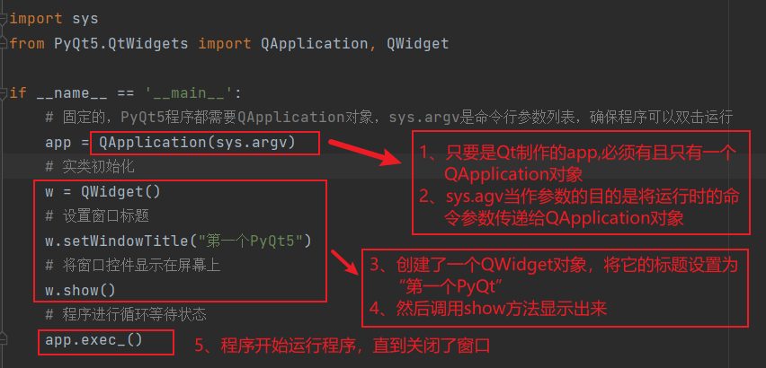

## 5.2 模块介绍

PyQt中有非常多的功能模块，开发中最常用的功能模块主要有三个：

- QtCore：包含了核心的非GUI的功能，主要和时间、文件与文件夹、各种数据、流、URLs、mime类文件、进程与线程一起使用
- QtGui：包含了窗口系统、事件处理、2D图像、基本绘图、字体和文字类
- QtWidgets：包含了一些创建桌面应用的UI元素

可以参考PyQt官网的所有模块，地址：

C++具体实现的API文档，地址：https://doc.qt.io/qt-5/classes.html

**用到什么功能就它相关的api或者别人分享的使用心得，这是学习最快的方式**

## 5.3 基本UI

窗口内的所有控件，若想在窗口显示，都需要表示它的父亲是谁，而不是直接使用 show 函数显示

### 1、按钮

按钮对应的控件名称为 QPushButton , 位于 PyQt5.QtWidgets 里面

```
import sys
from PyQt5.QtWidgets import QApplication, QWidget, QPushButton

if __name__ == '__main__':
    # 固定的，PyQt5程序都需要QApplication对象，sys.argv是命令行参数列表，确保程序可以双击运行
    app = QApplication(sys.argv)
    # 实类初始化
    w = QWidget()
    # 设置窗口标题
    w.setWindowTitle("第一个PyQt5")

    # ============================创建按钮=============================
    # 在窗口里面添加按钮
    btn = QPushButton("按钮")
    # 设置按钮的父亲是当前窗口，等于添加到窗口显示
    btn.setParent(w)
    # ===============================================================
    # 将窗口控件显示在屏幕上
    w.show()
    # 程序进行循环等待状态
    app.exec_()
```

运行效果：

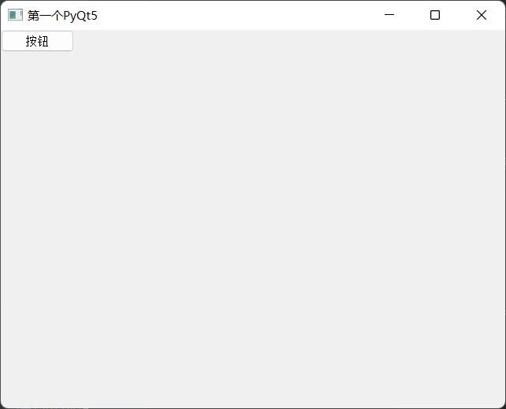

### 2、文本

纯文本控件名称为：QLabel ，位于 PyQt5.QtWidgets 里面

纯文本控件仅仅作为标识显示而已，类似输入内容前的一段标签提示（账号、密码）

```python
import sys
from PyQt5.QtWidgets import QApplication, QWidget, QLabel

if __name__ == '__main__':
    # 固定的，PyQt5程序都需要QApplication对象，sys.argv是命令行参数列表，确保程序可以双击运行
    app = QApplication(sys.argv)
    # 实类初始化
    w = QWidget()
    # 设置窗口标题
    w.setWindowTitle("第一个PyQt5")
    # ============================创建纯文本=============================
    # 下面创建一个Label(纯文本)，在创建的时候指定了父亲
    label = QLabel("账号", w)
    # 显示位置与大小：x, y, w, h
    label.setGeometry(20, 20, 30, 30)
    # ===============================================================
    # 将窗口控件显示在屏幕上
    w.show()
    # 程序进行循环等待状态
    app.exec_()
```

运行效果：

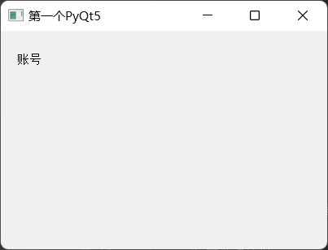

### 3、输入框

输入框的控件名为：QlineEdit ，位于 PyQt5.QtWidgets 里面

```python
import sys
from PyQt5.QtWidgets import QApplication, QWidget, QLineEdit, QLabel, QPushButton

if __name__ == '__main__':
    # 固定的，PyQt5程序都需要QApplication对象，sys.argv是命令行参数列表，确保程序可以双击运行
    app = QApplication(sys.argv)
    # 实类初始化
    w = QWidget()
    # 设置窗口标题
    w.setWindowTitle("第一个PyQt5")
    # ============================创建纯文本============================
    # 下面创建一个Label(纯文本)，在创建的时候指定了父亲
    label = QLabel("账号", w)
    # 显示位置与大小：x, y, w, h
    label.setGeometry(20, 20, 30, 20)
    # =============================创建文本框===========================
    # 文本框
    edit = QLineEdit(w)
    edit.setPlaceholderText("请输入账号")
    edit.setGeometry(55, 20, 200, 20)
    # =============================创建按钮===========================
    # 在窗口里面添加控件
    btn = QPushButton("注册", w)
    btn.setGeometry(50, 80, 70, 30)
    # ================================================================
    # 将窗口控件显示在屏幕上
    w.show()
    # 程序进行循环等待状态
    app.exec_()
```

运行效果：

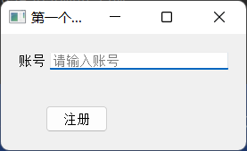

### 4、窗口大小

```
    # =============================设置窗口大小===========================
    w.resize(500, 500)
```

### 5、窗口位置

```
import sys
from PyQt5.QtWidgets import QApplication, QWidget
from PyQt5.QtWidgets import QDesktopWidget

if __name__ == '__main__':
    # 固定的，PyQt5程序都需要QApplication对象，sys.argv是命令行参数列表，确保程序可以双击运行
    app = QApplication(sys.argv)
    # 实类初始化
    w = QWidget()
    # 设置窗口标题
    w.setWindowTitle("第一个PyQt5")
    # =============================设置窗口大小===========================
    w.resize(500, 500)
    # =============================窗口设置在屏幕的左上角===========================
    w.move(0, 0)
    # =============================窗口设置在屏幕的中间位置===========================
    # QDesktopWidget 屏幕组件  availableGeometry 可用区域  center 中心位置
    center_pointer = QDesktopWidget().availableGeometry().center()
    x = center_pointer.x()
    y = center_pointer.y()
    # frameGeometry().getRect() 返回窗口坐标 x,y，width,height
    old_x, old_y, width, height = w.frameGeometry().getRect()
    w.move(int(x - width / 2), int(y - height / 2))

    # 将窗口控件显示在屏幕上
    w.show()
    # 程序进行循环等待状态
    app.exec_()
```

### 6、设置窗口icon

可以下载icon图标网站：https://www.easyicon.net

```
import sys
from PyQt5.QtWidgets import QApplication, QWidget
from PyQt5.QtGui import QIcon

if __name__ == '__main__':
    # 固定的，PyQt5程序都需要QApplication对象，sys.argv是命令行参数列表，确保程序可以双击运行
    app = QApplication(sys.argv)
    # 实类初始化
    w = QWidget()
    # 设置窗口标题
    w.setWindowTitle("第一个PyQt5")
    # =============================设置图标===========================
    w.setWindowIcon(QIcon("img.png"))

    # 将窗口控件显示在屏幕上
    w.show()
    # 程序进行循环等待状态
    app.exec_()

```

## 5.4 布局

在Qt里面布局分为四个大类：

- QBoxLayout	盒子布局
- QGridLayout   网格布局
- QFormLayout  表单布局
- QStackedLayout  抽拉式布局

### 1、QBoxLayout

直译为：盒子布局

一般使用它的两个子类 QHBoxLayout 和 QVBoxLayout 负责水平和垂直布局

#### 1.1 垂直布局示例：

```
import sys  # 导入系统模块
# 导入pyQT5模块
from PyQt5.QtWidgets import QApplication, QWidget, QDesktopWidget
from PyQt5.QtWidgets import QHBoxLayout, QVBoxLayout
from PyQt5.QtWidgets import QPushButton, QLineEdit, QTableWidget, QTableWidgetItem, QLabel


class MainWindow(QWidget):  # 类继承父类QWidget
    def __init__(self):  # 类初始化
        # 切记一定要调用父类的__init__方法，因为它里面有很多对UI空间的初始化操作
        super().__init__()
        # 窗体标题
        self.setWindowTitle("垂直布局")
        # 窗体的尺寸
        self.resize(300, 300)

        # 垂直布局
        layout = QVBoxLayout()

        # 作用是在布局器中增加一个伸缩量，里面的参数表示QSpacerItem的个数，默认值为零
        # 会将你放在layout中的空间压缩成默认的大小
        layout.addStretch(1)

        # 按钮1
        btn1 = QPushButton("按钮1")
        # 添加到布局器中
        layout.addWidget(btn1)

        layout.addStretch(1)

        # 按钮2
        btn2 = QPushButton("按钮2")
        # 添加到布局器中
        layout.addWidget(btn2)

        layout.addStretch(1)

        # 按钮3
        btn3 = QPushButton("按钮3")
        # 添加到布局器中
        layout.addWidget(btn3)

        layout.addStretch(2)

        # 让当前的窗口使用这个排列的布局器
        self.setLayout(layout)


if __name__ == '__main__':
    # 固定的，PyQt5程序都需要QApplication对象，sys.argv是命令行参数列表，确保程序可以双击运行
    app = QApplication(sys.argv)
    mywin = MainWindow()  # 实类初始化
    mywin.show()  # 将窗口控件显示在屏幕上
    app.exec()  # 程序运行，sys.exit方法确保程序完整退出
```

运行效果：

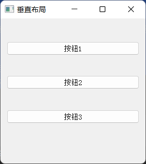

#### 1.2 水平布局示例：

```
import sys  # 导入系统模块

# 导入pyQT5模块
from PyQt5.QtWidgets import QApplication, QWidget, QDesktopWidget
from PyQt5.QtWidgets import QHBoxLayout, QVBoxLayout
from PyQt5.QtWidgets import QGroupBox, QRadioButton
from PyQt5.QtWidgets import QPushButton, QLineEdit, QTableWidget, QTableWidgetItem, QLabel


class MainWindow(QWidget):  # 类继承父类QWidget
    def __init__(self):  # 类初始化
        # 切记一定要调用父类的__init__方法，因为它里面有很多对UI空间的初始化操作
        super().__init__()
        self.init_ui()

    def init_ui(self):
        # 最外层的垂直布局器，包含两部分：爱好和性别
        container = QVBoxLayout()
        # 最外层的水平布局器
        # container = QHBoxLayout()

        # --------------创建第一个组，添加多个组件-------------------
        # hobby 主要是保证他们是一个组
        hobby_box = QGroupBox("爱好")
        # v_layout 保证三个爱好是垂直摆放
        v_layout = QVBoxLayout()
        btn1 = QRadioButton("抽烟")
        btn2 = QRadioButton("喝酒")
        btn3 = QRadioButton("烫头")
        # 添加到v_layout中
        v_layout.addWidget(btn1)
        v_layout.addWidget(btn2)
        v_layout.addWidget(btn3)
        # 把v_layout 添加到hobby_box中
        hobby_box.setLayout(v_layout)

        # --------------创建第二个组，添加多个组件-------------------
        # 性别组
        gender_box = QGroupBox("性别")
        # 性别容器
        h_layout = QHBoxLayout()
        # 性别选项
        btn4 = QRadioButton("男")
        btn5 = QRadioButton("女")
        # 追加到性别容器中
        h_layout.addWidget(btn4)
        h_layout.addWidget(btn5)

        # 添加到box中
        gender_box.setLayout(h_layout)

        # 把爱好的内容添加到容器中
        container.addWidget(hobby_box)
        # 把性别的内容添加到容器中
        container.addWidget(gender_box)

        # 让当前的窗口使用这个排列的布局器
        self.setLayout(container)


if __name__ == '__main__':
    # 固定的，PyQt5程序都需要QApplication对象，sys.argv是命令行参数列表，确保程序可以双击运行
    app = QApplication(sys.argv)
    mywin = MainWindow()  # 实类初始化
    mywin.show()  # 将窗口控件显示在屏幕上
    app.exec()  # 程序运行，sys.exit方法确保程序完整退出
```

运行效果：

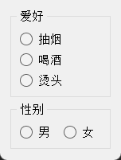

### 2、QGridLayout

网格布局，又称为九宫格布局

```
import sys  # 导入系统模块

# 导入pyQT5模块
from PyQt5.QtWidgets import QApplication, QWidget, QDesktopWidget
from PyQt5.QtWidgets import QHBoxLayout, QVBoxLayout, QGridLayout
from PyQt5.QtWidgets import QPushButton, QLineEdit, QTableWidget, QTableWidgetItem, QLabel


class MainWindow(QWidget):  # 类继承父类QWidget
    def __init__(self):  # 类初始化
        # 切记一定要调用父类的__init__方法，因为它里面有很多对UI空间的初始化操作
        super().__init__()
        self.init_ui()

    def init_ui(self):
        # 窗体标题
        self.setWindowTitle("计算器")
        # 准备数据
        data = {
            0: ["7", "8", "9", "+", "("],
            1: ["4", "5", "6", "-", ")"],
            2: ["1", "2", "3", "*", "<-"],
            3: ["0", ".", "=", "/", "C"]
        }

        # 整体垂直布局
        layout = QVBoxLayout()

        # 输入框
        edit = QLineEdit()
        edit.setPlaceholderText("请输入内容")
        # 把输入框添加到容器中（addWidget添加普通控件）
        layout.addWidget(edit)

        # 网格布局
        grid = QGridLayout()

        # 循环创建追加进去
        for line_number, line_data in data.items():
            # 此时line_number是第几行，line_data是当前行数据
            for col_number, number in enumerate(line_data):
                # 此时col_number是第几列，number是要显示的符号
                btn = QPushButton(number)
                # grid.addWidget(btn)
                grid.addWidget(btn, line_number, col_number)

        # 把网格布局追加到容器中（addLayout添加容器）
        layout.addLayout(grid)

        # 让当前的窗口使用这个排列的布局器
        self.setLayout(layout)


if __name__ == '__main__':
    # 固定的，PyQt5程序都需要QApplication对象，sys.argv是命令行参数列表，确保程序可以双击运行
    app = QApplication(sys.argv)
    mywin = MainWindow()  # 实类初始化
    mywin.show()  # 将窗口控件显示在屏幕上
    app.exec()  # 程序运行，sys.exit方法确保程序完整退出
```

运行效果：

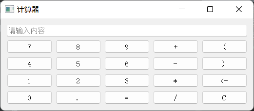

### 3、QFormLayout

一般适用于提交数据form表单，比如：登录、注册类的场景

```
import sys  # 导入系统模块

# 导入pyQT5模块
from PyQt5.QtWidgets import QApplication, QWidget, QDesktopWidget
from PyQt5.QtWidgets import QHBoxLayout, QVBoxLayout, QGridLayout, QFormLayout
from PyQt5.QtWidgets import QPushButton, QLineEdit, QTableWidget, QTableWidgetItem, QLabel
from PyQt5.QtCore import Qt


class MainWindow(QWidget):  # 类继承父类QWidget
    def __init__(self):  # 类初始化
        # 切记一定要调用父类的__init__方法，因为它里面有很多对UI空间的初始化操作
        super().__init__()
        self.init_ui()

    def init_ui(self):
        # 设定当前widget的宽高（可以拉伸大小）
        self.resize(300, 160)
        # 禁止改变宽高（不可以拉伸）
        # self.setFixedSize(300, 160)

        # 外层容器
        container = QVBoxLayout()

        # 表单容器
        form_layout = QFormLayout()

        # 创建1个输入框
        edit = QLineEdit()
        edit.setPlaceholderText("请输入账号")
        form_layout.addRow("账号：", edit)

        # 创建另外1个输入框
        edit2 = QLineEdit()
        edit2.setPlaceholderText("请输入密码")
        form_layout.addRow("密码：", edit2)
        # 将from_layout 添加到垂直布局中
        container.addLayout(form_layout)

        # 按钮
        login_btn = QPushButton("登录")
        login_btn.setFixedSize(100, 30)

        # 把按钮添加到容器中，并且指定它的对齐方式
        container.addWidget(login_btn, alignment=Qt.AlignRight)

        # 让当前的窗口使用这个排列的布局器
        self.setLayout(container)


if __name__ == '__main__':
    # 固定的，PyQt5程序都需要QApplication对象，sys.argv是命令行参数列表，确保程序可以双击运行
    app = QApplication(sys.argv)
    mywin = MainWindow()  # 实类初始化
    mywin.show()  # 将窗口控件显示在屏幕上
    app.exec()  # 程序运行，sys.exit方法确保程序完整退出
```

运行效果：

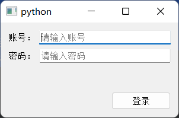

### 4、QStackedLayout

提供了多页面切换的布局，一次只能看到一个界面，抽屉布局

```
import sys  # 导入系统模块

# 导入pyQT5模块
from PyQt5.QtWidgets import QApplication, QWidget, QDesktopWidget
from PyQt5.QtWidgets import QHBoxLayout, QVBoxLayout, QGridLayout, QFormLayout, QStackedLayout
from PyQt5.QtWidgets import QPushButton, QLineEdit, QTableWidget, QTableWidgetItem, QLabel
from PyQt5.QtCore import Qt


class Window1(QWidget):
    def __init__(self):
        super().__init__()
        QLabel("我是抽屉1要显示的内容", self)
        self.setStyleSheet("background-color:green;")

class Window2(QWidget):
    def __init__(self):
        super().__init__()
        QLabel("我是抽屉2要显示的内容", self)
        self.setStyleSheet("background-color:red;")


class MainWindow(QWidget):  # 类继承父类QWidget
    def __init__(self):  # 类初始化
        # 切记一定要调用父类的__init__方法，因为它里面有很多对UI空间的初始化操作
        super().__init__()
        self.create_stacked_layout()
        self.init_ui()

    def create_stacked_layout(self):
        # 创建堆叠（抽屉）布局
        self.stacked_layout = QStackedLayout()
        # 创建单独的widget
        win1 = Window1()
        win2 = Window2()
        # 将创建的2个Widget添加到抽屉布局中
        self.stacked_layout.addWidget(win1)
        self.stacked_layout.addWidget(win2)

    def init_ui(self):
        # 设置Widget大小以及固定宽高（不可以拉伸）
        self.setFixedSize(300, 270)

        # 1. 创建整体的布局器
        container = QVBoxLayout()

        # 2. 创建1个要显示具体内容的子Widget
        widget = QWidget()
        widget.setLayout(self.stacked_layout)
        widget.setStyleSheet("background-color:grey;")

        # 3. 创建2个按钮，用来点击进行切换抽屉布局器中的widget
        btn_press1 = QPushButton("抽屉1")
        btn_press2 = QPushButton("抽屉2")
        # 给按钮添加事件（即点击后要调用的函数）
        btn_press1.clicked.connect(self.btn_press1_clicked)
        btn_press2.clicked.connect(self.btn_press2_clicked)

        # 4. 将需要显示的控件添加到布局器中
        container.addWidget(widget)
        container.addWidget(btn_press1)
        container.addWidget(btn_press2)

        # 5. 设置当前要显示的widget,从而能够显示这个布局器中的控件
        self.setLayout(container)

    def btn_press1_clicked(self):
        # 设置抽屉布局器的当前索引值，即可切换显示哪个Widget
        self.stacked_layout.setCurrentIndex(0)

    def btn_press2_clicked(self):
        # 设置抽屉布局器的当前索引值，即可切换显示哪个Widget
        self.stacked_layout.setCurrentIndex(1)


if __name__ == '__main__':
    # 固定的，PyQt5程序都需要QApplication对象，sys.argv是命令行参数列表，确保程序可以双击运行
    app = QApplication(sys.argv)
    mywin = MainWindow()  # 实类初始化
    mywin.show()  # 将窗口控件显示在屏幕上
    sys.exit(app.exec())  # 程序运行，sys.exit方法确保程序完整退出
```

运行效果：

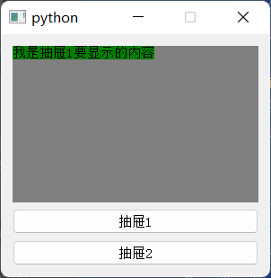

## 5.5 窗口

### 1、分类

在Qt中，生成窗口有三种方式：

- QWidget : 控件和窗口的父类，自由度高（什么东西都没有），没有划分菜单、工具栏、状态栏、主窗口等区域
- QMainWindow : 是 QWidget 的子类，包含菜单栏、工具栏、状态栏、标题栏等，中间部分则为主窗口区域
- QDialog : 对话窗口的基类

### 2、QWidget 

```
import sys  # 导入系统模块

# 导入pyQT5模块
from PyQt5.QtWidgets import QApplication, QWidget, QLabel

class MainWindow(QWidget):  # 类继承父类QWidget
    def __init__(self):  # 类初始化
        # 切记一定要调用父类的__init__方法，因为它里面有很多对UI空间的初始化操作
        super().__init__()
        self.init_ui()

    def init_ui(self):
        label = QLabel("这是文字~~~")
        label.setStyleSheet("font-size:30px;color:red")
        label.setParent(self)

if __name__ == '__main__':
    # 固定的，PyQt5程序都需要QApplication对象，sys.argv是命令行参数列表，确保程序可以双击运行
    app = QApplication(sys.argv)
    mywin = MainWindow()  # 实类初始化
    mywin.show()  # 将窗口控件显示在屏幕上
    sys.exit(app.exec())  # 程序运行，sys.exit方法确保程序完整退出
```

运行效果：

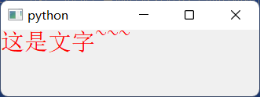

### 3、QMainWindow

```
import sys  # 导入系统模块

# 导入pyQT5模块
from PyQt5.QtWidgets import QApplication, QWidget, QLabel, QMainWindow


class MainWindow(QMainWindow):  # 类继承父类QWidget
    def __init__(self):  # 类初始化
        # 切记一定要调用父类的__init__方法，因为它里面有很多对UI空间的初始化操作
        super().__init__()
        self.init_ui()

    def init_ui(self):
        label = QLabel("这是文字~~~")
        label.setStyleSheet("font-size:30px;color:red")

        # 调用父类中的menuBar，从而对菜单栏进行操作
        menu = self.menuBar()
        # 如果是Mac的话，菜单栏不会在Windows中显示而是屏幕顶部系统菜单栏位置
        # 下面这一行代码使得Mac也按照Windows的那种方式在Window中显示Menu
        menu.setNativeMenuBar(False)

        file_menu = menu.addMenu("文件")
        file_menu.addAction("新建")
        file_menu.addAction("打开")
        file_menu.addAction("保存")

        edit_menu = menu.addMenu("编辑")
        edit_menu.addAction("复制")
        edit_menu.addAction("粘贴")
        edit_menu.addAction("剪贴")

        # 设置中心内容显示
        self.setCentralWidget(label)


if __name__ == '__main__':
    # 固定的，PyQt5程序都需要QApplication对象，sys.argv是命令行参数列表，确保程序可以双击运行
    app = QApplication(sys.argv)
    mywin = MainWindow()  # 实类初始化
    mywin.setWindowTitle("我是标题")
    mywin.show()  # 将窗口控件显示在屏幕上
    sys.exit(app.exec())  # 程序运行，sys.exit方法确保程序完整退出
```

运行效果：

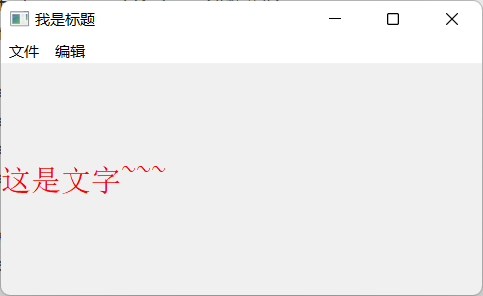

### 4、QDialog

不过对话框一般不应该作为主窗口的存在，而是通过点击操作弹出，起到提示作用

```
import sys  # 导入系统模块

# 导入pyQT5模块
from PyQt5.QtWidgets import QApplication, QDialog, QPushButton


class MainWindow(QDialog):  # 类继承父类QWidget
    def __init__(self):  # 类初始化
        # 切记一定要调用父类的__init__方法，因为它里面有很多对UI空间的初始化操作
        super().__init__()
        self.init_ui()

    def init_ui(self):
        ok_btn = QPushButton("确定", self)
        ok_btn.setGeometry(50, 50, 100, 30)


if __name__ == '__main__':
    # 固定的，PyQt5程序都需要QApplication对象，sys.argv是命令行参数列表，确保程序可以双击运行
    app = QApplication(sys.argv)
    mywin = MainWindow()  # 实类初始化
    mywin.show()  # 将窗口控件显示在屏幕上
    sys.exit(app.exec())  # 程序运行，sys.exit方法确保程序完整退出
```

运行效果：

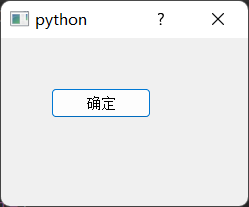

## 5.6 信号与槽

### 1、说明

信号和槽是Qt的核心内容

#### 1.1 信号（signal)

其实就是事件（按钮点击、内容发生改变、窗口的关闭事件）或者 是状态（check选中了，togglebutton 切换）。

当程序触发了某种状态或者发生了某种事件（比如：按钮被点击了，内容改变等等），那么即可发射出来一个信号。

#### 1.2 槽（slot）

若想捕获这个信号，然后执行相应的逻辑代码，那么就需要使用到槽，槽实际上是一个函数，当信号发射出来后，会执行与之绑定的槽函数

#### 1.3 将信号与槽连接

为了能够实现，当点击某个按钮时执行某个逻辑，需要把具体的信号和具体的槽函数绑定到一起

操作大体流程如下：

```
对象.信号.connect(槽函数)
```

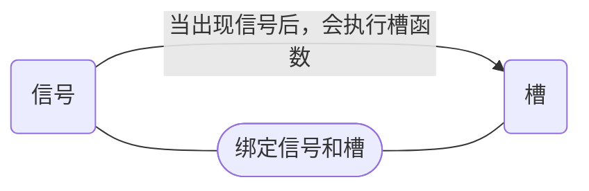


### 2、案例1

功能：接收信号

```
import sys  # 导入系统模块

# 导入pyQT5模块
from PyQt5.QtWidgets import QApplication, QWidget, QPushButton


class MainWindow(QWidget):  # 类继承父类QWidget
    def __init__(self):  # 类初始化
        # 切记一定要调用父类的__init__方法，因为它里面有很多对UI空间的初始化操作
        super().__init__()
        self.init_ui()

    def init_ui(self):
        # 更改当前widge的高度
        self.resize(500, 300)

        # 创建一个按钮
        btn = QPushButton("点我点我", self)

        # 设置窗口位置、高度
        btn.setGeometry(200, 200, 100, 30)
        # 将按钮被点击时触发的信号与我们定义的函数（方法）进行绑定
        # 注意：这里没有（），即写函数的名字，而不是名字（）
        btn.clicked.connect(self.click_my_btn)

    def click_my_btn(self, arg):
        # 槽函数，点击按钮则调用该函数
        # 这里的参数正好是信号发出，传递的参数
        print("点击按钮啦~", arg)


if __name__ == '__main__':
    # 固定的，PyQt5程序都需要QApplication对象，sys.argv是命令行参数列表，确保程序可以双击运行
    app = QApplication(sys.argv)
    mywin = MainWindow()  # 实类初始化
    mywin.show()  # 将窗口控件显示在屏幕上
    sys.exit(app.exec())  # 程序运行，sys.exit方法确保程序完整退出
```

运行效果：


### 3、案例2

自定义信号【重点】

除了接收Qt自带的信号之外，我们也可以自行定义信号，在合适的时机，自行发射信号

自定义信号需要使用到 pyqtSignal 来声明信号，并且需要在类中的函数之外声明

如果会自定义信号，那么信号和槽基本上也就掌握了，否则永远只会接收别人发射出的信号。

```
import sys  # 导入系统模块
import time

# 导入pyQT5模块
from PyQt5.QtWidgets import QApplication, QWidget, QPushButton, QVBoxLayout, QLabel, QScrollArea, QHBoxLayout
from PyQt5.QtCore import pyqtSignal, Qt


class MainWindow(QWidget):  # 类继承父类QWidget
    # 声明一个信号 只能放在函数的外面
    my_signal = pyqtSignal(str)

    def __init__(self):  # 类初始化
        # 切记一定要调用父类的__init__方法，因为它里面有很多对UI空间的初始化操作
        super().__init__()
        self.init_ui()
        self.msg_history = list()  # 用来存放消息

    def init_ui(self):
        # 更改当前qwidget的高度
        self.resize(500, 200)

        # 创建一个整体布局器
        container = QVBoxLayout()

        # 用来显示检测到漏洞的信息
        self.msg = QLabel("")
        self.msg.resize(440, 15)

        self.msg.setWordWrap(True)  # 自动换行
        self.msg.setAlignment(Qt.AlignTop)  # 靠上

        # 创建一个滚动对象
        scroll = QScrollArea()
        scroll.setWidget(self.msg)

        # 创建垂直布局器，用来添加自动滚动条
        v_layout = QVBoxLayout()
        v_layout.addWidget(scroll)

        # 创建水平布局器
        h_layout = QHBoxLayout()
        btn = QPushButton("开始检测", self)

        # 绑定按钮的点击，点击按钮则开始检测
        btn.clicked.connect(self.check)

        h_layout.addStretch(1)  # 伸缩器
        h_layout.addWidget(btn)
        h_layout.addStretch(1)

        # 操作将要显示的控件以及子布局器添加到container
        container.addLayout(v_layout)
        container.addLayout(h_layout)

        # 设置布局器
        self.setLayout(container)

        # 绑定信号和槽
        self.my_signal.connect(self.my_slot)

    def my_slot(self, msg):
        print(">>>>", msg)
        self.msg_history.append(msg)
        self.msg.setText("<br>".join(self.msg_history))
        self.msg.resize(440, self.msg.frameSize().height() + 15)
        self.msg.repaint()  # 更新内容，如果不更新可能没有显示内容

    def check(self):
        for i, ip in enumerate(["192.168.1.%d" % x for x in range(1, 255)]):
            msg = "模拟，正在检查 %s 上的漏洞....." % ip
            print(msg)
            if i % 5 == 0:
                # 表示发射信号 对象.信号.发射（参数）
                self.my_signal.emit(msg + "【发现漏洞】")  # 相当调用了 my_slot 函数
            # else:
            #     self.my_signal.emit("")
            time.sleep(0.01)


if __name__ == '__main__':
    # 固定的，PyQt5程序都需要QApplication对象，sys.argv是命令行参数列表，确保程序可以双击运行
    app = QApplication(sys.argv)
    mywin = MainWindow()  # 实类初始化
    mywin.show()  # 将窗口控件显示在屏幕上
    sys.exit(app.exec())  # 程序运行，sys.exit方法确保程序完整退出
```

运行效果：

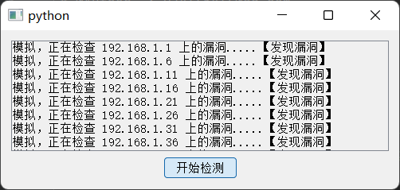


## 5.7 开发环境配置-PyCharm


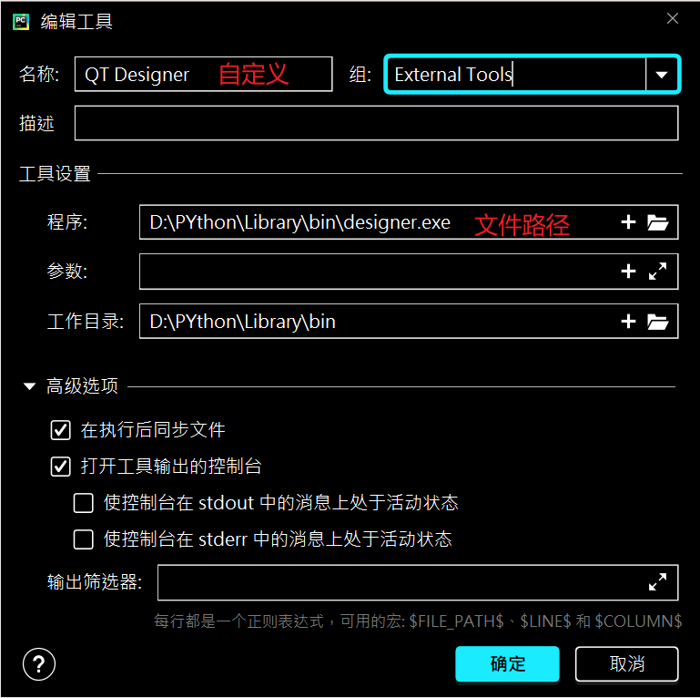

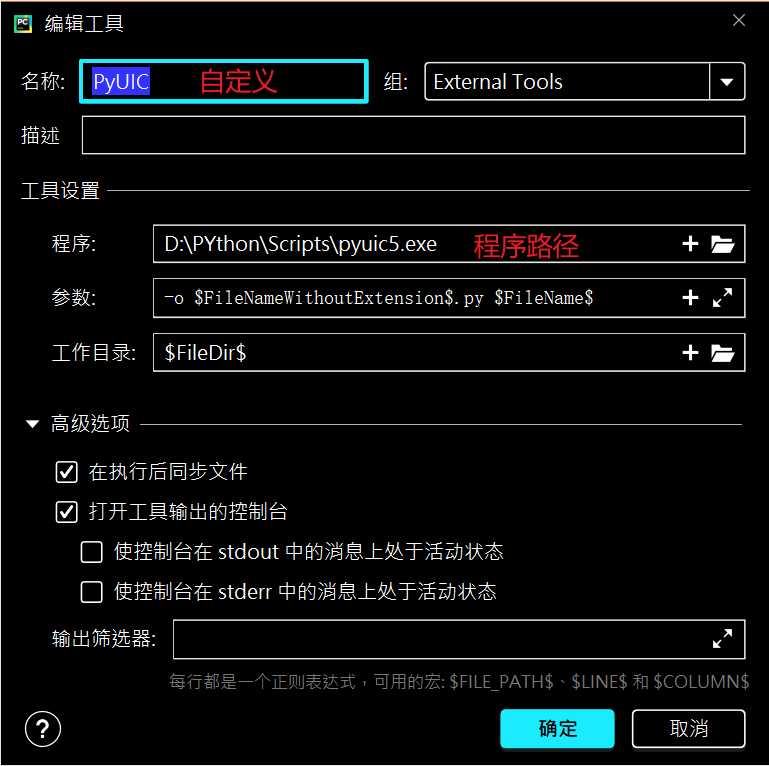

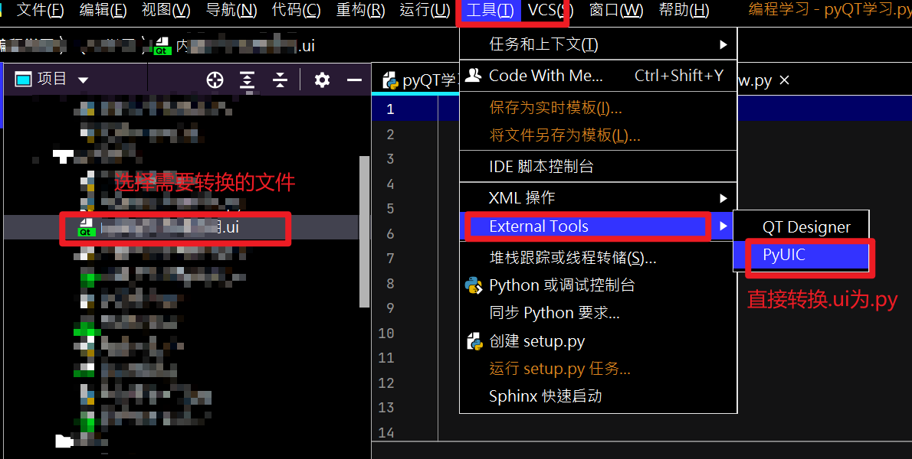

## 5.8 开发环境配置-vscode

https://blog.csdn.net/qq_37080185/article/details/121616507

### 下载并安装PYQT Integration

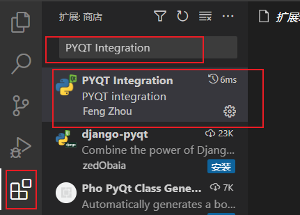

### 配置pyqt integration

点击拓展设置

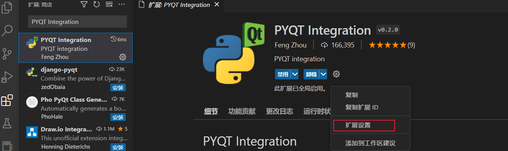

配置Pyuic:Cmd与Qtdesigner:Path路径

1.Pyuic:Cmd路径一般是在你安装的python环境下的 \Scripts\pyuic5.exe

2.Qtdesigner:Path

一般是在你安装的python环境下的\Lib\site-packages\qt5_applications\Qt\bin\designer.exe

注意新版designer.exe不是在目录pyqt5_tools下而是qt5_applications目录下


### 创建pyqt文件，显示界面

在资源管理器空白处右键，然后点击PYQT：New Form就会出现qtdesigner界面了

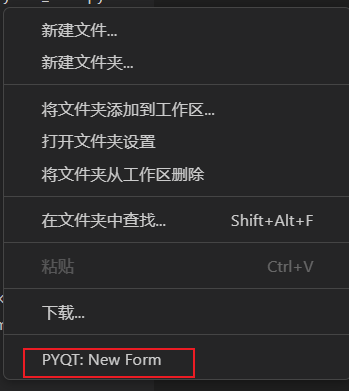

右键该文件并点击Compile Form
