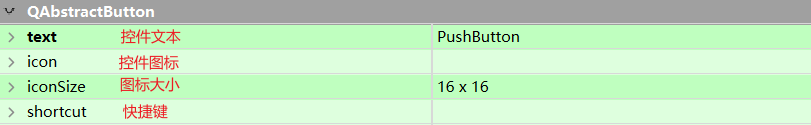
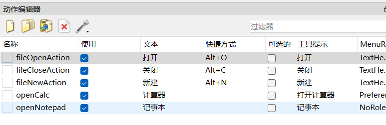
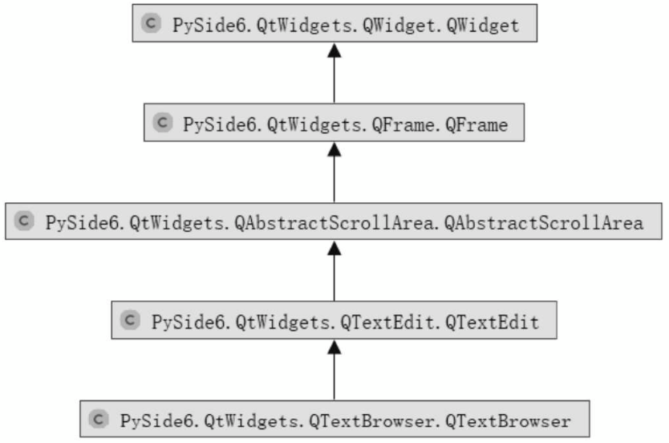
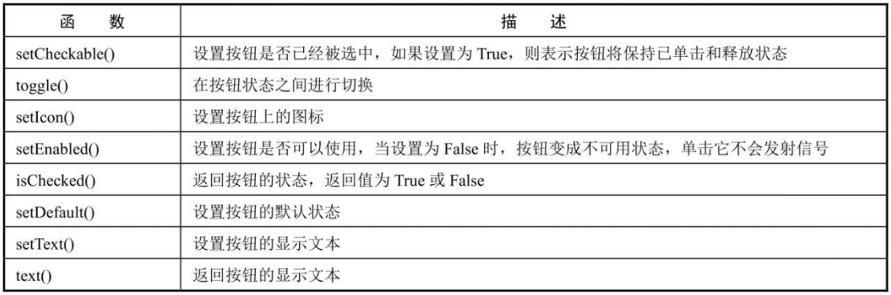
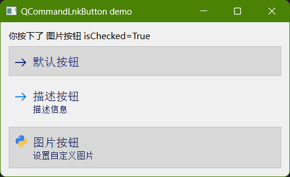

#  一、Pyside6模块安装

```cmd
pip install Pyside6
```

# 二、配置Pycharm外部工具

Qt Designer:可视化编辑UI界面，生成.ui文件。
PySide-uic: 将.ui文件转换为.py文件，以便修改和导入。
PySide-rcc: 将.qrc文件（资源文件）转换为.py文件。
PySide-lupdate:用于从ui文件和Python源码中提取需要翻译的字符串
linguist:用于多语言翻译，输入文件为PySide-lupdate生成的`*.ts`文件，并可以发布为`*.qm`文件

工具配置建议：

```python
Qt Designer:
    名称：任意即可（建议QtDesigner）
    程序：程序所在的路径
    参数：$FileNameWithoutExtension$.ui(可选参数)
    工作目录：$ProjectFileDir$

pyside6-rcc:
    名称：任意即可（建议qrc2py,这样一目了然）
    程序：程序所在目录
    参数：$FileName$ -o $FileNameWithoutExtension$_rc.py
    工作目录：$FileDir$

pyside6-uic:
    名称：任意即可（建议ui2py,理由同上）
    程序：程序所在目录
    参数：-o $FileNameWithoutExtension$_ui.py $FileName$
    工作目录：$FileDir$
    
PySide-lupdate: 
    名称：任意即可
    程序：程序所在目录
    参数：-verbose $FileNameWithoutExtension$.pro
    工作目录:$FileDir$

linguist:   
    名称：任意即可
    程序：程序所在目录
    参数：$FileNameWithoutExtension$.ts
    工作目录:$FileDir$
```

## 工具配置：


# 三、基本使用

## PySide6启动方式

```python
import sys
from PySide6.QtWidgets import QApplication, QPushButton, QWidget


class MainWindow(QWidget):
    def __init__(self, parent=None):
        super(MainWindow, self).__init__(parent)
        self.setGeometry(300, 300, 300, 300)
        self.setWindowTitle('启动方式1')
        button = QPushButton('Close', self)
        button.clicked.connect(self.close)


if __name__ == '__main__':
    app = QApplication(sys.argv)
    win = MainWindow()
    win.show()
    sys.exit(app.exec())
```

**效果：**


**PyQt5参考内容：**


# 四、QT Designer的使用

## 4.1 快速入门

### 属性说明




- geometry属性：[参见](#4.2.1 绝对布局 "4.2.1 绝对布局")
- minimumSize和maximumSize属性：[参见](#4、minimumSize和maximumSize属性  "4.2.2 4、minimumSize和maximumSize属性")
- sizePollcy属性：[参见](#5、sizePolicy属性  "4.2.2 5、sizePolicy属性")

### 转换ui文件

- 命令行 

  ```cdm
  pyside6-uic.exe -o firstMainWin.py firstMainWin.ui
  ```

- Pycharm外部工具

- python脚本

  ui2py.py

  ```python
  import os
  import os.path
  
  
  # 列出目录下的所有.qrc文件
  def list_ui_file(filepath):
      _list = []
      files = os.listdir(filepath)
      for filename in files:
          # os.sep 显示当前平台下路径分隔符
          # print(filepath + os.sep + filename)
          if os.path.splitext(filename)[1] == '.qrc':
              _list.append(filename)
  
      return _list
  
  
  # 把后缀为.qrc的文件名改成后缀为_qrc.py的文件名
  def trans_py_file(filename):
      return os.path.splitext(filename)[0] + '_qrc.py'
  
  
  # 调用系统命令把.qrc文件转换为.py
  def run_main(qrc_path):
      """
       把 .qrc 文件转换为 .py文件
      :param qrc_path: .qrc文件所在路径
      :return:运行结果,0 表示运行成功， 1 表示运行失败
      """
      list_ = list_ui_file(qrc_path)
      for qrc_file in list_:
          # 相对路径转换成绝对路径
          qrc_file = os.path.join(os.path.abspath(qrc_path), qrc_file)
          py_file = trans_py_file(qrc_file)
          # PyQt 6 适用
          # cmd = 'pyuic6 -o {py_file} {qrc_file}'.format(py_file=py_file, qrc_file=qrc_file)
  
          # PySide 6 适用
          cmd = 'pyside6-rcc -o "{py_file}" "{qrc_file}" '.format(py_file=py_file, qrc_file=qrc_file)
          print(cmd)
          # 如果要直接看到运行结果的话，应该使用os.system；
          # 如果需要获取返回值做进一步的处理则使用os.popen
          return os.system(cmd)
  
  
  # ########### 程序的主入口
  if __name__ == '__main__':
      t = run_main("../ui")
      print(t)
  
  ```

### 转换qrc文件

[同 转换ui文件类似，使用 pyside6-rcc.exe](#转换ui文件)

### 界面与逻辑分离

.ui 转换的 py 文件 是界面文件，调用界面文件的 py 文件是逻辑文件。

#### 静态加载

```python
import sys
from PySide6.QtWidgets import QApplication, QPushButton, QMainWindow
from ui.firstMainWin_ui import Ui_MainWindow


class MyMainWindow(QMainWindow, Ui_MainWindow):
    def __init__(self, parent=None):
        super(MyMainWindow, self).__init__(parent)
        self.setupUi(self)


if __name__ == '__main__':
    app = QApplication(sys.argv)
    win = MyMainWindow()
    win.show()
    sys.exit(app.exec())
```

#### 动态加载，不推荐

**注意：**PySide主窗口 相关控件不能正常显示,需要重写加载工具

```python
import sys
from PySide6.QtWidgets import QApplication, QMainWindow
from PySide6 import QtCore, QtUiTools


class UiLoader(QtUiTools.QUiLoader):
    """
    PySide主窗口 相关控件不能正常显示,重写加载工具
    """
    _baseinstance = None

    def createWidget(self, classname, parent=None, name=''):
        if parent is None and self._baseinstance is not None:
            widget = self._baseinstance
        else:
            widget = super(UiLoader, self).createWidget(classname, parent, name)
            if self._baseinstance is not None:
                setattr(self._baseinstance, name, widget)
        return widget

    def loadUi(self, uifile, baseinstance=None):
        self._baseinstance = baseinstance
        widget = self.load(uifile)
        QtCore.QMetaObject.connectSlotsByName(widget)
        return widget


class MyMainWindow(QMainWindow):
    def __init__(self, parent=None):
        super(MyMainWindow, self).__init__(parent)
        self.ui = UiLoader().loadUi("ui/firstMainWin.ui", self)


if __name__ == '__main__':
    app = QApplication(sys.argv)
    win = MyMainWindow()
    win.show()
    sys.exit(app.exec())

```

## 4.2  布局管理

QT Designer提供了4种窗口布局方式：

- Vertical Layout(垂直布局)：控件默认按照从上到下的顺序进行纵向添加

- Horizontal Layout(水平布局)：控件默认按照从左到右的顺序进行横向添加

- Grid Layout(网格布局)：

  > 先将窗口控件放入一个网格中，然后将它们合理地划分成若干行（row）和列（column），并把其中的每个窗口控件放置在合适的单元（cell）中，这里的单元指由行和列交叉所划分出来的空间

- Form Layout(表单布局)：控件以两列的形式布局在表单中，其中左列包含标签，右列包含输入控件

  ```
  # Form Layout(表单布局)：控件以两列的形式布局在表单中，
  # 其中左列包含标签，右列包含输入控件
  flo = QFormLayout()
  
  flo.addRow("普通文本框，居中", lineEdit_normal)
  flo.addRow(button, lineEdit_edit)
  self.setLayout(flo)
  ```

  


常用布局一般有两种方式：

- 使用布局管理器
- 使用容器控件

### 4.2.1 绝对布局

最简单的布局方法就是设置geometry属性，主要用来设置控件在窗口中的绝对坐标与控件自身大小


```python
# 创建PushButton 对象，父类self.centralwidget
self.pushButton = QPushButton(self.centralwidget)
# 设置对象位置及大小
self.pushButton.setGeometry(QRect(20, 10, 75, 24))
# 设置对象名字
self.pushButton.setObjectName(u"pushButton")
```


```python
self.label = QLabel(self.centralwidget)
self.label.setObjectName(u"label")
self.label.setGeometry(QRect(82, 244, 24, 16))

self.doubleSpinBox_returns_min = QDoubleSpinBox(self.centralwidget)
self.doubleSpinBox_returns_min.setObjectName(u"doubleSpinBox_returns_min")
self.doubleSpinBox_returns_min.setGeometry(QRect(138, 244, 53, 20))
```

### 4.2.2 布局管理器布局

- QMainWindow窗口中添加布局管理器

  QMainWindow 不能用于设置布局（使用setLayout()函数），因为主窗口的程序默认已经有了自己的布局管理器。每个QMainWindow类都有一个中心控件QWidget（中心窗口），可以对该QWidget布局来实现对QMainWindow的布局，中心控件由setCentralWidget来添加。

  ```python
  class MainWidget(QMainWindow):
      def __init__(self, parent=None):
          super(MainWidget, self).__init__(parent)
  		...
          # 添加布局管理器
          layout = QVBoxLayout()
          widget = QWidget()
          widget.setLayout(layout)
          # Geometry 相对坐标系,设置widget位置及大小
          widget.setGeometry(QtCore.QRect(200, 150, 200, 200))
          self.setCentralWidget(widget)
  
          # 关闭窗口
          self.button1 = QPushButton('关闭主窗口')
          self.button1.clicked.connect(self.close)
          layout.addWidget(self.button1)
  ```
  
- QWidget窗口中添加布局管理器

  ```python
  
  class WindowLabel(QWidget):
      def __init__(self):
          super().__init__()
  		...
          # 添加布局管理
          vbox = QVBoxLayout()
          self.setLayout(vbox)
          # 以上两行代码 也可以写成  vbox = QVBoxLayout(self)
          vbox.addWidget(label_normal)
          
          # vbox.addStretch()
          
  ```

- QDialog 窗口中添加布局管理器

  ```python
  mainLayout = QGridLayout(self)
  mainLayout.addWidget(nameLb1, 0, 0)
  ```

  

#### 1、垂直布局器 QVBoxLayout()


```
# 创建 垂直布局器 
self.verticalLayout = QVBoxLayout()
self.verticalLayout.setObjectName(u"verticalLayout")

self.verticalLayout.setContentsMargins(0, 0, 0, 0)
self.verticalLayout.addWidget(self.label_6)
self.verticalLayout.addWidget(self.label)
self.verticalLayout.addWidget(self.label_2)
self.verticalLayout.addWidget(self.label_3)

# 下面参数可不设置，保持默认
self.verticalLayout.setStretch(1, 2)
self.verticalLayout.setStretch(3, 1)

self.verticalLayout.setSizeConstraint(QLayout.SetMinimumSize)

self.verticalLayout.setSpacing(6)
```

#### 2、网格布局 QGridLayout()


```python
# 创建网格布局器
self.gridLayout = QGridLayout()
self.gridLayout.setObjectName(u"gridLayout")
self.gridLayout.setContentsMargins(0, 0, 0, 0)

# gridLayout.addWidget(窗口控件, 行位置, 列位置, 要合并的行数, 要合并的列数)，后两个是可选参数
self.gridLayout.addWidget(self.label_4, 0, 0, 1, 1)
self.gridLayout.addWidget(self.label_5, 0, 1, 1, 1)
self.gridLayout.addWidget(self.doubleSpinBox_returns_min, 1, 0, 1, 1)
self.gridLayout.addWidget(self.doubleSpinBox_returns_max, 1, 1, 1, 1)
self.gridLayout.addWidget(self.doubleSpinBox_maxdrawdown_min, 2, 0, 1, 1)
self.gridLayout.addWidget(self.doubleSpinBox_maxdrawdown_max, 2, 1, 1, 1)
self.gridLayout.addWidget(self.doubleSpinBox_sharp_min, 3, 0, 1, 1)
self.gridLayout.addWidget(self.doubleSpinBox_sharp_max, 3, 1, 1, 1)

# 下面参数可不设置，保持默认
self.gridLayout.setSizeConstraint(QLayout.SetMinimumSize)
self.gridLayout.setHorizontalSpacing(33)
self.gridLayout.setVerticalSpacing(11)

self.gridLayout.setRowStretch(0, 4)
self.gridLayout.setRowStretch(1, 6)
self.gridLayout.setRowStretch(2, 2)
self.gridLayout.setRowStretch(3, 1)

self.gridLayout.setColumnStretch(0, 4)
self.gridLayout.setColumnStretch(1, 8)

self.gridLayout.setColumnMinimumWidth(0, 3)
self.gridLayout.setColumnMinimumWidth(1, 6)

self.gridLayout.setRowMinimumHeight(1, 5)
self.gridLayout.setRowMinimumHeight(3, 1)
```

#### 3、水平布局 QHBoxLayout()


- Vertical Spacer 表示两个布局器不要彼此挨着
- Horizontal Spacer 表示”开始“按钮与网格布局器尽可能离远一点
- Vertical Line 用一条线分割开来


```python
self.line = QFrame(self.widget)
self.line.setObjectName(u"line")
self.line.setFrameShape(QFrame.VLine)
self.line.setFrameShadow(QFrame.Sunken)
# 垂直间隔设置
self.verticalSpacer = QSpacerItem(20, 40, QSizePolicy.Policy.Minimum, QSizePolicy.Policy.Expanding)
# 水平间隔设置
self.horizontalSpacer = QSpacerItem(13, 108, QSizePolicy.Policy.MinimumExpanding, QSizePolicy.Policy.Minimum)
```


设置方法参考垂直布局

#### 4、minimumSize和maximumSize属性

用来控制布局管理器中的最小尺寸和最大尺寸。


```python
self.pushButton.setMinimumSize(QSize(100, 100))
self.pushButton.setMaximumSize(QSize(300, 300))
```

无论如何压缩按钮都不会小于100像素，无论如何拉伸也不会大于300像素。


#### 5、sizePolicy属性

每个窗口控件都有属于自己的两个尺寸：

- sizeHint（推荐尺寸）：窗口控件的期望尺寸
- minimumSizeHint（推荐最小尺寸）：对窗口控件进行压缩时能被压缩到的最小尺寸。

如果控件没有被布局，那么这两个函数返回无效值，否则返回对应尺寸。没有被布局的控件不建议使用这两个函数，若控件已经被布局，除非设置了minimumSize或将sizePolicy属性设置为QsizePolicy.Ignore，否则控件尺寸不会小于minimumSizeHint。

sizePolicy属性作用是如果窗口控件在布局管理器中的布局不能满足我们的需求，可以通过设置该窗口控件的sizePolicy属性实现布局的微调。sizePolicy是每个窗口控件特有属性，不同窗口控件可能不同。

按钮控件默认的sizePolicy属性的设置：


```python
# 策略
sizePolicy = QSizePolicy(QSizePolicy.Policy.Minimum, QSizePolicy.Policy.Fixed)
# 水平伸展 0
sizePolicy.setHorizontalStretch(0)
# 垂直伸展 0
sizePolicy.setVerticalStretch(0)
sizePolicy.setHeightForWidth(self.pushButton.sizePolicy().hasHeightForWidth())

self.pushButton.setSizePolicy(sizePolicy)
```

水平策略和垂直策略参数：

- Fixed：窗口控件具有其sizeHint所提示的尺寸，并且尺寸不会再改变
- Minimum：窗口控件的sizeHint所提示的尺寸就是它最小的尺寸，不能被压缩比这个值小，可以扩展更大，没有优势
- Maximum：窗口控件的sizeHint所提示的尺寸就是它最大的尺寸，不能比这个值大，可以缩小
- Preferred：窗口控件的sizeHint所提示的尺寸就是它的期望尺寸，控件可以缩小、变大，和其它控件的sizeHint（默认QWidget的策略）相比没有优势
- Expanding：窗口控件可以缩小到minimumsizeHint所提示的尺寸，也可以变大比sizeHint所提示的尺寸大，它希望能够变得更大
- MinimumExpanding：窗口控件的sizeHint所提示的尺寸就是它最小的尺寸，控件不能被压缩的比这个值小，它希望能够变得更大
- Ignored：无视窗口控件的sizeHint和minimumsizeHint所提示的尺寸，控件将获得尽可能多的空间

3个标签会分别按照1:3:1比例缩放。


```python
sizePolicy = QSizePolicy(QSizePolicy.Policy.Preferred, QSizePolicy.Policy.Preferred)
sizePolicy.setHorizontalStretch(0)
sizePolicy.setVerticalStretch(1)
sizePolicy.setHeightForWidth(self.label.sizePolicy().hasHeightForWidth())
self.label.setSizePolicy(sizePolicy)

sizePolicy1 = QSizePolicy(QSizePolicy.Policy.Preferred, QSizePolicy.Policy.Preferred)
sizePolicy1.setHorizontalStretch(0)
sizePolicy1.setVerticalStretch(3)
sizePolicy1.setHeightForWidth(self.label_2.sizePolicy().hasHeightForWidth())
self.label_2.setSizePolicy(sizePolicy1)

sizePolicy.setHeightForWidth(self.label_3.sizePolicy().hasHeightForWidth())
self.label_3.setSizePolicy(sizePolicy)
```


##### sizePolicy:控件的布局（参考）

参见：https://blog.csdn.net/kongcheng253/article/details/128769765


基于 QWidget的控件都会继承 sizePolicy 属性（ QSizePolicy 类型），这个属性包括两个大的方面内容：**伸展因子 （Stretch Factor）和 伸展策略（Policy）**，这些都会影响到界面最终的布局显示

伸展因子（Stretch Factor）：

---

> 水平伸展、垂直伸展

```
取值范围是 0 到 255，负数就当做 0，大于 255 就当做 255，因此设置超出范围的数也没意义。
```

伸展因子都是 0，那么三个按钮在水平布局里就是均匀拉伸：


如果把 "One" 按钮的 "水平伸展" 设为 1，"Two" 按钮的 "水平伸展" 设为 2，"Three" 按钮的 "水平伸展" 设为  3，那么在窗口拉大时，该行三个按钮的伸展因子之和为 1+2+3 == 6，新的空间就按照 1/6 ，2/6 ，3/6  的比例划分给这三个按钮，显示效果就如下面这样:


如果把 "One" 按钮的 "水平伸展" 设为 2，"Two" 按钮的 "水平伸展" 设为 4，"Three" 按钮的 "水平伸展" 设为  0，那么在窗口拉大时，分配规律就是：先计算伸展因子之和 2+4+0 == 6，新的空间按照 2/6 ，4/6，0/6  的比例划分给这三个按钮，显示效果如下：


因为第三个按钮的伸展因子是 0，第三个按钮会保持一个建议尺寸，其他两个按钮会根据伸展因子的占比进行拉伸。三个水平伸展因子为 2、4、0，其实也可以直接写成 1、2、0，两种是等价的，不管有没有公约数

**除了控件自身可以设置伸展因子，布局器也可以为内部直属的控件或子布局器设置伸展因子。如果布局器和内部直属的控件都设置了伸展因子，那么布局器的设置会覆盖直属控件的伸展因子。因此==不建议==直接设置控件自己的伸展因子属性，而是通过布局器来设置各个子控件或子布局器的伸展因子。**

伸展策略：

---

> 水平策略、垂直策略

| 枚举常量         | **数值**                               | **拉伸特点** | **描述**                                                     |
| ---------------- | -------------------------------------- | ------------ | ------------------------------------------------------------ |
| Fixed            | 0                                      | 固定         | 以建议尺寸固定住，对于水平方向是固定宽度，垂直方向是固定高度。 |
| Minimum          | GrowFlag                               | 被动拉大     | 以建议尺寸为最小尺寸，如果有多余的空间就拉伸，没有多余的空间就保持建议尺寸。被动扩张。 |
| Maximum          | ShrinkFlag                             | 被动缩小     | 以建议尺寸为最大尺寸，窗口缩小时，如果其他控件需要，该控件可以尽量缩小为其他控件腾出空间。 |
| Preferred        | GrowFlag \|  ShrinkFlag                | 被动伸缩     | 以建议尺寸为最佳尺寸，能屈能伸，窗口缩小时可以为其他控件腾出空间，窗口变大时，也可以占据其他控件不需要的空闲空间。基类 QWidget 默认是这种策略。被动扩张。 |
| Expanding        | GrowFlag \|  ShrinkFlag \|  ExpandFlag | 主动扩张     | 建议尺寸仅仅是明智的建议，但控件基本不采用。这个模式也是能屈能伸，但它倾向于主动扩张，它会尽可能占据新增的区域。 |
| MinimumExpanding | GrowFlag \|  ExpandFlag                | 主动扩张     | 以建议尺寸作为最小尺寸，主动扩张，尽可能占据新增的区域。     |
| Ignored          | ShrinkFlag \|  GrowFlag \|  IgnoreFlag | 野蛮扩张     | 忽略建议尺寸，虽然能屈能伸，但是它会尽最大可能占据空间。     |


### 4.2.3 Qt DesIgner布局顺序

使用Qt Designer开发一个完整的GUI程序的流程如下：

1、将一个窗口控件拖拽到窗口中并放置在大致正确的位置，除了Containers栏，一般不需要调整各栏的尺寸

2、要用代码引用的窗口控件应指定一个名字，需要微调的窗口控件可以设置对应的属性

3、重复前两个步骤，直到所需要的全部窗口控件都被拖拽到窗口中

4、如有需要，在窗口控件之间可以用 Vertical Spacer、Horizontal Spacer、Horizontal Line、Vertical Line隔开（实际上前两个步骤就可以包含这部分内容）

5、选择需要布局的窗口控件，使用布局管理器或切分窗口（splitter）对他们布局

6、重复步骤 5 ，直到所有的窗口控件和分隔符都布局好为止

7、单击窗口，并使用布局管理器对其进行布局

8、为窗口中的标签设置伙伴关系

9、如果按键次序有问题，则需要设置窗口的Tab健次序

10、在适当的地方为内置信号和槽建立信号与槽连接

11、预览窗口，并检查所有内容能否按照设想进行工作

12、设置窗口的对象名（在类中会用到这个名字）、窗口的标题并保存

13、使用工具pyside6-uic.exe编译窗口，并根据需要生成对话框代码（在逻辑文件上建立信号与槽连接的方式）

14、进行正常的代码编写工作，即编写业务逻辑文件。

### 4.2.4 设置伙伴关系

标签控件里的 "&" 用于设置伙伴快捷键，因为单行编辑控件没法显示自己的快捷键，所以需要通过伙伴标签控件来设置快捷键。

"&MAC" 意味着伙伴快捷键为 Alt+M ，"&IP" 快捷键就是 Alt+I ，"&Port" 快捷键是 Alt+P 。

当然，快捷键能实现的前提是设置伙伴，我们点击设计模式上面的带有橙色小块的图标，进入伙伴编辑模式：


在伙伴编辑模式，编辑伙伴关系类似在画图板画线的操作，从标签控件画线到右边的单行编辑控件即可。

将三行的标签都设置为对应的单行编辑控件伙伴。

设置为伙伴之后， 标签控件就不再显示 "&" ，而是将 "&" 右边第一个==字母添加下划线显示==，这样伙伴快捷键就设置成功了。

程序运行时，伙伴快捷键自动生效：
按 Alt+M ，自动切换到 MAC 地址编辑控件；
按 Alt+I ，自动切换到 IP 地址编辑控件；
按 Alt+P ，自动切换到端口编辑控件。
示范的例子标签文本都是英文的，如果是中文文本，以端口为例，可以设置为 "端口(&P)" ，这样快捷键也是 Alt+P。

对应代码：

```PYTHON
self.label.setBuddy(self.doubleSpinBox_returns_min)
```

### 4.2.5 设置Tab键次序


进入编辑Tab键次序模式，两种修改方式：

- 按顺序单击可修改
- 右键菜单-制表符顺序列表调整

## 4.3 信号与槽关联

信号/槽是Qt的核心机制。在创建时间循环之后，通过建立信号与槽的连接就可以实现对象之间的通信。当信号发射（Emit）时，连接的槽函数将自动执行。在PySide中，信号与槽通过QObject.signal.connect()连接。

从QObject类或其子类（如QWidget）派生的类都能够包含信号与槽，当对象改变其状态时，信号就由该对象发射出去。槽用于接收信号，但槽函数是普通的对象成员函数。

在Qt编程中，通过Qt信号/槽机制对鼠标或键盘在界面上的操作进行相应处理。不同的控件能够发射的信号种类和触发时机不相同，在Qt的文档中有说明。

为控件发射的信号指定对应的处理槽函数有2种方法：

- 在Qt Designer中添加信号与槽
- 通过代码连接信号与槽

### 4.3.1 简单入门

- 在Qt Designer中添加信号与槽


- 在Qt Designer中添加信号与槽


```python
# clicked 当鼠标左键被按下然后释放时或者快捷键被释放时触发该信号
self.closeWinBtn.clicked.connect(Form.close)
# pressed 信号 当鼠标指针在按钮上并按下左键时触发该信号
self.closeWinBtn.pressed.connect(Form.testSlot)
# 通过pyside-uic.exe编译后有下面的代码
#表示根据名字连接信号与槽
QMetaObject.connectSlotsByName(Form)
```

**调用窗口**

MainWinSignalSlog1Run.py

```python
import sys
from PySide6.QtWidgets import QApplication, QMainWindow
from MainWinSignalSlog1_ui import Ui_Form


class MyMainWindow(QMainWindow, Ui_Form):
    def __init__(self, parent=None):
        super(MyMainWindow, self).__init__(parent)
        self.setupUi(self)

    def testSlot(self):
        print("这是一个自定义函数，您成功了")


if __name__ == '__main__':
    app = QApplication(sys.argv)
    myWin = MyMainWindow()
    myWin.show()
    sys.exit(app.exec())
```

### 4.3.2 获取信号与槽

#### 1、从Qt Designer中获取信号与槽

显示控件可用的信号与槽函数，可自定义添加


#### 2、使用官方帮助网站获取信号与槽

官方网址：https://doc.qt.io/qt-6/classes.html


**获取控件所属模块**

通过导入的控件 反向查找父类


**信号与槽的详细介绍**


### 4.3.3 使用信号/槽机制


## 4.4 菜单栏与工具栏

### 4.4.1 界面设计


#### 1、添加快捷键

- 文件、编辑菜单:通过输入 文件(&F)、编辑(&E) 创建快捷键

- 新建、打开、关闭：通过 动作编辑器 或属性编辑器 中的Shortcut 创建快捷方式

  

  


#### 2、工具栏

默认不显示工具栏，可通过右键添加工具栏，通过拖拽可将动作编辑器中的动作添加到工具栏。


### 4.4.2 效果测试

```python
import sys, os
from PySide6.QtWidgets import QMainWindow, QApplication, QFileDialog
from MainWinMenuToolbar_ui import Ui_MainWindow


class MainWinMenuToolbarRun(QMainWindow, Ui_MainWindow):
    def __init__(self, parent=None):
        super(MainWinMenuToolbarRun, self).__init__(parent)
        self.setupUi(self)
        # 菜单的单击事件,当单击关闭菜单时连接槽函数close()
        self.fileCloseAction.triggered.connect(self.close)
        # 菜单的单击事件,当单击打开菜单时连接槽函数 openMsg
        self.fileOpenAction.triggered.connect(self.openFile)
        # 打开计算器
        self.openCalc.triggered.connect(lambda: os.system('calc'))
        # 打开记事本
        self.openNotepad.triggered.connect(lambda: os.system('notepad'))

    def openFile(self):
        file, ok = QFileDialog.getOpenFileName(self, '打开', "C:/", "ALL Files (*);;Text Files (*.txt)")
        # 在状态栏中显示文件地址
        self.statusbar.showMessage(file)
        print(ok)


if __name__ == '__main__':
    app = QApplication(sys.argv)
    myWin = MainWinMenuToolbarRun()
    myWin.show()
    sys.exit(app.exec())
```


## 4.5 添加图片

引用图片资源主要有两种方法：

1. 先将资源文件转换为python文件，然后引用python文件（PyQt6 不支持）
2. 在程序中通过相对路径引用外部资源

### 4.5.1 创建资源文件


按照以上步骤添加图片后，apprcc.qrc文件内容如下：

```xml
<RCC>
  <qresource prefix="pic">
    <file>images/calc.jpg</file>
    <file>images/close.jpg</file>
    <file>images/new.jpg</file>
    <file>images/notepad.jpg</file>
    <file>images/open.jpg</file>
    <file>images/python.jpg</file>
  </qresource>
</RCC>
```

### 4.5.2 添加资源文件

#### 1、为菜单栏和工具栏添加图标

对fileOpenAction、fileNewAction 使用 ==选择资源==，对fileCloseAction使用 ==选择文件==


```python
icon = QIcon()
icon.addFile(u":/pic/images/open.jpg", QSize(), QIcon.Normal, QIcon.Off)
self.fileOpenAction.setIcon(icon)


icon1 = QIcon()
icon1.addFile(u"images/close.jpg", QSize(), QIcon.Normal, QIcon.Off)
self.fileCloseAction.setIcon(icon1)

icon2 = QIcon()
icon2.addFile(u":/pic/images/new.jpg", QSize(), QIcon.Normal, QIcon.Off)
self.fileNewAction.setIcon(icon2)
```


#### 2、在窗体中添加图片

窗体中添加Label控件，通过 pixmap 属性添加图片


#### 3、转换资源文件

[见](#转换qrc文件 "转换方法")

导入方法,ui文件转换成py文件时会自动导入

```python
import apprcc_rc
```

# 五、基本窗口控件

基本控件：一些简单的、容易使用的控件，主要是单一控件，可以呈现简单信息

高级控件：相对复杂一些控件，如表格与多窗口（页面）控件，可以显示更多、更复杂的信息

## 5.1 主窗口（QMainWindow/QWidget/QDialog）

主窗口为用户提供了一个应用框架。它有自己的布局，可以在布局中添加控件。

### 5.1.1 窗口类型

Qt Designer可以创建3种窗口：

- Dialog 对应的类 QDialog ，是对话窗口的基类，对话框用来执行短期任务、与用户进行互动，可以是模态的也可以是非模态的
- Widget 对应的类 QWidget，主要用于嵌入窗口以及作为多窗口应用的子窗口，也可以作为主窗口使用
- Main Window  对应的类 QMain Window， 包含菜单栏、工具栏、状态栏、标题栏等，是GUI程序主窗口

使用原则如下：

- 如果是主窗口，则使用QMain Window类
- 如果是对话框，则使用QDialog类
- 如果是嵌入窗口，则使用QWidge类

### 5.1.2 创建主窗口

一个程序包含一个或多个窗口或控件，必定有一个窗口是其它窗口的父类，将这个窗口成为主窗口（或顶层窗口）。

其它窗口或控件继承主窗口，方便对他们进行管理，在需要的时候启动，不需要的时候删除。

主窗口一般是QMainWindow的实例，用一个控件（QWidget）占位符来占着中心窗口，可以使用setCentralWidget()函数来设置中心窗口。


```python
self.centralwidget = QWidget(MainWindow)
self.centralwidget.setObjectName(u"centralwidget")
MainWindow.setCentralWidget(self.centralwidget)
```

QMainWindow中重要的函数：

| 函数               | 描述                                                         |
| :----------------- | ------------------------------------------------------------ |
| addToolBar()       | 添加工具栏                                                   |
| centralWidget()    | 返回中心窗口的一个控件，未设置时返回NULL                     |
| menuBar()          | 返回主窗口的菜单栏                                           |
| setCentralWidget() | 设置中心窗口的控件                                           |
| setStatusBar()     | 设置状态栏                                                   |
| statusBar()        | 获得状态栏对象后，调用状态栏对象的showMessage(message,int timeout=0)方法显示状态栏信息。<br>第一个参数：要显示的状态栏信息；<br>第二个参数：信息停留的时间，单位是毫秒，默认是0，表示一直显示状态栏信息 |

**注意：**

QMainWindow 不能用于设置布局（使用setLayout()函数），因为主窗口的程序默认已经有了自己的布局管理器。每个QMainWindow类都有一个中心控件QWidget（中心窗口），可以对该QWidget布局来实现对QMainWindow的布局，中心控件由setCentralWidget来添加。

```python
# 添加布局管理器
layout = QVBoxLayout()
widget = QWidget(self)
widget.setLayout(layout)
self.setCentralWidget(widget)
```

#### 案例：

```python
import sys

from PySide6.QtGui import QGuiApplication, QIcon
from PySide6.QtWidgets import (QApplication,
                               QMainWindow,
                               QVBoxLayout,
                               QWidget, QPushButton, )
from PySide6 import QtCore


class MainWidget(QMainWindow):
    def __init__(self, parent=None):
        super(MainWidget, self).__init__(parent)
        # 设置主窗口标签
        self.setWindowTitle('QMainWindow 例子')
        self.resize(800, 400)
        # 状态栏
        self.status = self.statusBar()

        # 添加布局管理器
        layout = QVBoxLayout()
        widget = QWidget(self)
        widget.setLayout(layout)
        # Geometry 相对坐标系
        widget.setGeometry(QtCore.QRect(200, 150, 200, 200))
        # self.setCentralWidget(widget)
        self.widget = widget

        # 关闭窗口
        self.button1 = QPushButton('关闭主窗口')
        self.button1.clicked.connect(self.close)
        layout.addWidget(self.button1)

        # 主窗口居中显示
        self.button2 = QPushButton('主窗口居中')
        self.button2.clicked.connect(self.center)
        layout.addWidget(self.button2)

        # 显示图标
        self.button3 = QPushButton('显示图标')
        self.button3.clicked.connect(lambda: self.setWindowIcon(QIcon("../images/cartoon1.ico")))
        self.button3.clicked.connect(lambda: self.button3.setIcon(QIcon("../images/cartoon2.ico")))
        layout.addWidget(self.button3)
        # 显示状态栏
        self.button4 = QPushButton('显示状态栏')
        self.button4.clicked.connect(
            lambda: self.status.showMessage("这是我的状态栏提示，5秒钟后消失", 5000))
        layout.addWidget(self.button4)

        # 显示窗口坐标和大小
        self.button5 = QPushButton('显示窗口坐标及大小')
        self.button5.clicked.connect(self.show_geometry)
        layout.addWidget(self.button5)

    def center(self):
        # 获取的屏幕大小是被缩放过的大小，比如我电脑125%的缩放，
        # 1920*1080的屏幕大小，在程序中获得的屏幕大小是1536*864，
        # 需要还原的话直接乘个缩放倍数1.25就行。
        screen = QGuiApplication.primaryScreen().geometry()
        size = self.geometry()
        # move 方法：这个方法用于设置小部件的左上角的坐标位置，它需要两个参数，即横坐标和纵坐标。
        # 使用 move 方法会改变小部件的位置，但不会改变其大小。
        # 例如，widget.move(100, 100) 会将小部件的左上角移动到坐标 (100, 100)。
        self.move((screen.width() - size.width()) / 2, (screen.height() - size.height()) / 2)

    def show_geometry(self):
        print('主窗口坐标信息，相对于屏幕：')
        print('主窗口：x={}, y={},width={},heigh={}'.format(
            self.x(), self.y(), self.width(), self.height()))
        print('主窗口： geometry：x={}, y={},width={},heigh={}'.format(
            self.geometry().x(), self.geometry().y(), self.geometry().width(), self.geometry().height()))
        print('主窗口： frameGeometry：x={}, y={},width={},heigh={}'.format(
            self.frameGeometry().x(), self.frameGeometry().y(), self.frameGeometry().width(),
            self.frameGeometry().height()))

        print('\n子窗口QWidget 坐标信息，相对于主窗口：')
        print('子窗口：x={}, y={},width={},heigh={}'.format(
            self.widget.x(), self.widget.y(), self.widget.width(), self.widget.height()))
        print('子窗口： geometry：x={}, y={},width={},heigh={}'.format(
            self.widget.geometry().x(), self.widget.geometry().y(), self.widget.geometry().width(),
            self.widget.geometry().height()))
        print('子窗口： frameGeometry：x={}, y={},width={},heigh={}'.format(
            self.widget.frameGeometry().x(), self.widget.frameGeometry().y(), self.widget.frameGeometry().width(),
            self.widget.frameGeometry().height()))


if __name__ == '__main__':
    app = QApplication(sys.argv)
    myWin = MainWidget()
    myWin.show()
    sys.exit(app.exec())
```

#### 界面


### 5.1.3 移动主窗口

```python
# 主窗口居中显示
self.button2 = QPushButton('主窗口居中')
self.button2.clicked.connect(self.center)
layout.addWidget(self.button2)

def center(self):
    # 获取的屏幕大小是被缩放过的大小，比如我电脑125%的缩放，
    # 1920*1080的屏幕大小，在程序中获得的屏幕大小是1536*864，
    # 需要还原的话直接乘个缩放倍数1.25就行。
    screen = QGuiApplication.primaryScreen().geometry()
    # 获取窗口的位置及大小
    size = self.geometry()
    # move 方法：这个方法用于设置小部件的左上角的坐标位置，它需要两个参数，即横坐标和纵坐标。
    # 使用 move 方法会改变小部件的位置，但不会改变其大小。
    # 例如，widget.move(100, 100) 会将小部件的左上角移动到坐标 (100, 100)。
    self.move((screen.width() - size.width()) / 2, (screen.height() - size.height()) / 2)
```

介绍：

```python
QGuiApplication.primaryScreen().geometry()
```

用来计算显示屏幕大大小，返回的是一个QRect类。

QRect(int left, int top, int width, int height) ：

- left、top 分别表示距离左侧和顶部的距离
- width、height 分别表示 屏幕（窗口）的宽度和高度

可以通过 QRect对象的 left()、top()、width()、 height() 函数获取值

### 5.1.4 添加图标

```python
# 显示图标
self.button3 = QPushButton('显示图标')
self.button3.clicked.connect(lambda: self.setWindowIcon(QIcon("../images/cartoon1.ico")))
self.button3.clicked.connect(lambda: self.button3.setIcon(QIcon("../images/cartoon2.ico")))
layout.addWidget(self.button3)
```

分别使用setWindowIcon()、setIcon()对窗口、控件设置图标，但该方法需要一个QIcon类型的对象作为参数。在调用QIcon对象构造函数时，需要提供图标路径（相对路径或绝对路径）。


### 5.15 显示状态栏

```python
# 显示状态栏
self.button4 = QPushButton('显示状态栏')
self.button4.clicked.connect(
    lambda: self.status.showMessage("这是我的状态栏提示，5秒钟后消失", 5000))
layout.addWidget(self.button4)
```


### 5.1.6 窗口坐标系统

```python
# 显示窗口坐标和大小
self.button5 = QPushButton('显示窗口坐标及大小')
self.button5.clicked.connect(self.show_geometry)
layout.addWidget(self.button5)

def show_geometry(self):
    print('主窗口坐标信息，相对于屏幕：')
    print('主窗口：x={}, y={},width={},heigh={}'.format(
        self.x(), self.y(), self.width(), self.height()))
    print('主窗口： geometry：x={}, y={},width={},heigh={}'.format(
        self.geometry().x(), self.geometry().y(), self.geometry().width(), self.geometry().height()))
    print('主窗口： frameGeometry：x={}, y={},width={},heigh={}'.format(
        self.frameGeometry().x(), self.frameGeometry().y(), self.frameGeometry().width(),
        self.frameGeometry().height()))

    print('\n子窗口QWidget 坐标信息，相对于主窗口：')
    print('子窗口：x={}, y={},width={},heigh={}'.format(
        self.widget.x(), self.widget.y(), self.widget.width(), self.widget.height()))
    print('子窗口： geometry：x={}, y={},width={},heigh={}'.format(
        self.widget.geometry().x(), self.widget.geometry().y(), self.widget.geometry().width(),
        self.widget.geometry().height()))
    print('子窗口： frameGeometry：x={}, y={},width={},heigh={}'.format(
        self.widget.frameGeometry().x(), self.widget.frameGeometry().y(), self.widget.frameGeometry().width(),
        self.widget.frameGeometry().height()))
```


PySide 6 使用统一坐标系统来定位窗口的位置和大小：


#### pos、geometry、frameGeometry函数区别：

主窗口相对于屏幕，起点为屏幕左上角


- X、Y、width、height：X、Y 不包含边框和标题栏，width、height 不包含边框和标题栏
- pos：X、Y 不包含边框和标题栏,没有width、height
- geometry：X、Y 包含边框和标题栏，width、height 不包含边框和标题栏
- frameGeometry：X、Y 不包含边框和标题栏,width、height 包含边框和标题栏

子窗口相对于父窗口，起点为父窗口的左上角，没有边框和标题栏 pos、geometry、frameGeometry 值都一样

#### **其它坐标相关函数：**

```
QWidget.pos()  # x 和 y 的组合，返回 QtCore.QPoint(x, y)
# width 和height 的组合，返回QtCore.QSize(width,height)，
# QMainWindow/QWidget/QDialog 都可以调用 QWidget.size()
*.size()  
# 相当于 QWidget.frameGeometry().size()
QWidget.geometry().size()，QWidget.frameGeometry().size()，QWidget.framesize()
```

#### **设置位置和尺寸：**

```
move(x, y)  # 操控的是x和y
resize(width, height)  # 操控的是宽和高，不包括窗口边框。如果小于最小值，就无效
setGeometry(x_noFrame, y_noFrame, width, height)  # 注意，此处参照为用户区域

# 在show 之后设置
adjustSize()  # 根据内容自适应大小。单次有效，在设置内容后面使用
setFixedSize()  # 设置固定尺寸
```

#### **设置最大尺寸和最小尺寸：**

```
minimumWidth()		# 返回最小尺寸的宽度
minimumHeight()		# 返回最小尺寸的高度
minimumSize()		# 返回最小尺寸

maximumWidth()		# 返回最大尺寸的宽度
maximumHeight()		# 返回最大尺寸的高度
maximumSize()		# 返回最大尺寸

setMaximumWidth()	# 设置最大宽度
setMaximumHeight()	# 设置最大高度
setMaximumSize()	# 设置最大尺寸

setMinimumWidth()	# 设置最小宽度
setMinimumHeight()	# 设置最小高度
setMinimumSize()	# 设置最小尺寸
```

## 5.2 标签（QLabel）

QLabel对象作为一个占位符可以显示不可编辑的文本和图片，也可以放置一个GIF动画，还可以用作提示标记为其它控件。

纯文本、链接、富文本都可以在标签上显示。

QLabel是界面中的标签类，继承自QFrame。继承结构图：


**常用函数**


**常用信号**


### 案例：QLabel标签的基本用法


### 5.2.1 对齐

setAlignment() 是QLabel、QLineEdit等控件通用的函数，用来设置文本的对齐方式，[详见](#5.2 标签（QLabel） "常用函数" )

```python
# 显示普通标签
label_normal = QLabel(self)
label_normal.setText("这是一个普通标签，居中")
# 水平方向居中对齐
label_normal.setAlignment(Qt.AlignCenter)
```

### 5.2.2 设置颜色

```python
# 背景标签
label_color = QLabel(self)
label_color.setText("这是一个有红色背景白色字体的标签，左对齐。")

# 在QLabel类中使用QPalette类一定要设置，否则QPalette类无法管理颜色
label_color.setAutoFillBackground(True)
# QPalette类作为对话框或控件的调色板，管理着所有颜色信息
palette = QPalette()
# QPalette.Window 表示背景色
palette.setColor(QPalette.Window, Qt.red)
# QPalette.WindowText 前景色
palette.setColor(QPalette.WindowText, Qt.white)
label_color.setPalette(palette)

# 水平方向左对齐
label_color.setAlignment(Qt.AlignLeft)
```

### 5.2.3 显示HTML信息

QLabel 可以兼容HTML格式，使用HTML可以呈现更丰富的文字形式。

```python
# HTML标签
label_html = QLabel(self)
label_html.setText("<a href='#'>这是一个html标签</a> <font color=red>hello <b>world</b> </font>")
```

### 5.2.4 滑动与单击事件

```python
# 滑过 QLabel绑定槽事件
label_hover = QLabel(self)
label_hover.setText("<a href='#'>指针滑过该标签触发事件</a>")
label_hover.linkHovered.connect(self.link_hovered)

# 单击 QLabel 绑定事件
label_click = QLabel(self)
label_click.setText("<a href='https://www.baidu.com'>单击可以打开百度</a>")
label_click.linkActivated.connect(self.link_clicked)
# 当单击标签中嵌入的超链接，并且希望在新窗口中打开该超链接时，
# setOpenExternalLinks特性必须设置为True
label_click.setOpenExternalLinks(True)

def link_hovered(self):
    print("指针滑过该标签触发事件。")

def link_clicked(self):
    # 设置了 setOpenExternalLinks(True)之后会自动屏蔽该信号
    print("当单击 ‘单击可以打开百度’ 超链接时，触发事件。")
```

QLabel有两个常用信号，即linkHovered和linkActivated，当鼠标指针滑过超链接或单击超链接时才会触发。

==注意：==

- 只对超链接有效，即`<a href ='...'`带有href的HTML文本有效。

- 如果设置了 setOpenExternalLinks(True)，则linkActivated信号不会起作用,上面代码不会触发link_clicked信号。

- 当单击标签中嵌入的超链接，并且希望在新窗口中打开该超链接时，setOpenExternalLinks特性必须设置为True。

### 5.2.5 加载图片和气泡提示QToolTip

```python
# 显示图片
label_pic = QLabel(self)
label_pic.setAlignment(Qt.AlignCenter)
label_pic.setToolTip('这是一个图片标签')
label_pic.setPixmap(QPixmap("images/cartoon1.ico"))
```

QLabel类： 

- 使用 setPixmap()函数加载图片信息
- 使用setToolTip()函数进行气泡提示，函数是QWidget的函数，任何继承QWidget类控件都可以使用。


### 5.2.6 使用快捷键

#### 案例：QLabel快捷键的基本用法

QLabel快捷键本身没有太大意义，但可以通过伙伴关系（setBuddy）把指针快速切换到目标控件（如文本框）上，以便于使用快捷键操作。


```python
import sys

from PyQt6.QtWidgets import QApplication
from PySide6.QtWidgets import QDialog, QLabel, QLineEdit, QPushButton, QGridLayout


class QLabelDemo(QDialog):
    def __init__(self):
        super().__init__()
        self.setWindowTitle('QLabel 例子')
        nameLb1 = QLabel('&Name', self)
        nameEb1 = QLineEdit(self)
        nameLb1.setBuddy(nameEb1)

        nameLb2 = QLabel('&Password', self)
        nameEb2 = QLineEdit(self)
        nameLb2.setBuddy(nameEb2)

        btnOk = QPushButton('&OK')
        btnCancel = QPushButton('&Cancel')

        mainLayout = QGridLayout(self)
        mainLayout.addWidget(nameLb1, 0, 0)
        mainLayout.addWidget(nameEb1, 0, 1, 1, 2)

        mainLayout.addWidget(nameLb2, 1, 0)
        mainLayout.addWidget(nameEb2, 1, 1, 1, 2)

        mainLayout.addWidget(btnOk, 2, 1)
        mainLayout.addWidget(btnCancel, 2, 2)


if __name__ == '__main__':
    app = QApplication(sys.argv)
    labelDemo = QLabelDemo()
    labelDemo.show()
    sys.exit(app.exec())
```

## 5.3 单行文本框（QLineEdit）

QLineEdit类是一个单行文本框控件，可以输入单行字符串。如果需要输入多行字符串，则使用QTextEdit类。

QLabel通过QFrame继承QWidget，而QLineEdit直接继承QWidget，继承结构图：


### **常用函数:**

| 函数                        | 描述                                                         |
| --------------------------- | ------------------------------------------------------------ |
| setAlignment()              | 按固定值方式对齐文本。<br>- Qt.AlignLeft：水平方向靠左对齐<br>- Qt.AlignRight：水平方向靠右对齐<br>- Qt.AlignCenter：水平方向居中对齐<br>- Qt.AlignJustify：水平方向调整间距两端对齐<br>- Qt.AlignTop：垂直方向靠上对齐<br>- Qt.AlignBottom：垂直方向靠下对齐<br>- Qt.AlignVCenter：垂直方向居中对齐 |
| clear()                     | 清除文本框中的内容                                           |
| backspace()                 | 删除指针左侧的字符或选中的文本                               |
| del_()                      | 删除指针右侧的字符或选中的文本                               |
| copy()                      | 复制文本框中的内容                                           |
| cut()                       | 剪切文本框中的内容                                           |
| paste()                     | 粘贴文本框内容                                               |
| isUndoAvailabQLineEdit()    | 是否可以执行撤销动作                                         |
| undo()                      | 撤销                                                         |
| redo()                      | 重做                                                         |
| setDragEnabQLineEditd(True) | 设置文本可拖拽                                               |
| setEchoMode()               | 设置文本框的显示格式。允许输入的文本框显示格式的值可以是:<br>- QLineEdit.Normal：正常显示输入的字符，此为默认选项<br>- QLineEdit.NoEcho：不显示任何输入的字符，常用于密码类型的输入，并且密码长度需要保密<br>- QLineEdit.Password：显示与平台相关的密码掩码字符，Windows 常用的是星号<br>- QLineEdit.PasswordEchoOnEdit：在编辑时短暂显示该字符，然后迅速将该字符显示为掩码字符 |
| setPlaceholderText()        | 设置文本框浮显文字                                           |
| setMaxLength()              | 设置文本框允许输入的最大字符数，默认情况下，单行编辑控件的文本长度限制为 32767，获取单行编辑控件的文本长度限定的函数为：maxLength() |
| setReadOnly(True)           | 设置文本框是只读的                                           |
| setText()                   | 设置文本框中的内容                                           |
| text()                      | 返回文本框中的内容                                           |
| setDragEnabled()            | 设置文本框是否接受拖动                                       |
| selectAll()                 | 全选                                                         |
| setFocus()                  | 得到焦点                                                     |
| setInputMask()              | 设置掩码                                                     |
| setValidator()              | 设置文本框的验证器（验证规则），将限制任意可能输入的文本。可用校验器如下：<br>- QIntValidator：限制输入整数<br>- QDoubleValidator：限制输入浮点数<br>- QRegexpValidator：检查输入是否符合正则表达式 |

### **指针操作函数**

| 函数                               | 描述                                             |
| ---------------------------------- | ------------------------------------------------ |
| cursorBackward(mark=True, steps=0) | 向左移动step个字符，当mark为True时带选中效果     |
| cursorForward(mark=True, steps=0)  | 向右移动step个字符，当mark为True时带选中效果     |
| cursorWordBackward(mark=True)      | 向左移动一个单词的长度，当mark为True时带选中效果 |
| cursorWordForward(mark=True)       | 向右移动一个单词的长度，当mark为True时带选中效果 |
| home(mark=True)                    | 指针移到行首，当mark为True时带选中效果           |
| end(mark=True)                     | 指针移到行尾，当mark为True时带选中效果           |
| setCursorPosition(pos=8)           | 指针移到指定位置（如果pos为小数则向下取整）      |
| cursorPosition()                   | 获取指针的位置                                   |
| setFocus()                         | 获取输入焦点                                     |
| hasFocus()                         | 查询是否获取输入焦点，返回 bool 类型             |


### **常用信号：**

| 信号                                          | 说明                                                         |
| --------------------------------------------- | ------------------------------------------------------------ |
| textChanged                                   | 当修改文本内容时，这个信号会被发射                           |
| textEdited(text)                              | 当文本被编辑时，就会发射这个信号，通过setText()函数更改文本，不会触发此信号 |
| returnPressed                                 | 光标在行编辑框内时，点击**回车键**即发射信号，**注意：**编辑行设置了validator()或inputMask()，只有当输入在inputMask()之后，并且validator()返回QValidator.Acceptable时，才会发射。 |
| selectionChanged                              | 当选择的文本内容改变了，这个信号就会被发射                   |
| editingFinished                               | 当按返回或者**回车键**时，或者行编辑失去焦点时，这个信号会被发射 |
| cursorPositionChanged(int oldPos, int newPos) | 当焦点，即**光标**位置改变就发射信号,前一个位置由oldPos给出，新位置由newPos给出 |
| inputRejected                                 | 当用户输入不合法字符时，将发出此信号。前提要 setValidator() 等设置合法字符范围，**Qt 5.12 版本新增**。 |

### 案例：QLineEdit的基本用法

QLineEdit类的很多函数和QLabel类的函数一样，如对齐、颜色设置、tooltip设置等。但二者也存在不同之处，如QLineEdit类不支持HTML显示，没有滑动信号和单击信号。


### 5.3.1 对齐、tooltip和颜色设置

对齐、tooltip、颜色设置与QLabel类一致，设置颜色有差异：

- 背景色：QLabel类 QPalette.Window ，QLineEdit类 QPalette.Base
- 前景色时，QLabel类 QPalette.WindowText，QLineEdit类 QPalette.Text

```python
# 正常文本框,对齐，tooltip
lineEdit_normal = QLineEdit()
# 设置内容
lineEdit_normal.setText("122")
# 居中
lineEdit_normal.setAlignment(Qt.AlignCenter)
# 气泡提示
lineEdit_normal.setToolTip("这是一个普通文本框")
flo.addRow("普通文本框，居中", lineEdit_normal)

# 显示颜色
lineEdit_color = QLineEdit()
# 设置内容
lineEdit_color.setText("显示红色背景白色字体")
# 设置颜色
lineEdit_color.setAutoFillBackground(True)
palette = QPalette()
palette.setColor(QPalette.Base, Qt.red)
palette.setColor(QPalette.Text, Qt.white)
lineEdit_color.setPalette(palette)
# 左对齐
lineEdit_color.setAlignment(Qt.AlignLeft)
flo.addRow("显示颜色，左对齐", lineEdit_color)
```

### 5.3.2 占位提示符、限制输入长度、限制编辑

- 占位提示符：文本框中有提示文本，当输入内容后提示文本自动消失并被输入的值替代，使用setPlaceholderText设置
- 限制输入长度：使用setMaxLength设置
- 限制编辑：使用setReadOnly(True)设置

```python
# 占位提示符，限制长度
lineEdit_maxLength = QLineEdit()
# 设置文本框浮显文字
lineEdit_maxLength.setPlaceholderText("最多输入5个字符")
lineEdit_maxLength.setMaxLength(5)
flo.addRow("最多输入5个字符", lineEdit_maxLength)

# 只读文本
lineEdit_readOnly = QLineEdit()
lineEdit_readOnly.setReadOnly(True)
lineEdit_readOnly.setText("只读文本，不能编辑")
flo.addRow("只读文本", lineEdit_readOnly)
```

### 5.3.3 移动指针

移动指针涉及焦点：

- setFocus表示获取焦点
- hasFocus表示是否获取到焦点
- setCursorPosition(1)表示设置文本框当前指针的位置为1
- cursorForward(bool mask, int steps=1)表示向前（向右）移动指针，mark为True 选中移动的字符，steps 移动字符数量

[相关函数参见](# 指针操作函数 "指针函数")

```python
# 移动光标
lineEdit_cursor = QLineEdit()
lineEdit_cursor.setText("单击左边按钮向右移动光标")
lineEdit_cursor.setFocus()
lineEdit_cursor.setCursorPosition(1)
button = QPushButton("点我右移光标")
self.lineEdit_cursor = lineEdit_cursor
button.clicked.connect(self.move_cursor)
flo.addRow(button, lineEdit_cursor)

def move_cursor(self):
    # cursorForward(mark = True, steps = 0)
    # 向右移动step个字符，当mark为True时带选中效果
    self.lineEdit_cursor.cursorForward(True, 2)
```

### 5.3.4 编辑

删除文本 按钮触发槽函数QLineEdit.clear()把文本框所有内容删除

```python
# 编辑文本
lineEdit_edit = QLineEdit()
lineEdit_edit.setText("编辑文本")
button2 = QPushButton("删除文本")
button2.clicked.connect(lambda: lineEdit_edit.clear())
flo.addRow(button2, lineEdit_edit)
```

### 5.3.5 相关信号与槽

使用textChanged信号，当修改文本内容时，就会触发槽函数，修改标签的结果。

[参见](#”常用信号：" "信号")

```python
# 槽函数
lineEdit_change = QLineEdit()
lineEdit_change.setPlaceholderText("输入文本框会改变左侧标签")
lineEdit_change.setFixedWidth(200)
label = QLabel("槽函数应用")
lineEdit_change.textChanged.connect(
    lambda: label.setText("更新标签：" + lineEdit_change.text()))
flo.addRow(label, lineEdit_change)
```

### 5.3.6 快捷键

默认快捷键如下表，此外，还提供了一个上下文菜单（在单击鼠标右键时调用），其中显示了一些编辑选项。

| 快捷键           | 作用                         |
| ---------------- | ---------------------------- |
| ←                | 将指针向左移动一个字符       |
| Shift + ←        | 向左移动一个字符并选择文本   |
| →                | 将指针向右移动一个字符       |
| Shift + →        | 向右移动一个字符并选择文本   |
| Home             | 将指针移到行首               |
| End              | 将指针移到行尾               |
| Backspace        | 删除指针左侧的字符           |
| Ctrl + Backspace | 删除指针左侧的单词           |
| Delete           | 删除指针右侧的字符           |
| Ctrl + Delete    | 删除指针右侧的单词           |
| Ctrl + A         | 全选                         |
| Ctrl + C         | 将选定的文本复制到剪贴板中   |
| Ctrl + Insert    | 将选定的文本复制到剪贴板中   |
| Ctrl + K         | 删除到行尾                   |
| Ctrl + V         | 将剪贴板文本粘贴到行编辑器中 |
| Shift + Insert   | 将剪贴板文本粘贴到行编辑器中 |
| Ctrl + X         | 剪贴所选中文本               |
| Shift + Delete   | 剪贴所选中文本               |
| Ctrl + Z         | 撤销上次的操作               |
| Ctrl + Y         | 重做上次撤销的操作           |


### 5.3.7 隐私保护：回显模式

在网页中输入密码之后会显示 `*`，对用户隐私进行保护，在PySide中通过回显模式（EchoMode）来设置。

[具体设置参见](#常用函数:  "setEchoMode()")

案例：回显模式的显示效果

```python
# -*- coding: utf-8 -*-

'''
    【简介】
	PySide6中 QLineEdit.EchoMode效果例子
  
'''

from PySide6.QtWidgets import QApplication, QLineEdit, QWidget, QFormLayout
import sys


class lineEditDemo(QWidget):
    def __init__(self, parent=None):
        super(lineEditDemo, self).__init__(parent)
        self.setWindowTitle("QLineEdit_EchoMode例子")

        flo = QFormLayout()
        pNormalLineEdit = QLineEdit()
        pNoEchoLineEdit = QLineEdit()
        pPasswordLineEdit = QLineEdit()
        pPasswordEchoOnEditLineEdit = QLineEdit()

        flo.addRow("Normal", pNormalLineEdit)
        flo.addRow("NoEcho", pNoEchoLineEdit)
        flo.addRow("Password", pPasswordLineEdit)
        flo.addRow("PasswordEchoOnEdit", pPasswordEchoOnEditLineEdit)

        pNormalLineEdit.setPlaceholderText("Normal")
        pNoEchoLineEdit.setPlaceholderText("NoEcho")
        pPasswordLineEdit.setPlaceholderText("Password")
        pPasswordEchoOnEditLineEdit.setPlaceholderText("PasswordEchoOnEdit")

        # 设置显示效果
        pNormalLineEdit.setEchoMode(QLineEdit.Normal)
        pNoEchoLineEdit.setEchoMode(QLineEdit.NoEcho)
        pPasswordLineEdit.setEchoMode(QLineEdit.Password)
        pPasswordEchoOnEditLineEdit.setEchoMode(QLineEdit.PasswordEchoOnEdit)

        self.setLayout(flo)


if __name__ == "__main__":
    app = QApplication(sys.argv)
    win = lineEditDemo()
    win.show()
    sys.exit(app.exec())
```

效果：


### 5.3.8 限制输入：验证器

在通常情况下，需要对用户的输入做一些限制，如只允许输入整数、浮点数或其它自定义数据，验证器（QValidator）可以满足这些限制需求。验证器由 QValidator 控制。

setValidator() 设置文本框的验证器（验证规则），将限制任意可能输入的文本。可用校验器如下：

- QIntValidator：限制输入整数
- QDoubleValidator：限制输入浮点数
- QRegexpValidator：检查输入是否符合正则表达式

**==QIntValidator设置范围无效==**

> 使用QIntValidator对QLineEdeit需要限制0-255时发现使用QIntValidator(0,255)，没有生效，显示范围为0-999均可输入
>
> 解决方法：一般都是采用重写QValidator的成员函数validate和fixedup

案例：QValldator验证器的使用方法


```python
import sys

from PySide6.QtCore import QRegularExpression
from PySide6.QtGui import QIntValidator, QDoubleValidator, QRegularExpressionValidator
from PySide6.QtWidgets import QWidget, QFormLayout, QLineEdit, QApplication

class lineEditDemo(QWidget):
    def __init__(self):
        super().__init__()
        self.setWindowTitle('QLineEdit_QValidator 例子')
        flo = QFormLayout()
        self.setLayout(flo)

        lineEdit_int = QLineEdit()
        lineEdit_double = QLineEdit()
        lineEdit_validator = QLineEdit()

        flo.addRow("整型", lineEdit_int)
        flo.addRow("浮点型", lineEdit_double)
        flo.addRow("字母和数字", lineEdit_validator)

        lineEdit_int.setPlaceholderText("整型")
        lineEdit_double.setPlaceholderText("浮点型")
        lineEdit_validator.setPlaceholderText("字母和数字")

        # 整型 范围：[1, 99]
        # BUG:只能限制数字长度
        validator_int = QIntValidator(self)
        validator_int.setRange(0, 255)

        # 浮点型 范围：[-360, 360] 精度：小数点后2位
        # BUG:只能限制数字长度
        validator_double = QDoubleValidator(self)
        validator_double.setRange(-360, 360)
        validator_double.setNotation(QDoubleValidator.StandardNotation)
        validator_double.setDecimals(2)

        # 字符和数字
        reg = QRegularExpression("[a-zA-Z0-9]+$")
        validator = QRegularExpressionValidator(self)
        validator.setRegularExpression(reg)

        # 设置验证器
        lineEdit_int.setValidator(validator_int)
        lineEdit_double.setValidator(validator_double)
        lineEdit_validator.setValidator(validator)


if __name__ == '__main__':
    app = QApplication(sys.argv)
    myWin = lineEditDemo()
    myWin.show()
    sys.exit(app.exec())
```

### 5.3.9 限制输入：掩码

要限制用户输入，除了可以使用验证器，还可以使用掩码，常见的由IP地址、MAC地址、日期、许可证号等。

掩码由验码字符和分隔符字符串组成，后面可以跟一个分号和空白字符，空白字符在编辑后会从文本中删除。


**案例：输入掩码IputMask**


```python
import sys
from PySide6.QtWidgets import QWidget, QFormLayout, QLineEdit, QApplication

class lineEditDemo(QWidget):
    def __init__(self):
        super().__init__()
        self.setWindowTitle('QLineEdit 的输入掩码例子')

        flo = QFormLayout()
        self.setLayout(flo)

        pIPLineEdit = QLineEdit()
        pMACLineEdit = QLineEdit()
        pDateLineEdit = QLineEdit()
        pLicenseLineEdit = QLineEdit()

        # IP地址，空白字符是“_” 000.000.000.000;_
        pIPLineEdit.setInputMask("000.000.000.000;_")
        # MAC地址 HH:HH:HH:HH:HH:HH;
        pMACLineEdit.setInputMask("HH:HH:HH:HH:HH:HH;_")
        # 日期，空白字符是空格 0000-00-00
        pDateLineEdit.setInputMask("0000-00-00")
        # 许可证号，空白字符是“_”，所有字母字符转换为大写
        # >AAAAA-AAAAA-AAAAA-AAAAA-AAAAA;#
        pLicenseLineEdit.setInputMask(">AAAAA-AAAAA-AAAAA-AAAAA-AAAAA;#")

        flo.addRow("数字掩码", pIPLineEdit)
        flo.addRow("MAC掩码", pMACLineEdit)
        flo.addRow("日期掩码", pDateLineEdit)
        flo.addRow("许可证掩码", pLicenseLineEdit)

        pIPLineEdit.setToolTip("ip：192.168.*")
        pMACLineEdit.setToolTip("mac：ac:be:ad:*")
        pDateLineEdit.setToolTip("date：2020-01-01")
        pLicenseLineEdit.setToolTip("许可证：HDFG-ADDB-*")


if __name__ == '__main__':
    app = QApplication(sys.argv)
    myWin = lineEditDemo()
    myWin.show()
    sys.exit(app.exec())
```

## 5.4 多行文本框（QTextEdit/QPlainTextEdit）

- QTextEdit：支持富文本，可以设置丰富的格式，适用于大多数多行文本任务
- QPlainTextEdit：仅支持纯文本，其引擎专门优化纯文本，速度更快，更适用于处理大型文本文档

为了使多行文本自动匹配滚动条，两者都继承自QAbstractScrollArea。


### 5.4.1 QTextEdit

> **介绍**

​		QTextEdit是一种高级WYSIWYG查看器/编辑器，支持使用HTML样式的标记或Markdown格式的富文本。经过优化，使用QTextEdit可以处理大型文档并快速响应用户输入。

​		QTextEdit适用于段落和字符，段落是经过格式化的字符串，将其自动换行以适合窗口小部件的宽度。在默认情况下，阅读纯文本时，一个换行符表示一个段落。一个文档包含零个或多个段落。段落中的单词根据段落对齐的方式对齐。段落之间用强制换行符分隔。段落中的每个字符都有其自己的属性，如字体和颜色。

​		使用QTextEdit可以显示图像、列表和表格。如果文本太大而无法在文本编辑的视图中查看，则会出现滚动条。文本编辑可以加载纯文本文件和富文本文件。富文本可以使用HTML 4 标记的子集来描述。如果只需要显示一小段富文本，则使用QLabel。

> 常用函数

​		QTextEdit的大部分函数和QLineEdit的基本相同，区别主要在QTexteEdit支持富文本

| 函数           | 描述                                                         |
| -------------- | ------------------------------------------------------------ |
| setPlainText() | 设置多行文本框中的文本内容                                   |
| setText()      | 设置多行文本。参数可以是纯文本或HTML，<br>setText()函数相当于setHtml()函数和setPlainText()函数的复合体，Qt会识别正确的格式 |
| toPlainText()  | 返回多行文本框中的文本内容                                   |
| setHtml()      | 设置多行文本框的内容为HTML文档，HTML文档用于描述网页         |
| toHtml()       | 返回多行文本框中的HTML文档                                   |
| setMarkdown()  | 输入文本会被解析为Markdown格式的富文本，这个函数会删除之前的文本，以及撤销/重做历史记录。Markdown字符串中包含的 HTML 的解析与setHtml 中的处理相同，但是不支持HTML文档内的Markdown格式 |
| toMarkdown()   | 返回纯Markdown格式。如果随后调用toMarkdown()，则返回的文本可能会有所不同，但含义会尽可能保留 |
| clear()        | 清除多行文本框中的内容                                       |

**案例：QTextEdit控件的使用方法**


#### **显示纯文本**

```python
# 显示文本
self.btn_plain = QPushButton('显示纯文本')
self.btn_plain.clicked.connect(self.btn_plain_Clicked)
layout.addWidget(self.btn_plain)

def btn_plain_Clicked(self):
    self.textEdit.setFontItalic(True)  # 斜体
    # setFontWeight()函数，Qt中控制字符粗细使用与OpenType兼容的从1到1000的权重等级。
    self.textEdit.setFontWeight(QFont.ExtraBold)  # 加粗
    self.textEdit.setFontUnderline(True)  # 下划线
    self.textEdit.setFontFamily('宋体')  # 字体
    self.textEdit.setFontPointSize(15)  # 字体大小
    self.textEdit.setTextColor(QColor(200, 75, 75))  # 字体颜色
    # setPlainText()设置多行文本。参数可以是纯文本或HTML，
    # setText()函数相当于setHtml()函数和setPlainText()函数的复合体，Qt会识别正确的格式
    # self.textEdit.setText('Hello Qt for Python!\n 单击按钮')
    self.textEdit.setPlainText('Hello Qt for Python!\n 单击按钮')
```


Qt 控制字体粗细的权重表:

| 属性             | 值   | 描述 |
| ---------------- | ---- | ---- |
| QFont.Thin       | 100  | 100  |
| QFont.ExtraLight | 200  | 200  |
| QFont.Light      | 300  | 300  |
| QFont.Normal     | 400  | 400  |
| QFont.Medium     | 500  | 500  |
| QFont.DemiBold   | 600  | 600  |
| QFont.Bold       | 700  | 700  |
| QFont.ExtraBold  | 800  | 800  |
| QFont.Black      | 900  | 900  |

#### 显示HTML

```python
# 显示HTML
self.btn_html = QPushButton('显示HTML')
self.btn_html.clicked.connect(self.btn_html_Clicked)
layout.addWidget(self.btn_html)

def btn_html_Clicked(self):
    a = ''
    with open('../support/myhtml.html', 'r', encoding='utf-8') as f:
        a = f.read()
    self.textEdit.setHtml(a)

```


#### **显示MarkDown**

```python
# 显示markdown
self.btn_markdown = QPushButton('显示markdown')
self.btn_markdown.clicked.connect(self.btn_markdown_Clicked)
layout.addWidget(self.btn_markdown)

def btn_markdown_Clicked(self):
    with open('../support/myMarkdown.md', 'r', encoding='utf8') as f:
        a = f.read()
    self.textEdit.setMarkdown(a)
```


### 5.4.2 QPlainTextEdit

> 介绍：

​			QPlainTextEdit和QTextEdit共用的方法很多，只不过QPlainTextEdit简化了文本处理方式，处理文字的性能更强大。

**案例：QPlainTextEdit控件的使用方法**

```python
import sys

from PySide6.QtGui import QFont
from PySide6.QtWidgets import QWidget, QPlainTextEdit, QVBoxLayout, QPushButton, QApplication


class TextEditDemo(QWidget):
    def __init__(self):
        super().__init__()
        self.setWindowTitle('QPlainTextEdit 例子')
        self.resize(300, 270)

        self.textEdit = QPlainTextEdit()
        # 布局管理
        layout = QVBoxLayout()
        layout.addWidget(self.textEdit)
        # 显示文本
        self.btn_plain = QPushButton('显示纯文本')
        self.btn_plain.clicked.connect(self.btn_plain_Clicked)
        layout.addWidget(self.btn_plain)

        self.setLayout(layout)

    def btn_plain_Clicked(self):
        # 与QTextEdit不同，
        # QPlainTextEdit没有setFontItalic()这种直接控制字体的函数，所以通过OFont间接控制
        font = QFont()
        # 字体
        font.setFamily("Courier")
        # 字体宽度相等
        font.setFixedPitch(True)
        # 字体大小
        font.setPointSize(14)
        self.textEdit.setFont(font)
        self.textEdit.setPlaceholderText("Hello Qt for Python!\n单击按钮")


if __name__ == '__main__':
    app = QApplication(sys.argv)
    myWin = TextEditDemo()
    myWin.show()
    sys.exit(app.exec())
```

**效果:**


### 5.4.3 快捷键

QTextEdit和QPlain既可以作为阅读器，也可以作为编辑器，为了方便操作，Qt为它们绑定了一些默认的快捷键，

- 作为只读使用时（setReadOnly(True)）,按键绑定仅限于导航，并且只能使用鼠标选择文本

  

- 作为编辑器使用时，部分快捷键绑定如下，需要注意的是，上下文菜单也提供了一些按键选项

  


### 5.4.4 QSyntaxHighlighter 文本高亮

作为一个文本编辑器，语法高亮是不可避免的，这就涉及QSyntaxHighlighter类，QSyntaxHighliger是实现语法高亮的基类，语法高亮器会自动高亮QTextDocument中的部分文本。无论是QTextEdit还是QPlainTextEdit，都可以和QSyntaxHighlighter一起使用。

要设置语法高亮，必须继承QSyntaxHighlighter并重新实现highlightBlock()函数。

当创建QSyntaxHighlighter类的实例时，需要将应用语法突出显示的QTextDocument传递给它

```python
def format(color, style=''):
    """
    Return a QTextCharFormat with the given attributes.
    """
    _color = QColor()
    if type(color) is not str:
        _color.setRgb(color[0], color[1], color[2])
    else:
        _color.setNamedColor(color)

    _format = QTextCharFormat()
    _format.setForeground(_color)
    if 'bold' in style:
        _format.setFontWeight(QFont.Bold)
    if 'italic' in style:
        _format.setFontItalic(True)

    return _format


# Syntax styles that can be shared by all languages

STYLES = {
    'keyword': format([200, 120, 50], 'bold'),
    'operator': format([150, 150, 150]),
    'brace': format('darkGray'),
    'defclass': format([220, 220, 255], 'bold'),
    'string': format([20, 110, 100]),
    'string2': format([30, 120, 110]),
    'comment': format([128, 128, 128]),
    'self': format([150, 85, 140], 'italic'),
    'numbers': format([100, 150, 190]),
}


class PythonHighlighter(QSyntaxHighlighter):
    """Syntax highlighter for the Python language.
    """
    # Python keywords
    keywords = [
        'and', 'assert', 'break', 'class', 'continue', 'def',
        'del', 'elif', 'else', 'except', 'exec', 'finally',
        'for', 'from', 'global', 'if', 'import', 'in',
        'is', 'lambda', 'not', 'or', 'pass', 'print',
        'raise', 'return', 'try', 'while', 'yield',
        'None', 'True', 'False',
    ]

    # Python operators
    operators = [
        '=',
        # Comparison
        '==', '!=', '<', '<=', '>', '>=',
        # Arithmetic
        '\+', '-', '\*', '/', '//', '\%', '\*\*',
        # In-place
        '\+=', '-=', '\*=', '/=', '\%=',
        # Bitwise
        '\^', '\|', '\&', '\~', '>>', '<<',
    ]

    # Python braces
    braces = [
        '\{', '\}', '\(', '\)', '\[', '\]',
    ]

    def __init__(self, document):
        QSyntaxHighlighter.__init__(self, document)

        # Multi-line strings (expression, flag, style)
        # FIXME: The triple-quotes in these two lines will mess up the
        # syntax highlighting from this point onward
        self.tri_single = (QRegularExpression("'''"), 1, STYLES['string2'])
        self.tri_double = (QRegularExpression('"""'), 2, STYLES['string2'])

        rules = []

        # Keyword, operator, and brace rules
        rules += [(r'\b%s\b' % w, 0, STYLES['keyword'])
                  for w in PythonHighlighter.keywords]
        rules += [(r'%s' % o, 0, STYLES['operator'])
                  for o in PythonHighlighter.operators]
        rules += [(r'%s' % b, 0, STYLES['brace'])
                  for b in PythonHighlighter.braces]

        # All other rules
        rules += [
            # 'self'
            (r'\bself\b', 0, STYLES['self']),

            # Double-quoted string, possibly containing escape sequences
            (r'"[^"\\]*(\\.[^"\\]*)*"', 0, STYLES['string']),
            # Single-quoted string, possibly containing escape sequences
            (r"'[^'\\]*(\\.[^'\\]*)*'", 0, STYLES['string']),

            # 'def' followed by an identifier
            (r'\bdef\b\s*(\w+)', 1, STYLES['defclass']),
            # 'class' followed by an identifier
            (r'\bclass\b\s*(\w+)', 1, STYLES['defclass']),

            # From '#' until a newline
            (r'#[^\n]*', 0, STYLES['comment']),

            # Numeric literals
            (r'\b[+-]?[0-9]+[lL]?\b', 0, STYLES['numbers']),
            (r'\b[+-]?0[xX][0-9A-Fa-f]+[lL]?\b', 0, STYLES['numbers']),
            (r'\b[+-]?[0-9]+(?:\.[0-9]+)?(?:[eE][+-]?[0-9]+)?\b', 0, STYLES['numbers']),
        ]

        # Build a QRegularExpression for each pattern
        self.rules = [(QRegularExpression(pat), index, fmt)
                      for (pat, index, fmt) in rules]

    def highlightBlock(self, text):
        """Apply syntax highlighting to the given block of text.
        """
        # Do other syntax formatting
        for expression, nth, format in self.rules:
            matchIterator = expression.globalMatch(text)
            while matchIterator.hasNext():
                # print(rule.pattern.pattern())
                match = matchIterator.next()
                self.setFormat(match.capturedStart(), match.capturedLength(), format)

        self.setCurrentBlockState(0)

        # Do multi-line strings
        in_multiline = self.match_multiline(text, *self.tri_single)
        if not in_multiline:
            in_multiline = self.match_multiline(text, *self.tri_double)

    def match_multiline(self, text, delimiter, in_state, style):
        """Do highlighting of multi-line strings. ``delimiter`` should be a
        ``QRegularExpression`` for triple-single-quotes or triple-double-quotes, and
        ``in_state`` should be a unique integer to represent the corresponding
        state changes when inside those strings. Returns True if we're still
        inside a multi-line string when this function is finished.
        """
        # If inside triple-single quotes, start at 0
        if self.previousBlockState() == in_state:
            start = 0
            add = 0
            # end = 0
        # Otherwise, look for the delimiter on this line
        else:
            match = delimiter.match(text)
            start = match.capturedStart()
            # Move past this match
            add = match.capturedLength()

        # As long as there's a delimiter match on this line...
        while start >= 0:
            # Look for the ending delimiter
            match = delimiter.match(text, start + add)
            end = match.capturedStart()
            # Ending delimiter on this line?
            if end >= add:
                length = end - start + add + match.capturedLength()
                self.setCurrentBlockState(0)
            # No; multi-line string
            else:
                self.setCurrentBlockState(in_state)
                length = len(text) - start + add
            # Apply formatting
            self.setFormat(start, length, style)
            # Look for the next match
            start = delimiter.match(text, start + length).capturedStart()

        # Return True if still inside a multi-line string, False otherwise
        if self.currentBlockState() == in_state:
            return True
        else:
            return False


self.editor = QTextEdit()
# PythonHighlighter 继承QSyntaxHighlighter
# 并重新实现highlightBlock()函数
highlighter = PythonHighlighter(self.editor.document())
# PyQt6中 
self.highlighter = PythonHighlighter(self.editor.document())
```

在此之后，highlightBlock()函数将在必要时自动调用。在highlightBlock()函数中实现语法高亮的关键在于setFormat()函数，该函数把QTextCharFormat格式（包含字体和颜色）应用到文本的特定位置：

```python
setFormat(self, start: int, count: int, color: PySide6.QtGui.QColor) -> None
setFormat(self, start: int, count: int, font: PySide6.QtGui.QFont) -> None
setFormat(self, start: int, count: int, format: PySide6.QtGui.QTextCharFormat) -> None
```

其他需要注意的是，可以使用previousBlockState()函数查询前一个文本块的结束状态。在解析块后，可以使用setCurrentBlockState()函数保存最后一个状态。函数currentBlockState()和previousBlockState()返回一个int值。如果未设置状态，则返回值为-1。

### 5.4.5 QTextBrowser

QTextBrowser是QTextEdit的只读模式，并在QTextEdit的基础上添加了一些导航功能，以便用户可以跟踪超文本文档中的链接，方便页面跳转。如果要实现可编辑的文本编辑器，则需要使用QTextEdit或QPlainTextEdit。如果只是显示一小段富文本，则使用QLabel。

QTextBrowser是QTextEdit的子类，因此，QTextEdit的一些函数(如setHtml()或setPlainText()) QTextBrowser都可以使用。但QTextBrowser也实现了setSource()函数，可以更好地追踪文档的载入路径。



为了实现导航功能，QTextBrowser类提供了backward()函数和forward()函数，用于实现后退和前进功能。另外，使用home()函数可以跳转到第一个载入文件。
当用户单击一个链接时，会触发anchorClicked信号；如果页面发生跳转，则触发historyChanged信号。

**案例：**

注意：文件路径 `\`，用`/` 程序异常

- setOpenExternalLinks()函数开启外部链接
- setSource()函数方便记录初始化URL，如果使用setHtml0)等函数则没有URL记录。当用户单击一个链接时，会触发anchorClicked信号，该信号会传递QUrl作为参数，使用urllib.parse.unquote()可以解码出正确的URL。

```python
import os
import sys
import urllib

from PySide6.QtCore import QUrl
from PySide6.QtWidgets import (QMainWindow, QLineEdit, QTextBrowser, QVBoxLayout, QApplication, QWidget, QPushButton,
                               QFrame, QHBoxLayout)
os.chdir(os.path.dirname(__file__))

class TextBrowserDemo(QMainWindow):
    def __init__(self):
        super().__init__()
        self.initUI()

    def initUI(self):
        self.lineEdit = QLineEdit()
        self.lineEdit.setPlaceholderText("在这里添加你想要的数据，按 Enter 键确认")
        # returnPressed 回车信号
        self.lineEdit.returnPressed.connect(self.append_text)

        self.textBrowser = QTextBrowser()
        self.textBrowser.setAcceptRichText(True)  # 接受富文本
        self.textBrowser.setOpenExternalLinks(True)  # 打开外部链接
        self.textBrowser.setSource(QUrl(r"..\support\textBrowser.html"))
        self.textBrowser.anchorClicked.connect(
            lambda url: self.statusBar().showMessage('你单击了 url' + urllib.parse.unquote(url.url()), 3000))
        self.textBrowser.historyChanged.connect(self.show_anchor)

        self.back_btn = QPushButton("Back")
        self.forward_btn = QPushButton("Forward")
        self.home_btn = QPushButton("Home")
        self.clear_btn = QPushButton("Clear")

        self.back_btn.pressed.connect(self.textBrowser.backward)
        self.forward_btn.pressed.connect(self.textBrowser.forward)
        self.clear_btn.pressed.connect(self.clear_text)
        self.home_btn.pressed.connect(self.textBrowser.home)


        layout = QVBoxLayout()
        layout.addWidget(self.textBrowser)
        layout.addWidget(self.lineEdit)
        frame = QFrame()
        layout.addWidget(frame)

        self.text_show = QTextBrowser()
        layout.addWidget(self.text_show)
        self.text_show.setMaximumHeight(70)

        layout_frame = QHBoxLayout()
        layout_frame.addWidget(self.back_btn)
        layout_frame.addWidget(self.forward_btn)
        layout_frame.addWidget(self.home_btn)
        layout_frame.addWidget(self.clear_btn)
        frame.setLayout(layout_frame)

        widget = QWidget()
        self.setCentralWidget(widget)
        widget.setLayout(layout)

        self.setWindowTitle("QTextBrowser 案例")
        self.setGeometry(300, 300, 300, 300)
        # self.show()

    def append_text(self):
        text = self.lineEdit.text()
        self.textBrowser.append(text)
        self.lineEdit.clear()

    def show_anchor(self):
        back = urllib.parse.unquote(self.textBrowser.historyUrl(-1).url())
        now = urllib.parse.unquote(self.textBrowser.historyUrl(0).url())
        forward = urllib.parse.unquote(self.textBrowser.historyUrl(1).url())
        _str = f'上一个 url: {back},<br>当前 url: {now},<br>下一个 url: {forward}'
        self.text_show.setText(_str)

    def clear_text(self):
        self.textBrowser.clear()


if __name__ == '__main__':
    app = QApplication(sys.argv)
    myWin = TextBrowserDemo()
    myWin.show()
    sys.exit(app.exec())
```

**效果：**


## 5.5 按钮类控件

### 5.5.1 QAbstractButton 基类

在任何GUI设计中，按钮都是很重要的和常用的触发动作请求的方式，用来与用户进行交互操作。

在PySide 6中，根据不同的使用场景可以将按钮划分为不同的表现形式。按钮的基类是QAbstractButton，提供了按钮的通用性功能。

QAbstractButton为抽象类，不能实例化，必须由其他的按钮类继承自QAbstractButton，从而实现不同的功能、不同的表现形式。


PySide 6中提供的按钮类主要有4个，分别为QPushButton、QToolButton、QRadioButton和QCheckBox。

​		这些按钮类均继承自QAbstractButton，并且根据各自的使用场景通过图形展现出来。任何按钮都可以显示包含文本和图标的标签。setText()函数用于设置文本，setIcon()函数用于设置图标。如果禁用了按钮，则会更改其标签以使按钮具有“禁用”外观。

QAbstractButton用于按钮的大多数状态，这些状态以上4个按钮类都可以继承。


**注意:**与其他窗口小部件相反，从QAbstractButton类派生的按钮类在禁用时会接受鼠标和上下文菜单事件。

isDown()和isChecked()之间的区别如下：

- 当用户单击切换按钮时，首先按下该按钮(isDown()返回True)，然后将其释放到选中状态（isChecked()返回True）。

- 当用户想要取消选中再次单击它时，该按钮首先移至按下状态(isDown()返回True)，然后移至未选中状态(isChecked()和isDown()均返回False)。

QAbstractButton类提供的信号


### 5.5.2 QPushButton 按钮

​		QPushButton继承自QAbstractButton，其形状是长方形，可以显示文本标题和图标。

​		QPushButton也是一种命令按钮，可以单击该按钮执行一些命令，或者响应一些事件。常见的按钮有“确认”、“申请”、“取消”、“关闭”、“是”和“否”等。QPushButton类的继承结构


命令按钮通常通过文本来描述执行的动作，但有时也会通过快捷键来执行对应按钮的命令。

#### 1.QPushButton类中常用的函数



#### 2.QPushButton设置快捷键

通过按钮名字可以为QPushButton设置快捷键，如名字为&Download的按钮的快捷键是Alt+D。

> 其规则如下:

​		如果想要实现快捷键为Alt+D，那么按钮的名字中就要有字母D，并且在字母D的前面加上“&”。这个字母D一般是按钮名称的首字母，在按钮显示时，“&”不会被显示出来，但字母D会显示一条下画线。如果只想显示“&”，那么需要像转义一样使用“&&”。如果读者想了解更多关于快捷键的使用，请参考QShortcut类。其核心代码如下：

```python
self.button= QPushButton("&Download")
self.button.setDefault(True)
```

**案例：QPushButton按钮的使用方法**

- 设置图标
- 保持状态
- 回车功能
- 禁用功能

```python
import sys

from PySide6.QtGui import QIcon, QPixmap
from PySide6.QtWidgets import QVBoxLayout, QHBoxLayout, QPushButton, QLabel
from PySide6.QtWidgets import QWidget, QApplication


class QPushButtonDemo(QWidget):
    def __init__(self):
        super().__init__()
        self.setWindowTitle('Button demo')
        layout = QVBoxLayout()
        self.setLayout(layout)
        self.label_show = QLabel('显示按钮信息')
        layout.addWidget(self.label_show)

        self.button1 = QPushButton('Button1')
        # setCheckable() 设置按钮是否已经被选中，
        # 如果设置为True，则表示按钮将保持已单击和释放状态
        self.button1.setCheckable(True)
        # toggle() 在按钮状态之间进行切换
        self.button1.toggle()
        self.button1.clicked.connect(lambda: self.button_click(self.button1))
        layout.addWidget(self.button1)

        # 按钮image多了图标，并且使用setIcon()函数接收QPixmap对象的图像文件作为输入参数
        self.button_image = QPushButton('image')
        self.button_image.setCheckable(True)
        self.button_image.setIcon(QIcon(QPixmap(r'..\images\python.png')))
        self.button_image.clicked.connect(lambda: self.button_click(self.button_image))
        layout.addWidget(self.button_image)

        # 按钮Disabled使用setEnabled0函数来禁用该按钮
        self.button_disabled = QPushButton('Disabled')
        self.button_disabled.setEnabled(False)
        layout.addWidget(self.button_disabled)

        self.button_shortcut = QPushButton('&Shortcut_Key')
        # 在Qt中，当用户按下Enter键时，
        # 设置autoDefault()为True且获得焦点的按钮会被按下;
        # 在其他情况下，setDefault()函数的返回值为True的按钮(即默认按钮)会被按下。
        # 效果一样
        self.button_shortcut.setDefault(True)
        self.button_shortcut.setCheckable(True)
        self.button_shortcut.clicked.connect(lambda: self.button_click(self.button_shortcut))
        layout.addWidget(self.button_shortcut)

    def button_click(self, button):
        if button.isChecked():
            self.label_show.setText('你按下了 ' + button.text() + ' isChecked=True')
        else:
            self.label_show.setText('你按下了 ' + button.text() + ' isChecked=False')


if __name__ == '__main__':
    app = QApplication(sys.argv)
    win = QPushButtonDemo()
    win.show()
    sys.exit(app.exec())
```


### 5.5.3 QRadioButton 单选框

​		QRadioButton继承自QAbstractButton，提供了一组可供选择的按钮和文本标签，用户可以==选择其中一个选项==，标签用于显示对应的文本信息。单选按钮是一种开关按钮，可以切换为on或off，即checked或unchecked，主要为用户提供“多选一”的选择。

QRadioButton类的继承结构


​		QRadioButton是单选按钮控件，默认是独占的(Exclusive)。继承自同一个父类QAbstractButton的多个单选按钮属于同一个按钮组合，在单选按钮组合中，一次只能选择一个单选按钮。如果需要将多个独占的按钮进行组合，则需要将它们放在QGroupBox或QButtonGroup中。**QButtonGroup只是为了更容易地管理button事件，它不是一个控件和布局完全没有关系，使用layout无法对其进行管理。因此，如果想使用布局管理器对button进行管理，则建议使用QGroupBOX。**QGroupBox是QWidget的子类，而QButtonGroup和QWidget没有关系，layout没有办法接管。


如果将单选按钮切换到on或off，就会发送toggled信号，绑定这个信号，在按钮状态发生变化时触发相应的行为。

QRadioButton类中常用的函数


在QRadioButton中

- toggled信号是在切换单选按钮的状态(on或off)时发射的，
- clicked信号则在每次单击单选按钮时都会发射。

在实际中，一般只有状态改变时才有必要去响应，因此toggled信号更适合用于状态监控

**案例：QRadloButton按钮的使用方法**


- 默认分组
- QGroupBox分组，推荐
- QButtonGroup分组
  - 不使用布局
  - 使用布局

```python
import sys

from PySide6.QtWidgets import (QWidget, QApplication, QVBoxLayout, QLabel, QRadioButton, QHBoxLayout, QGroupBox, QButtonGroup)


class RadioButtonDemo(QWidget):
    def __init__(self):
        super().__init__()
        self.setWindowTitle('RadioButton demo')
        layout = QHBoxLayout()
        self.setLayout(layout)

        self.label = QLabel('显示按钮按下信息')
        layout.addWidget(self.label)

        # 默认分组
        self.button1 = QRadioButton('按钮1')
        # 默认 选中
        self.button1.setChecked(True)
        self.button1.toggled.connect(lambda: self.button_select(self.button1))
        layout.addWidget(self.button1)

        self.button2 = QRadioButton('按钮2')
        self.button2.toggled.connect(lambda: self.button_select(self.button2))
        layout.addWidget(self.button2)

        # QGroupbox分组
        # group_box1 = QGroupBox('QGroupbox')
        group_box1 = QGroupBox('QGroupbox', self)
        layout_group_box = QVBoxLayout()
        self.button3 = QRadioButton('按钮3')
        self.button3.setChecked(True)
        self.button3.toggled.connect(lambda: self.button_select(self.button3))
        layout_group_box.addWidget(self.button3)

        self.button4 = QRadioButton('按钮4')
        self.button4.toggled.connect(lambda: self.button_select(self.button4))
        layout_group_box.addWidget(self.button4)
        group_box1.setLayout(layout_group_box)

        layout.addWidget(group_box1)

        # button_group分组
        button_group = QButtonGroup(self)
        self.button5 = QRadioButton('按钮5')
        self.button5.setChecked(True)
        self.button5.toggled.connect(lambda: self.button_select(self.button5))
        button_group.addButton(self.button5)
        layout.addWidget(self.button5)

        self.button6 = QRadioButton('按钮6')
        self.button6.toggled.connect(lambda: self.button_select(self.button6))
        button_group.addButton(self.button6)
        layout.addWidget(self.button6)

        # button_group分组-通过布局器
        button_group2 = QButtonGroup(self)
        layout_child = QVBoxLayout()
        self.button7 = QRadioButton('按钮7')
        self.button7.setChecked(True)
        self.button7.toggled.connect(lambda: self.button_select(self.button7))
        layout_child.addWidget(self.button7)

        self.button8 = QRadioButton('按钮8')
        self.button8.toggled.connect(lambda: self.button_select(self.button8))
        layout_child.addWidget(self.button8)
        button_group2.addButton(self.button7)
        button_group2.addButton(self.button8)
        layout.addLayout(layout_child)

    def button_select(self, button):
        if button.isChecked():
            self.label.setText(button.text() + ' is selected')
        else:
            self.label.setText(button.text() + ' is deselected')

if __name__ == '__main__':
    app = QApplication(sys.argv)
    win = RadioButtonDemo()
    win.show()
    sys.exit(app.exec())
```

### 5.5.4 QCheckBox 复选框

​		QCheckBox继承自QAbstractButton。QCheckBox提供了一组带文本标签的复选框，用户可以从中选择多个选项。

​		和QPushButton一样，复选框可以显示文本或图标，其中，文本可以通过构造函数或setText()函数来设置，图标可以通过setIcon()函数来设置;可以通过在首选字符的前面加上“&”来指定快捷键。使用QButtonGroup或QGroupBox可以把许多复选框组织在一起。

QCheckBox类的继承结构


​		QCheckBox和QRadioButton都是选项按钮，因为它们都可以在on(选中)和ofF(未选中)之间切换。

​		它们的区别在于对用户选择的限制:QRadioButton提供的是“多选一”的选择(排他性);QCheckBox提供的是“多选多”的选择(非排他性)。

​		QCheckBox通常应用于需要用户选择一个或多个可用的选项的场景中。只要复选框被勾选或取消勾选，都会发射一个==stateChanged信号==。如果想在复选框状态改变时触发相应的行为，请发射这个信号并连接对应的行为，可以使用isChecked()函数来查询复选框是否被勾选。

​		除了常用的勾选和未勾选两种状态，QCheckBox还提供了第3种状态(半选中)来表明“没有变化”。当需要为用户提供勾选或未勾选复选框的选择时，这种状态是很有用的。如果需要第3种状态，则可以通过setTriState()函数来使其生效，并使用checkState()函数来查询当前的切换状态

**QCheckBox类中常用的函数**


**三态复选框有3种状态**


**案例: QCheckBox按钮的使用方法**


```python
import sys
from pathlib import Path
from PySide6.QtCore import Qt
from PySide6.QtGui import QIcon, QPixmap
from PySide6.QtWidgets import QCheckBox, QWidget, QApplication, QTextEdit, QVBoxLayout, QHBoxLayout


class CheckBoxDemo(QWidget):
    def __init__(self):
        super().__init__()
        self.setWindowTitle('checkbox demo')
        layout = QVBoxLayout()
        self.setLayout(layout)
        self.textEdit = QTextEdit()
        layout.addWidget(self.textEdit)

        # stateChanged 信号
        layout_child = QHBoxLayout()
        self.checkBox1 = QCheckBox('&Checkbox1')
        self.checkBox1.setChecked(True)
        self.checkBox1.stateChanged.connect(lambda: self.button_click(self.checkBox1))
        layout_child.addWidget(self.checkBox1)

        # toggled 信号 设置状态 setChecked(True)
        self.checkBox2 = QCheckBox('Checkbox2')
        self.checkBox2.setChecked(True)
        self.checkBox2.setIcon(QIcon(QPixmap(
            Path(__file__).parent.parent.joinpath("images", "python.png"))))
        self.checkBox2.toggled.connect(lambda: self.button_click(self.checkBox2))
        layout_child.addWidget(self.checkBox2)
        
        # 3种状态 设置状态 setCheckState(Qt.PartiallyChecked)
        self.checkBox3 = QCheckBox('tristateBox')
        self.checkBox3.setTristate(True)
        self.checkBox3.setCheckState(Qt.PartiallyChecked)
        self.checkBox3.stateChanged.connect(lambda: self.button_click(self.checkBox3))
        layout_child.addWidget(self.checkBox3)

        layout.addLayout(layout_child)

    def button_click(self, btn):
        chk1Status = self.checkBox1.text() + ", isChecked=" + str(
            self.checkBox1.isChecked()) + ", chekState=" + str(
            self.checkBox1.checkState().name) + "\n"
        chk2Status = self.checkBox2.text() + ", isChecked=" + str(
            self.checkBox2.isChecked()) + ", chekState=" + str(
            self.checkBox2.checkState().name) + "\n"
        chk3Status = self.checkBox3.text() + ", isChecked=" + str(
            self.checkBox3.isChecked()) + ", chekState=" + str(
            self.checkBox3.checkState().name) + "\n"
        click = "你单击了" + btn.text()
        self.textEdit.setText(chk1Status + chk2Status + chk3Status + click)


if __name__ == '__main__':
    app = QApplication(sys.argv)
    win = CheckBoxDemo()
    win.show()
    sys.exit(app.exec())
```

### 5.5.5 QCommandLinkButton

​		QCommandLinkButton是Windows Vista引入的新控件。

​		QCommandLinkButton是QPushButton的子类，适用于特殊的场景，如单击软件安装界面中的“下一步”按钮切换到其他窗口。它是QPushButton在特定场景下的替代品，在一般场景下没有必要使用。与QPushButton相比，QCommandLinkButton允许使用描述性文本。在默认情况下，QCommandLinkButton还带有一个箭头图标，表示按下该控件将打开另一个窗口或页面。

QCommandLinkButton类的继承结构


**案例：QCommandLnkButton按钮的使用方法**



- 按钮添加描述信息2种方法

```python
import sys
from pathlib import Path

from PySide6.QtGui import QPixmap, QIcon
from PySide6.QtWidgets import (QWidget, QApplication,
                               QLineEdit, QLabel, QHBoxLayout,
                               QVBoxLayout, QCommandLinkButton)


class QCommandLinkButtonDemo(QWidget):
    def __init__(self):
        super().__init__()
        self.setWindowTitle('QCommandLnkButton demo')
        layout = QVBoxLayout()
        self.label_show = QLabel("显示按钮信息")
        layout.addWidget(self.label_show)

        self.button = QCommandLinkButton("默认按钮")
        self.button.setCheckable(True)
        # 切换按钮状态
        self.button.toggle()
        self.button.clicked.connect(lambda: self.button_click(self.button))
        layout.addWidget(self.button)

        self.button_descript = QCommandLinkButton("描述按钮", "描述信息")
        self.button_descript.clicked.connect(lambda: self.button_click(self.button_descript))
        layout.addWidget(self.button_descript)

        self.button_image = QCommandLinkButton("图片按钮")
        self.button_image.setCheckable(True)
        self.button_image.setDescription("设置自定义图片")
        image_path = Path(__file__).parent.parent / "images"
        self.button_image.setIcon(QIcon(QPixmap(image_path.joinpath("python.png"))))
        self.button_image.clicked.connect(lambda: self.button_click(self.button_image))
        layout.addWidget(self.button_image)

        self.setLayout(layout)

    def button_click(self, btn):
        self.label_show.setText("你按下了 " + btn.text() + " isChecked=" + str(btn.isChecked()))


if __name__ == '__main__':
    app = QApplication(sys.argv)
    win = QCommandLinkButtonDemo()
    win.show()
    sys.exit(app.exec())
```

## 5.6 工具按钮(QToolButton)

​		和QPushButton、QRadioButton和QCheckBox一样，QToolButton也继承自QAbstractButton。不过QToolButton比较特殊，不是传统意义上的按钮，既可以添加菜单栏，也可以作为工具栏使用，功能多、用途广。

​		QToolButton是一种特殊按钮，可以用于快速访问特定命令或选项。与普通命令按钮相反，QToolButton通常不显示文本标签，而是显示图标。QToolButton的一种经典用法是作为选择工具，如绘图程序中的“笔”工具，以及窗口工具栏中的各种工具。

QToolButton类的继承结构


### **案例：QToolButton按钮的使用方法**


```python


class QToolButtonDemo(QMainWindow):
    """
    注意:QToolBar的addWidget()函数继承自QMainWindow，
    因此，在新建窗口时需要新建一个主窗口，
    而不是一个QWidget窗口,否则没有addWidget()函数。
    """

    def __init__(self):
        super().__init__()
        self.setWindowTitle('QToolButton 例子')
        widget = QWidget()
        layout = QHBoxLayout()
        widget.setLayout(layout)
        self.setCentralWidget(widget)

		......


if __name__ == '__main__':
    app = QApplication(sys.argv)
    win = QToolButtonDemo()
    win.show()
    sys.exit(app.exec())

```


### 1.文本工具按钮

正常的文本工具按钮和普通按钮一样,在**默认情况下**，OToolButton会显示一个凸起的按钮形态，这是正常的按钮形态。

```pyton
# 文本工具按钮
tool_button = QToolButton(self)
tool_button.setText('工具按钮')
layout.addWidget(tool_button)
```

### 2.自动提升工具按钮

也存在**另一种形态**，即自动提升(AutoRaise)，也就是==仅当鼠标指针指向该按钮时，该按钮才会进行3D渲染==，在正常情况下看起来像一个文本框。可以使用setAutoRaise(True)来开启自动提升。需要注意的是，当QToolButton在QToolBar中使用按钮时，自动提升功能会自动打开。

```python
# 自动提升
tool_button_auto_raise = QToolButton(self)
tool_button_auto_raise.setText('工具按钮-AutoRise')
tool_button_auto_raise.setAutoRaise(True)
layout.addWidget(tool_button_auto_raise)
```

### 3.图标工具按钮

工具按钮的图标可以用QIcon设置。设置图标后会有一些样式呈现方式，可以通过setToolButtonStyle()来设置，这个继承自QMainWindow的函数用来描述应如何显示按钮的文本和图标，在默认情况下只显示图标。**需要注意的是，如果使用addWidget()函数添加QToolButton(如下面的toolbar通过addWidget()函数把QToolButton添加到工具栏中)，则该样式设量无效。**

在Qt中，按钮的几种样式呈现方式

| 按钮样式                    | 值   | 描述                                                         |
| --------------------------- | ---- | ------------------------------------------------------------ |
| Qt.ToolButtonIconOnly       | 0    | 仅显示图标，默认状态                                         |
| Qt.ToolButtonTextOnly       | 1    | 仅显示文字                                                   |
| Qt.ToolButtonTextBesideIcon | 2    | 文本出现在图标旁边                                           |
| Qt.ToolButtonTextUnderIcon  | 3    | 文本出现在图标下方                                           |
| Qt.ToolButtonFollowStyle    | 4    | 遵循系统风格设置。<br>在UNIX平台上，将使用桌面环境中的用户设置;<br>在其他平台上仅显示图标 |

工具按钮的大小可以通过setIconSize(QSize)设置，该方法继承自QAbstractButton.

```python
# 图片工具按钮
tool_button_pic = QToolButton(self)
tool_button_pic.setText('工具按钮-图片')
tool_button_pic.setIcon(QIcon(IMAGE_PATH.joinpath('python.png').__str__()))
# 调整图片大小
tool_button_pic.setIconSize(QSize(22, 22))
tool_button_pic.setToolButtonStyle(Qt.ToolButtonTextUnderIcon)
layout.addWidget(tool_button_pic)
```

**注意：**

当工具按钮被嵌入QMainWindow中被==QToolBar接管时setToolButtonStyle()函数和setIconSize()函数将不起作用==，并且自动调整为QMainWindow的相关设置(请参考QMainWindow.setToolButtonStyle()函数和QMainWindow.setlconSize()函数)。

### 4.箭头工具按钮

除了可以显示图标，工具按钮还可以显示箭头符号，用setArrowType()函数设置。**需要注意的是，箭头的优先级是高于图标的优先级的，因此，设置了箭头就不会显示图标，并且如果样式风格设置为只显示文本就不会显示箭头。**在默认情况下只显示图标(箭头)。

在Qt中，箭头的方向其实有很多种


```python
# 工具按钮 + 箭头
tool_button_arrow = QToolButton(self)
tool_button_arrow.setText('工具按钮-箭头')
tool_button_arrow.setToolButtonStyle(Qt.ToolButtonTextBesideIcon)
tool_button_arrow.setArrowType(Qt.DownArrow)
layout.addWidget(tool_button_arrow)
```

### 5.菜单工具按钮

工具按钮可以通过弹出菜单的方式提供其他选择，使用setMenu()函数设置弹出的菜单，使用setPopupMode()函数设置菜单显示的不同模式。默认模式是DelayedPopup，即按住按钮一段时间后，会弹出一个菜单。


InstantPopup模式，按下按钮立即显示菜单。需要注意的是，setData()函数是为了和其他QAction进行区分，方便识别当前触发的动作，在信号与槽部分会用到。

**显示效果：**


```python
# 菜单工具按钮
tool_button_menu = QToolButton(self)
tool_button_menu.setText("工具按钮-菜单")
tool_button_menu.setAutoRaise(True)  # 自动提升
tool_button_menu.setPopupMode(QToolButton.InstantPopup)  # 菜单显示模式
layout.addWidget(tool_button_menu)
# 以下是为tool_button_menu 添加的menu信息
menu = QMenu(tool_button_menu)
tool_button_menu.setMenu(menu)  # 添加菜单
# -----------新建---------------------
new_action = QAction("新建", menu)
# setData()函数是为了和其他QAction进行区分，
# 方便识别当前触发的动作，在信号与槽部分会用到
new_action.setData("NewAction")
menu.addAction(new_action)
# -----------打开---------------------
open_action = QAction("打开", menu)
open_action.setData("OpenAction")
menu.addAction(open_action)
# -----------分隔符--------------------
menu.addSeparator()
# -----------添加子菜单-----------------
sub_menu = QMenu(menu)
sub_menu.setTitle("子菜单")
recent_action = QAction("最近打开", sub_menu)
recent_action.setData('RecentAction')
sub_menu.addAction(recent_action)
menu.addMenu(sub_menu)
```

### 6.嵌入工具栏QToolBar中

QToolButton作为工具按钮，可以很好地嵌入工具栏QToolBar中。在正常情况下，工具栏中添加的按钮是一个QAction实例，通过addAction()函数添加。QToolButton是QWidget的子类，不是一个QAction，因此要使用addWidget()函数添加。


```python
# 工具按钮，嵌入toolbar中
toolbar = self.addToolBar('File')
# --------- addWidget添加工具按钮1 -------------------
tool_button_bar1 = QToolButton(self)
tool_button_bar1.setText("工具按钮-toolbar1")
toolbar.addWidget(tool_button_bar1)
# --------- addWidget添加工具按钮2 -------------------
tool_button_bar2 = QToolButton(self)
tool_button_bar2.setText("工具按钮-toolbar2")
tool_button_bar2.setIcon(QIcon(IMAGE_PATH.joinpath("close.ico").__str__()))
tool_button_bar2.setToolButtonStyle(Qt.ToolButtonTextUnderIcon)
toolbar.addWidget(tool_button_bar2)
# --------- addAction添加其它 QAction按钮 --------------
new_btn = QAction(QIcon(IMAGE_PATH.joinpath("new.png").__str__()), "new_btn", self)
toolbar.addAction(new_btn)
open_btn = QAction(QIcon(IMAGE_PATH.joinpath("open.png").__str__()), "open_btn", self)
toolbar.addAction(open_btn)
```

### 7.信号与槽

> - 除了继承自QAbstractButton的4个槽函数(clicked()、pressed()、released()和toggled())
> - QToolButton还有自己的槽函数triggered(QAction)
> - 这个槽函数只有当工具栏中的某个QAction被单击时才会发出信息，并传递QAction参数。
>
> 例如，当QToolButton中的某个==QAction被单击时，QToolButton会触发triggered信号==，并把该QAction作为参数传递给槽函数，通过解析QAction就可以知道单击的是哪个按钮。


```python
# 槽函数
tool_button.clicked.connect(lambda: self.button_click(tool_button))
tool_button_auto_raise.clicked.connect(lambda: self.button_click(tool_button_auto_raise))
tool_button_pic.clicked.connect(lambda: self.button_click(tool_button_pic))
tool_button_arrow.clicked.connect(lambda: self.button_click(tool_button_arrow))
tool_button_bar1.clicked.connect(lambda: self.button_click(tool_button_bar1))
tool_button_bar2.clicked.connect(lambda: self.button_click(tool_button_bar2))
# QAction被单击时，会触发triggered信号
new_btn.triggered.connect(lambda: self.button_click(new_btn))
tool_button_menu.triggered.connect(self.action_call)

def button_click(self, button):
    self.label_show.setText("你按下了：" + button.text())

def action_call(self, action):
    self.label_show.setText("触发了菜单action：" + action.data())
```

## 5.7 下拉列表框(QComboBox)

QComboBox是一个集按钮和下拉选项于一体的控件，也被称为下拉列表框(或组合框)。

QComboBox提供了一种以占用最少屏幕空间的方式向用户显示选项列表的方法。

QComboBox继承自QWidget


QComboBox类最常见的是增、删、改、查，常见的函数


### 案例：QComboBox按钮的使用方法


### 5.7.1 查询

**获取控件数据**


```python
def on_activate(self, index, combobox=None):
    _str = f"""
                信号 index:{index}；  # 信号返回值
                currentIndex: {combobox.currentIndex()}；  # 选中项索引
                信号 index==currentIndex：{index == combobox.currentIndex()}；
                count：{combobox.count()}；  # 下拉列表框中的选项的数目
                currentText: {combobox.currentText()}；  # 选中选项的文本
                itemText: {combobox.itemText(index)}；   # 索引为index的item 的选项文本
                currentData: {combobox.currentData()}；  # 选中选项的数据
                itemData: {combobox.itemData(index)}；   # 索引为index的item 的选项数据
                """
    self.label.setText(_str)
```

### 5.7.2 增加

常用的添加函数分两类： add* 函数、insert* 函数

#### 1 追加到**列表末尾**

- addItem 函数添加**一个条目**到列表末尾

  - addItem(text, userData)

    ```
     addItem 函数是将参数里 text 添加到列表末尾显示出来，userData 是附加的用户数据，可有可无。对于组合框的运用，一般是直接使用列表的序号或者列表的文本 text，如果需要用到序号、文本之外的复杂数据，设定 userData 一同添加到列表里。userData 不会显示出来，就是内存中的数据，知道序号之后，可以通过 itemData(index) 函数获取。
    ```

  - addItem(icon, text,userData)

    ```
    addItem 函数也是添加一个条目到列表末尾，但多一个显示图标 icon，图标和文本 text 会同时显示在组合框的下拉列表里面。
    ```

  userData(Qt中的QVariant实例，Python中可以是一个string)

- addItems 是**批量**添加多个字符串到列表末尾，这种批量添加方式没有图标，也没有用户数据，就是将 texts 字符串列表添加到组合框下拉列表末尾。

#### 2 将条目**插入到某个序号位置**

insert* 系列函数其他参数含义与 add* 函数是一样的。

```
insertItem(index,text, userData)
insertItem(index,icon,text,userData)
insertItems(index,list)
```

- 如果 index 在合法的序号范围 0 到 count()-1，那么条目就正好从 index 位置插入，新的条目序号就是 index 序号开始。
- 如果 index 是负数，那么插入到列表最前面。
- 如果 index >= count()，那么会插入到列表最后面。

```python
item_list = ["C", "C++", "JavaScript", "Java", "Python", "C#", "Swift", "go", "Ruby", "Lua", "PHP"]
data_list = [1972, 1983, 1995, 1991, 1992, 2000, 2014, 2009, 1995, 1993, 1995]

# 增加单项，不带数据
self.combobox_addOne = QComboBox(self, minimumWidth=200)
for i in range(len(item_list)):
    self.combobox_addOne.addItem(icon, item_list[i])
#  -1，表示用户没有选，下拉框为空
self.combobox_addOne.setCurrentIndex(-1)
layout.addRow(QLabel("增加单项，不带数据"), self.combobox_addOne)

# 增加单项，附带数据
self.combobox_addData = QComboBox(self, minimumWidth=200)
for i in range(len(data_list)):
    self.combobox_addData.addItem(icon, item_list[i], data_list[i])
self.combobox_addData.setCurrentIndex(-1)
layout.addRow(QLabel("增加单项，附带数据"), self.combobox_addData)

# 增加多项，不带数据
self.combobox_addMore = QComboBox(self, minimumWidth=200)
layout.addRow(QLabel("增加多项，不带数据"), self.combobox_addMore)
self.combobox_addMore.addItems(item_list)
self.combobox_addMore.setCurrentIndex(-1)
```


### 5.7.3 修改

修改项目列表的前提是将setEditable设置为True。之后在下拉列表框中输入新字符串时按Enter键，系统就会自动将这个字符串增加到最后一项。这个默认策略是InsertAtBottom，可以使用setInsertPolicy()函数进行更改。


也可以使用QValidator将输入限制为可编辑的下拉列表框，在默认情况下可以接受任何输入。


```python
# 允许修改1
self.combobox_edit = QComboBox(self, minimumWidth=200)
self.combobox_edit.setEditable(True)
for i in range(len(item_list)):
    self.combobox_edit.addItem(icon, item_list[i])
self.combobox_edit.setInsertPolicy(QComboBox.InsertPolicy.InsertAfterCurrent)
self.combobox_edit.setCurrentIndex(-1)
layout.addRow(QLabel("允许修改1：默认"), self.combobox_edit)

# 允许修改2
self.combobox_edit2 = QComboBox(self, minimumWidth=200)
self.combobox_edit2.setEditable(True)
self.combobox_edit2.addItems(["1", "2", "3"])
# 整数验证器
pIntValidator = QIntValidator(self)
pIntValidator.setRange(1, 99)
self.combobox_edit2.setValidator(pIntValidator)
layout.addRow(QLabel("允许修改2：验证器"), self.combobox_edit2)
```

**注意:**可以使用setltemText()函数修改指定索引的项目，可以使用setCurrentlndex()函数设置当前索引的项目。

在默认情况下，项目新增不允许重复，如果要开启重复，则可以设置setDuplicatesEnabled(True)。

### 5.7.4 删除

- removeltem(int index)函数 删除序号为 index 的项目

- clear()函数 删除所有项目

对于可编辑的下拉列表框，提供了clearEditText()函数，以在不更改下拉列表框中内容的情况下清除显示的字符串。


```python
# 删除项目
layout_child = QHBoxLayout()
layout.addRow(layout_child)
self.button1 = QPushButton("删除项目")
self.button2 = QPushButton("删除显示")
self.button3 = QPushButton("删除所有")
self.combobox_del = QComboBox(minimumWidth=200)
self.combobox_del.setEditable(True)
self.combobox_del.addItems(item_list)
layout_child.addWidget(self.button1)
layout_child.addWidget(self.button2)
layout_child.addWidget(self.button3)
layout_child.addWidget(self.combobox_del)
self.button1.clicked.connect(lambda: self.combobox_del.removeItem(self.combobox_del.currentIndex()))
self.button2.clicked.connect(lambda: self.combobox_del.clearEditText())
self.button3.clicked.connect(lambda: self.combobox_del.clear())
```

### 5.7.5 信号与槽函数

==当前项目发生更改==，则会发出3个信号

- currentIndexChanged信号，信号源：编程和用户交互
- currentTextChanged信号，信号源：编程和用户交互
- activated信号，信号源：只会触发用户交互

其它信号

- highlighted信号
- editTextChanged信号

这些信号都有两个版本，即带有str参数和带有int参数。如果用户选择或高亮显示，则仅int参数发射信号。


**既需要传递信号的参数，也需要传递自定义的参数。**可以使用两种方式来处理，分别是lammbda表达式和partial()函数

- lambda表达式，x是信号的参数，self.combox_*是自定义参数。lambda表达式把这两个参数分别传递给on_activate的index参数和combobox参数。
- partial()函数的args参数传递给on_activate的index，参数combobox传递给on_activate的combobox。

两者的功能是一样的，lambda表达式更简洁易懂，而使用partial()函数可以解决更复杂的参数传递。使用partial函数需要导入from functools import partial。
