**PyWebIO模块**

[使用手册]<https://pywebio.readthedocs.io/zh_CN/latest/index.html>

[学习参考](https://blog.csdn.net/heianduck/category_11524086.html?spm=1001.2014.3001.5482)

# 一、模块安装

稳定版:

```
pip3 install -U pywebio
```

开发版:

```
pip3 install -U https://code.aliyun.com/wang0618/pywebio/repository/archive.zip
```

**系统要求**: PyWebIO要求 Python 版本在 3.5.2 及以上，3.8版本有异常

# 二、输入函数

模块：pywebio.input.对应功能

[教程](https://blog.csdn.net/heianduck/article/details/121561398)

```
# 文本输入
password = input("Input password", type=PASSWORD)
```

| 函数           | 简介         | 参数                                                         |
| -------------- | ------------ | ------------------------------------------------------------ |
| `input`        | 文本输入     | `pywebio.input.input`(*label=''*, *type='text'*, ***, *validate=None*, *name=None*, *value=None*, *action=None*, *onchange=None*, *placeholder=None*, *required=None*, *readonly=None*, *datalist=None*, *help_text=None*, ***other_html_attrs*) |
| `textarea`     | 多行文本输入 | `pywebio.input.textarea`(*label=''*, ***, *rows=6*, *code=None*, *maxlength=None*, *minlength=None*, *validate=None*, *name=None*, *value=None*, *onchange=None*, *placeholder=None*, *required=None*, *readonly=None*, *help_text=None*, ***other_html_attrs*) |
| `select`       | 下拉选择框   | `pywebio.input.select`(*label=''*, *options=None*, ***, *multiple=None*, *validate=None*, *name=None*, *value=None*, *onchange=None*, *required=None*, *help_text=None*, ***other_html_attrs*) |
| `checkbox`     | 勾选选项     | `pywebio.input.checkbox`(*label=''*, *options=None*, ***, *inline=None*, *validate=None*, *name=None*, *value=None*, *onchange=None*, *help_text=None*, ***other_html_attrs*) |
| `radio`        | 单选选项     | `pywebio.input.radio`(*label=''*, *options=None*, ***, *inline=None*, *validate=None*, *name=None*, *value=None*, *onchange=None*, *required=None*, *help_text=None*, ***other_html_attrs*) |
| `slider`       | 滑块输入     | `pywebio.input.slider`(*label=''*, ***, *name=None*, *value=0*, *min_value=0*, *max_value=100*, *step=1*, *validate=None*, *onchange=None*, *required=None*, *help_text=None*, ***other_html_attrs*) |
| `actions`      | 按钮选项     | `pywebio.input.actions`(*label=''*, *buttons=None*, *name=None*, *help_text=None*) |
| `file_upload`  | 文件上传     | `pywebio.input.file_upload`(*label=''*, *accept=None*, *name=None*, *placeholder='Choose file'*, *multiple=False*, *max_size=0*, *max_total_size=0*, *required=None*, *help_text=None*, ***other_html_attrs*) |
| `input_group`  | 输入组       | `pywebio.input.input_group`(*label=''*, *inputs=None*, *validate=None*, *cancelable=False*) |
| `input_update` | 更新输入项   | `pywebio.input.input_update`(*name=None*, ***spec*)          |

## 2.1 input-文本输入

- **label** (*str*) – 输入框标签

- **type** (*str*) – 输入类型，目前支持的类型是：`TEXT` , `NUMBER` , `FLOAT` , `PASSWORD` , `URL` , `DATE` , `TIME`, `COLOR`, `DATETIME_LOCAL`

其中 `DATE` , `TIME` 类型在某些浏览器上不被支持，详情见 https://developer.mozilla.org/en-US/docs/Web/HTML/Element/input#Browser_compatibility

- **validate** (*callable*) – 输入值校验函数。 如果提供，当用户输入完毕或提交表单后校验函数将被调用。

`validate` 接收输入值作为参数，当输入值有效时，返回 `None` ，当输入值无效时，返回错误提示字符串. 比如:

```
def check_age(p):  # return None when the check passes, otherwise return the error message
    if p < 10:
        return 'Too young!!'
    if p > 60:
        return 'Too old!!'

age = input("How old are you?", type=NUMBER, validate=check_age)
```

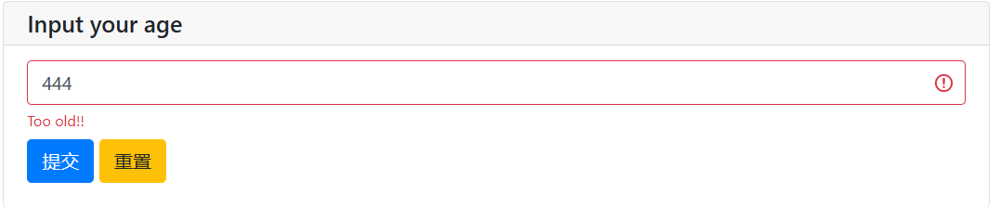

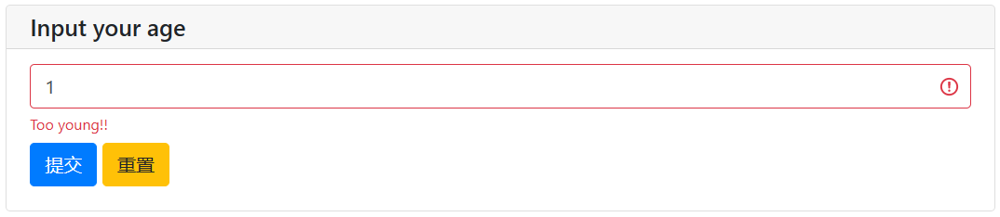

- **name** (*str*) – 输入框的名字。与 [`input_group`](about:reader?url=https%3A%2F%2Fpywebio.readthedocs.io%2Fzh_CN%2Flatest%2Finput.html#pywebio.input.input_group) 配合使用，用于在输入组的结果中标识不同输入项。  **在单个输入中，不可以设置该参数！**

- **value** (*str*) – 输入框的初始值

  ```
  age = input("Input your age", value="请输入你的年龄")
  ```

  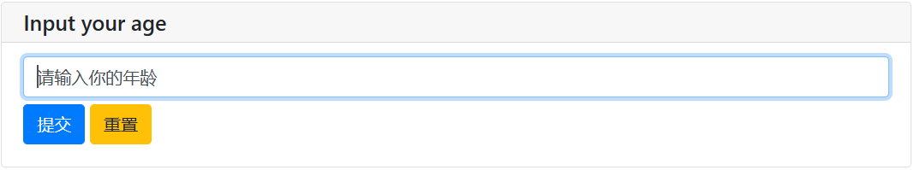

- **action** (*tuple**(**label:str**,* *callback:callable**)*) –在输入框右侧显示一个按钮，用户可通过点击按钮为输入框设置值。

  `label` 为按钮的显示文本， `callback` 为按钮点击的回调函数。

  回调函数需要接收一个 `set_value` 位置参数， `set_value` 是一个可调用对象，接受单参数调用和双参数调用。

  单参数调用时，签名为 `set_value(value:str)` ，调用set_value即可将表单项的值设置为传入的 `value` 参数。

  ```
  import time
  def set_now_ts(set_value):
      set_value(time.strftime("%Y-%M-%D %H:%S:%M",time.localtime()))
  
  ts = input('Timestamp', type=TEXT, action=('Now', set_now_ts))
  ```

  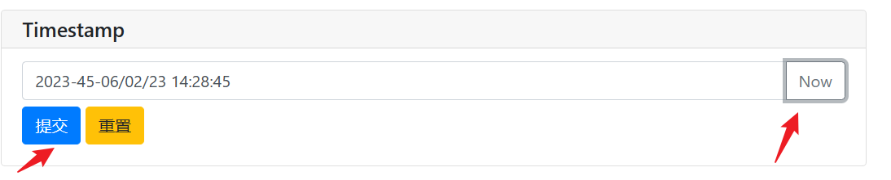

> 点击==Now==,获取当前时间
>
> 点击==提交==，当前字符串赋值给ts变量

双参数调用时，签名为 `set_value(value:any, label:str)` ，其中：

> - `value` 参数为最终输入项的返回值，可以为任意Python对象，并不会传递给用户浏览器
> - `label` 参数用于显示在用户表单项上

使用双参数调用 `set_value` 后，用户表单项会变为只读状态。

双参数调用的使用场景为：表单项的值通过回调动态生成，同时希望用户表单显示的和实际提交的数据不同(例如表单项上可以显示更人性化的内容，而表单项的值则可以保存更方便被处理的对象)

```
from datetime import date,timedelta
def select_date(set_value):
    with popup('Select Date'):
        put_buttons(['Today'], onclick=[lambda: set_value(date.today(), 'Today')])
        put_buttons(['Yesterday'], onclick=[lambda: set_value(date.today() - timedelta(days=1), 'Yesterday')])

d = input('Date', action=('Select', select_date), readonly=True)
put_text(type(d), d)
```

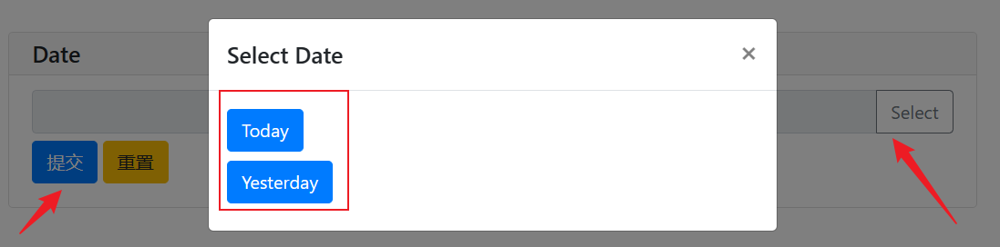

Note: 当使用 [基于协程的会话实现](https://pywebio.readthedocs.io/zh_CN/latest/advanced.html#coroutine-based-session) 时，回调函数 `callback` 可以为协程函数.

- **onchange** (*callable*) – 

  A callback function which will be called when user change the value of this input field.

  `onchange` 回调函数接收一个参数——输入项改变后的值。 `onchange` 的典型用途是配合 [`input_update()`](about:reader?url=https%3A%2F%2Fpywebio.readthedocs.io%2Fzh_CN%2Flatest%2Finput.html#pywebio.input.input_update) 来在一个表单中实现相互依赖的输入。

- **placeholder** (*str*) – 输入框的提示内容。提示内容会在输入框未输入值时以浅色字体显示在输入框中

  ```
  import time
  
  def set_now_ts(set_value):
      set_value(time.strftime('%Y-%m-%d %H:%M:%S', time.localtime()))
  
  ts = input('Timestamp', type=TEXT, action=('Now', set_now_ts), 
  			placeholder="点击右边就能看到现在时间哦~",help_text="小鲁班,哒哒哒")
  ```

  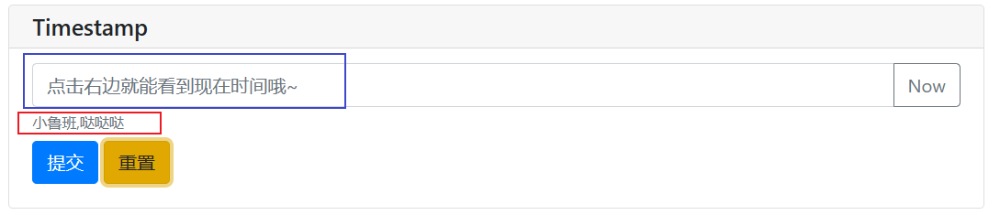

- **required** (*bool*) – 当前输入是否为必填项，默认为 `False`

- **readonly** (*bool*) – 输入框是否为只读

- **datalist** (*list*) – 输入建议内容列表，在页面上的显示效果为下拉候选列表，用户可以忽略建议内容列表而输入其他内容。仅当输入类型 `type` 为 `TEXT` 时可用

- **help_text** (*str*) – 输入框的帮助文本。帮助文本会以小号字体显示在输入框下方

- **other_html_attrs** – 在输入框上附加的额外html属性。参考： [参考](https://developer.mozilla.org/zh-CN/docs/Web/HTML/Element/input#属性)

## 2.2 textarea-多行文本输入

- rows (*int* ) – 输入框的最多可显示的文本的行数，内容超出时会显示滚动条

- maxlength (*int* ) – 最大允许用户输入的字符长度 (Unicode) 。未指定表示无限长度

- minlength (*int* ) – 最少需要用户输入的字符长度(Unicode)

- code (*dict/bool* ) – 通过提供 Codemirror 参数让文本输入域具有代码编辑器样式:

  ```
  可以直接使用 code={} 或 code=True 开启代码编辑样式。代码编辑区支持使用 Esc 或 F11 切换全屏。
    label, validate, name, value, onchange, placeholder, required, readonly, help_text, other_html_attrs (-) – 与 input 输入函数的同名参数含义一致。
  ```

  ```
  res = textarea('Text area', code={
      'mode': "python",
      'theme': 'darcula'
  })
  ```

  

  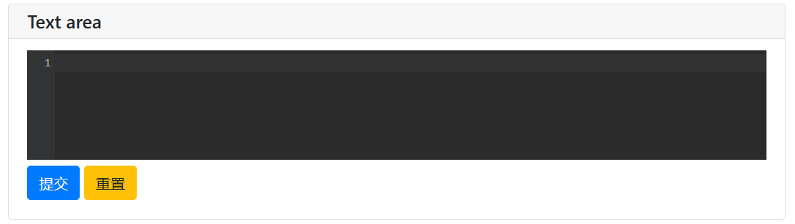

## 2.3 select-下拉选择框

options (*list* ) – 可选项列表。列表项的可用形式有：   

字典

```
    {
    "label":(str) 选项标签,
    "value":(object) 选项值,
    "selected":(bool, optional) 是否默认选中,
    "disabled":(bool, optional) 是否禁止选中
    }
```

tuple or list: (label, value, [selected,] [disabled])

- 单值: 此时*label*和*value*使用相同的值

  ```
  res = select("看你的选择：", ["A", "B"])
  A
  ```

  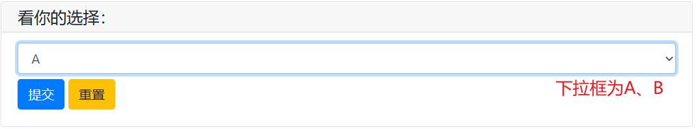

  ```
  # # 列表
  # res = select(label="dda", 
  # options=[['dd', 'dd', True, True],['ee', 'ee', False, False],['ff', 'ff', False, True]])
  # 
  # # 元组
  # res = select(label="dda", 
  # options=[('dd', 'dd', True, True),('ee', 'ee', False, False),('ff', 'ff', False, True)])
  # 字典
  res = select(label="dda", options=[
  {"label": 'dd', "value": 'dd', "selected": True, "disabled": True},
  {"label": 'ee', "value": 'ee', "selected": False, "disabled": False},
  {"label": 'ff', "value": 'ff', "selected": False, "disabled": True}
  ])
  ```

  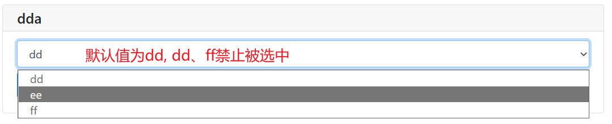

- 多值

  multiple (bool) – 是否可以多选. 默认单选 

  value (list or str) – 下拉选择框初始选中项的值。当 *multiple=True* 时， *value* 需为*list*，否则为单个选项的值。 你也可以通过设置 *options* 列表项中的 *selected* 字段来设置默认选中选项。 最终选中项为 *value* 参数和 *options* 中设置的并集。

  required (bool) – 是否至少选择一项，仅在 *multiple=True* 时可用

  *label, validate, name, onchange, help_text, other_html_attrs (-)* – 与 *input* 输入函数的同名参数含义一致

```
res = select("我是多选：", ["A", "B", "C"], multiple=True, value=["A", "B"])
```

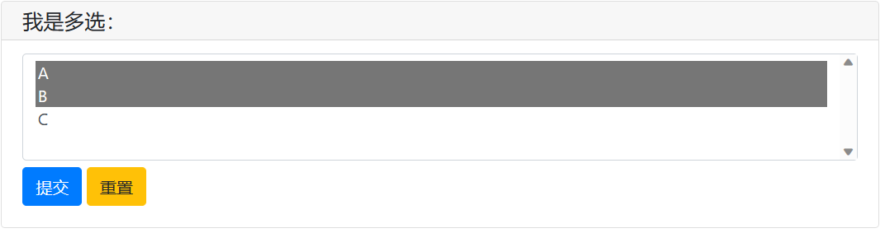

## 2.4 checkbox-勾选选项

- options (list) – 可选项列表。格式与同 *select()* 函数的 *options* 参数

- inline (bool) – 是否将选项显示在一行上。默认每个选项单独占一行

  ```
  check = checkbox("请大佬选择：",["小鲁班","小背包","哒哒哒","小火箭"])
  
  print(check)
  ```

  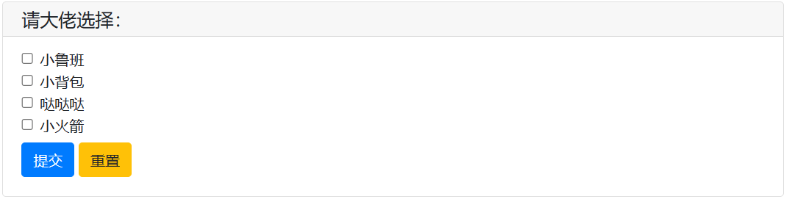

- value (list) – 勾选选项初始选中项。为选项值的列表。你也可以通过设置 *options* 列表项中的 *selected* 字段来设置默认选中选项。

  ```
  check = checkbox("请大佬选择：",["小鲁班","小背包","哒哒哒","小火箭"],inline=True,value=['小鲁班'])
  ```

  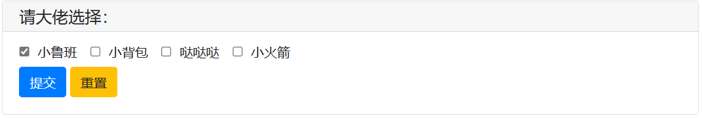

- *label, validate, name, onchange, help_text, other_html_attrs* (-) – 与 *input* 输入函数的同名参数含义一致

## 2.5 radio 单项选择

- options (list) – 可选项列表。格式与同 *select()* 函数的 *options* 参数
- inline (bool) – 是否将选项显示在一行上。默认每个选项单独占一行
- value (str) – 可选项列表。格式与同 *select()* 函数的 *options* 参数
- required (bool) – 是否一定要选择一项（默认条件下用户可以不选择任何选项）
- *label, validate, name, onchange, help_text, other_html_attrs (-)* – 与 *input* 输入函数的同名参数含义一致

```
check = radio("请大佬选择：", ["小鲁班", "小背包", "哒哒哒", "小火箭"], inline=True, value="小背包")
print(check)
```

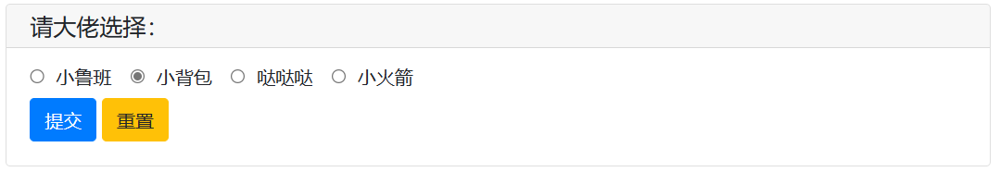

## 2.6 slider 滑块输入

- value (int/float) – 滑块的初始值
- min_value (int/float) – 滑块最小允许的值
- max_value (int/float) – 滑块最大允许的值
- step (int) – 滑动的步长。仅当 *value、 min_value* 和 *max_value* 全为*int*时有效
- *label, name, validate, onchange, required, help_text, other_html_attrs (-)* – 与 *input* 输入函数的同名参数含义一致

- 若 *value, min_value* 和 *max_value* 中含有*float*类型，则返回值为*float*，否则返回值为*int*类型

  ```
  check = slider(label="请选择数值：",value=5, min_value=1, max_value=100, step=1)
  print(check)
  ```

  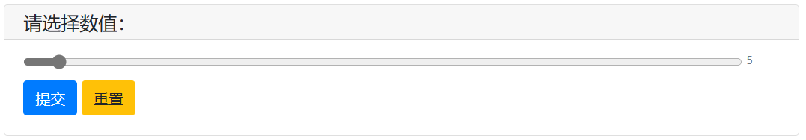

## 2.7 actions 按钮选项

在表单上显示为一组按钮，用户点击按钮后依据按钮类型的不同有不同的表现。

buttons(list) - 按钮列表。列表项的可用形式有：

字典

```
# 若 type = 'reset' / 'cancel' 或 disabled = True 可省略 value
{
"label":(str) button label,
"value":(object) button value,
"type":(str, optional) button type,
"disabled":(bool, optional) whether the button is disabled,
"color":(str, optional) button color
}
```

 tuple or list: (label, value, [type], [disabled])

- 单值: 此时*label*和*value*使用相同的值， 其中， *value* 可以为任意可*JSON*序列化的对象。

  ```
  # 简单的操作
  check = actions('Confirm to delete file?', ['confirm', 'cancel'],
                  help_text='Unrecoverable after file deletion')
  
  put_markdown('You clicked the `%s` button' % check).show()
  ```

  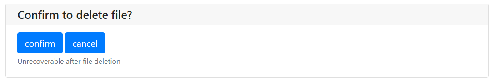

  

  ```
  type 可选值为:
  'submit' : 点击按钮后，立即将整个表单提交，最终表单中本项的值为被点击按钮的 value 值。 'submit' 为 type 的默认值
  'cancel' : 取消输入。点击按钮后，立即将整个表单提交，表单值返回 None
  'reset' : 点击按钮后，将整个表单重置，输入项将变为初始状态。 注意：点击 type=reset 的按钮后，并不会提交表单， actions() 调用也不会返回
  The color of button can be one of: primary, secondary, success, danger, warning, info, light, dark.
  ```

- *label, name, help_text (-)* – 与 *input* 输入函数的同名参数含义一致

```
info = input_group('Add user', [
    input('username', type=TEXT, name='username', required=True),
    input('password', type=PASSWORD, name='password', required=True),
    actions('actions', [
        {'label': 'Save', 'value': 'save'},
        {'label': 'Save and add next', 'value': 'save_and_continue'},
        {'label': 'Reset', 'type': 'reset', 'color': 'warning'},
        {'label': 'Cancel', 'type': 'cancel', 'color': 'danger'},
    ], name='action', help_text='actions'),
])

put_code('info = ' + json.dumps(info, indent=4))
if info is not None:
    if info['action'] == 'save_and_continue':
        print(info)
```

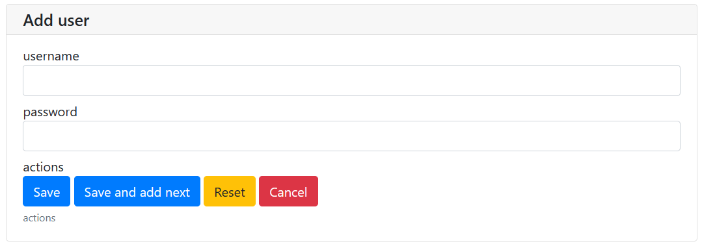

## 2.8 file_upload 文件上传

### 上传excel文件

```
# # 上传文件 multiple 指定文件数量
# file = web.input.file_upload('请选择需要加载的数据', accept=['.xlsx', '.xls'], multiple=True)
# # 读取excel数据
# df = pd.read_excel(file[0]['content'])
# # heml页面显示
# web.output.put_html(df.head(10).to_html())
```

### 上传txt文件,逐行读取

```
txtFile = file_upload("Select some txtFile:")
with open(txtFile['filename'],'r',encoding='utf-8') as FA:
    for line in FA:
    	print(line)
```

### 上传图片

```
# 上传并保存
f = file_upload("Upload a image")                  
open(f['filename'], 'wb').write(f['content'])  
# 上传并网页显示
imgs = file_upload("Select some pictures:", accept="image/*", multiple=True)
for img in imgs:
    put_image(img['content'])
```

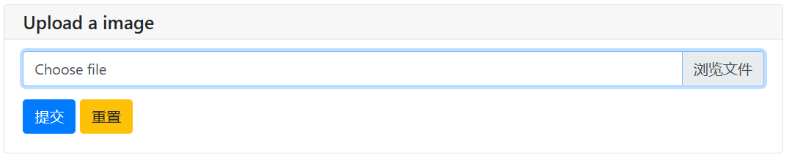

- accept（str or list）- 单值或列表, 表示可接受的文件类型。文件类型的可用形式有：   

  -  以"."字符开始的文件扩展名。*`例如：.jpg, .png, .doc`*
  -  一个有效的MIME类型。例如：*`application/pdf、audio/\*`* 表示音频文件、*`video/\*`* 表示视频文件、*`image/\*`*表示图片文件

- placeholder（str）- 未上传文件时，文件上传框显示的文本

- multiple（bool）- 是否允许多文件上传，默认关闭，返回dict

  ```
  {
      'filename': 文件名，
      'content'：文件二进制数据(bytes object),
      'mime_type': 文件的MIME类型,
      'last_modified': 文件上次修改时间(时间戳)
  }
  
  若用户没有上传文件，返回None
  multiple=True时，返回列表；若用户没有上传文件，返回空列表
  ```

- max_size（int/str）- 单个文件的最大大小，超过限制将会禁止上传。0代表不限制

  ```
  max_size 值可以为数字表示的字节数，或以 K / M / G 结尾表示的字符串(分别表示 千字节、兆字节、吉字节，大小写不敏感)。
  例如: max_size=500 , max_size='40K' , max_size='3M'
  ```

- max_total_size (int/str) – 所有文件的最大大小，超过限制将会禁止上传。仅在 *`multiple=True`* 时可用，默认不限制上传文件的大小。 格式同 *`max_size`* 参数

- required (bool) – 是否必须要上传文件。默认为 *`False`*

- *label, name, help_text, other_html_attrs (-)* – 与 *`input`* 输入函数的同名参数含义一致

## 2.9 input_group 输入组

- label (str) – 输入组标签

- inputs (list) – 输入项列表。列表的内容为对单项输入函数的调用，并在单项输入函数中传入 name 参数。

- validate (callable) – 输入组校验函数。

- 函数签名：callback(data) -> (name, error_msg) validate 接收整个表单的值为参数，当校验表单值有效时，返回 *`None`* ，当某项输入值无效时，返回出错输入项的 *`name`* 值和错误提示. 比如:

  ```
  def check_form(data):
      if len(data['name']) > 6:
          return ('name', 'Name to long!')
      if data['age'] <= 0:
          return ('age', 'Age cannot be negative!')
  
  data = input_group("Basic info", [
      input('Input your name', name='name'),
      input('Repeat your age', name='age', type=NUMBER)
  ], validate=check_form)
  print(data)
  ```

  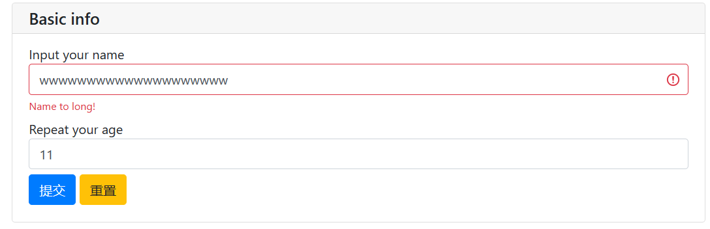

- cancelable - 表单是否可以取消。若 *`cancelable=True`* 则会在表单底部显示一个“取消”按钮，默认为 *`False`* 。 

注意：若 *`inputs`* 中最后一项输入为 *`actions()`*，则忽略 `*cancelable*。`若用户取消表单，返回 *`None`* ,否则返回一个 *`dict`* , 其键为输入项的 *`name`* 值，字典值为输入项的值。

## 2.10 input_update 更新输入项的属性

本函数仅能在输入函数的 *`onchange`* 回调中使用。

- name (str) – 目标输入项的 `name` 。可选，默认为当前触发 *`onchange`* 回调的输入项

- spec – 需要更新的输入项参数。注意一下参数无法被更新：*`type`, `name`, `validate`, `action`, `code`, `onchange`, `multiple`*

- 一个具有依赖关系的输入项的示例：

  ```
  country2city = {
      'China': ['Beijing', 'Shanghai', 'Hong Kong'],
      'USA': ['New York', 'Los Angeles', 'San Francisco'],
  }
  countries = list(country2city.keys())
  location = input_group("Select a location", [
      select('Country', options=countries, name='country',
             onchange=lambda c: input_update('city', options=country2city[c])),
      select('City', options=country2city[countries[0]], name='city'),
  ])
  
  print(location)
  ```

  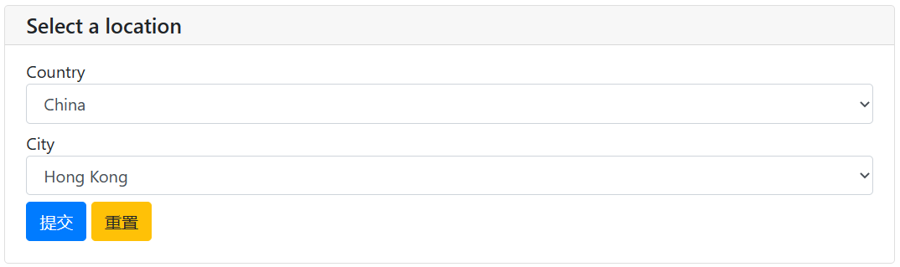


## 2.2 其它参考官方文档

# 三、输出函数

模块：pywebio.output.对应功能

[教程](https://blog.csdn.net/heianduck/article/details/121745458)

|             | 函数                                                         | 简介                                              | 参数                                                         |
| ----------- | ------------------------------------------------------------ | ------------------------------------------------- | ------------------------------------------------------------ |
| 输出域Scope | `put_scope`                                                  | 创建一个新的scope.                                | `pywebio.output.put_scope`(*name*, *content=[]*, *scope=None*, *position=- 1*) |
|             | `use_scope`†                                                 | 进入输出域                                        | `pywebio.output.use_scope`(*name=None*, *clear=False*)       |
|             | `get_scope`                                                  | 获取当前正在使用的输出域                          | `pywebio.output.get_scope`(*stack_idx=- 1*)                  |
|             | `clear`                                                      | 清空scope内容                                     | `pywebio.output.clear`(*scope=None*)                         |
|             | `remove`                                                     | 移除Scope                                         | `pywebio.output.remove`(*scope=None*)                        |
|             | `scroll_to`                                                  | 将页面滚动到 scope Scope处                        | `pywebio.output.scroll_to`(*scope=None*, *position='top'*)   |
| 内容输出    | `put_text`                                                   | 输出文本                                          | `pywebio.output.put_text`(**texts*, *sep=' '*, *inline=False*, *scope=None*, *position=- 1*) |
|             | `put_markdown`                                               | 输出Markdown                                      | `pywebio.output.put_markdown`(*mdcontent*, *lstrip=True*, *options=None*, *sanitize=True*, *scope=None*, *position=- 1*, ***kwargs*) |
|             | `put_info`*† <br>`put_success`*† <br>`put_warning`*† <br>`put_error`*† | 输出通知消息                                      | `pywebio.output.put_info`(**contents*, *closable=False*, *scope=None*, *position=- 1*) <br>其它同理 |
|             | `put_html`                                                   | 输出Html                                          | `pywebio.output.put_html`(*html*, *sanitize=False*, *scope=None*, *position=- 1*) |
|             | `put_link`                                                   | 输出链接                                          | `pywebio.output.put_link`(*name*, *url=None*, *app=None*, *new_window=False*, *scope=None*, *position=- 1*) |
|             | `put_processbar`                                             | 输出进度条                                        | `pywebio.output.put_processbar`(*name*, *init=0*, *label=None*, *auto_close=False*, *scope=None*, *position=- 1*)<br>`pywebio.output.set_processbar`(*name*, *value*, *label=None*) |
|             | `put_loading`†                                               | 输出加载提示                                      | `pywebio.output.put_loading`(*shape='border'*, *color='dark'*, *scope=None*, *position=- 1*) |
|             | `put_code`                                                   | 输出代码块                                        | `pywebio.output.put_code`(*content*, *language=''*, *rows=None*, *scope=None*, *position=- 1*) |
|             | `put_table`*                                                 | 输出表格                                          | `pywebio.output.put_table`(*tdata*, *header=None*, *scope=None*, *position=- 1*) |
|             | `put_button`<br>`put_buttons`                                | 输出按钮，并绑定点击事件                          | `pywebio.output.put_button`(*label*, *onclick*, *color=None*, *small=None*, *link_style=False*, *outline=False*, *disabled=False*, *scope=None*, *position=- 1*) <br>`pywebio.output.put_buttons`(*buttons*, *onclick*, *small=None*, *link_style=False*, *outline=False*, *group=False*, *scope=None*, *position=- 1*, ***callback_options*) |
|             | `put_image`                                                  | 输出图片                                          | `pywebio.output.put_image`(*src*, *format=None*, *title=''*, *width=None*, *height=None*, *scope=None*, *position=- 1*) |
|             | `put_file`                                                   | 显示一个文件下载链接                              | `pywebio.output.put_file`(*name*, *content*, *label=None*, *scope=None*, *position=- 1*) |
|             | `put_tabs`*                                                  | 输出横向标签栏Tabs                                | `pywebio.output.put_tabs`(*tabs*, *scope=None*, *position=- 1*) |
|             | `put_collapse`*†                                             | 输出可折叠的内容                                  | `pywebio.output.put_collapse`(*title*, *content=[]*, *open=False*, *scope=None*, *position=- 1*) |
|             | `put_scrollable`*†                                           | 固定高度内容输出区域 内容超出则显示滚动条 .       | `pywebio.output.put_scrollable`(*content=[]*, *height=400*, *keep_bottom=False*, *border=True*, *scope=None*, *position=- 1*, ***kwargs*) |
|             | `put_widget`*                                                | 输出自定义的控件                                  | `pywebio.output.put_widget`(*template*, *data*, *scope=None*, *position=- 1*) |
| 其他交互    | `toast`                                                      | 显示一条通知消息                                  | `pywebio.output.toast`(*content*, *duration=2*, *position='center'*, *color='info'*, *onclick=None*) |
|             | `popup`*†                                                    | 显示弹窗                                          | `pywebio.output.popup`(*title*, *content=None*, *size='normal'*, *implicit_close=True*, *closable=True*) |
|             | `close_popup`                                                | 关闭正在显示的弹窗                                | `pywebio.output.close_popup`()                               |
| 布局与样式  | `put_row`*†                                                  | 使用行布局输出内容                                | `pywebio.output.put_row`(*content=[]*, *size=None*, *scope=None*, *position=- 1*) |
|             | `put_column`*†                                               | 使用列布局输出内容                                | `pywebio.output.put_column`(*content=[]*, *size=None*, *scope=None*, *position=- 1*) |
|             | `put_grid`*                                                  | 使用网格布局输出内容                              | `pywebio.output.put_grid`(*content*, *cell_width='auto'*, *cell_height='auto'*, *cell_widths=None*, *cell_heights=None*, *direction='row'*, *scope=None*, *position=- 1*) |
|             | `span`                                                       | 在 `put_table()`和 `put_grid()`中设置内容跨单元格 | `pywebio.output.span`(*content*, *row=1*, *col=1*)           |
|             | `style`*                                                     | 自定义输出内容的css样式                           | `pywebio.output.``style`(*outputs*, *css_style*)             |

## output 基本输出

### 输出文本

```
output.put_text("Input password")
```


### 输出Markdown

```
output.put_markdown('~~Hello word!~~')
```


### 显示弹窗,  显示弹窗

```
output.popup('弹窗标题', '弹窗内容')
output.toast("显示一条通知消息 🔔")
```

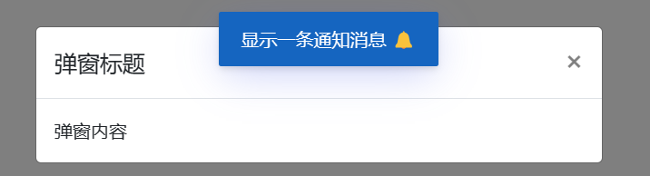


### 输出表格

```
output.put_table([
    ['Name', 'Gender', 'Address'],
    ['Wang', 'M', 'China'],
    ['Liu', 'W', 'America']
])
```

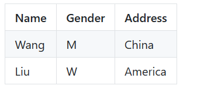

### 输出图片

```
output.put_image("https://t7.baidu.com/it/u=963301259,1982396977&fm=193&f=GIF")
```


### 显示一个文件下载链接

```
output.put_file("hello_word.txt", b'文件内容')
```

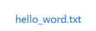

## output 组合输出

函数名以 put_ 开始的输出函数，可以与一些输出函数组合使用，作为最终输出的一部分：`put_table()`支持以 `put_xxx()` 调用作为单元

```
put_table([
    ['Type', 'Content'],
    ['html', put_html('X<sup>2</sup>')],
    ['text', '<hr/>'],
    ['buttons', put_buttons(['A', 'B'], onclick=...)],  
    ['markdown', put_markdown('`Awesome PyWebIO!`')],
    ['file', put_file('hello.text', b'hello world')],
    ['table', put_table([['A', 'B'], ['C', 'D']])]
])
```

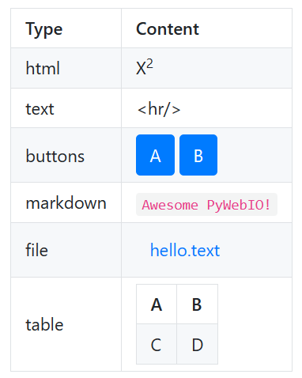

## output 输出域Scope

#### use_scope()

```
# 可以使用 use_scope() 开启并进入一个新的输出域，或进入一个已经存在的输出域
with use_scope('scope1'):  # 创建并进入scope 'scope1'  
    put_text('text1 in scope1') # 输出内容到 scope1 
put_text('text in parent scope of scope1')  # 输出内容到 ROOT scope
with use_scope('scope1'):  # 进入之前创建的scope 'scope1'
    put_text('text2 in scope1')  # 输出内容到 scope1
```

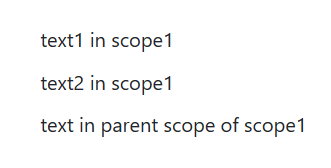

#### clear()

```
# use_scope() 使用 clear 参数将scope中原有的内容清空
with use_scope('scope2'):  # 创建并进入scope 'scope2'
    put_text('create scope2')  # 输出内容到 scope2
put_text('text in parent scope of scope2')  # 输出内容到 ROOT scope
with use_scope('scope2', clear=True):  # 进入之前的“scope2”，清楚之前的内容
    put_text('I have replace content of scope2!!')  # 重新输出内容到 scope2
```

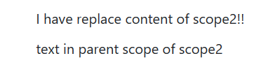

#### use_scope装饰器 + clear()

```
import time
from datetime import datetime

@use_scope('time', clear=True)
def show_time():
    put_text(datetime.now())

while True:
    show_time()
    time.sleep(3)
# 第一次调用 show_time 时，将会创建 time 输出域并在其中输出当前时间，之后每次调用 show_time() ，输出域都会被新的内容覆盖
```

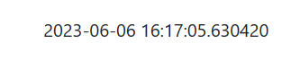

#### scope 嵌套

下面代码的布局如下：

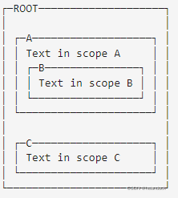

```
# pyWebIO应用只有一个 ROOT scope。
with use_scope('A'):
    put_text('Text in scope A')
    with use_scope('B'):
        put_text('Text in scope B')
with use_scope('C'):
    put_text('Text in scope C')
put_html("""<style>                                        
#pywebio-scope-A {border: 1px solid red;}                   
#pywebio-scope-B {border: 1px solid blue;margin:2px}        
#pywebio-scope-C {border: 1px solid green;margin-top:2px}   
</style>""")
put_text()
put_buttons([('Put text to %s' % i, i) for i in ('A', 'B', 'C')], lambda s: put_text(s, scope=s)).show()
```

1、初始运行结果：

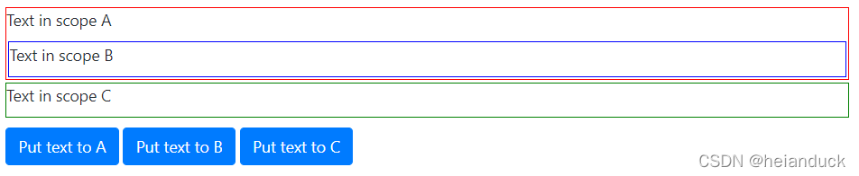

 2、单击'Put text to A'

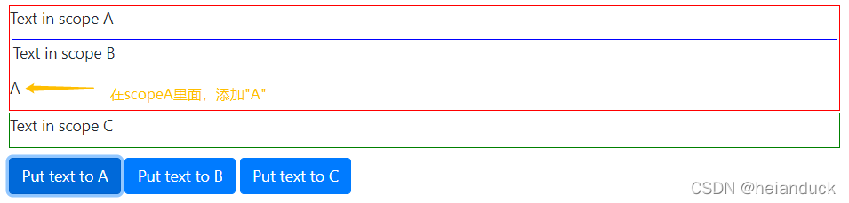

 3、再单击'Put text to B'

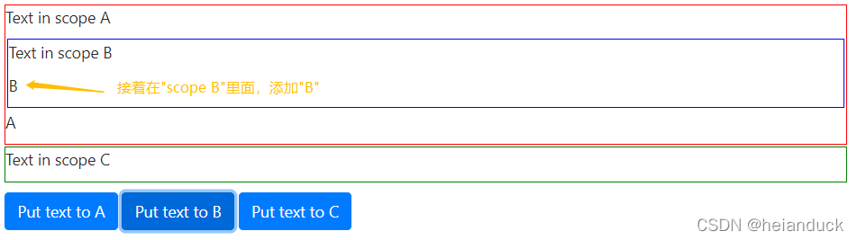

 4、最后单击两次'Put text to C'


#### 将页面滚动到 Scope处

```
# 重新建A+B/C/D，3个scope
with use_scope('A'):
    put_text('Text in scope A')
    with use_scope('B'):
        put_text('Text in scope B')
with use_scope('C'):
    put_text('Text in scope C')
with use_scope('D'):
    put_text('Text in scope D')
put_html("""<style>                                         
#pywebio-scope-A {border: 1px solid red;}                   
#pywebio-scope-B {border: 1px solid blue;margin:2px}        
#pywebio-scope-C {border: 1px solid green;margin-top:502px}   
#pywebio-scope-D {border: 1px solid orange;margin-top:502px}
</style>""").show()
# 可对’C‘分别进行测试滚动
scroll_to(scope='C', position='top')
scroll_to(scope='C', position='middle')
scroll_to(scope='C', position='bottom')
```

## output 内容输出

### put_text 输入文本

```
pywebio.output.put_text(*texts, sep=' ', inline=False, scope=None, position=- 1)
```

> 参数
>
> - texts – 要输出的内容。类型可以为任意对象，对非字符串对象会应用 str() 函数作为输出值。
> - sep (str) – 输出分隔符
> - inline (bool) – 将文本作为行内元素(连续输出的文本显示在相同的段落中)。默认每次输出的文本都作为一个独立的段落
> - scope (str) – 内容输出的目标scope，若scope不存在，则不进行任何输出操作。可以直接指定目标Scope名，或者使用int通过索引Scope栈来确定Scope
> - position (int) – 在scope中输出的位置

```
#sep
put_text('我是谁','我在哪','我在干嘛',sep='-',inline=True).show()
#inline 当两个put_text连续使用true时，才会显示同一行
put_text("小鲁班",inline=False).show()
put_text("小背包",inline=True).show()
put_text("小火箭",inline=True).show()
put_text("哒哒哒",inline=False).show()
put_text("嘟嘟嘟",inline=True).show()
put_text("hehehe",inline=False).show()
#position 按索引插入位置。
```

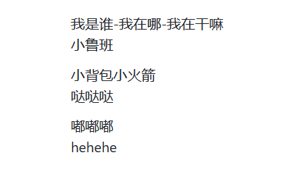


###  put_markdown 输出Markdown

```
pywebio.output.put_markdown(mdcontent, lstrip=True, options=None,sanitize=True, scope=None, position=-1,
 **kwargs)
```

> 参数
>
> - mdcontent (str) – Markdown文本
> - lstrip (bool) – 是否自动移除 mdcontent 每一行的前导空白锁进
> - sanitize (bool) – 是否使用 DOMPurify 对内容进行过滤来防止XSS攻击。

```
put_markdown(r""" # H1
This is H1 first content.
dd""").show()
# Using lstrip to get beautiful indent

put_markdown(r""" # H2
    This is H2 second content.
    dd""", lstrip=False).show()
put_markdown(r""" # H2
    This is H2 second content.
    dd""").show()
```

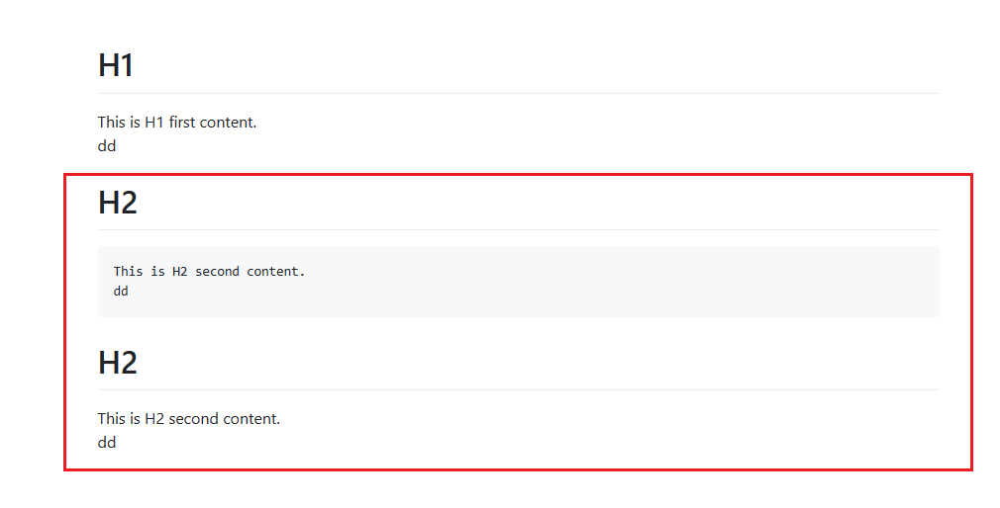

### put_link 输出链接到其他网页或PyWebIO App的超链接

```
pywebio.output.put_link(name, url=None, app=None, new_window=False,\
                     scope=None, position=- 1)
```

>  参数
>
> - name (str) – 链接名称
> - url (str) – 链接到的页面地址
> - app (str) – 链接到的PyWebIO应用名。参见 Server模式
> - new_window (bool) – 是否在新窗口打开链接
> - scope, position (int) – 与 put_text 函数的同名参数含义一致
>   `url` 和 `app` 参数必须指定一个但不可以同时指定

```
put_link("你再百度一下试试？","https://www.baidu.com/",new_window=True).show()
```


### put_processbar 输出进度条

```
pywebio.output.put_processbar(name, init=0, label=None, auto_close=False, \
                scope=None, position=- 1)
```

> 参数
>
> - name (str) – 进度条名称，为进度条的唯一标识
> - init (float) – 进度条初始值. 进度条的值在 0 ~ 1 之间
> - label (str) – 进度条显示的标签. 默认为当前进度的百分比
> - auto_close (bool) – 是否在进度完成后关闭进度条

```
put_processbar(name="process",init=0.35,label="我就是个进度条：").show()
```


测试程序

```
import time
put_processbar('bar')
for i in range(1, 11):
    set_processbar('bar', i / 10)
    time.sleep(0.1)
```

### put_table 输出表格

```
pywebio.output.put_table(tdata, header=None, scope=None, position=- 1)
```

> 参数
>
> - tdata (list) – 表格数据。列表项可以为 `list` 或者 `dict` , 单元格的内容可以为字符串或 `put_xxx` 类型的输出函数。 数组项可以使用 `span()` 函数来设定单元格跨度。
> - header (list) –表头。当 `tdata` 的列表项为 `list` 类型时，若省略 `header` 参数，则使用 `tdata` 的第一项作为表头。表头项可以使用 `span()` 函数来设定单元格跨度。

当 `tdata` 为字典列表时，使用 `header` 指定表头顺序，不可省略。此时， `header` 格式可以为 <字典键>列表 或者 (`<显示文本>, <字典键>`) 列表。

```
# 'Name' cell across 2 rows, 'Address' cell across 2 columns
put_table([
    [span('Name',row=2), span('Address', col=2)],
    ['City', 'Country'],
    ['Wang', 'Beijing', 'China'],
    ['Liu', 'New York', 'America'],
])
```

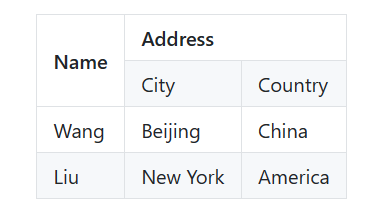

```
put_table([
    ['Type', 'Content'],
    ['html', put_html('X<sup>2</sup>')],
    ['text', '<hr/>'],
    ['buttons', put_buttons(['A', 'B'], onclick=...)],  
    ['markdown', put_markdown('`Awesome PyWebIO!`')],
    ['file', put_file('hello.text', b'hello world')],
    ['table', put_table([['A', 'B'], ['C', 'D']])]
])
```


```
# Set table header
put_table([
    ['Wang', 'M', 'China'],
    ['Liu', 'W', 'America'],
], header=['Name', 'Gender', 'Address'])
```

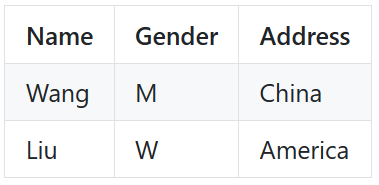

```
# When ``tdata`` is list of dict
put_table([
    {"Course":"OS", "Score": "80"},
    {"Course":"DB", "Score": "93"},
], header=["Course", "Score"])  # or header=[(put_markdown("*Course*"), "Course"), (put_markdown("*Score*") ,"Score")]
```

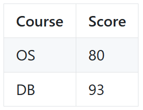

###  span 设置内容跨单元格

```
pywebio.output.span(content, row=1, col=1)
```

 用于在 `put_table()` 和 `put_grid()` 中设置内容跨单元格

> 参数
>
> - content – 单元格内容。可以为字符串或 put_xxx() 调用。
> - row (int) – 竖直方向跨度, 即：跨行的数目
> - col (int) – 水平方向跨度, 即：跨列的数目

```
put_table([
    ['C'],
    [span('E', col=2)],  # 'E' across 2 columns
], header=[span('A', row=2), 'B']).show()  # 'A' across 2 rows
```

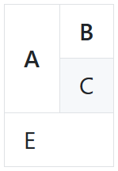

```
put_grid([
    [put_text('A'), put_text('B')],
    [span(put_text('A'), col=2)],  # 'A' across 2 columns
]).show()
```

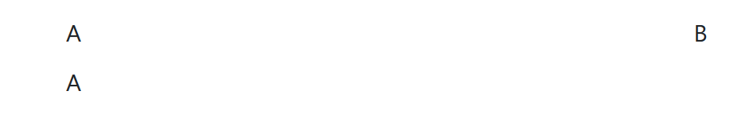

###  put_buttons 输出按钮，并绑定点击事件

```
pywebio.output.put_button(label, onclick, color=None, small=None,\
                link_style=False, outline=False, disabled=False,
                scope=None, position=- 1)
```

> 参数
>
> - label (str) - Button label
> - onclick (callable/list) - 按钮点击回调函数. `onclick` 可以是函数或者函数组成的列表.
>   `onclick` 为函数时， 签名为 `onclick(btn_value)`. `btn_value` 为被点击的按钮的 `value` 值
>   `onclick` 为列表时，列表内函数的签名为 `func()`. 此时，回调函数与 `buttons` 一一对应
>    Tip: 可以使用 `functools.partial` 来在 `onclick` 中保存更多上下文信息.
> - small (bool) – 是否使用小号按钮，默认为False
> - link_style (bool) – 是否将按钮显示为链接样式，默认为False
> - outline (bool) – 是否将按钮显示为镂空样式，默认为False
> - group (bool) – 是否将按钮合并在一起，默认为False
> - color (str) – 按钮颜色。可选值为 `primary` 、`secondary` 、 `success` 、 `danger` 、 `warning` 、 `info` 、 `light` 、 `dark` .
> - disabled (bool) – Whether the button is disabled
> - scope, position (int) – 与 put_text 函数的同名参数含义一致

```
put_buttons([  
    dict(label=i, value="I'm "+i, color=i)  
    for i in ['primary', 'secondary', 'success', 'danger', 'warning', 'info', 'light', 'dark']  
], onclick=put_text).show()
```

```
put_buttons(['检查重复值','删除重复值','检查缺失值','删除缺失值','检查异常值','删除异常值'], onclick=[
lambda: chongfu(df,res_table),
lambda: chongfuchuli(df,res_table),
lambda: other(),
lambda: other(),
lambda: other(),
lambda: other()])
```

```
buttons = [{'label': '中兴日报邮件', 'color': 'primary', "value": ""},
{'label': '中兴_5g业务量&指标日报', 'color': 'success', "value": ""},
{'label': '中兴_5g小区可用率日报', 'color': 'primary', "value": ""},
{'label': '中兴_5g高下切小区查询', 'color': 'success', "value": ""},
{'label': '中兴_5g小区可用率周报', 'color': 'primary', "value": ""},
{'label': '检查异常值', 'color': 'success', "value": ""},
{'label': '删除重复值', 'color': 'primary', "value": ""},
{'label': '检查缺失值', 'color': 'success', "value": ""},
{'label': '删除缺失值', 'color': 'primary', "value": ""}
]
web.output.put_buttons(buttons, onclick=[
lambda: daily_maiSentAutomatically(config_path),
lambda: traffic_index_Daily(config_path),
lambda: cell_availability_ratio_Day(config_path),
lambda: other(),
lambda: other(),
lambda: other(),
lambda: other(),
lambda: other(),
lambda: other()
], small=True)
```


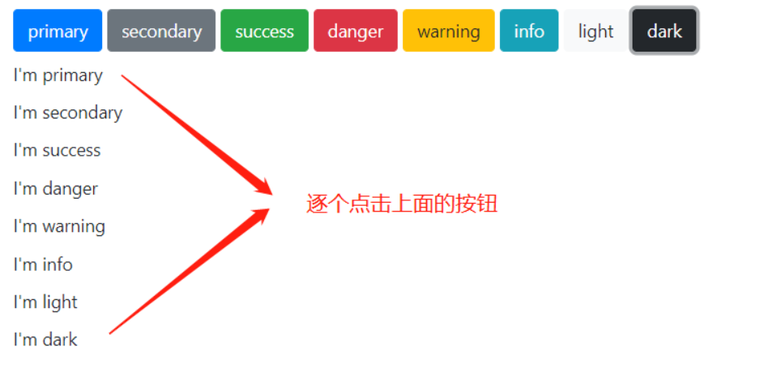

```
put_buttons([{'label': 'success', 'value': "I'm success", 'color': "success"},
             {'label': 'danger', 'value': "I'm danger", 'color': "danger"}], onclick=put_text).show()
             
# small
put_text("----------small-----------")
put_buttons([{'label': 'success', 'value': "I'm success", 'color': "success"},
{'label': 'danger', 'value': "I'm danger", 'color': "danger"}], onclick=put_text, small=True).show()

# link_style
put_text("----------link_style-----------")
put_buttons([{'label': 'success', 'value': "I'm success", 'color': "success"},
 {'label': 'danger', 'value': "I'm danger", 'color': "danger"}], onclick=put_text, link_style=True).show()
 
# outline
put_text("----------outline-----------")
put_buttons([{'label': 'success', 'value': "I'm success", 'color': "success"},
{'label': 'danger', 'value': "I'm danger", 'color': "danger"}], onclick=put_text, outline=True).show()

# group
put_text("----------group-----------")
put_buttons([{'label': 'success', 'value': "I'm success", 'color': "success"},
{'label': 'danger', 'value': "I'm danger", 'color': "danger"}], onclick=put_text, group=True).show()
```

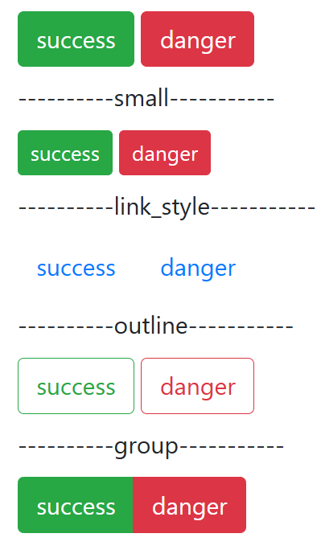

```
from functools import partial

def row_action(choice, id):
    put_text("You click %s button with id: %s" % (choice, id))
put_buttons(['edit', 'delete'], onclick=partial(row_action, id=1)).show()
# 依次点击"edit","delete"
```

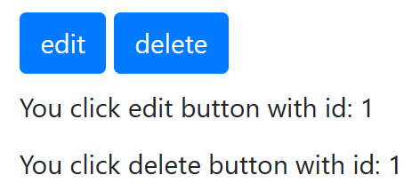

```
def edit():
    put_text("You click edit button")


def delete():
    put_text("You click delete button")

put_buttons(['edit', 'delete'], onclick=[edit, delete]).show()
# 依次点击"edit","delete"
```

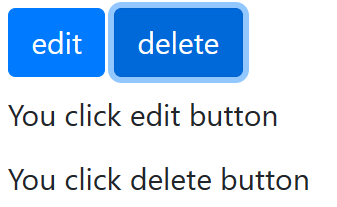

### put_image 图片

```
pywebio.output.put_image(src, format=None, title='', width=None, height=None, \
                    scope=None, position=- 1)
```

> 参数
> src – 图片内容. 可以为: 字符串类型的URL, bytes-like object 表示的图片二进制内容, PIL.Image.Image 实例
> title (str) – 图片描述
> width (str) – 图像的宽度，可以是CSS像素(数字px)或者百分比(数字%)
> height (str) – 图像的高度，可以是CSS像素(数字px)或者百分比(数字%)。可以只指定 width 和 height 中的一个值，浏览器会根据原始图像进行缩放。
> format (str) – 图片格式，非必须。如 png , jpeg , gif 等, 仅在 src 为非URL时有效
> scope, position (int) – 与 put_text 函数的同名参数含义一致

```
# 读取本地图片
from pywebio import STATIC_PATH

img = open('testPic.jpg', 'rb').read()
put_image(img, width='50px').show()
```


```
# 读取网络图片
put_image('https://www.python.org/static/img/python-logo.png').show()
```


### **put_file 文件下载**

```
pywebio.output.put_file(name, content, label=None, scope=None, position=- 1)
```

在浏览器上的显示为一个以文件名为名的链接，点击链接后浏览器自动下载文件。

> 参数
>
> - name (str) – 下载保存为的文件名
> - content – 文件内容. 类型为 bytes-like object
> - label (str) – 下载链接的显示文本，默认和文件名相同
> - scope, position (int) – 与 `put_text` 函数的同名参数含义一致

```
content = open('TXT测试文件.txt', 'rb').read()
put_file('hello-world.txt', content, 'download me').show()
```

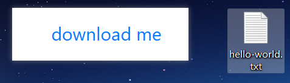

### **put_tabs 横向标签栏**

```
pywebio.output.put_tabs(tabs, scope=None, position=- 1)
```

> 参数
>
> - tabs (list) – 标签列表，列表项为一个 dict: `{"title": "Title", "content": ...}` ，其中 `content` 表示标签内容，可以为字符串、 `put_xxx()` 调用或由它们组成的列表。
> - scope, position (int) – 与 `put_text` 函数的同名参数含义一致

```
put_tabs([
    {'title': 'Text', 'content': 'Hello world'},
    {'title': 'Markdown', 'content': put_markdown('~~Strikethrough~~')},
    {'title': 'More content', 'content': [
        put_table([
            ['Commodity', 'Price'],
            ['Apple', '5.5'],
            ['Banana', '7'],
        ]),
        put_link('pywebio', 'https://github.com/wang0618/PyWebIO')
    ]},
]).show()
#3个标签里面都有内容
```

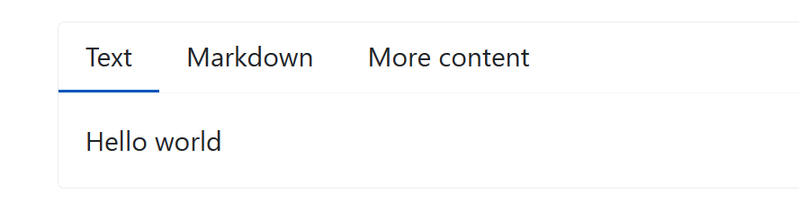

### **put_collapse 输出可折叠的内容**

```
pywebio.output.put_collapse(title, content=[], open=False, scope=None, position=- 1)
```

>  参数
>
> - title (str) – 内容标题
> - content (list/str/put_xxx()) – 内容可以为字符串或 `put_xxx` 类输出函数的返回值，或者由它们组成的列表。
> - open (bool) – 是否默认展开折叠内容。默认不展开内容
> - scope, position (int) – 与 `put_text` 函数的同名参数含义一致

```
put_collapse('Collapse title', [
    'text',
    put_markdown('~~Strikethrough~~'),
    put_table([
        ['Commodity', 'Price'],
        ['Apple', '5.5'],
    ])
], open=True).show()
```

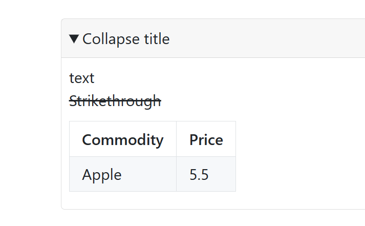

### put_scrollable 固定高度内容输出区域，内容超出则显示滚动条

```python
pywebio.output.put_scrollable(content=[], height=400, \
                keep_bottom=False, border=True, scope=None, \
                position=- 1, **kwargs)
```

> 参数
>
> - content (list/str/put_xxx()) – 内容可以为字符串或 `put_xxx` 类输出函数的返回值，或者由它们组成的列表。
> - height (int/tuple) – 区域的高度（像素），内容超出此高度则使用滚动条。可以传入 (min_height, max_height)  来表示高度的范围，比如 (100, 200) 表示区域高度最小100像素、最高200像素。若不想限制高度，则传入 `None`
> - keep_bottom (bool) – Whether to keep the content area scrolled to the bottom when updated.
> - border (bool) – 是否显示边框
> - scope, position (int) – 与 `put_text` 函数的同名参数含义一致

### **put_row 行布局输出内容**

```
# Two code blocks of equal width, separated by 10 pixels
put_row([put_code('A'), None, put_code('B')]).show()
```


```
# The width ratio of the left and right code blocks is 2:3, which is equivalent to size='2fr 10px 3fr'
put_row([put_code('A'), None, put_code('B')], size='40% 50px 60%').show()
```

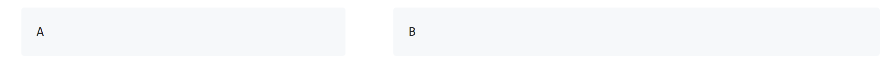

### **put_column 列布局输出内容**

```
原理同上
```

### **put_grid 网格布局输出内容**

```
pywebio.output.put_grid(content, cell_width='auto', cell_height='auto',\
    cell_widths=None, cell_heights=None, direction='row', \
    scope=None, position=- 1)
```

> 参数
>
> - content – 输出内容. `put_xxx()` / None 组成的二维数组, None 表示空白. 数组项可以使用 span() 函数设置元素在网格的跨度.
> - cell_width (str) – 网格元素的宽度.
> - cell_height (str) – 网格元素的高度.
> - cell_widths (str) – 网格每一列的宽度. 宽度值用空格分隔. 不可以和 `cell_width` 参数同时使用.
> - cell_heights (str) – 网格每一行的高度. 高度值用空格分隔. 不可以和 `cell_height` 参数同时使用.
> - direction (str) - 排列方向. 为 'row' 或 'column'
>   - `'row'` 时表示，content中的每一个子数组代表网格的一行;
>   - `'column'` 时表示，content中的每一个子数组代表网格的一列.
> - scope, position (int) – 与 put_text 函数的同名参数含义一致

`cell_width`,`cell_height`,`cell_widths`,`cell_heights` 参数中的宽度/高度值格式参考 `put_row()`函数的 `size` 参数注释.

```
put_grid([
    [put_text('A'), put_text('B'), put_text('C')],
    [None, span(put_text('D'), col=2, row=1)],
    [put_text('E'), put_text('F'), put_text('G')],
], cell_width='100px', cell_height='100px').show()
```

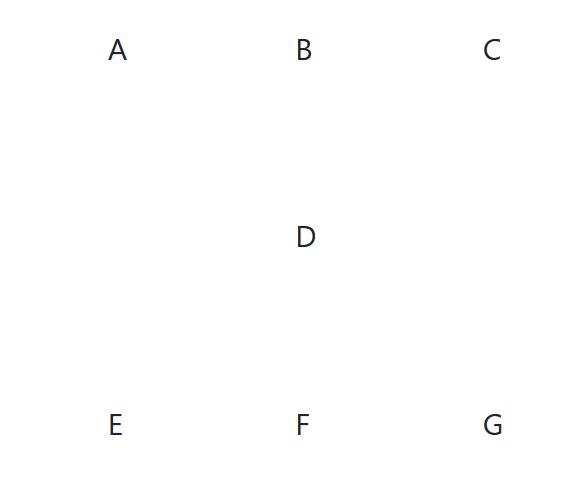

### **style 样式**

```
put_text('hello').style('color: red; font-size: 20px').show()
```


```
# in combined output
put_row([
    put_text('hello').style('color: red'),
    put_markdown('markdown')
]).style('margin-top: 20px').show()
```


举例：

```
from pywebio.output import put_text,put_buttons,popup,put_table,span,put_html,put_markdown,put_file
# 'Name' cell across 2 rows, 'Address' cell across 2 columns
put_table([
    [span('Name',row=2), span('Address', col=2)],
    ['City', 'Country'],
    ['Wang', 'Beijing', 'China'],
    ['Liu', 'New York', 'America'],
])

# Use `put_xxx()` in `put_table()`
put_table([
    ['Type', 'Content'],
    ['html', put_html('X<sup>2</sup>')],
    ['text', '<hr/>'],
    ['buttons', put_buttons(['A', 'B'], onclick=...)],  
    ['markdown', put_markdown('`Awesome PyWebIO!`')],
    ['file', put_file('hello.text', b'hello world')],
    ['table', put_table([['A', 'B'], ['C', 'D']])]
])

# Set table header
put_table([
    ['Wang', 'M', 'China'],
    ['Liu', 'W', 'America'],
], header=['Name', 'Gender', 'Address'])

# When ``tdata`` is list of dict
put_table([
    {"Course":"OS", "Score": "80"},
    {"Course":"DB", "Score": "93"},
], header=["Course", "Score"])  # or header=[(put_markdown("*Course*"), "Course"), (put_markdown("*Score*") ,"Score")]
```

# 四、会话相关

模块：pywebio.session.对应功能

```
# 文本输出
password = output.put_text("Input password")
```

| 函数                         | 简介                                                         | 参数                                                         |
| ---------------------------- | ------------------------------------------------------------ | ------------------------------------------------------------ |
| `download`                   | 向用户推送文件，用户浏览器会将文件下载到本地                 | `pywebio.session.download`(*name*, *content*)                |
| `run_js`                     | 在用户浏览器中运行JavaScript代码,代码运行在浏览器的JS全局作用域中 | `pywebio.session.run_js`(*code_*, ***args*)                  |
| `eval_js`                    | 在用户浏览器中执行JavaScript表达式，并获取表达式的值         | `pywebio.session.eval_js`(*expression_*, ***args*)           |
| `register_thread`            | 注册线程，以便在线程内调用 PyWebIO 交互函数,仅能在默认的基于线程的会话上下文中调用。 | `pywebio.session.register_thread`(*thread: threading.Thread*) |
| `defer_call`                 | 设置会话结束时调用的函数。无论是用户主动关闭会话还是任务结束会话关闭，设置的函数都会被运行,在会话中可以多次调用 [`defer_call()`](https://pywebio.readthedocs.io/zh_CN/latest/session.html#pywebio.session.defer_call) ,会话结束后将会顺序执行设置的函数 | `pywebio.session.defer_call`(*func*)                         |
| `local`                      | 当前会话的数据对象(session-local object),`local` 是一个可以通过属性取值的字典，它的目标是用来存储应用中会话独立的状态。 `local` 中存储的内容不会在会话之间共享，每个会话只能访问到自己存储在其中的数据。 | `pywebio.session.local`                                      |
| `set_env`                    | 当前会话的环境设置                                           | `pywebio.session.set_env`(***env_info*)                      |
| `go_app`                     | 在同一PyWebIO应用的不同服务之间跳转。仅在PyWebIO Server模式下可用 | `pywebio.session.go_app`(*name*, *new_window=True*)          |
| `info`                       | 表示会话信息的对象                                           | `pywebio.session.info`                                       |
| `coroutinebased.TaskHandler` | 协程任务句柄                                                 | *class* `pywebio.session.coroutinebased.TaskHandler`(*close*, *closed*) |
| `run_async`                  | 异步运行协程对象。协程中依然可以调用 PyWebIO 交互函数。      | `pywebio.session.run_async`(*coro_obj*)                      |
| `run_asyncio_coroutine`      | 若会话线程和运行asyncio事件循环的线程不是同一个线程，需要用 [`run_asyncio_coroutine()`](https://pywebio.readthedocs.io/zh_CN/latest/session.html#pywebio.session.run_asyncio_coroutine) 来运行asyncio中的协程。 | `pywebio.session.run_asyncio_coroutine`(*coro_obj*)          |


# 五、应用部署

## 5.1 路径中部署PyWebIO应用

- 服务端使用WebSocket协议与浏览器进行通讯。

`pywebio.platform.path_deploy`(*base*, *port=0*, *host=''*, *index=True*, *static_dir=None*, *reconnect_timeout=0*, *cdn=True*, *debug=False*, *allowed_origins=None*, *check_origin=None*, *max_payload_size='200M'*, ***tornado_app_settings*)

- 服务端使用HTTP协议与浏览器进行通讯。

`pywebio.platform.path_deploy_http`(*base*, *port=0*, *host=''*, *index=True*, *static_dir=None*, *cdn=True*, *debug=False*, *allowed_origins=None*, *check_origin=None*, *session_expire_seconds=None*, *session_cleanup_interval=None*, *max_payload_size='200M'*, ***tornado_app_settings*)

## 5.2 Web服务器部署PyWebIO应用

`pywebio.platform.tornado.start_server`(*applications*, *port=0*, *host=''*, *debug=False*, *cdn=True*, *static_dir=None*, *remote_access=False*, *reconnect_timeout=0*, *allowed_origins=None*, *check_origin=None*, *auto_open_webbrowser=False*, *max_payload_size='200M'*, ***tornado_app_settings*)

## 5.3 启动服务

```
# 通过局域网连接网页
# remote_access,否启用远程访问,reconnect_timeout=1 服务器异常停止可以自动启动,
# auto_open_webbrowser=False   开启服务时，是否自动打开浏览器。默认false
# max_payload_size 设置Web框架允许上传的最大文件大小
web.start_server(bmi, debug=True, port=1122, remote_access=True, auto_open_webbrowser=True, max_payload_size="2G")
```

# 六、持续性输入

模块：pywebio.pin.对应功能

[教程](https://blog.csdn.net/heianduck/article/details/121772638)

## Overview

我们已经知道，PyWebIO中的输入函数是阻塞式的，输入表单会在成功提交后被销毁。在大多数场景下，使用这种方式接收用户输入已经够用了。但在一些场景下，你或许希望输入表单在提交后不消失，并且可以继续接收输入。
 所以，PyWebIO提供了 `pin` 模块来实现持续性输入。
`pin` 模块主要有3部分内容:

- pin 组件(widgets)
- pin_wait_change()
- pin_update()

## Pin widgets

### pin_input

每个pin组件函数都对应一个 `input` 模块中的输入函数。(出于性能原因，没有提供 `file_upload()`函数对应的pin组件)

Pin组件函数支持大多数对应的输入函数的参数。这里列举了两者之间的一些不同：

- Pin组件函数的第一个参数始终是Pin组件的 `name` ，且当输出了同名的pin组件时，旧的pin组件会不可用。
- Pin组件函数不支持 `on_change` 、 `validate` 回调，也不支持 `required` 参数。
- Pin组件函数多了用于输出控制的 `scope` 和 `position` 参数。

组件都有：

> put_input -- 文本输入组件
>  put_textarea -- 文本域输入组件
>  put_select -- 下拉选择输入组件
>  put_checkbox -- 多选框组件
>  put_radio -- 单选按钮组件
>  put_slider -- 滑块输入组件
>  put_actions -- action按钮
>  以上组件参数，可见input相对应的参数。

### 最基本的文本框pin组件

```
#这里要和前面的input区分开来。
put_input('input2', label='This is a input widget').show()
put_select('select', options=['A', 'B', 'C']).show()
```

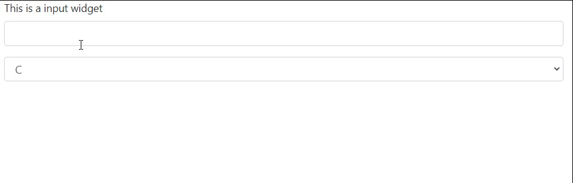

```python
with use_scope('search-area'):
    put_input('search', placeholder='Search')
        
put_row([
    put_input('input'),
    put_select('select', options=['A', 'B', 'C'])
])

with use_scope('search-area'):
    put_input('search_2', placeholder='Search-2')
    put_row([
    put_input('input_2'),
    put_select('select_2', options=['D', 'E', 'F'])
])
```


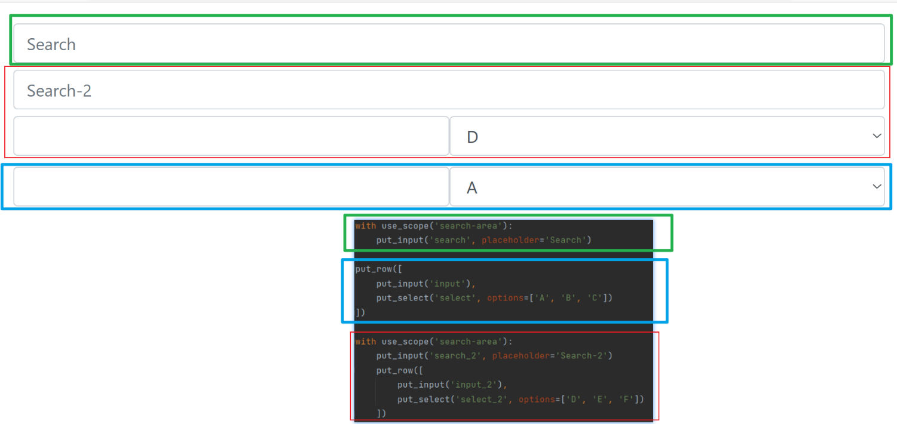

### 获取pin组件的值

```
# 通过使用pin对象来获取pin组件的值
put_input('pin_name')
put_buttons(['Get pin Value'], lambda _: put_text(pin.pin_name))
# pin组件函数的第一个参数为pin组件的name
# pin['pin_name'] == pin.pin_name
# 同时name只能包含字母、数字和下划线，否则:
# AssertionError: pin name' can only contain letters, digits and underscore
```

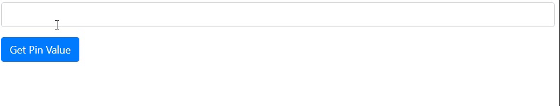

## pin_wait_change 监听pin组件的变化

```
pywebio.pin.pin_wait_change(*names, timeout=None)
```

`pin_wait_change()` 监听一组pin组件，当其中任意一个的值发生变化后，函数返回发生变化的组件的 `name` 和值。

> 参数
>
> - names(str) - pin组件`name`列表
> - timeout(int/None) - 当 `timeout` 为正数时， `pin_wait_change()` 会最多阻塞 `timeout` 秒然后返回 `None` 如果这段时间内监听的pin组件的值没有发生变化的话。 将 `timeout` 设置为 `None` （默认）来关闭超时

{"name": 发生变化的pin组件的name, "value": 发生变化的pin组件的当前值}， 当超时发生后，返回 None

```
put_input('a', type='number', value="0")
put_input('b', type='number', value="0")

while True:
    changed = pin_wait_change('a', 'b')
    with use_scope('res', clear=True):
        put_code(changed)
        put_text("a + b = %s" % (pin.a + pin.b))
```


## pin_update 更新pin组件的输出属性

```
pywebio.pin.pin_update(name, **spec)
```

>  参数
>
> - name(str) - 目标pin组件的`name`
> - spec - 需要被更新的pin组件的参数。注意以下参数无法被更新： `type`, `name`, `code`, `multiple`

```
put_input('c', type='number', value="0", help_text="你动我试试？").show()
put_text(pin.c)
pin_update('c', value=1, help_text="试试就试试！")
put_text(pin.c)
```

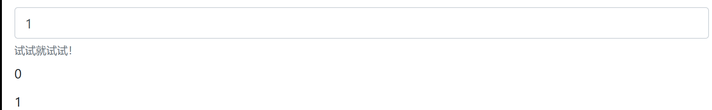


# 案例：

```
from pywebio.input import input, FLOAT
from pywebio.output import put_text

def bmi():
    height = input("请输入你的身高(cm)：", type=FLOAT)
    weight = input("请输入你的体重(kg)：", type=FLOAT)

    BMI = weight / (height / 100) ** 2

    top_status = [(14.9, '极瘦'), (18.4, '偏瘦'),
                  (22.9, '正常'), (27.5, '过重'),
                  (40.0, '肥胖'), (float('inf'), '非常肥胖')]

    for top, status in top_status:
        if BMI <= top:
            put_text('你的 BMI 值: %.1f，身体状态：%s' % (BMI, status))
            break

if __name__ == '__main__':
    bmi()
```

```
import pywebio
from pywebio.input import *
from pywebio.output import *
from pywebio import start_server
import pywebio.pin as pin
from pywebio.session import hold
import pandas as pd
from functools import partial


def read_file(filename):

    if filename.endswith('xlsx'):
        df = pd.read_excel(filename)

    elif filename.endswith('csv'):
        df = pd.read_csv(filename)
    return df


def chongfu(df, res_table):
    df1 = df[df.国家奥委会.duplicated() == True]

    put_scrollable(res_table,horizon_scroll=True)
    res_table.reset(put_html(df1.to_html(border=0)))

def chongfuchuli(df, res_table):

    df1 = df.drop_duplicates()

    put_scrollable(res_table,horizon_scroll=True,height=450)
    res_table.reset(put_html(df1.to_html(border=0)))

def chaxun(res_table,df, key):


    res_table.reset()
    put_scrollable(res_table,horizon_scroll=True,height=450)

    df1 = df[df['国家奥委会'] == key]
    res_table.reset(put_html(df1.to_html(border=0)))

def other():
    popup('功能未开发', [

        put_html(f'啊哦，这个按钮的功能还没有开发，你可以仿照上面代码补充该功能'),
        put_text('\n'),
        put_buttons(['关闭'], onclick=lambda _: close_popup())
    ])


def dataquery():
    '''
    数据查询系统 - 早起Python    '''

    put_markdown('# xx数据查询系统 - 早起Python')
    file = file_upload('请选择需要加载的数据')
    df = read_file(file['filename'])


    put_markdown('## 数据处理')
    put_markdown('下面是一些常见的数据处理操作，点击对应按钮实现不同操作')

    res_table = output()

    put_buttons(['检查重复值','删除重复值','检查缺失值','删除缺失值','检查异常值','删除异常值'], onclick=[
        lambda: chongfu(df,res_table),
        lambda: chongfuchuli(df,res_table),
        lambda: other(),
        lambda: other(),
        lambda: other(),
        lambda: other()])

    put_markdown('## 数据查询')
    pin.put_input('res', label='请在下方输入框要查询的关键字', type=TEXT)
    put_buttons(['提交查询'], lambda _: chaxun(res_table,df,pin.pin['res']))
    put_scrollable(res_table, horizon_scroll=True,height=450)
    res_table.reset(put_html(df.to_html(border=0)))


if __name__ == '__main__':

    start_server(dataquery, port=9999,auto_open_webbrowser=True)
```

