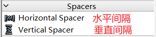
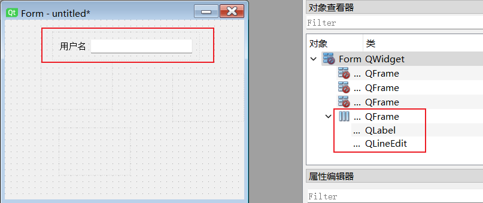

# Qt中文文档

[Qt 5.15.1 - 中文文档编制,帮助,手册,教程 (digitser.top)](http://qt5.digitser.top/5.15/zh-CN/index.html)

[Qt 6.2 | Qt6 中文参考手册 (cutebook.net)](http://qtdoc.cutebook.net/qtdoc/index.html)

[Qt 编程指南](https://qtguide.ustclug.org/)

#  一、PySide2模块安装

```cmd
pip install Pyside2
```

# 二、配置Pycharm外部工具

Qt Designer:可视化编辑UI界面，生成.ui文件。
PySide-uic: 将.ui文件转换为.py文件，以便修改和导入。
PySide-rcc: 将.qrc文件（资源文件）转换为.py文件。
PySide-lupdate:用于从ui文件和Python源码中提取需要翻译的字符串
linguist:用于多语言翻译，输入文件为PySide-lupdate生成的`*.ts`文件，并可以发布为`*.qm`文件

工具配置建议：

```python
Qt Designer:
    名称：任意即可（建议QtDesigner）
    程序：程序所在的路径
    参数：$FileNameWithoutExtension$.ui(可选参数)
    工作目录：$ProjectFileDir$

pyside2-rcc:
    名称：任意即可（建议qrc2py,这样一目了然）
    程序：程序所在目录
    参数：$FileName$ -o $FileNameWithoutExtension$_rc.py
    工作目录：$FileDir$

pyside2-uic:
    名称：任意即可（建议ui2py,理由同上）
    程序：程序所在目录
    参数：-o $FileNameWithoutExtension$_ui.py $FileName$
    工作目录：$FileDir$
    
PySide-lupdate: 
    名称：任意即可
    程序：程序所在目录
    参数：-verbose $FileNameWithoutExtension$.pro
    工作目录:$FileDir$

linguist:   
    名称：任意即可
    程序：程序所在目录
    参数：$FileNameWithoutExtension$.ts
    工作目录:$FileDir$
```

## 工具配置：


# 三、快速入门

来源：https://www.zhihu.com/people/si-tu-32-83/posts

## 快速入门一：

==主要是简单地介绍一下PySide，并使用designer制作了一个演示用的小demo程序==

​		PySide（在本文中代指PySide2和PySide6）是一个Python的图形化界面（GUI）库，由C++版的Qt开发而来，在用法上基本与C++版没有特别大的差异。相对于其他Python  GUI库来说，PySide开发较快，功能更完善，而且文档支持更好。我这里就给大家简单写一个极简的快速入门教程，旨在帮助大家快速上手并使用这个库。

​		首先说一下PySide和PyQt（在本文中代指PyQt5和PyQt6）的关系，前者是Qt公司的产品，后者是第三方公司的产品，二者用法基本相同，不过在使用协议上却有很大差别，PySide可以在LGPL协议下使用，PyQt则在GPL协议下使用，这两个协议的区别，大家可以自行搜索，为了避免潜在的问题，我这里推荐使用PySide。

​		现在说一下PySide2和PySide6的区别，也就是PyQt5和PyQt6的区别。PySide2和PyQt5由C++版的Qt5开发而来.，而PySide6和PyQt6对应的则是C++版的Qt6。从PySide6开始，PySide的命名也会与Qt的大版本号保持一致，不会再出现类似PySide2对应Qt5这种容易混淆的情况。

​		在使用层面上，PySide2/PyQt5和PySide6/PyQt6并无过多的差异，只有一点需要注意，使用PySide6/PyQt6开发的程序在默认情况下，不兼容Windows7系统，这也是Qt6所决定的。在下面和之后的文章中，我会尽量兼容PySide2和PySide6这两个版本，如果有存在差异的地方，我会两个版本分别解释。

​		那么开始进入正题，先介绍一下使用PySide开发GUI的基本知识（PyQt同理，下面就不再提它了）。

​		PySide为我们提供了两种开发界面的方式，一种叫QtWidget，是在网上搜到的教程中最常见的方式；另一种叫QML，是一种新型的开发方式，也是Qt正在努力推广的开发方式。在本系列的文章中，我们主要使用QtWidget这种方式，而使用QtWidget开发程序时，也有两种基本的使用方法，一种是通过designer开发界面，另一种是用过代码手动开发界面，这里我们的目的是极简快速入门，所以使用designer这种方便的方式进行开发。

### designer介绍

designer界面如下：


#### 组件选择区：

用来选择组件，鼠标选择组件后就可以拖拽到窗口界面上，在本教程中会使用到一部分这里的组件。

##### 布局组件


表格布局，仅有2列，简单版的网格布局。

##### 间隔组件



##### 按钮组件


逐个解释一下各个用途：

###### （1）按压按钮 QPushButton

​    最基本的按钮，点击该按钮通常是通知程序进行一个操作，比如弹个窗、下一步、保存、退出等等，这是经常用到的，操作系统里的对话框里几乎全部都有这种按压按钮。


关于“**将当前状态传递给外界**”这句作用难以理解，其实就是：控件中的clicked（）信号和clicked（bool）信号是两个不同的信号

> ### 1、clicked()

映射槽函数时，clicked（）信号映射到的槽函数是不带参的

比如槽函数可以写作def ClickedAction(self)，与按钮动作连接的语句为self.btn.clicked.connect(self.ClickedAction)；

> ### 2、clicked(bool)

clicked（bool）信号映射到的槽函数可以是带参数的

比如槽函数可以写作def  ClickedAction(self，status)，其中参数status就是按钮当前的状态(Tru or  False)，而与按钮动作连接的语句self.btn.clicked[bool].connect(self.ClickedAction)，无需使用lambda传入status。
 很显然，**clicked（bool）只是当按钮的setCheckable()设置为True时才有可能使得status为True**（即设置后按钮想点灯开关一样，能够按一下保持一直开，再按下保持一直关），否则开关点击一下后仍为关闭状态，status一直为False。

```python
self.ui.pushButtonBold.setCheckable(True)
self.ui.pushButtonBold.clicked.connect(self.on_pushButtonBold_clicked)
def on_pushButtonBold_clicked(self,status):
    print(status)  # True False
```

**设置按钮状态**

```
setEnabled(True)
```

###### （2）工具按钮 QToolButton

工具按钮通常都不是一个，是一排放置在工具栏 QToolBar 里面，作为快捷按钮来用，比如 Qt 设计师的工具栏：


###### （3）单选按钮 QRadioButton

​    单选按钮通常是多个放在一块，表示互斥的一组选项，只能选择其中一个来填写，比如一个人性别有男、女，只能选择一个，而不能同时是男的又是女的。

​		头两排单选按钮父窗口都是主窗体，默认情况下是互斥的，所以只能选中一个。而分组框里的单选按钮，它们的父窗口是分组框控件，所以与上面两排的不冲突。头两排解决办法：增加Frame控件。


效果图：


单选按钮值获取：radioButton.isChecked()函数

```python
if self.radioButton.isChecked():
    strResult += "性别：男\r\n"
elif self.radioButton_2.isChecked():
    strResult += "性别：女\r\n"
else:
    strResult += "性别：未选中\r\n"
```

###### （4）复选框 QCheckBox

​    与单选按钮不同，复选框通常表示多个可以同时存在的选项，比如一个人可以同时多个爱好，比如读书、看电影、爬山、游泳等

​	复选框还有一种特殊用途，叫三态复选框，比如 WORD 办公软件，一段文字既可以是加粗、部分加粗、都不加粗三种状态，三态复选  框就是用来干这类事情的。将传统两种状态复选框变成三态复选框的函数是：tristate


| **枚举常量**             | **数值** | **描述**       |
| ------------------------ | -------- | -------------- |
| **Qt::Unchecked**        | 0        | 条目未选中     |
| **Qt::PartiallyChecked** | 1        | 条目有部分选中 |
| **Qt::Checked**          | 2        | 条目全选中     |

- 复选框按钮状态获取：checkBox.isChecked()函数

- 三态复选框状态获取：

  - `checkBox.isChecked()`选中与部分选中全部返回True

  - santaicheckBox.checkState() 返回以下三种状态：

    - PySide2.QtCore.Qt.CheckState.PartiallyChecked ：QtCore.Qt.PartiallyChecked

    - PySide2.QtCore.Qt.CheckState.Checked ：QtCore.Qt.Checked

    - PySide2.QtCore.Qt.CheckState.Unchecked ：QtCore.Qt.Unchecked

      ```python
      checkBox.checkState() == QtCore.Qt.Unchecked
      ```


- 设置三态复选框状态：

  ```
  checkBox_7.setCheckState(QtCore.Qt.PartiallyChecked)
  ```


###### （5）命令链接按钮 QCommandLinkButton

这是 Qt 仿造 Vista 里的命令链接按钮引入的扁平风格按钮，点击这个按钮一般意味着打开新的功能窗口或网站链接等

信号：

```python
self.ui.commandLinkButton.clicked.connect(self.checkcommandLinkButton)
self.ui.commandLinkButton_2.clicked.connect(self.checkcommandLinkButton2)
```

槽函数：

```python
# 打开文件夹
def checkcommandLinkButton(self):
    QtGui.QDesktopServices.openUrl(QtCore.QUrl("file:///D:/桌面"))
# 访问网页
def checkcommandLinkButton2(self):
    QtGui.QDesktopServices.openUrl(QtCore.QUrl("http://www.baidu.com"))
```


###### （6）标准按钮盒 QDialogButtonBox

标准按钮盒通常用于对话框程序，举例来说，我们常见的保存询问对话框里面有“保存”、“丢弃”、“取消”三个标准按钮，确认对话框有 “OK”“Cancel”等标准按钮，Qt 将这些典型的按钮做成标准按钮盒，并将相应的信号加以封装，方便程序员使用


##### 视图组件


##### 部件组件


##### 容器组件


##### 输入小部件


常用的 Qt 文本编辑控件：

- QLineEdit 只接受单行普通文本输入，针对最普通的 C++ 字符串编辑和显示，默认都是白底黑字，没有彩色字体。

- QPlainTextEdit 可以接收多行普通文本输入,针对最普通的 C++ 字符串编辑和显示，默认都是白底黑字，没有彩色字体。

- QTextEdit 是升级版的编辑控件，支持 HTML 网页的丰富文本编辑，当然也可以利用它编辑普通文本。

###### QLineEdit

单行编辑控件

​		接收一行文本输入，编辑器一般都有对文本的复制、粘贴、剪切、撤销、重做等功能，单行编辑控件原生自带这些功能，右击单行编辑控件或者使用 Ctrl+C、Ctrl+V、Ctrl+X 等快捷键都可以使用这些默认功能。

​		单行编辑控件最重要的属性就是 text，获取或者修改文本是单行编辑控件最重要的功能。

获取文本的函数：text()函数获取全部的文本，也可以选取用户高亮选中的部分文本，通过函数：selectedText()

设置文本的函数：setText()

清除所有文本的函数： clear()

默认情况下，单行编辑控件的文本长度限制为 32767，获取单行编辑控件的文本长度限定的函数为：maxLength()

修改文本长度限定，可以通过函数：setMaxLength(int)

> 用户从图形界面编辑文本，还是程序内部用代码修改文本，都会触发如下信号textChanged()
>
> 如果希望追踪文本的所有变化，需要关联 textChanged() 信号，如果只希望跟踪用户在图形界面的编辑更改，那就关联 textEdited() 信号。

设置属性 echoMode 来显示星号密码, 主要有==四种显示模式==：
①Normal，普通模式，用户输入什么显示什么，这是默认的显示模式。
② NoEcho，不显示任何东西，这是 Unix/Linux 常用的密码显示模式，用户敲密码时不显示任何文本，这样能隐藏密码的长 度，不被人从屏幕偷窥。
③ Password，每一个密码字符都用星号显示，这是 Windows 常用的密码显示模式。
④ PasswordEchoOnEdit，当输入一个密码字符时，短暂显示该字符，然后迅速将该字符显示为星号，方便提示用户当前输入了什么字符，类 似 Android 解锁密码的输入方式。


信号函数：

**表一 信号汇总表**

| 序号 | 信号                  | 说明                                                         |
| ---- | --------------------- | ------------------------------------------------------------ |
| 1    | textChanged           | 当修改文本内容时，这个信号会被发射                           |
| 2    | textEdited            | 当文本被编辑时，就会发射这个信号                             |
| 3    | returnPressed         | 光标在行编辑框内时，点击**回车键**即发射信号                 |
| 4    | selectionChanged      | 当选择的文本内容改变了，这个信号就会被发射                   |
| 5    | editingFinished       | 当按返回或者**回车键**时，或者行编辑失去焦点时，这个信号会被发射 |
| 6    | cursorPositionChanged | 当焦点，即**光标**位置改变就发射信号                         |
| 7    | inputRejected         | 当用户输入不合法字符时，将发出此信号。前提要 setValidator() 等设置合法字符范围，**Qt 5.12 版本新增**。 |

==案例：登录界面==

例子效果就是点击“登录”按钮时，获取用户名，计算密码的 Hash 值并弹窗显示出来。点击“退出”按钮时，窗口自动关闭。

==returnPressed信号==:当用户在文本框中任何时候按下回车键，就会发出 returnPressed信号。

有时我们需要处理这种情况，比如登录界面，用户输完密码直接按回车健就进行登录处理，可以指定处理returnPressed信号，如下所示：

```python
# 处理回车
self.ui.lineEditUser.returnPressed.connect(self.login)
self.ui.lineEditPassword.returnPressed.connect(self.login)
```

密码哈希值：

```python
QtCore.QCryptographicHash.hash(self.lineEditPassword.text().strip().encode("utf-8"),
                                                QtCore.QCryptographicHash.Sha3_256)
# 把每个Hash字节转成一对十六进制字符显示,256bit对应32字节，变成64个十六进制字符
strMsg += str(QtCore.QByteArray.toHex(m_passwordHash))
```

```python
import sys
# 因为我们创建的界面是MainWindow，所以这里要继承QMainWindow
from PySide2.QtWidgets import QApplication, QWidget, QMessageBox
from PySide2 import QtCore, QtUiTools, QtGui

class MainWindow(QWidget):
    def __init__(self, parent=None):
        super(MainWindow, self).__init__(parent)
        # 导入我们生成的界面【动态加载ui文件,QMainWind会出现异常，需要重写UiLoader】
        self.ui = UiLoader().load("登录框示例-单行文本编辑.ui", self)
        # 处理回车
        self.ui.lineEditUser.returnPressed.connect(self.login)
        self.ui.lineEditPassword.returnPressed.connect(self.login)

        self.ui.pushButtonLogin.clicked.connect(self.login)
        self.ui.pushButtonExit.clicked.connect(self.exit)

    def login(self):
        if not (self.lineEditUser.text() and self.lineEditPassword.text()):
            QMessageBox.warning(self, "警告信息", "用户名或密码为空，不能登录", QMessageBox.Yes | QMessageBox.No)
            return
        # 用户名字符串
        m_strUser = self.lineEditUser.text().strip()
        # 不能明文保存密码，存储密码hash值
        m_passwordHash = QtCore.QCryptographicHash.hash(
            self.lineEditPassword.text().strip().encode("utf-8"),QtCore.QCryptographicHash.Sha3_256)

        # 构造消息
        # 添加用户名
        strMsg = "用户名：" + m_strUser + "\r\n" + "密码 Hash："
        # 把每个Hash字节转成一对十六进制字符显示,256bit对应32字节，变成64个十六进制字符
        strMsg += str(QtCore.QByteArray.toHex(m_passwordHash))
        # 弹窗显示，注意：实际应用中会将用户名和密码Hash与数据库或配置文件里的做比较，而不是弹窗
        QMessageBox.information(self, "用户信息", strMsg)

    def exit(self):
        # 界面关闭
        self.ui.close()
        # 界面隐藏
        # self.ui.hide()


if __name__ == "__main__":
    app = QApplication(sys.argv)
    window = MainWindow()
    window.show()
    # 结束QApplication
    sys.exit(app.exec_())
    # 注意，在PySide6中，需要使用app.exec()
    # sys.exit(app.exec())
```

==数据验证器和伙伴快捷键==

1. 数据验证器

   ​		在用户输入时，可能用到一个功能就是数据验证，限制用户输入非法的取值。比如限定 IPv4 的取值为 0.0.0.0 到 255.255.255.255 ，端口取值范围 0 到 65535，而网卡 MAC 地址限定为 48 bit 数值对应的十六进制字符串，比如 AA:BB:CC:DD:EE:FF 。
   Qt 针对单行编辑控件，提供三种方式来使用数据验证器：

   （1）单行编辑控件自带的输入模板 inputMask：
   通过函数设置输入模板，这个输入模板字符串是 QLineEdit 自定义的，应用范围比较局限，功能也相对简单，设置函数为：

   

   

   具体的 inputMask 字符串格式可以查询 QLineEdit 的文档，我们举 MAC 地址的例子，"H" 表示所有的十六进制字符，包括大小写的十六进制字符，而且 "H" 占位的字符不能省略。小写的 "h" 也代表所有十六进制字符，但 "h" 占位是可以省略的字符.
   对于 MAC 地址，输入模板为 "HH:HH:HH:HH:HH:HH" 。

   （2）整型数值和浮点数值验证器

   目前存在BUG，[参见](##3、QIntValidator设置范围无效 "BUG描述")

   ```python
   # 新建整数验证器
   intVali = QtGui.QIntValidator()
   intVali.setRange(0, 65535)
   # 设置给lineEditPort
   self.ui.lineEditPort.setValidator(intVali)
   ```

   （3）正则表达式验证器

   正则表达式是最为强大的数据验证和数据筛选武器，正则表达式作为大杀器，几乎无所不能。Qt 提供 QRegExp 类支持正则表达式，正则表达式的验证器类为 QRegExpValidator。一般是先通过字符串构建一个正则表达式：

   QRegExp(const QString & pattern, Qt::CaseSensitivity cs = Qt::CaseSensitive, PatternSyntax syntax = RegExp)

   ```python
   # 定义IPv4正则表达式，注意"\\"就是一个反斜杠字符
   re = QtCore.QRegExp("^(?:(?:25[0-5]|2[0-4][0-9]|[01]?[0-9][0-9]?)\\.){3}"
   "(?:25[0-5]|2[0-4][0-9]|[01]?[0-9][0-9]?)$")
   ```

   pattern 是正则表达式字符串，cs 指是否大小写敏感，默认是敏感的，syntax 是语法格式，用默认的 RegExp，这是类似 Perl 语言风格的正则表达式。一般可以搜索 IPv4 格式的 Perl 或其他语言的正则表达式，拿过来用即可。
   然后根据 QRegExp 构建一个正则表达式验证器：

   QRegExpValidator(const QRegExp & rx, QObject * parent = 0)

   ```python
   # 新建正则表达式验证器
   reVali = QtGui.QRegExpValidator(re)
   ```

   最后将 QRegExpValidator 对象通过函数 QLineEdit::setValidator() 函数设置给单行编辑控件就行了

   ```python
   # 设置给lineEditIP
   self.ui.lineEditIP.setValidator(reVali)
   ```

2. 伙伴快捷键

   标签控件里的 "&" 用于设置伙伴快捷键，因为单行编辑控件没法显示自己的快捷键，所以需要通过伙伴标签控件来设置快捷键。"&MAC" 意味着伙伴快捷键为 Alt+M ，"&IP" 快捷键就是 Alt+I ，"&Port" 快捷键是 Alt+P 。当然，快捷键能实现的前提是设置伙伴，我们点击设计模式上面的带有橙色小块的图标，进入伙伴编辑模式：

   

   在伙伴编辑模式，编辑伙伴关系类似在画图板画线的操作，从标签控件画线到右边的单行编辑控件即可。将三行的标签都设置为对应的单行编辑控件伙伴。设置为伙伴之后， 标签控件就不再显示 "&" ，而是将 "&" 右边第一个字母添加下划线显示，这样伙伴快捷键就设置成功了。

   程序运行时，伙伴快捷键自动生效：
   按 Alt+M ，自动切换到 MAC 地址编辑控件；
   按 Alt+I ，自动切换到 IP 地址编辑控件；
   按 Alt+P ，自动切换到端口编辑控件。
   示范的例子标签文本都是英文的，如果是中文文本，以端口为例，可以设置为 "端口(&P)" ，这样快捷键也是 Alt+P。

3. 单词补全

   在进行文本编辑时，编辑器常用的一个功能就是单词补全，比如 Linux 系统命令行里面输入命令或文件名头几个字符，然后按 Tab 键就会实现命令或文件名的补 全。单行编辑控件也有类似功能，通过设置单词补全器 QCompleter 实现。

   单词补全：

   ```python
   # 星期单词列表
   listDayOfWeek = ["Monday", "Tuesday", "Wednesday", "Thursday",
                    "Friday", "Saturday", "Sunday"]
   
   # 构建补全器
   cpDayOfWeek = QtWidgets.QCompleter(listDayOfWeek)
   # # 大小写不敏感
   cpDayOfWeek.setCaseSensitivity(QtCore.Qt.CaseInsensitive)
   # 设置给lineEditDayOfWeek
   self.ui.lineEditDayOfWeek.setCompleter(cpDayOfWeek)
   ```

   时间补全：

   ```python
   # 年份列表
   listYear = ["2016", "2015", "2008", "2006", "1999", "1991"]
   # 重新排序，默认是大小写敏感排序，对数字字符没影响
   listYear.sort()
   # 构建补全器
   cpYear = QtWidgets.QCompleter(listYear)
   # 设置给 lineEditYear
   self.ui.lineEditYear.setCompleter(cpYear)
   ```

   中文补全：

   ```python
   # 何夕名字列表
   listHeXi = ["何百夕", "何千夕", "何万夕", "何亿夕"]
   # 中文没有大小写敏感，也不要排序
   # 构建补全器
   cpHexi = QtWidgets.QCompleter(listHeXi)
   # 设置给lineEditHeXi
   self.ui.lineEditHeXi.setCompleter(cpHexi)
   ```

###### TextEdit

丰富文本编辑控件

对于多行普通文本编辑，Qt 提供 QPlainTextEdit 类，对于更为复杂的丰富文本编辑，Qt 提供了 QTextEdit 类，QTextEdit 有一个便于浏览丰富文本的派生类 QTextBrowser，相当于是 QTextEdit 只读版本，并另外做了一些打开网页链接的扩展功能。QPlainTextEdit 与 QTextEdit 采用的技术是差不多的，只是对普通文本编辑做了优化。本节重点介绍丰富文本编辑控件 QTextEdit ，学习编写一个简易的文本编辑器，然后介绍QTextBrowser 控件的扩展功能，根据 QTextBrowser 做一个简易的 HTML 查看器。

QTextEdit 是一个高级的所见即所得（WYSIWYG）浏览器/编辑器，支持丰富文本格式，类似 HTML 风格的标记。它被优化用于编辑大型文档和快速相应用户的输入。

QTextEdit 基于段落和字符工作，段落是格式化的字符串，一般以换行符作为段落分隔标志，比如 C++ 字符串的 "\r\n" ，HTML 语言的 "`<br>`" 。QTextEdit 显示段落内部的文本时，会自动根据控件宽度，将段落内的长文本根据单词间隔进行自动换行（word-wrapped），类似 Windows 记事本里的自动换行功 能。

QTextEdit 内部使用 QTextDocument 类管理文档，一篇文档可以有 0 个或多个段落组成，文本的对齐模式由其所属的段落对齐模式确定。对于段落内的文本字符，又可以有自己的字符格式，比如加粗、倾斜、字体、文字颜色、文字背景色等等。段落仅 仅是对文档组成部分的分隔和形容，并没有对应的 Qt 类。实际上编辑器内使用文本光标表示当前编辑位置，通常根据光标指示位置来编辑文本，文本光标是有具体的类，即 QTextCursor。

需要注意的是，QTextEdit 不仅仅是一个编辑控件，更大程度上它是一个比较完备而又复杂的视图 + 文档体系，如下图所示：


基于 QTextEdit 可以开发出一个功能完备的丰富文本编辑程序，上图就是Qt 库自带编辑器主窗口程序例子


QTextEdit 可以显示图片、列表和表格，如果文档太大，QTextEdit 自带滚动条，可以显示很多页的文档。QTextEdit 既可以编辑普通文本（plain text），也可以编辑丰富文本（rich text）。QTextEdit 支持的丰富文本格式是 HTML 4 标记语言的一个子集，在 Qt 助手里索引 Supported HTML Subset，可以查看具体支持哪些标记。

因为 QTextEdit 和 QTextBrowser 都是仅支持 HTML 4 标记语言的子集，对于网页显示功能是不完备的，如果需要真正的网页浏览器功 能，那么建议使用更为强大的 Qt WebKit，在 Qt 助手索引里输入 Qt WebKit Widgets ，可以查看相应的文档。

QTextEdit 同时具有两大功能，既可以作为显示控件使用，也可以作为丰富文本编辑器使用。QTextEdit 这两种用途是同时具备的，不需要什么设置，下面介绍仅仅是从函数功能分类来讲，在作为显示用途时，编辑器方面的函数管用，作为编辑器用途时，显示用的函数也是管用 的。
作为显示控件时，可以使用三个函数设置需要显示的文本：

setHtml()

setHtml() 函数用于设置显示丰富的 HTML 网页文本

setPlainText()

setPlainText() 函数用于设置显示普通的无格式文本。

setText()

setText() 函数是通用的槽函数，它自动根据 text 内容猜测文本是不是 HTML 标记语言的，如果是 HTML 文本就显示丰富文本，如果不是那就当作普通无格式的文本显示。

段落内的文本默认是根据控件宽度自动换行的，这样就不会用到水平的滚动条。对于长文本，如果不希望自动换行，那么可用 setLineWrapMode() 函数改变自动换行的特性，枚举常量 QTextEdit::NoWrap 就是不自动换行。如果是不自动换行，那么长的文本会导致水平滚动条显现，可以通过拖动水平滚动条查看长文本。另外，QTextEdit 自带查找函数 find() ，可以查找并高亮显示相应的文本。

QTextEdit 作为编辑器使用时，常规的复制、粘贴、剪切、撤销、重做等功能毫无疑问都是默认支持的，不要编写额外代码，QTextEdit 自己就有这些完备的功能，右击它就能看到对应的编辑菜单。对于光标指示的当前文本字符，可以通过函数设置丰富的文本格式，下面列一个简表：

| **槽函数**                         | 描述                                            |
| ---------------------------------- | ----------------------------------------------- |
| **setFontItalic(bool)**            | 设置斜体字。                                    |
| **setFontWeight(int)**             | 设置粗体字。                                    |
| **setFontUnderline(bool)**         | 设置文字下划线。                                |
| **setFontFamily(QString)**         | 设置字体家族，如 "宋体"、"黑体"、"文泉驿黑体"。 |
| **setFontPointSize(qreal)**        | 设置字号大小，如 9，12，16，48 等 。            |
| **setTextColor(QColor)**           | 设置文字颜色。                                  |
| **setTextBackgroundColor(QColor)** | 设置文字背景色 。                               |
| **setCurrentFont(QFont)**          | 设置综合字体格式，QFont 类封装了上面所有格式。  |

需要注意的是 setFontFamily(QString) 设置的才是如 "宋体"、"黑体"、"文泉驿黑体" 等字体家族，而 setCurrentFont(QFont) 是设置所有的综合字体，QFont 涵盖文字字符的所有格式，之前的斜体、粗体、字体家族、字体颜色等等，全包含在 QFont 内部。如果只希望设置某一方面的字体特性，可以用前面散装的快捷函数如 setFontItalic(bool)、setFontWeight(bool) 等，如果希望设置文本所有的综合字体格式，那么用最后的 setCurrentFont(QFont)。

上面设置字体格式的函数全是槽函数，因此可以直接与其他控件的状态信号关联，比如列举字体家族的控件 QFontComboBox 的信号

void QFontComboBox::currentIndexChanged(const QString & text)

可以直接关联到 setFontFamily(QString) 槽函数。

除了文本字符本身的格式，段落对齐是采用另外的槽函数：

void QTextEdit::setAlignment(Qt::Alignment a)
上面的字体设置函数影响的就是文本光标指示的单词或高亮选中的文本。光标和高亮选中的文本通过 QTextCursor 类管理，针对选中的文本，可以获取该文本片段的字体格式，也可以进行复制、粘贴、剪切、删除等操作。获取当前的光标对象使用函数：

QTextCursor QTextEdit::textCursor() const

因为文档里不同文字有各种各样的格式，当光标指向某个单词或选中文本片段时，会触发当前字符格式变化的信号：

void QTextEdit::currentCharFormatChanged(const QTextCharFormat & f)

QTextCharFormat 与 QFont 不是继承关系，QTextCharFormat 内部包含有 QFont 成员变量，QTextCharFormat 与 QFont 有类似的各种字体格式函数，但 QTextCharFormat 更为强大，包含的更多的细节设置，比如文字在垂直方向的对齐。从 currentCharFormatChanged() 信号的参数里，可以提取当前选中的文本片段的各种字体格式，从而实时感知文档内部不同文本片段的丰富格式。与这个信号对应的设置函数是：

void QTextEdit::setCurrentCharFormat(const QTextCharFormat & format)

但是 setCurrentCharFormat 不是槽函数，仅仅是公有成员函数。设置字体格式一般用之前列表里的多个快捷函数来设置。用户编辑文本时，新增加的文本也是根据 currentCharFormat 自动设置的。

当 QTextEdit 内文本内容发生变化时，不论是用户手动增删还是快捷函数改变字体，都会触发文本变化信号：

void QTextEdit::textChanged()

这个信号没有带文本参数，需要用其他公有函数获取文本，获取完整的丰富文本的函数为：

QString QTextEdit::toHtml() const

获取无格式的普通文本的函数为：

QString QTextEdit::toPlainText() const

接下来示范一个简化版的文本编辑器例子，可能丑陋了点，主要学习一下感知文本格式的变化和通过按钮修改选中文本的格式。

5.3.2 简易文本编辑器示例
单选按钮和复选框有选中状态和非选中状态等，普通的按压按钮也是可以有两种状态 的，通过基类 QAbstractButton 函数可以设置按压按钮的两种状态（Qt 设计师界面选中按钮，在右下角属性编辑器选中 checkable 属性也可以）：

setCheckable(bool)


二态按钮程序设置

```python
self.ui.pushButtonBold.setCheckable(True)
```

二态按压按钮按下去之后不会自动弹起，按下去的状态就是 true，处于弹起状态就是 false。
二态按压按钮的当前状态也可以通过 isChecked() 函数获取，或者在关联信号时，选择如下两个信号之一：

void QAbstractButton::clicked(bool)

void QAbstractButton::toggled(bool)

信号 clicked(bool) 只在图形界面用户点击按钮时才触发，如果通过程序代码调用函数 setDown()、setChecked()、toggle() 改变按钮状态，不会触发 clicked(bool) 信号。
而第二个信号 toggled(bool) 无论是用户点击改变，还是程序调用函数来改变，都会触发 toggled(bool) 信号。

对于文本字体格式的粗体、斜体、下划线等，也是 bool 类型的两种状态，例子中就用二态按压按钮来表示。文本格式的按钮有两种用途，一是根据文档内光标移动，智能感知不同文本片段的格式变化，即接收 QTextEdit::currentCharFormatChanged(QTextCharFormat) 信号；二是选中一段文本，点击格式按钮会修改选中文本的格式，即接收 QAbstractButton::clicked(bool) 信号。介绍完基本的知识，下面开始这个简易编辑器例子学习。

==界面的用途==，第一行的 5 个按钮加上第二行的 单行编辑控件、字体枚举组合框，共 7 个，对应上面小节表格中前 7 个快捷函数，表格中最后一个综合 字体函数例子没用上。
"粗体"、"斜体"、"下划线" 3 个用于二态按钮显示，等会会在代码里面设置为二态按钮。
"前景色" 和 "背景色" 按钮会弹出颜色选取对话框，用户选择颜色后，会影响丰富文本编辑控件里选中的文本片段颜色。
字号编辑控件和字体家族枚举组合框也是类似的，影响丰富文本编辑控件里选中的字体大小和家族。


```python
import sys
# 因为我们创建的界面是MainWindow，所以这里要继承QMainWindow
from PySide2.QtWidgets import QApplication, QWidget
from PySide2 import QtCore, QtUiTools, QtGui, QtWidgets
from test_Pyside2.特重要_动态加载UI import UiLoader


class MainWindow(QWidget):
    def __init__(self, parent=None):
        # super() 是用来解决多重继承问题的，直接用类名调用父类方法在使用单继承的时候没问题，
        # 但是如果使用多继承，会涉及到查找顺序（MRO）、重复调用（钻石继承）等种种问题。
        super(MainWindow, self).__init__(parent)
        # 导入我们生成的界面
        self.ui = UiLoader().loadUi("简易编辑器.ui", self)

        # 粗体
        self.ui.pushButtonBold.setCheckable(True)
        self.ui.pushButtonBold.clicked.connect(self.on_pushButtonBold_clicked)
        # 斜体
        self.ui.pushButtonItalic.setCheckable(True)
        self.ui.pushButtonItalic.clicked.connect(self.on_pushButtonItalic_clicked)
        # 下划线
        self.ui.pushButtonUnderline.setCheckable(True)
        self.ui.pushButtonUnderline.clicked.connect(self.on_pushButtonUnderline_clicked)
        # 前景色
        self.ui.pushButtonColor.clicked.connect(self.on_pushButtonColor_clicked)
        # 背景色
        self.ui.pushButtonBGColor.clicked.connect(self.on_pushButtonBGColor_clicked)
        # 字号
        # 字号原本是浮点数，这里简化为整数
        # 字体点阵大小，这里设置下限0，上限72
        # 0不是没有字号，是不确定字号多大
        vali = QtGui.QIntValidator(0, 72)
        self.ui.lineEditFontSize.setValidator(vali)
        # 默认显示字号9
        self.ui.lineEditFontSize.setText(str(9))

        # editingFinished() 信号会在单行编辑控件失去输入焦点，或者用户在单行编辑控件里按回车键时触发。
        self.ui.lineEditFontSize.editingFinished.connect(self.on_lineEditFontSize_editingFinished)
        # 字体选择
        self.fontComboBox.setFontFilters(QtWidgets.QFontComboBox.AllFonts)
        # 内置槽函数不允许传参 使用lambda
        self.ui.fontComboBox.currentFontChanged.connect(
            lambda strFontFamily: self.ui.textEdit.setFont(strFontFamily))

        # 文本框
        # 为丰富文本编辑控件添加感应文字格式变化的信号 currentCharFormatChanged(QTextCharFormat)
        # <QTextCharFormat> 是实时感知到的文本片段格式
        self.ui.textEdit.currentCharFormatChanged.connect(self.on_textEdit_currentCharFormatChanged)
        # 再为丰富文本编辑控件添加文本内容发生变化的时信号 textChanged() 对应的槽函数：
        self.ui.textEdit.textChanged.connect(self.on_textEdit_textChanged)

        # 丰富文本编辑框初始内容
        self.ui.textEdit.setHtml("<b>粗体字的行<br></b>"
                                 "<i>斜体字的行<br></i>"
                                 "<u>下划线的行<br></u>"
                                 "<font style=\"color:red;\">文本前景色<br></font>"
                                 "<font style=\"background:yellow;\">文字背景色<br></font>"
                                 "<font style=\"font-size:18pt;\">字号大小变化的行<br></font>"
                                 "<font style=\"font-family:黑体;\">字体家族变化的行<br></font>"
                                 )
        # html字号有pt(PointSize)和px(PixelSize)两种形式，例子代码适用于pt
        # 通常1英寸 == 72 pt(点) == 96 px(像素)，网页中最常用到的：9pt == 12x

    # 粗体
    def on_pushButtonBold_clicked(self, status):
        if status:
            self.ui.textEdit.setFontWeight(QtGui.QFont.Bold)  # 粗体
        else:
            self.ui.textEdit.setFontWeight(QtGui.QFont.Normal)  # 普通

    # 斜体
    def on_pushButtonItalic_clicked(self, status):
        self.ui.textEdit.setFontItalic(status)

    # 下划线
    def on_pushButtonUnderline_clicked(self, status):
        self.ui.textEdit.setFontUnderline(status)

    # 文字前景色设置
    def on_pushButtonColor_clicked(self):
        clr = QtWidgets.QColorDialog.getColor(QtCore.Qt.black)  # 默认是黑色文字
        if clr.isValid():  # 如果用户选了颜色
            self.ui.textEdit.setTextColor(clr)
            # 同步设置该按钮的前景色
            # strSS = tr("color: %1").arg(clr.name())
            strSS = "color:%s" % clr.name()
            self.ui.pushButtonColor.setStyleSheet(strSS)

    # 文字背景色设置
    def on_pushButtonBGColor_clicked(self):
        bgclr = QtWidgets.QColorDialog.getColor(QtCore.Qt.white)  # 用白色背景
        if bgclr.isValid():  # 如果用户选了颜色
            self.ui.textEdit.setTextBackgroundColor(bgclr)
            # 同步设置该按钮的背景色
            # strSSBG = tr("background: %1").arg(bgclr.name())
            strSSBG = "background: %s" % bgclr.name()
            self.ui.pushButtonBGColor.setStyleSheet(strSSBG)

    # 字号修改好了，设置选中文本的字号
    def on_lineEditFontSize_editingFinished(self):
        nFontSize = int(self.ui.lineEditFontSize.text())
        # 设置字号
        self.ui.textEdit.setFontPointSize(nFontSize)

    # 根据光标位置或选中文本感知字体格式
    def on_textEdit_currentCharFormatChanged(self, format):
        # 粗体检测
        # 通过 format.fontWeight() 来判断字体格式是否为粗体 QFont::Bold，如果是粗体就同步设置 "粗体" 按钮的状态为 true，否则为 false。
        if format.fontWeight() == QtGui.QFont.Bold:
            self.ui.pushButtonBold.setChecked(True)
        else:
            self.ui.pushButtonBold.setChecked(False)
        # 斜体检测
        # 通过 format.fontItalic() 来判断斜体状态，同步设置 "斜体" 按钮的状态。
        self.ui.pushButtonItalic.setChecked(format.fontItalic())
        # 下划线检测
        # 通过format.fontUnderline() 来判断是否有下划线，同步设置 "下划线" 按钮的状态。
        self.ui.pushButtonUnderline.setChecked(format.fontUnderline())

        # 获取文字前景色和背景色
        # format 对象里面没有直接获取颜色的函数，先获取画刷，然后根据画刷来判断前景色或背景色。
        """
        获取前景色画刷函数为 format.foreground()，前景色画刷一般用于描绘文字和线条。因为文本有可能是无格式的普通文本，对于这些无格式普通文本，
        前景色画刷和背景色画刷其实都 是没有的，用的是默认的黑色字，没有背景色。因此需要判断画刷是否为 Qt::NoBrush。
        如果不是 Qt::NoBrush，那么获取前景色的颜色，然后同步设置按钮的 QSS。
        如果画刷是 Qt::NoBrush，那么把按钮的 QSS 设置为空串。
        获取背景色画刷函数为 format.background()，同步按钮颜色的代码与前景色是类似的。
        """
        # 文字前景色画刷，不一定有
        brushText = format.foreground()
        if brushText != QtCore.Qt.NoBrush:  # 有前景色画刷
            clrText = brushText.color()
            strSS = "color: %s" % clrText.name()
            self.ui.pushButtonColor.setStyleSheet(strSS)
        else:  # 没有前景色画刷 Qt::NoBrush
            self.ui.pushButtonColor.setStyleSheet("")
        # 文字背景画刷，不一定有
        brushBG = format.background()
        if brushBG != QtCore.Qt.NoBrush:  # 有背景色画刷
            clrBG = brushBG.color()
            strSSBG = "background: %s" % clrBG.name()
            self.ui.pushButtonBGColor.setStyleSheet(strSSBG)
        else:  # 没背景画刷Qt::NoBrush
            self.ui.pushButtonBGColor.setStyleSheet("")

        # 对于字号和字体家族检测，一定要用 QFont 的函数，不要用 QTextCharFormat 的函数
        # QTextCharFormat 的字号和字体家族函数不准，经常为 0 或空串
        curFont = format.font()  # 获取 QFont 成员
        nFontSize = int(curFont.pointSize())  # 字号检测
        # 如果是 px 形式， QFont::pointSize() 函数返回 -1
        if nFontSize == -1:  # 如果 pt 是 -1，是 px 格式
            # 如果是 px ，换算成 pt
            nFontSize = int(curFont.pixelSize() * 9.0 / 12.0)
            self.ui.lineEditFontSize.setText(str(nFontSize))

        # 字体家族检测
        strFontFamily = curFont.family()
        self.ui.fontComboBox.setCurrentText(strFontFamily)
    # 用于打印的丰富编辑控件内容的
    def on_textEdit_textChanged(self):
        # print(self.ui.textEdit.toHtml())  # 打印丰富文本
        print(self.ui.textEdit.toPlainText())  # 打印普通无格式文本

    # 设置字体
    def setFontFamily(self, strFontFamily):
        print(strFontFamily)
        self.ui.textEdit.setFont(QtGui.QFont(strFontFamily.family()))


if __name__ == "__main__":
    app = QApplication(sys.argv)
    window = MainWindow()
    window.show()
    # 结束QApplication
    sys.exit(app.exec_())
    # 注意，在PySide6中，需要使用app.exec()
    # sys.exit(app.exec())
```

因为例子故意设计得比较简单，只用了 QTextEdit 的快捷函数，
所以并没有直接触及内部的 QTextDocument 和 QTextCursor，一切都是交给 QTextEdit 自己实现的。

###### QComboBox

组合框相当于是单行编辑控件加一个数据条目列表，用户可以手动输入数据，也可以从数据列表选择一个条目作为输入数据

字体组合框 QFontComboBox 的列表是自动添加的，普通的 QComboBox 是程序员通过代码来添加。

常用的添加函数分两类，一类是追加 到列表末尾的 add* 函数，另一类是将条目插入到某个序号位置，即 insert* 函数。

- 首先是追加到末尾的函数：

  > void addItem(const QString & text, const QVariant & userData = QVariant())
  >
  > void addItem(const QIcon & icon, const QString & text, const QVariant & userData = QVariant())
  >
  > void addItems(const QStringList & texts)

  第一个 addItem 函数，是将参数里的 text 添加到列表末尾显示出来，userData 是附加的用户数据，可有可无。对于组合框的运用，一般是直接使用列表的序号或者列表的文本 text，如果需要用到序号、文本之外的复杂数据，设定 userData 一同添加到列表里。userData 不会显示出来，就是内存中的数据，知道序号之后，可以通过 itemData(index) 函数获取。
  第二个 addItem 函数也是添加一个条目到列表末尾，但多一个显示图标 icon，图标和文本 text 会同时显示在组合框的下拉列表里面。
  第三个函数 addItems 是批量添加多个字符串到列表末尾，这种批量添加方式没有图标，也没有用户数据，就是将 texts 字符串列表添加到组合框下拉列表末尾。

- 另一类添加条目的函数是 insert* 系列函数，多一个 index 序号，会将条目插入到 index 序号的位置：

  > void insertItem(int index, const QString & text, const QVariant & userData = QVariant())
  >
  > void insertItem(int index, const QIcon & icon, const QString & text, const QVariant & userData = QVariant())
  >
  > void insertItems(int index, const QStringList & list)

  需要注意这个 index 取值范围，组合框下拉列表的条目总数为 count()：
  如果 index 在合法的序号范围 0 到 count()-1，那么条目就正好从 index 位置插入，新的条目序号就是 index 序号开始。
  如果 index 是负数，那么插入到列表最前面。
  如果 index >= count()，那么会插入到列表最后面。
  insert* 系列函数其他参数含义与 add* 函数是一样的。

组合框的列表条目计数属性为 count，获取函数为 count() ，这个计数由组合框自己维护，不能手动 set 的。添加条目的函数很多，但是==删除条目==的函数只需要两个：

> void QComboBox::removeItem(int index)  //删除序号为 index 的条目
>
> void QComboBox::clear()  //槽函数，清空所有条目

用户从下拉列表选择的条目序号是由整型属性 currentIndex 确定，访问函数：

> int currentIndex() const
>
> void setCurrentIndex(int index)

选中的序号变化后发送信号：

> void currentIndexChanged(int index)
>
> void currentIndexChanged(const QString & text)

第一个信号参数是选中条目序号，第二个信号的参数是选中条目的文本 text。

组合框另外还有一个文本的属性 currentText，是指在组合框内部包含的单行编辑器的文本。访问这个属性的函数为：

> QString currentText() const
>
> void setCurrentText(const QString & text)

当组合框内部包含的单行编辑器的文本发生改变时触发信号：

void currentTextChanged(const QString & text)

也许有读者会问，刚才不是有 currentIndexChanged(QString) 信号，怎么还来个 currentTextChanged(QString)，这两个一样吗？
当然不一样！条目序号变化的 currentIndexChanged(QString) 信号触发时，当前文本属性的 currentTextChanged(QString) 会触发，但反过来不一定。

默认情况下，组合框内部包含的单行编辑器是只读的，用户只能从下拉列表选择条目，然后组合框内部包含的单行编辑器的文本会变成该序号的条目文本。但是可以改变这一 只读特性，就是 editable 属性，该属性决定用户能不能在组合框内部包含的单行编辑器里手动敲入字符，其访问函数为：

> bool isEditable() const
>
> void setEditable(bool editable)

默认是不可编辑的，如果调用 setEditable(true)，那么就可以编辑了。用户手动编辑的内容，一般不在下拉列表里，就不触发序号改变的信号，而只会触发当前文本属性变化的信号 currentTextChanged(QString)。
对于可编辑的组合框，用户完全可以手动输入下拉列表之外的文本，然后可以用信号 currentTextChanged(QString) 或者用 currentText() 获取当前文本。
而且，editable 属性为 true 时，不仅仅能允许用户自定义内部编辑框里的内容，如果用户手动输入了下拉列表之外的内容，并且在内部编辑框里面按下 Enter 回车键，那么用户新编辑的文本条目会自动添加到组合框的下拉列表里面。也就是说，程序运行时，用户可以手动新增条目到下拉列表里，所需操作就是输入新条目并按回车键。
对于可编辑的组合框，用户手动新增的条目，默认会添加到下拉列表末尾，可以通过设置 insertPolicy 属性改变插入特性。该属性的访问函数为：

> InsertPolicy insertPolicy() const
>
> void setInsertPolicy(InsertPolicy policy)

插入策略的枚举类型 InsertPolicy 的常量比较多，具体请查阅 Qt 帮助文档，这里不列举了。

关于组合框列表显示，还有两个属性可能会用到，一个是 maxVisibleItems，因为下拉列表的条目可能很多，不可能全部显示，maxVisibleItems 就是指定下拉列表最多同时显示的条目数，超过这个数值时，下拉列表右边会自动出现滚动条，拖动滚动条就可以查看其他的条目。maxVisibleItems 默认值为 10，设置函数为 setMaxVisibleItems(int maxItems)。
另一个属性是关于图标显示的，组合框显示的图标大小，由属性 iconSize 确定，如果图标太大也不美观。如果为条目设置了图标，那么建议所有图标文件的像素 宽度、高度都一样大，如果不一样大，最好手动设置显示的图标大小，通过函数 setIconSize(const QSize & size) 。

组合框一般情况下是直接使用选中条目的序号或显示的文本 text 信息，也有例外，就是序号和文本都不够用的时候，那就需要给条目设置用户数据，可以在 add* 或 insert* 函数里面设置用户数据，也可以手动设置各个条目的用户数据：

void setItemData(int index, const QVariant & value, int role = Qt::UserRole)

获取数据就用如下函数：

QVariant itemData(int index, int role = Qt::UserRole) const

QVariant 是 Qt 统一表示各种变量数据的类，可以将任意 Qt 的数据类型赋值给 QVariant 对象，也可以由 QVariant 对象转出为其他数据类型。至于 role 角色，是为了让组合框理解数据的类型，是用于显示，还是用于干别的，目前不用修改角色，使用默认值 Qt::UserRole 就够了。等以后学到复杂的 Model/View 再理会角色的问题，组合框还有一些函数就是用于 Model/View ，这里都没有列举，因为暂时用不到那么复杂的东西。 Model/View 是 Qt 对数据处理和图形显示的经典软件设计框架 MVC（Model View Controller）的简化版，感兴趣的读者可以查询 MVC 框架的意义，或者查看 Qt 帮助文档索引 Model/View Programming 。

 **个人信息收集示例**

个人信息收集的例子经常在人员信息登记、统计过程中用到，这里是简化版的，收集姓名、性别、职业、生日四方面信息：

- 姓名采用单行编辑器收集。

- 性别信息采用默认的组合框表示，因为性别就 "男" 和 "女"，所以下拉列表是固定的。

- 职业信息也是使用组合框，枚举一些职业，但是真正的职业是非常多的，不可能穷举，所以会通过代码来设置这个职业组合框为可编辑的。

- 生日信息 收集是采用日期编辑控件，会弹出每个月的日历供用户选择。


```python
import sys
# 因为我们创建的界面是MainWindow，所以这里要继承QMainWindow
from PySide2.QtWidgets import QApplication, QWidget
from PySide2 import QtCore, QtUiTools, QtGui, QtWidgets
from test_Pyside2.特重要_动态加载UI import UiLoader


class MainWindow(QWidget):
    def __init__(self, parent=None):
        # super() 是用来解决多重继承问题的，直接用类名调用父类方法在使用单继承的时候没问题，
        # 但是如果使用多继承，会涉及到查找顺序（MRO）、重复调用（钻石继承）等种种问题。
        super(MainWindow, self).__init__(parent)
        # 导入我们生成的界面
        self.ui = UiLoader().loadUi("个人信息收集示例.ui", self)
        # 无论接收 currentIndexChanged(int) 信号还是 currentIndexChanged(QString) 都可以，上图示范的是参数类型为 int 的信号。
        # 对于用户不可手动编辑的组合框（只能从下拉列表选择），通常接收这两个信号中的一个就足够了。
        self.ui.comboBoxGender.currentIndexChanged.connect(self.on_comboBoxGender_currentIndexChanged)
        # 对于用户可编辑的组合框，用户如果手动敲字符输入职业名，那么序号变化的信号不一定触发，因此应该接收当前文本变化的信号
        # currentTextChanged(QString) 信号，这样保证无论用户采用哪种手段输入，都会接收到文本变化的信号。
        self.ui.comboBoxJob.currentTextChanged.connect(self.on_comboBoxJob_currentTextChanged)
        # 日期编辑器添加 dateChanged(QDate) 信号对应的槽函数，感知日期的变化
        self.ui.dateEdit.dateChanged.connect(self.on_dateEdit_dateChanged)

        self.ui.pushButton.clicked.connect(self.on_pushButtonCommit_clicked)

    # 性别选择框槽函数
    def on_comboBoxGender_currentIndexChanged(self, index):
        if index < 0:  # index 可能 -1，表示用户没有选，或者条目全被删除了
            return  # 直接返回
        # 打印信息
        print("性别：%s" % self.ui.comboBoxGender.itemText(index))

    # 职业选择
    def on_comboBoxJob_currentTextChanged(self, arg1):
        # 不是基于序号的，直接得到了新的文本
        print("职业:%s" % arg1)

    # 日期
    def on_dateEdit_dateChanged(self, date):
        # qDebug()<<date.toString("yyyy-MM-dd");  //参数是日期字符串格式
        # yyyy 是四位数年份，MM 是两位数月份，dd 是两位数日子，比如 "2000-01-01"
        print(date.toString("yyyy-MM-dd"))

    # 提交按钮
    def on_pushButtonCommit_clicked(self):
        strResult = ""  # 结果字符串
        # 获取姓名
        strResult += "姓名：%s\r\n" % self.ui.lineEditName.text()
        # 性别
        strResult += "性别：%s\r\n" % self.ui.comboBoxGender.currentText()
        # 职业
        strResult += "职业：%s\r\n" % self.ui.comboBoxJob.currentText()
        # 生日
        strResult += "生日：%s\r\n" % self.ui.dateEdit.date().toString()
        # QDate::toString() 如果不带参数格式，自动按照本地化语言的日期格式返回字符串

        # 额外功能，根据当前时间和用户生日，计算用户当前岁数
        dtCur = QtCore.QDateTime.currentDateTime()
        # 计算岁数
        nYears = dtCur.date().year() - self.ui.dateEdit.date().year()
        strResult += "岁数：%d" % nYears

        # 显示消息框
        QtWidgets.QMessageBox.information(self, "信息", strResult)


if __name__ == "__main__":
    app = QApplication(sys.argv)
    window = MainWindow()
    window.show()
    # 结束QApplication
    sys.exit(app.exec_())
    # 注意，在PySide6中，需要使用app.exec()
    # sys.exit(app.exec())
```

效果：


**卖盒饭示例**

利用浮点计数器来表示盒饭的单价，就是每份盒饭多少钱，利用整数计数器和滑动条同步表示盒饭的 份数，然后计算总价钱是多少。
盒饭的名称是列在组合框下拉列表里面，每个条目除了盒饭名称，条目内部还对应一个用户数据，保存盒饭的单价，这样用户选择某个盒饭名称的时候，盒饭单价就自动显示 到浮 点计数器里。不过浮点计数器的单价没有定死，可以临时调整。

- 盒饭组合框的内容用程序代码填充，因为我们会把盒饭的价钱也填充到盒饭条目里面，作为条目的用户数据保存着。
- 当用户选择某个盒饭之后，从盒饭条目的用户数据获取单价，然后设置单价的浮点计数器数值。
- 对于份数的整数计数器和水平滑动条，可以通过整数计数器右边上下箭头调整，也可以拖动滑动条的滑块改变份数，整数计数器和滑动条通过信号和槽机制同步。
- 点击 "计算总价" 按钮会将 单价 * 份数，得到的总价钱显示到单行编辑器里面。


```python
import sys
# 因为我们创建的界面是MainWindow，所以这里要继承QMainWindow
from PySide2.QtWidgets import QApplication, QWidget
from PySide2 import QtCore, QtUiTools, QtGui, QtWidgets
from test_Pyside2.特重要_动态加载UI import UiLoader


class MainWindow(QWidget):
    def __init__(self, parent=None):
        # super() 是用来解决多重继承问题的，直接用类名调用父类方法在使用单继承的时候没问题，
        # 但是如果使用多继承，会涉及到查找顺序（MRO）、重复调用（钻石继承）等种种问题。
        super(MainWindow, self).__init__(parent)
        # 导入我们生成的界面
        self.ui = UiLoader().loadUi("卖盒饭示例.ui", self)
        #  添加盒饭组合框条目
        self.ui.comboBoxSnacks.addItem(str("番茄鸡蛋"), 8.50)
        self.ui.comboBoxSnacks.addItem(str("土豆烧肉"), 10.00)
        self.ui.comboBoxSnacks.addItem(str("鱼香肉丝"), 10.00)
        self.ui.comboBoxSnacks.addItem(str("青椒鸡蛋"), 8.50)
        self.ui.comboBoxSnacks.addItem(str("地三鲜"), 9.00)

        #  设置盒饭单价的范围和步进
        self.ui.doubleSpinBoxPrice.setRange(0.00, 100.00)
        self.ui.doubleSpinBoxPrice.setSingleStep(1.00)
        # 设置单价的后缀 " 元"
        self.ui.doubleSpinBoxPrice.setSuffix(str(" 元"))

        #  设置份数计数器的范围和步进
        self.ui.spinBoxCount.setRange(0, 100)
        self.ui.spinBoxCount.setSingleStep(1)
        #  设置份数滑动条的范围和步进
        self.ui.horizontalSlider.setRange(0, 100)
        self.ui.horizontalSlider.setSingleStep(1)
        #  设置滑动条的刻度显示和刻度间隔
        self.ui.horizontalSlider.setTickPosition(QtWidgets.QSlider.TicksBothSides)
        self.ui.horizontalSlider.setTickInterval(10)

        #  同步份数的计数器和滑动条
        self.ui.spinBoxCount.valueChanged.connect(self.ui.horizontalSlider.setValue)
        self.ui.horizontalSlider.valueChanged.connect(self.ui.spinBoxCount.setValue)

        # 需要用组合框条目的序号获取该条目的用户数据，所以选择参数为 int 的序号变化信号。
        self.ui.comboBoxSnacks.currentIndexChanged.connect(self.on_comboBoxSnacks_currentIndexChanged)
        # 计算总价信号
        self.ui.pushButtonCalc.clicked.connect(self.on_pushButtonCalc_clicked)

    # 盒饭组合框槽函数
    def on_comboBoxSnacks_currentIndexChanged(self, index):
        if index < 0:  # 序号为负数不处理
            return
        # 正常序号
        dblPrice = self.ui.comboBoxSnacks.itemData(index)
        # 设置单价的浮点计数器
        self.ui.doubleSpinBoxPrice.setValue(dblPrice)
        # 打印当前的盒饭名和单价
        print(self.ui.comboBoxSnacks.currentText() + "\t" + str(dblPrice))

    # 计算总价
    def on_pushButtonCalc_clicked(self):
        dblTotal = self.ui.doubleSpinBoxPrice.value() * self.ui.spinBoxCount.value()
        # 设置单行编辑控件显示文本
        self.ui.lineEditTotal.setText(str("%.2f 元" % dblTotal))


if __name__ == "__main__":
    app = QApplication(sys.argv)
    window = MainWindow()
    window.show()
    # 结束QApplication
    sys.exit(app.exec_())
    # 注意，在PySide6中，需要使用app.exec()
    # sys.exit(app.exec())
```

效果展示：


选择盒饭的名字，然后单价浮点计数器会自动修改为该盒饭的单价。
份数的整数计数器可以设置份数，或者拖动右边的滑动条也可以方便地设置份数。
点击 "计算总价" 按钮，就会计算得到 盒饭单价 * 份数 的总价，显示在单行编辑控件里。


###### QFontComboBox

字体组合框 

这是普通组合框的派生类，自动枚举操作系统里的各种字体家族，并作为列表提供给用户选择，字体组合框就是一个定制化的枚举字体 的组合框，其他功能与普通组合框其实没什么区别。

###### QSpinBox

计数器用于接收整数数值输入，一般会指定整数值下限 setMinimum()、上限 setMaximum() 和步进 setSingleStep()，计数器就是一个单行编辑器加右边的上下箭头图标，点击向上箭头，整数就会增加步进的值，点击向下箭头，就会减少步进的数值。就是 个记分牌，分值能按照步进值增加或减少，整数值不会超出下限和上限的范围，相当于也自带了一个验证器。
计数器的输入数值属性名为 value，访问函数为：

> int value() const
>
> void setValue(int val)

不管是通过直接编辑数值还是通过上下箭头调整数值，都会触发信号：

> void valueChanged(int i)
>
> void valueChanged(const QString & text)

两个信号一个信号参数是整数数值，另一个是整数的数字字符串。
因为计数时可能用到一些字符的前缀或者后缀单位（千米 km、千克 kg 等），计数器里面的编辑框是可以附带前缀属性 prefix 和后缀属性 suffix，通过如下函数访问前缀和后缀：

> QString prefix() const
>
> void setPrefix(const QString & prefix)
>
> QString suffix() const
>
> void setSuffix(const QString & suffix)

###### QDoubleSpinBox

浮点计数器与整数计数器是类似的，只不过浮点计数器用于接收 double 类型的数值，数值的下限、上限、步进都可以是浮点数。因为用于接收 double 数值，涉及到数值的精度，浮点计数器的精度属性为 decimals，默认是小数点后两位，访问精度属性的函数为：

> int decimals() const
>
> void setDecimals(int prec)

浮点计数器其他功能与整数计数器类似，只不过处理 double 类型 value 而已，前缀、后缀等属性与整数计数器是一样的。

###### QTimeEdit

时间编辑器用于接收时间的输入，包括时、分、秒。它的时间属性类型是 QTime，访问函数为：

> QTime time() const
>
> void setTime(const QTime & time)

当时间属性被修改时，会触发信号：

void timeChanged(const QTime & time)

###### QDateEdit

日期编辑器用于接收日期的输入，包括公历的年、月、日。它的日期属性类型是 QDate，访问函数为：

> QDate date() const
>
> void setDate(const QDate & date)

当日期属性被修改时，会触发信号：

void dateChanged(const QDate & date)

日期编辑器有个附加的功能，就是弹出每个月的日历，它有个 bool 类型的属性 calendarPopup，决定用户编辑日期时，是否自动弹出日历供用户选择， 访问函数为：

> bool calendarPopup() const
>
> void setCalendarPopup(bool enable)


###### QDateTimeEdit

日期时间编辑器这其实是上面两个编辑器的基类，上面两个编辑器基于这个日期时间编辑器，也就是说上面两个编辑器是功能简化版而已。

关于日期和时间的属性， QDateTimeEdit 有三个，

- 日期属性 QDate 类型，同上面日期编辑器的，

- 时间属性 QTime，同上面时间编辑器的，

- 还有一个更全面的属性，类型为 QDateTime，既包含日期也包含时间，其访问函数为：

- > QDateTime dateTime() const
  >
  > void setDateTime(const QDateTime & dateTime)

  该属性被修改时触发信号：

  void dateTimeChanged(const QDateTime & datetime)

QDateTimeEdit 也能弹出每个月的日历，控制弹出日历的属性就是 bool 类型 calendarPopup，QDateEdit 是从 QDateTimeEdit 继承这个属性的。无论是前面的时间编辑器、日期编辑器，还是这个基类日期时间编辑器，使用方式都是比较简单的，更多内容建议查 Qt 助手帮助文档

###### QDial

转盘，也可以叫拨号盘、刻度盘、仪表盘等。就是给定一个下限、上限，在圆圈最多 360 度的范围内映射为数值的下限、上限，通过转动转盘来接收用户输入。转盘也可以设置步进 singleStep，整数数值属性为 value，这个与整数计数器类似。

>  转盘的数值属性 value 
>
> 访问函数是 value() ，
>
> 设置函数是 setValue(int)，

数值改变的信号是 valueChanged(int) 。
比较有意思的是通过键盘来改变转盘的数值，键盘的上/下箭头或者左/右箭头控制转盘的步进，Home 键和 End 键快速设置为整数下限和上限，另外还可以为转盘设置比较大的步进，或叫页进，即 pageStep，按键盘上的 PageUp 和 PageDown 会根据大步进 pageStep 调整转盘数值，设置大步进的函数为 setPageStep(int) 。

###### QScrollBar

滚动条 无论是水平滚动条 Horizontal Scroll Bar 还是垂直滚动条 Vertical Scroll Bar，它们隶属同一个类，就是 QScrollBar，水平方向和垂直方向，只是通过属性 orientation 区分一下而已，该属性的访问函数为：

Qt::Orientation orientation() const

void setOrientation(Qt::Orientation)

水平方向为 Qt::Horizontal，垂直方向为 Qt::Vertical 。
一般很少直接用到这个滚动条类，滚动条类用于多页文档的翻页和大尺寸图片的查看，实际上 Qt 关于多页文档的编辑类，如 QPlainTextEdit、QTextEdit，全都自己带了水平滚动条和垂直滚动条，根本不要程序员自己编写滚动条代码。真正需要滚动条的程序，通常也不会 只做一个滚动条，而是水平的和垂直的都需要。
Qt 有专门的类 QScrollArea ，它既有水平滚动条，也有垂直滚动条，如果确实需要自己添加滚动条，建议读者去查 QScrollArea 类的文档，一次性用 QScrollArea 搞定，免得还弄两个滚动条麻烦。为某个控件添加滚动区域只需用一个函数搞定：

void QScrollArea::setWidget(QWidget * widget)

这个函数会将 QScrollArea 对象自动附加给被包裹的 widget 对象，这样 widget 对象就有水平和垂直滚动条了。

######  QSlider

滑动条
与滚动条相比，滑动条才是用来接收用户输入数值的，或者显示音视频播放进度、音量大小等。无论是水平滑动条还是垂直滑动条，它们的类都是 QSlider，只有属性 orientation 不一样，水平方向为 Qt::Horizontal，垂直方向为 Qt::Vertical 。
滑动条的属性与前面转盘的属性是非常类似的，它们有共同基类 QAbstractSlider。转盘是圆形的，而滑动条是笔直的。函数也是类似的，下限设置函数为 setMinimum() ，上限设置函数为 setMaximum()，步进设置函数为 setSingleStep()，大步进设置函数为 setPageStep()。
接收的输入数值属性也是整数类型 value，访问函数、信号都和前面转盘、计数器的一样。
QSlider 独特的一个功能是可以自定义刻度，QSlider 的刻度绘制属性为 tickPosition，访问函数为：

TickPosition tickPosition() const

void setTickPosition(TickPosition position)

tickPosition 默认值是 QSlider::NoTicks ，不显示刻度，还有其他枚举常量：
QSlider::TicksBothSides，在滑动线的两边都印刻度；
QSlider::TicksAbove，在滑动线上方印刻度（水平滑动条）；
QSlider::TicksBelow，在滑动线下方印刻度（水平滑动条）；
QSlider::TicksLeft，在滑动线左边印刻度（垂直滑动条）；
QSlider::TicksRight，在滑动线右边印刻度（垂直滑动条）。

tickPosition 是指刻度绘制的位置，而到底间隔多大数值画一个刻度线，是由属性 tickInterval 决定的，该属性访问函数为：

int tickInterval() const

void setTickInterval(int ti)

tickInterval 默认值为 0，如果 tickPosition 确定要画刻度，那么刻度间距的数值自动从小步进 singleStep 和大步进 pageStep 之间挑。当然，如果确定要显示刻度，建议手动设置一下刻度间距。比如数值限定 0 到 100 ，那么可以隔 10 画一个刻度，或者隔 20 画一个刻度。

无论是用计数器、转盘还是滑动条，都可以接收整数范围内的数值输入，到底用哪个，可以根据实际显示效果或者窗体空间大小、用户输入习惯等方面考虑，从程序员角度， 三种控件编程实现的难易程度其实都一样。

###### QKeySequenceEdit

快捷键编辑器 
用户在进行文档操作时，常用复制 Ctrl+C 、粘贴 Ctrl+V、剪切 Ctrl+X ，Key Sequence 就是指这些快捷键序列。QKeySequenceEdit 就专门提供给用户自定义快捷键的，高级的文本编辑器一般带自定义快捷键功能，QKeySequenceEdit 就是接收用户输入新的快捷键的，类似游戏中用到的改键精灵功能。
QKeySequenceEdit 通常配合动作类 QAction 使用，带有菜单和工具条的主窗口程序中，每个菜单项、工具按钮都对应一个 QAction 实例，QKeySequenceEdit 可以接收用户输入的快捷键序列，设置给 QAction 对象，这样一旦用户按下自己设置的快捷键，对应的 QAction 对象就会触发，相当于点击菜单项或工具按钮。QKeySequenceEdit 的应用等以后学到菜单、工具条再说。


##### 显示部件


###### QTextBrowser

QTextBrowser 是 QTextEdit 的只读版本，它继承了 QTextEdit 全部的特性，支持的 HTML 标记语言子集也是一样的。当然，QTextBrowser 还有更多增强功能，用于打开浏览 HTML 内部的超链接。QTextBrowser 本身就是 HTML 文件浏览器，虽然支持的只是 HTML 子集。
QTextBrowser 显示的内容可以用基类的 setHtml() 、setPlainText() 等函数，另外　QTextBrowser　还有自己专属的打开文件链接函数：

virtual void setSource(const QUrl & name)

这是一个槽函数，它参数类似 QUrl("file:///D:/QtProjects/ch05/simplebrowser/opensuse.htm") 文件链接，自动打开并解析 HTML 文件内容，然后显示到控件界面。当源文件链接 Source 发生变化时，会触发信号：

void sourceChanged(const QUrl & src)

参数 src 是新的链接地址，通过这个信号可以跟踪浏览的源文件链接变化。

相比基类 QTextEdit ，QTextBrowser 增强了关于 HTML 超链接浏览方面的功能。关于打开文档超链接，QTextBrowser 有两个新的属性，bool 类型 openLinks 属性是针对本地文件链接，访问函数为：

bool openLinks() const

void setOpenLinks(bool open)

openLinks 属性默认为 true，用户点击时，自动打开本地的文档链接。
第二个是 bool 类型 openExternalLinks 属性，是针对 HTTP/HTTPS 等形式的外部链接，可以启动系统的网页浏览器打开外部链接（因为 QTextBrowser 自己没有网络功能，访问不了外部网站）。访问这个属性的函数为：

bool openExternalLinks() const

void setOpenExternalLinks(bool open)

不过这个属性默认是 false，默认不打开外部链接，需要通过 setOpenExternalLinks(true) ，然后用户点击外部链接时，才会启动网 页浏览器打开外部链接。

针对本地 HTML 文档浏览，QTextBrowser 实现了与网页浏览器非常类似的功能，比如下面四个槽函数：

virtual void backward() //后退

virtual void forward() //前进

virtual void home()   //回到最初的主页

virtual void reload()  //重新加载，就是刷新

QTextBrowser 能记住打开文档的历史记录，与常见的网页浏览器是类似的，因此有前进、后退等功能。

QTextBrowser 针对 HTML 文件浏览有多个信号，具体的请查看 Qt 助手里 QTextBrowser 类的帮助文档，这里列几个常用的信号：

void backwardAvailable(bool available)

void forwardAvailable(bool available)

第一个信号是反映 "后退" 操作的可用性变化，比如用户连续点击多个文件链接，可以后退到之前文件，就会触发这个信号。第二个信号是反映 "前进" 操作的可用性变化，与 "后退" 操作是类似的，当用户后提到旧文件，就可以前进到以前打开的新文件。
如果用户一直后退，退到无文件可退，那么 backwardAvailable() 信号参数值就为 false，表示无法后提，其他情况都为 true。forwardAvailable() 工作原理是相反的，无文件可前进是 false，有文件前进是 true。

针对用户点击文档里面的超链接和将鼠标悬浮在超链接上的情况，也有对应的信号：

void anchorClicked(const QUrl & link)

void highlighted(const QUrl & link)

void highlighted(const QString & link)

anchorClicked() 是在用户点击超链接时触发，因为 QTextBrowser 自己会自动处理本地文档链接，也能调用系统里的网页浏览器打开外部链接，所以这个信号一般不需要自己处理。如果希望改变 QTextBrowser 打开链接的特性，才会用到这个信号。highlighted() 信号是指用户选中超链接，鼠标悬浮在超链接上面，但是没有点击，这个信号可以用于提醒用户超链接文本背后的详细地址是什么，两个 highlighted() 信号参数稍有区别，一个是 QUrl 表示超链接，另一个是链接的字符串。

==简易 HTML 查看器示例==

本小节的例子是实现能打开本地的 HTML 类型文件，文件内容由 QTextBrowser 负责解析并浏览，然后外加一个只读的 QPlainTextEdit，同步显示 QTextBrowser 内部解析得到的 HTML 源码。

QTextBrowser::setSource() 函数需要一个 HTML 文件的 QUrl 链接作为参数，这里学一个新的对话框，就是 QFileDialog，这个对话框与颜色对话框 QColorDialog 类似，可以通过定义实例使用，也可以通过静态函数使用。例子使用的是获取文件 URL 的静态函数：

QUrl getOpenFileUrl(QWidget * parent = 0, const QString & caption = QString(), const QUrl & dir = QUrl(), const QString & filter = QString(), QString * selectedFilter = 0, Options options = 0, const QStringList & supportedSchemes = QStringList())

调用这个函数，会弹出打开文件对话框，用户选择一个文件，点击确定后会返回一个实际文件对应的 QUrl 对象，如果用户取消了对话框，返回值的 QUrl 内容为空。
该函数参数比较多：
parent 是父窗口指针；
caption 是该对话框的标题字符串；
dir 是初始化进入的文件目录链接地址；
filter 是文件名筛选格式串；
selectedFilter 针对如果 filter 内部有多个筛选格式，设置选中的那个筛选格式。
options 和 supportedSchemes 可以不用管，几乎用不到。

参数里比较重要的是 filter （注意该字符串里的标点符号都是英文的），因为目录里的文件可能非常多，需要根据扩展名来筛选我们需要的文件类 型，filter 常见形式举例如下：

"Images (*.png *.xpm *.jpg)"

Images 是文件类型名称，这个可以自定义，用于提示而已。英文括号里面的才是重点：*.png 代表扩展名为 png 的所有文件，*.xpm 代表扩展名为 xpm 的所有文件，*.jpg 代表扩展名为 jpg 的所有文件，多个扩展名之间用空格分开。
上面示范的字符串尽管有三个扩展名，但是只有一对英文括号，它仅仅算一个筛选器。
带有多个筛选器的字符串示例如下：

"Images (*.png *.xpm *.jpg);;Text files (*.txt);;XML files (*.xml)"

含有多个筛选器的字符串是几个筛选器字符串的拼接，各个筛选器之间用两个英文分号隔开。如果希望看到所有文件，不筛选，那么可以不设置 filter ，或者把 filter 设置为 "All files (*)" 。

```python
import sys

from PySide2 import QtCore, QtGui, QtWidgets
# 因为我们创建的界面是MainWindow，所以这里要继承QMainWindow
from PySide2.QtWidgets import QApplication, QWidget

from test_Pyside2.特重要_动态加载UI import UiLoader


class MainWindow(QWidget):
    def __init__(self, parent=None):
        # super() 是用来解决多重继承问题的，直接用类名调用父类方法在使用单继承的时候没问题，
        # 但是如果使用多继承，会涉及到查找顺序（MRO）、重复调用（钻石继承）等种种问题。
        super(MainWindow, self).__init__(parent)
        # 导入我们生成的界面
        self.ui = UiLoader().loadUi("简易HTML查看器.ui", self)

        #  设置 QPlainTextEdit 只读模式
        self.ui.plainTextEdit.setReadOnly(True)
        #  设置 QTextBrowser 能自动用系统浏览器打开外站链接
        self.ui.textBrowser.setOpenExternalLinks(True)
        #  将 "后退"、"前进"按钮设置为不可用状态
        self.ui.pushButtonBackward.setEnabled(False)
        self.ui.pushButtonForeward.setEnabled(False)

        # 打开HTML
        self.ui.pushButtonOpen.clicked.connect(self.on_pushButtonOpen_clicked)
        # 后退,内置槽函数
        self.ui.pushButtonBackward.clicked.connect(self.ui.textBrowser.backward)
        # 前进,内置槽函数
        self.ui.pushButtonForeward.clicked.connect(self.ui.textBrowser.forward)
        # 浏览框 textBrowser
        self.ui.textBrowser.backwardAvailable.connect(self.on_textBrowser_backwardAvailable)
        self.ui.textBrowser.forwardAvailable.connect(self.on_textBrowser_forwardAvailable)
        self.ui.textBrowser.textChanged.connect(self.on_textBrowser_textChanged)

    # 打开HTML
    def on_pushButtonOpen_clicked(self):
        urlFileName, urlFileType = QtWidgets.QFileDialog.getOpenFileUrl(self, "open HTML", QtCore.QUrl(),
                                                                        "HTML files(*.htm *.html)")
        urlFile = urlFileName.url()
        # URL 非空，才进行打开操作
        if urlFile:
            # 打印文件链接
            print(urlFile)
            # 设置浏览的源文件
            self.ui.textBrowser.setSource(urlFile)

    #  浏览框 textBrowser
    #  根据能否后退，设置 "后退" 按钮可用状态
    def on_textBrowser_backwardAvailable(self, arg1):
        print(arg1)
        #  根据能否后退，设置 "后退" 按钮可用状态
        self.ui.pushButtonBackward.setEnabled(arg1)

    #  根据能否前进，设置 "前进" 按钮可用状态
    def on_textBrowser_forwardAvailable(self, arg1):
        self.ui.pushButtonForeward.setEnabled(arg1)

    #  当 QTextBrowser 控件内容变化时，QPlainTextEdit 跟着变化
    def on_textBrowser_textChanged(self):
        #  获取 html 字符串，设置给 plainTextEdit
        strHtml = self.ui.textBrowser.toHtml()
        self.ui.plainTextEdit.setPlainText(strHtml)


if __name__ == "__main__":
    app = QApplication(sys.argv)
    window = MainWindow()
    window.show()
    # 结束QApplication
    sys.exit(app.exec_())
    # 注意，在PySide6中，需要使用app.exec()
    # sys.exit(app.exec())
```

###### QLabel

标签控件毫无疑问是最常用的

###### QGraphicsView

这是专门用于绘制图形的视图类，它的内部工作原理也是遵循 View/Modal 框架的，QGraphicsView 类是属于视图显示的部分，而内部模型是 QGraphicsScene，绘图场景类内部可以添加各种图形，如线条、矩形、多边形，另外还可以自定义绘图条目 QGraphicsItem

###### QCalendarWidget

日期编辑器有自动弹出日历的功能，弹出的其实就是 QCalendarWidget 日历控件，QCalendarWidget 一般只用于日历显示。日历控件常用的属性是 selectedDate，就是选中的高亮的日子，该属性访问函数为：

> QDate selectedDate() const
>
> void setSelectedDate(const QDate & date)

用户是可以从日历界面自己选中日子的，选中日子变化时，发送信号：

void selectionChanged()

日历控件默认是不显示日子列表的网格，可以通过属性 gridVisible 改变是否显示网格的特性，访问函数为：

bool isGridVisible() const

void setGridVisible(bool show)

日历控件因为有一个月的日子列表，比较占界面的空间，如果涉及到日子编辑，==建议用日期编辑器==，日期编辑器也是可以弹出日历的，日期编辑器占的地方也比较小。

###### QLCDNumber

LCD 数字显示控件就是比较传统的电子表、计算器等液晶显示器，也俗称 888 显示器，每个数字都是通过部分 8 的笔画来显示。QLCDNumber 的属性及设置函数、描述如下表所示：

| **属性**              | **设置函数**                                                 | **描述**                                                     |
| --------------------- | ------------------------------------------------------------ | ------------------------------------------------------------ |
| **digitCount**        | void setDigitCount(int)                                      | 数字的位数限定，这个控件类不限定数值大小，只限定数的位数。   |
| **segmentStyle**      | void setSegmentStyle(SegmentStyle)                           | 设置笔画线段的显示风格。SegmentStyle 是枚举类型，有三种，默认是QLCDNumber::Filled |
| **intValue 和 value** | void display(int num) void display(double num) void display(const QString & s) | 既可以获取整型数值 intValue()，也可以获取浮点数值 value()。数值的设置函数不叫 set*，而是 display() 函数。 |
| **smallDecimalPoint** | void setSmallDecimalPoint(bool)                              | 小数点的显示方式，默认情况下该属性为 false，小数点会占一个数字位。如果设置函数参数为 true，小型小数点就显示在数字之间的缝隙，而不会单独占一位。 |
| **mode**              | void setMode(Mode)                                           | 设置显示的数字类型，比如十进制、二进制等，默认是十进制 QLCDNumber::Dec。 |

关于上面属性表格，再说明一下，属性的设置函数上面列举了，而属性的获取函数与属性名一样，所以没列。

setSegmentStyle() 函数用于设置数字笔画的显示风格，显示风格 SegmentStyle 有三个枚举常量：
①QLCDNumber::Outline，用背景色绘制笔画，这个显示风格其实看不清数字，不建议用。
②QLCDNumber::Filled，用背景色填充每个笔画的边框，笔画内部用前景色绘制。在控件比较小时，每个数字位也比较小，笔画比较细，这个显示风格就 看不清数字，因为几乎全是用背景色画笔画。如果控件比较大，那么前景色绘制的部分就比较清晰。如果控件比较小，也不建议用这个风格。
③QLCDNumber::Flat，笔画全部用前景色填充，笔画的边框也是一样的前景色，所以称为扁平风格，这个显示风格最推荐使用，笔画非常清晰。

LCD 数字显示控件的数值，有两个属性，intValue 是整数类型，value 是双精度浮点数类型，这个控件类不限定数值的大小，只限定显示的数字位数。因为是数字显示控件，不是编辑控件，它的显示通过三个 display() 函数设置，使用 QString 为参数的 display() 函数，除了显示数字和小数点，还能显示一些能支持的字符，比如 字母O/数字0、S/5、g/9、负号、小数点、十六进制数、冒号、度数（°）等。

LCD 数字显示控件的工作模式 mode 有四种，QLCDNumber::Hex 是十六进制、QLCDNumber::Dec 是十进制、QLCDNumber::Oct 是八进制、QLCDNumber::Bin 是二进制，默认的模式是十进制的。QLCDNumber 的功能基本围绕以上属性展开，弄清楚属性之后，使用该类控件就比较简单了。

######  QProgressBar

进度条在文件的网络上传和下载过程中经常见到，因为某一个事情比较耗费时间，需要用进度条显示该事件完成的进度，一般显示进度的百分比，比如 78% 。进度条 QProgressBar 常用的属性、设置函数和描述如下表（不常用的略过了，详细情况可以查看帮助文档）：

| **属性**        | **设置函数**                           | **描述**                                                     |
| --------------- | -------------------------------------- | ------------------------------------------------------------ |
| **orientation** | void setOrientation(Qt::Orientation)   | 显示的方向，Qt::Horizontal 是水平进度条（默认值），Qt::Vertical 是垂直进度条。 |
| **format**      | void setFormat(const QString & format) | 设置显示文本的格式，默认格式是 "%p%"，就是百分比显示，如 78% |
| **textVisible** | void setTextVisible(bool visible)      | 决定是否显示百分比的文本，一般是显示的，例外的是苹果系统风格从不显示进度条文本的。 |
| **maximum**     | void setMaximum(int maximum)           | 进度条数值的上限。                                           |
| **minimum**     | void setMinimum(int minimum)           | 进度条数值的下限。                                           |
| **value**       | void setValue(int value)               | 进度条当前数值。                                             |
| **text**        | 无                                     | 进度条文本通过 format 属性设置，可以获取文本 text()，但不能直接设置文本。 |

首先要明确的是进度条的数值设置，默认下限是 0，默认上限是 100，这样当数值 value 为 24 时，显示的文本就是 %24 ，通过下限、上限、当前数值来计算需要显示的百分比文本，而不能直接设置显示的文本。
数值的范围由 setMaximum() 和 setMinimum() 函数限定，或者用如下范围设置函数一次设置：

void setRange(int minimum, int maximum)

显示的文本格式通过 setFormat() 函数来控制，参数字符串默认是 "%p%" ，意义为：
第一个 "%p" 是格式串占位符，指计算百分比数值，第二个 "%" 就是指百分号本身，这样显示的就是如 "24%" 字样。
如果希望显示当前数值本身，而不是百分比，那么用格式串占位符 "%v" ，就代表当前的 value 值。
另外还有一个格式串占位符是 "%m" ，代表上限减去下限的差额。

三个格式串占位符是可以混搭的，比如 "%v/%m" 就是既显示当前值，也显示总差额，比如显示为 "24/100" 。
除去三个占位符的其他字符，会照原样显示，比如 / 字符。再比如 "%v MB/%m MB"，实际显示为 "24 MB/100 MB" 。

默认是显示文本的，调用函数 setTextVisible(false) 就会不显示文本，只显示进度条本身。
orientation 属性决定进度条的显示方向，水平进度条最为常见，对于垂直进度条的文本显示，有个例外的属性 textDirection，这个 textDirection 只对垂直进度条有效，表示垂直进度条的文本显示方向，其设置函数为

void setTextDirection(QProgressBar::Direction textDirection)

QProgressBar::TopToBottom 表示从顶部到底部显示文本，QProgressBar::BottomToTop 是从底部到顶部显示文本。

###### Line

线条控件就是纯粹作为分隔用途的，比如有多个用途的控件，可以用线条 Line 分隔一下。
水平线条和垂直线条的类虽然在设计师里显示的类名叫 Line，实际上没有这个 Line 类。
线条其实是用 QFrame 类模拟实现的，水平线条代码举例如下：

line = new QFrame(Form);
line->setObjectName(QStringLiteral("line"));
line->setGeometry(QRect(60, 60, 118, 3));
line->setFrameShape(QFrame::HLine);
line->setFrameShadow(QFrame::Sunken);

参数里的 Form 是父窗口指针，QFrame::HLine 就是画水平线条，QFrame::Sunken 是指绘制一个凹下去效果的三维阴影。
垂直线条的代码举例如下：

line_2 = new QFrame(Form);
line_2->setObjectName(QStringLiteral("line_2"));
line_2->setGeometry(QRect(70, 100, 3, 61));
line_2->setFrameShape(QFrame::VLine);
line_2->setFrameShadow(QFrame::Sunken);

水平线条和垂直线条属性 orientation 的取值不一样，Horizontal 是水平线条，Vertical 是垂直线条，其他都是类似的。Qt 设计师会根据线条的方向、位置、粗细，计算出线条占用的矩形，然后设置给 QFrame 对象。
QFrame 是专门用于绘制边框的类，一般有边框特效的控件就是从 QFrame 派生的，本节标签控件、进度条控件、LCD 数字显示控件 的基类就是 QFrame。

###### QOpen GL Widget

OpenGL 三维绘图控件  

QOpenGLWidget  这个控件非常新，是从 Qt 5.4 版本才开始有的，这个控件用于在普通窗体里面进行 OpenGL 绘图。

###### QDeclarativeView

这个控件是从 Qt 4 保留而来的，目前 QtQuick 1 已经弃用了，所以不建议用这个控件了。在 Qt 设计师独立程序能看到这个控件，而在 QtCreator 设计模式已经没有这个控件了。

###### QQuickWidget

QQuickWidget 是 QtQuick 2 集成到普通窗体程序里的控件，是目前建议使用的控件。关于这个控件的使用方法请参考 QQuickWidget 帮助文档。

###### QWebView

网页浏览视图

QTextBrowser 是一个不完全的浏览器，而 QWebView 则是一个完整的浏览器控件，支持 HTML 全部特性，当然也有网络访问功能。QWebView 位于 Qt 的 webkitwidgets 模块里，使用该控件需要添加该模块到 *.pro 文件里面。在 Qt 5 之后，网页浏览相关的控件和类都基于 Chrome 核心了，所以效率是比较高的。


#### 工作区：

用来布置界面，调整窗口，我们可以把工作区中的窗口随意拖拽、调整大小；

#### 对象查看区：

查看界面上共有多少组件，以及它们的布局关系；

#### 属性设置区：

设置组件的属性，如文本、大小、名称等。

##### 关键属性

最关键的属性都自动被加粗显示了，有三个： 

- **objectName**：对象名称，用过这个对象名称就能调用该对象的函数。
- **geometry**：控件显示占据的几何图形，就是显示的矩形区域，该属性是通过四个子属性控制的， 点开 "+"，展开看到        X、Y、宽度、高度，设置这四个数值，可以控制控件显示的位置和控件的大小。      
- **text**：显示的文本，标签控件就是专门用来显示文本的，这个是它最主要的功能。    


##### QWidget

###### sizePolicy:控件的布局

参见：https://blog.csdn.net/kongcheng253/article/details/128769765


基于 QWidget的控件都会继承 sizePolicy 属性（ QSizePolicy 类型），这个属性包括两个大的方面内容：**伸展因子 （Stretch Factor）和 伸展策略（Policy）**，这些都会影响到界面最终的布局显示

伸展因子（Stretch Factor）：

---

> 水平伸展、垂直伸展

```
取值范围是 0 到 255，负数就当做 0，大于 255 就当做 255，因此设置超出范围的数也没意义。
```

伸展因子都是 0，那么三个按钮在水平布局里就是均匀拉伸：


如果把 "One" 按钮的 "水平伸展" 设为 1，"Two" 按钮的 "水平伸展" 设为 2，"Three" 按钮的 "水平伸展" 设为  3，那么在窗口拉大时，该行三个按钮的伸展因子之和为 1+2+3 == 6，新的空间就按照 1/6 ，2/6 ，3/6  的比例划分给这三个按钮，显示效果就如下面这样:


如果把 "One" 按钮的 "水平伸展" 设为 2，"Two" 按钮的 "水平伸展" 设为 4，"Three" 按钮的 "水平伸展" 设为  0，那么在窗口拉大时，分配规律就是：先计算伸展因子之和 2+4+0 == 6，新的空间按照 2/6 ，4/6，0/6  的比例划分给这三个按钮，显示效果如下：


因为第三个按钮的伸展因子是 0，第三个按钮会保持一个建议尺寸，其他两个按钮会根据伸展因子的占比进行拉伸。三个水平伸展因子为 2、4、0，其实也可以直接写成 1、2、0，两种是等价的，不管有没有公约数

**除了控件自身可以设置伸展因子，布局器也可以为内部直属的控件或子布局器设置伸展因子。如果布局器和内部直属的控件都设置了伸展因子，那么布局器的设置会覆盖直属控件的伸展因子。因此==不建议==直接设置控件自己的伸展因子属性，而是通过布局器来设置各个子控件或子布局器的伸展因子。**

伸展策略：

---

> 水平策略、垂直策略

| 枚举常量         | **数值**                               | **拉伸特点** | **描述**                                                     |
| ---------------- | -------------------------------------- | ------------ | ------------------------------------------------------------ |
| Fixed            | 0                                      | 固定         | 以建议尺寸固定住，对于水平方向是固定宽度，垂直方向是固定高度。 |
| Minimum          | GrowFlag                               | 被动拉大     | 以建议尺寸为最小尺寸，如果有多余的空间就拉伸，没有多余的空间就保持建议尺寸。被动扩张。 |
| Maximum          | ShrinkFlag                             | 被动缩小     | 以建议尺寸为最大尺寸，窗口缩小时，如果其他控件需要，该控件可以尽量缩小为其他控件腾出空间。 |
| Preferred        | GrowFlag \|  ShrinkFlag                | 被动伸缩     | 以建议尺寸为最佳尺寸，能屈能伸，窗口缩小时可以为其他控件腾出空间，窗口变大时，也可以占据其他控件不需要的空闲空间。基类 QWidget 默认是这种策略。被动扩张。 |
| Expanding        | GrowFlag \|  ShrinkFlag \|  ExpandFlag | 主动扩张     | 建议尺寸仅仅是明智的建议，但控件基本不采用。这个模式也是能屈能伸，但它倾向于主动扩张，它会尽可能占据新增的区域。 |
| MinimumExpanding | GrowFlag \|  ExpandFlag                | 主动扩张     | 以建议尺寸作为最小尺寸，主动扩张，尽可能占据新增的区域。     |
| Ignored          | ShrinkFlag \|  GrowFlag \|  IgnoreFlag | 野蛮扩张     | 忽略建议尺寸，虽然能屈能伸，但是它会尽最大可能占据空间。     |


###### styleSheet:实现可视化地编辑样式表

“编辑样式表”对话框上方是四个按钮，点击按钮会显示如上图中的菜单。

“添加资源”是给控件添加前景图、背景图、边框图等。

“添加渐变”和“添加颜色”功能类似，    可以为控件设置各种样式的渐变色。

“添加颜色”是给控件添加前景色 color、背景色 background-color、边框色 border-color    等等。

点击“添加字体”会弹出字体设置对话框，可以改变控件显示文字的字体、字号、粗体等效果。

这里可以简单添加一个前景色 color 和 背景色    background-color ，两个颜色读者可以随意设置。

重要的是学会设置样式表颜色，至于颜色本身不重要。

添加好 color 和    background-color 之后，点击下方的“OK” 按钮，在编辑样式表对话框关闭之后就会查看效果，类似下图所示：

​		如果多次设置了前景色 color ，那么该对话框里会有多个 color    行，实际显示时按照最后一行的颜色显示，其他颜色设置也是类似的。如果要取消已设置的颜色，只需删除该对话框中间文本框里相应的文本行即可，比如删除上面的    background-color 一行（行尾是以 ; 结束），然后添加渐变背景色如SunRay


这里我们先把工作区中的窗口拖放到中间，再从组件选择区里拖拽一个Label组件到窗口上，如下图所示：


​		之后我们双击窗口里面的Label，输入“你好啊！PySide2~”，我们会发现默认的Label大小并不能完全展示文本，所以我们把Label的宽度拉长（单击Label后，拖住周围的深蓝色方块即可调整大小）：


接下来我们保存这个界面（Ctrl+S），或者在菜单栏选择“文件”->“保存”，我们命名为hello.ui。

注意，PySide2是不能直接使用ui文件的，我们还需要将其转为py文件，这一步我们使用命令：

pyside2-uic hello.ui > hello_ui.py  (还可使用pyside2-uic工具，[工具配置：](# 二、配置Pycharm外部工具  "外部工具配置"))

​		这样我们就会得到一个hello_ui.py文件，我们可以打开看一下，里面都是一些界面代码，如果不使用designer，那么这个hello_ui.py就需要我们手动来写，所以，使用designer可以加快开发速度，减少工作量，提升开发效率。

接下来我们就要写代码来把界面展示出来，新建一个py文件：

```python
# -*- coding: utf-8 -*-
# 导入sys
import sys
# 任何一个PySide界面程序都需要使用QApplication
# 我们要展示一个普通的窗口，所以需要导入QWidget，用来让我们自己的类继承
from PySide2.QtWidgets import QApplication, QWidget


# 继承QWidget类，以获取其属性和方法
class MyWidget(QWidget):
    def __init__(self):
        super().__init__()

        # 加在UI文件2种方式：静态加载、动态加载
        # 导入我们生成的界面【静态加载ui.py文件】
        # from hello_ui import Ui_Form
        # 设置界面为我们生成的界面
        # self.ui = Ui_Form()
        # self.ui.setupUi(self)

        # 导入我们生成的界面【动态加载ui文件】
        from PySide2.QtUiTools import QUiLoader
        self.ui = QUiLoader().load("hello.ui", self)


# 程序入口
if __name__ == "__main__":
    # 初始化QApplication，界面展示要包含在QApplication初始化之后，结束之前
    app = QApplication(sys.argv)

    # 初始化并展示我们的界面组件
    window = MyWidget()
    window.show()

    # 结束QApplication
    sys.exit(app.exec_())
    # 注意，在PySide6中，需要使用app.exec()
    # sys.exit(app.exec())
```

注释中包含了详细的代码说明，接下来我们只要执行这个py文件，就可以看到我们的界面了：


## 快速入门二：

### 界面布局

​		学习如何让组件在界面上排列得更有顺序，也就是如何使用布局。

​		在日常的开发中，我们经常会用到三种基础布局：水平布局、垂直布局和栅格布局（也可以叫网格布局），接下来我们来一个个地学习它们。

​		首先来看一个不使用布局的例子，我们打开designer，创建一个Widget，并在界面上摆放三个PushButton，分别双击它们，将它们的显示文字改为按钮1、按钮2和按钮3，如下图所示：


​		接下来我们点击designer菜单栏中的窗体->预览，或使用快捷键ctrl+r，打开界面预览，这时我们可以看到，和我们设计好的一样，三个按钮基本是在界面中间的：


​		现在我们点击界面右上角的最大化按钮，让界面全屏，会发现，三个按钮的位置发生了变化，它们并没有继续留在界面中间，而是跑去了左上角：


这显然和我们预期的结果不一样，我们需要组件随着界面一起发生变化，来保证整个界面的一致性，这个时候，就需要来使用布局了。

### 水平布局

​		我们先来了解水平布局，顾名思义，水平布局就是将所有组件按照水平方向排列，实现起来也很简单，我们在界面的空白处点击鼠标右键，选择布局->水平布局即可。


实现的效果如下：


我们可以任意拖动这三个按钮，来改变它们的排列顺序，但是无论怎么拖动，它们都会保持水平排列。

这个时候我们再预览，放大，就会发现之前的问题已经得到了解决，无论我们怎样改变界面大小，按钮的位置都不会发生改变。

### 垂直布局

垂直布局和水平布局类似，我们只需要在选择布局时选择垂直布局，三个按钮就会按照垂直方向排列，如下图所示：


同样，我们也可以拖动按钮来改变它们的排列顺序。

### 栅格布局

​		接下来主要说一下栅格布局，栅格布局和水平/垂直布局不同，它首先将整个界面按照行和列进行划分，形成一个个单元格区域，之后判断哪个组件放在哪些区域，来实现一种稍微复杂的布局。

我们首先打破之前实现的垂直布局，方式为选择布局->打破布局，并重新把三个按钮摆放成如下的形式：


之后我们实现栅格布局，方式为布局->栅格布局，发现界面变成了这样：


不难看出，designer将整个界面划分为了两行两列，共四个单元格区域，三个按钮分别占了一个区域：


​		这里将界面划分为几行几列，以及每个组件占有的区域个数，是由designer根据我们排列组件的相对大小和相对位置自动决定的，如果我们把按钮3的宽度大致调整为按钮1和按钮2的宽度之和，如下图所示：


那么在生成的栅格布局中，按钮3就会占有2个区域：


​		以上就是三种基础布局的用法，在实际的开发中，最常用到的布局方式是以上三种布局的组合，比如，我们要实现一个简单的登录界面，需要使用水平布局来排列用户名和密码的文本标签和输入框，之后使用垂直布局来实现它们的上下排列，如果我们还需要放置一个登陆说明或图片，可能还需要用到栅格布局。

### 布局案例

​		我们可以使用Frame来实现上述界面，首先让组件在Frame中布局，之后再对不同的Frame进行布局。我们先把3个按钮删掉（不要忘记打破布局），然后拖放4个Frame到界面上（注意，Frame是近似透明的，如果忘记了它们被放在了哪里，就在对象查看区选中它们，就能在界面上显示了）：

​		之后我们分别拖放一个Lable和LineEdit到一个Frame中，将Label的显示文本改为用户名并对Frame应用水平布局（在Frame中点击鼠标右键）：



​		同理，我们再创造一个密码Frame和一个只含有登录按钮的Frame，然后再创建一个含有Label说明的Frame，并将它们按如下方式摆放：


然后应用栅格布局：


一个还算凑合的登录界面就实现了。

​		我们主要学习了怎样在designer中使用PySide提供的三种基础布局。在任何语言中，布局都是界面开发的基础，任何精美的界面也离不开良好的布局。

## 快速入门三:

### 基础窗口-主窗口（QMainWindow）

官方文档：

- PySide2: https://doc.qt.io/qtforpython-5/PySide2/QtWidgets/QMainWindow.html
- PySide6: https://doc.qt.io/qtforpython/PySide6/QtWidgets/QMainWindow.html

​		QMainWindow具有很多的函数（方法），这里介绍比较常见的用法。

​		首先需要知道，QMainWindow是一种特殊的QtWidget，只是在普通的QtWidget上增加了一些更方便的功能，经常被用作一个程序的主界面。

学习如何使用QMainWindow，和往常一样，我们打开designer，选择创建一个Main Window（注意不是Widget）：


​		我们可以在designer右上角的对象查看区看到，默认生成的QMainWindow包含三个部分-centralwidget（中央组件）、menubar（菜单栏），statusbar（状态栏），分别对应界面中如下的几个部分：


​		首先我们来创建菜单，双击左上角的“在这里输入”，输入“菜单1”并回车，就可以创建一个菜单，但是目前菜单中还没有选项，所以我们还需要添加菜单的选项（在PySide中叫做动作，action），这里需要注意，designer不支持给action直接输入中文，所以我们要先输入英文字母，再到属性设置区更改为中文。接下来我们新建一个选项1，单击“菜单1”，就会出现下拉菜单，双击“在这里输入”并回车：


​		接下来我们再使用相同的办法，创建一个动作2选项，将它的对象名称改为action2。这样我们的一个菜单就建好了，按照相同的步骤我们可以再建立菜单2、菜单3……

然后我们放置一个Label到中央组件上：


### 主窗口（QMainWindow）案例

​		现在，我们准备实现这样一个程序，单击动作1或动作2，更改Label显示不同的文本，同时状态栏记录我们当前的鼠标正在点击哪个选项。

我们先保存这个界面，命名为main.ui，使用pyside2-uic命令生成ui_main.py，之后创建如下的python文件（main.py）：

```python
# -*- coding: utf-8 -*-
import sys
# 因为我们创建的界面是MainWindow，所以这里要继承QMainWindow
from PySide2.QtWidgets import QApplication, QMainWindow
from PySide2 import QtGui, QtCore, QtUiTools


class UiLoader(QtUiTools.QUiLoader):
    _baseinstance = None

    def createWidget(self, classname, parent=None, name=''):
        if parent is None and self._baseinstance is not None:
            widget = self._baseinstance
        else:
            widget = super(UiLoader, self).createWidget(classname, parent, name)
            if self._baseinstance is not None:
                setattr(self._baseinstance, name, widget)
        return widget

    def loadUi(self, uifile, baseinstance=None):
        self._baseinstance = baseinstance
        widget = self.load(uifile)
        QtCore.QMetaObject.connectSlotsByName(widget)
        return widget


class MainWindow(QMainWindow):
    def __init__(self, parent=None):
        super(MainWindow, self).__init__(parent)

        # from main_ui import Ui_MainWindow
        # self.ui = Ui_MainWindow()
        # self.ui.setupUi(self)

        # 导入我们生成的界面【动态加载ui文件,QMainWind会出现异常，需要重写UiLoader】
        self.ui = UiLoader().loadUi("main.ui", self)

        # 从ui属性里可以访问界面中的对象
        # 这里用到了Qt的信号-槽机制，以后会提到
        # 现在只需要记住，action的triggered属性代表被点击
        # 使用connect()方法可以设置被点击后执行的方法
        # 点击action1就会执行trigger_action1()
        self.ui.action1.triggered.connect(self.trigger_action1)
        # 点击action2就会执行trigger_action2()
        self.ui.action2.triggered.connect(self.trigger_action2)

    def trigger_action1(self):
        # 使用setText()方法设置Label显示的文本
        self.ui.label.setText("动作1")
        # 使用showMessage()方法可以临时显示状态信息
        self.ui.statusbar.showMessage("你点击了动作1")

    def trigger_action2(self):
        self.ui.label.setText("动作2")
        self.ui.statusbar.showMessage("你点击了动作2")


if __name__ == "__main__":
    app = QApplication(sys.argv)
    window = MainWindow()
    window.show()
    # 结束QApplication
    sys.exit(app.exec_())
    # 注意，在PySide6中，需要使用app.exec()
    # sys.exit(app.exec())
```

​		我们执行这个py文件，在显示的界面中点击菜单1中的选项1或选项2，会发现Label和状态栏显示的文字会发生变化，而状态栏显示的文字会随着鼠标再次移动到菜单栏上而消失（不是bug，状态栏的设计就是这样的）：


## 快速入门四:

### Qt的信号-槽机制

​		在大多数情况下，我们希望程序在我们做出某些操作后给出正确的回应，比如，在登录流程中，我们点击登录按钮，程序就会将用户名和密码发送到服务器；或者在执行一些需要查看进度的任务时，程序会在进度条上正确显示当前的进度。那么问题来了，程序要怎么知道在我们执行操作后要进行什么回应呢？Qt使用了信号-槽机制来解决这个问题。

​		信号-槽机制是Qt特有的机制，第一眼看上去，这个名称很让人费解，是因为这个机制在Qt的文档中叫做Signal and  Slot，直译过来就是这样啦，在其他文章中，基本也是这么称呼的。我倒是觉得换一种方式可能更好理解，毕竟“槽“这个东西不太形象，我们可以把信号想作是信号发射器，槽想作是信号接收器，当我们做出某些操作后（比如按下按钮），信号发射器就会向指定的信号接收器（槽）发射一个信号，然后信号接收器（槽）收到信号，对信号进行处理，最后给出回应。

看到这里大家可能还是有些不太理解，接下来我们用代码来解释这个流程。

我们先来看部分代码：

```text
# action1有一个triggered信号
# trigger_action1()方法就是槽
# 使用connect()方法将信号和槽联系起来
# 当我们点击action1时，triggered信号就被发射出去
# trigger_action1()槽收到信号后，就会执行方法内的代码
self.ui.action1.triggered.connect(self.trigger_action1)
```

​		在PySide中，很多widget组件都带有不同的内置信号，比如pushButton（按钮）的clicked信号（代表被点击）、lineEdit（行编辑器）的textChanged信号（代表文本发生改变）等，这些内置的信号极大地方便了我们的日常开发，当现有的信号不足以满足我们的需求时，我们也可以自己编写信号。

​		接下来我们用lineEdit（行编辑器）的textChanged信号来写一个demo。首先，我们创建如下的界面（QWidget或QMainWindow都可以）：


界面上有两个组件：一个Line Edit和一个Label，我们要做的就是当在输入框中输入字符时，Label会自动变成输入框中的字符。

接下来我们把这个界面保存为signal.ui文件，生成signal_ui.py文件，再新建一个main.py文件：

```python
# -*- coding: utf-8 -*-
import sys
from PySide2.QtWidgets import QWidget, QApplication
from signal_ui import Ui_Form


class MyWidget(QWidget):
    def __init__(self):
        super().__init__()
        self.ui = Ui_Form()
        self.ui.setupUi(self)

        # 将lineEdit具有的textChanged信号与update_label()槽连接
        # 这样每次当lineEdit的文本发生变化，就会执行update_label()方法
        self.ui.lineEdit.textChanged.connect(self.update_label)

    def update_label(self):
        # 获取当前lineEdit的文本内容
        text = self.ui.lineEdit.text()
        # 更新label的文本
        self.ui.label.setText(text)


if __name__ == '__main__':
    app = QApplication(sys.argv)
    window = MyWidget()
    window.show()
    sys.exit(app.exec_())
```


## 快速入门五

### 线程-QThread

QThread是一个常用且非常重要的类，主要用来执行比较耗费时间的代码，这么说不太直观，我们来举个例子。

​		假设我们需要开发一个倒计时程序，功能很简单，点击开始倒计时按钮后，每隔一秒在界面上显示从30到1共30个数字。首先我们准备好界面：


之后将界面生成为ui_ui.py。

现在界面上显示的数字为30，在我们点击“开始倒计时”按钮后，我们希望数字变成29、28、27……最后变为1。现在我们来看一下不使用QThread时，会发生什么事情。

注意，这里会涉及到pushButton的使用方法。

```python
# -*- coding: utf-8 -*-
import sys
import time
from PySide2.QtWidgets import QApplication, QWidget
from ui_ui import Ui_Form


class MyWidget(QWidget):
    def __init__(self):
        super().__init__()
        self.ui = Ui_Form()
        self.ui.setupUi(self)

        # 注意：这里是按钮的点击事件
        # 将pushButton具有的clicked信号与button_clicked()槽连接
        # 这样每次当我们点击按钮，就会执行button()方法
        self.ui.pushButton.clicked.connect(self.button_clicked)

    def button_clicked(self):
        # 每隔一秒，将label上显示的数字减一，直到数字为1
        while True:
            # 获取label上正在显示的数字，并转为int类型
            number = int(self.ui.label.text())
            # 判断数字是否等于1，如果为1则结束循环
            if number == 1:
                break
            # 数字不为1，等待一秒
            time.sleep(1)
            # 将数字减一
            number -= 1
            # 将label更新为新数字
            self.ui.label.setText(str(number))
```

执行代码，点击界面上的按钮，等待一会，我们会发现，数字并没有更新，并且界面卡住了，如果我们用鼠标点击界面的其他地方，会发现界面变成了下面的样子，还会显示“（未响应）”，同时，鼠标也会开始转圈圈。


再多等待一会后，程序会直接变为结束时的样子，数字直接变成了1，并没有按照我们预想的那样，从30一个一个地变化为1:


为什么程序会变成这个样子呢？

​		一般来说，大部分的界面程序都有一个专门负责界面显示的“渲染进程”，这里的界面程序不单单指Windows桌面程序，也包括安卓APP等其他运行环境下的界面程序。这个“渲染进程”只负责一件事，那就是刷新并显示界面，它不停地刷新界面，这样，当界面发生变化的时候，它就会及时地为我们显示变化后的界面。

​		嗯，这个进程貌似很厉害的样子，可是和程序卡住有什么关系呢？这里还需要提到一个概念，就是“耗时操作”，简单来说就是耗费时间的操作，常见的有：和数据库交互、请求网络资源、磁盘IO（比如写文件、读文件）等。这些耗时操作对于我们人类来说感觉很快，但是对“渲染进程”来说简直慢的不行，因为它要不停地刷新界面，一会儿都等不了，而一旦“渲染进程”要等待其他操作时，就会发生程序的“卡死”现象。

​		那么问题的原因就找到了，我们的倒计时代码和渲染进程冲突了，渲染进程必须等我们倒计时结束才会更新界面，所以我们才会在程序执行完时，看到数字变为了1，而并没有看到数字连续变化，因为这个时候，渲染进程正在等我们倒计时结束呐。

​		解决的办法也很简单，那就是避免在渲染进程中执行耗时操作（渲染进程1秒都等不了，何况我们需要30秒，哈哈）。在PySide中，就是通过QThread来解决，我们使用QThread来执行耗时操作，这样，渲染进程和耗时操作就会同时进行，不会导致界面卡死。

QThread的使用方式与Python原生的Thread类似，我们来看一下使用QThread后的代码，注释很多，需要耐心看：

```python
# -*- coding: utf-8 -*-
import sys
import time
from PySide2.QtWidgets import QApplication, QWidget
# 从QtCore中导入QThread、Signal和Slot
from PySide2.QtCore import QThread, Signal, Slot
from ui_ui import Ui_Form


class MyWidget(QWidget):
    def __init__(self):
        super().__init__()
        self.ui = Ui_Form()
        self.ui.setupUi(self)

        # 注意：这里是按钮的点击事件
        # 将pushButton具有的clicked信号与button_clicked()槽连接
        # 这样每次当我们点击按钮，就会执行button()方法
        self.ui.pushButton.clicked.connect(self.button_clicked)

    def button_clicked(self):
        # 获取界面上的起始数字
        number = int(self.ui.label.text())
        # 注意：使用self将thread声明为属性
        # 避免button_clicked()方法结束，thread中止
        # 将起始数字传给thread
        self.thread = MyThread(number)
        # 将thread的自定义信号连接到接收信号的槽，这里就是update_label()方法
        self.thread.signal.connect(self.update_label)
        # 执行thread
        self.thread.start()

    # 用来接收自定义信号的方法
    # 接收的信号应为一个int变量
    @Slot(int)
    def update_label(self, number):
        # number为接收到的信号
        # 将label更新为接收到的信号，即更新后的数字
        self.ui.label.setText(str(number))
 

# 继承QThread
class MyThread(QThread):
    # 声明一个自定义信号
    # 信号是一个int变量
    signal =Signal(int)

    def __init__(self, number):
        super().__init__()
        self.number = number

    def run(self):
        # QThread启动时，将会执行这里的代码
        # 每隔一秒，将number减一，直到数字为1
        while True:
            # 判断数字是否等于1，如果为1则结束循环
            if self.number == 1:
                break
            # 数字不为1，等待一秒
            time.sleep(1)
            # 将数字减一
            self.number -= 1
            # 将更新好的数字通过信号传给界面
            # emit()方法将信号发射给建立好连接的槽
            self.signal.emit(self.number)


if __name__ == '__main__':
    app = QApplication(sys.argv)
    window = MyWidget()
    window.show()
    sys.exit(app.exec_())
```

重新执行我们的程序，我们会发现，程序正常了，而且在完全按照我们期待的方式执行。


# 四、白月黑羽教程学习

白月黑羽教程：https://www.byhy.net/tut/py/gui/qt_02/

## 案例入门：

现在我们要开发一个程序，让用户输入一段文本包含：员工姓名、薪资、年龄。

格式如下：

```py
薛蟠     4560 25
薛蝌     4460 25
薛宝钗   35776 23
薛宝琴   14346 18
王夫人   43360 45
王熙凤   24460 25
王子腾   55660 45
王仁     15034 65
尤二姐   5324 24
贾芹     5663 25
贾兰     13443 35
贾芸     4522 25
尤三姐   5905 22
贾珍     54603 35
```

该程序可以把薪资在 2万 以上、以下的人员名单分别打印出来。

当然我们可以像以前一样，开发命令行程序（准确的说应该叫字符终端程序，因为UI是字符终端），让用户在字符终端输入。

但是如果我们能开发下面这样的图形界面程序，就更酷了


界面设计如下：


```python
import sys
from PySide2.QtWidgets import QWidget, QApplication
from PySide2.QtWidgets import QMessageBox
from 薪资表统计_ui import Ui_Form


class MyWidget(QWidget):
    def __init__(self):
        super().__init__()
        self.ui = Ui_Form()
        self.ui.setupUi(self)

        self.ui.button.clicked.connect(self.handleCalc)

    def handleCalc(self):
        info = self.ui.textEdit.toPlainText()
        print(info)

        # 薪资20000 以上 和 以下 的人员名单
        salary_above_20k = ''
        salary_below_20k = ''
        """
        info.splitlines():
            splitlines() 按照行('\r', '\r\n', \n')分隔，返回一个包含各行作为元素的列表，
            如果参数 keepends 为 False，不包含换行符，如果为 True，则保留换行符。
            参数
                keepends -- 在输出结果里是否保留换行符('\r', '\r\n', \n')，
                默认为 False，不包含换行符，如果为 True，则保留换行符。
            返回值
                返回一个包含各行作为元素的列表
        """
        for line in info.splitlines():
            if not line.strip():
                continue
            # split() 字符串转列表
            parts = line.split(' ')
            # 去掉列表中的空字符串内容
            parts = [p for p in parts if p]
            name, salary, age = parts
            if int(salary) >= 20000:
                salary_above_20k += name + '\n'
            else:
                salary_below_20k += name + '\n'

        QMessageBox.about(window,
                          '统计结果',
                          f'''薪资20000 以上的有：\n{salary_above_20k}
                    \n薪资20000 以下的有：\n{salary_below_20k}'''
                          )


if __name__ == '__main__':
    app = QApplication(sys.argv)
    window = MyWidget()
    window.show()
    sys.exit(app.exec_())

```

运行效果：


# 五、界面加载方式

  加载UI文件2种方式：

- 静态加载，通过[工具](# 二、配置Pycharm外部工具  "工具配置方法") pyside2-uic 将UI文件转换成.py导入。

  

- 动态加载

  

## 5.1 静态加载

```python
# -*- coding: utf-8 -*-
# 导入sys
import sys
# 任何一个PySide界面程序都需要使用QApplication
# 我们要展示一个普通的窗口，所以需要导入QWidget，用来让我们自己的类继承
from PySide2.QtWidgets import QApplication, QWidget

# 继承QWidget类，以获取其属性和方法
class MyWidget(QWidget):
    def __init__(self):
        super().__init__()
        # 导入我们生成的界面【静态加载ui.py文件】
        from hello_ui import Ui_Form
        # 设置界面为我们生成的界面
        self.ui = Ui_Form()
        self.ui.setupUi(self)

# 程序入口
if __name__ == "__main__":
    # 初始化QApplication，界面展示要包含在QApplication初始化之后，结束之前
    app = QApplication(sys.argv)

    # 初始化并展示我们的界面组件
    window = MyWidget()
    window.show()

    # 结束QApplication
    sys.exit(app.exec_())
    # 注意，在PySide6中，需要使用app.exec()
    # sys.exit(app.exec())
```

## 5.2 动态加载

重写 UiLoader [原因及代码参见](##2、PySide2 QUiLoader导致主窗口异常)

```python
# -*- coding: utf-8 -*-
import sys
from PySide2.QtWidgets import QApplication, QWidget, QMessageBox
from PySide2 import QtCore, QtUiTools, QtGui


class UiLoader(QtUiTools.QUiLoader):
	pass

class MainWindow(QWidget):
    def __init__(self, parent=None):
        # super() 是用来解决多重继承问题的，直接用类名调用父类方法在使用单继承的时候没问题，
        # 但是如果使用多继承，会涉及到查找顺序（MRO）、重复调用（钻石继承）等种种问题。
        super(MainWindow, self).__init__(parent)
        # 导入我们生成的界面
        self.ui = UiLoader().loadUi("XXXXX.ui", self)

if __name__ == "__main__":
    app = QApplication(sys.argv)
    window = MainWindow()
    window.show()
    # 结束QApplication
    sys.exit(app.exec_())
    # 注意，在PySide6中，需要使用app.exec()
    # sys.exit(app.exec())
```

# 六、多线程

**来源：**https://frica.blog.csdn.net/article/details/130776621?spm=1001.2101.3001.6650.1&utm_medium=distribute.pc_relevant.none-task-blog-2%7Edefault%7ECTRLIST%7ERate-1-130776621-blog-91968549.235%5Ev40%5Epc_relevant_3m_sort_dl_base3&depth_1-utm_source=distribute.pc_relevant.none-task-blog-2%7Edefault%7ECTRLIST%7ERate-1-130776621-blog-91968549.235%5Ev40%5Epc_relevant_3m_sort_dl_base3&utm_relevant_index=2

[作者主页](https://frica.blog.csdn.net/?type=blog)

## 6.1 多线程模板

分两种情况来谈论，有返回值 与 无返回值。

### 无返回值

 代码释义

定义 **MyThread** 的线程类，继承自 **QThread**；
 在构造函数中，接收一个函数 **func** 和其它参数 **`*args`** 和 **`**kwargs`**；
 并在 **run()** 方法中，调用传入的函数，并将参数传递给它。

定义 **do_something()** 的函数，它表示一个耗时的操作。

在主程序中，实例化**MyThread** 对象 **thread**，将 **do_something** 函数作为参数传递给它。
 然后，通过调用 start() 方法启动线程，线程会自动执行 run() 方法中的任务。

```python
# -*- coding: utf-8 -*-

import time
from PySide6.QtCore import (Qt, QThread)


# 自定义的工作任务类
class MyThread(QThread):
    def __init__(self, func, *args, **kwargs):
        super().__init__()
        self.func = func
        self.args = args
        self.kwargs = kwargs

    def run(self):
        self.func(*self.args, **self.kwargs)


def do_something():
    for i in range(100):
        time.sleep(0.5)
        print(i)
    # time.sleep(100)
    return '耗时操作'


if __name__ == '__main__':
    thread = MyThread(do_something)
    thread.start()
    # 使用线程对象的 wait() 方法等待子线程执行完毕,一般不推荐
    thread.wait()
```

### 有返回值

有返回值，也分两种情况来讨论

- （**`不推荐`**）使用线程对象的 wait() 方法等待子线程执行完毕，然后通过自定义的方法或属性来获取返回值
- （**`推荐`**） 使用信号和槽机制进行线程间通信

#### 不推荐

---

> 这种情况是不推荐的，不够线程安全，
>  在多线程编程中，共享数据可能存在竞争条件和线程安全性问题，从而引发线程安全性问题。

```python
# -*- coding: utf-8 -*-

import time
from PySide6.QtCore import (Qt, QThread)


# 自定义的工作任务类
class MyThread(QThread):
    def __init__(self, func, *args, **kwargs):
        super().__init__()
        self.res = str()
        self.func = func
        self.args = args
        self.kwargs = kwargs

    def run(self):
        self.res = self.func(*self.args, **self.kwargs)


def do_something():
    # time.sleep(100)
    for i in range(100):
        time.sleep(0.5)
        print(i)
    return '耗时操作'


if __name__ == '__main__':
    thread = MyThread(do_something)
    thread.start()
    thread.wait()
    print(thread.res)
```

#### 推荐

------

 代码释义

整体流程如下：

- 创建继承**QThread** 的 **MyThead**类，接收一个函数和不定长传参；重写了 run方法并在这里执行传递过来的函数和传参；
- 创建继承自 **QWidget** 的 **MainWindow** 类，用于显示窗口和处理事件；
- 在 **setup_ui** 方法中设置窗口的标题、大小，并创建标签和按钮，并将它们添加到垂直布局中；
- 在 **setup_thread** 方法中创建 **MyThread** 线程对象，并连接它的 **finish** 信号到槽函数 **thread_finished**；
- 在 **do_something**函数中模拟一个耗时的任务，并返回任务的结果；
- 在 **thread_finished** 槽函数中，接收到任务完成的信号后，将结果更新到标签上；
- 运行程序后，窗口会显示一个标签和一个按钮。点击按钮后，耗时任务会在后台执行，执行完成后，结果会显示在标签上。

```python
# -*- coding: utf-8 -*-

import time

from PySide2.QtCore import (QThread, Signal, Slot, QSize)
from PySide2.QtWidgets import (QApplication, QPushButton, QLabel, QVBoxLayout, QWidget)


class MyThread(QThread):
    finish = Signal(str)

    def __init__(self, func, *args, **kwargs):
        super().__init__()
        self.func = func
        self.args = args
        self.kwargs = kwargs

    def run(self):
        res = self.func(*self.args, **self.kwargs)
        # 任务完成后发出信号
        self.finish.emit(res)


def do_something():
    time.sleep(1)
    return 'the function execution completed!'


class MainWindow(QWidget):
    def __init__(self, parent=None):
        super().__init__(parent=parent)
        self.setup_ui()
        self.button.clicked.connect(self.setup_thread)

    def setup_ui(self):
        self.setWindowTitle('demo')
        self.resize(QSize(250, 180))
        # 创建一个垂直布局
        layout = QVBoxLayout()
        # 创建一个标签
        self.label = QLabel('This is a label => ')
        layout.addWidget(self.label)
        # 创建一个按钮
        self.button = QPushButton('execute')
        layout.addWidget(self.button)
        # 将布局设置为主窗口的布局
        self.setLayout(layout)
        # 显示窗口
        self.show()

    def setup_thread(self):
        self.thread = MyThread(do_something)
        self.thread.finish.connect(self.thread_finished)
        self.thread.start()

    @Slot(str)
    def thread_finished(self, res):
        self.label.setText('This is a label => ' + res)


if __name__ == '__main__':
    app = QApplication([])
    window = MainWindow()
    window.show()
    app.exec_()
```

## 6.2线程池模板

 代码释义

**MyWorker**类继承自**QRunnable**，接收一个函数、一个信号和其他可变参数。

在run方法中，它调用了传入的函数并将结果发射出信号。

**do_something**函数是一个模拟的耗时操作，它在执行完毕后返回一个字符串。

**MainWindow**类是窗口的主要部分，它创建了一个垂直布局，并添加了一个标签和一个按钮。点击按钮后，它创建一个**MyWorker**对象，并使用线程池启动这个线程。同时，它将信号与**thread_finished**槽函数连接起来，在线程完成后更新标签的文本。

```python
import time

from PySide2.QtCore import (QRunnable, QThreadPool, Signal, Slot, QSize)
from PySide2.QtWidgets import (QApplication, QPushButton, QLabel, QVBoxLayout, QWidget)


class MyWorker(QRunnable):

    def __init__(self, func, signal, *args, **kwargs):
        super().__init__()
        self.func = func
        self.args = args
        self.kwargs = kwargs
        self.signal = signal

    def run(self):
        res = self.func(*self.args, **self.kwargs)
        # 任务完成后发出信号
        self.signal.emit(res)


def do_something():
    time.sleep(1)
    return 'the function execution completed!'


class MainWindow(QWidget):
    signal = Signal(str)

    def __init__(self, parent=None):
        super().__init__(parent=parent)
        self.thread_pool = QThreadPool()
        self.setup_ui()
        self.button.clicked.connect(self.setup_thread)

    def setup_ui(self):
        self.setWindowTitle('demo')
        self.resize(QSize(250, 180))
        # 创建一个垂直布局
        layout = QVBoxLayout()
        # 创建一个标签
        self.label = QLabel('This is a label => ')
        layout.addWidget(self.label)
        # 创建一个按钮
        self.button = QPushButton('execute')
        layout.addWidget(self.button)
        # 将布局设置为主窗口的布局
        self.setLayout(layout)
        # 显示窗口
        self.show()

    def setup_thread(self):
        worker = MyWorker(do_something, self.signal)
        self.thread_pool.start(worker)
        self.signal.connect(self.thread_finished)

    @Slot(str)
    def thread_finished(self, res):
        self.label.setText('This is a label => ' + res)


if __name__ == '__main__':
    app = QApplication([])
    window = MainWindow()
    window.show()
    app.exec_()
```

## 复用建议

> 在后续复用中，有以下注意事项

**多线程**和**线程池**都需要注意的是：

- run方法中考虑异常捕获；
- 线程安全性： 在多线程环境下，要注意共享数据的线程安全性。

**多线程**

- 线程的生命周期管理： 从创建到销毁的管理。确保在线程执行完毕后，适时释放线程资源，避免线程泄漏或过多的线程资源占用。

**线程池**

- 线程池的最大线程数：可以通过修改setMaxThreadCount(n) 来设置线程池的最大线程数。
- 线程销毁：可以考虑在线程执行完毕后进行销毁操作，以释放资源。可以通过在 MyWorker 的 run 方法中添加 self.setAutoDelete(True) 来实现。

**但最重要的是根据实际情况来修改！**


# 笔记

---

## 控件的显示与隐藏

```html
只有父控件显示，子控件才能显示
setVisible(bool)      设置控件是否可见
button.setVisible(True)     True 可见
setHidden(bool)    设置控件是否隐藏
Ture  隐藏
show()   显示控件
hide()   隐藏控件


isHidden()      #判定控件是否隐藏
isVisible()     判定控件是否显示
isVisibleTo(widget)     如果能随着widget控件的显示和隐藏, 而同步变化, 则返回True

注意：
isVisible()   代表控件最终的状态, 是否被我们所见(被其他控件遮挡也属于可见)
isHidden()     只有控件设置了隐藏才返回True,否则返回False.(比例父控件没有显示，子控件是不可能显示，返回的是False)
```

## 无边框拖动解决方法

https://www.cnblogs.com/jieliu8080/p/10536973.html

```python
class Window(QtWidgets.QWidget):
    _startPos = None
    _endPos = None
    _isTracking = False
    
    ....
    
    def mouseMoveEvent(self, e: QtGui.QMouseEvent):  # 重写移动事件
        self._endPos = e.pos() - self._startPos
        self.move(self.pos() + self._endPos)

    def mousePressEvent(self, e: QtGui.QMouseEvent):
        if e.button() == QtCore.Qt.LeftButton:
            self._isTracking = True
            self._startPos = QtCore.QPoint(e.x(), e.y())

    def mouseReleaseEvent(self, e: QtGui.QMouseEvent):
        if e.button() == QtCore.Qt.LeftButton:
            self._isTracking = False
            self._startPos = None
            self._endPos = None
```

## 窗口操作内置槽函数


## 多线程案例

- 用的线程池模板

- 通过进度条验证

  ```python
  import time
  
  from PySide2.QtCore import (QRunnable, QThreadPool, Signal, Slot)
  from PySide2.QtWidgets import (QApplication, QWidget)
  from tests.test_Pyside2.特重要_动态加载UI import UiLoader
  
  
  class MyThreadPool(QRunnable):
      def __init__(self, func, signal, *args, **kwargs):
          super().__init__()
          self.func = func
          self.args = args
          self.kwargs = kwargs
          self.signal = signal
  
      def run(self):
          res = self.func(*self.args, **self.kwargs)
          # 任务完成后发出信号
          self.signal.emit(res)
  
  def do_something(number, signal):
      # QThread启动时，将会执行这里的代码
      # 每隔一秒，将number减一，直到数字为1
      while True:
          # 判断数字是否等于1，如果为1则结束循环
          if number == 1:
              break
          # 数字不为1，等待一秒
          time.sleep(1)
          # 将数字减一
          number -= 1
          signal.emit(str(number))
      return "运行结束"
  
  class MainWindow(QWidget):
      signal = Signal(str)
      signal2 = Signal(str)
  
      def __init__(self, parent=None):
          super().__init__(parent=parent)
          self.thread_pool = QThreadPool()
          self.ui = UiLoader().loadUi("ui.ui", self)
          self.setup_ui()
  
      def setup_ui(self):
          # 导入我们生成的界面
          self.ui.progressBar.hide()
          self.ui.progressBar_2.hide()
          self.pushButton.clicked.connect(self.setup_thread)
          self.pushButton_2.clicked.connect(self.setup2_thread)
  
      @Slot(str)
      def setup_thread(self):
          self.ui.progressBar.show()
          number = int(self.ui.label.text())
          worker = MyThreadPool(do_something, self.signal, number, self.signal)
          self.thread_pool.start(worker)
          self.signal.connect(self.ui.label.setText)
          self.signal.connect(
              lambda i: self.ui.progressBar.setValue(
                  (number - (int(i) - 1)) / number * 100)
              if i != "运行结束" else None)
  
      @Slot(str)
      def setup2_thread(self):
          self.ui.progressBar_2.show()
          number = int(self.ui.label_2.text())
          worker = MyThreadPool(do_something, self.signal2, number, self.signal2)
          self.thread_pool.start(worker)
          self.signal2.connect(self.ui.label_2.setText)
          self.signal2.connect(
              lambda i: self.ui.progressBar_2.setValue(
                  (number - (int(i) - 1)) / number * 100)
              if i != "运行结束" else None)
  
  
  if __name__ == '__main__':
      app = QApplication([])
      window = MainWindow()
      window.show()
      app.exec_()
  ```

  

# 遇到的问题

---

## 1、ValueError: source code string cannot contain null bytes

通过 pyside2-uic hello.ui > hello_ui.py 生成py文件（1文件），运行后报 ValueError: source code string cannot contain null bytes 错误。


通过 pyside2-uic 工具生成的 py文件（2文件） 正常运行。

对比以上2个文件内容完全一样，通过以下代码，发现1文件编码格式为 UTF-16 ， 2文件编码格式为 ascii 

```python
from chardet import detect

file_path="main_ui.py"
with open(file_path, 'rb') as f:
    # 获取文件编码格式
    encode = detect(f.read(10))['encoding']
    print(encode)
```

问题原因：文件编码格式原因，导致的报错。

## 2、PySide2 QUiLoader导致主窗口异常

主窗口 相关控件不能正常显示。

重写这个加载工具，重写后的UiLoader如下：

```python
from PySide2 import QtGui, QtCore, QtUiTools

class UiLoader(QtUiTools.QUiLoader):
    _baseinstance = None

    def createWidget(self, classname, parent=None, name=''):
        if parent is None and self._baseinstance is not None:
            widget = self._baseinstance
        else:
            widget = super(UiLoader, self).createWidget(classname, parent, name)
            if self._baseinstance is not None:
                setattr(self._baseinstance, name, widget)
        return widget

    def loadUi(self, uifile, baseinstance=None):
        self._baseinstance = baseinstance
        widget = self.load(uifile)
        QtCore.QMetaObject.connectSlotsByName(widget)
        return widget
```

## 3、QIntValidator设置范围无效

使用QIntValidator对QLineEdeit需要限制0-255时发现使用QIntValidator(0,255)，没有生效，显示范围为0-999均可输入

解决方法：一般都是采用重写QValidator的成员函数validate和fixedup

## 4、线程池影响主线程 运行
