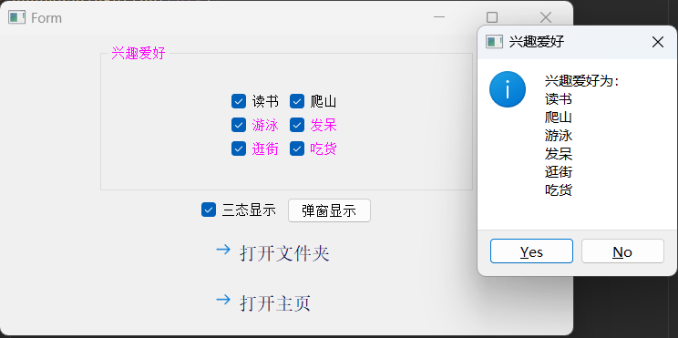
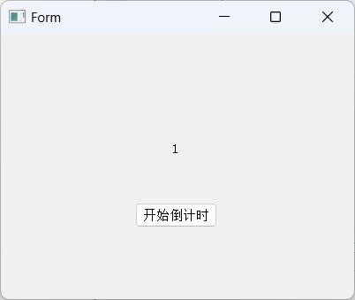

# Qt中文文档

[Qt 5.15.1 - 中文文档编制,帮助,手册,教程 (digitser.top)](http://qt5.digitser.top/5.15/zh-CN/index.html)

[Qt 6.2 | Qt6 中文参考手册 (cutebook.net)](http://qtdoc.cutebook.net/qtdoc/index.html)

[Qt 编程指南](https://qtguide.ustclug.org/)

#  一、Pyside2模块安装

```cmd
pip install Pyside2
```

版本：PySide2  5.15.2.1

# 二、配置Pycharm外部工具

Qt Designer:可视化编辑UI界面，生成.ui文件。
PySide-uic: 将.ui文件转换为.py文件，以便修改和导入。
PySide-rcc: 将.qrc文件（资源文件）转换为.py文件。
PySide-lupdate:用于从ui文件和Python源码中提取需要翻译的字符串
linguist:用于多语言翻译，输入文件为PySide-lupdate生成的`*.ts`文件，并可以发布为`*.qm`文件

工具配置建议：

```python
Qt Designer:
    名称：任意即可（建议QtDesigner）
    程序：程序所在的路径
    参数：$FileNameWithoutExtension$.ui(可选参数)
    工作目录：$ProjectFileDir$

pyside2-rcc:
    名称：任意即可（建议qrc2py,这样一目了然）
    程序：程序所在目录
    参数：$FileName$ -o $FileNameWithoutExtension$_rc.py
    工作目录：$FileDir$

pyside2-uic:
    名称：任意即可（建议ui2py,理由同上）
    程序：程序所在目录
    参数：-o $FileNameWithoutExtension$_ui.py $FileName$
    工作目录：$FileDir$
    
PySide-lupdate: 
    名称：任意即可
    程序：程序所在目录
    参数：-verbose $FileNameWithoutExtension$.pro
    工作目录:$FileDir$

linguist:   
    名称：任意即可
    程序：程序所在目录
    参数：$FileNameWithoutExtension$.ts
    工作目录:$FileDir$
```

# 三、快速入门

来源：https://www.zhihu.com/people/si-tu-32-83/posts

## 快速入门一：

==主要是简单地介绍一下PySide，并使用designer制作了一个演示用的小demo程序==

​		PySide（在本文中代指PySide2和PySide6）是一个Python的图形化界面（GUI）库，由C++版的Qt开发而来，在用法上基本与C++版没有特别大的差异。相对于其他Python  GUI库来说，PySide开发较快，功能更完善，而且文档支持更好。我这里就给大家简单写一个极简的快速入门教程，旨在帮助大家快速上手并使用这个库。

​		首先说一下PySide和PyQt（在本文中代指PyQt5和PyQt6）的关系，前者是Qt公司的产品，后者是第三方公司的产品，二者用法基本相同，不过在使用协议上却有很大差别，PySide可以在LGPL协议下使用，PyQt则在GPL协议下使用，这两个协议的区别，大家可以自行搜索，为了避免潜在的问题，我这里推荐使用PySide。

​		现在说一下PySide2和PySide6的区别，也就是PyQt5和PyQt6的区别。PySide2和PyQt5由C++版的Qt5开发而来.，而PySide6和PyQt6对应的则是C++版的Qt6。从PySide6开始，PySide的命名也会与Qt的大版本号保持一致，不会再出现类似PySide2对应Qt5这种容易混淆的情况。

​		在使用层面上，PySide2/PyQt5和PySide6/PyQt6并无过多的差异，只有一点需要注意，使用PySide6/PyQt6开发的程序在默认情况下，不兼容Windows7系统，这也是Qt6所决定的。在下面和之后的文章中，我会尽量兼容PySide2和PySide6这两个版本，如果有存在差异的地方，我会两个版本分别解释。

​		那么开始进入正题，先介绍一下使用PySide开发GUI的基本知识（PyQt同理，下面就不再提它了）。

​		PySide为我们提供了两种开发界面的方式，一种叫QtWidget，是在网上搜到的教程中最常见的方式；另一种叫QML，是一种新型的开发方式，也是Qt正在努力推广的开发方式。在本系列的文章中，我们主要使用QtWidget这种方式，而使用QtWidget开发程序时，也有两种基本的使用方法，一种是通过designer开发界面，另一种是用过代码手动开发界面，这里我们的目的是极简快速入门，所以使用designer这种方便的方式进行开发。

### designer介绍

designer界面如下：


#### 组件选择区：

用来选择组件，鼠标选择组件后就可以拖拽到窗口界面上，在本教程中会使用到一部分这里的组件。

##### 布局组件


表格布局，仅有2列，简单版的网格布局。

##### 间隔组件


##### 按钮组件


逐个解释一下各个用途：

###### （1）按压按钮 QPushButton

​    最基本的按钮，点击该按钮通常是通知程序进行一个操作，比如弹个窗、下一步、保存、退出等等，这是经常用到的，操作系统里的对话框里几乎全部都有这种按压按钮。

###### （2）工具按钮 QToolButton

工具按钮通常都不是一个，是一排放置在工具栏 QToolBar 里面，作为快捷按钮来用，比如 Qt 设计师的工具栏：


###### （3）单选按钮 QRadioButton

​    单选按钮通常是多个放在一块，表示互斥的一组选项，只能选择其中一个来填写，比如一个人性别有男、女，只能选择一个，而不能同时是男的又是女的。

​		头两排单选按钮父窗口都是主窗体，默认情况下是互斥的，所以只能选中一个。而分组框里的单选按钮，它们的父窗口是分组框控件，所以与上面两排的不冲突。头两排解决办法：增加Frame控件。


效果图：


单选按钮值获取：radioButton.isChecked()函数

```python
if self.radioButton.isChecked():
    strResult += "性别：男\r\n"
elif self.radioButton_2.isChecked():
    strResult += "性别：女\r\n"
else:
    strResult += "性别：未选中\r\n"
```

###### （4）复选框 QCheckBox

​    与单选按钮不同，复选框通常表示多个可以同时存在的选项，比如一个人可以同时多个爱好，比如读书、看电影、爬山、游泳等

​	复选框还有一种特殊用途，叫三态复选框，比如 WORD 办公软件，一段文字既可以是加粗、部分加粗、都不加粗三种状态，三态复选  框就是用来干这类事情的。将传统两种状态复选框变成三态复选框的函数是：tristate


| **枚举常量**             | **数值** | **描述**       |
| ------------------------ | -------- | -------------- |
| **Qt::Unchecked**        | 0        | 条目未选中     |
| **Qt::PartiallyChecked** | 1        | 条目有部分选中 |
| **Qt::Checked**          | 2        | 条目全选中     |

- 复选框按钮状态获取：checkBox.isChecked()函数

- 三态复选框状态获取：

  - `checkBox.isChecked()`选中与部分选中全部返回True

  - santaicheckBox.checkState() 返回以下三种状态：

    - PySide2.QtCore.Qt.CheckState.PartiallyChecked ：QtCore.Qt.PartiallyChecked

    - PySide2.QtCore.Qt.CheckState.Checked ：QtCore.Qt.Checked

    - PySide2.QtCore.Qt.CheckState.Unchecked ：QtCore.Qt.Unchecked

      ```python
      checkBox.checkState() == QtCore.Qt.Unchecked
      ```


- 设置三态复选框状态：

  ```
  checkBox_7.setCheckState(QtCore.Qt.PartiallyChecked)
  ```




###### （5）命令链接按钮 QCommandLinkButton

这是 Qt 仿造 Vista 里的命令链接按钮引入的扁平风格按钮，点击这个按钮一般意味着打开新的功能窗口或网站链接等

信号：

```python
self.ui.commandLinkButton.clicked.connect(self.checkcommandLinkButton)
self.ui.commandLinkButton_2.clicked.connect(self.checkcommandLinkButton2)
```

槽函数：

```python
# 打开文件夹
def checkcommandLinkButton(self):
    QtGui.QDesktopServices.openUrl(QtCore.QUrl("file:///D:/桌面"))
# 访问网页
def checkcommandLinkButton2(self):
    QtGui.QDesktopServices.openUrl(QtCore.QUrl("http://www.baidu.com"))
```


###### （6）标准按钮盒 QDialogButtonBox

标准按钮盒通常用于对话框程序，举例来说，我们常见的保存询问对话框里面有“保存”、“丢弃”、“取消”三个标准按钮，确认对话框有 “OK”“Cancel”等标准按钮，Qt 将这些典型的按钮做成标准按钮盒，并将相应的信号加以封装，方便程序员使用


##### 视图组件


##### 部件组件


##### 容器组件


##### 输入小部件


常用的 Qt 文本编辑控件：

- QLineEdit 只接受单行普通文本输入，针对最普通的 C++ 字符串编辑和显示，默认都是白底黑字，没有彩色字体。

- QPlainTextEdit 可以接收多行普通文本输入,针对最普通的 C++ 字符串编辑和显示，默认都是白底黑字，没有彩色字体。

- QTextEdit 是升级版的编辑控件，支持 HTML 网页的丰富文本编辑，当然也可以利用它编辑普通文本。

###### QLineEdit

​		接收一行文本输入，编辑器一般都有对文本的复制、粘贴、剪切、撤销、重做等功能，单行编辑控件原生自带这些功能，右击单行编辑控件或者使用 Ctrl+C、Ctrl+V、Ctrl+X 等快捷键都可以使用这些默认功能。

​		单行编辑控件最重要的属性就是 text，获取或者修改文本是单行编辑控件最重要的功能。

获取文本的函数：text()函数获取全部的文本，也可以选取用户高亮选中的部分文本，通过函数：selectedText()

设置文本的函数：setText()

默认情况下，单行编辑控件的文本长度限制为 32767，获取单行编辑控件的文本长度限定的函数为：maxLength()

修改文本长度限定，可以通过函数：setMaxLength(int)

> 用户从图形界面编辑文本，还是程序内部用代码修改文本，都会触发如下信号textChanged()
>
> 只根据用户在图形界面的编辑行为触发textEdited(),程序代码里通过函数 setText() ，那么只会触发之前的 textChanged() 信号
>
> 如果希望追踪文本的所有变化，需要关联 textChanged() 信号，如果只希望跟踪用户在图形界面的编辑更改，那就关联 textEdited() 信号。

设置属性 echoMode 来显示星号密码, 主要有==四种显示模式==：
①Normal，普通模式，用户输入什么显示什么，这是默认的显示模式。
② NoEcho，不显示任何东西，这是 Unix/Linux 常用的密码显示模式，用户敲密码时不显示任何文本，这样能隐藏密码的长 度，不被人从屏幕偷窥。
③ Password，每一个密码字符都用星号显示，这是 Windows 常用的密码显示模式。
④ PasswordEchoOnEdit，当输入一个密码字符时，短暂显示该字符，然后迅速将该字符显示为星号，方便提示用户当前输入了什么字符，类 似 Android 解锁密码的输入方式。


案例：登录界面

例子效果就是点击“登录”按钮时，获取用户名，计算密码的 Hash 值并弹窗显示出来。点击“退出”按钮时，窗口自动关闭。

==returnPressed信号==:当用户在文本框中任何时候按下回车键，就会发出 returnPressed信号。

有时我们需要处理这种情况，比如登录界面，用户输完密码直接按回车健就进行登录处理，可以指定处理returnPressed信号，如下所示：

```python
# 处理回车
self.ui.lineEditUser.returnPressed.connect(self.login)
self.ui.lineEditPassword.returnPressed.connect(self.login)
```

密码哈希值：

```python
QtCore.QCryptographicHash.hash(self.lineEditPassword.text().strip().encode("utf-8"),
                                                QtCore.QCryptographicHash.Sha3_256)
# 把每个Hash字节转成一对十六进制字符显示,256bit对应32字节，变成64个十六进制字符
strMsg += str(QtCore.QByteArray.toHex(m_passwordHash))
```

```python
import sys
# 因为我们创建的界面是MainWindow，所以这里要继承QMainWindow
from PySide2.QtWidgets import QApplication, QWidget, QMessageBox
from PySide2 import QtCore, QtUiTools, QtGui


class UiLoader(QtUiTools.QUiLoader):
    _baseinstance = None

    def createWidget(self, classname, parent=None, name=''):
        if parent is None and self._baseinstance is not None:
            widget = self._baseinstance
        else:
            widget = super(UiLoader, self).createWidget(classname, parent, name)
            if self._baseinstance is not None:
                setattr(self._baseinstance, name, widget)
        return widget

    def loadUi(self, uifile, baseinstance=None):
        self._baseinstance = baseinstance
        widget = self.load(uifile)
        QtCore.QMetaObject.connectSlotsByName(widget)
        return widget


class MainWindow(QWidget):
    def __init__(self, parent=None):
        super(MainWindow, self).__init__(parent)
        # 导入我们生成的界面【动态加载ui文件,QMainWind会出现异常，需要重写UiLoader】
        self.ui = UiLoader().loadUi("登录框示例-单行文本编辑.ui", self)
        # 处理回车
        self.ui.lineEditUser.returnPressed.connect(self.login)
        self.ui.lineEditPassword.returnPressed.connect(self.login)

        self.ui.pushButtonLogin.clicked.connect(self.login)
        self.ui.pushButtonExit.clicked.connect(self.exit)

    def login(self):
        if not (self.lineEditUser.text() and self.lineEditPassword.text()):
            QMessageBox.warning(self, "警告信息", "用户名或密码为空，不能登录", QMessageBox.Yes | QMessageBox.No)
            return
        # 用户名字符串
        m_strUser = self.lineEditUser.text().strip()
        # 不能明文保存密码，存储密码hash值
        m_passwordHash = QtCore.QCryptographicHash.hash(
            self.lineEditPassword.text().strip().encode("utf-8"),QtCore.QCryptographicHash.Sha3_256)

        # 构造消息
        # 添加用户名
        strMsg = "用户名：" + m_strUser + "\r\n" + "密码 Hash："
        # 把每个Hash字节转成一对十六进制字符显示,256bit对应32字节，变成64个十六进制字符
        strMsg += str(QtCore.QByteArray.toHex(m_passwordHash))
        # 弹窗显示，注意：实际应用中会将用户名和密码Hash与数据库或配置文件里的做比较，而不是弹窗
        QMessageBox.information(self, "用户信息", strMsg)

    def exit(self):
        # 界面关闭
        self.ui.close()
        # 界面隐藏
        # self.ui.hide()


if __name__ == "__main__":
    app = QApplication(sys.argv)
    window = MainWindow()
    window.show()
    # 结束QApplication
    sys.exit(app.exec_())
    # 注意，在PySide6中，需要使用app.exec()
    # sys.exit(app.exec())
```


##### 显示部件


常用的 Qt 文本浏览控件：

- QTextBrowser 是 QTextEdit 的只读版本，并能打开网页链接。

#### 工作区：

用来布置界面，调整窗口，我们可以把工作区中的窗口随意拖拽、调整大小；

#### 对象查看区：

查看界面上共有多少组件，以及它们的布局关系；

#### 属性设置区：

设置组件的属性，如文本、大小、名称等。

##### 关键属性

最关键的属性都自动被加粗显示了，有三个： 

- **objectName**：对象名称，用过这个对象名称就能调用该对象的函数。
- **geometry**：控件显示占据的几何图形，就是显示的矩形区域，该属性是通过四个子属性控制的， 点开 "+"，展开看到        X、Y、宽度、高度，设置这四个数值，可以控制控件显示的位置和控件的大小。      
- **text**：显示的文本，标签控件就是专门用来显示文本的，这个是它最主要的功能。    


##### QWidget

###### sizePolicy:控件的布局

参见：https://blog.csdn.net/kongcheng253/article/details/128769765


基于 QWidget的控件都会继承 sizePolicy 属性（ QSizePolicy 类型），这个属性包括两个大的方面内容：**伸展因子 （Stretch Factor）和 伸展策略（Policy）**，这些都会影响到界面最终的布局显示

伸展因子（Stretch Factor）：

---

> 水平伸展、垂直伸展

```
取值范围是 0 到 255，负数就当做 0，大于 255 就当做 255，因此设置超出范围的数也没意义。
```

伸展因子都是 0，那么三个按钮在水平布局里就是均匀拉伸：


如果把 "One" 按钮的 "水平伸展" 设为 1，"Two" 按钮的 "水平伸展" 设为 2，"Three" 按钮的 "水平伸展" 设为  3，那么在窗口拉大时，该行三个按钮的伸展因子之和为 1+2+3 == 6，新的空间就按照 1/6 ，2/6 ，3/6  的比例划分给这三个按钮，显示效果就如下面这样:


如果把 "One" 按钮的 "水平伸展" 设为 2，"Two" 按钮的 "水平伸展" 设为 4，"Three" 按钮的 "水平伸展" 设为  0，那么在窗口拉大时，分配规律就是：先计算伸展因子之和 2+4+0 == 6，新的空间按照 2/6 ，4/6，0/6  的比例划分给这三个按钮，显示效果如下：


因为第三个按钮的伸展因子是 0，第三个按钮会保持一个建议尺寸，其他两个按钮会根据伸展因子的占比进行拉伸。三个水平伸展因子为 2、4、0，其实也可以直接写成 1、2、0，两种是等价的，不管有没有公约数

**除了控件自身可以设置伸展因子，布局器也可以为内部直属的控件或子布局器设置伸展因子。如果布局器和内部直属的控件都设置了伸展因子，那么布局器的设置会覆盖直属控件的伸展因子。因此==不建议==直接设置控件自己的伸展因子属性，而是通过布局器来设置各个子控件或子布局器的伸展因子。**

伸展策略：

---

> 水平策略、垂直策略

| 枚举常量         | **数值**                               | **拉伸特点** | **描述**                                                     |
| ---------------- | -------------------------------------- | ------------ | ------------------------------------------------------------ |
| Fixed            | 0                                      | 固定         | 以建议尺寸固定住，对于水平方向是固定宽度，垂直方向是固定高度。 |
| Minimum          | GrowFlag                               | 被动拉大     | 以建议尺寸为最小尺寸，如果有多余的空间就拉伸，没有多余的空间就保持建议尺寸。被动扩张。 |
| Maximum          | ShrinkFlag                             | 被动缩小     | 以建议尺寸为最大尺寸，窗口缩小时，如果其他控件需要，该控件可以尽量缩小为其他控件腾出空间。 |
| Preferred        | GrowFlag \|  ShrinkFlag                | 被动伸缩     | 以建议尺寸为最佳尺寸，能屈能伸，窗口缩小时可以为其他控件腾出空间，窗口变大时，也可以占据其他控件不需要的空闲空间。基类 QWidget 默认是这种策略。被动扩张。 |
| Expanding        | GrowFlag \|  ShrinkFlag \|  ExpandFlag | 主动扩张     | 建议尺寸仅仅是明智的建议，但控件基本不采用。这个模式也是能屈能伸，但它倾向于主动扩张，它会尽可能占据新增的区域。 |
| MinimumExpanding | GrowFlag \|  ExpandFlag                | 主动扩张     | 以建议尺寸作为最小尺寸，主动扩张，尽可能占据新增的区域。     |
| Ignored          | ShrinkFlag \|  GrowFlag \|  IgnoreFlag | 野蛮扩张     | 忽略建议尺寸，虽然能屈能伸，但是它会尽最大可能占据空间。     |


###### styleSheet:实现可视化地编辑样式表

“编辑样式表”对话框上方是四个按钮，点击按钮会显示如上图中的菜单。

“添加资源”是给控件添加前景图、背景图、边框图等。

“添加渐变”和“添加颜色”功能类似，    可以为控件设置各种样式的渐变色。

“添加颜色”是给控件添加前景色 color、背景色 background-color、边框色 border-color    等等。

点击“添加字体”会弹出字体设置对话框，可以改变控件显示文字的字体、字号、粗体等效果。

这里可以简单添加一个前景色 color 和 背景色    background-color ，两个颜色读者可以随意设置。

重要的是学会设置样式表颜色，至于颜色本身不重要。

添加好 color 和    background-color 之后，点击下方的“OK” 按钮，在编辑样式表对话框关闭之后就会查看效果，类似下图所示：

​		如果多次设置了前景色 color ，那么该对话框里会有多个 color    行，实际显示时按照最后一行的颜色显示，其他颜色设置也是类似的。如果要取消已设置的颜色，只需删除该对话框中间文本框里相应的文本行即可，比如删除上面的    background-color 一行（行尾是以 ; 结束），然后添加渐变背景色如SunRay


这里我们先把工作区中的窗口拖放到中间，再从组件选择区里拖拽一个Label组件到窗口上，如下图所示：


​		之后我们双击窗口里面的Label，输入“你好啊！PySide2~”，我们会发现默认的Label大小并不能完全展示文本，所以我们把Label的宽度拉长（单击Label后，拖住周围的深蓝色方块即可调整大小）：


接下来我们保存这个界面（Ctrl+S），或者在菜单栏选择“文件”->“保存”，我们命名为hello.ui。

注意，PySide2是不能直接使用ui文件的，我们还需要将其转为py文件，这一步我们使用命令：

pyside2-uic hello.ui > hello_ui.py  (还可使用pyside2-uic工具，[工具配置：](# 二、配置Pycharm外部工具  "外部工具配置"))

​		这样我们就会得到一个hello_ui.py文件，我们可以打开看一下，里面都是一些界面代码，如果不使用designer，那么这个hello_ui.py就需要我们手动来写，所以，使用designer可以加快开发速度，减少工作量，提升开发效率。

接下来我们就要写代码来把界面展示出来，新建一个py文件：

```python
# -*- coding: utf-8 -*-
# 导入sys
import sys
# 任何一个PySide界面程序都需要使用QApplication
# 我们要展示一个普通的窗口，所以需要导入QWidget，用来让我们自己的类继承
from PySide2.QtWidgets import QApplication, QWidget


# 继承QWidget类，以获取其属性和方法
class MyWidget(QWidget):
    def __init__(self):
        super().__init__()

        # 加在UI文件2种方式：静态加载、动态加载
        # 导入我们生成的界面【静态加载ui.py文件】
        from hello_ui import Ui_Form
        # 设置界面为我们生成的界面
        # self.ui = Ui_Form()
        # self.ui.setupUi(self)

        # 导入我们生成的界面【动态加载ui文件】
        from PySide2.QtUiTools import QUiLoader
        self.ui = QUiLoader().load("hello.ui", self)


# 程序入口
if __name__ == "__main__":
    # 初始化QApplication，界面展示要包含在QApplication初始化之后，结束之前
    app = QApplication(sys.argv)

    # 初始化并展示我们的界面组件
    window = MyWidget()
    window.show()

    # 结束QApplication
    sys.exit(app.exec_())
    # 注意，在PySide6中，需要使用app.exec()
    # sys.exit(app.exec())
```

注释中包含了详细的代码说明，接下来我们只要执行这个py文件，就可以看到我们的界面了：


## 快速入门二：

### 界面布局

​		学习如何让组件在界面上排列得更有顺序，也就是如何使用布局。

​		在日常的开发中，我们经常会用到三种基础布局：水平布局、垂直布局和栅格布局（也可以叫网格布局），接下来我们来一个个地学习它们。

​		首先来看一个不使用布局的例子，我们打开designer，创建一个Widget，并在界面上摆放三个PushButton，分别双击它们，将它们的显示文字改为按钮1、按钮2和按钮3，如下图所示：


​		接下来我们点击designer菜单栏中的窗体->预览，或使用快捷键ctrl+r，打开界面预览，这时我们可以看到，和我们设计好的一样，三个按钮基本是在界面中间的：


​		现在我们点击界面右上角的最大化按钮，让界面全屏，会发现，三个按钮的位置发生了变化，它们并没有继续留在界面中间，而是跑去了左上角：


这显然和我们预期的结果不一样，我们需要组件随着界面一起发生变化，来保证整个界面的一致性，这个时候，就需要来使用布局了。

### 水平布局

​		我们先来了解水平布局，顾名思义，水平布局就是将所有组件按照水平方向排列，实现起来也很简单，我们在界面的空白处点击鼠标右键，选择布局->水平布局即可。


实现的效果如下：


我们可以任意拖动这三个按钮，来改变它们的排列顺序，但是无论怎么拖动，它们都会保持水平排列。

这个时候我们再预览，放大，就会发现之前的问题已经得到了解决，无论我们怎样改变界面大小，按钮的位置都不会发生改变。

### 垂直布局

垂直布局和水平布局类似，我们只需要在选择布局时选择垂直布局，三个按钮就会按照垂直方向排列，如下图所示：


同样，我们也可以拖动按钮来改变它们的排列顺序。

### 栅格布局

​		接下来主要说一下栅格布局，栅格布局和水平/垂直布局不同，它首先将整个界面按照行和列进行划分，形成一个个单元格区域，之后判断哪个组件放在哪些区域，来实现一种稍微复杂的布局。

我们首先打破之前实现的垂直布局，方式为选择布局->打破布局，并重新把三个按钮摆放成如下的形式：


之后我们实现栅格布局，方式为布局->栅格布局，发现界面变成了这样：


不难看出，designer将整个界面划分为了两行两列，共四个单元格区域，三个按钮分别占了一个区域：


​		这里将界面划分为几行几列，以及每个组件占有的区域个数，是由designer根据我们排列组件的相对大小和相对位置自动决定的，如果我们把按钮3的宽度大致调整为按钮1和按钮2的宽度之和，如下图所示：


那么在生成的栅格布局中，按钮3就会占有2个区域：


​		以上就是三种基础布局的用法，在实际的开发中，最常用到的布局方式是以上三种布局的组合，比如，我们要实现一个简单的登录界面，需要使用水平布局来排列用户名和密码的文本标签和输入框，之后使用垂直布局来实现它们的上下排列，如果我们还需要放置一个登陆说明或图片，可能还需要用到栅格布局。

### 布局案例

​		我们可以使用Frame来实现上述界面，首先让组件在Frame中布局，之后再对不同的Frame进行布局。我们先把3个按钮删掉（不要忘记打破布局），然后拖放4个Frame到界面上（注意，Frame是近似透明的，如果忘记了它们被放在了哪里，就在对象查看区选中它们，就能在界面上显示了）：

​		之后我们分别拖放一个Lable和LineEdit到一个Frame中，将Label的显示文本改为用户名并对Frame应用水平布局（在Frame中点击鼠标右键）：


​		同理，我们再创造一个密码Frame和一个只含有登录按钮的Frame，然后再创建一个含有Label说明的Frame，并将它们按如下方式摆放：


然后应用栅格布局：


一个还算凑合的登录界面就实现了。

​		我们主要学习了怎样在designer中使用PySide提供的三种基础布局。在任何语言中，布局都是界面开发的基础，任何精美的界面也离不开良好的布局。

## 快速入门三:

### 基础窗口-主窗口（QMainWindow）

官方文档：

- PySide2: https://doc.qt.io/qtforpython-5/PySide2/QtWidgets/QMainWindow.html
- PySide6: https://doc.qt.io/qtforpython/PySide6/QtWidgets/QMainWindow.html

​		QMainWindow具有很多的函数（方法），这里介绍比较常见的用法。

​		首先需要知道，QMainWindow是一种特殊的QtWidget，只是在普通的QtWidget上增加了一些更方便的功能，经常被用作一个程序的主界面。

学习如何使用QMainWindow，和往常一样，我们打开designer，选择创建一个Main Window（注意不是Widget）：


​		我们可以在designer右上角的对象查看区看到，默认生成的QMainWindow包含三个部分-centralwidget（中央组件）、menubar（菜单栏），statusbar（状态栏），分别对应界面中如下的几个部分：


​		首先我们来创建菜单，双击左上角的“在这里输入”，输入“菜单1”并回车，就可以创建一个菜单，但是目前菜单中还没有选项，所以我们还需要添加菜单的选项（在PySide中叫做动作，action），这里需要注意，designer不支持给action直接输入中文，所以我们要先输入英文字母，再到属性设置区更改为中文。接下来我们新建一个选项1，单击“菜单1”，就会出现下拉菜单，双击“在这里输入”并回车：


​		接下来我们再使用相同的办法，创建一个动作2选项，将它的对象名称改为action2。这样我们的一个菜单就建好了，按照相同的步骤我们可以再建立菜单2、菜单3……

然后我们放置一个Label到中央组件上：


### 主窗口（QMainWindow）案例

​		现在，我们准备实现这样一个程序，单击动作1或动作2，更改Label显示不同的文本，同时状态栏记录我们当前的鼠标正在点击哪个选项。

我们先保存这个界面，命名为main.ui，使用pyside2-uic命令生成ui_main.py，之后创建如下的python文件（main.py）：

```python
# -*- coding: utf-8 -*-
import sys
# 因为我们创建的界面是MainWindow，所以这里要继承QMainWindow
from PySide2.QtWidgets import QApplication, QMainWindow
from PySide2 import QtGui, QtCore, QtUiTools


class UiLoader(QtUiTools.QUiLoader):
    _baseinstance = None

    def createWidget(self, classname, parent=None, name=''):
        if parent is None and self._baseinstance is not None:
            widget = self._baseinstance
        else:
            widget = super(UiLoader, self).createWidget(classname, parent, name)
            if self._baseinstance is not None:
                setattr(self._baseinstance, name, widget)
        return widget

    def loadUi(self, uifile, baseinstance=None):
        self._baseinstance = baseinstance
        widget = self.load(uifile)
        QtCore.QMetaObject.connectSlotsByName(widget)
        return widget


class MainWindow(QMainWindow):
    def __init__(self, parent=None):
        super(MainWindow, self).__init__(parent)

        # from main_ui import Ui_MainWindow
        # self.ui = Ui_MainWindow()
        # self.ui.setupUi(self)

        # 导入我们生成的界面【动态加载ui文件,QMainWind会出现异常，需要重写UiLoader】
        self.ui = UiLoader().loadUi("main.ui", self)

        # 从ui属性里可以访问界面中的对象
        # 这里用到了Qt的信号-槽机制，以后会提到
        # 现在只需要记住，action的triggered属性代表被点击
        # 使用connect()方法可以设置被点击后执行的方法
        # 点击action1就会执行trigger_action1()
        self.ui.action1.triggered.connect(self.trigger_action1)
        # 点击action2就会执行trigger_action2()
        self.ui.action2.triggered.connect(self.trigger_action2)

    def trigger_action1(self):
        # 使用setText()方法设置Label显示的文本
        self.ui.label.setText("动作1")
        # 使用showMessage()方法可以临时显示状态信息
        self.ui.statusbar.showMessage("你点击了动作1")

    def trigger_action2(self):
        self.ui.label.setText("动作2")
        self.ui.statusbar.showMessage("你点击了动作2")


if __name__ == "__main__":
    app = QApplication(sys.argv)
    window = MainWindow()
    window.show()
    # 结束QApplication
    sys.exit(app.exec_())
    # 注意，在PySide6中，需要使用app.exec()
    # sys.exit(app.exec())
```

​		我们执行这个py文件，在显示的界面中点击菜单1中的选项1或选项2，会发现Label和状态栏显示的文字会发生变化，而状态栏显示的文字会随着鼠标再次移动到菜单栏上而消失（不是bug，状态栏的设计就是这样的）：


## 快速入门四:

### Qt的信号-槽机制

​		在大多数情况下，我们希望程序在我们做出某些操作后给出正确的回应，比如，在登录流程中，我们点击登录按钮，程序就会将用户名和密码发送到服务器；或者在执行一些需要查看进度的任务时，程序会在进度条上正确显示当前的进度。那么问题来了，程序要怎么知道在我们执行操作后要进行什么回应呢？Qt使用了信号-槽机制来解决这个问题。

​		信号-槽机制是Qt特有的机制，第一眼看上去，这个名称很让人费解，是因为这个机制在Qt的文档中叫做Signal and  Slot，直译过来就是这样啦，在其他文章中，基本也是这么称呼的。我倒是觉得换一种方式可能更好理解，毕竟“槽“这个东西不太形象，我们可以把信号想作是信号发射器，槽想作是信号接收器，当我们做出某些操作后（比如按下按钮），信号发射器就会向指定的信号接收器（槽）发射一个信号，然后信号接收器（槽）收到信号，对信号进行处理，最后给出回应。

看到这里大家可能还是有些不太理解，接下来我们用代码来解释这个流程。

我们先来看部分代码：

```text
# action1有一个triggered信号
# trigger_action1()方法就是槽
# 使用connect()方法将信号和槽联系起来
# 当我们点击action1时，triggered信号就被发射出去
# trigger_action1()槽收到信号后，就会执行方法内的代码
self.ui.action1.triggered.connect(self.trigger_action1)
```

​		在PySide中，很多widget组件都带有不同的内置信号，比如pushButton（按钮）的clicked信号（代表被点击）、lineEdit（行编辑器）的textChanged信号（代表文本发生改变）等，这些内置的信号极大地方便了我们的日常开发，当现有的信号不足以满足我们的需求时，我们也可以自己编写信号。

​		接下来我们用lineEdit（行编辑器）的textChanged信号来写一个demo。首先，我们创建如下的界面（QWidget或QMainWindow都可以）：


界面上有两个组件：一个Line Edit和一个Label，我们要做的就是当在输入框中输入字符时，Label会自动变成输入框中的字符。

接下来我们把这个界面保存为signal.ui文件，生成signal_ui.py文件，再新建一个main.py文件：

```python
# -*- coding: utf-8 -*-
import sys
from PySide2.QtWidgets import QWidget, QApplication
from signal_ui import Ui_Form


class MyWidget(QWidget):
    def __init__(self):
        super().__init__()
        self.ui = Ui_Form()
        self.ui.setupUi(self)

        # 将lineEdit具有的textChanged信号与update_label()槽连接
        # 这样每次当lineEdit的文本发生变化，就会执行update_label()方法
        self.ui.lineEdit.textChanged.connect(self.update_label)

    def update_label(self):
        # 获取当前lineEdit的文本内容
        text = self.ui.lineEdit.text()
        # 更新label的文本
        self.ui.label.setText(text)


if __name__ == '__main__':
    app = QApplication(sys.argv)
    window = MyWidget()
    window.show()
    sys.exit(app.exec_())
```


## 快速入门五

### 线程-QThread

QThread是一个常用且非常重要的类，主要用来执行比较耗费时间的代码，这么说不太直观，我们来举个例子。

​		假设我们需要开发一个倒计时程序，功能很简单，点击开始倒计时按钮后，每隔一秒在界面上显示从30到1共30个数字。首先我们准备好界面：


之后将界面生成为ui_ui.py。

现在界面上显示的数字为30，在我们点击“开始倒计时”按钮后，我们希望数字变成29、28、27……最后变为1。现在我们来看一下不使用QThread时，会发生什么事情。

注意，这里会涉及到pushButton的使用方法。

```python
# -*- coding: utf-8 -*-
import sys
import time
from PySide2.QtWidgets import QApplication, QWidget
from ui_ui import Ui_Form


class MyWidget(QWidget):
    def __init__(self):
        super().__init__()
        self.ui = Ui_Form()
        self.ui.setupUi(self)

        # 注意：这里是按钮的点击事件
        # 将pushButton具有的clicked信号与button_clicked()槽连接
        # 这样每次当我们点击按钮，就会执行button()方法
        self.ui.pushButton.clicked.connect(self.button_clicked)

    def button_clicked(self):
        # 每隔一秒，将label上显示的数字减一，直到数字为1
        while True:
            # 获取label上正在显示的数字，并转为int类型
            number = int(self.ui.label.text())
            # 判断数字是否等于1，如果为1则结束循环
            if number == 1:
                break
            # 数字不为1，等待一秒
            time.sleep(1)
            # 将数字减一
            number -= 1
            # 将label更新为新数字
            self.ui.label.setText(str(number))
```

执行代码，点击界面上的按钮，等待一会，我们会发现，数字并没有更新，并且界面卡住了，如果我们用鼠标点击界面的其他地方，会发现界面变成了下面的样子，还会显示“（未响应）”，同时，鼠标也会开始转圈圈。


再多等待一会后，程序会直接变为结束时的样子，数字直接变成了1，并没有按照我们预想的那样，从30一个一个地变化为1:



为什么程序会变成这个样子呢？

​		一般来说，大部分的界面程序都有一个专门负责界面显示的“渲染进程”，这里的界面程序不单单指Windows桌面程序，也包括安卓APP等其他运行环境下的界面程序。这个“渲染进程”只负责一件事，那就是刷新并显示界面，它不停地刷新界面，这样，当界面发生变化的时候，它就会及时地为我们显示变化后的界面。

​		嗯，这个进程貌似很厉害的样子，可是和程序卡住有什么关系呢？这里还需要提到一个概念，就是“耗时操作”，简单来说就是耗费时间的操作，常见的有：和数据库交互、请求网络资源、磁盘IO（比如写文件、读文件）等。这些耗时操作对于我们人类来说感觉很快，但是对“渲染进程”来说简直慢的不行，因为它要不停地刷新界面，一会儿都等不了，而一旦“渲染进程”要等待其他操作时，就会发生程序的“卡死”现象。

​		那么问题的原因就找到了，我们的倒计时代码和渲染进程冲突了，渲染进程必须等我们倒计时结束才会更新界面，所以我们才会在程序执行完时，看到数字变为了1，而并没有看到数字连续变化，因为这个时候，渲染进程正在等我们倒计时结束呐。

​		解决的办法也很简单，那就是避免在渲染进程中执行耗时操作（渲染进程1秒都等不了，何况我们需要30秒，哈哈）。在PySide中，就是通过QThread来解决，我们使用QThread来执行耗时操作，这样，渲染进程和耗时操作就会同时进行，不会导致界面卡死。

QThread的使用方式与Python原生的Thread类似，我们来看一下使用QThread后的代码，注释很多，需要耐心看：

```python
# -*- coding: utf-8 -*-
import sys
import time
from PySide2.QtWidgets import QApplication, QWidget
# 从QtCore中导入QThread、Signal和Slot
from PySide2.QtCore import QThread, Signal, Slot
from ui_ui import Ui_Form


class MyWidget(QWidget):
    def __init__(self):
        super().__init__()
        self.ui = Ui_Form()
        self.ui.setupUi(self)

        # 注意：这里是按钮的点击事件
        # 将pushButton具有的clicked信号与button_clicked()槽连接
        # 这样每次当我们点击按钮，就会执行button()方法
        self.ui.pushButton.clicked.connect(self.button_clicked)

    def button_clicked(self):
        # 获取界面上的起始数字
        number = int(self.ui.label.text())
        # 注意：使用self将thread声明为属性
        # 避免button_clicked()方法结束，thread中止
        # 将起始数字传给thread
        self.thread = MyThread(number)
        # 将thread的自定义信号连接到接收信号的槽，这里就是update_label()方法
        self.thread.signal.connect(self.update_label)
        # 执行thread
        self.thread.start()

    # 用来接收自定义信号的方法
    # 接收的信号应为一个int变量
    @Slot(int)
    def update_label(self, number):
        # number为接收到的信号
        # 将label更新为接收到的信号，即更新后的数字
        self.ui.label.setText(str(number))
 

# 继承QThread
class MyThread(QThread):
    # 声明一个自定义信号
    # 信号是一个int变量
    signal =Signal(int)

    def __init__(self, number):
        super().__init__()
        self.number = number

    def run(self):
        # QThread启动时，将会执行这里的代码
        # 每隔一秒，将number减一，直到数字为1
        while True:
            # 判断数字是否等于1，如果为1则结束循环
            if self.number == 1:
                break
            # 数字不为1，等待一秒
            time.sleep(1)
            # 将数字减一
            self.number -= 1
            # 将更新好的数字通过信号传给界面
            # emit()方法将信号发射给建立好连接的槽
            self.signal.emit(self.number)


if __name__ == '__main__':
    app = QApplication(sys.argv)
    window = MyWidget()
    window.show()
    sys.exit(app.exec_())
```

重新执行我们的程序，我们会发现，程序正常了，而且在完全按照我们期待的方式执行。


# 四、白月黑羽教程学习

白月黑羽教程：https://www.byhy.net/tut/py/gui/qt_02/

## 案例入门：

现在我们要开发一个程序，让用户输入一段文本包含：员工姓名、薪资、年龄。

格式如下：

```py
薛蟠     4560 25
薛蝌     4460 25
薛宝钗   35776 23
薛宝琴   14346 18
王夫人   43360 45
王熙凤   24460 25
王子腾   55660 45
王仁     15034 65
尤二姐   5324 24
贾芹     5663 25
贾兰     13443 35
贾芸     4522 25
尤三姐   5905 22
贾珍     54603 35
```

该程序可以把薪资在 2万 以上、以下的人员名单分别打印出来。

当然我们可以像以前一样，开发命令行程序（准确的说应该叫字符终端程序，因为UI是字符终端），让用户在字符终端输入。

但是如果我们能开发下面这样的图形界面程序，就更酷了


界面设计如下：


```python
import sys
from PySide2.QtWidgets import QWidget, QApplication
from PySide2.QtWidgets import QMessageBox
from 薪资表统计_ui import Ui_Form


class MyWidget(QWidget):
    def __init__(self):
        super().__init__()
        self.ui = Ui_Form()
        self.ui.setupUi(self)

        self.ui.button.clicked.connect(self.handleCalc)

    def handleCalc(self):
        info = self.ui.textEdit.toPlainText()
        print(info)

        # 薪资20000 以上 和 以下 的人员名单
        salary_above_20k = ''
        salary_below_20k = ''
        """
        info.splitlines():
            splitlines() 按照行('\r', '\r\n', \n')分隔，返回一个包含各行作为元素的列表，
            如果参数 keepends 为 False，不包含换行符，如果为 True，则保留换行符。
            参数
                keepends -- 在输出结果里是否保留换行符('\r', '\r\n', \n')，
                默认为 False，不包含换行符，如果为 True，则保留换行符。
            返回值
                返回一个包含各行作为元素的列表
        """
        for line in info.splitlines():
            if not line.strip():
                continue
            # split() 字符串转列表
            parts = line.split(' ')
            # 去掉列表中的空字符串内容
            parts = [p for p in parts if p]
            name, salary, age = parts
            if int(salary) >= 20000:
                salary_above_20k += name + '\n'
            else:
                salary_below_20k += name + '\n'

        QMessageBox.about(window,
                          '统计结果',
                          f'''薪资20000 以上的有：\n{salary_above_20k}
                    \n薪资20000 以下的有：\n{salary_below_20k}'''
                          )


if __name__ == '__main__':
    app = QApplication(sys.argv)
    window = MyWidget()
    window.show()
    sys.exit(app.exec_())

```

运行效果：


# 遇到的问题

---


## 1、ValueError: source code string cannot contain null bytes

通过 pyside2-uic hello.ui > hello_ui.py 生成py文件（1文件），运行后报 ValueError: source code string cannot contain null bytes 错误。


通过 pyside2-uic 工具生成的 py文件（2文件） 正常运行。

对比以上2个文件内容完全一样，通过以下代码，发现1文件编码格式为 UTF-16 ， 2文件编码格式为 ascii 

```python
from chardet import detect

file_path="main_ui.py"
with open(file_path, 'rb') as f:
    # 获取文件编码格式
    encode = detect(f.read(10))['encoding']
    print(encode)
```

问题原因：文件编码格式原因，导致的报错。

## 2、PySide2 QUiLoader导致主窗口（mainwindow）异常

主窗口 相关控件不能正常显示。

重写这个加载工具，重写后的UiLoader如下：

```python
from PySide2 import QtGui, QtCore, QtUiTools

class UiLoader(QtUiTools.QUiLoader):
    _baseinstance = None

    def createWidget(self, classname, parent=None, name=''):
        if parent is None and self._baseinstance is not None:
            widget = self._baseinstance
        else:
            widget = super(UiLoader, self).createWidget(classname, parent, name)
            if self._baseinstance is not None:
                setattr(self._baseinstance, name, widget)
        return widget

    def loadUi(self, uifile, baseinstance=None):
        self._baseinstance = baseinstance
        widget = self.load(uifile)
        QtCore.QMetaObject.connectSlotsByName(widget)
        return widget
```

