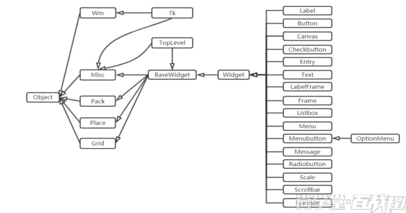

# 一、基础知识

## 1、创建窗口

```python
import tkinter as tk

# 获取TK对象 创建一个窗体
win = tk.Tk()
# =========设置窗体的属性=======
# 设置窗口大小与位置
## 600x400+100+100  窗口大小为600x400，位置在屏幕上的坐标（x=100，y=100）
win.geometry("600x400+100+100")
# 设置窗口图标
win.iconbitmap("../img/icon/电脑图标.ico")
# 设置窗口标题
win.title("示例")
# 显示主窗口  进入消息循环，让窗口可以不断刷新
win.mainloop()
```

## 2、组件



```text
Wm：窗口之间通信
Pack、Place、Grid：布局管理器
TopLevel：置顶窗口
```

