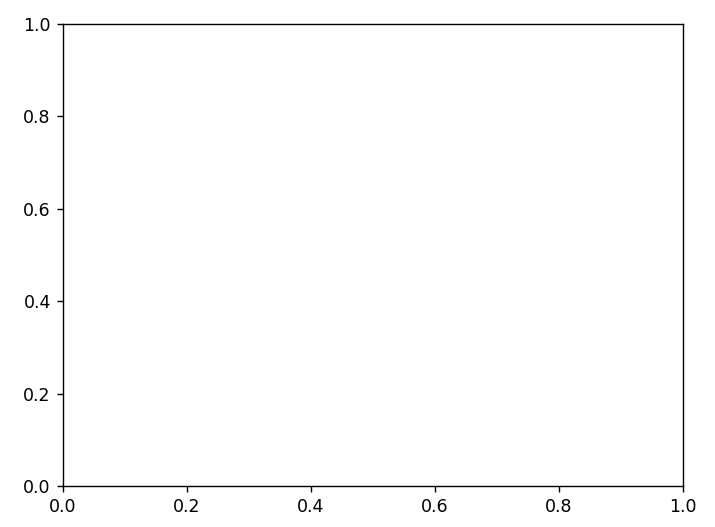

# Matplotlib基础

## 一、图表的基本元素

- 画布：绘画界面
- 坐标系：可以分为直角坐标系、球坐标系、极坐标系
- 坐标轴
- 坐标轴标题
- 图表标题
- 数据标签
- 数据表
- 网格线
- 图例
- 误差线

## 二、建立画布和坐标系

### 2.1 建立画布

```
import matplotlib.pyplot as plt

# 让图表直接在 Jupyter Notebook 中展示出来
%matplotlib inline

# 解决中文乱码问题
plt.rcParams["font.sans-serif"] = "SimHei"

# 解决负号无法正常显示的问题
plt.rcParams["axes.unicode_minus"] = False

# 解决图表不清晰，将图表设置成矢量图格式
config InlineBackend.figure_format = "svg"

# 建立画布，参数 figsize 用 width 和 height 控制画布的宽和高，举例：fig = plt.figure(figsize = (8,6))
fig = plt.figure()

```

### 2.2 用 add_subplot 函数建立坐标系

必须先有==画布==，再画布上绘制坐标系。

#### 2.2.1 绘制 1 x 1坐标系

```
fig = plt.figure()

# ax1 = fig.add_subplot(横向数量, 纵向数量, 坐标系序号)
ax1 = fig.add_subplot(1, 1, 1)
```




#### 2.2.2 绘制 2 x 2坐标系

```
fig = plt.figure()

ax1 = fig.add_subplot(2, 2, 1)
ax2 = fig.add_subplot(2, 2, 2)
ax3 = fig.add_subplot(2, 2, 3)
ax4 = fig.add_subplot(2, 2, 4)

```


### 2.3 用 plt.subplot2grid 函数建立坐标系

不需要画布，绘图代码需要跟在建立坐标系的语句后面

```
import numpy as np

# 创建x、y轴数据
x = np.arange(6)
y = np.arange(6)

# 将图表区域分成 2 x 2，且在 (0,0) 位置绘图
plt.subplot2grid((2, 2), (0, 0))
# 绘制折线图
plt.plot(x,y)

# 将图表区域分成 2 x 2，且在 (0,0) 位置绘图
plt.subplot2grid((2, 2), (1, 1))
# 绘制条形图
plt.bar(x,y)

```


### 2.4 用 plt.subplot 函数建立坐标系

同 plt.subplot2grid 函数用法一样，区别形式简单，举例：plt.subplot2grid(2, 2, 1)

### 2.5 用 plt.subplots 函数建立坐标系

可以一次返回多个坐标系，通过参数 axes[ x, y] 指明绘图坐标系位置。

```
import numpy as np

# 创建x、y轴数据
x = np.arange(6)
y = np.arange(6)

# 将图表区域分成 2 x 2
fig, axes = plt.subplots(2, 2)

# 在 [0,1]绘制折线图
axes[0, 1].plot(x, y)

# 在 [1,0]绘制柱状图
axes[1, 0].bar(x, y)
```


## 三、设置坐标轴

### 3.1 设置坐标轴的标题

- x 轴标题：plt.xlabel("标题")

- y 轴标题：plt.ylabe("标题")

- 参数:

  > - labelpad 设置到坐标轴的距离
  > - fontsize 设置字体大小
  > - color 设置字体颜色
  > - fontweight 值 bold 设置字体加粗

### 3.2 设置坐标轴刻度

#### 3.2.1 xticks、yticks 函数

自定义显示不同刻度处的值，plt.xticks(刻度值 , 刻度处对应标签)，刻度处对应标签支持格式设置与标题设置参数一致。

不把 x/y 轴的数值具体显示出来，只需要给xticks、yticks传入一个空列表，举例：plt.xticks([])

```
# 设置 x 轴刻度
plt.xticks(x, [9, 6, 7, 7, 8, 9], fontsize="6",color = "red")

# 设置 x 轴刻度
plt.yticks(y, [9, 6, 7, 7, 8, 9])

# 设置 x 轴标题
plt.xlabel("月份", fontsize="12", fontweight="bold")
```


#### 3.2.2 tick_params 函数

P280
