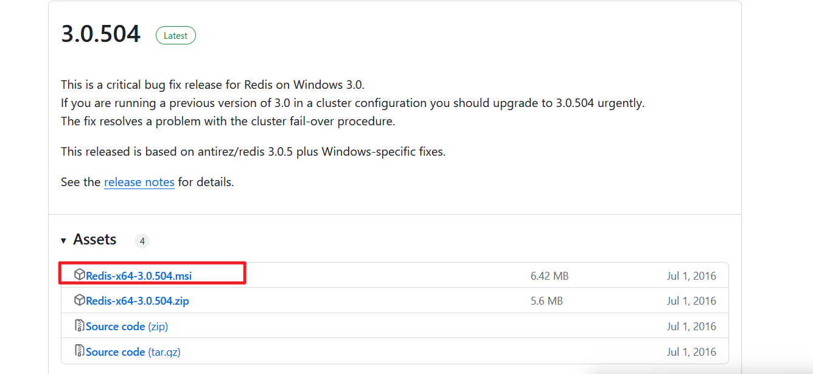
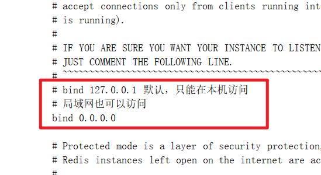
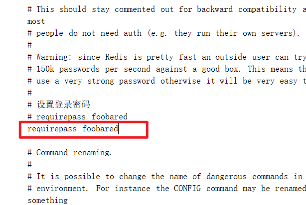
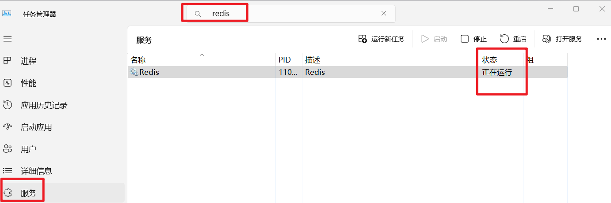
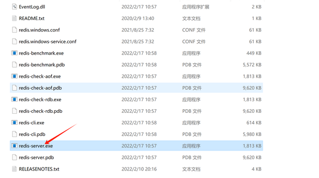
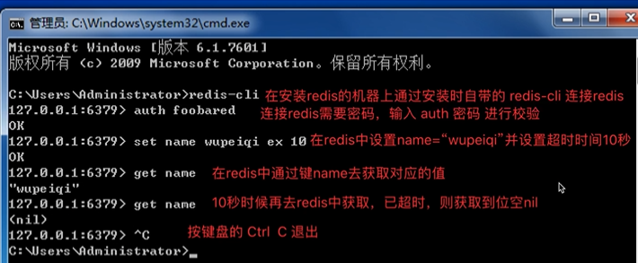
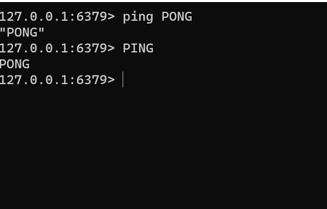
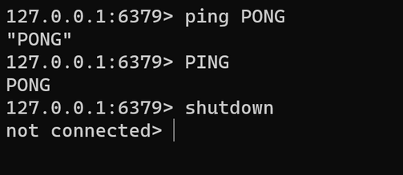
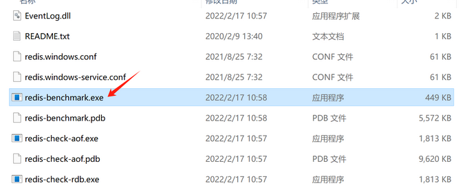
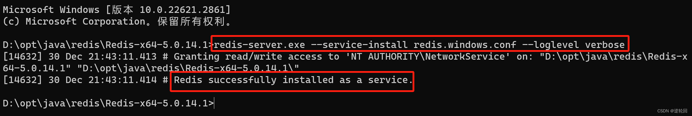

## redis基本操作

#### 下载redis

https://github.com/microsoftarchive/redis/releases

https://files.cnblogs.com/files/blogs/685292/Redis-x64-3.2.100.zip?t=1698590344&download=true



#### 安装redis

点击安装。

#### 修改配置

```tex
redis.windows.conf: 是 Redis 在 Windows 系统上的默认配置文件，在以普通命令行方式启动 Redis 时会使用这个配置文件。该文件中的配置项通常是用于指定 Redis 服务器的监听地址、端口号、数据文件存储路径等。

redis.windows-service.conf：是 Redis 在 Windows 系统上安装为系统服务时使用的配置文件。在以 Windows 服务的方式启动 Redis 时会使用该配置文件。该文件中的配置通常需要指定 Redis 服务的名称、描述和执行路径等。

参数说明
        daemonize：是否以守护进程的方式运行，默认为no，可以通过修改为yes启动守护进程
        当daemonize为yes时，redis默认会将pid写入/var/run/redis.pid文件，可以通过pidfile指定pidfile /var/run/redis.pin
        redis默认监听端口为6379，可以通过port指定
　　         port 6379
        绑定的主机地址
　　        bind 127.0.0.1
        设置当客户端限制多长时间后关闭连接，如果指定为0，表示关闭该功能
　　　    timeout 300
        指定日志记录级别：redis共支持4个级别：debug，verbose，notice，warning 默认为notice
　　        loglevel verbose
        日志记录方式，默认为标准输出。如果配置redis以守护进程方式运行，而这里有配置为日志记录方式为标准输出，则日志将会发送给/dev/null
　　        logfile stdout
        设置数据库的数量，默认是0，可以通过select dbid 命令在连接上zh数据库id
　　        database 16
        指定在多长时间内，有多少次更新操作就将数据同步到数据文件，可多个条件配合
　　        save
　　        redis默认配置中提供了三个条件：
　　                save 900 1
　　                save 300 10
　　                save 60 10000
　　                分别表示900秒内一个更改，300秒内10个更改，60秒内10000个更改
        指定存储到本地数据库时，是否压缩数据，默认为yes。redis采用LZF压缩，如果为了节省CPU时间，可以关闭该压缩，但是会导致数据库文件变得巨大。
　　        rdbcompression yes
        指定本地数据库文件名，默认为dump.rdb
　　        dbfilename dump.rdb
        指定本地数据库存放目录
　　        dir ./
        设置当本机为slav服务时，设置master服务的IP地址及端口，在redis启动时，它会自动从master进行数据同步
　　        slaveof
        当master服务设置了密码保护时，slav服务连接master的密码
　　        masterauth
        设置连接密码。如果设置了密码，客户端在连接redis时，需要通过auth 命令提供密码，默认关闭。
　　        requirepass foobared
        设置同一时间客户端最大连接数，默认无限制。如果设置maxclients为0，表示不限制。
　　        maxclients 128
        指定redis最大内存限制，redis在启动时，会将数据加载到内存中，达到最大内存后，redis会先尝试清除已到期或即将到期的key，清除后，若内存还是不足，将无法再写入，但仍可读取。
　　        redis新的vm机制，会把key放在内存，value放在swap区
　　        maxmemory
        指定是否在每次更新操作后进行日志记录，默认为no。redis默认是异步写入磁盘，如果未开启，可能会导致断点时部分一段时间内的数据丢失，因为redis本身同步数据是按照上面save条件来同步的，所有数据会在一段时间内只存在于内存中。
　　        appendonly no
        指定更新日志文件名，默认为appendonly.aof
　　        appendfilename appendonly.aof
        指定更新日志条件，共三个可选值：
　　        no：表示等操作系统进行数据缓存同步到磁盘（快）
　　        always：表示每次更新操作后，手动调用fsync()将数据写入磁盘（慢，但安全）
　　        everysec：表示美秒同步一次（折中，默认值）
　　        appendfsync everysec
        指定是否启用虚拟机内存，默认为no。
　　        vm机制将数据分页存放，由redis将访问量较少的页即冷数据swap到磁盘上，访问多的页由磁盘自动换出到内存中。
　　        vm-enabled no
        虚拟内存文件路径，默认值为/tmp/redis.swap，不可多个redis实例共享
　　        vm-swap-file /tmp/redis.swap
将所有大于vm-max-memory的数据存入虚拟内存，无论vm-max-memory设置的多小，所有索引数据都是内存存储的（redis的索引数据，就是keys）。
　　        也就是说，当vm-max-memory设置为0时，其实所有value都存在于磁盘，默认值为0
vm-max-memory 0
        redis swap文件分成了很多的page，一个对象可以保存在多个page上面，但一个page不能被多个对象共享，vm-page-size是要根据存储的数据大小来设定的。
如果存储很多小对象，page大小最好设置为32或者64bytes，如果存储很大的对象就可以使用更大的page，如果不确定，可以直接使用默认值即可
                vm-page-size 32
设置swap文件中的page的数量，由于页表（一种表示页面空闲或使用的bitmap）是放在内存中的，在磁盘中每8个page将消耗1byte的内存。
　　     vm-pages 134217728
设置访问swap文件的线程数。最好不要超过机器的核数，如果设置为0，那么所有对swap的操作都是串行的。可能会造成比较长时间的延迟。默认值为4
　　　vm-max-threads 4
设置在向客户端应答时，是否把较小的包合并为一个包发送，默认开启
　　　glueoutputbuf yes
指定在超过一定数量或者最大元素超过某一临界值时，采用一种特殊的hash算法
　　　hash-max-zipmap-entries 64
　　　hash-max-zipmap-value 512
指定是否激活重置hash，默认为开启。
　　　activerehashing yes
        指定包含其他的配置文件，可以在同一主机上，多个redis实例之间使用同一份配置文件。而同时各个实例又拥有各自特定的配置文件。
　　　include /path/to/local.conf
```


redis这个软件安装上之后，需要对他进行一些基本设置，以便于我们以后可以通过python代码来对redis中的数据进行操作

- 打开配置文件，redis安装的目录下的`redis.windows-service.conf`文件

  - 设置绑定IP，如果想要让局域网内其他主机访问自己的redis，需要设置`bind 0.0.0.0`

    

  - 设置redis密码，如果想需要提供密码再登录redis，需要设置`requirepass 密码`，默认不需要密码

    

    

#### 启动或关闭



或



#### 连接redis

redis-cli是redis自带的客户端工具。

方法一：输入 redis-cli就可以使用（前提要加入环境变量）：



方法二：双击运行（客户端工具）


双击redis-cli.exe即可启动Redis客户端，默认连接的是本地的Redis服务，而且不需要认证即可连接成功。

#### 测试Redis



#### 关闭redis

**输入shutdown**



#### 性能测试（自带）

**测试的时候记得启动 redis服务**



#### 添加Windows服务（免安装版）

​    因为每次开启 redis 比较麻烦，所以我们将 redis 添加到 windows 服务列表中，以后就可以直接在服务中开启。

​    **管理员运行 cmd**，进入到安装文件夹目录，执行：

```
redis-server.exe --service-install redis.windows.conf --loglevel verbose
```



如果想要卸载服务，在 cmd 命令窗口中输入：

```
redis-server --service-uninstall
```
