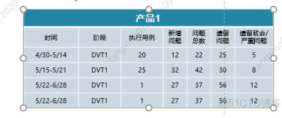
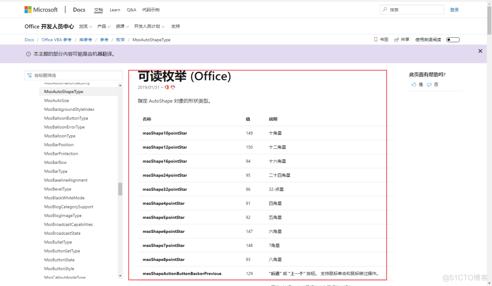
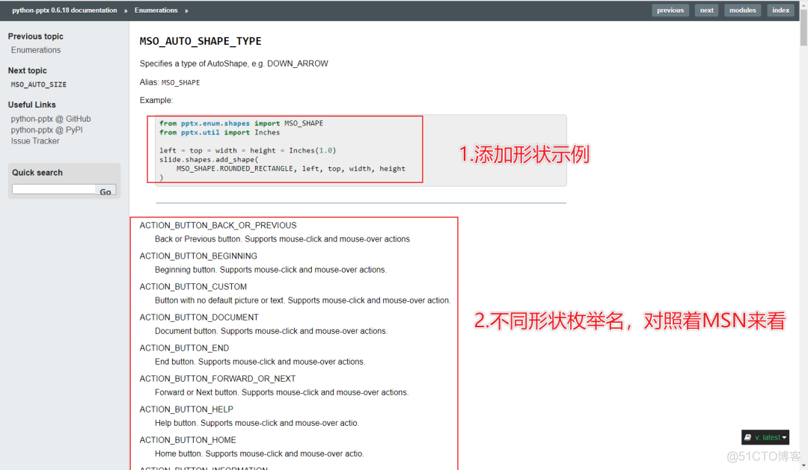

https://blog.51cto.com/python3/2950664

# python-pptx操作PPT

安装模块

```
pip install python-pptx
```

# 基础知识

## 获取PPT对象

```
from pptx import Presentation
# 打开PPT
ppt = Presentation('python-pptx 多页待删除模板.pptx')
# 新建PPT
ppt = Presentation()
```

## 获取PPT页

```
# PPT页数量
slides = ppt.slides  # PPT幻灯片集合
number_pages = len(slides)

# 第n_page+1张PPT页
slide = ppt.slides[n_page]
```

## 保存PPT

```
ppt.save('python-pptx 多页已删除模板.pptx')
```

## 删除PPT页

```
def del_slide(prs,index):
	# PPT页集合
    slides = list(prs.slides._sldIdLst)
    # 移除PPT页
    ppt.slides._sldIdLst.remove(slides[index])  # index从0开始
```

## 添加ppt页

```
slide = ppt.slides.add_slide(ppt.slide_layouts[0])  # 0代表幻灯片模板
```

## 添加文本框

```
from pptx.util import Cm
# 设置添加文字框的位置以及大小
# left:float,水平位置
# top:float,垂直位置
# width:float,宽度
# height:float,高度
left, top, width, height = Cm(16.9), Cm(3), Cm(12), Cm(3.6)
textBox = slide.shapes.add_textbox(left=left, top=top, width=width, height=height)
```

### 调整文本框背景颜色

```
# 调整文本框背景颜色
textBoxFill = textBox.fill
textBoxFill.solid()  # 纯色填充
textBoxFill.fore_color.rgb = RGBColor(187, 255, 255)  # 背景颜色
```

### 文本框边框样式调整

```
from pptx.dml.color import RGBColor
# 文本框边框样式调整
line = textBox.line
line.color.rgb = RGBColor(0, 255, 0)  # 颜色
line.width = Cm(0.1)  # 线宽
# RGB颜色参考：http://www.wahart.com.hk/rgb.htm
```

### 获取文本框对象

```
# 获取文本框对象
tf = textBox.text_frame
```

### 文本框文字样式调整

```
from pptx.enum.text import MSO_VERTICAL_ANCHOR
# 文本框样式调整
tf.margin_bottom = Cm(0.1)  # 下边距
tf.margin_left = 0  # 左边距
tf.vertical_anchor = MSO_VERTICAL_ANCHOR.BOTTOM  # 垂直方式（上下对齐方式）：底端对齐
tf.word_wrap = True  # 文本框的文字自动对齐

"""
垂直方式
TOP
	Aligns text to top of text frame and inherits its value from its layout placeholder or theme.
MIDDLE
	Centers text vertically
BOTTOM
	Aligns text to bottom of text frame
MIXED
	Return value only; indicates a combination of the other states.
"""
```

### 设置文本框内容

```
# 设置内容
tf.paragraphs[0].text = '这是一段文本框里的文字'
```

### 字体样式调整

```
from pptx.enum.text import PP_ALIGN
# 字体样式调整
tf.paragraphs[0].alignment = PP_ALIGN.CENTER  # 左右对齐方式
tf.paragraphs[0].font.name = '微软雅黑'  # 字体名称
tf.paragraphs[0].font.bold = True  # 是否加粗
tf.paragraphs[0].font.italic = True  # 是否斜体
tf.paragraphs[0].font.color.rgb = RGBColor(255, 0, 0)  # 字体颜色
tf.paragraphs[0].font.size = Pt(20)  # 字体大小

"""
文字对齐方式
 CENTER
  	Center align
  DISTRIBUTE
  	Evenly distributes e.g. Japanese characters from left to right within a line
  JUSTIFY
  	Justified, i.e. each line both begins and ends at the margin with spacing between words adjusted such that the line exactly fills the width of the paragraph.
  JUSTIFY_LOW
  	Justify using a small amount of space between words.
  LEFT
  	Left aligned
  RIGHT
  	Right aligned
  THAI_DISTRIBUTE
  	Thai distributed
  MIXED
  	Return value only; indicates multiple paragraph alignments are present in a set of paragraphs.
 """
```

## 添加表格

```
from pptx.util import Cm
# 设置添加文字框的位置以及大小
#number_rows:int,行数
#number_column:int 列数
# left:float,水平位置
# top:float,垂直位置
# width:float,宽度
# height:float,高度
left, top, width, height = Cm(16.9), Cm(3), Cm(12), Cm(3.6)
# 表格行列数，和大小
shape = slide.shapes.add_table(number_rows, number_column, left, top, width, height)
```

### 获取表格对象

```
table = shape.table
```

### 设置列宽

```
# 设置列宽
table.columns[0].width = Cm(3) # 0,第一列
```

### 设置行高

```
# 设置行高
table.rows[0].height = Cm(1)  # 0,第一行
```

### 行合并

```
# 合并首行
table.cell(0, 0).merge(table.cell(0, 6))  # cell(0, 0)第一行第一列，cell(0, 6)，第一行第七列
```

### 表格填写内容

```
table.cell(1, 0).text = "时间"  # cell(1, 0) 第二行第一列
```

利用循环，多个单元格填写

```
content_arr = [["4/30-5/14", "DVT1", "20", "12", "22", "25", "5"],
               ["5/15-5/21", "DVT1", "25", "32", "42", "30", "8"],
               ["5/22-6/28", "DVT1", "1", "27", "37", "56", "12"],
               ["5/22-6/28", "DVT1", "1", "27", "37", "56", "12"]]
          
 table.cell(rows, cols).text = content_arr[rows - 2][cols]
```

### 设置单元格字体样式

```
# 设置文字大小
table.cell(rows, cols).text_frame.paragraphs[0].font.size = Pt(15)
# 设置字体
table.cell(rows, cols).text_frame.paragraphs[0].font.name = '微软雅黑'
# 设置文字颜色
table.cell(rows, cols).text_frame.paragraphs[0].font.color.rgb = RGBColor(255, 255, 255)
# 设置文字左右对齐
table.cell(rows, cols).text_frame.paragraphs[0].alignment = PP_ALIGN.CENTER
# 设置文字上下对齐
table.cell(rows, cols).vertical_anchor = MSO_ANCHOR.MIDDLE
# 设置背景为填充
table.cell(rows, cols).fill.solid()
# 设置背景颜色
table.cell(rows, cols).fill.fore_color.rgb = RGBColor(34, 134, 165)
```

## 添加图表

其它图表可参考：https://www.cnblogs.com/adam012019/p/11348938.html

案例：折线图



```
from pptx.chart.data import ChartData
from pptx.enum.chart import XL_CHART_TYPE

# 初始化图表
chart_data = CategoryChartData()

# 填充需要添加的内容
content_arr = [["4/30-5/14", "DVT1", "20", "12", "22", "25", "5"],
               ["5/15-5/21", "DVT1", "25", "32", "42", "30", "8"],
               ["5/22-6/28", "DVT1", "1", "27", "37", "56", "12"],
               ["5/22-6/28", "DVT1", "1", "27", "37", "56", "12"]]

# 填充图表
	# x轴
chart_data.categories = [content_arr[0][0], content_arr[1][0], content_arr[2][0], content_arr[3][0]]
	# y轴数据
chart_data.add_series("问题总数", (content_arr[0][4], content_arr[1][4], content_arr[2][4], content_arr[3][4]))
chart_data.add_series("遗留问题总数", (content_arr[0][5], content_arr[1][5], content_arr[2][5], content_arr[3][5]))
chart_data.add_series("遗留致命严重\n问题总数", (content_arr[0][6], content_arr[1][6], content_arr[2][6], content_arr[3][6]))

# 设置位置
left, top, width, height = Cm(6), Cm(10), Cm(16.1), Cm(7.5)
# 添加图表,XL_CHART_TYPE.LINE 折线图 ，XL_CHART_TYPE.COLUMN_CLUSTERED 柱状图 ,PIE 饼状图
chart = slide.shapes.add_chart(
    XL_CHART_TYPE.LINE, left, top, width, height, chart_data
)
```

### 获取图表对象

```
chart = chart.chart
```

### 设置图表样式

```
# 图表是否含有标题，默认为False
chart.has_title = True
# 清除原标题
chart.chart_title.text_frame.clear() 

# 添加一行新标题
new_paragraph = chart.chart_title.text_frame.add_paragraph()
new_paragraph.text = '得分率对比' # 新标题
new_paragraph.font.size = Pt(15) # 新标题字体大小

# 轴标签
category_axis = chart.category_axis # category_axis 为chart的category控制类
category_axis.has_major_gridlines = True # 是否显示纵轴线
category_axis.tick_labels.font.italic = True # tick_labels为图表下标签，置为斜体
category_axis.tick_labels.font.size = Pt(15) # 下标签字体大小
category_axis.tick_labels.font.color.rgb = RGBColor(255, 0, 0) # 标签字体颜色

# 轴值
value_axis = chart.value_axis # value_axis 为chart的value控制类
value_axis.maximum_scale = 100.0 # 纵坐标最大值
value_axis.minimum_scale = 0.0 # 纵坐标最小值
value_axis.minor_tick_mark = XL_TICK_MARK.CROSS
value_axis.has_minor_gridlines = True

# 纵轴标签
tick_labels = value_axis.tick_labels # tick_labels 为chart的纵轴标签控制类
tick_labels.number_format = '0%' # 标签显示样式
tick_labels.font.bold = True # 字体加粗
tick_labels.font.size = Pt(14) # 字体大小
tick_labels.font.color.rgb = RGBColor(0, 255, 0) # 标签颜色

# 单个图表
plot = chart.plots[0] # 取图表中第一个plot
plot.has_data_labels = True # 是否显示数据标签
data_labels = plot.data_labels # 数据标签控制类
data_labels.font.size = Pt(13) # 字体大小
data_labels.font.color.rgb = RGBColor(0, 0, 255) # 字体颜色
data_labels.position = XL_LABEL_POSITION.INSIDE_END # 字体位置

# 
chart.has_legend = True # 是否含有下方的说明
chart.legend.position = XL_LEGEND_POSITION.BOTTOM
chart.legend.horz_offset = 0 # 说明位移量 [-1, 1] 默认为0

#
chart.plots[0].has_data_labels = True # 饼中是否写入数值
data_labels = chart.plots[0].data_labels
data_labels.number_format = '0%' # 数值显示格式
data_labels.position = XL_LABEL_POSITION.INSIDE_END # 数值布局方式
    
# 是否含有下方说明
chart.has_legend = True
chart.legend.include_in_layout = False
chart.series[0].smooth = True # 是否平滑
chart.font.size = Pt(10)  # 文字大小
```

## 添加形状

形状别名可以再这里查看：

https://docs.microsoft.com/zh-cn/office/vba/api/Office.MsoAutoShapeType



并对应这里，找到正确的枚举名：

https://python-pptx.readthedocs.io/en/latest/api/enum/MsoAutoShapeType.html#msoautoshapetype



```
from pptx.enum.shapes import MSO_AUTO_SHAPE_TYPE

# 添加矩形
# 设置位置以及大小
left, top, width, height = Cm(2.5), Cm(4.5), Cm(30), Cm(0.5)
# 添加形状
rectangle = slide.shapes.add_shape(MSO_AUTO_SHAPE_TYPE.RECTANGLE, left, top, width, height)
```

### 设置形状样式

```
# 设置背景填充
rectangle.fill.solid()
# 设置背景颜色
rectangle.fill.fore_color.rgb = RGBColor(34, 134, 165)
# 设置边框颜色
rectangle.line.color.rgb = RGBColor(34, 134, 165)
```

## 添加图片

```
# 设置待添加的图片
img_name  = 'seaborn生成的图片.png'
# 设置位置
left, top, width, height = Cm(6), Cm(6), Cm(20), Cm(9)
# 进行添加
slide.shapes.add_picture(image_file=img_name,left=left,top=top,width=width,height=height)

```

# 封装

## 20220806v1

```
# coding = utf-8
# 模块及版本要求：python-pptx, python==3.9版本，3.10报错
import sys
import time

from loguru import logger
from pptx import Presentation  # 创建PPT
from pptx.chart.data import CategoryChartData
from pptx.enum.chart import XL_CHART_TYPE
from pptx.enum.shapes import MSO_AUTO_SHAPE_TYPE
from pptx.util import Cm


class PptxModel(object):
    def __init__(self, file_path=None):
        """
        :param file_path: 打开PPT文件路径
        """
        self.file_path = file_path
        # 如果PPT路径为空，新建PPT
        if file_path == None:
            self.pptSel = Presentation()
        else:
            self.__open(self.file_path)

    # 打开文件
    def __open(self, file_path):
        try:
            self.pptSel = Presentation(file_path)
            logger.debug("文件打开成功")
            return "文件打开成功"
        except Exception as error:
            print(error)
            logger.critical(error)
            sys.exit(0)

    def __slide(self, n_page):
        # 获取需要添加文字的页面对象
        try:
            slide = self.pptSel.slides[n_page - 1]
        except Exception as e:
            logger.critical(e)
            sys.exit(0)
        return slide

    # 添加一页ppt
    def add_slide(self, index=0):
        """
        添加PPT幻灯片
        :param index: 选择对应的模板
        :return:
        """
        # 新建页面
        slide = self.pptSel.slides.add_slide(self.pptSel.slide_layouts[index])
        logger.info("ppt模板页{}已添加完成".format(index))
        return slide

    # 删除某一页ppt
    def del_slide(self, index):
        slides = list(self.pptSel.slides._sldIdLst)
        self.pptSel.slides._sldIdLst.remove(slides[index - 1])  # index从0开始
        logger.info("ppt页面{}已删除完成".format(index))

    # 添加文本框
    def add_textBox(self, n_page, left, top, width, height):
        """
        添加文本框
        :param n_page:int,需要添加文本框的页面，从1开始
        :param left:float,水平位置
        :param top:float,垂直位置
        :param width:float,宽度
        :param height:float,高度
        :return:返回文本框对象
        """
        # 获取需要添加文字的页面对象
        slide = self.__slide(n_page)
        # 设置添加文字框的位置以及大小
        left, top, width, height = Cm(left), Cm(top), Cm(width), Cm(height)
        # 添加文本框
        textBox = slide.shapes.add_textbox(left=left, top=top, width=width, height=height)

        logger.info("文本框添加完成")
        return textBox

    # 添加表格
    def add_table(self, n_page, number_rows, number_column, left, top, width, height):
        """
        添加表格
        :param n_page: int,需要添加文本框的页面，从1开始
        :param number_rows: int,行数
        :param number_column: int 列数
        :param left: float,水平位置
        :param top: float,垂直位置
        :param width: float,宽度
        :param height: float,高度
        :return: 返回表格对象
        """
        # 获取需要添加文字的页面对象
        slide = self.__slide(n_page)
        # 设置添加表格的位置以及大小
        left, top, width, height = Cm(left), Cm(top), Cm(width), Cm(height)
        # 添加表格
        shape = slide.shapes.add_table(number_rows, number_column, left, top, width, height)

        logger.info("表格添加完成")
        return shape

    # 添加图表
    def add_chart(self, n_page, left, top, width, height, content_arr, chart_type=XL_CHART_TYPE.LINE):
        """
        添加图表
        :param n_page: int,需要添加文本框的页面，从1开始
        ::param left: float,水平位置
        :param top: float,垂直位置
        :param width: float,宽度
        :param height: float,高度
        :param content_arr: DataFrame，数据结构，第一列为横轴坐标，第二列开始为纵轴数据
        :param chart_type:图表类型，默认XL_CHART_TYPE.LINE 折线图，XL_CHART_TYPE.COLUMN_CLUSTERED 柱状图
        :return:
        """
        # 获取需要添加文字的页面对象
        slide = self.__slide(n_page)
        # 图表初始化
        chart_data = CategoryChartData()
        # x轴
        chart_data.categories = content_arr.iloc[:, 0]
        # y轴
        columns_title = content_arr.columns.values.tolist()
        # 图表数据
        for i in range(1, len(columns_title)):
            chart_data.add_series(columns_title[i], tuple(content_arr[columns_title[i]].tolist()))
        # 设置添加表格的位置以及大小
        left, top, width, height = Cm(left), Cm(top), Cm(width), Cm(height)
        # 添加表格
        chart = slide.shapes.add_chart(chart_type, left, top, width, height, chart_data)

        logger.info("图表添加完成")
        return chart

    # 添加形状
    def add_shape(self, n_page, left, top, width, height, shape_type=MSO_AUTO_SHAPE_TYPE.RECTANGLE):
        """
        添加形状
        :param n_page: int,需要添加文本框的页面，从1开始
        ::param left: float,水平位置
        :param top: float,垂直位置
        :param width: float,宽度
        :param height: float,高度
        :param shape_type: 形状类型
        :return: 返回形状对象
        """
        # 获取需要添加形状的页面对象
        # 获取需要添加文字的页面对象
        slide = self.__slide(n_page)
        # 添加形状
        # 设置位置以及大小
        left, top, width, height = Cm(left), Cm(top), Cm(width), Cm(height)
        # 添加形状
        sp_ty = slide.shapes.add_shape(shape_type, left, top, width, height)

        logger.info("形状添加完成")
        return sp_ty

    # 添加图片
    def add_picture(self, n_page, left, top, width, height, img_file):
        """
        添加图片
         :param n_page: int,需要添加文本框的页面，从1开始
        ::param left: float,水平位置
        :param top: float,垂直位置
        :param width: float,宽度
        :param height: float,高度
        :param img_file: 添加图片路径
        :return: 返回图片对象
        """
        # 获取需要添加文字的页面对象
        slide = self.__slide(n_page)
        # 设置待添加的图片
        # img_file = 'seaborn生成的图片.png'
        # 设置位置
        left, top, width, height = Cm(left), Cm(top), Cm(width), Cm(height)
        # 进行添加
        picture = slide.shapes.add_picture(image_file=img_file, left=left, top=top, width=width, height=height)

        logger.info("图片添加完成")
        return picture

    # 保存
    def save(self, file=None):
        """
        保存PPT，如果保存路径 file=None,保存文件，否侧另存为file
        :param file: 保存路径
        :return:
        """
        try:
            if file == None:
                if self.file_path == None:
                    while True:
                        logger.critical("PPT文件名为空,文件未保存")
                        logger.info("""
                                ==========================================================
                                = 1、输入【0】结束程序
                                = 2、输入【文件保存路径及文件名字】保存文件
                                ==========================================================
                        """)
                        time.sleep(0.5)
                        file = input("请输入：\n")
                        if file == "0":
                            sys.exit(0)
                        else:
                            break
                else:
                    file = self.file_path
            self.pptSel.save(file)
            logger.info(f"文件已保存【{file}】")
        except Exception as e:
            logger.critical(e)


if __name__ == '__main__':
    path = r"D:\数据库\2022年项目\pythonProject_learning\OfficeAutomation\PPT\221.pptx"
    ppt = PptxModel(path)
    ppt.add_picture(2, 6, 10, 16.1, 7.5, "1.png")
    ppt.add_picture(3, 6, 10, 16.1, 7.5, "2.jpg")
    ppt.save()
```

