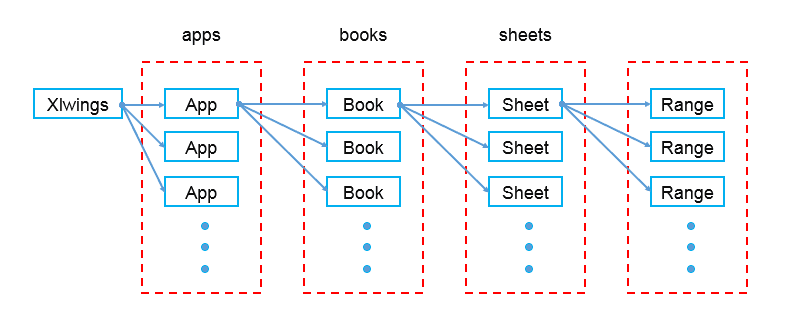

# **一、什么是xlwings模块**

1、xlwings是Python操作excel读写操作的第三方库

2、特色:  xlwings支持对xls和xlsx文件的读写，相对于其他第三方库xlrd,xlwd,openpyxl等效率高，可扩展性强。可以和matplotlib以及pandas无缝连接，也可以调用Excel文件中VBA写好的程序，和让VBA调用用Python写的程序。

# **二、如何使用**

## 1、安装

pip install xlwings

## 2、应用模式

对象》工作簿》工作表》表格内容



可以简单的理解，建立一个对象，就是打开一个excel程序，一个excel应用可以管理多个工作薄，一个工作薄中可以由多张表，一个表中有多个单元格

## **3、基本操作**

### 3.1 与pandas数据交互

- 转pandas数据格式

  ```python
  df = rang.options(pd.DataFrame, expand='table').value
  ```

  备注：A列数据为索引列，可使用reset_index()重置索引。

- pandas数据写入

  ```
  df = pd.DataFrame()
  sheet["A1"].value = df
  ```

### 3.2 打开excel文件

```python
import xlwings as xw    # 导入xlwings模块
app=xw.App(visible=True,add_book=False) #打开Excel程序，默认设置：程序可见，只打开不新建工作薄
app.display_alerts=True     # 关闭一些提示信息，可以加快运行速度。 默认为 True
app.screen_updating=True    # 更新显示工作表的内容。默认为 True。关闭它也可以提升运行速度。
filepath=r'D:\桌面\编程学习\st.xlsx'  # 文件位置：filepath
wb=app.books.open(filepath)     #打开filepath文档
wb.save()  #保存
wb.close() #关闭
app.quit() #结束程序
```

### 3.3 新建excel文件

新建Excel文档，命名为test.xlsx，并保存在D盘。

```python
import xlwings as xw    # 导入xlwings模块
app=xw.App(visible=True,add_book=False) #打开Excel程序，默认设置：程序可见，只打开不新建工作薄
wb=app.books.add()  #新建EXCEL工作簿
sheet = wb.sheets.add("sheet2")  #EXCEL工作簿，创建sheet2工作表
wb.save(r'D:\桌面\编程学习\test.xlsx')    #文档命名为test.xlsx，并保存到D:\桌面\编程学习
wb.close()  #关闭
app.quit()  #结束程序
```

### 3.4 单元格写入内容

```python
# 新建test.xlsx，在sheet1的第一个单元格输入 “人生” ，然后保存关闭，退出Excel程序。
import xlwings as xw
app=xw.App(visible=True,add_book=False)
wb=app.books.add()
# wb就是新建的工作簿(workbook)，下面则对wb的sheet1的A1单元格赋值
wb.sheets['sheet1'].range('A1').value='人生'
wb.save(r'D:\桌面\编程学习\est.xlsx')
wb.close()
app.quit()

# 打开已保存的test.xlsx，在sheet2的第二个单元格输入“苦短”，然后保存关闭，退出Excel程序
import xlwings as xw
app=xw.App(visible=True,add_book=False)
wb=app.books.open(r'D:\桌面\编程学习\est.xlsx')
# wb就是新建的工作簿(workbook)，下面则对wb的sheet2的A1单元格赋值
sht = wb.sheets[0]
sht2=wb.sheets.add('sheet2',after=sht)
wb.sheets['sheet2'].range('A1').value='苦短'
wb.save()
wb.close()
app.quit()
```

### 3.5 引用工作簿、工作表和单元格

```python
引用工作簿，注意工作簿应该首先被打开
wb=xw.books['工作簿的名字‘]
引用活动工作簿
wb=xw.books.active
引用工作簿中的sheet
sht=xw.books['工作簿的名字‘].sheets['sheet的名字']
# 或者
wb=xw.books['工作簿的名字']
sht=wb.sheets[sheet的名字]
引用活动sheet
sht=xw.sheets.active
引用A1单元格
rng=xw.books['工作簿的名字‘].sheets['sheet的名字']
# 或者
sht=xw.books['工作簿的名字‘].sheets['sheet的名字']
rng=sht.range('A1')
引用活动sheet上的单元格
# 注意Range首字母大写
rng=xw.Range('A1')
# 其中需要注意的是单元格的完全引用路径是：
# 第一个Excel程序的第一个工作薄的第一张sheet的第一个单元格
xw.apps[0].books[0].sheets[0].range('A1')
# 迅速引用单元格的方式是
sht=xw.books['名字'].sheets['名字']
# A1单元格
rng=sht[’A1']
# A1:B5单元格
rng=sht['A1:B5']
# 在第i+1行，第j+1列的单元格
# B1单元格
rng=sht[0,1]
# A1:J10
rng=sht[:10,:10]
PS： 对于单元格也可以用表示行列的tuple进行引用
# A1单元格的引用
xw.Range(1,1)
#A1:C3单元格的引用
xw.Range((1,1),(3,3))
```

### 3.6 储存数据

```python
储存单个值
# 注意".value“
sht.range('A1').value=1
储存列表
# 将列表[1,2,3]储存在A1：C1中
sht.range('A1').value=[1,2,3]
# 将列表[1,2,3]储存在A1:A3中
sht.range('A1').options(transpose=True).value=[1,2,3]
# 将2x2表格，即二维数组，储存在A1:B2中，如第一行1，2，第二行3，4
sht.range('A1').options(expand='table').value=[[1,2],[3,4]]
```

### 3.7 读取数据

```python
读取单个值
# 将A1的值，读取到a变量中
a=sht.range('A1').value
将值读取到列表中
#将A1到A2的值，读取到a列表中
a=sht.range('A1:A2').value
# 将第一行和第二行的数据按二维数组的方式读取
a=sht.range('A1:B2').value
```

### 3.8 常用api

#### 1、Book 工作簿常用的api

```python
wb=xw.books[‘工作簿名称']
wb.activate()激活为当前工作簿
wb.fullname 返回工作簿的绝对路径
wb.name 返回工作簿的名称
wb.save(path=None) 保存工作簿，默认路径为工作簿原路径，若未保存则为脚本所在的路径
wb. close() 关闭工作簿
            
# 新建工作簿
xw.books.add()
# 引用当前活动工作簿
xw.books.active
```

#### 2、sheet 常用的api

```python
# 引用某指定sheet
sht=xw.books['工作簿名称'].sheets['sheet的名称']
# 激活sheet为活动工作表
sht.activate()
# 清除sheet的内容和格式
sht.clear()
# 清除sheet的内容
sht.contents()
# 获取sheet的名称
sht.name
# 删除sheet
sht.delete

# 新建工作表
xw.sheets.add(name=None,before=None,after=None)
# 引用当前活动sheet
xw.sheets.active
```

#### 3、range常用的api

```python
# 引用当前活动工作表的单元格
rng=xw.Range('A1')
# 加入超链接
rng.add_hyperlink(r'www.baidu.com','百度',‘提示：点击即链接到百度')
# 取得当前range的地址
rng.address
rng.get_address()
# 清除range的内容
rng.clear_contents()
# 清除格式和内容
rng.clear()
# 取得range的背景色,以元组形式返回RGB值
rng.color
# 设置range的颜色
rng.color=(255,255,255)
# 清除range的背景色
rng.color=None
# 获得range的第一列列标
rng.column
# 返回range中单元格的数据
rng.count
# 返回current_region
rng.current_region
# 返回ctrl + 方向
rng.end('down')
# 获取公式或者输入公式
rng.formula='=SUM(B1:B5)'
# 数组公式
rng.formula_array
# 获得单元格的绝对地址
rng.get_address(row_absolute=True, column_absolute=True,include_sheetname=False, external=False)
# 获得列宽
rng.column_width
# 返回range的总宽度
rng.width
# 获得range的超链接
rng.hyperlink
# 获得range中右下角最后一个单元格
rng.last_cell
# range平移
rng.offset(row_offset=0,column_offset=0)
#range进行resize改变range的大小
rng.resize(row_size=None,column_size=None)
# range的第一行行标
rng.row
# 行的高度，所有行一样高返回行高，不一样返回None
rng.row_height
# 返回range的总高度
rng.height
# 返回range的行数和列数
rng.shape
# 返回range所在的sheet
rng.sheet
#返回range的所有行
rng.rows
# range的第一行
rng.rows[0]
# range的总行数
rng.rows.count
# 返回range的所有列
rng.columns
# 返回range的第一列
rng.columns[0]
# 返回range的列数
rng.columns.count
# 所有range的大小自适应
rng.autofit()
# 所有列宽度自适应
rng.columns.autofit()
# 所有行宽度自适应
rng.rows.autofit()
```

### 3.9 工作表中区域的选取

```python
# 选取第一列
rng = sht.range('A1').expand('down')

# 选取第一行
rng = sht.range('A1').expand('right')

# 选取表格连续区域
rng.sht.range('A1').expand('table')
```


```python
import xlwings as xw
import pandas as pd

app = xw.App(visible=False, add_book=False)  # 打开Excel程序，默认设置：程序可见，只打开不新建工作薄
app.display_alerts = False  # 关闭一些提示信息，可以加快运行速度。 默认为 True
app.screen_updating = False  # 更新显示工作表的内容。默认为 True。关闭它也可以提升运行速度。

wb = app.books.open("D:/桌面/2/室分产品服务费结算详单-河南省-电信-202311.xlsx")
new_workbook = app.books.add()
try:
    sheet = wb.sheets["202311"]
    rang = sheet.range("A1").expand('table')
    df = rang.options(pd.DataFrame, expand='table').value
    new_ = new_workbook.sheets.add("sheet2")
    new_.range((1, 1), rang.shape).api.NumberFormat = "@"
    new_["A1"].value = df
    new_workbook.save("data/3.xlsx")
except Exception as error:
    print(error)
finally:
    wb.close()  # 关闭
    app.quit()  # 结束程序
```

