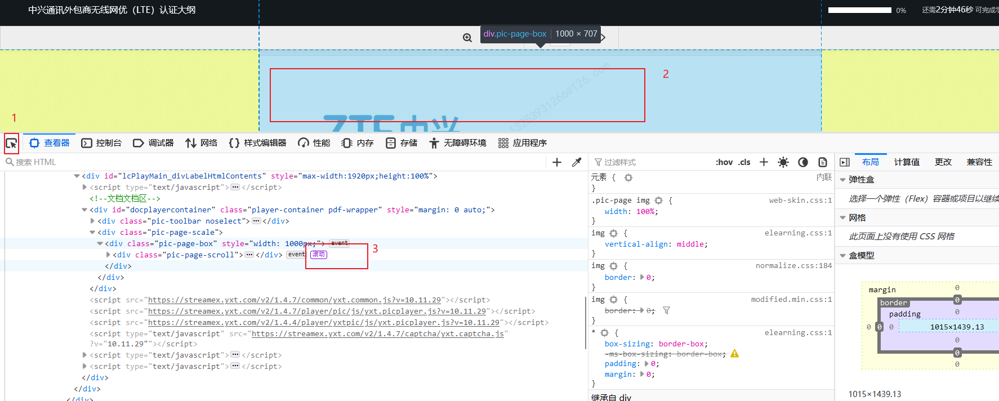
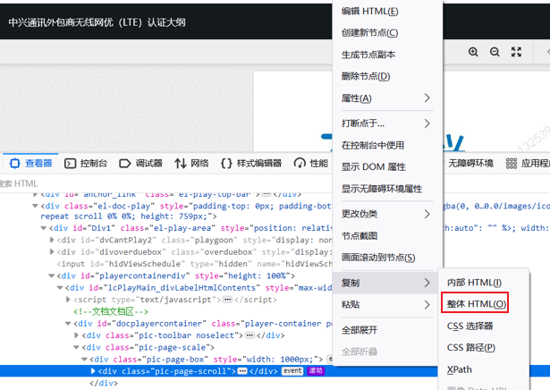

# 一、加载课件



## 二、复制网页源码



复制内容保存为html文件。

### 三、爬取课件并保存

爬虫代码：适用于非视频课件

```
import requests


import re

headers = {
    "User-Agent": "Mozilla/5.0 (Linux; Android 6.0; Nexus 5 Build/MRA58N) AppleWebKit/537.36 (KHTML, like Gecko) Chrome/91.0.4472.77 Mobile Safari/537.36 Edg/91.0.864.37"
    # "User-Agent": "Mozilla/5.0 (Windows NT 10.0; Win64; x64) AppleWebKit/537.36 (KHTML, like Gecko) Chrome/90.0.4430.93 Safari/537.36"
}

pattern = re.compile(r'id="(.*?)"></div>', re.I | re.M)  # 课件图片网址
t = open("1.html", "r", encoding='utf-8')
html = t.read()

result = pattern.findall(html)
print(result)
for png_name, png1 in result:
    # print(png_name, png1)
    png = png1.replace("amp;","")
    print(png_name, png)
    with open('D:/桌面/1/'+ png_name + '.png', 'wb') as v:
        try:
            v.write(requests.get(url = png, headers=headers).content)

        except Exception as e:
            print('download error')

```

