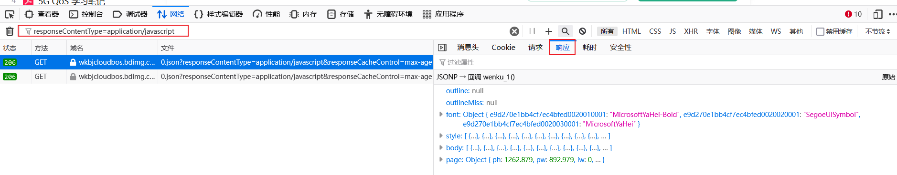

```
#!/usr/bin/env python
# -*- coding: utf-8 -*-
# @File    : 2.py
# @Time    : 2023/6/28 13:15
# @Author  : 978345836@qq.com
# @Software: win11 python3.9
# @Version : 1.0
# @Describe: 提取百度文库内容（WORD文档）

"""
程序说明：
    功能：
    1、通过浏览器抓取网页，网络-过滤URL关键词【responseContentType=application/javascript】，每页一个
    2、复制【响应】JSON数据至HEML文件，建议字典{“0”:"JSON数据",...}
    3、通过此脚本读取html文件，遍历数据写入TXT文件
"""

# here put the import lib

import json

with open("t11.html", "r", encoding="utf8") as f:
    t = f.read()

d = json.loads(t)

for c in d.keys():
    for i in d[c]['body']:
        with open("11.txt", "a", encoding="utf8") as f:
            if i['c'] == " ":
                f.writelines("\n")
            f.write(i['c'])
```

使用方法：

